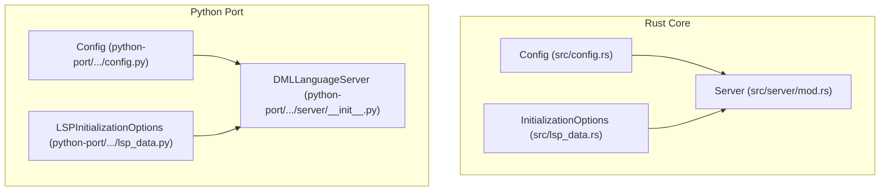
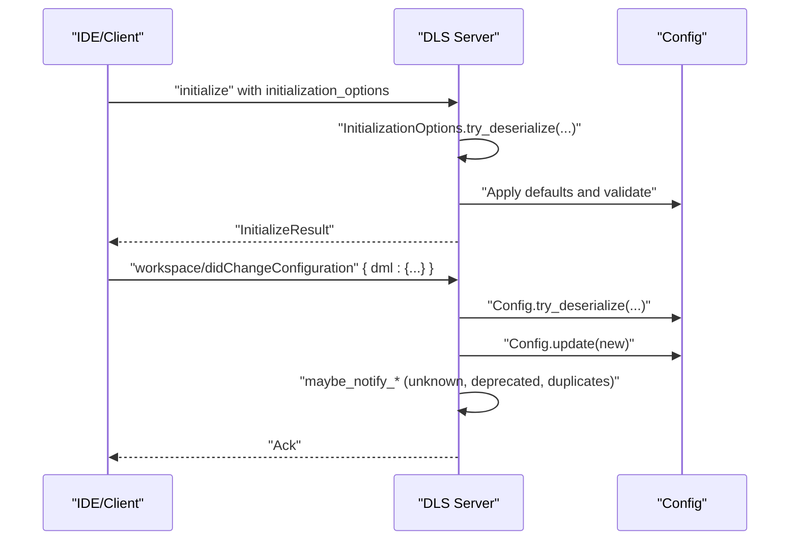
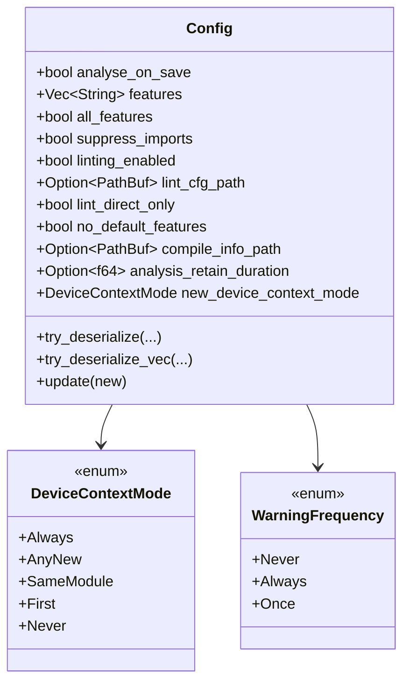
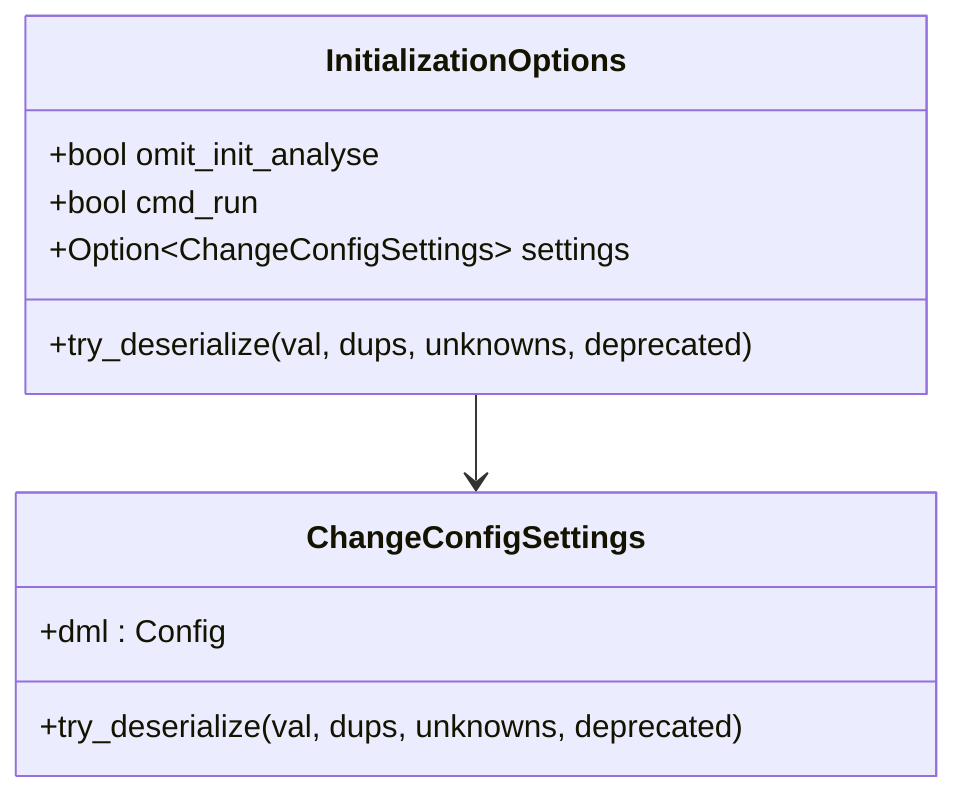
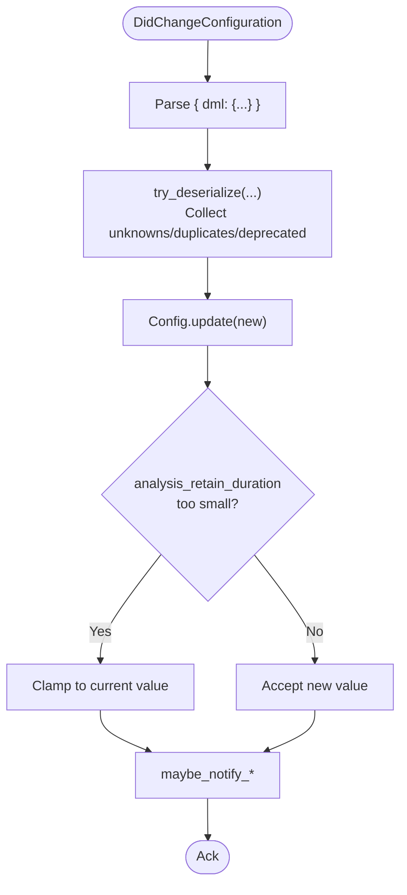
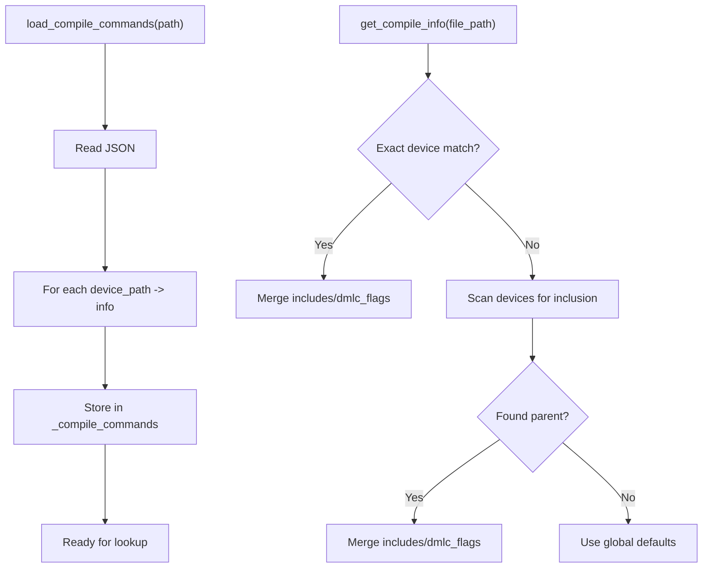
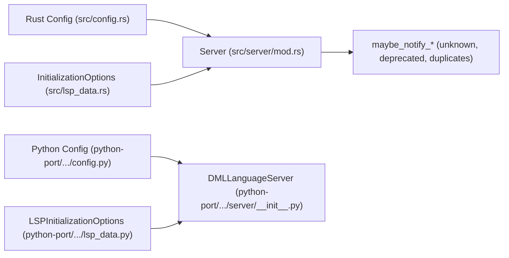

# Configuration Management

<cite>
**Referenced Files in This Document**
- [src/config.rs](file://src/config.rs)
- [src/lsp_data.rs](file://src/lsp_data.rs)
- [src/server/mod.rs](file://src/server/mod.rs)
- [python-port/dml_language_server/config.py](file://python-port/dml_language_server/config.py)
- [python-port/dml_language_server/lsp_data.py](file://python-port/dml_language_server/lsp_data.py)
- [python-port/dml_language_server/server/__init__.py](file://python-port/dml_language_server/server/__init__.py)
- [example_files/example_lint_cfg.json](file://example_files/example_lint_cfg.json)
- [python-port/examples/lint_config.json](file://python-port/examples/lint_config.json)
- [python-port/examples/compile_commands.json](file://python-port/examples/compile_commands.json)
- [src/main.rs](file://src/main.rs)
- [python-port/dml_language_server/main.py](file://python-port/dml_language_server/main.py)
</cite>

## Table of Contents
1. [Introduction](#introduction)
2. [Project Structure](#project-structure)
3. [Core Components](#core-components)
4. [Architecture Overview](#architecture-overview)
5. [Detailed Component Analysis](#detailed-component-analysis)
6. [Dependency Analysis](#dependency-analysis)
7. [Performance Considerations](#performance-considerations)
8. [Troubleshooting Guide](#troubleshooting-guide)
9. [Conclusion](#conclusion)
10. [Appendices](#appendices)

## Introduction
This document explains the dynamic configuration management system of the DML Language Server. It covers the configuration hierarchy from global settings to per-file overrides, LSP initialization options, and runtime configuration updates. It documents configuration file formats (compile_commands.json, lint configuration syntax), validation and defaults, deprecated option migration, and practical examples. It also addresses precedence rules, performance implications, and the configuration API for programmatic access and IDE integration.

## Project Structure
The configuration system spans both the Rust core and the Python port:
- Rust core defines the canonical configuration model, validation, and runtime update semantics.
- Python port mirrors configuration concerns for LSP initialization options, compile_commands.json, and lint configuration, and integrates them into the Python server.

**Diagram sources**
- [src/config.rs](file://src/config.rs#L120-L225)
- [src/lsp_data.rs](file://src/lsp_data.rs#L282-L311)
- [src/server/mod.rs](file://src/server/mod.rs#L68-L84)
- [python-port/dml_language_server/config.py](file://python-port/dml_language_server/config.py#L89-L311)
- [python-port/dml_language_server/lsp_data.py](file://python-port/dml_language_server/lsp_data.py#L334-L358)
- [python-port/dml_language_server/server/__init__.py](file://python-port/dml_language_server/server/__init__.py#L49-L121)

**Section sources**
- [src/config.rs](file://src/config.rs#L1-L319)
- [src/lsp_data.rs](file://src/lsp_data.rs#L240-L311)
- [src/server/mod.rs](file://src/server/mod.rs#L68-L84)
- [python-port/dml_language_server/config.py](file://python-port/dml_language_server/config.py#L1-L311)
- [python-port/dml_language_server/lsp_data.py](file://python-port/dml_language_server/lsp_data.py#L1-L358)
- [python-port/dml_language_server/server/__init__.py](file://python-port/dml_language_server/server/__init__.py#L1-L399)

## Core Components
- Canonical configuration model and validation:
  - Defines configuration fields, default values, and validation behavior.
  - Supports snake_case normalization, duplicate detection, unknown field reporting, and deprecation notices.
- LSP initialization options:
  - Rust: typed initialization options with camelCase deserialization and optional upfront settings.
  - Python: typed initialization options mirroring Rust fields.
- Runtime configuration updates:
  - Change notification handling and update semantics with safeguards (e.g., minimum retention duration).
- Configuration files:
  - compile_commands.json: per-device include paths and compiler flags.
  - Lint configuration: enable/disable rules and rule-specific settings.

Key implementation references:
- Configuration model and validation: [src/config.rs](file://src/config.rs#L120-L225), [src/config.rs](file://src/config.rs#L232-L296)
- Runtime update and safeguards: [src/config.rs](file://src/config.rs#L298-L312)
- LSP initialization options (Rust): [src/lsp_data.rs](file://src/lsp_data.rs#L282-L311)
- LSP initialization options (Python): [python-port/dml_language_server/lsp_data.py](file://python-port/dml_language_server/lsp_data.py#L334-L358)
- Python compile_commands loader: [python-port/dml_language_server/config.py](file://python-port/dml_language_server/config.py#L131-L164)
- Python lint config loader: [python-port/dml_language_server/config.py](file://python-port/dml_language_server/config.py#L240-L257)

**Section sources**
- [src/config.rs](file://src/config.rs#L120-L225)
- [src/config.rs](file://src/config.rs#L232-L296)
- [src/config.rs](file://src/config.rs#L298-L312)
- [src/lsp_data.rs](file://src/lsp_data.rs#L282-L311)
- [python-port/dml_language_server/lsp_data.py](file://python-port/dml_language_server/lsp_data.py#L334-L358)
- [python-port/dml_language_server/config.py](file://python-port/dml_language_server/config.py#L131-L164)
- [python-port/dml_language_server/config.py](file://python-port/dml_language_server/config.py#L240-L257)

## Architecture Overview
The configuration lifecycle:
- Initialization: LSP initialize request carries initialization options and optional upfront settings.
- Startup: Server validates and normalizes configuration, reports unknown/deprecated/duplicated keys.
- Runtime: Change notifications update configuration with safeguards; server reacts to changes.
- Per-file behavior: compile_commands.json and lint configuration inform analysis and diagnostics.

**Diagram sources**
- [src/lsp_data.rs](file://src/lsp_data.rs#L282-L311)
- [src/lsp_data.rs](file://src/lsp_data.rs#L240-L276)
- [src/config.rs](file://src/config.rs#L232-L296)
- [src/config.rs](file://src/config.rs#L298-L312)
- [src/server/mod.rs](file://src/server/mod.rs#L207-L289)
- [src/server/mod.rs](file://src/server/mod.rs#L109-L205)

## Detailed Component Analysis

### Configuration Model and Validation
- Fields and defaults:
  - Global toggles and lists (features, suppress_imports, etc.).
  - Paths for compile info and lint configuration.
  - Retention duration for analysis caching.
  - Device context activation mode.
- Validation and normalization:
  - Snake_case normalization of keys.
  - Duplicate key detection and reporting.
  - Unknown key collection and reporting.
  - Deprecation tracking and warnings.
- Update semantics:
  - Safeguards against overly aggressive analysis retention settings.
  - Full replacement of configuration on update.

**Diagram sources**
- [src/config.rs](file://src/config.rs#L120-L225)
- [src/config.rs](file://src/config.rs#L100-L118)
- [src/config.rs](file://src/config.rs#L141-L146)

**Section sources**
- [src/config.rs](file://src/config.rs#L120-L225)
- [src/config.rs](file://src/config.rs#L232-L296)
- [src/config.rs](file://src/config.rs#L298-L312)

### LSP Initialization Options
- Rust:
  - camelCase deserialization.
  - Optional upfront settings payload under initialization options.
- Python:
  - Mirrors Rust fields for compile_commands_dir/file, linting_enabled, lint_config_file, max_diagnostics_per_file, log_level.

**Diagram sources**
- [src/lsp_data.rs](file://src/lsp_data.rs#L282-L311)
- [src/lsp_data.rs](file://src/lsp_data.rs#L240-L276)

**Section sources**
- [src/lsp_data.rs](file://src/lsp_data.rs#L282-L311)
- [src/lsp_data.rs](file://src/lsp_data.rs#L240-L276)
- [python-port/dml_language_server/lsp_data.py](file://python-port/dml_language_server/lsp_data.py#L334-L358)

### Runtime Configuration Updates
- Change notification handling:
  - Extracts the "dml" subtree and deserializes into Config.
  - Reports unknown, duplicated, and deprecated keys.
- Update behavior:
  - Validates and applies new configuration.
  - Enforces minimum analysis retention duration.

**Diagram sources**
- [src/lsp_data.rs](file://src/lsp_data.rs#L240-L276)
- [src/config.rs](file://src/config.rs#L232-L296)
- [src/config.rs](file://src/config.rs#L298-L312)
- [src/server/mod.rs](file://src/server/mod.rs#L109-L205)

**Section sources**
- [src/lsp_data.rs](file://src/lsp_data.rs#L240-L276)
- [src/config.rs](file://src/config.rs#L298-L312)
- [src/server/mod.rs](file://src/server/mod.rs#L109-L205)

### Configuration File Formats

#### compile_commands.json
- Purpose: Per-device compilation metadata for include paths and compiler flags.
- Structure:
  - Device path (absolute) as key.
  - Object with "includes" array and "dmlc_flags" array.
- Behavior:
  - Python loader reads and stores per-device entries.
  - Lookup considers exact device match and parent-device inclusion heuristics.

**Diagram sources**
- [python-port/dml_language_server/config.py](file://python-port/dml_language_server/config.py#L131-L164)
- [python-port/dml_language_server/config.py](file://python-port/dml_language_server/config.py#L165-L224)

**Section sources**
- [python-port/dml_language_server/config.py](file://python-port/dml_language_server/config.py#L131-L164)
- [python-port/dml_language_server/config.py](file://python-port/dml_language_server/config.py#L165-L224)
- [python-port/examples/compile_commands.json](file://python-port/examples/compile_commands.json#L1-L14)

#### Lint Configuration
- Example formats:
  - Rust example: [example_files/example_lint_cfg.json](file://example_files/example_lint_cfg.json#L1-L23)
  - Python example: [python-port/examples/lint_config.json](file://python-port/examples/lint_config.json#L1-L25)
- Behavior:
  - Python loader supports enabling/disabling rules and rule-specific configs.
  - Lint engine uses configuration to produce diagnostics.

**Section sources**
- [example_files/example_lint_cfg.json](file://example_files/example_lint_cfg.json#L1-L23)
- [python-port/examples/lint_config.json](file://python-port/examples/lint_config.json#L1-L25)
- [python-port/dml_language_server/config.py](file://python-port/dml_language_server/config.py#L240-L257)

### Configuration API and IDE Integration
- Programmatic access:
  - Rust: Config is owned by the server context and updated via change notifications.
  - Python: Config class exposes setters and loaders for compile_commands and lint config; initialization options are applied during server initialization.
- IDE integration:
  - Initialization options are passed in the LSP initialize request.
  - Diagnostics are limited per file via initialization options.

**Section sources**
- [src/server/mod.rs](file://src/server/mod.rs#L68-L84)
- [src/lsp_data.rs](file://src/lsp_data.rs#L282-L311)
- [python-port/dml_language_server/server/__init__.py](file://python-port/dml_language_server/server/__init__.py#L73-L121)
- [python-port/dml_language_server/config.py](file://python-port/dml_language_server/config.py#L116-L129)

## Dependency Analysis
- Rust core depends on:
  - LSP types for initialization options and change notifications.
  - Logging for emitting warnings about unknown/deprecated/duplicated keys.
- Python port depends on:
  - pygls for LSP server implementation.
  - Local configuration classes for compile_commands and lint configuration.

**Diagram sources**
- [src/config.rs](file://src/config.rs#L120-L225)
- [src/server/mod.rs](file://src/server/mod.rs#L109-L205)
- [src/lsp_data.rs](file://src/lsp_data.rs#L282-L311)
- [python-port/dml_language_server/config.py](file://python-port/dml_language_server/config.py#L89-L311)
- [python-port/dml_language_server/server/__init__.py](file://python-port/dml_language_server/server/__init__.py#L49-L121)
- [python-port/dml_language_server/lsp_data.py](file://python-port/dml_language_server/lsp_data.py#L334-L358)

**Section sources**
- [src/server/mod.rs](file://src/server/mod.rs#L109-L205)
- [src/lsp_data.rs](file://src/lsp_data.rs#L282-L311)
- [python-port/dml_language_server/server/__init__.py](file://python-port/dml_language_server/server/__init__.py#L73-L121)

## Performance Considerations
- Analysis retention duration:
  - The server enforces a minimum retention threshold to avoid discarding dependent analyses prematurely.
- Diagnostics cap:
  - Maximum diagnostics per file can be controlled via initialization options to bound client-side rendering overhead.
- File lookup complexity:
  - compile_commands.json lookup scales with number of registered devices; consider organizing devices to minimize scans.

[No sources needed since this section provides general guidance]

## Troubleshooting Guide
Common issues and resolutions:
- Unknown configuration keys:
  - The server logs unknown keys encountered during change notifications.
- Deprecated configuration keys:
  - Deprecation notices are emitted with optional guidance.
- Duplicated configuration keys:
  - Snake-case normalization can collapse multiple variants; server warns about duplicates.
- Invalid lint configuration fields:
  - Unknown lint fields are reported as errors and ignored.

Operational tips:
- Validate configuration payloads before applying them.
- Prefer camelCase in initialization options and snake_case in change notifications for consistency.
- Keep compile_commands.json concise and accurate to reduce lookup overhead.

**Section sources**
- [src/server/mod.rs](file://src/server/mod.rs#L109-L205)
- [src/config.rs](file://src/config.rs#L232-L296)

## Conclusion
The DML Language Server implements a robust, validated configuration system with clear precedence and safety checks. It supports LSP initialization options, runtime updates, and external configuration files for compilation and linting. The design balances flexibility with safety, emitting actionable warnings for invalid or deprecated settings and enforcing sensible defaults and thresholds.

[No sources needed since this section summarizes without analyzing specific files]

## Appendices

### Configuration Precedence and Hierarchy
- Initialization options:
  - Provided during LSP initialize; can include upfront settings payload.
- Runtime configuration:
  - Applied via change notifications; replaces previous settings with validation and safeguards.
- File-level configuration:
  - compile_commands.json and lint configuration files are loaded from initialization options and used to tailor analysis per device and per file.

**Section sources**
- [src/lsp_data.rs](file://src/lsp_data.rs#L282-L311)
- [src/lsp_data.rs](file://src/lsp_data.rs#L240-L276)
- [python-port/dml_language_server/server/__init__.py](file://python-port/dml_language_server/server/__init__.py#L87-L105)
- [python-port/dml_language_server/config.py](file://python-port/dml_language_server/config.py#L131-L164)
- [python-port/dml_language_server/config.py](file://python-port/dml_language_server/config.py#L240-L257)

### Practical Examples
- Lint configuration:
  - See [example_files/example_lint_cfg.json](file://example_files/example_lint_cfg.json#L1-L23) and [python-port/examples/lint_config.json](file://python-port/examples/lint_config.json#L1-L25).
- compile_commands.json:
  - See [python-port/examples/compile_commands.json](file://python-port/examples/compile_commands.json#L1-L14).
- Initialization options:
  - Rust: [src/lsp_data.rs](file://src/lsp_data.rs#L282-L311)
  - Python: [python-port/dml_language_server/lsp_data.py](file://python-port/dml_language_server/lsp_data.py#L334-L358)

### Command-Line Integration
- CLI flags:
  - Rust: [src/main.rs](file://src/main.rs#L29-L42)
  - Python: [python-port/dml_language_server/main.py](file://python-port/dml_language_server/main.py#L25-L51)