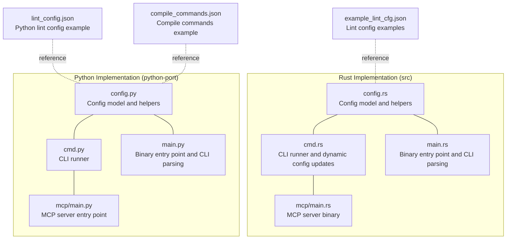
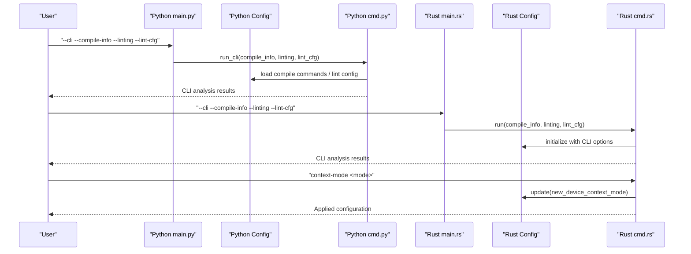
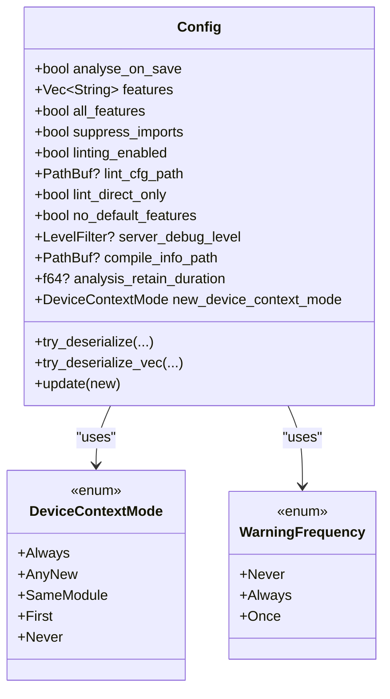
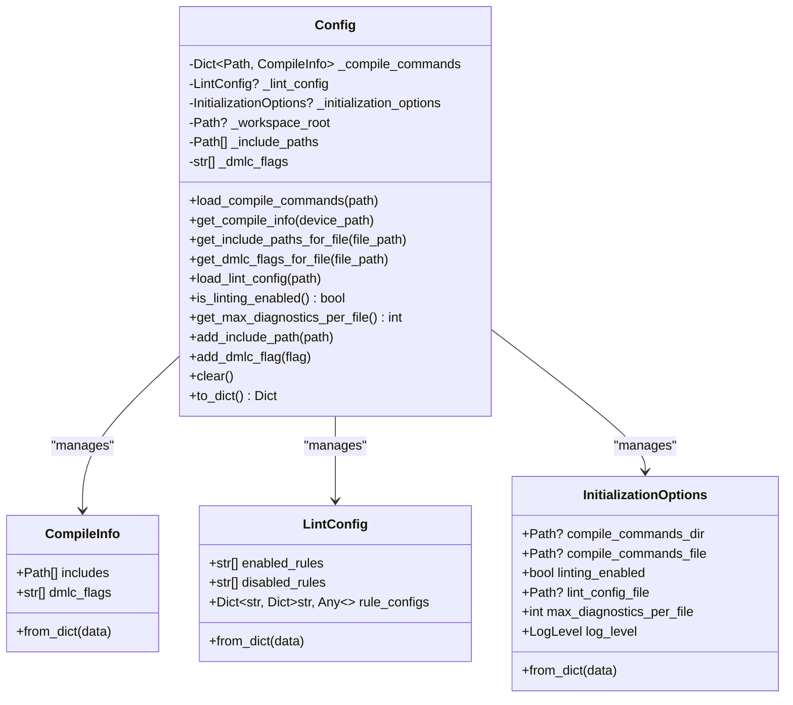
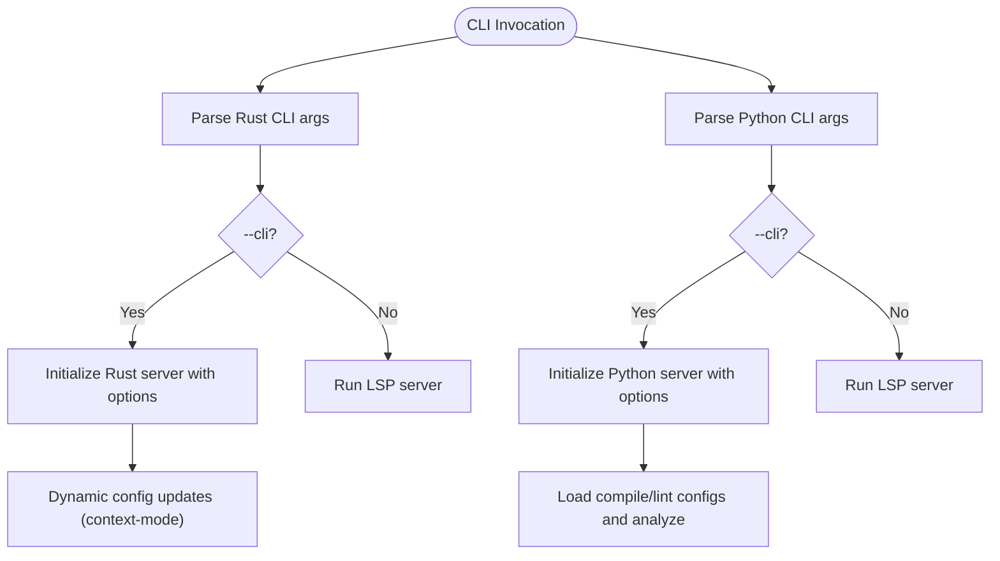
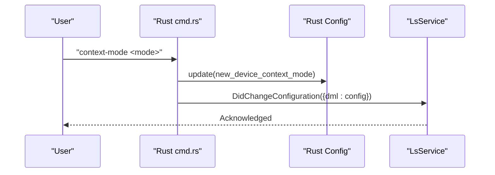
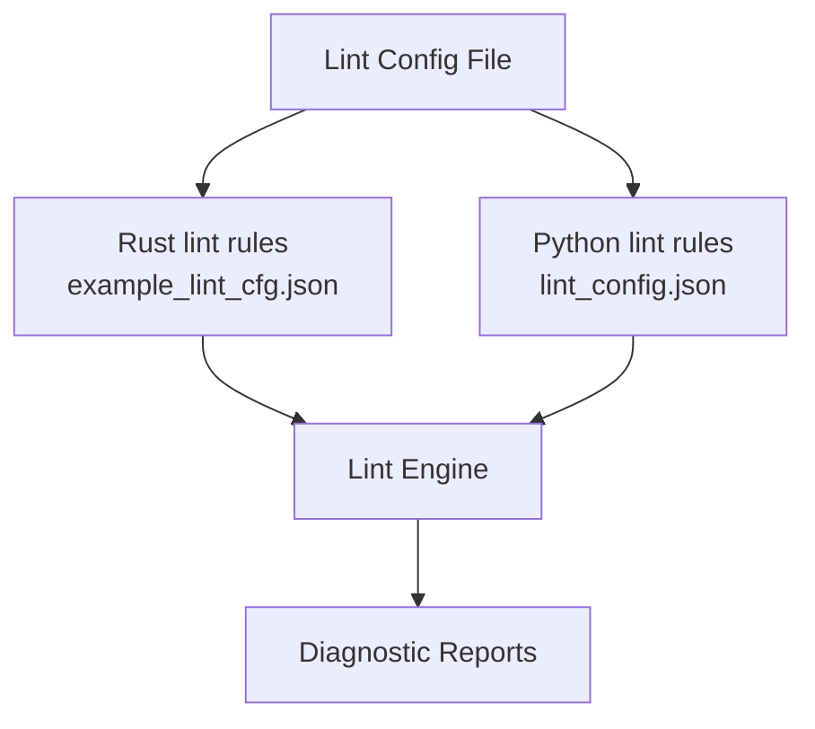
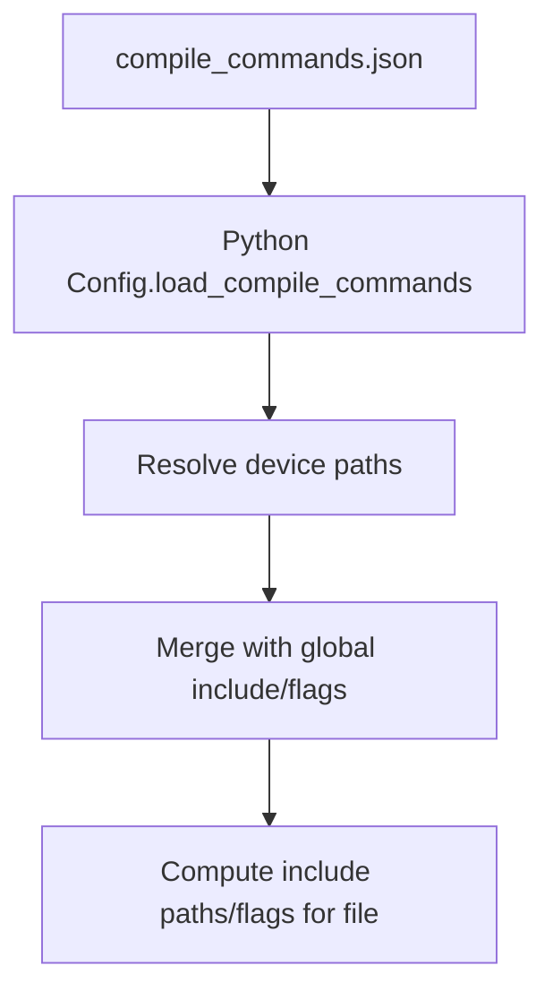
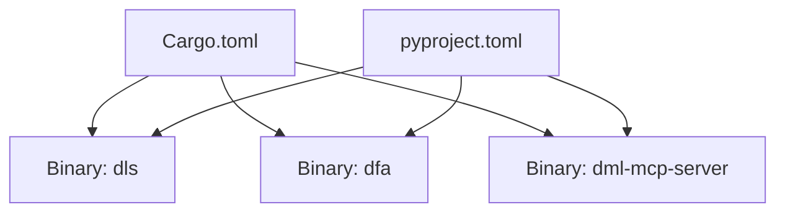

# Configuration Management

<cite>
**Referenced Files in This Document**
- [config.py](file://python-port/dml_language_server/config.py)
- [cmd.py](file://python-port/dml_language_server/cmd.py)
- [main.py](file://python-port/dml_language_server/main.py)
- [config.rs](file://src/config.rs)
- [cmd.rs](file://src/cmd.rs)
- [main.rs](file://src/main.rs)
- [example_lint_cfg.json](file://example_files/example_lint_cfg.json)
- [lint_config.json](file://python-port/examples/lint_config.json)
- [compile_commands.json](file://python-port/examples/compile_commands.json)
- [mcp_main.py](file://python-port/dml_language_server/mcp/main.py)
- [mcp_main.rs](file://src/mcp/main.rs)
- [Cargo.toml](file://Cargo.toml)
- [pyproject.toml](file://python-port/pyproject.toml)
</cite>

## Table of Contents
1. [Introduction](#introduction)
2. [Project Structure](#project-structure)
3. [Core Components](#core-components)
4. [Architecture Overview](#architecture-overview)
5. [Detailed Component Analysis](#detailed-component-analysis)
6. [Dependency Analysis](#dependency-analysis)
7. [Performance Considerations](#performance-considerations)
8. [Troubleshooting Guide](#troubleshooting-guide)
9. [Conclusion](#conclusion)
10. [Appendices](#appendices)

## Introduction
This document explains the configuration management system for the DML Language Server across both the Rust and Python implementations. It covers:
- Server configuration and runtime settings
- Command-line argument processing
- Lint configuration file format and per-rule settings
- Compile commands structure and per-device settings
- Configuration precedence, environment integration, and defaults
- Validation, error reporting, and dynamic updates
- Relationship among server configuration, lint settings, and MCP tool configuration

## Project Structure
The configuration system spans two implementations:
- Rust implementation under src/, including configuration models, CLI, and MCP server
- Python implementation under python-port/, including configuration classes, CLI, MCP server, and example files

**Diagram sources**
- [config.rs](file://src/config.rs#L120-L321)
- [cmd.rs](file://src/cmd.rs#L46-L402)
- [main.rs](file://src/main.rs#L21-L60)
- [mcp_main.rs](file://src/mcp/main.rs#L11-L23)
- [config.py](file://python-port/dml_language_server/config.py#L89-L311)
- [cmd.py](file://python-port/dml_language_server/cmd.py#L21-L162)
- [main.py](file://python-port/dml_language_server/main.py#L25-L106)
- [mcp_main.py](file://python-port/dml_language_server/mcp/main.py#L98-L166)
- [example_lint_cfg.json](file://example_files/example_lint_cfg.json#L1-L28)
- [lint_config.json](file://python-port/examples/lint_config.json#L1-L25)
- [compile_commands.json](file://python-port/examples/compile_commands.json#L1-L14)

**Section sources**
- [config.rs](file://src/config.rs#L120-L321)
- [config.py](file://python-port/dml_language_server/config.py#L89-L311)
- [cmd.rs](file://src/cmd.rs#L46-L402)
- [cmd.py](file://python-port/dml_language_server/cmd.py#L21-L162)
- [main.rs](file://src/main.rs#L21-L60)
- [main.py](file://python-port/dml_language_server/main.py#L25-L106)
- [mcp_main.rs](file://src/mcp/main.rs#L11-L23)
- [mcp_main.py](file://python-port/dml_language_server/mcp/main.py#L98-L166)
- [example_lint_cfg.json](file://example_files/example_lint_cfg.json#L1-L28)
- [lint_config.json](file://python-port/examples/lint_config.json#L1-L25)
- [compile_commands.json](file://python-port/examples/compile_commands.json#L1-L14)

## Core Components
- Rust Config model: Defines configurable fields, default values, and merging behavior for server-side settings.
- Python Config class: Manages compile commands, lint configuration, initialization options, and runtime settings.
- CLI parsers: Parse command-line arguments and pass them to the respective runners.
- Dynamic configuration updates: Rust CLI supports runtime updates via DidChangeConfiguration messages.
- MCP server configuration: Both implementations support MCP-based tooling and can load compile commands.

Key responsibilities:
- Precedence and defaults: Defaults are defined in the Rust Config model; Python Config applies sensible defaults and logs invalid values.
- Validation and error reporting: Parsing and merging routines report unknown/deprecated keys and enforce constraints.
- Environment integration: Logging levels and filters are controlled via configuration and environment variables.

**Section sources**
- [config.rs](file://src/config.rs#L120-L321)
- [config.py](file://python-port/dml_language_server/config.py#L89-L311)
- [cmd.rs](file://src/cmd.rs#L276-L297)
- [cmd.py](file://python-port/dml_language_server/cmd.py#L21-L162)
- [main.rs](file://src/main.rs#L21-L60)
- [main.py](file://python-port/dml_language_server/main.py#L25-L106)

## Architecture Overview
The configuration system integrates CLI parsing, configuration models, and runtime updates across implementations.

**Diagram sources**
- [main.py](file://python-port/dml_language_server/main.py#L52-L84)
- [cmd.py](file://python-port/dml_language_server/cmd.py#L21-L115)
- [config.py](file://python-port/dml_language_server/config.py#L131-L287)
- [main.rs](file://src/main.rs#L44-L59)
- [cmd.rs](file://src/cmd.rs#L46-L402)
- [config.rs](file://src/config.rs#L120-L321)

## Detailed Component Analysis

### Rust Configuration Model (config.rs)
- Fields include linting enablement, lint configuration path, compile info path, analysis retention duration, device context modes, and server debug level.
- Default values are provided; unknown keys are captured and reported during deserialization.
- Merging behavior enforces minimum analysis retention duration and prevents overriding specified values with inferred ones.

**Diagram sources**
- [config.rs](file://src/config.rs#L120-L321)

**Section sources**
- [config.rs](file://src/config.rs#L120-L321)

### Python Configuration Model (config.py)
- CompileInfo: per-device include paths and compiler flags.
- LintConfig: lists of enabled/disabled rules and per-rule configurations.
- InitializationOptions: LSP initialization options including compile commands, linting enablement, lint config file, diagnostics limit, and log level.
- Config: central manager for compile commands, lint config, initialization options, and runtime settings. Includes methods to load compile commands and lint configs, compute include paths and flags, and apply log level.

**Diagram sources**
- [config.py](file://python-port/dml_language_server/config.py#L27-L311)

**Section sources**
- [config.py](file://python-port/dml_language_server/config.py#L27-L311)

### Command-Line Argument Processing
- Rust:
  - CLI options parsed by Clap: --cli, --compile-info, --linting, --lint-cfg.
  - In CLI mode, the runner initializes the server with provided options and handles dynamic configuration updates via DidChangeConfiguration.
- Python:
  - CLI options handled by Click: --cli, --compile-info, --linting/--no-linting, --lint-cfg, --verbose.
  - In CLI mode, the runner loads compile commands and lint config (if provided) and performs analysis.

**Diagram sources**
- [main.rs](file://src/main.rs#L21-L60)
- [cmd.rs](file://src/cmd.rs#L46-L402)
- [main.py](file://python-port/dml_language_server/main.py#L25-L106)
- [cmd.py](file://python-port/dml_language_server/cmd.py#L21-L162)

**Section sources**
- [main.rs](file://src/main.rs#L21-L60)
- [cmd.rs](file://src/cmd.rs#L46-L402)
- [main.py](file://python-port/dml_language_server/main.py#L25-L106)
- [cmd.py](file://python-port/dml_language_server/cmd.py#L21-L162)

### Runtime Settings Management and Dynamic Updates
- Rust CLI supports setting device context mode dynamically, updating the active configuration and emitting a DidChangeConfiguration notification.
- The update routine enforces a minimum analysis retention duration to prevent premature discards.

**Diagram sources**
- [cmd.rs](file://src/cmd.rs#L276-L297)
- [config.rs](file://src/config.rs#L300-L314)

**Section sources**
- [cmd.rs](file://src/cmd.rs#L276-L297)
- [config.rs](file://src/config.rs#L300-L314)

### Lint Configuration File Format
- Rust lint configuration:
  - Example file demonstrates rule-specific settings and a flag to annotate lints.
- Python lint configuration:
  - Example file shows enabled/disabled rules and per-rule configurations (e.g., indentation size, severity levels, enforcement flags).

**Diagram sources**
- [example_lint_cfg.json](file://example_files/example_lint_cfg.json#L1-L28)
- [lint_config.json](file://python-port/examples/lint_config.json#L1-L25)

**Section sources**
- [example_lint_cfg.json](file://example_files/example_lint_cfg.json#L1-L28)
- [lint_config.json](file://python-port/examples/lint_config.json#L1-L25)

### Compile Commands Structure
- Python compile commands file defines per-device include paths and compiler flags.
- Python Config loads and resolves device paths, merges per-device settings with global defaults, and computes include paths and flags for a given file.

**Diagram sources**
- [compile_commands.json](file://python-port/examples/compile_commands.json#L1-L14)
- [config.py](file://python-port/dml_language_server/config.py#L131-L224)

**Section sources**
- [compile_commands.json](file://python-port/examples/compile_commands.json#L1-L14)
- [config.py](file://python-port/dml_language_server/config.py#L131-L224)

### Per-Module Settings
- Python Config associates compile commands with device files and considers parent device relationships to determine effective include paths and flags.
- Rust Config exposes compile_info_path for server-wide compile information.

**Section sources**
- [config.py](file://python-port/dml_language_server/config.py#L165-L238)
- [config.rs](file://src/config.rs#L137-L137)

### Configuration Precedence Rules
- Rust:
  - Unknown and duplicate keys are detected during deserialization; deprecated keys are tracked.
  - Merging preserves specified values and enforces minimum analysis retention.
- Python:
  - Initialization options override defaults; invalid log level values are logged with a warning.
  - Per-device compile commands take precedence over global include paths and flags when present.

**Section sources**
- [config.rs](file://src/config.rs#L234-L298)
- [config.py](file://python-port/dml_language_server/config.py#L69-L130)
- [config.py](file://python-port/dml_language_server/config.py#L165-L238)

### Environment Variable Integration
- Rust MCP server binary initializes logging via env_logger with a default filter derived from the environment.
- Python MCP server sets up logging to stderr by default, avoiding interference with MCP protocol output on stdout.

**Section sources**
- [mcp_main.rs](file://src/mcp/main.rs#L11-L23)
- [mcp_main.py](file://python-port/dml_language_server/mcp/main.py#L122-L138)

### Default Value Handling
- Rust Config provides comprehensive defaults for all fields, ensuring predictable behavior when options are omitted.
- Python Config applies defaults for initialization options and logging level, and logs invalid values instead of crashing.

**Section sources**
- [config.rs](file://src/config.rs#L209-L227)
- [config.py](file://python-port/dml_language_server/config.py#L69-L86)

### Examples of Typical Configuration Scenarios
- CLI analysis with compile commands and linting:
  - Rust: Pass --compile-info and --linting/--lint-cfg to main.rs; run CLI via cmd.rs.
  - Python: Pass --compile-info, --linting/--no-linting, and --lint-cfg to main.py; run CLI via cmd.py.
- Lint configuration:
  - Rust: Provide lint rules and settings in a JSON file similar to example_lint_cfg.json.
  - Python: Provide enabled/disabled rules and per-rule configurations in a JSON file similar to lint_config.json.
- Compile commands:
  - Define per-device includes and flags in compile_commands.json and load via Config.load_compile_commands.

**Section sources**
- [main.rs](file://src/main.rs#L44-L59)
- [cmd.rs](file://src/cmd.rs#L46-L402)
- [main.py](file://python-port/dml_language_server/main.py#L52-L84)
- [cmd.py](file://python-port/dml_language_server/cmd.py#L21-L115)
- [example_lint_cfg.json](file://example_files/example_lint_cfg.json#L1-L28)
- [lint_config.json](file://python-port/examples/lint_config.json#L1-L25)
- [compile_commands.json](file://python-port/examples/compile_commands.json#L1-L14)

### Troubleshooting Configuration Issues
- Invalid log level in Python initialization options:
  - The system logs a warning and falls back to a default log level.
- Failed to load compile commands or lint config:
  - Errors are logged and exceptions are raised; verify file paths and JSON validity.
- Unknown or duplicate keys in Rust configuration:
  - During deserialization, unknown keys are collected and reported; duplicates are flagged.
- Deprecated options:
  - Deprecated keys are tracked and reported separately from unknown keys.

**Section sources**
- [config.py](file://python-port/dml_language_server/config.py#L72-L78)
- [config.py](file://python-port/dml_language_server/config.py#L161-L163)
- [config.py](file://python-port/dml_language_server/config.py#L254-L256)
- [config.rs](file://src/config.rs#L234-L298)

### Best Practices for Different Deployment Environments
- Local development:
  - Enable linting and provide a lint configuration file for consistent style enforcement.
  - Use compile_commands.json to define includes and flags for local device files.
- CI/CD:
  - Disable interactive prompts and rely on CLI mode with explicit compile info and lint configuration paths.
  - Set server debug level appropriately for diagnostics without overwhelming logs.
- MCP tooling:
  - Load compile commands via MCP server entry points to support tooling integrations.
  - Keep lint configuration centralized and versioned alongside projects.

[No sources needed since this section provides general guidance]

## Dependency Analysis
- Binary targets and scripts:
  - Cargo.toml defines binaries for dls, dfa, and dml-mcp-server.
  - pyproject.toml defines console scripts for dls, dfa, and dml-mcp-server in the Python package.

**Diagram sources**
- [Cargo.toml](file://Cargo.toml#L18-L31)
- [pyproject.toml](file://python-port/pyproject.toml#L60-L63)

**Section sources**
- [Cargo.toml](file://Cargo.toml#L18-L31)
- [pyproject.toml](file://python-port/pyproject.toml#L60-L63)

## Performance Considerations
- Prefer centralized compile commands to avoid repeated parsing and reduce overhead.
- Limit diagnostic counts per file via max_diagnostics_per_file to keep LSP responses responsive.
- Use appropriate device context modes to minimize unnecessary analysis propagation.

[No sources needed since this section provides general guidance]

## Troubleshooting Guide
- Verify configuration file paths and JSON syntax.
- Check for unknown or duplicate keys in Rust configuration and address deprecations.
- Confirm log level values in Python initialization options.
- Ensure compile commands resolve to actual device files and include directories exist.

**Section sources**
- [config.rs](file://src/config.rs#L234-L298)
- [config.py](file://python-port/dml_language_server/config.py#L72-L78)
- [config.py](file://python-port/dml_language_server/config.py#L161-L163)
- [config.py](file://python-port/dml_language_server/config.py#L254-L256)

## Conclusion
The DML Language Server provides robust configuration management across Rust and Python implementations. Configuration precedence, defaults, validation, and dynamic updates ensure reliable operation in diverse environments. Integrating lint settings, compile commands, and MCP tooling enables flexible and powerful development workflows.

[No sources needed since this section summarizes without analyzing specific files]

## Appendices

### Appendix A: Configuration Precedence Summary
- Rust:
  - Unknown keys: collected and reported.
  - Duplicate keys: reported and merged conservatively.
  - Deprecated keys: tracked separately.
  - Minimum analysis retention enforced during updates.
- Python:
  - Initialization options override defaults.
  - Invalid log levels logged with warnings.
  - Per-device compile commands override global include/flags.

**Section sources**
- [config.rs](file://src/config.rs#L234-L298)
- [config.rs](file://src/config.rs#L300-L314)
- [config.py](file://python-port/dml_language_server/config.py#L69-L86)
- [config.py](file://python-port/dml_language_server/config.py#L165-L238)