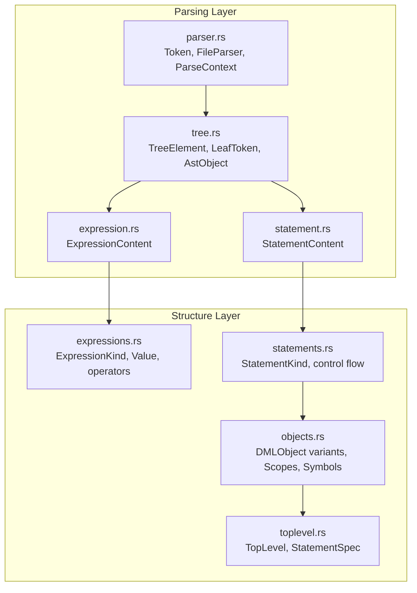
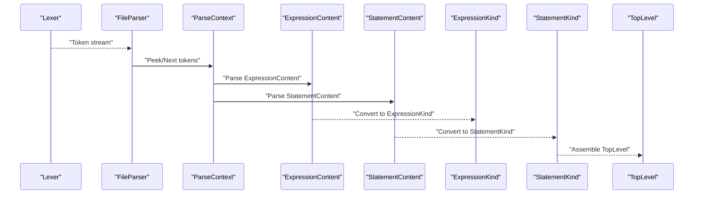
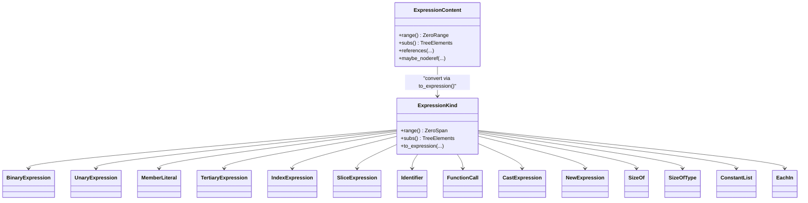
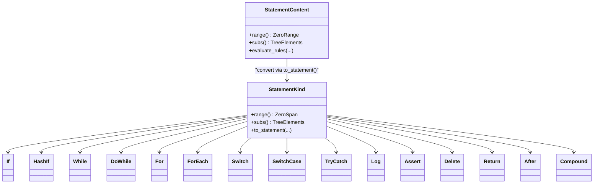
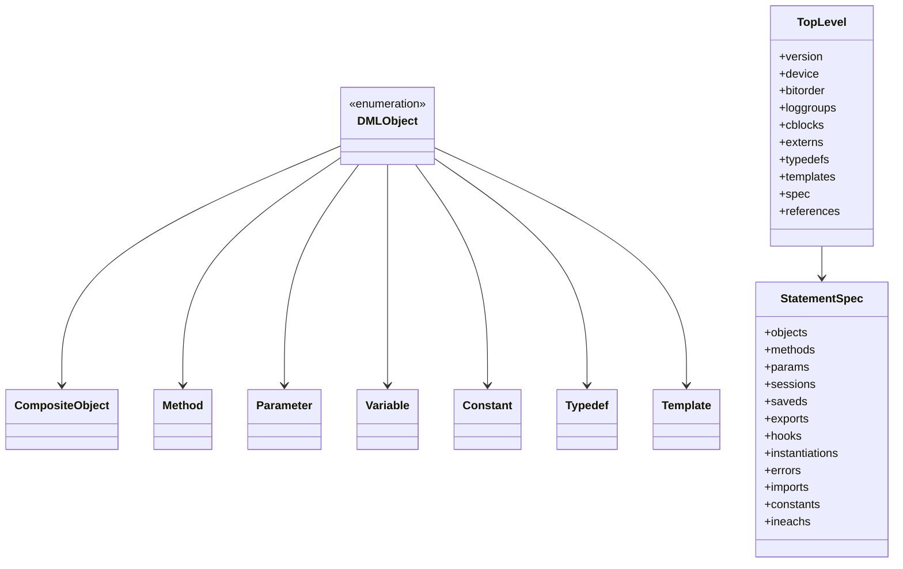
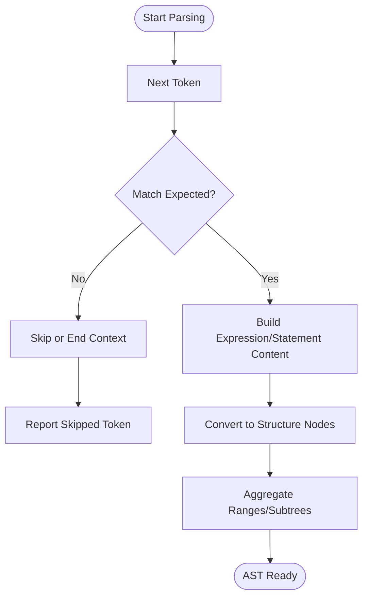
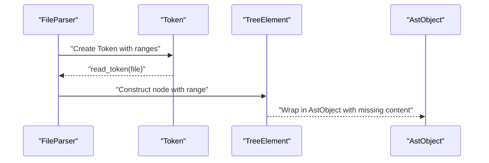
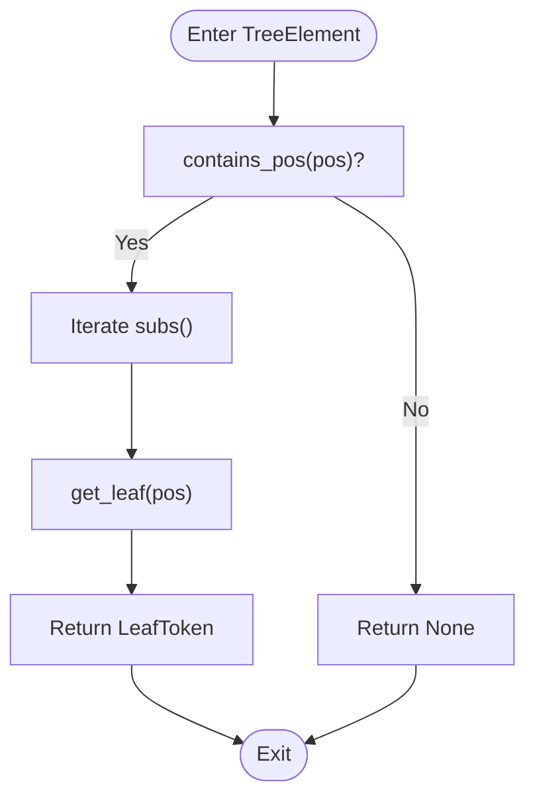
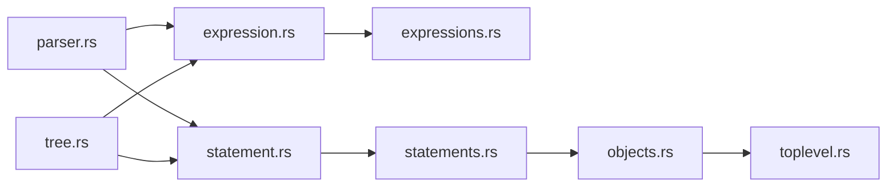

# Abstract Syntax Tree Construction

<cite>
**Referenced Files in This Document**
- [tree.rs](file://src/analysis/parsing/tree.rs)
- [parser.rs](file://src/analysis/parsing/parser.rs)
- [expression.rs](file://src/analysis/parsing/expression.rs)
- [statement.rs](file://src/analysis/parsing/statement.rs)
- [expressions.rs](file://src/analysis/structure/expressions.rs)
- [statements.rs](file://src/analysis/structure/statements.rs)
- [objects.rs](file://src/analysis/structure/objects.rs)
- [toplevel.rs](file://src/analysis/structure/toplevel.rs)
</cite>

## Table of Contents
1. [Introduction](#introduction)
2. [Project Structure](#project-structure)
3. [Core Components](#core-components)
4. [Architecture Overview](#architecture-overview)
5. [Detailed Component Analysis](#detailed-component-analysis)
6. [Dependency Analysis](#dependency-analysis)
7. [Performance Considerations](#performance-considerations)
8. [Troubleshooting Guide](#troubleshooting-guide)
9. [Conclusion](#conclusion)

## Introduction
This document explains how the DML language server constructs and manipulates Abstract Syntax Trees (ASTs). It focuses on the AST node types for DML language constructs, the tree-building algorithms, source location tracking, the AST node hierarchy, visitor-style traversal utilities, and the relationships among expression trees, statement trees, and compound nodes. It also outlines memory management strategies and optimization techniques used during analysis, and describes how to reason about ASTs for serialization and deserialization.

## Project Structure
The AST construction spans several modules:
- Parsing layer: constructs low-level AST nodes and tracks source positions.
- Structure layer: transforms parsing-layer ASTs into higher-level semantic nodes.
- Top-level assembly: flattens and organizes declarations and statements into a top-level structure.

**Diagram sources**
- [tree.rs](file://src/analysis/parsing/tree.rs#L33-L120)
- [parser.rs](file://src/analysis/parsing/parser.rs#L15-L40)
- [expression.rs](file://src/analysis/parsing/expression.rs#L713-L732)
- [statement.rs](file://src/analysis/parsing/statement.rs#L51-L82)
- [expressions.rs](file://src/analysis/structure/expressions.rs#L556-L615)
- [statements.rs](file://src/analysis/structure/statements.rs#L1-L80)
- [objects.rs](file://src/analysis/structure/objects.rs#L1503-L1522)
- [toplevel.rs](file://src/analysis/structure/toplevel.rs#L546-L604)

**Section sources**
- [tree.rs](file://src/analysis/parsing/tree.rs#L1-L120)
- [parser.rs](file://src/analysis/parsing/parser.rs#L1-L80)
- [expression.rs](file://src/analysis/parsing/expression.rs#L1-L80)
- [statement.rs](file://src/analysis/parsing/statement.rs#L1-L80)
- [expressions.rs](file://src/analysis/structure/expressions.rs#L1-L80)
- [statements.rs](file://src/analysis/structure/statements.rs#L1-L80)
- [objects.rs](file://src/analysis/structure/objects.rs#L1-L80)
- [toplevel.rs](file://src/analysis/structure/toplevel.rs#L1-L80)

## Core Components
- TreeElement trait: central interface for all AST nodes, providing range queries, leaf lookup, subtree iteration, post-parse sanity checks, missing content reporting, token collection, style checks, and references discovery.
- LeafToken: a discriminated union of actual tokens and missing tokens, carrying precise source locations for error reporting and recovery.
- AstObject<T>: a container that boxes either a concrete node or a missing content with a range, enabling robust error propagation without losing positional context.
- ExpressionContent and StatementContent: parsing-layer enums representing expression and statement constructs with well-defined ranges and subtrees.
- ExpressionKind and StatementKind: structure-layer enums with semantic meaning, built from parsing-layer content via conversion routines.

Key responsibilities:
- Source location tracking: Tokens carry prefix and full ranges; TreeElement.range aggregates child ranges; AstObject preserves missing ranges.
- Tree building: Parsing-layer parsers return ExpressionContent/StatementContent; structure-layer constructors convert to ExpressionKind/StatementKind.
- Traversal utilities: TreeElement.subs yields children; post_parse_sanity_walk and style_check traverse recursively.
- Visitor-style patterns: default_references, tokens(), gather_tokens(), style_check() act as visitors over the tree.

**Section sources**
- [tree.rs](file://src/analysis/parsing/tree.rs#L33-L120)
- [tree.rs](file://src/analysis/parsing/tree.rs#L234-L306)
- [tree.rs](file://src/analysis/parsing/tree.rs#L308-L397)
- [expression.rs](file://src/analysis/parsing/expression.rs#L713-L732)
- [statement.rs](file://src/analysis/parsing/statement.rs#L51-L82)
- [expressions.rs](file://src/analysis/structure/expressions.rs#L556-L615)
- [statements.rs](file://src/analysis/structure/statements.rs#L1-L80)

## Architecture Overview
The AST pipeline proceeds from lexical tokens to parsing-layer ASTs, then to structure-layer semantic ASTs, and finally to a top-level assembly.

**Diagram sources**
- [parser.rs](file://src/analysis/parsing/parser.rs#L322-L483)
- [expression.rs](file://src/analysis/parsing/expression.rs#L52-L66)
- [statement.rs](file://src/analysis/parsing/statement.rs#L67-L82)
- [expressions.rs](file://src/analysis/structure/expressions.rs#L742-L798)
- [statements.rs](file://src/analysis/structure/statements.rs#L58-L73)
- [toplevel.rs](file://src/analysis/structure/toplevel.rs#L629-L842)

## Detailed Component Analysis

### AST Node Types for Expressions
The expression AST hierarchy distinguishes syntactic forms and operators, with semantic conversions to ExpressionKind.

- ExpressionContent (parsing): BinaryExpressionContent, UnaryExpressionContent, MemberLiteralContent, TertiaryExpressionContent, ParenExpressionContent, FunctionCallContent, IndexContent, SliceContent, ConstListContent, EachInContent, SizeOfContent, SizeOfTypeContent, Identifier, Literal, New, Cast, Undefined.
- ExpressionKind (structure): BinaryExpression, UnaryExpression, MemberLiteral, TertiaryExpression, IndexExpression, Slice, Identifier, IntegerLiteral, StringLiteral, CharLiteral, FunctionCall, CastExpression, NewExpression, SizeOf, SizeOfType, ConstantList, EachIn, AutoObjectRef, Undefined, Unknown.

Operators and literals are represented by dedicated enums (MathOp, CompOp, LogicOp, UnaryOp, TertiaryOp) to simplify semantic analysis and transformations.

**Diagram sources**
- [expression.rs](file://src/analysis/parsing/expression.rs#L713-L732)
- [expressions.rs](file://src/analysis/structure/expressions.rs#L556-L615)
- [expressions.rs](file://src/analysis/structure/expressions.rs#L76-L130)
- [expressions.rs](file://src/analysis/structure/expressions.rs#L220-L262)
- [expressions.rs](file://src/analysis/structure/expressions.rs#L378-L403)
- [expressions.rs](file://src/analysis/structure/expressions.rs#L511-L534)

**Section sources**
- [expression.rs](file://src/analysis/parsing/expression.rs#L34-L104)
- [expression.rs](file://src/analysis/parsing/expression.rs#L106-L189)
- [expression.rs](file://src/analysis/parsing/expression.rs#L191-L279)
- [expression.rs](file://src/analysis/parsing/expression.rs#L281-L393)
- [expression.rs](file://src/analysis/parsing/expression.rs#L395-L434)
- [expression.rs](file://src/analysis/parsing/expression.rs#L437-L548)
- [expression.rs](file://src/analysis/parsing/expression.rs#L550-L606)
- [expression.rs](file://src/analysis/parsing/expression.rs#L608-L699)
- [expressions.rs](file://src/analysis/structure/expressions.rs#L556-L615)
- [expressions.rs](file://src/analysis/structure/expressions.rs#L76-L130)
- [expressions.rs](file://src/analysis/structure/expressions.rs#L220-L262)
- [expressions.rs](file://src/analysis/structure/expressions.rs#L378-L403)
- [expressions.rs](file://src/analysis/structure/expressions.rs#L511-L534)

### AST Node Types for Statements
The statement AST hierarchy mirrors control-flow and declaration constructs.

- StatementContent (parsing): ErrorContent, AssertContent, ThrowContent, CompoundContent, VariableDeclContent, DeleteContent, AssignContent, IfContent, HashIfContent, WhileContent, DoContent, ForContent, ForPre, ForPostElement, ReturnContent, AfterContent, TryContent, LogContent, SwitchContent, SwitchCaseContent, Break/Continue, and others.
- StatementKind (structure): Error, Assert, Throw, Compound, VariableDecl, Delete, Assign, If, HashIf, While, DoWhile, For, ForEach, Return, After, TryCatch, Log, Switch, SwitchCase, Break, Continue, and others.

These nodes encapsulate ranges and subtrees, enabling accurate diagnostics and transformations.

**Diagram sources**
- [statement.rs](file://src/analysis/parsing/statement.rs#L51-L82)
- [statements.rs](file://src/analysis/structure/statements.rs#L82-L160)
- [statements.rs](file://src/analysis/structure/statements.rs#L256-L286)
- [statements.rs](file://src/analysis/structure/statements.rs#L377-L451)
- [statements.rs](file://src/analysis/structure/statements.rs#L518-L541)
- [statements.rs](file://src/analysis/structure/statements.rs#L589-L587)

**Section sources**
- [statement.rs](file://src/analysis/parsing/statement.rs#L51-L82)
- [statements.rs](file://src/analysis/structure/statements.rs#L82-L160)
- [statements.rs](file://src/analysis/structure/statements.rs#L256-L286)
- [statements.rs](file://src/analysis/structure/statements.rs#L377-L451)
- [statements.rs](file://src/analysis/structure/statements.rs#L518-L541)
- [statements.rs](file://src/analysis/structure/statements.rs#L589-L587)

### AST Node Hierarchy and Relationships
The structure layer composes statements and expressions into object declarations and top-level assemblies.

- DMLObject variants represent composite objects, methods, parameters, variables, constants, typedefs, templates, and more.
- StatementSpec aggregates declarations and statements, capturing existence conditions and scoping.
- TopLevel aggregates version, device, bitorder, loggroups, C blocks, externs, typedefs, templates, and flattened specs.

**Diagram sources**
- [objects.rs](file://src/analysis/structure/objects.rs#L1503-L1522)
- [objects.rs](file://src/analysis/structure/objects.rs#L901-L952)
- [objects.rs](file://src/analysis/structure/objects.rs#L989-L1043)
- [objects.rs](file://src/analysis/structure/objects.rs#L1117-L1122)
- [objects.rs](file://src/analysis/structure/objects.rs#L1420-L1423)
- [objects.rs](file://src/analysis/structure/objects.rs#L1462-L1466)
- [objects.rs](file://src/analysis/structure/objects.rs#L652-L677)
- [toplevel.rs](file://src/analysis/structure/toplevel.rs#L232-L249)
- [toplevel.rs](file://src/analysis/structure/toplevel.rs#L546-L562)

**Section sources**
- [objects.rs](file://src/analysis/structure/objects.rs#L1503-L1522)
- [objects.rs](file://src/analysis/structure/objects.rs#L901-L952)
- [objects.rs](file://src/analysis/structure/objects.rs#L989-L1043)
- [objects.rs](file://src/analysis/structure/objects.rs#L1117-L1122)
- [objects.rs](file://src/analysis/structure/objects.rs#L1420-L1423)
- [objects.rs](file://src/analysis/structure/objects.rs#L1462-L1466)
- [objects.rs](file://src/analysis/structure/objects.rs#L652-L677)
- [toplevel.rs](file://src/analysis/structure/toplevel.rs#L232-L249)
- [toplevel.rs](file://src/analysis/structure/toplevel.rs#L546-L562)

### Tree Building Algorithms
- Expression parsing: parsers for each ExpressionContent variant build nodes with precise ranges and subtrees; conversions to ExpressionKind occur via to_expression().
- Statement parsing: parsers for each StatementContent variant build nodes; conversions to StatementKind occur via to_statement().
- Missing content handling: ParseContext and LeafToken enable graceful recovery; missing tokens are recorded with end positions and descriptions; AstObject wraps missing content preserving range.

**Diagram sources**
- [parser.rs](file://src/analysis/parsing/parser.rs#L58-L320)
- [expression.rs](file://src/analysis/parsing/expression.rs#L52-L66)
- [statement.rs](file://src/analysis/parsing/statement.rs#L67-L82)
- [expressions.rs](file://src/analysis/structure/expressions.rs#L742-L798)
- [statements.rs](file://src/analysis/structure/statements.rs#L58-L73)

**Section sources**
- [parser.rs](file://src/analysis/parsing/parser.rs#L58-L320)
- [expression.rs](file://src/analysis/parsing/expression.rs#L52-L66)
- [statement.rs](file://src/analysis/parsing/statement.rs#L67-L82)
- [expressions.rs](file://src/analysis/structure/expressions.rs#L742-L798)
- [statements.rs](file://src/analysis/structure/statements.rs#L58-L73)

### Source Location Tracking
- Token carries prefixrange and range; FileParser advances positions and tracks newlines/comments; Token.read_token loads text from VFS.
- TreeElement.range combines child ranges; AstObject preserves missing ranges; ZeroRange/ZeroSpan provide zero-indexed spans.
- DeclarationSpan trait exposes span() for nodes; many nodes embed ZeroSpan for precise location info.

**Diagram sources**
- [parser.rs](file://src/analysis/parsing/parser.rs#L15-L40)
- [parser.rs](file://src/analysis/parsing/parser.rs#L322-L483)
- [tree.rs](file://src/analysis/parsing/tree.rs#L33-L65)
- [tree.rs](file://src/analysis/parsing/tree.rs#L308-L397)

**Section sources**
- [parser.rs](file://src/analysis/parsing/parser.rs#L15-L40)
- [parser.rs](file://src/analysis/parsing/parser.rs#L322-L483)
- [tree.rs](file://src/analysis/parsing/tree.rs#L33-L65)
- [tree.rs](file://src/analysis/parsing/tree.rs#L308-L397)

### Visitor Pattern Implementation and Traversal Utilities
- TreeElement provides:
  - subs(): iterate children.
  - post_parse_sanity_walk(): depth-first traversal for sanity checks.
  - style_check(): depth-aware style rule evaluation.
  - tokens()/gather_tokens(): collect tokens for diagnostics.
  - references()/default_references(): discover references across subtrees.
- These utilities implement a visitor-like pattern without explicit visitor classes.

**Diagram sources**
- [tree.rs](file://src/analysis/parsing/tree.rs#L33-L65)

**Section sources**
- [tree.rs](file://src/analysis/parsing/tree.rs#L33-L120)
- [tree.rs](file://src/analysis/parsing/tree.rs#L122-L128)

### Expression Tree Construction Examples
Representative expression constructs:
- BinaryExpression: left op right with BinOp.
- UnaryExpression: operator operand.
- MemberLiteral: left . right or left -> right.
- TertiaryExpression: left ? middle : right with TertiaryOp.
- FunctionCall: function(arguments...).
- IndexExpression/SliceExpression: array[index] or array[left:right].
- CastExpression/NewExpression/SizeOf/SizeOfType/ConstantList/EachIn.

Each node’s range is computed from its children; conversions to ExpressionKind populate spans and build semantic trees.

**Section sources**
- [expressions.rs](file://src/analysis/structure/expressions.rs#L76-L130)
- [expressions.rs](file://src/analysis/structure/expressions.rs#L220-L262)
- [expressions.rs](file://src/analysis/structure/expressions.rs#L378-L403)
- [expressions.rs](file://src/analysis/structure/expressions.rs#L511-L534)
- [expression.rs](file://src/analysis/parsing/expression.rs#L86-L104)
- [expression.rs](file://src/analysis/parsing/expression.rs#L146-L168)
- [expression.rs](file://src/analysis/parsing/expression.rs#L176-L207)
- [expression.rs](file://src/analysis/parsing/expression.rs#L217-L241)
- [expression.rs](file://src/analysis/parsing/expression.rs#L437-L548)

### Statement Tree Building Examples
Representative statement constructs:
- If/HashIf: condition + true/false branches.
- While/DoWhile: condition + body.
- For/ForEach: pre/cond/post + body.
- Switch: expression + cases (Statement/Case/HashIf/Default).
- TryCatch: try/catch blocks.
- Log: severity, optional level, flags, message, args.
- Return/Await/Delete/Error/Assert/Throw/Break/Continue.

Each node’s range spans opening to closing tokens; conversions to StatementKind populate spans and build semantic trees.

**Section sources**
- [statements.rs](file://src/analysis/structure/statements.rs#L82-L160)
- [statements.rs](file://src/analysis/structure/statements.rs#L256-L286)
- [statements.rs](file://src/analysis/structure/statements.rs#L377-L451)
- [statements.rs](file://src/analysis/structure/statements.rs#L518-L541)
- [statements.rs](file://src/analysis/structure/statements.rs#L589-L587)
- [statement.rs](file://src/analysis/parsing/statement.rs#L414-L473)
- [statement.rs](file://src/analysis/parsing/statement.rs#L477-L531)
- [statement.rs](file://src/analysis/parsing/statement.rs#L533-L579)
- [statement.rs](file://src/analysis/parsing/statement.rs#L581-L636)

### Compound Node Relationships
- CompoundContent groups statements with braces; evaluates style rules and increments depth for nested blocks.
- ForContent supports pre (declaration or post), cond, post (expressions, assignments, assign-ops), and body.
- SwitchCase supports Statement, Case, HashIf, and Default.

These relationships ensure hierarchical composition and accurate range aggregation.

**Section sources**
- [statement.rs](file://src/analysis/parsing/statement.rs#L138-L189)
- [statement.rs](file://src/analysis/parsing/statement.rs#L638-L791)
- [statements.rs](file://src/analysis/structure/statements.rs#L203-L240)

### Serialization and Deserialization Capabilities
- Range preservation: ZeroRange/ZeroSpan ensures consistent serialization of positions.
- Boxed content: AstObject<T> and boxed Content<T> enable compact representation and lossless reconstruction.
- Token collection: tokens()/gather_tokens() support emitting textual or structured representations of the AST.
- Semantic reconstruction: to_expression()/to_statement() convert parsing-layer nodes to structure-layer nodes, suitable for downstream analysis and serialization.

Practical guidance:
- Serialize spans using ZeroSpan/ZeroRange.
- Preserve missing content via AstObject wrapping.
- Emit tokens for round-tripping or diagnostics.

**Section sources**
- [tree.rs](file://src/analysis/parsing/tree.rs#L14-L17)
- [tree.rs](file://src/analysis/parsing/tree.rs#L308-L397)
- [expression.rs](file://src/analysis/parsing/expression.rs#L734-L789)
- [statement.rs](file://src/analysis/parsing/statement.rs#L145-L160)

### Memory Management Strategies and Optimizations
- Boxing content: AstObject<T> and Content<T> reduce recursion overhead and enable polymorphic storage.
- Range aggregation: Range::combine minimizes repeated scans; TreeElement.range leverages child ranges.
- Minimal clones: TreeElementMember and Vec<&dyn TreeElementMember> avoid unnecessary ownership transfers.
- Early termination: ParseContext.end_context short-circuits parsing on missing tokens, preventing deep error cascades.
- Scope/symbol containers: ScopeContainer and SymbolContainer enable efficient traversal and lookup without duplicating data.

**Section sources**
- [tree.rs](file://src/analysis/parsing/tree.rs#L320-L397)
- [parser.rs](file://src/analysis/parsing/parser.rs#L126-L150)
- [objects.rs](file://src/analysis/structure/objects.rs#L539-L551)
- [statements.rs](file://src/analysis/structure/statements.rs#L547-L569)

## Dependency Analysis
The AST construction depends on:
- Parsing layer for tokenization and node construction.
- Structure layer for semantic interpretation and symbol/reference resolution.
- Top-level assembly for organizing declarations and statements.

**Diagram sources**
- [parser.rs](file://src/analysis/parsing/parser.rs#L1-L80)
- [expression.rs](file://src/analysis/parsing/expression.rs#L1-L80)
- [statement.rs](file://src/analysis/parsing/statement.rs#L1-L80)
- [expressions.rs](file://src/analysis/structure/expressions.rs#L1-L80)
- [statements.rs](file://src/analysis/structure/statements.rs#L1-L80)
- [objects.rs](file://src/analysis/structure/objects.rs#L1-L80)
- [toplevel.rs](file://src/analysis/structure/toplevel.rs#L1-L80)
- [tree.rs](file://src/analysis/parsing/tree.rs#L1-L80)

**Section sources**
- [parser.rs](file://src/analysis/parsing/parser.rs#L1-L80)
- [expression.rs](file://src/analysis/parsing/expression.rs#L1-L80)
- [statement.rs](file://src/analysis/parsing/statement.rs#L1-L80)
- [expressions.rs](file://src/analysis/structure/expressions.rs#L1-L80)
- [statements.rs](file://src/analysis/structure/statements.rs#L1-L80)
- [objects.rs](file://src/analysis/structure/objects.rs#L1-L80)
- [toplevel.rs](file://src/analysis/structure/toplevel.rs#L1-L80)
- [tree.rs](file://src/analysis/parsing/tree.rs#L1-L80)

## Performance Considerations
- Prefer Range::combine over recomputing spans from scratch.
- Use TreeElement.subs() to avoid manual child enumeration.
- Leverage early exits in ParseContext to minimize lookahead.
- Box large content to reduce cloning and recursion costs.
- Cache token sequences via tokens()/gather_tokens() for diagnostics and linting.

## Troubleshooting Guide
Common issues and remedies:
- Missing tokens: ParseContext.end_context records end position and description; AstObject preserves missing ranges for diagnostics.
- Incorrect ranges: Verify TreeElement.range and Range::combine usage; ensure all children contribute to parent range.
- Style violations: Use style_check() to apply rules; adjust auxiliary depth for nested blocks.
- Reference errors: Ensure references() implementations traverse subtrees; use default_references() for defaults.

**Section sources**
- [parser.rs](file://src/analysis/parsing/parser.rs#L126-L150)
- [tree.rs](file://src/analysis/parsing/tree.rs#L54-L88)
- [statement.rs](file://src/analysis/parsing/statement.rs#L152-L160)

## Conclusion
The DML language server’s AST construction integrates a robust parsing layer with precise source location tracking, a semantic structure layer for meaningful nodes, and a top-level assembler for organized declarations. The TreeElement trait and visitor-style utilities enable efficient traversal and analysis, while boxing and range aggregation optimize memory and performance. Together, these components provide a solid foundation for diagnostics, linting, and serialization.