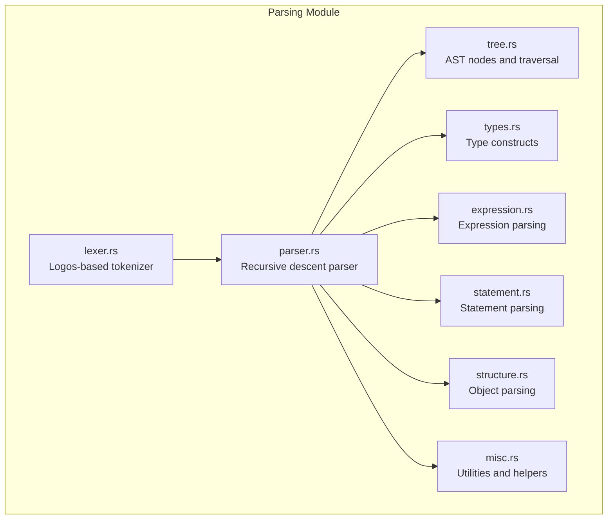
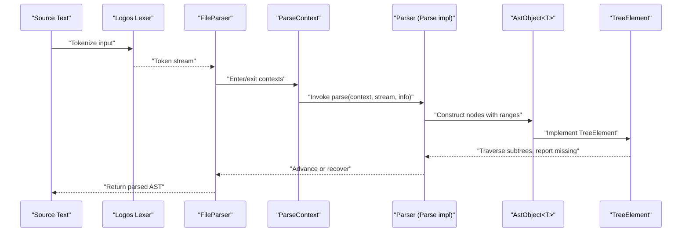
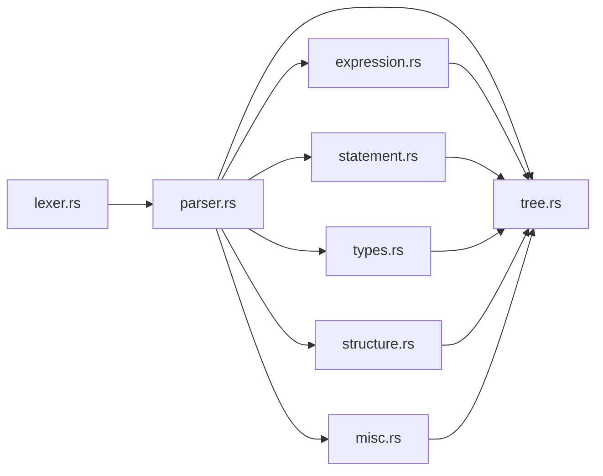

# DML Parsing and Analysis Engine

<cite>
**Referenced Files in This Document**
- [lexer.rs](file://src/analysis/parsing/lexer.rs)
- [parser.rs](file://src/analysis/parsing/parser.rs)
- [tree.rs](file://src/analysis/parsing/tree.rs)
- [types.rs](file://src/analysis/parsing/types.rs)
- [expression.rs](file://src/analysis/parsing/expression.rs)
- [statement.rs](file://src/analysis/parsing/statement.rs)
- [structure.rs](file://src/analysis/parsing/structure.rs)
- [misc.rs](file://src/analysis/parsing/misc.rs)
- [mod.rs](file://src/analysis/parsing/mod.rs)
</cite>

## Table of Contents
1. [Introduction](#introduction)
2. [Project Structure](#project-structure)
3. [Core Components](#core-components)
4. [Architecture Overview](#architecture-overview)
5. [Detailed Component Analysis](#detailed-component-analysis)
6. [Dependency Analysis](#dependency-analysis)
7. [Performance Considerations](#performance-considerations)
8. [Troubleshooting Guide](#troubleshooting-guide)
9. [Conclusion](#conclusion)

## Introduction
This document describes the DML parsing and analysis engine, focusing on the custom DML lexer built with the Logos crate, the recursive descent parser architecture, and the Abstract Syntax Tree (AST) construction with precise source mapping. It explains the tokenization process, syntax error recovery mechanisms, parser state management, AST node types, tree traversal patterns, semantic analysis integration, examples of parsing DML constructs, error reporting mechanisms, performance optimization strategies, and extensibility points for adding new DML language constructs.

## Project Structure
The parsing subsystem is organized into cohesive modules under the analysis/parsing namespace:
- lexer.rs: Defines the DML token vocabulary and tokenizer behavior using Logos.
- parser.rs: Implements the recursive descent parser, token stream abstraction, context-aware parsing helpers, and error recovery.
- tree.rs: Provides the AST node types, source mapping, tree traversal, and semantic analysis hooks.
- types.rs: Parses type-related constructs (base types, C-style declarations, layouts, bitfields, sequences, hooks).
- expression.rs: Implements expression parsing with operator precedence and special forms.
- statement.rs: Parses DML statements including control flow, assignments, blocks, and compound constructs.
- structure.rs: Parses DML objects (templates, registers, fields, attributes, etc.) and their statements.
- misc.rs: Handles initializers, type declarations, and shared parsing utilities.

**Diagram sources**
- [lexer.rs](file://src/analysis/parsing/lexer.rs#L96-L424)
- [parser.rs](file://src/analysis/parsing/parser.rs#L322-L483)
- [tree.rs](file://src/analysis/parsing/tree.rs#L14-L398)
- [types.rs](file://src/analysis/parsing/types.rs#L1-L726)
- [expression.rs](file://src/analysis/parsing/expression.rs#L1-L2198)
- [statement.rs](file://src/analysis/parsing/statement.rs#L1-L2780)
- [structure.rs](file://src/analysis/parsing/structure.rs#L1-L2382)
- [misc.rs](file://src/analysis/parsing/misc.rs#L1-L1121)

**Section sources**
- [mod.rs](file://src/analysis/parsing/mod.rs#L1-L16)

## Core Components
- Custom DML Lexer (Logos): Defines token kinds, reserved identifiers, and specialized handlers for comments and C blocks. It tracks positions and filters whitespace/comments during token consumption.
- Recursive Descent Parser: Provides a FileParser stream with peek/advance semantics, a ParseContext for context-aware lookahead and recovery, and a Parse trait for pluggable parsers.
- AST Construction: Uses Token wrappers with precise ranges and prefixranges for source mapping, and a generic AstObject<T> container with Content variants for present/missing nodes.
- Tree Traversal and Semantic Hooks: Implements TreeElement with range queries, subtree iteration, missing node reporting, and post-parse sanity checks.
- Expression and Statement Parsers: Implement operator precedence via nested functions, support for function calls, indexing/slicing, ternary operators, and control flow constructs.
- Object and Type Parsers: Parse composite objects (registers, fields, attributes), templates, and C-style declarations with arrays, pointers, and function types.

**Section sources**
- [lexer.rs](file://src/analysis/parsing/lexer.rs#L96-L424)
- [parser.rs](file://src/analysis/parsing/parser.rs#L15-L483)
- [tree.rs](file://src/analysis/parsing/tree.rs#L14-L398)
- [expression.rs](file://src/analysis/parsing/expression.rs#L800-L1200)
- [statement.rs](file://src/analysis/parsing/statement.rs#L800-L1200)
- [structure.rs](file://src/analysis/parsing/structure.rs#L800-L1200)
- [types.rs](file://src/analysis/parsing/types.rs#L1-L726)
- [misc.rs](file://src/analysis/parsing/misc.rs#L1-L1121)

## Architecture Overview
The engine follows a layered pipeline:
- Lexical Analysis: Logos tokenizer produces tokens while advancing a position tracker and skipping whitespace/comments.
- Syntactic Parsing: Recursive descent parsers consume tokens, manage contexts, and construct AST nodes with precise ranges.
- Semantic Analysis: Tree traversal validates constructs, collects references, reports missing nodes, and performs style checks.

**Diagram sources**
- [lexer.rs](file://src/analysis/parsing/lexer.rs#L352-L483)
- [parser.rs](file://src/analysis/parsing/parser.rs#L48-L320)
- [tree.rs](file://src/analysis/parsing/tree.rs#L31-L120)

## Detailed Component Analysis

### Custom DML Lexer (Logos)
- Token kinds enumerate operators, keywords, literals, delimiters, and DML-specific tokens. Specialized handlers manage multiline comments and C blocks.
- Reserved identifier filtering ensures compatibility with C/C++ reserved words while preserving DML-specific reserved tokens.
- Position tracking advances across newlines, whitespace, and special constructs, maintaining accurate ranges for tokens.

Key behaviors:
- Multiline comment and C block handlers enforce balanced delimiters and update line/column counters.
- Whitespace handling updates column positions for proper UTF-16 alignment.
- LexerError is emitted for unterminated constructs.

**Section sources**
- [lexer.rs](file://src/analysis/parsing/lexer.rs#L5-L424)

### Recursive Descent Parser and Context Management
- FileParser wraps a Logos lexer, exposes peek/next, and advances while skipping whitespace/comments and tracking positions.
- ParseContext manages lookahead, end-position markers, and recovery by skipping unexpected tokens or ending contexts when higher-level contexts can handle them.
- The Parse trait enables modular parsing of different constructs (expressions, statements, types, objects).

Error recovery mechanisms:
- Skips tokens not understood by the current context if no higher context can handle them.
- Ends the current context when encountering tokens understood by a higher context, producing MissingToken nodes.
- Tracks skipped tokens for diagnostic reporting.

**Section sources**
- [parser.rs](file://src/analysis/parsing/parser.rs#L48-L320)
- [parser.rs](file://src/analysis/parsing/parser.rs#L322-L483)

### AST Construction and Source Mapping
- Token carries kind, prefixrange, and range for precise source mapping.
- AstObject<T> encapsulates Content::Some or Content::Missing, enabling robust error propagation.
- TreeElement defines range queries, subtree iteration, missing node reporting, and post-parse sanity checks.

Traversal patterns:
- Range combination utilities merge child ranges into parent ranges.
- Tokens collection gathers leaf tokens for diagnostics and linting.
- Style checks traverse subtrees applying rule sets.

**Section sources**
- [tree.rs](file://src/analysis/parsing/tree.rs#L14-L398)

### Expression Parsing and Operator Precedence
- Expression parsing uses nested functions to enforce operator precedence: extended expressions, multiplicative/division/modulo, additive/subtractive, shifts, comparisons, equality, bitwise ops, logical AND/OR, and ternary.
- Supports function calls, indexing/slicing, member access, unary/binary/post-unary operators, parentheses, and special forms (sizeof, typeof, new, cast, stringify, each-in).

Examples of constructs:
- Function call with argument lists and optional trailing comma handling.
- Indexing and slicing with optional bitorder specification.
- Ternary operator with matching colons for both standard and hash forms.

**Section sources**
- [expression.rs](file://src/analysis/parsing/expression.rs#L800-L1200)

### Statement Parsing and Control Flow
- Statements include error/assert/throw, compound blocks, variable declarations, assignments (including chained assignments), if/else, hash-if, while/do-while, for loops, switch/hash-if switches, try/catch, and expression statements.
- For loop supports pre-declarations or post-expressions, with assignment operations and tuple targets.

Switch constructs:
- Standard switch with cases/default and hash-if variant for conditional branches inside switch blocks.

**Section sources**
- [statement.rs](file://src/analysis/parsing/statement.rs#L800-L1200)

### Object and Type Parsing
- Composite objects: registers, fields, attributes, banks, connections, events, groups, interfaces, ports, subdevices, and templates.
- Type constructs: base types (struct, layout, bitfields, typeof, sequence, hook), C-style declarations with pointers, arrays, and function types, and initializers (single, list, structure with designated initializers).

Template and instantiation:
- Templates define parameterized constructs with optional instantiations and statements.
- Object statements support empty or brace-delimited lists with style and depth rules.

**Section sources**
- [structure.rs](file://src/analysis/parsing/structure.rs#L800-L1200)
- [types.rs](file://src/analysis/parsing/types.rs#L1-L726)
- [misc.rs](file://src/analysis/parsing/misc.rs#L1-L1121)

### Semantic Analysis Integration
- Post-parse sanity walks collect LocalDMLError instances from nodes and subtrees.
- References collection integrates with the broader analysis system for symbol resolution.
- Style checks apply lint rules during traversal, adjusting depth and accumulating DMLStyleError entries.

**Section sources**
- [tree.rs](file://src/analysis/parsing/tree.rs#L54-L120)
- [structure.rs](file://src/analysis/parsing/structure.rs#L747-L793)

### Examples of Parsing DML Constructs
- Expressions: arithmetic, function calls, indexing/slicing, ternary operators, and special forms.
- Statements: if/else, for loops with various pre/post forms, switch/hash-if, try/catch.
- Objects: registers with sizes/offsets, fields with bitranges, templates with instantiations, and composite objects with documentation and statements.

Note: Specific code examples are omitted; refer to the referenced sections for implementation details.

**Section sources**
- [expression.rs](file://src/analysis/parsing/expression.rs#L800-L1200)
- [statement.rs](file://src/analysis/parsing/statement.rs#L800-L1200)
- [structure.rs](file://src/analysis/parsing/structure.rs#L800-L1200)
- [types.rs](file://src/analysis/parsing/types.rs#L1-L726)
- [misc.rs](file://src/analysis/parsing/misc.rs#L1-L1121)

### Extensibility Points
- Adding new tokens: Extend TokenKind in the lexer and update reserved checks and descriptions.
- Adding new constructs: Implement Parse for new AST node types, integrate with existing parsers, and add TreeElement methods for traversal and validation.
- Operator precedence: Extend expression precedence functions to incorporate new operators.
- Context-aware parsing: Leverage ParseContext understanders and end_context behavior to recover from malformed input gracefully.

**Section sources**
- [lexer.rs](file://src/analysis/parsing/lexer.rs#L96-L592)
- [parser.rs](file://src/analysis/parsing/parser.rs#L48-L320)
- [expression.rs](file://src/analysis/parsing/expression.rs#L800-L1200)
- [statement.rs](file://src/analysis/parsing/statement.rs#L800-L1200)
- [structure.rs](file://src/analysis/parsing/structure.rs#L800-L1200)
- [types.rs](file://src/analysis/parsing/types.rs#L1-L726)
- [misc.rs](file://src/analysis/parsing/misc.rs#L1-L1121)

## Dependency Analysis
The parsing modules form a tight dependency graph centered around the parser and tree modules, with specialized parsers for expressions, statements, types, and structures.

**Diagram sources**
- [lexer.rs](file://src/analysis/parsing/lexer.rs#L3-L14)
- [parser.rs](file://src/analysis/parsing/parser.rs#L3-L13)
- [tree.rs](file://src/analysis/parsing/tree.rs#L3-L12)
- [expression.rs](file://src/analysis/parsing/expression.rs#L3-L17)
- [statement.rs](file://src/analysis/parsing/statement.rs#L3-L27)
- [types.rs](file://src/analysis/parsing/types.rs#L3-L19)
- [structure.rs](file://src/analysis/parsing/structure.rs#L3-L32)
- [misc.rs](file://src/analysis/parsing/misc.rs#L3-L18)

**Section sources**
- [mod.rs](file://src/analysis/parsing/mod.rs#L1-L16)

## Performance Considerations
- Tokenization: Logos-generated lexer minimizes overhead; avoid unnecessary allocations by reusing slices and ranges.
- Parser: Recursive descent is straightforward and predictable; minimize redundant peeking by using context-aware understanders.
- AST: Boxed Content reduces memory footprint for recursive types; prefer combining ranges over copying data.
- Traversal: TreeElement implementations should avoid deep recursion where possible; leverage iterators and accumulated collections.
- Error Recovery: Skipping tokens is efficient but can be noisy; prefer targeted recovery to reduce cascading errors.

[No sources needed since this section provides general guidance]

## Troubleshooting Guide
Common issues and remedies:
- Unexpected token errors: Inspect skipped_tokens reported by FileParser and LocalDMLError messages generated from MissingToken and MissingContent.
- Unterminated constructs: LexerError indicates unclosed comments or C blocks; ensure balanced delimiters.
- Ambiguous constructs: Use ParseContext understanders to guide disambiguation; prefer explicit delimiters where ambiguity exists.
- Position mismatches: Verify UTF-16 column calculations for multibyte characters; confirm newline handling in multiline constructs.

**Section sources**
- [parser.rs](file://src/analysis/parsing/parser.rs#L475-L483)
- [tree.rs](file://src/analysis/parsing/tree.rs#L356-L398)
- [lexer.rs](file://src/analysis/parsing/lexer.rs#L52-L94)

## Conclusion
The DML parsing and analysis engine combines a robust Logos-based lexer, a flexible recursive descent parser with context-aware recovery, and a strongly-typed AST with precise source mapping. Together, these components enable accurate parsing of DML constructs, comprehensive error reporting, and seamless integration with semantic analysis and linting systems. The architecture is extensible, allowing new language constructs to be added with minimal disruption to existing functionality.