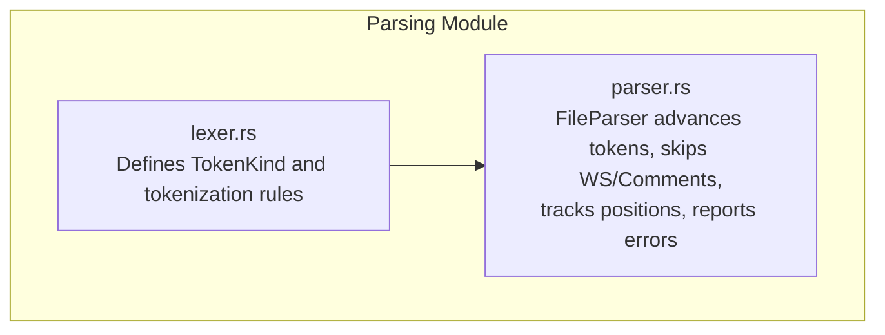
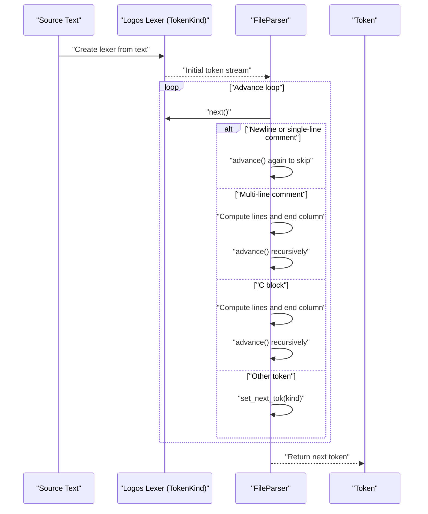
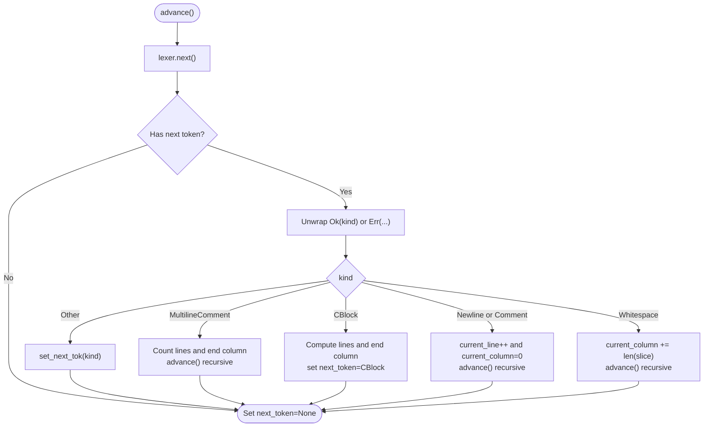
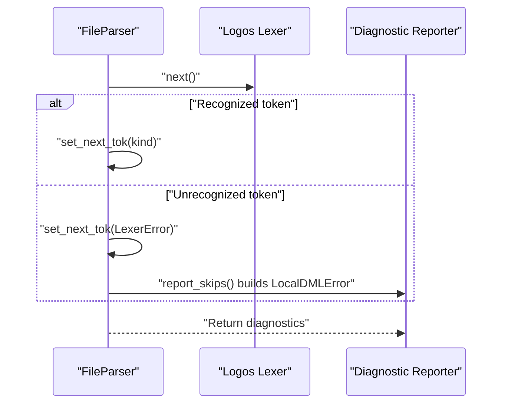
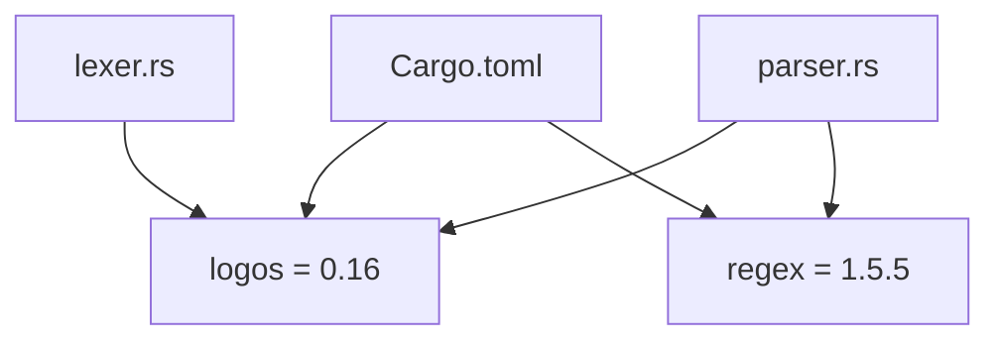

# Lexer Implementation

<cite>
**Referenced Files in This Document**
- [lexer.rs](file://src/analysis/parsing/lexer.rs)
- [parser.rs](file://src/analysis/parsing/parser.rs)
- [Cargo.toml](file://Cargo.toml)
</cite>

## Table of Contents
1. [Introduction](#introduction)
2. [Project Structure](#project-structure)
3. [Core Components](#core-components)
4. [Architecture Overview](#architecture-overview)
5. [Detailed Component Analysis](#detailed-component-analysis)
6. [Dependency Analysis](#dependency-analysis)
7. [Performance Considerations](#performance-considerations)
8. [Troubleshooting Guide](#troubleshooting-guide)
9. [Conclusion](#conclusion)

## Introduction
This document explains the DML lexer implementation built with the Logos crate. It covers how tokens are produced from DML source text, how keywords and operators are recognized, how literals are parsed, and how the lexer integrates with the parser. It also documents state management for comments and multi-line constructs, error handling for invalid input, and how lexical errors are surfaced to users via the parser.

## Project Structure
The lexer and parser live in the parsing module. The lexer defines token kinds and rules; the parser consumes tokens and tracks positions, skipping whitespace and comments while reporting skipped tokens and lexical errors.

**Diagram sources**
- [lexer.rs](file://src/analysis/parsing/lexer.rs#L96-L424)
- [parser.rs](file://src/analysis/parsing/parser.rs#L322-L483)

**Section sources**
- [lexer.rs](file://src/analysis/parsing/lexer.rs#L1-L689)
- [parser.rs](file://src/analysis/parsing/parser.rs#L1-L807)

## Core Components
- TokenKind: Enumerates all token types for DML, including operators, punctuation, keywords, literals, and comments. It also includes a special LexerError variant for unrecognized input.
- FileParser: Wraps a Logos lexer, advances tokens, skips whitespace and comments, tracks line and column positions, and surfaces lexical errors.
- Token: A lightweight structure carrying the token kind and positional ranges for both the token and its prefix.

Key responsibilities:
- TokenKind: Defines regexes and callback handlers for identifiers, numeric literals, string/char constants, comments, and multi-line constructs.
- FileParser: Implements token advancement, newline/column accounting, and error propagation.

**Section sources**
- [lexer.rs](file://src/analysis/parsing/lexer.rs#L96-L424)
- [parser.rs](file://src/analysis/parsing/parser.rs#L15-L40)
- [parser.rs](file://src/analysis/parsing/parser.rs#L322-L483)

## Architecture Overview
The lexer and parser collaborate as follows:
- The caller creates a Logos lexer from source text.
- FileParser wraps the Logos lexer and preloads the first token.
- FileParser.advance consumes tokens, skipping whitespace and comments, updating line/column positions, and handling special constructs like multi-line comments and C blocks.
- On unrecognized input, FileParser sets the token kind to LexerError and continues advancing.

**Diagram sources**
- [lexer.rs](file://src/analysis/parsing/lexer.rs#L96-L424)
- [parser.rs](file://src/analysis/parsing/parser.rs#L356-L440)

## Detailed Component Analysis

### Token Types and Recognition
TokenKind enumerates all DML tokens:
- Operators and punctuation: arithmetic, bitwise, logical, assignment, comparison, grouping, separators, and special DML directives.
- Keywords: reserved words from DML and compatibility sets (C/C++).
- Literals: identifiers, integer, float, hex, binary, string, and char constants.
- Comments: single-line, multi-line, and C block constructs.
- Special: LexerError for unrecognized sequences.

Recognition mechanisms:
- Direct token annotations for single-character and fixed multi-character operators.
- Regex-based rules for identifiers, numeric literals, and string/char constants.
- Callback handlers for multi-line constructs to manage nested delimiters and compute accurate positions.

Examples of token kinds:
- Arithmetic: Plus, Minus, Multiply, Divide, Mod
- Bitwise: BinOr, BinAnd, BinNot, BinXor, LShift, RShift
- Logical: Or, And, Not
- Comparison: Equals, GreaterThan, LessThan, NotEquals, GEquals, LEquals
- Assignment: Assign, TimesAssign, DivideAssign, etc.
- Separators: LParen, RParen, LBracket, RBracket, LBrace, RBrace, Dot, Comma, SemiColon, Ellipsis
- Keywords: Attribute, Method, Device, DML, etc.
- Literals: Identifier, IntConstant, FloatConstant, HexConstant, BinaryConstant, StringConstant, CharConstant
- Comments: Comment, MultilineComment, CBlock
- Error: LexerError

**Section sources**
- [lexer.rs](file://src/analysis/parsing/lexer.rs#L96-L424)

### Identifier and Keyword Recognition
- Identifiers are matched with a regex pattern and validated against a reserved word filter.
- The reserved filter checks whether the matched text is a reserved identifier in DML or in C/C++.
- This ensures that keywords are not treated as generic identifiers.

Behavior:
- If the matched text is reserved, the lexer yields a keyword token.
- Otherwise, it yields an Identifier token.

**Section sources**
- [lexer.rs](file://src/analysis/parsing/lexer.rs#L16-L40)
- [lexer.rs](file://src/analysis/parsing/lexer.rs#L400-L401)

### Operator Scanning
- Single-character operators are annotated directly.
- Multi-character operators (e.g., assignment and shift-assign forms) are annotated with their exact sequences.
- The Logos engine resolves conflicts by longest-match-first and precedence rules defined by annotation order.

Examples covered:
- Arithmetic: +, -, *, /, %
- Bitwise: |, &, ~, ^
- Shift: <<, >>
- Logical: ||, &&
- Comparison: ==, !=, >=, <=, >, <
- Assignment: =, *=, /=, %=, +=, -=, <<=, >>=, &=, ^=, |=
- Increment/decrement: ++, --
- Access: ->
- Ternary: ?
- Other: :, (, ), [, ], {, }, ., ,, ;, ...

**Section sources**
- [lexer.rs](file://src/analysis/parsing/lexer.rs#L98-L168)

### Numeric Literal Parsing
- Integer constants: decimal digits with optional underscores.
- Hex constants: 0x followed by hexadecimal digits with optional underscores.
- Binary constants: 0b followed by binary digits with optional underscores.
- Floating-point constants: digits with optional fractional and/or exponent parts, supporting scientific notation.

Validation:
- The regexes enforce syntactic constraints for each form.
- No runtime conversion is performed in the lexer; values are preserved as raw slices for downstream parsing.

**Section sources**
- [lexer.rs](file://src/analysis/parsing/lexer.rs#L402-L409)

### String and Character Literal Processing
- String constants: double-quoted with a controlled set of escape sequences and character classes.
- Character constants: single-quoted with a limited set of escapes and constraints.
- Both accept common escapes and octal/hex forms where applicable.

Notes:
- UTF-8 validity checks are marked as TODO in the codebase.
- The lexer accepts a broad set of printable and escaped characters, excluding unprintable control characters except those explicitly allowed.

**Section sources**
- [lexer.rs](file://src/analysis/parsing/lexer.rs#L410-L414)

### Multi-line Comment Handling
- Multi-line comments begin with /* and end with */.
- The handler scans until it finds the terminator, advancing character-by-character and handling embedded asterisks appropriately.
- If the end marker is not found, the handler returns a LexerError.

Position tracking:
- The parser counts newlines in the matched slice and updates the current line and column accordingly.

**Section sources**
- [lexer.rs](file://src/analysis/parsing/lexer.rs#L52-L72)
- [parser.rs](file://src/analysis/parsing/parser.rs#L376-L398)

### C Block Processing
- C blocks begin with %{ and end with %}.
- The handler scans until it finds the terminator, advancing character-by-character and handling embedded percent signs.
- If the end marker is not found, the handler returns a LexerError.

Position tracking:
- The parser computes the number of lines and the end column to set the token’s range accurately.

**Section sources**
- [lexer.rs](file://src/analysis/parsing/lexer.rs#L74-L94)
- [parser.rs](file://src/analysis/parsing/parser.rs#L399-L432)

### State Management and Token Advancement
FileParser manages:
- Current and previous line/column positions.
- A buffered next_token to support peeking.
- Skipping of whitespace and comments during advancement.
- Recursive advancement for multi-line constructs to consume entire constructs and continue the stream.

**Diagram sources**
- [parser.rs](file://src/analysis/parsing/parser.rs#L356-L440)

**Section sources**
- [parser.rs](file://src/analysis/parsing/parser.rs#L322-L483)

### Integration with the Parser and Error Reporting
- The parser wraps the Logos lexer and initializes FileParser, which preloads the first token.
- On unrecognized input, the Logos lexer yields an error token kind, which FileParser stores as LexerError and continues advancing.
- The parser exposes report_skips to convert skipped tokens into user-visible diagnostics, including the token description and expected token label.

**Diagram sources**
- [parser.rs](file://src/analysis/parsing/parser.rs#L437-L482)

**Section sources**
- [parser.rs](file://src/analysis/parsing/parser.rs#L475-L482)

### Examples of Token Streams
Below are representative token streams derived from DML code fragments. These illustrate how the lexer recognizes operators, keywords, literals, and comments.

- Example 1: Arithmetic expression
  - Input: "5+5=10"
  - Tokens: IntConstant, Plus, IntConstant, Assign, IntConstant

- Example 2: Numeric variants
  - Input: "0xF00_420 0b0011100 987654321"
  - Tokens: HexConstant, Whitespace, BinaryConstant, Whitespace, IntConstant

- Example 3: String constants
  - Input: "\"string\" \"another\""
  - Tokens: StringConstant, Whitespace, StringConstant

- Example 4: Whitespace and layout
  - Input: "method foo()   {\n\treturn 5;\n}"
  - Tokens: Method, Whitespace, Identifier, LParen, RParen, Whitespace, LBrace, Newline, Whitespace, Return, Whitespace, IntConstant, SemiColon, Newline, RBrace

- Example 5: Multi-line comments
  - Input: "/* ** **/"
  - Tokens: MultilineComment

- Example 6: C blocks
  - Input: "%{ ** %}"
  - Tokens: CBlock

These examples are verified by unit tests in the lexer module.

**Section sources**
- [lexer.rs](file://src/analysis/parsing/lexer.rs#L613-L687)

## Dependency Analysis
The lexer depends on Logos for tokenization and regex-based matching. The parser depends on Logos for token iteration and on regex for computing positions inside multi-line constructs. The parser also depends on local error types for diagnostics.

**Diagram sources**
- [Cargo.toml](file://Cargo.toml#L45-L47)
- [lexer.rs](file://src/analysis/parsing/lexer.rs#L3)
- [parser.rs](file://src/analysis/parsing/parser.rs#L3-L4)

**Section sources**
- [Cargo.toml](file://Cargo.toml#L33-L62)
- [lexer.rs](file://src/analysis/parsing/lexer.rs#L3)
- [parser.rs](file://src/analysis/parsing/parser.rs#L3-L4)

## Performance Considerations
- Regex-based tokenization with Logos is efficient for typical DML sources. The lexer’s regexes are designed to be disambiguatable with lookahead 1 where possible, reducing backtracking.
- Multi-character operators are annotated directly to avoid ambiguity and improve matching speed.
- Whitespace and comments are skipped in a single pass during FileParser.advance, minimizing overhead.
- For multi-line constructs, the parser uses regex captures to quickly compute line and column deltas, avoiding expensive per-character computations.
- UTF-16 encoding is assumed for positions, which aligns with the LSP default and simplifies indexing for Unicode characters.

[No sources needed since this section provides general guidance]

## Troubleshooting Guide
Common issues and resolutions:
- Unexpected token errors
  - Cause: Invalid characters or malformed literals.
  - Resolution: The lexer emits LexerError, which the parser surfaces via diagnostics. Review the diagnostic messages for the offending token and surrounding context.

- Unclosed multi-line comment or C block
  - Cause: Missing terminating delimiter.
  - Resolution: The lexer returns LexerError for unterminated constructs. Add the missing terminator to fix the issue.

- Skipped tokens and parser confusion
  - Cause: Unexpected tokens encountered by the parser.
  - Resolution: The parser records skipped tokens and can produce diagnostics indicating the unexpected token and what was expected. Correct the syntax to restore parsing continuity.

- Unicode column counting
  - Note: The parser assumes UTF-16 column encoding. Large Unicode code points are represented as surrogate pairs in UTF-16, affecting column calculations. Tests demonstrate correct behavior for emoji and similar characters.

**Section sources**
- [lexer.rs](file://src/analysis/parsing/lexer.rs#L665-L677)
- [parser.rs](file://src/analysis/parsing/parser.rs#L475-L482)
- [parser.rs](file://src/analysis/parsing/parser.rs#L567-L583)

## Conclusion
The DML lexer leverages Logos to provide robust, fast tokenization of DML constructs. It distinguishes keywords from identifiers, parses numeric and string literals, and handles comments and C blocks with precise position tracking. The parser integrates tightly with the lexer to skip whitespace and comments, report skipped tokens, and surface lexical errors to users. Together, these components form a reliable foundation for subsequent parsing and analysis.