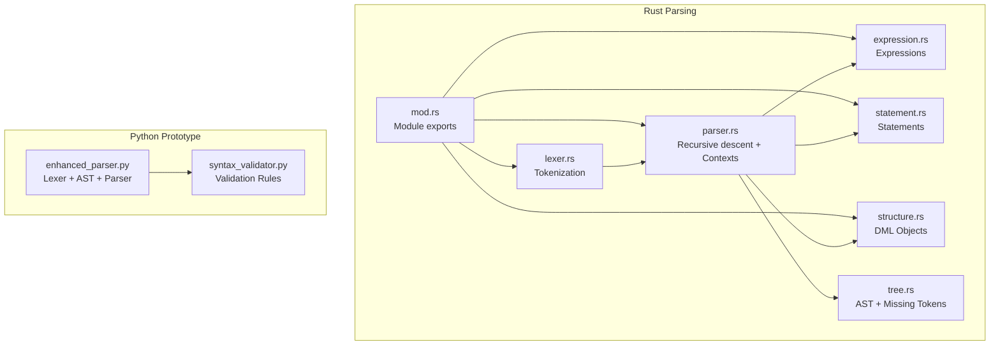
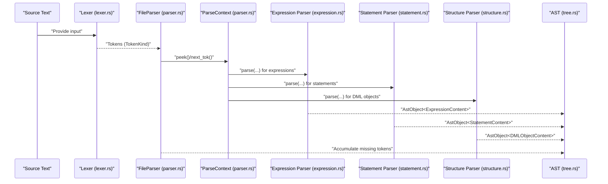
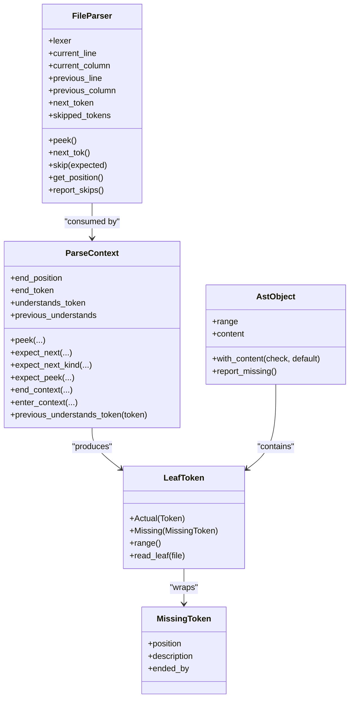
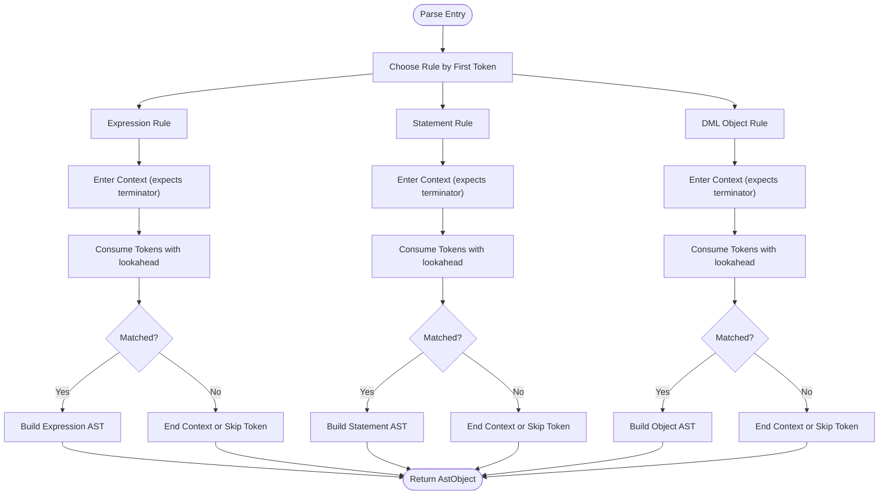
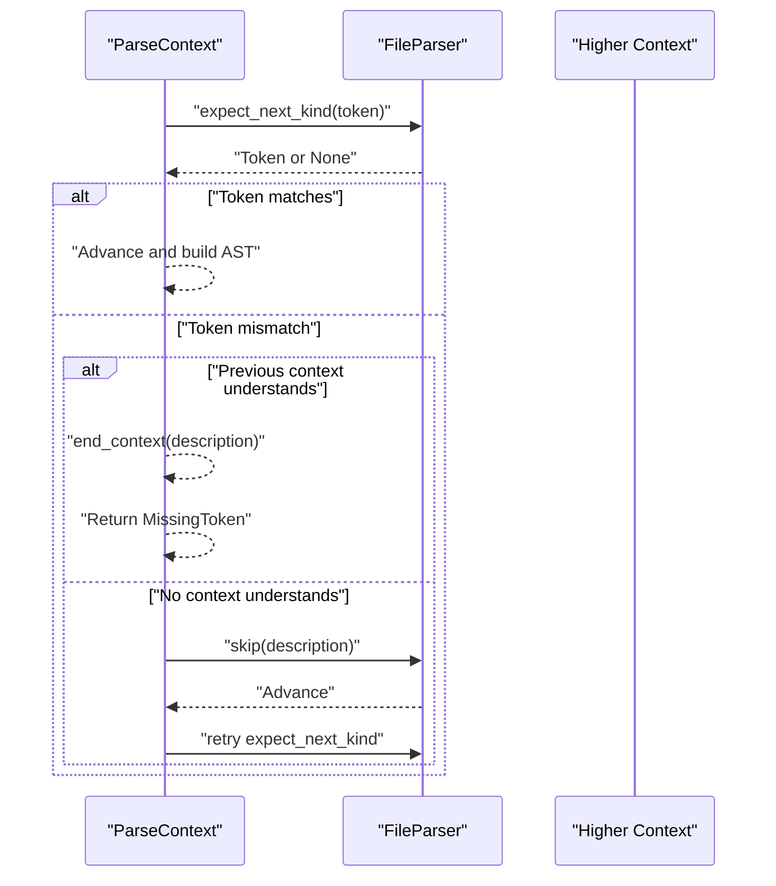
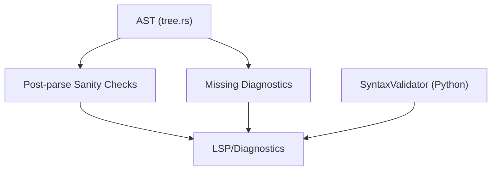
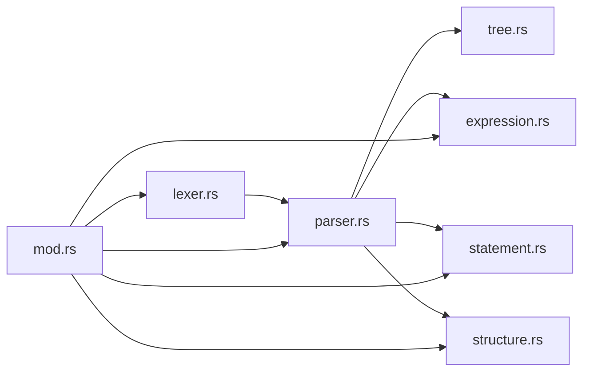

# Parser Architecture

<cite>
**Referenced Files in This Document**
- [parser.rs](file://src/analysis/parsing/parser.rs)
- [lexer.rs](file://src/analysis/parsing/lexer.rs)
- [tree.rs](file://src/analysis/parsing/tree.rs)
- [expression.rs](file://src/analysis/parsing/expression.rs)
- [statement.rs](file://src/analysis/parsing/statement.rs)
- [structure.rs](file://src/analysis/parsing/structure.rs)
- [mod.rs](file://src/analysis/parsing/mod.rs)
- [enhanced_parser.py](file://python-port/dml_language_server/analysis/parsing/enhanced_parser.py)
- [syntax_validator.py](file://python-port/dml_language_server/analysis/parsing/syntax_validator.py)
</cite>

## Table of Contents
1. [Introduction](#introduction)
2. [Project Structure](#project-structure)
3. [Core Components](#core-components)
4. [Architecture Overview](#architecture-overview)
5. [Detailed Component Analysis](#detailed-component-analysis)
6. [Dependency Analysis](#dependency-analysis)
7. [Performance Considerations](#performance-considerations)
8. [Troubleshooting Guide](#troubleshooting-guide)
9. [Conclusion](#conclusion)

## Introduction
This document describes the DML parser architecture, focusing on the recursive descent parsing strategy, grammar coverage, error recovery, and the relationship between parser phases and higher-level analysis. It covers both the Rust-based production parser and the Python prototype, highlighting how lookahead token handling, parsing contexts, and state transitions enable robust parsing of DML constructs, including expressions, statements, and structured declarations. It also documents how syntax errors propagate from the parser into the broader analysis pipeline.

## Project Structure
The parser implementation is organized into cohesive modules under the Rust parsing subsystem and complemented by a Python prototype that mirrors the grammar and recovery semantics.

- Rust parsing modules:
  - lexer.rs: Tokenization with Logos, including reserved words, operators, and special constructs (e.g., C blocks, hash directives).
  - parser.rs: Recursive descent infrastructure, lookahead handling, and context management with recovery strategies.
  - tree.rs: AST node abstractions, missing token modeling, and tree traversal utilities.
  - expression.rs, statement.rs, structure.rs: Grammar-specific parsers for expressions, statements, and DML object structures.
  - mod.rs: Module composition and exports.

- Python prototype:
  - enhanced_parser.py: Token types, lexer, AST node types, and a top-level parser with recovery.
  - syntax_validator.py: Higher-level syntax validation rules and diagnostics.

**Diagram sources**
- [lexer.rs](file://src/analysis/parsing/lexer.rs#L96-L424)
- [parser.rs](file://src/analysis/parsing/parser.rs#L322-L483)
- [tree.rs](file://src/analysis/parsing/tree.rs#L33-L120)
- [expression.rs](file://src/analysis/parsing/expression.rs#L712-L732)
- [statement.rs](file://src/analysis/parsing/statement.rs#L138-L189)
- [structure.rs](file://src/analysis/parsing/structure.rs#L82-L102)
- [mod.rs](file://src/analysis/parsing/mod.rs#L3-L15)
- [enhanced_parser.py](file://python-port/dml_language_server/analysis/parsing/enhanced_parser.py#L25-L226)
- [syntax_validator.py](file://python-port/dml_language_server/analysis/parsing/syntax_validator.py#L218-L276)

**Section sources**
- [mod.rs](file://src/analysis/parsing/mod.rs#L3-L15)
- [lexer.rs](file://src/analysis/parsing/lexer.rs#L96-L424)
- [parser.rs](file://src/analysis/parsing/parser.rs#L322-L483)
- [tree.rs](file://src/analysis/parsing/tree.rs#L33-L120)
- [expression.rs](file://src/analysis/parsing/expression.rs#L712-L732)
- [statement.rs](file://src/analysis/parsing/statement.rs#L138-L189)
- [structure.rs](file://src/analysis/parsing/structure.rs#L82-L102)
- [enhanced_parser.py](file://python-port/dml_language_server/analysis/parsing/enhanced_parser.py#L25-L226)
- [syntax_validator.py](file://python-port/dml_language_server/analysis/parsing/syntax_validator.py#L218-L276)

## Core Components
- Tokenization (lexer.rs):
  - Uses Logos to lex DML tokens, including operators, keywords, literals, comments, and special constructs (C blocks, hash directives).
  - Handles multi-line comments and C-blocks with dedicated handlers and regex analysis for accurate column tracking.

- Recursive descent engine (parser.rs):
  - Provides FileParser for lookahead and buffered token consumption, skipping whitespace and comments transparently.
  - Implements ParseContext to manage lookahead, expected token sets, and recovery via end_context and skip mechanisms.
  - Supports nested contexts with understands_token filters to isolate recovery boundaries.

- AST and missing token modeling (tree.rs):
  - Defines LeafToken (Actual vs Missing), MissingToken, and AstObject with Content variants to represent missing constructs cleanly.
  - Provides TreeElement trait for range computation, subtree traversal, and diagnostics propagation.

- Grammar modules:
  - expression.rs: Parses expressions including unary/binary, member/index/slice, function calls, casts, and special forms.
  - statement.rs: Parses statements including compound blocks, control flow, assignments, and directive-like constructs (#if).
  - structure.rs: Parses DML objects (methods, parameters, variables, constants, instantiations) with contextual checks.

- Python prototype (enhanced_parser.py):
  - Mirrors the Rust token types and AST structure, with a top-level EnhancedDMLParser supporting recovery via recovery tokens.

**Section sources**
- [lexer.rs](file://src/analysis/parsing/lexer.rs#L96-L424)
- [parser.rs](file://src/analysis/parsing/parser.rs#L48-L320)
- [tree.rs](file://src/analysis/parsing/tree.rs#L234-L397)
- [expression.rs](file://src/analysis/parsing/expression.rs#L712-L732)
- [statement.rs](file://src/analysis/parsing/statement.rs#L138-L189)
- [structure.rs](file://src/analysis/parsing/structure.rs#L82-L102)
- [enhanced_parser.py](file://python-port/dml_language_server/analysis/parsing/enhanced_parser.py#L25-L226)

## Architecture Overview
The parser follows a layered design:
- Lexical phase: Tokenization with Logos, producing TokenKind tokens and skipping trivia.
- Syntactic phase: Recursive descent using ParseContext and FileParser to consume tokens with lookahead and recovery.
- Semantic phase: AST construction with missing token modeling and post-parse sanity checks.
- Validation phase: Higher-level syntax validation and diagnostics collection.

**Diagram sources**
- [lexer.rs](file://src/analysis/parsing/lexer.rs#L96-L424)
- [parser.rs](file://src/analysis/parsing/parser.rs#L322-L483)
- [expression.rs](file://src/analysis/parsing/expression.rs#L52-L66)
- [statement.rs](file://src/analysis/parsing/statement.rs#L162-L189)
- [structure.rs](file://src/analysis/parsing/structure.rs#L253-L340)
- [tree.rs](file://src/analysis/parsing/tree.rs#L321-L397)

## Detailed Component Analysis

### Recursive Descent Engine and Context Management
- FileParser:
  - Maintains current and previous positions, advances through tokens, and skips whitespace/comments transparently.
  - Tracks multiline comments and C-blocks to maintain accurate column positions.
  - Provides next_tok(), peek(), skip(), and get_position() for lookahead and recovery.

- ParseContext:
  - Encapsulates understanding predicates (understands_token) to define recovery boundaries.
  - Supports nested contexts via enter_context() and previous_understands_token() to decide whether to skip or end a context.
  - Provides expect_next(), expect_next_kind(), expect_peek(), and end_context() to drive parsing and recovery deterministically.

- Missing Token Modeling:
  - LeafToken distinguishes Actual vs Missing tokens.
  - MissingToken carries position, description, and the token that ended the context.
  - AstObject wraps Content::Some or Content::Missing for robust error propagation.

**Diagram sources**
- [parser.rs](file://src/analysis/parsing/parser.rs#L48-L320)
- [parser.rs](file://src/analysis/parsing/parser.rs#L322-L483)
- [tree.rs](file://src/analysis/parsing/tree.rs#L234-L397)

**Section sources**
- [parser.rs](file://src/analysis/parsing/parser.rs#L48-L320)
- [parser.rs](file://src/analysis/parsing/parser.rs#L322-L483)
- [tree.rs](file://src/analysis/parsing/tree.rs#L234-L397)

### Grammar Coverage and Parsing Strategy
- Expressions (expression.rs):
  - Supports unary, binary, member, index/slice, parentheses, function calls, casts, lists, and special forms (sizeof, sizeoftype, each-in).
  - Uses nested ParseContext instances to constrain lookahead (e.g., expects matching right-paren or right-bracket).

- Statements (statement.rs):
  - Covers compound blocks, variable declarations, assignments, control flow (if/else, while, do-while, for), and directive-like constructs (#if/#else).
  - Uses statement_contexts() to establish outer/inner contexts for semicolon termination and recovery.

- DML Objects (structure.rs):
  - Parses methods with modifiers, parameters, returns, throws, and default clauses.
  - Parses parameters, variables (session/saved), constants, and template instantiations.
  - Enforces contextual restrictions (e.g., shared methods only in templates, typed parameters only in templates).

**Diagram sources**
- [expression.rs](file://src/analysis/parsing/expression.rs#L52-L66)
- [statement.rs](file://src/analysis/parsing/statement.rs#L162-L189)
- [structure.rs](file://src/analysis/parsing/structure.rs#L253-L340)
- [parser.rs](file://src/analysis/parsing/parser.rs#L170-L292)

**Section sources**
- [expression.rs](file://src/analysis/parsing/expression.rs#L712-L732)
- [statement.rs](file://src/analysis/parsing/statement.rs#L138-L189)
- [structure.rs](file://src/analysis/parsing/structure.rs#L82-L102)

### Error Recovery Mechanisms and Syntax Error Reporting
- Recovery decisions:
  - If the next token is understood by a higher context, end_context() records a MissingToken and returns a Missing leaf.
  - If the next token is not understood by any context, skip() advances past it and retries parsing.

- Missing token propagation:
  - MissingToken includes position, description, and the token that ended the context.
  - AstObject::report_missing() collects missing diagnostics, surfacing them to higher-level analysis.

- Skipped token diagnostics:
  - FileParser::report_skips() generates LocalDMLError entries for each skipped token with expected descriptions.

- Python prototype:
  - EnhancedDMLParser tracks recovery state and uses recovery tokens (e.g., semicolons, right braces) to resume parsing.

**Diagram sources**
- [parser.rs](file://src/analysis/parsing/parser.rs#L170-L292)
- [parser.rs](file://src/analysis/parsing/parser.rs#L475-L482)

**Section sources**
- [parser.rs](file://src/analysis/parsing/parser.rs#L170-L292)
- [parser.rs](file://src/analysis/parsing/parser.rs#L475-L482)
- [enhanced_parser.py](file://python-port/dml_language_server/analysis/parsing/enhanced_parser.py#L1190-L1200)

### Relationship Between Parser Phases and Higher-Level Analysis
- AST construction:
  - Each grammar module returns AstObject<T> with a range and boxed Content, enabling downstream consumers to traverse and validate the tree.

- Missing token diagnostics:
  - TreeElement::report_missing() and AstObject::report_missing() surface missing constructs as diagnostics.

- Post-parse sanity checks:
  - TreeElement::post_parse_sanity_walk() invokes per-node post_parse_sanity() to collect LocalDMLError entries.

- Python syntax validation:
  - SyntaxValidator orchestrates version checks, nesting/ordering rules, and structural validations, producing DMLError entries consumed by the LSP.

**Diagram sources**
- [tree.rs](file://src/analysis/parsing/tree.rs#L54-L76)
- [syntax_validator.py](file://python-port/dml_language_server/analysis/parsing/syntax_validator.py#L218-L276)

**Section sources**
- [tree.rs](file://src/analysis/parsing/tree.rs#L54-L76)
- [syntax_validator.py](file://python-port/dml_language_server/analysis/parsing/syntax_validator.py#L218-L276)

## Dependency Analysis
The Rust parsing modules form a tight, layered dependency graph:
- lexer.rs defines TokenKind used by parser.rs.
- parser.rs depends on lexer.rs and tree.rs for token and AST abstractions.
- expression.rs, statement.rs, and structure.rs depend on parser.rs and tree.rs to construct AST nodes.
- mod.rs composes the submodules and exposes top-level parsing entry points.

**Diagram sources**
- [lexer.rs](file://src/analysis/parsing/lexer.rs#L96-L424)
- [parser.rs](file://src/analysis/parsing/parser.rs#L322-L483)
- [tree.rs](file://src/analysis/parsing/tree.rs#L33-L120)
- [expression.rs](file://src/analysis/parsing/expression.rs#L712-L732)
- [statement.rs](file://src/analysis/parsing/statement.rs#L138-L189)
- [structure.rs](file://src/analysis/parsing/structure.rs#L82-L102)
- [mod.rs](file://src/analysis/parsing/mod.rs#L3-L15)

**Section sources**
- [mod.rs](file://src/analysis/parsing/mod.rs#L3-L15)
- [lexer.rs](file://src/analysis/parsing/lexer.rs#L96-L424)
- [parser.rs](file://src/analysis/parsing/parser.rs#L322-L483)
- [tree.rs](file://src/analysis/parsing/tree.rs#L33-L120)
- [expression.rs](file://src/analysis/parsing/expression.rs#L712-L732)
- [statement.rs](file://src/analysis/parsing/statement.rs#L138-L189)
- [structure.rs](file://src/analysis/parsing/structure.rs#L82-L102)

## Performance Considerations
- Tokenization:
  - Logos-based lexer is efficient and deterministic, with explicit handling for multi-line constructs to avoid scanning overhead.

- Parsing:
  - Recursive descent with lookahead minimizes backtracking; nested contexts localize recovery to prevent cascading errors.
  - Missing token modeling avoids reconstructing entire subtrees; downstream consumers can still traverse and partially analyze ASTs.

- Memory:
  - AST nodes are heap-allocated via boxed Content, reducing stack usage for deep grammars.

- Practical tips:
  - Prefer precise understands_token predicates to reduce unnecessary token skipping.
  - Keep recovery boundaries narrow to minimize error cascade propagation.

[No sources needed since this section provides general guidance]

## Troubleshooting Guide
Common issues and recovery behaviors:
- Unexpected token:
  - The parser attempts to skip the token if no context understands it; otherwise, it ends the current context and reports a missing token.
- Missing terminators:
  - For constructs expecting semicolons or closing delimiters, end_context() records a MissingToken with a descriptive reason.
- Skipped tokens:
  - FileParser::report_skips() surfaces skipped tokens with expected descriptions for diagnostics.

Python prototype:
- Recovery state is tracked during parsing; recovery tokens guide resumption after malformed input.

**Section sources**
- [parser.rs](file://src/analysis/parsing/parser.rs#L170-L292)
- [parser.rs](file://src/analysis/parsing/parser.rs#L475-L482)
- [enhanced_parser.py](file://python-port/dml_language_server/analysis/parsing/enhanced_parser.py#L1190-L1200)

## Conclusion
The DML parser employs a robust recursive descent architecture with strong context-aware recovery, precise lookahead handling, and clean missing token modeling. The Rust implementation provides efficient tokenization, structured parsing, and diagnostic propagation, while the Python prototype demonstrates equivalent grammar coverage and recovery semantics. Together, these components enable resilient parsing of DML constructs and seamless integration with higher-level analysis and validation.