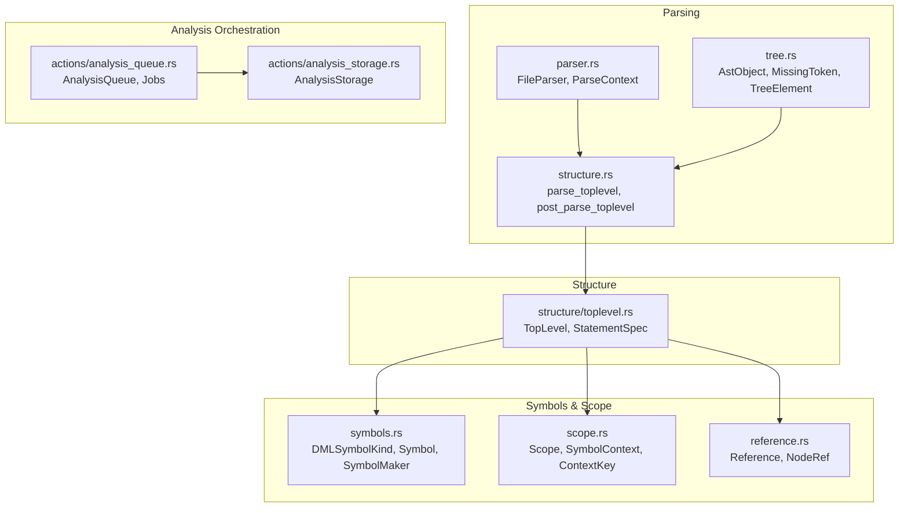
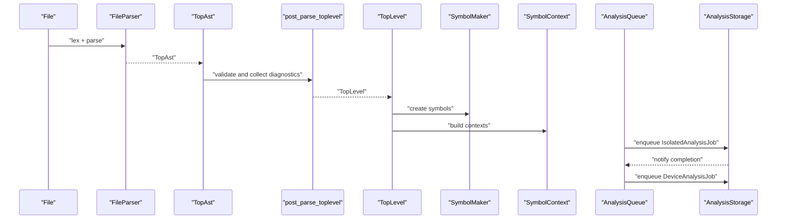
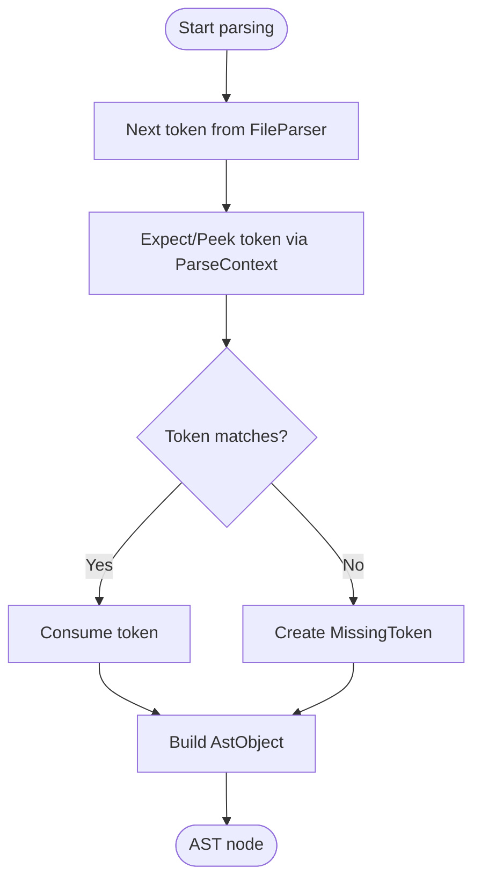
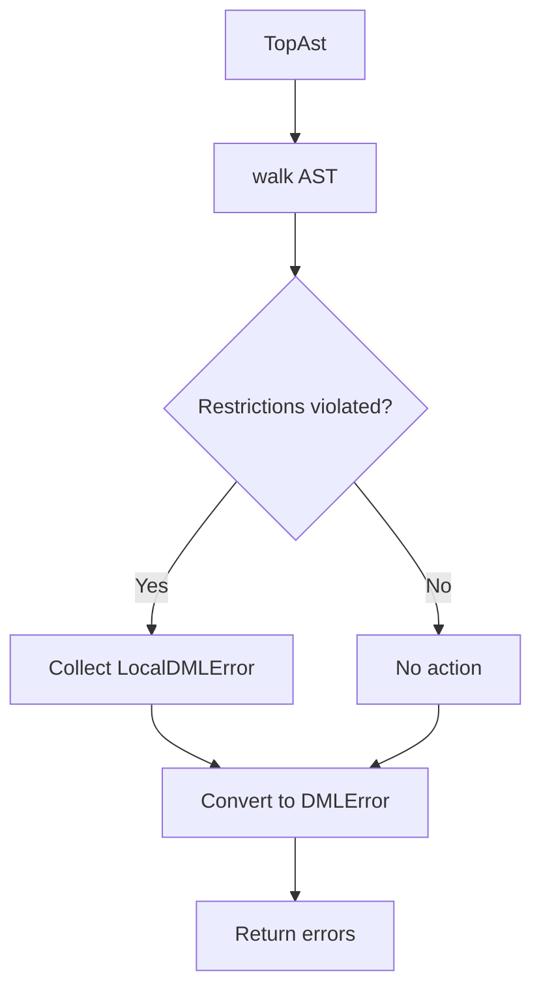
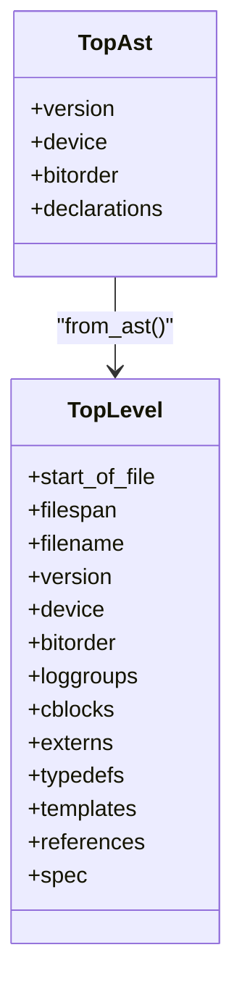
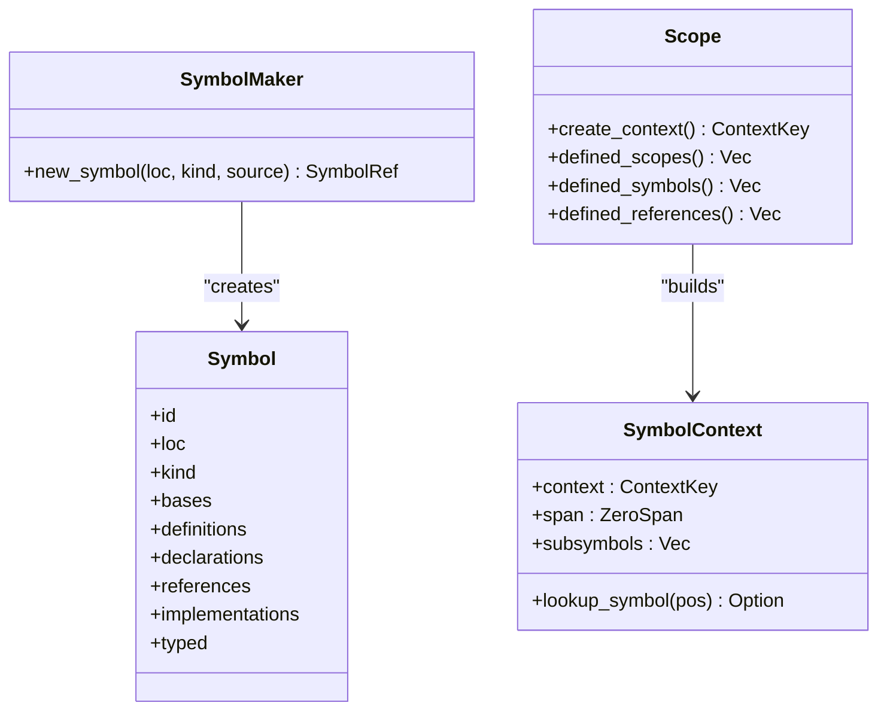
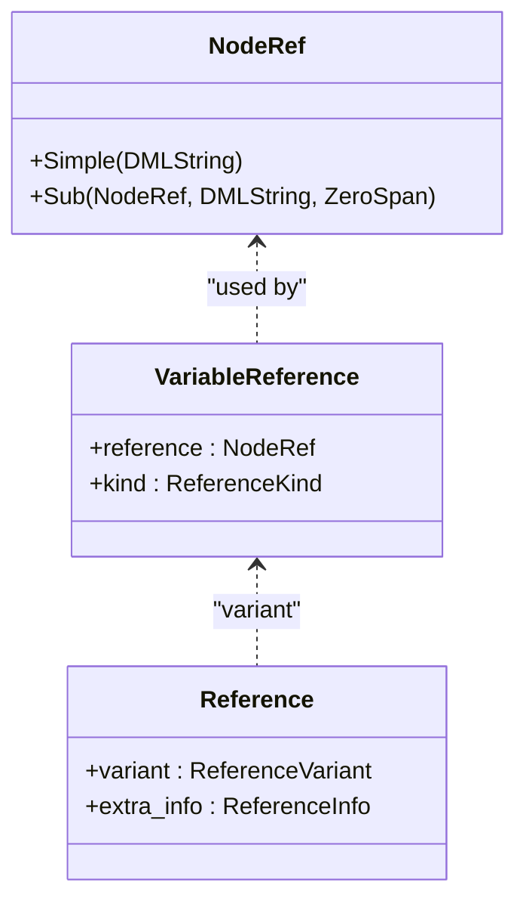
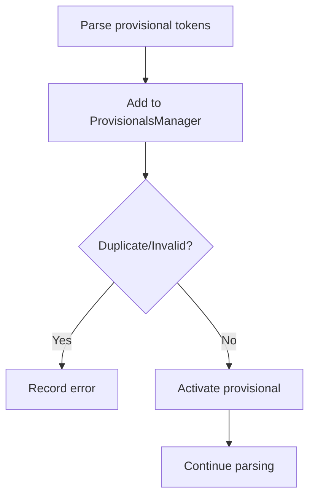
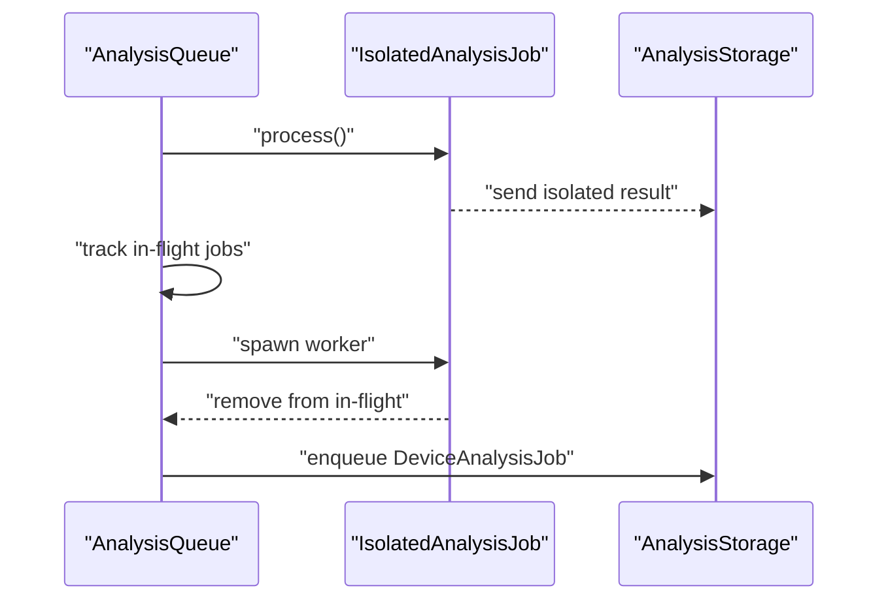
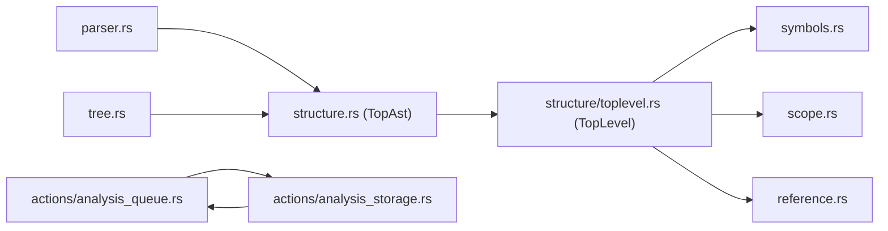

# Semantic Analysis Integration

<cite>
**Referenced Files in This Document**
- [analysis/mod.rs](file://src/analysis/mod.rs)
- [analysis/parsing/mod.rs](file://src/analysis/parsing/mod.rs)
- [analysis/parsing/parser.rs](file://src/analysis/parsing/parser.rs)
- [analysis/parsing/tree.rs](file://src/analysis/parsing/tree.rs)
- [analysis/parsing/structure.rs](file://src/analysis/parsing/structure.rs)
- [analysis/scope.rs](file://src/analysis/scope.rs)
- [analysis/symbols.rs](file://src/analysis/symbols.rs)
- [analysis/reference.rs](file://src/analysis/reference.rs)
- [analysis/structure/toplevel.rs](file://src/analysis/structure/toplevel.rs)
- [analysis/provisionals.rs](file://src/analysis/provisionals.rs)
- [actions/analysis_queue.rs](file://src/actions/analysis_queue.rs)
- [actions/analysis_storage.rs](file://src/actions/analysis_storage.rs)
</cite>

## Table of Contents
1. [Introduction](#introduction)
2. [Project Structure](#project-structure)
3. [Core Components](#core-components)
4. [Architecture Overview](#architecture-overview)
5. [Detailed Component Analysis](#detailed-component-analysis)
6. [Dependency Analysis](#dependency-analysis)
7. [Performance Considerations](#performance-considerations)
8. [Troubleshooting Guide](#troubleshooting-guide)
9. [Conclusion](#conclusion)

## Introduction
This document explains how parsed AST nodes integrate with the broader semantic analysis system. It covers symbol table population, type inference, scope resolution, post-parsing validation, and the integration with the analysis queue. It also details error propagation from parsing to semantic analysis and performance considerations for large codebases.

## Project Structure
The semantic analysis pipeline is implemented across several modules:
- Parsing: lexical analysis, tokenization, AST construction, and post-parse validation
- Structure transformation: conversion of raw AST into structured forms suitable for semantic analysis
- Symbol and scope systems: symbol creation, scoping, and context-aware lookups
- Analysis orchestration: queueing and coordination of isolated and device analyses

**Diagram sources**
- [analysis/parsing/parser.rs](file://src/analysis/parsing/parser.rs#L322-L483)
- [analysis/parsing/tree.rs](file://src/analysis/parsing/tree.rs#L320-L397)
- [analysis/parsing/structure.rs](file://src/analysis/parsing/structure.rs#L2165-L2215)
- [analysis/structure/toplevel.rs](file://src/analysis/structure/toplevel.rs#L546-L625)
- [analysis/symbols.rs](file://src/analysis/symbols.rs#L19-L34)
- [analysis/scope.rs](file://src/analysis/scope.rs#L13-L62)
- [analysis/reference.rs](file://src/analysis/reference.rs#L8-L26)
- [actions/analysis_queue.rs](file://src/actions/analysis_queue.rs#L39-L69)
- [actions/analysis_storage.rs](file://src/actions/analysis_storage.rs#L1-L60)

**Section sources**
- [analysis/parsing/mod.rs](file://src/analysis/parsing/mod.rs#L1-L16)
- [analysis/mod.rs](file://src/analysis/mod.rs#L1-L80)

## Core Components
- Parsing and AST construction: FileParser and ParseContext manage token consumption and context-aware parsing. Missing tokens are represented as structured errors.
- Post-parse validation: post_parse_toplevel validates top-level constructs and collects diagnostics.
- Structure transformation: TopLevel converts the AST into a form suitable for semantic analysis, including flattening conditional branches and collecting declarations.
- Symbol and scope system: DMLSymbolKind defines symbol categories; SymbolMaker creates symbols; Scope and SymbolContext enable hierarchical lookups.
- Reference model: NodeRef and Reference capture variable references and their kinds for later matching.
- Analysis orchestration: AnalysisQueue coordinates isolated and device analyses; AnalysisStorage stores results and triggers dependent analyses.

**Section sources**
- [analysis/parsing/parser.rs](file://src/analysis/parsing/parser.rs#L48-L320)
- [analysis/parsing/tree.rs](file://src/analysis/parsing/tree.rs#L234-L397)
- [analysis/parsing/structure.rs](file://src/analysis/parsing/structure.rs#L2203-L2215)
- [analysis/structure/toplevel.rs](file://src/analysis/structure/toplevel.rs#L546-L625)
- [analysis/symbols.rs](file://src/analysis/symbols.rs#L19-L331)
- [analysis/scope.rs](file://src/analysis/scope.rs#L13-L247)
- [analysis/reference.rs](file://src/analysis/reference.rs#L8-L220)
- [actions/analysis_queue.rs](file://src/actions/analysis_queue.rs#L39-L351)
- [actions/analysis_storage.rs](file://src/actions/analysis_storage.rs#L1-L100)

## Architecture Overview
The integration begins with parsing and continues through structure transformation, symbol table population, scope resolution, and finally semantic analysis. The analysis queue ensures incremental updates and avoids redundant work.

**Diagram sources**
- [analysis/parsing/parser.rs](file://src/analysis/parsing/parser.rs#L322-L483)
- [analysis/parsing/structure.rs](file://src/analysis/parsing/structure.rs#L2165-L2215)
- [analysis/structure/toplevel.rs](file://src/analysis/structure/toplevel.rs#L628-L700)
- [analysis/symbols.rs](file://src/analysis/symbols.rs#L240-L278)
- [analysis/scope.rs](file://src/analysis/scope.rs#L47-L61)
- [actions/analysis_queue.rs](file://src/actions/analysis_queue.rs#L399-L456)
- [actions/analysis_storage.rs](file://src/actions/analysis_storage.rs#L471-L503)

## Detailed Component Analysis

### Parsing and AST Construction
- FileParser advances tokens, skipping whitespace and comments, and tracks positions and skipped tokens. It reports unexpected tokens as LocalDMLError entries.
- ParseContext controls lookahead and context-aware consumption, generating MissingToken when expectations are not met.
- AstObject wraps parsed content with range metadata and MissingContent for absent constructs.

**Diagram sources**
- [analysis/parsing/parser.rs](file://src/analysis/parsing/parser.rs#L322-L483)
- [analysis/parsing/tree.rs](file://src/analysis/parsing/tree.rs#L320-L397)

**Section sources**
- [analysis/parsing/parser.rs](file://src/analysis/parsing/parser.rs#L48-L320)
- [analysis/parsing/tree.rs](file://src/analysis/parsing/tree.rs#L234-L397)

### Post-Parse Validation and Diagnostics
- post_parse_toplevel walks the AST and applies top-level restrictions, collecting LocalDMLError entries.
- Skipped tokens and missing constructs are converted to diagnostics for reporting.

**Diagram sources**
- [analysis/parsing/structure.rs](file://src/analysis/parsing/structure.rs#L2203-L2215)
- [analysis/mod.rs](file://src/analysis/mod.rs#L1540-L1551)

**Section sources**
- [analysis/parsing/structure.rs](file://src/analysis/parsing/structure.rs#L2203-L2215)
- [analysis/mod.rs](file://src/analysis/mod.rs#L1540-L1551)

### Structure Transformation for Semantic Analysis
- TopLevel::from_ast transforms the AST into a structured representation, flattening conditional branches and categorizing declarations.
- It validates top-level statements and records diagnostics for violations.

**Diagram sources**
- [analysis/structure/toplevel.rs](file://src/analysis/structure/toplevel.rs#L546-L625)
- [analysis/parsing/structure.rs](file://src/analysis/parsing/structure.rs#L2165-L2215)

**Section sources**
- [analysis/structure/toplevel.rs](file://src/analysis/structure/toplevel.rs#L628-L800)
- [analysis/parsing/structure.rs](file://src/analysis/parsing/structure.rs#L2165-L2215)

### Symbol Table Population and Scope Resolution
- DMLSymbolKind enumerates symbol categories (objects, parameters, methods, etc.).
- SymbolMaker creates symbols with location spans, definitions, declarations, and references.
- Scope and SymbolContext build hierarchical contexts; ScopeContainer and MakeScopeContainer aggregate nested scopes.
- ContextKey identifies context roots (structure, method, template) for lookups.

**Diagram sources**
- [analysis/symbols.rs](file://src/analysis/symbols.rs#L19-L331)
- [analysis/scope.rs](file://src/analysis/scope.rs#L13-L247)

**Section sources**
- [analysis/symbols.rs](file://src/analysis/symbols.rs#L19-L331)
- [analysis/scope.rs](file://src/analysis/scope.rs#L13-L247)

### Reference Model and Matching
- NodeRef represents dotted references (e.g., a.b.c); VariableReference and GlobalReference encapsulate reference kinds.
- Reference containers collect references during traversal; TopLevel aggregates references for later matching.

**Diagram sources**
- [analysis/reference.rs](file://src/analysis/reference.rs#L8-L220)

**Section sources**
- [analysis/reference.rs](file://src/analysis/reference.rs#L8-L220)

### Provisionals and Post-Parse Processing
- ProvisionalsManager tracks active provisional features and duplicates/invalid entries.
- During parsing, provisionals are parsed and added to the manager; errors are surfaced as diagnostics.

**Diagram sources**
- [analysis/provisionals.rs](file://src/analysis/provisionals.rs#L28-L64)
- [analysis/parsing/structure.rs](file://src/analysis/parsing/structure.rs#L2169-L2181)

**Section sources**
- [analysis/provisionals.rs](file://src/analysis/provisionals.rs#L13-L81)
- [analysis/parsing/structure.rs](file://src/analysis/parsing/structure.rs#L2169-L2181)

### Integration with Analysis Queue and Storage
- IsolatedAnalysisJob parses a single file, runs post-parse validation, and emits results.
- DeviceAnalysisJob composes isolated analyses into device-level analysis, notifying upon completion.
- AnalysisStorage manages results and invalidations, triggering dependent device analyses.

**Diagram sources**
- [actions/analysis_queue.rs](file://src/actions/analysis_queue.rs#L399-L456)
- [actions/analysis_queue.rs](file://src/actions/analysis_queue.rs#L532-L555)
- [actions/analysis_storage.rs](file://src/actions/analysis_storage.rs#L471-L503)

**Section sources**
- [actions/analysis_queue.rs](file://src/actions/analysis_queue.rs#L39-L351)
- [actions/analysis_storage.rs](file://src/actions/analysis_storage.rs#L1-L100)

## Dependency Analysis
The semantic analysis system exhibits layered dependencies:
- Parsing depends on lexer and token kinds; AST nodes depend on tree structures and missing content.
- Structure transformation depends on parsing outputs and builds TopLevel.
- Symbols and scopes depend on structure declarations and references.
- Analysis orchestration depends on both parsing and structure outputs.

**Diagram sources**
- [analysis/parsing/parser.rs](file://src/analysis/parsing/parser.rs#L322-L483)
- [analysis/parsing/structure.rs](file://src/analysis/parsing/structure.rs#L2165-L2215)
- [analysis/structure/toplevel.rs](file://src/analysis/structure/toplevel.rs#L546-L625)
- [analysis/symbols.rs](file://src/analysis/symbols.rs#L19-L331)
- [analysis/scope.rs](file://src/analysis/scope.rs#L13-L247)
- [analysis/reference.rs](file://src/analysis/reference.rs#L8-L220)
- [actions/analysis_queue.rs](file://src/actions/analysis_queue.rs#L39-L351)
- [actions/analysis_storage.rs](file://src/actions/analysis_storage.rs#L1-L100)

**Section sources**
- [analysis/parsing/mod.rs](file://src/analysis/parsing/mod.rs#L1-L16)
- [analysis/mod.rs](file://src/analysis/mod.rs#L1-L80)

## Performance Considerations
- Incremental analysis: AnalysisQueue deduplicates and prunes redundant jobs, reducing repeated work.
- In-memory caching: AnalysisStorage timestamps and invalidates results to avoid stale computations.
- Parallelism: The queue spawns workers per job, enabling concurrent isolated and device analyses.
- Early bail: Non-DML-1.4 files short-circuit further analysis to prevent unnecessary computation.
- Spatial indexing: RangeEntry provides scope-aware symbol lookup; consider upgrading to spatial data structures for very large files.

[No sources needed since this section provides general guidance]

## Troubleshooting Guide
Common issues and their origins:
- Unexpected tokens and missing constructs: Reported by FileParser and converted to LocalDMLError, then to DMLError for client display.
- Duplicate or invalid provisionals: Errors are appended to diagnostics during isolated analysis.
- Non-DML-1.4 files: Analysis is aborted early with a diagnostic error.
- Missing imports: Resolved during isolated analysis; missing imports are tracked and surfaced.

**Section sources**
- [analysis/parsing/parser.rs](file://src/analysis/parsing/parser.rs#L475-L482)
- [analysis/mod.rs](file://src/analysis/mod.rs#L1602-L1623)
- [analysis/mod.rs](file://src/analysis/mod.rs#L1637-L1653)
- [actions/analysis_queue.rs](file://src/actions/analysis_queue.rs#L399-L456)

## Conclusion
Parsed AST nodes are transformed into a structured TopLevel representation, validated, and integrated into the symbol and scope systems. The analysis queue orchestrates incremental isolated and device analyses, ensuring efficient and accurate semantic processing. Errors originating from parsing propagate through post-parse validation and are surfaced to the client, maintaining a robust development experience.