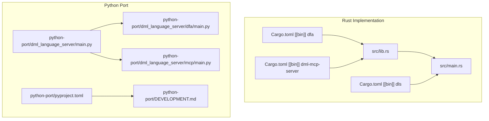
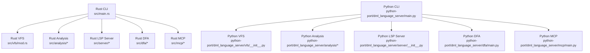
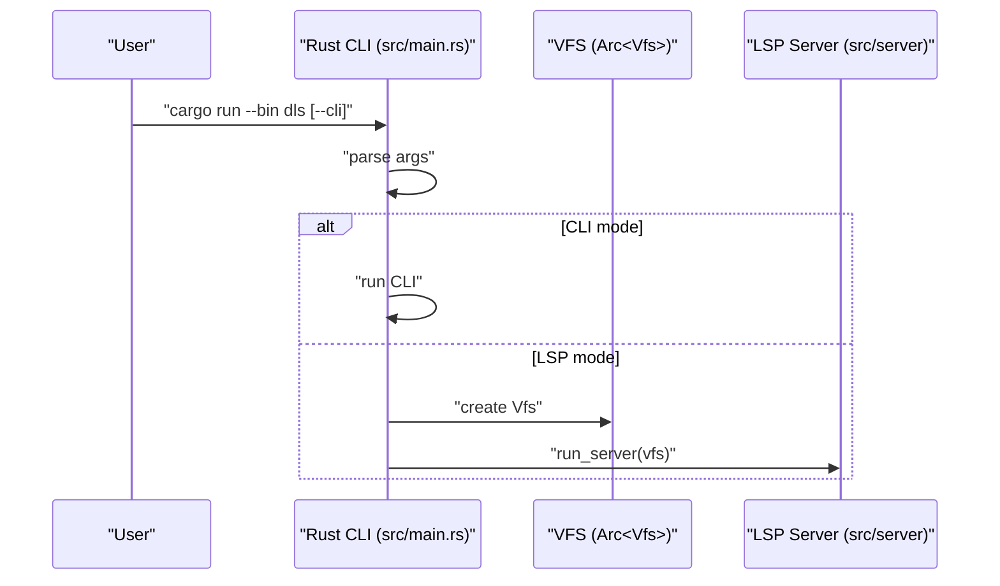
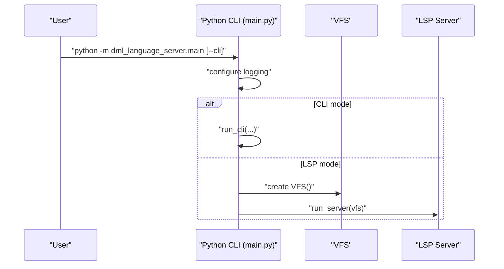
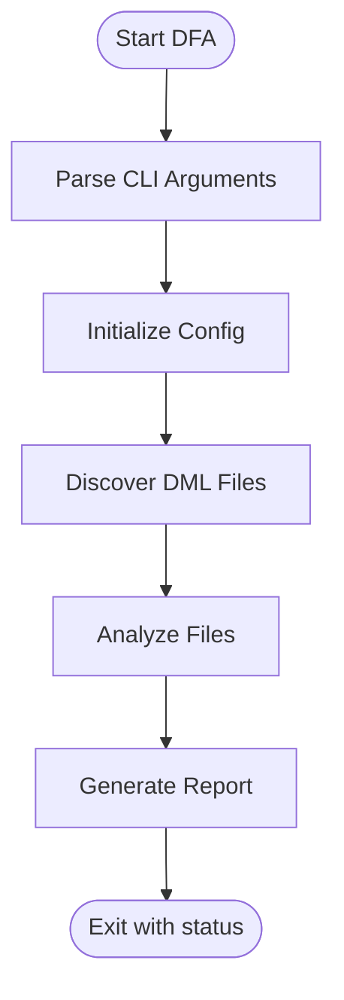
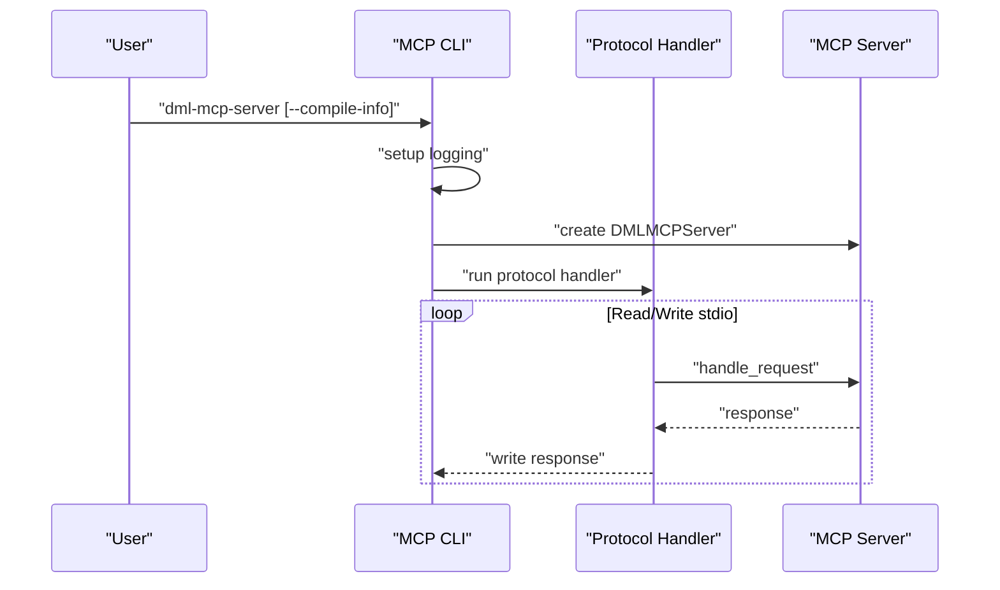
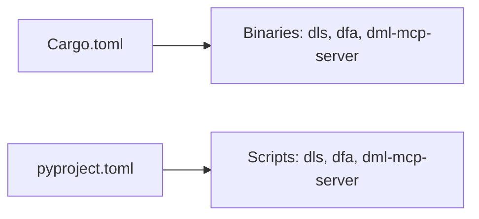

# Development Guide

<cite>
**Referenced Files in This Document**
- [README.md](file://README.md)
- [CONTRIBUTING.md](file://CONTRIBUTING.md)
- [Cargo.toml](file://Cargo.toml)
- [USAGE.md](file://USAGE.md)
- [python-port/DEVELOPMENT.md](file://python-port/DEVELOPMENT.md)
- [python-port/pyproject.toml](file://python-port/pyproject.toml)
- [python-port/ENHANCEMENT_PLAN.md](file://python-port/ENHANCEMENT_PLAN.md)
- [python-port/IMPLEMENTATION_SUMMARY.md](file://python-port/IMPLEMENTATION_SUMMARY.md)
- [python-port/ENHANCEMENTS_COMPLETED.md](file://python-port/ENHANCEMENTS_COMPLETED.md)
- [src/lib.rs](file://src/lib.rs)
- [src/main.rs](file://src/main.rs)
- [python-port/dml_language_server/main.py](file://python-port/dml_language_server/main.py)
- [python-port/dml_language_server/dfa/main.py](file://python-port/dml_language_server/dfa/main.py)
- [python-port/dml_language_server/mcp/main.py](file://python-port/dml_language_server/mcp/main.py)
- [python-port/tests/test_basic.py](file://python-port/tests/test_basic.py)
- [python-port/tests/test_installation.py](file://python-port/tests/test_installation.py)
</cite>

## Table of Contents
1. [Introduction](#introduction)
2. [Project Structure](#project-structure)
3. [Core Components](#core-components)
4. [Architecture Overview](#architecture-overview)
5. [Detailed Component Analysis](#detailed-component-analysis)
6. [Dependency Analysis](#dependency-analysis)
7. [Performance Considerations](#performance-considerations)
8. [Troubleshooting Guide](#troubleshooting-guide)
9. [Release Process and Versioning](#release-process-and-versioning)
10. [Contribution Guidelines](#contribution-guidelines)
11. [Development Environment Setup](#development-environment-setup)
12. [Testing Strategy](#testing-strategy)
13. [Debugging and Profiling](#debugging-and-profiling)
14. [Enhancement Planning and Milestones](#enhancement-planning-and-milestones)
15. [Conclusion](#conclusion)

## Introduction
This development guide explains how to build, develop, and contribute to the DML Language Server (DLS). The project includes both a Rust implementation and a Python port. The Rust codebase provides the canonical language server and supporting binaries, while the Python port mirrors core functionality and serves as a complementary implementation for environments preferring Python tooling.

Key goals:
- Understand the build system and development workflow for both Rust and Python.
- Learn coding standards, environment setup, testing, and contribution procedures.
- Track enhancements, milestones, and release processes.
- Debug and profile both implementations effectively.

## Project Structure
The repository is organized into:
- Rust implementation under src/ with binaries for the language server, DFA (Direct-File-Analysis), and MCP server.
- Python port under python-port/ with a comparable feature set and CLI tools.
- Documentation and configuration files for both implementations.

**Diagram sources**
- [src/lib.rs](file://src/lib.rs#L32-L48)
- [src/main.rs](file://src/main.rs#L15-L59)
- [Cargo.toml](file://Cargo.toml#L18-L31)
- [python-port/dml_language_server/main.py](file://python-port/dml_language_server/main.py#L52-L90)
- [python-port/dml_language_server/dfa/main.py](file://python-port/dml_language_server/dfa/main.py#L78-L90)
- [python-port/dml_language_server/mcp/main.py](file://python-port/dml_language_server/mcp/main.py#L115-L162)
- [python-port/pyproject.toml](file://python-port/pyproject.toml#L60-L63)

**Section sources**
- [README.md](file://README.md#L1-L57)
- [Cargo.toml](file://Cargo.toml#L1-L62)
- [python-port/pyproject.toml](file://python-port/pyproject.toml#L1-L106)

## Core Components
- Rust language server binary (dls) with CLI mode and LSP server mode.
- DFA binary for batch analysis of DML files.
- MCP server for AI-assisted development features.
- Python port mirroring core functionality with CLI tools and tests.

Key entry points:
- Rust: [src/main.rs](file://src/main.rs#L15-L59)
- Python: [python-port/dml_language_server/main.py](file://python-port/dml_language_server/main.py#L52-L90)

**Section sources**
- [src/main.rs](file://src/main.rs#L15-L59)
- [python-port/dml_language_server/main.py](file://python-port/dml_language_server/main.py#L52-L90)

## Architecture Overview
Both implementations share a layered architecture:
- CLI layer for user interaction and mode selection.
- Virtual File System (VFS) for file caching and change detection.
- Analysis engine for parsing, semantic analysis, and symbol resolution.
- LSP server for protocol communication.
- DFA tool for batch analysis.
- MCP server for AI-assisted development.

**Diagram sources**
- [src/main.rs](file://src/main.rs#L52-L58)
- [python-port/dml_language_server/main.py](file://python-port/dml_language_server/main.py#L74-L84)
- [src/lib.rs](file://src/lib.rs#L32-L48)

## Detailed Component Analysis

### Rust Language Server Binary
- Entry point parses CLI args and selects CLI or LSP server mode.
- Initializes logging and VFS for LSP mode.

**Diagram sources**
- [src/main.rs](file://src/main.rs#L44-L59)

**Section sources**
- [src/main.rs](file://src/main.rs#L15-L59)

### Python Language Server Binary
- Mirrors Rust CLI behavior with Click-based options.
- Supports CLI mode and LSP server mode with async runtime.

**Diagram sources**
- [python-port/dml_language_server/main.py](file://python-port/dml_language_server/main.py#L74-L84)

**Section sources**
- [python-port/dml_language_server/main.py](file://python-port/dml_language_server/main.py#L52-L90)

### DFA Tools
- Rust DFA: [src/dfa/main.rs](file://src/dfa/main.rs)
- Python DFA: [python-port/dml_language_server/dfa/main.py](file://python-port/dml_language_server/dfa/main.py#L78-L90)

**Diagram sources**
- [python-port/dml_language_server/dfa/main.py](file://python-port/dml_language_server/dfa/main.py#L132-L279)

**Section sources**
- [python-port/dml_language_server/dfa/main.py](file://python-port/dml_language_server/dfa/main.py#L78-L90)

### MCP Server
- Rust MCP: [src/mcp/main.rs](file://src/mcp/main.rs)
- Python MCP: [python-port/dml_language_server/mcp/main.py](file://python-port/dml_language_server/mcp/main.py#L115-L162)

**Diagram sources**
- [python-port/dml_language_server/mcp/main.py](file://python-port/dml_language_server/mcp/main.py#L29-L95)

**Section sources**
- [python-port/dml_language_server/mcp/main.py](file://python-port/dml_language_server/mcp/main.py#L115-L162)

## Dependency Analysis
Rust dependencies are declared in Cargo.toml; Python dependencies are declared in pyproject.toml. Both define binaries and scripts for CLI tools.

**Diagram sources**
- [Cargo.toml](file://Cargo.toml#L18-L31)
- [python-port/pyproject.toml](file://python-port/pyproject.toml#L60-L63)

**Section sources**
- [Cargo.toml](file://Cargo.toml#L18-L31)
- [python-port/pyproject.toml](file://python-port/pyproject.toml#L60-L63)

## Performance Considerations
- Python port performance is documented with comparative metrics and known limitations.
- Recommendations include caching, incremental parsing, and optimizing hot paths.

**Section sources**
- [python-port/ENHANCEMENTS_COMPLETED.md](file://python-port/ENHANCEMENTS_COMPLETED.md#L111-L140)

## Troubleshooting Guide
Common issues and resolutions:
- Import errors: verify Python path and virtual environment.
- Async issues: ensure proper use of async/await and event loops.
- File watching: confirm watcher lifecycle and cleanup.
- Memory leaks: clear caches and close resources.
- LSP protocol errors: validate JSON-RPC message format and LSP spec compliance.
- Performance problems: profile with cProfile or py-spy; optimize hot paths.

**Section sources**
- [python-port/DEVELOPMENT.md](file://python-port/DEVELOPMENT.md#L231-L345)

## Release Process and Versioning
- Rust version is managed in Cargo.toml.
- Python version is managed in pyproject.toml.
- Release steps include updating versions, changelog entries, creating release branches, tagging, and publishing.

**Section sources**
- [Cargo.toml](file://Cargo.toml#L3-L4)
- [python-port/pyproject.toml](file://python-port/pyproject.toml#L6-L8)
- [python-port/DEVELOPMENT.md](file://python-port/DEVELOPMENT.md#L308-L317)

## Contribution Guidelines
- Licensing: dual Apache-2.0/MIT; contributors must agree to license terms.
- Sign your work: use Signed-off-by in commits.
- How-To: building, running, testing, and CLI usage are documented.
- Implementation overview: analysis phases, LSP communication, include paths, and device contexts.
- Coding standards: follow Python formatting and linting tools; Rust follows Clippy and lints.

**Section sources**
- [CONTRIBUTING.md](file://CONTRIBUTING.md#L7-L133)
- [python-port/DEVELOPMENT.md](file://python-port/DEVELOPMENT.md#L76-L127)

## Development Environment Setup
Rust environment:
- Build with cargo build --release.
- Run binaries via cargo run --bin dls, cargo run --bin dfa, or cargo run --bin dml-mcp-server.

Python environment:
- Create a virtual environment and install in development mode with dev extras.
- Verify installation with test scripts.

**Section sources**
- [README.md](file://README.md#L22-L24)
- [CONTRIBUTING.md](file://CONTRIBUTING.md#L76-L82)
- [python-port/DEVELOPMENT.md](file://python-port/DEVELOPMENT.md#L50-L73)

## Testing Strategy
Rust:
- Run tests with cargo test.
- Minimal test coverage exists; significant work remains to improve the testing story.

Python:
- Run pytest for unit and integration tests.
- Test categories include unit, integration, LSP compliance, performance, and example tests.
- Example tests use files from the examples directory.

**Section sources**
- [CONTRIBUTING.md](file://CONTRIBUTING.md#L107-L111)
- [python-port/DEVELOPMENT.md](file://python-port/DEVELOPMENT.md#L254-L270)
- [python-port/tests/test_basic.py](file://python-port/tests/test_basic.py#L1-L239)
- [python-port/tests/test_installation.py](file://python-port/tests/test_installation.py#L1-L237)

## Debugging and Profiling
Rust:
- Use cargo run --bin dls with --cli to enter interactive mode.
- Follow CLI commands and initialization messages to isolate issues.

Python:
- Enable verbose logging with --verbose flags for server, DFA, and MCP tools.
- Use debug logs and protocol handlers to diagnose LSP and MCP interactions.

**Section sources**
- [CONTRIBUTING.md](file://CONTRIBUTING.md#L113-L133)
- [python-port/DEVELOPMENT.md](file://python-port/DEVELOPMENT.md#L204-L230)

## Enhancement Planning and Milestones
The Python port maintains an enhancement plan and completion reports:
- Critical missing features include lint rules, actions module, analysis modules, VFS enhancements, and MCP server.
- Implementation priority is organized into phases with success criteria aligned to parity with the Rust implementation.

**Section sources**
- [python-port/ENHANCEMENT_PLAN.md](file://python-port/ENHANCEMENT_PLAN.md#L1-L85)
- [python-port/IMPLEMENTATION_SUMMARY.md](file://python-port/IMPLEMENTATION_SUMMARY.md#L1-L186)
- [python-port/ENHANCEMENTS_COMPLETED.md](file://python-port/ENHANCEMENTS_COMPLETED.md#L1-L180)

## Conclusion
This guide consolidates build, development, and contribution practices for both the Rust and Python implementations of the DML Language Server. It outlines environment setup, testing, debugging, performance considerations, and the enhancement roadmap. Contributors should align with the documented standards and use the provided tools and scripts to integrate changes effectively.