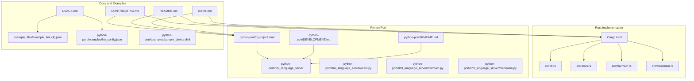
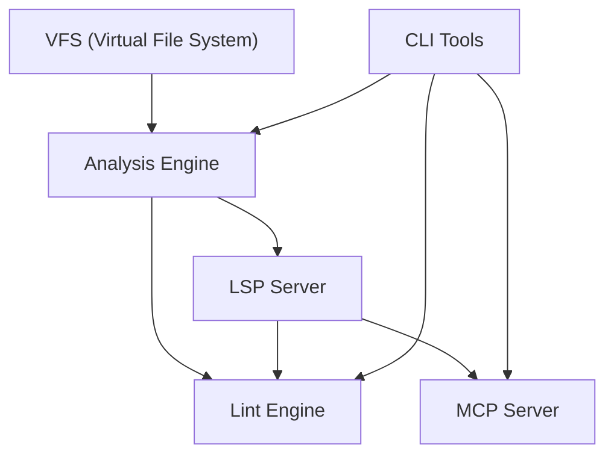
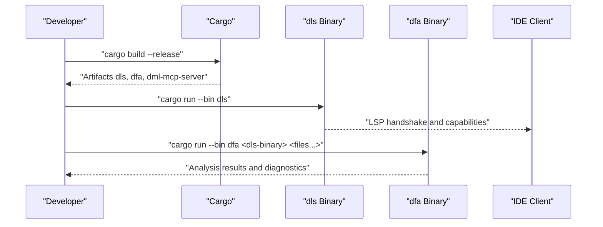
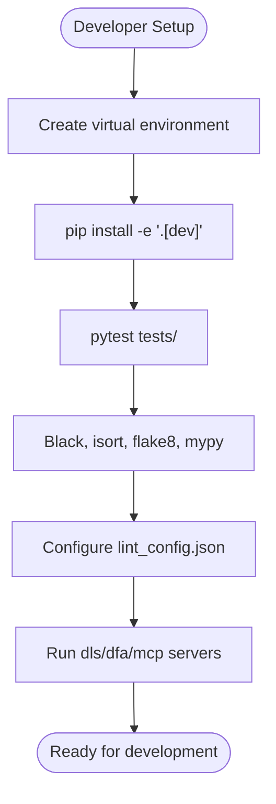
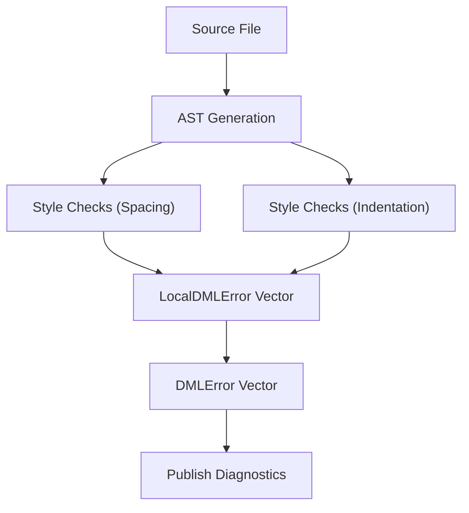
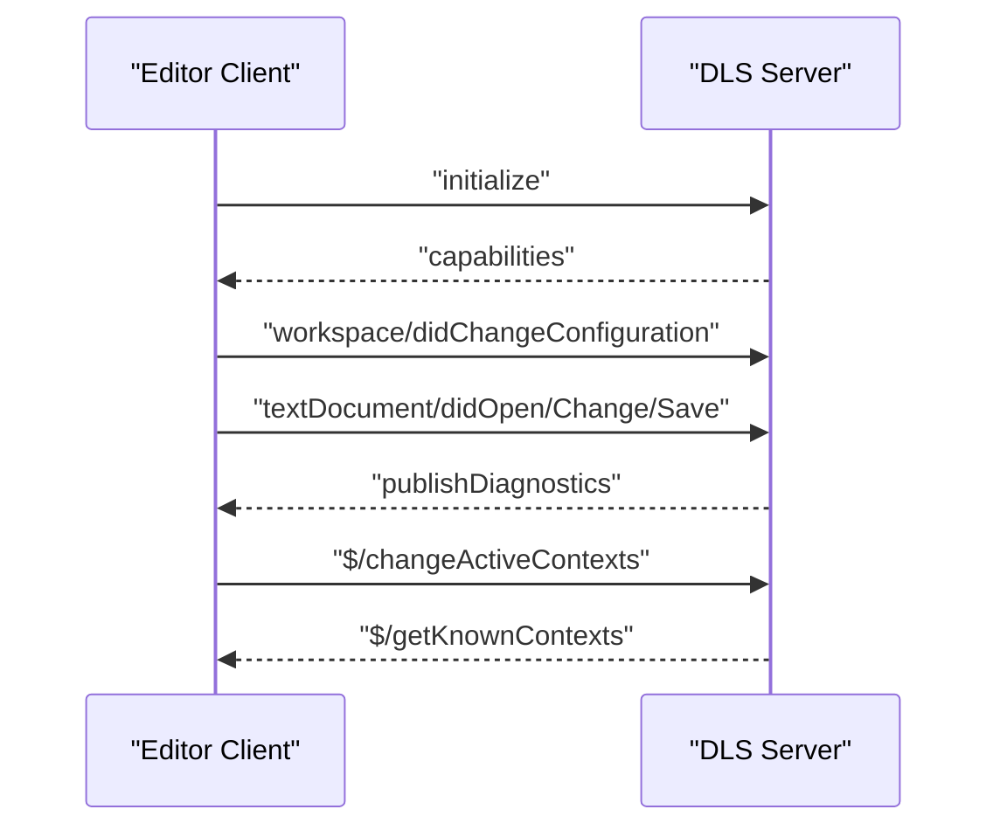
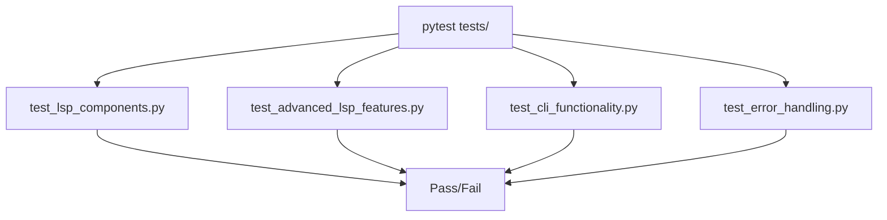
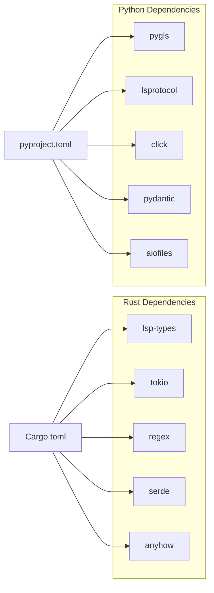

# Development and Contributing

<cite>
**Referenced Files in This Document**
- [CONTRIBUTING.md](file://CONTRIBUTING.md)
- [README.md](file://README.md)
- [USAGE.md](file://USAGE.md)
- [clients.md](file://clients.md)
- [CODE_OF_CONDUCT.md](file://CODE_OF_CONDUCT.md)
- [SECURITY.md](file://SECURITY.md)
- [Cargo.toml](file://Cargo.toml)
- [deny.toml](file://deny.toml)
- [python-port/DEVELOPMENT.md](file://python-port/DEVELOPMENT.md)
- [python-port/README.md](file://python-port/README.md)
- [python-port/pyproject.toml](file://python-port/pyproject.toml)
- [python-port/tests/README.md](file://python-port/tests/README.md)
- [src/lint/README.md](file://src/lint/README.md)
- [example_files/example_lint_cfg.json](file://example_files/example_lint_cfg.json)
- [python-port/examples/lint_config.json](file://python-port/examples/lint_config.json)
- [python-port/examples/sample_device.dml](file://python-port/examples/sample_device.dml)
</cite>

## Table of Contents
1. [Introduction](#introduction)
2. [Project Structure](#project-structure)
3. [Core Components](#core-components)
4. [Architecture Overview](#architecture-overview)
5. [Detailed Component Analysis](#detailed-component-analysis)
6. [Dependency Analysis](#dependency-analysis)
7. [Performance Considerations](#performance-considerations)
8. [Troubleshooting Guide](#troubleshooting-guide)
9. [Conclusion](#conclusion)
10. [Appendices](#appendices)

## Introduction
This document provides comprehensive guidance for setting up a development environment, understanding the contribution workflow, and making meaningful contributions to the DML Language Server project. It covers both the Rust implementation and the Python port, including local build procedures, dependency management, testing requirements, code style conventions, architectural principles, review processes, governance, issue reporting, feature requests, cross-platform considerations, release procedures, licensing, code of conduct, and community engagement practices.

## Project Structure
The repository contains:
- A Rust implementation of the DML Language Server with binaries for the server, DFA (Direct-File-Analysis), and MCP server.
- A Python port that mirrors the Rust architecture, including LSP, DFA, MCP, linting, and CLI tooling.
- Supporting documentation for usage, client integration, and contribution guidelines.
- Example lint configurations and sample DML files for testing and demonstration.

**Diagram sources**
- [Cargo.toml](file://Cargo.toml#L1-L62)
- [python-port/pyproject.toml](file://python-port/pyproject.toml#L1-L106)
- [README.md](file://README.md#L1-L57)
- [USAGE.md](file://USAGE.md#L1-L48)
- [clients.md](file://clients.md#L1-L191)
- [CONTRIBUTING.md](file://CONTRIBUTING.md#L1-L225)
- [example_files/example_lint_cfg.json](file://example_files/example_lint_cfg.json#L1-L23)
- [python-port/examples/lint_config.json](file://python-port/examples/lint_config.json#L1-L25)
- [python-port/examples/sample_device.dml](file://python-port/examples/sample_device.dml#L1-L188)

**Section sources**
- [README.md](file://README.md#L1-L57)
- [python-port/README.md](file://python-port/README.md#L1-L243)
- [python-port/DEVELOPMENT.md](file://python-port/DEVELOPMENT.md#L1-L345)

## Core Components
- Rust implementation:
  - Binaries: dls (server), dfa (Direct-File-Analysis), dml-mcp-server.
  - Libraries and modules for parsing, structure analysis, templating, linting, MCP, VFS, and LSP integration.
- Python port:
  - LSP server, DFA, MCP server, lint engine, VFS, CLI tools, and tests.
  - Configuration via pyproject.toml and example lint configurations.

Key development areas:
- Local builds and running binaries.
- Testing with cargo test and pytest.
- Linting and style enforcement.
- Client integration and protocol extensions.

**Section sources**
- [CONTRIBUTING.md](file://CONTRIBUTING.md#L72-L130)
- [README.md](file://README.md#L22-L57)
- [python-port/DEVELOPMENT.md](file://python-port/DEVELOPMENT.md#L42-L127)
- [python-port/README.md](file://python-port/README.md#L17-L243)

## Architecture Overview
The DLS follows a modular architecture:
- Virtual File System (VFS) manages file operations and change detection.
- Analysis engine performs parsing and semantic analysis.
- LSP server handles Language Server Protocol communication.
- Lint engine provides configurable code quality checks.
- MCP server integrates Model Context Protocol for AI-assisted development.
- CLI tools support batch analysis and diagnostics.

**Diagram sources**
- [python-port/DEVELOPMENT.md](file://python-port/DEVELOPMENT.md#L128-L153)
- [python-port/README.md](file://python-port/README.md#L167-L177)

**Section sources**
- [python-port/DEVELOPMENT.md](file://python-port/DEVELOPMENT.md#L128-L153)
- [python-port/README.md](file://python-port/README.md#L167-L177)

## Detailed Component Analysis

### Rust Implementation
- Build and run:
  - Build with cargo build --release.
  - Run server with cargo run --bin dls.
  - Use DFA binary with cargo run --bin dfa [options ...] <dls-binary> [files ...].
  - CLI mode via dls --cli for interactive debugging.
- Testing:
  - cargo test for unit/regression tests.
  - CLI commands and positions are zero-based.
- Linting:
  - Lint module architecture and rule categories (spacing, indentation).
  - Configurable via lint configuration JSON and inline directives.
- Protocol and device contexts:
  - LSP over stdio/json.
  - Include paths resolved context-awarely.
  - Device contexts modes (Always, Never, AnyNew, SameModule, First).

**Diagram sources**
- [CONTRIBUTING.md](file://CONTRIBUTING.md#L72-L108)
- [README.md](file://README.md#L22-L57)

**Section sources**
- [CONTRIBUTING.md](file://CONTRIBUTING.md#L72-L130)
- [src/lint/README.md](file://src/lint/README.md#L1-L67)
- [USAGE.md](file://USAGE.md#L15-L48)

### Python Port
- Development setup:
  - Python 3.8+, virtual environment, pip install -e ".[dev]".
  - Run tests with pytest; code quality with Black, isort, flake8, mypy.
- Architecture and data flow mirror Rust implementation.
- CLI tools: dls, dfa, dml-mcp-server scripts defined in pyproject.toml.
- Lint configuration examples and device samples in examples/.

**Diagram sources**
- [python-port/DEVELOPMENT.md](file://python-port/DEVELOPMENT.md#L42-L127)
- [python-port/pyproject.toml](file://python-port/pyproject.toml#L44-L63)

**Section sources**
- [python-port/DEVELOPMENT.md](file://python-port/DEVELOPMENT.md#L42-L127)
- [python-port/README.md](file://python-port/README.md#L17-L243)
- [python-port/pyproject.toml](file://python-port/pyproject.toml#L1-L106)

### Linting Rules and Configuration
- Rust lint module:
  - Rules categorized by style (spacing, indentation).
  - Configurable via lint configuration JSON and inline directives.
- Python lint engine:
  - Configurable rules and levels in lint_config.json.
  - Example configuration enables indentation, spacing, naming rules with specific parameters.

**Diagram sources**
- [src/lint/README.md](file://src/lint/README.md#L9-L21)

**Section sources**
- [src/lint/README.md](file://src/lint/README.md#L1-L67)
- [USAGE.md](file://USAGE.md#L15-L48)
- [example_files/example_lint_cfg.json](file://example_files/example_lint_cfg.json#L1-L23)
- [python-port/examples/lint_config.json](file://python-port/examples/lint_config.json#L1-L25)

### Client Integration and Protocol Extensions
- Implementing clients:
  - Use existing LSP support in editors; ensure restart after crashes.
  - Send workspace/didChangeConfiguration notifications.
  - Support required LSP notifications and requests.
- Protocol extensions:
  - Custom notifications/requests for context control.
  - Progress notifications and capability registration.

**Diagram sources**
- [clients.md](file://clients.md#L63-L181)

**Section sources**
- [clients.md](file://clients.md#L1-L191)

### Testing Infrastructure
- Rust:
  - cargo test for unit and regression tests.
- Python:
  - pytest tests/ with coverage and verbose options.
  - Dedicated test files for LSP components, advanced LSP features, CLI functionality, and error handling.
  - Example DML files and CLI expectations documented.

**Diagram sources**
- [python-port/tests/README.md](file://python-port/tests/README.md#L1-L157)

**Section sources**
- [CONTRIBUTING.md](file://CONTRIBUTING.md#L103-L108)
- [python-port/tests/README.md](file://python-port/tests/README.md#L1-L157)

## Dependency Analysis
- Rust:
  - Cargo.toml lists dependencies for LSP, JSON-RPC, regex, rayon, tokio, and others.
  - deny.toml enforces license checks and dependency policies.
- Python:
  - pyproject.toml defines core dependencies (pygls, lsprotocol, click, pydantic, aiofiles, watchdog, regex, jsonrpc-base, typing-extensions, dataclasses-json, pathspec, tenacity) and optional dev and mcp groups.
  - Scripts mapped to console entry points.

**Diagram sources**
- [Cargo.toml](file://Cargo.toml#L33-L62)
- [deny.toml](file://deny.toml#L84-L142)
- [python-port/pyproject.toml](file://python-port/pyproject.toml#L28-L58)

**Section sources**
- [Cargo.toml](file://Cargo.toml#L1-L62)
- [deny.toml](file://deny.toml#L1-L240)
- [python-port/pyproject.toml](file://python-port/pyproject.toml#L1-L106)

## Performance Considerations
- Rust:
  - Use cargo build --release for optimized builds.
  - Profile and optimize hot paths; leverage rayon for parallelism.
- Python:
  - Incremental parsing, efficient symbol lookups, and smart cache invalidation.
  - Limit diagnostics per file and implement request cancellation for LSP.

**Section sources**
- [CONTRIBUTING.md](file://CONTRIBUTING.md#L238-L252)
- [python-port/DEVELOPMENT.md](file://python-port/DEVELOPMENT.md#L238-L252)

## Troubleshooting Guide
- Rust:
  - CLI mode debugging with dls --cli and zero-based positions.
  - Review initialization messages and protocol behavior.
- Python:
  - Enable verbose logging for dls, dfa, and dml-mcp-server.
  - Check import paths, async/await correctness, file watcher cleanup, and memory leaks.
  - Use cProfile or py-spy for profiling.

**Section sources**
- [CONTRIBUTING.md](file://CONTRIBUTING.md#L109-L130)
- [python-port/DEVELOPMENT.md](file://python-port/DEVELOPMENT.md#L204-L237)

## Conclusion
This guide consolidates development workflows, contribution processes, and operational practices for both the Rust and Python implementations of the DML Language Server. It provides actionable steps for building, testing, linting, integrating clients, and following governance and code of conduct standards. Contributors can use this document to set up reliable development environments, implement new features, and engage with the community effectively.

## Appendices

### A. Development Environment Setup

- Rust
  - Install Rust toolchain and Cargo.
  - Build with cargo build --release.
  - Run server with cargo run --bin dls.
  - Use DFA with cargo run --bin dfa [options ...] <dls-binary> [files ...].
  - Test with cargo test.
  - CLI mode via cargo run --bin dls -- --cli.

- Python
  - Create and activate a virtual environment.
  - Install in editable mode with development extras: pip install -e ".[dev]".
  - Run tests with pytest; verify with python test_installation.py.
  - Apply code quality checks: black, isort, flake8, mypy.

**Section sources**
- [CONTRIBUTING.md](file://CONTRIBUTING.md#L72-L130)
- [python-port/DEVELOPMENT.md](file://python-port/DEVELOPMENT.md#L42-L127)
- [python-port/README.md](file://python-port/README.md#L17-L32)

### B. Contribution Guidelines

- Licensing
  - Dual-licensed under Apache-2.0 and MIT.
  - Contributions are subject to these licenses; sign-off required.

- Sign your work
  - Use Signed-off-by in commit messages.

- Pull request process
  - Fork, create feature branch, add tests, run full test suite and quality checks, commit descriptively, push, open PR.

- Code review guidelines
  - All code reviewed; tests must pass; follow established patterns; document APIs and complex logic; consider performance and security.

**Section sources**
- [CONTRIBUTING.md](file://CONTRIBUTING.md#L3-L58)
- [python-port/DEVELOPMENT.md](file://python-port/DEVELOPMENT.md#L271-L307)

### C. Governance, Issue Reporting, and Feature Requests

- Governance
  - Follow the Code of Conduct in all interactions.
  - Report conduct issues to the listed contact.

- Issue reporting
  - Use repository issues for bugs and unexpected behavior.
  - Provide reproduction steps and environment details.

- Feature requests
  - Open an issue describing the desired functionality and rationale.
  - Engage with maintainers and the community.

**Section sources**
- [CODE_OF_CONDUCT.md](file://CODE_OF_CONDUCT.md#L1-L132)
- [clients.md](file://clients.md#L16-L18)

### D. Practical Development Tasks

- Adding new linting rules (Rust)
  - Create tests for the rule.
  - Implement rule struct and Args types.
  - Extract Args from tree node types.
  - Call rule.check() in style_check() traversal.
  - Register the rule in the linter.

- Extending analysis capabilities (Rust)
  - Modify parsing or structure modules.
  - Update AST traversal and symbol resolution.
  - Add tests covering new constructs.

- Implementing LSP features (Python)
  - Add capabilities to ServerCapabilities.
  - Implement handlers in DMLLanguageServer.
  - Add data structures in lsp_data.py if needed.
  - Write tests.

- Cross-platform considerations
  - Rust: Use cargo build --release for consistent binaries.
  - Python: Ensure compatibility across Python 3.8+ versions; test on major platforms.

- Release procedures
  - Update version in Cargo.toml and pyproject.toml.
  - Update changelog and create release branch.
  - Tag and push; publish artifacts as applicable.

**Section sources**
- [src/lint/README.md](file://src/lint/README.md#L50-L67)
- [python-port/DEVELOPMENT.md](file://python-port/DEVELOPMENT.md#L154-L203)
- [python-port/DEVELOPMENT.md](file://python-port/DEVELOPMENT.md#L308-L317)

### E. Example Files and Configurations

- Rust lint configuration example
  - example_files/example_lint_cfg.json demonstrates enabling rules and configuring parameters.

- Python lint configuration example
  - python-port/examples/lint_config.json shows enabling/disabling rules and rule-specific settings.

- Sample DML device
  - python-port/examples/sample_device.dml provides a comprehensive example for testing analysis and diagnostics.

**Section sources**
- [example_files/example_lint_cfg.json](file://example_files/example_lint_cfg.json#L1-L23)
- [python-port/examples/lint_config.json](file://python-port/examples/lint_config.json#L1-L25)
- [python-port/examples/sample_device.dml](file://python-port/examples/sample_device.dml#L1-L188)