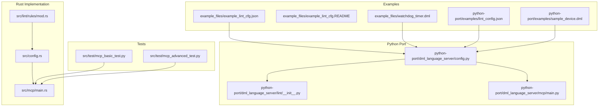
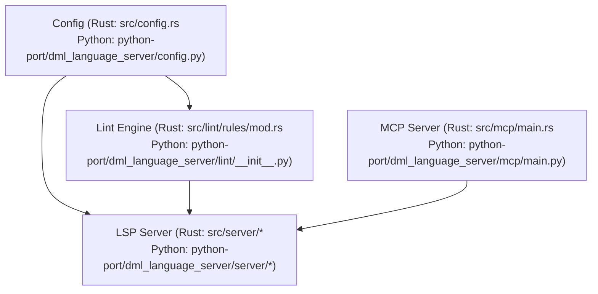
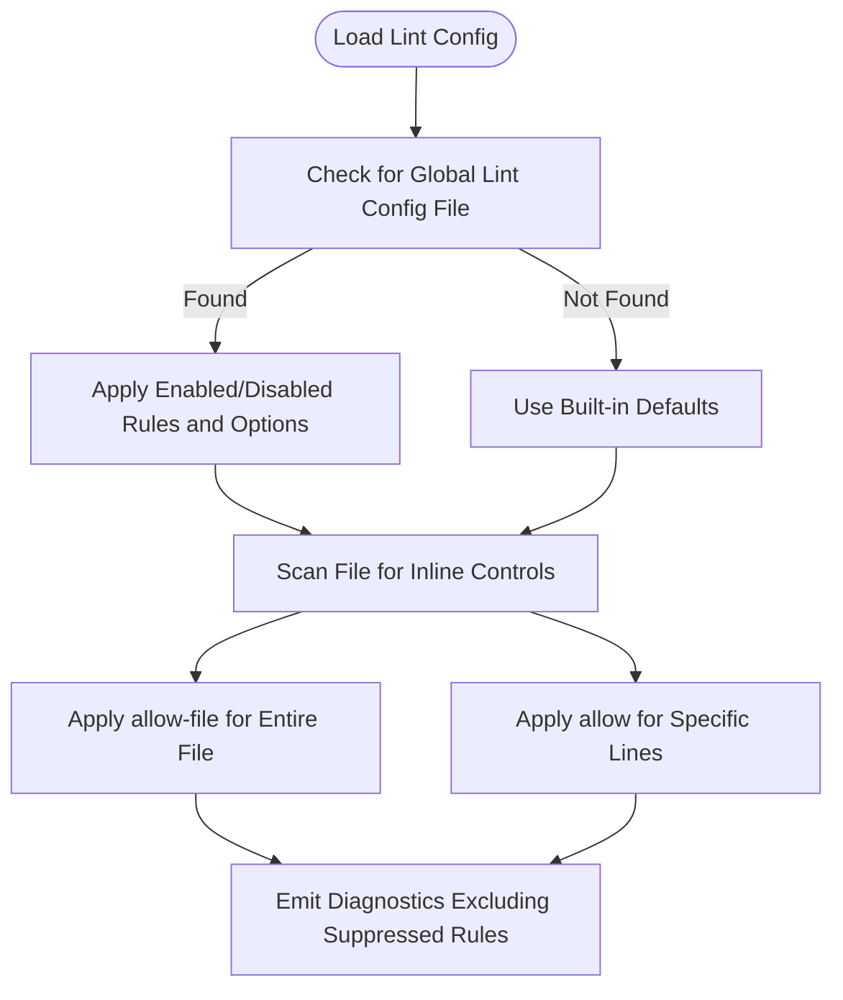
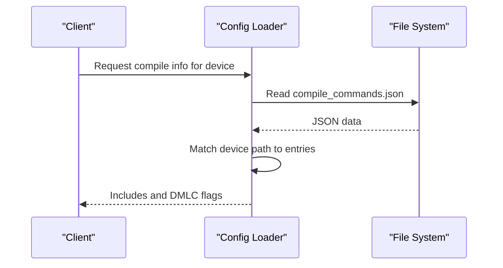
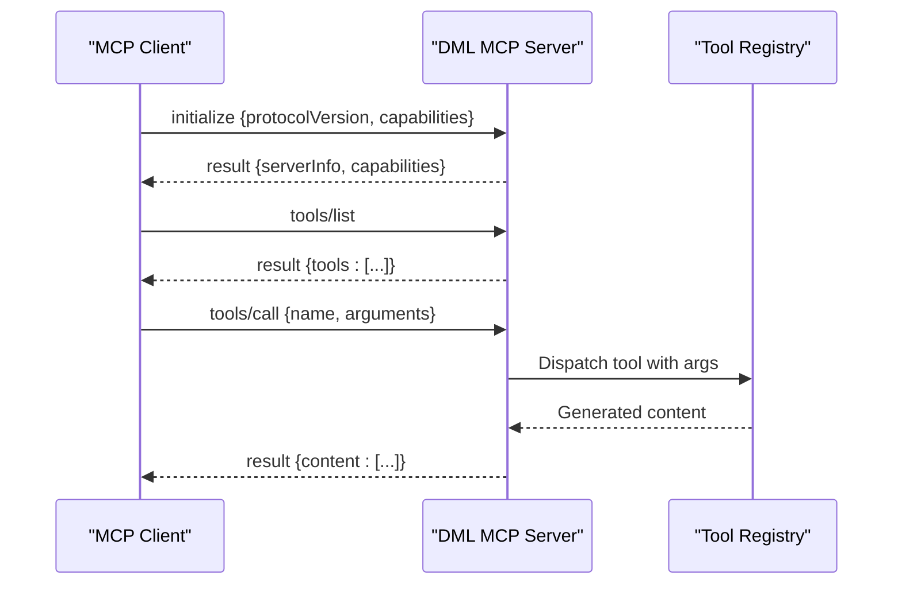
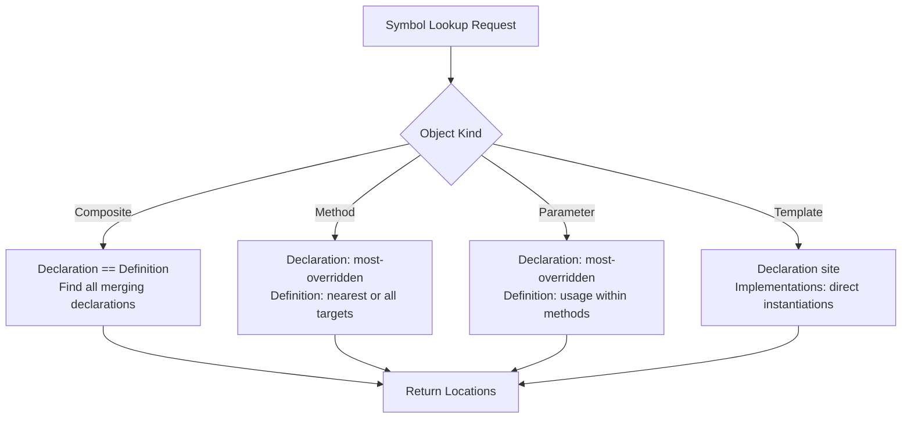
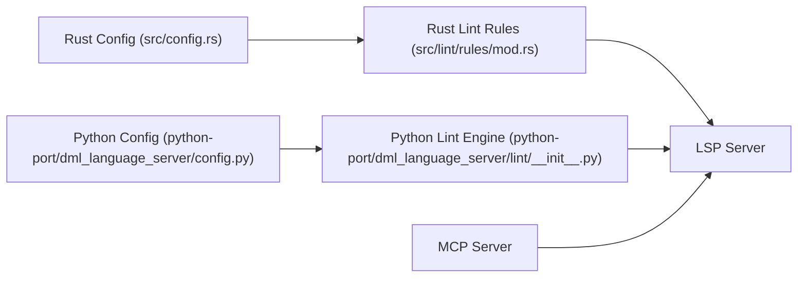

# Examples and Tutorials

<cite>
**Referenced Files in This Document**
- [README.md](file://README.md)
- [USAGE.md](file://USAGE.md)
- [MCP_SERVER_GUIDE.md](file://MCP_SERVER_GUIDE.md)
- [clients.md](file://clients.md)
- [python-port/README.md](file://python-port/README.md)
- [example_files/example_lint_cfg.json](file://example_files/example_lint_cfg.json)
- [example_files/example_lint_cfg.README](file://example_files/example_lint_cfg.README)
- [example_files/watchdog_timer.dml](file://example_files/watchdog_timer.dml)
- [python-port/examples/lint_config.json](file://python-port/examples/lint_config.json)
- [python-port/examples/sample_device.dml](file://python-port/examples/sample_device.dml)
- [src/config.rs](file://src/config.rs)
- [src/lint/rules/mod.rs](file://src/lint/rules/mod.rs)
- [src/mcp/main.rs](file://src/mcp/main.rs)
- [python-port/dml_language_server/config.py](file://python-port/dml_language_server/config.py)
- [python-port/dml_language_server/lint/__init__.py](file://python-port/dml_language_server/lint/__init__.py)
- [python-port/dml_language_server/mcp/main.py](file://python-port/dml_language_server/mcp/main.py)
- [src/test/mcp_basic_test.py](file://src/test/mcp_basic_test.py)
- [src/test/mcp_advanced_test.py](file://src/test/mcp_advanced_test.py)
</cite>

## Table of Contents
1. [Introduction](#introduction)
2. [Project Structure](#project-structure)
3. [Core Components](#core-components)
4. [Architecture Overview](#architecture-overview)
5. [Detailed Component Analysis](#detailed-component-analysis)
6. [Dependency Analysis](#dependency-analysis)
7. [Performance Considerations](#performance-considerations)
8. [Troubleshooting Guide](#troubleshooting-guide)
9. [Conclusion](#conclusion)
10. [Appendices](#appendices)

## Introduction
This document provides practical examples and tutorials for the DML Language Server (DLS). It covers:
- Basic usage patterns for LSP features and linting
- Advanced configuration techniques for lint rules, compile commands, and initialization options
- Real-world integration examples with IDEs and MCP tooling
- Step-by-step tutorials for common tasks
- Troubleshooting and best practices
- Ready-to-use configuration and sample DML files

The DLS supports DML 1.4 and offers syntax diagnostics, symbol navigation, and configurable linting. It can also operate as an MCP server for AI-assisted DML code generation.

## Project Structure
The repository includes:
- A Rust implementation of the language server and MCP server
- A Python port with equivalent features for broader accessibility
- Example DML files and lint configurations
- Test scripts for MCP tooling
- Client integration guidance and usage notes

**Diagram sources**
- [src/config.rs](file://src/config.rs#L120-L140)
- [src/lint/rules/mod.rs](file://src/lint/rules/mod.rs#L36-L88)
- [src/mcp/main.rs](file://src/mcp/main.rs#L11-L23)
- [python-port/dml_language_server/config.py](file://python-port/dml_language_server/config.py#L89-L311)
- [python-port/dml_language_server/lint/__init__.py](file://python-port/dml_language_server/lint/__init__.py#L196-L298)
- [python-port/dml_language_server/mcp/main.py](file://python-port/dml_language_server/mcp/main.py#L98-L166)
- [example_files/example_lint_cfg.json](file://example_files/example_lint_cfg.json#L1-L28)
- [example_files/example_lint_cfg.README](file://example_files/example_lint_cfg.README#L1-L32)
- [example_files/watchdog_timer.dml](file://example_files/watchdog_timer.dml#L1-L146)
- [python-port/examples/lint_config.json](file://python-port/examples/lint_config.json#L1-L25)
- [python-port/examples/sample_device.dml](file://python-port/examples/sample_device.dml#L1-L188)
- [src/test/mcp_basic_test.py](file://src/test/mcp_basic_test.py#L37-L134)
- [src/test/mcp_advanced_test.py](file://src/test/mcp_advanced_test.py#L33-L184)

**Section sources**
- [README.md](file://README.md#L1-L57)
- [USAGE.md](file://USAGE.md#L1-L120)
- [MCP_SERVER_GUIDE.md](file://MCP_SERVER_GUIDE.md#L1-L280)
- [clients.md](file://clients.md#L1-L191)
- [python-port/README.md](file://python-port/README.md#L1-L243)

## Core Components
- Language Server Protocol (LSP) features:
  - Syntax diagnostics, symbol lookup, go-to-definition, references, and implementations
  - Workspace symbol queries and document symbols
  - Custom notifications for context control and progress reporting
- Linting:
  - Built-in rules for spacing, indentation, line length, and operator spacing
  - Inline lint configuration via comments
  - Per-file and global lint configuration files
- MCP (Model Context Protocol):
  - 7 built-in tools for device, register, method, template, and pattern generation
  - JSON-RPC over stdio with capability negotiation
  - Integration examples for Claude Desktop and VS Code

**Section sources**
- [USAGE.md](file://USAGE.md#L15-L120)
- [src/lint/rules/mod.rs](file://src/lint/rules/mod.rs#L36-L171)
- [MCP_SERVER_GUIDE.md](file://MCP_SERVER_GUIDE.md#L35-L107)
- [clients.md](file://clients.md#L99-L181)

## Architecture Overview
The DLS architecture separates concerns into:
- Configuration management for compile commands, lint settings, and initialization options
- Analysis pipeline for parsing and semantic validation
- LSP server for protocol communication and diagnostics
- MCP server for tool-based code generation

**Diagram sources**
- [src/config.rs](file://src/config.rs#L120-L140)
- [python-port/dml_language_server/config.py](file://python-port/dml_language_server/config.py#L89-L311)
- [src/lint/rules/mod.rs](file://src/lint/rules/mod.rs#L36-L88)
- [python-port/dml_language_server/lint/__init__.py](file://python-port/dml_language_server/lint/__init__.py#L196-L298)
- [src/mcp/main.rs](file://src/mcp/main.rs#L11-L23)
- [python-port/dml_language_server/mcp/main.py](file://python-port/dml_language_server/mcp/main.py#L98-L166)

## Detailed Component Analysis

### Lint Configuration and Inline Controls
- Global lint configuration:
  - JSON-based configuration enabling/disabling rules and setting rule-specific options
  - Example configurations are provided for both Rust and Python ports
- Inline lint controls:
  - One-line comment directives to allow specific rules for a file or line
  - Useful for per-file overrides without changing global settings

**Diagram sources**
- [example_files/example_lint_cfg.json](file://example_files/example_lint_cfg.json#L1-L28)
- [example_files/example_lint_cfg.README](file://example_files/example_lint_cfg.README#L1-L32)
- [python-port/examples/lint_config.json](file://python-port/examples/lint_config.json#L1-L25)
- [USAGE.md](file://USAGE.md#L87-L120)

**Section sources**
- [example_files/example_lint_cfg.json](file://example_files/example_lint_cfg.json#L1-L28)
- [example_files/example_lint_cfg.README](file://example_files/example_lint_cfg.README#L1-L32)
- [python-port/examples/lint_config.json](file://python-port/examples/lint_config.json#L1-L25)
- [USAGE.md](file://USAGE.md#L87-L120)

### Compile Commands and Include Resolution
- Compile commands JSON defines include paths and DMLC flags per device file
- The server resolves include paths and flags for imported files
- Supports both Rust and Python implementations with consistent behavior

**Diagram sources**
- [README.md](file://README.md#L36-L57)
- [python-port/README.md](file://python-port/README.md#L80-L92)
- [python-port/dml_language_server/config.py](file://python-port/dml_language_server/config.py#L131-L224)

**Section sources**
- [README.md](file://README.md#L36-L57)
- [python-port/README.md](file://python-port/README.md#L80-L92)
- [python-port/dml_language_server/config.py](file://python-port/dml_language_server/config.py#L131-L224)

### MCP Server Tools and Workflows
- Tools include device, register, method, template, and pattern generators
- JSON-RPC over stdio with initialize and tools/list capabilities
- Test scripts demonstrate tool invocation and response handling

**Diagram sources**
- [MCP_SERVER_GUIDE.md](file://MCP_SERVER_GUIDE.md#L146-L171)
- [src/mcp/main.rs](file://src/mcp/main.rs#L11-L23)
- [python-port/dml_language_server/mcp/main.py](file://python-port/dml_language_server/mcp/main.py#L98-L166)
- [src/test/mcp_basic_test.py](file://src/test/mcp_basic_test.py#L54-L120)
- [src/test/mcp_advanced_test.py](file://src/test/mcp_advanced_test.py#L47-L174)

**Section sources**
- [MCP_SERVER_GUIDE.md](file://MCP_SERVER_GUIDE.md#L1-L280)
- [src/mcp/main.rs](file://src/mcp/main.rs#L11-L23)
- [python-port/dml_language_server/mcp/main.py](file://python-port/dml_language_server/mcp/main.py#L98-L166)
- [src/test/mcp_basic_test.py](file://src/test/mcp_basic_test.py#L37-L134)
- [src/test/mcp_advanced_test.py](file://src/test/mcp_advanced_test.py#L33-L184)

### LSP Symbol Navigation Semantics
- DML’s declarative nature affects go-to operations differently than typical languages
- Guidance clarifies behavior for composite objects, methods, parameters, and templates
- Highlights limitations and known issues for references and definitions

**Diagram sources**
- [USAGE.md](file://USAGE.md#L15-L86)

**Section sources**
- [USAGE.md](file://USAGE.md#L15-L86)

## Dependency Analysis
Key dependencies and relationships:
- Configuration drives linting and compile-time resolution
- Lint rules are instantiated from configuration and applied to parsed content
- MCP server depends on the analysis pipeline and tool registry
- Clients integrate via LSP and MCP protocols

**Diagram sources**
- [src/config.rs](file://src/config.rs#L120-L140)
- [src/lint/rules/mod.rs](file://src/lint/rules/mod.rs#L62-L88)
- [python-port/dml_language_server/config.py](file://python-port/dml_language_server/config.py#L89-L311)
- [python-port/dml_language_server/lint/__init__.py](file://python-port/dml_language_server/lint/__init__.py#L196-L298)

**Section sources**
- [src/config.rs](file://src/config.rs#L120-L140)
- [src/lint/rules/mod.rs](file://src/lint/rules/mod.rs#L62-L88)
- [python-port/dml_language_server/config.py](file://python-port/dml_language_server/config.py#L89-L311)
- [python-port/dml_language_server/lint/__init__.py](file://python-port/dml_language_server/lint/__init__.py#L196-L298)

## Performance Considerations
- Prefer compile commands to limit include scanning and improve accuracy
- Tune lint rule sets to balance feedback and overhead
- Use MCP tools for bulk generation to reduce manual editing time
- Keep workspace roots organized to minimize file traversal

[No sources needed since this section provides general guidance]

## Troubleshooting Guide
- LSP initialization and configuration:
  - Ensure compile commands file is present and correctly formatted
  - Verify workspace configuration and pull-style updates if used
- Lint issues:
  - Review inline allow directives and global configuration
  - Confirm rule names and options match supported identifiers
- MCP server:
  - Validate JSON-RPC messages and protocol version
  - Use provided test scripts to verify server readiness and tool availability

**Section sources**
- [clients.md](file://clients.md#L32-L53)
- [USAGE.md](file://USAGE.md#L87-L120)
- [src/test/mcp_basic_test.py](file://src/test/mcp_basic_test.py#L37-L134)
- [src/test/mcp_advanced_test.py](file://src/test/mcp_advanced_test.py#L33-L184)

## Conclusion
The DML Language Server provides robust LSP and MCP capabilities for DML development. With practical examples, ready-to-use configurations, and integration patterns, teams can adopt efficient workflows for device modeling, linting, and AI-assisted code generation.

[No sources needed since this section summarizes without analyzing specific files]

## Appendices

### A. Beginner Tutorial: Basic LSP Setup
- Install the server and configure your editor to use the LSP
- Point the server to a compile commands file for accurate imports
- Enable linting and review diagnostics

**Section sources**
- [clients.md](file://clients.md#L20-L54)
- [README.md](file://README.md#L36-L57)
- [python-port/README.md](file://python-port/README.md#L33-L77)

### B. Intermediate Tutorial: Configure Linting
- Create a lint configuration file to enable/disable rules and adjust options
- Use inline directives for per-file overrides
- Validate with sample DML files

**Section sources**
- [example_files/example_lint_cfg.json](file://example_files/example_lint_cfg.json#L1-L28)
- [example_files/example_lint_cfg.README](file://example_files/example_lint_cfg.README#L1-L32)
- [python-port/examples/lint_config.json](file://python-port/examples/lint_config.json#L1-L25)
- [USAGE.md](file://USAGE.md#L87-L120)

### C. Advanced Tutorial: MCP Code Generation
- Start the MCP server and list available tools
- Invoke tools to generate devices, registers, and templates
- Integrate with AI assistants or custom clients

**Section sources**
- [MCP_SERVER_GUIDE.md](file://MCP_SERVER_GUIDE.md#L7-L34)
- [src/mcp/main.rs](file://src/mcp/main.rs#L11-L23)
- [python-port/dml_language_server/mcp/main.py](file://python-port/dml_language_server/mcp/main.py#L98-L166)
- [src/test/mcp_basic_test.py](file://src/test/mcp_basic_test.py#L37-L134)
- [src/test/mcp_advanced_test.py](file://src/test/mcp_advanced_test.py#L33-L184)

### D. Ready-to-Use Samples and Configurations
- Sample DML files:
  - [watchdog_timer.dml](file://example_files/watchdog_timer.dml#L1-L146)
  - [sample_device.dml](file://python-port/examples/sample_device.dml#L1-L188)
- Lint configurations:
  - [example_lint_cfg.json](file://example_files/example_lint_cfg.json#L1-L28)
  - [lint_config.json](file://python-port/examples/lint_config.json#L1-L25)

**Section sources**
- [example_files/watchdog_timer.dml](file://example_files/watchdog_timer.dml#L1-L146)
- [python-port/examples/sample_device.dml](file://python-port/examples/sample_device.dml#L1-L188)
- [example_files/example_lint_cfg.json](file://example_files/example_lint_cfg.json#L1-L28)
- [python-port/examples/lint_config.json](file://python-port/examples/lint_config.json#L1-L25)