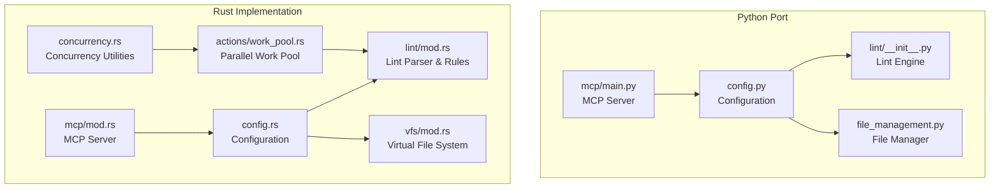
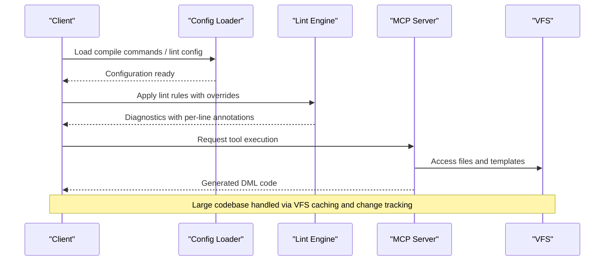
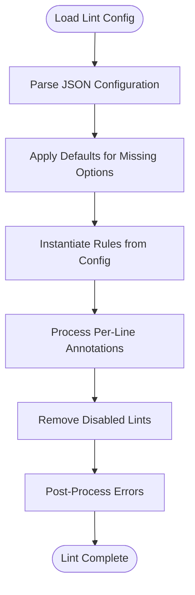
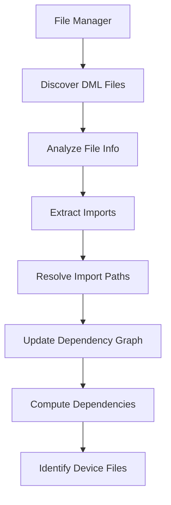
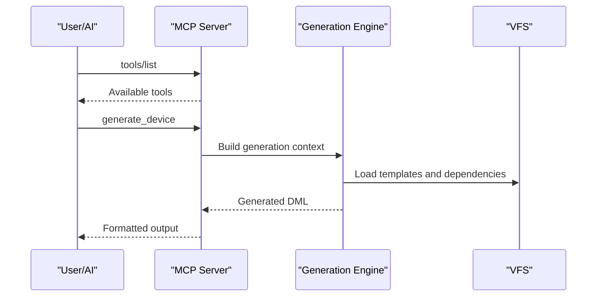
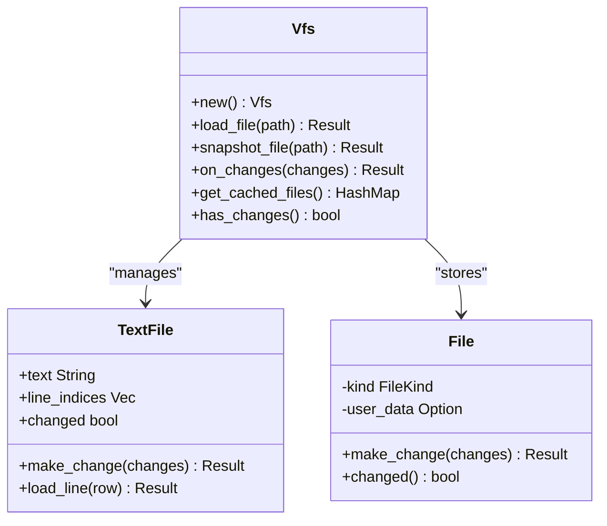
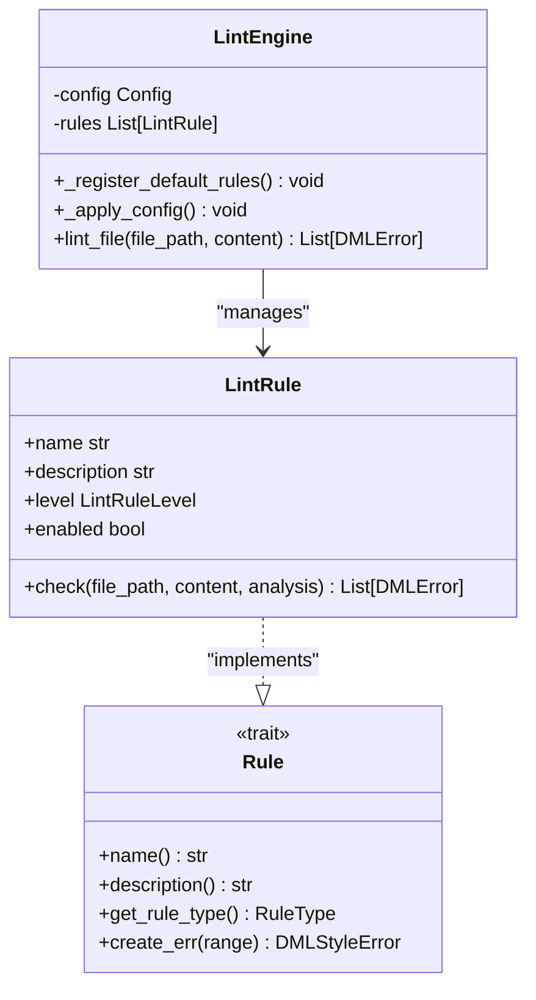
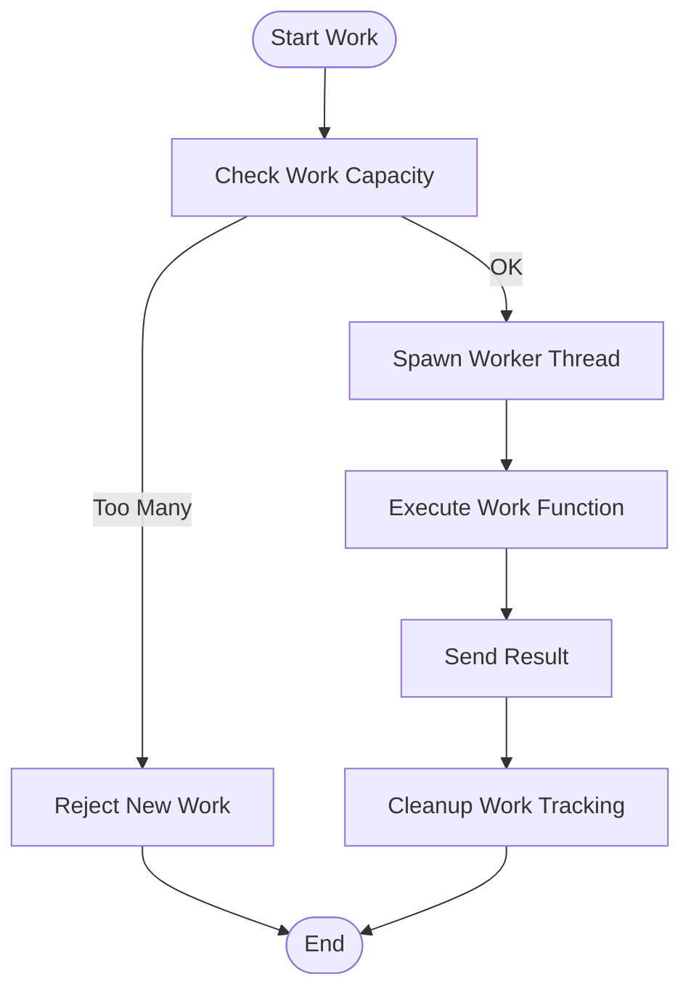
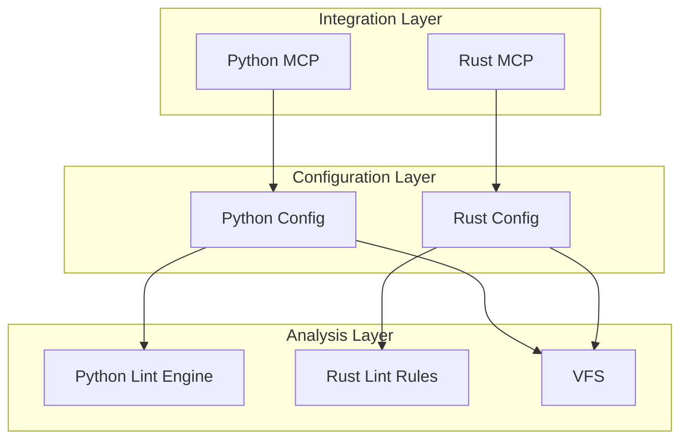

# Advanced Configuration Examples

<cite>
**Referenced Files in This Document**
- [config.py](file://python-port/dml_language_server/config.py)
- [config.rs](file://src/config.rs)
- [lint_mod.rs](file://src/lint/mod.rs)
- [lint_rules_mod.rs](file://src/lint/rules/mod.rs)
- [example_lint_cfg.json](file://example_files/example_lint_cfg.json)
- [lint_config.json](file://python-port/examples/lint_config.json)
- [main.py](file://python-port/dml_language_server/mcp/main.py)
- [mcp_mod.rs](file://src/mcp/mod.rs)
- [vfs_mod.rs](file://src/vfs/mod.rs)
- [work_pool.rs](file://src/actions/work_pool.rs)
- [concurrency.rs](file://src/concurrency.rs)
- [file_management.py](file://python-port/dml_language_server/file_management.py)
- [sample_device.dml](file://python-port/examples/sample_device.dml)
- [utility.dml](file://python-port/examples/utility.dml)
- [MCP_SERVER_GUIDE.md](file://MCP_SERVER_GUIDE.md)
</cite>

## Table of Contents
1. [Introduction](#introduction)
2. [Project Structure](#project-structure)
3. [Core Components](#core-components)
4. [Architecture Overview](#architecture-overview)
5. [Detailed Component Analysis](#detailed-component-analysis)
6. [Dependency Analysis](#dependency-analysis)
7. [Performance Considerations](#performance-considerations)
8. [Troubleshooting Guide](#troubleshooting-guide)
9. [Conclusion](#conclusion)
10. [Appendices](#appendices)

## Introduction
This document provides advanced configuration examples for complex DML projects and specialized use cases. It covers:
- Comprehensive lint rule configuration with custom parameters, enabling/disabling rules, and per-file overrides
- Multi-device analysis setup for large-scale DML projects with device interdependencies
- MCP server configuration for AI-assisted development workflows
- Advanced VFS configuration for handling large codebases and remote file systems
- Examples of custom analysis tool integration and extended lint rule development
- Performance optimization configurations including parallel processing and memory management

## Project Structure
The DML Language Server supports both a Python port and a native Rust implementation. Configuration is centralized in dedicated modules:
- Python port: configuration, linting engine, MCP server, and file management utilities
- Native Rust: configuration, linting rules, MCP server, VFS, and concurrency primitives

**Diagram sources**
- [config.py](file://python-port/dml_language_server/config.py#L89-L311)
- [config.rs](file://src/config.rs#L120-L319)
- [lint_mod.rs](file://src/lint/mod.rs#L37-L126)
- [vfs_mod.rs](file://src/vfs/mod.rs#L29-L800)
- [mcp_mod.rs](file://src/mcp/mod.rs#L1-L54)
- [work_pool.rs](file://src/actions/work_pool.rs#L22-L104)
- [concurrency.rs](file://src/concurrency.rs#L22-L103)

**Section sources**
- [config.py](file://python-port/dml_language_server/config.py#L1-L311)
- [config.rs](file://src/config.rs#L1-L319)

## Core Components
This section outlines the core configuration components and their roles in advanced scenarios.

- Configuration Management
  - Python port: centralizes compile commands, lint configuration, and initialization options
  - Rust implementation: defines configurable behavior for linting, device contexts, and analysis retention

- Linting Engine
  - Python port: rule registration, configuration application, and per-rule customization
  - Rust implementation: structured lint configuration with per-rule options and per-line overrides

- MCP Server
  - Python port: stdio-based JSON-RPC handler for AI-assisted workflows
  - Rust implementation: modular MCP server with tools, templates, and generation capabilities

- Virtual File System (VFS)
  - Rust implementation: efficient caching, change tracking, and user data association for large codebases

- Concurrency and Parallelism
  - Rust work pool: controlled parallel execution with capacity limits and warnings
  - Concurrency utilities: job tracking and deterministic teardown

**Section sources**
- [config.py](file://python-port/dml_language_server/config.py#L89-L311)
- [config.rs](file://src/config.rs#L120-L319)
- [lint_mod.rs](file://src/lint/mod.rs#L37-L126)
- [main.py](file://python-port/dml_language_server/mcp/main.py#L22-L166)
- [mcp_mod.rs](file://src/mcp/mod.rs#L1-L54)
- [vfs_mod.rs](file://src/vfs/mod.rs#L180-L800)
- [work_pool.rs](file://src/actions/work_pool.rs#L22-L104)
- [concurrency.rs](file://src/concurrency.rs#L22-L103)

## Architecture Overview
The advanced configuration architecture integrates configuration loading, lint rule instantiation, MCP tool execution, and VFS-backed analysis for large-scale DML projects.

**Diagram sources**
- [config.py](file://python-port/dml_language_server/config.py#L131-L287)
- [lint_mod.rs](file://src/lint/mod.rs#L181-L229)
- [main.py](file://python-port/dml_language_server/mcp/main.py#L142-L162)
- [vfs_mod.rs](file://src/vfs/mod.rs#L457-L530)

## Detailed Component Analysis

### Advanced Lint Configuration Examples
This section demonstrates comprehensive lint rule configuration with custom parameters, enabling/disabling rules, and per-file overrides.

- Python Port Lint Configuration
  - Example configuration enables specific rules and applies per-rule settings
  - Supports rule-level severity and custom parameters (e.g., indentation size)

- Rust Lint Configuration
  - Structured configuration with per-rule options (e.g., spacing, indentation, long lines)
  - Per-line and per-file lint annotations for targeted rule suppression
  - Unknown field detection and default configuration behavior

**Diagram sources**
- [lint_mod.rs](file://src/lint/mod.rs#L181-L229)
- [lint_rules_mod.rs](file://src/lint/rules/mod.rs#L43-L64)

**Section sources**
- [lint_config.json](file://python-port/examples/lint_config.json#L1-L25)
- [example_lint_cfg.json](file://example_files/example_lint_cfg.json#L1-L23)
- [lint_mod.rs](file://src/lint/mod.rs#L37-L126)
- [lint_rules_mod.rs](file://src/lint/rules/mod.rs#L43-L64)

### Multi-Device Analysis Setup
Large-scale DML projects require coordinated analysis across multiple devices with interdependencies.

- Device Discovery and Dependency Tracking
  - Python port: discovers DML files, categorizes devices/libraries, resolves imports, and maintains dependency graphs
  - Supports transitive dependency resolution and circular dependency detection

- Compile Commands Integration
  - Centralized compile information per device with include paths and compiler flags
  - Global include paths and flags augmentation for device-specific settings

**Diagram sources**
- [file_management.py](file://python-port/dml_language_server/file_management.py#L42-L304)
- [config.py](file://python-port/dml_language_server/config.py#L131-L224)

**Section sources**
- [file_management.py](file://python-port/dml_language_server/file_management.py#L33-L387)
- [config.py](file://python-port/dml_language_server/config.py#L89-L311)
- [sample_device.dml](file://python-port/examples/sample_device.dml#L1-L188)
- [utility.dml](file://python-port/examples/utility.dml#L1-L77)

### MCP Server Configuration for AI-Assisted Development
The MCP server enables AI-assisted DML development workflows with tool-based code generation.

- Server Capabilities and Tools
  - Built-in tools for device generation, register creation, method generation, project analysis, validation, template generation, and pattern application
  - JSON-RPC over stdio with proper error handling

- Integration Examples
  - Claude Desktop integration via MCP configuration
  - Command-line testing and tool listing

**Diagram sources**
- [main.py](file://python-port/dml_language_server/mcp/main.py#L22-L166)
- [mcp_mod.rs](file://src/mcp/mod.rs#L1-L54)
- [MCP_SERVER_GUIDE.md](file://MCP_SERVER_GUIDE.md#L1-L280)

**Section sources**
- [main.py](file://python-port/dml_language_server/mcp/main.py#L98-L166)
- [mcp_mod.rs](file://src/mcp/mod.rs#L17-L54)
- [MCP_SERVER_GUIDE.md](file://MCP_SERVER_GUIDE.md#L1-L280)

### Advanced VFS Configuration for Large Codebases
The VFS provides efficient caching and change tracking for large DML codebases and remote file systems.

- Key Features
  - In-memory file snapshots with change tracking
  - Coalesced change application and line index maintenance
  - User data association per file for analysis metadata
  - Thread-safe file loading with pending file coordination

- Remote File System Considerations
  - VFS abstraction allows pluggable file loaders
  - Change tracking ensures consistency across remote and local files
  - Snapshot-based operations minimize repeated I/O

**Diagram sources**
- [vfs_mod.rs](file://src/vfs/mod.rs#L180-L800)

**Section sources**
- [vfs_mod.rs](file://src/vfs/mod.rs#L1-L971)

### Custom Analysis Tool Integration and Extended Lint Rules
Extend the system with custom analysis tools and lint rules tailored to your DML project.

- Custom Lint Rules (Rust)
  - Rule trait with name, description, and type identification
  - RuleType enumeration for rule targeting and per-line annotations
  - Integration with AST traversal and error reporting

- Custom Analysis Tools (Python)
  - Extend the lint engine with new rule classes
  - Leverage analysis results for diagnostics and suggestions

**Diagram sources**
- [lint_rules_mod.rs](file://src/lint/rules/mod.rs#L66-L143)
- [lint_mod.rs](file://src/lint/mod.rs#L159-L207)

**Section sources**
- [lint_rules_mod.rs](file://src/lint/rules/mod.rs#L1-L143)
- [lint_mod.rs](file://src/lint/mod.rs#L159-L207)

### Performance Optimization Configurations
Optimize performance for large DML projects through parallel processing and memory management.

- Parallel Processing
  - Controlled thread pool with capacity limits and similar work type throttling
  - Work description tracking for monitoring and debugging
  - Panic isolation with channel-based result delivery

- Memory Management
  - VFS change coalescing reduces memory churn during batch updates
  - Line index caching accelerates random access operations
  - Job tracking utilities ensure deterministic cleanup

**Diagram sources**
- [work_pool.rs](file://src/actions/work_pool.rs#L53-L103)
- [concurrency.rs](file://src/concurrency.rs#L32-L86)

**Section sources**
- [work_pool.rs](file://src/actions/work_pool.rs#L1-L104)
- [concurrency.rs](file://src/concurrency.rs#L1-L103)
- [vfs_mod.rs](file://src/vfs/mod.rs#L605-L623)

## Dependency Analysis
This section analyzes dependencies between configuration components and their impact on advanced setups.

**Diagram sources**
- [config.py](file://python-port/dml_language_server/config.py#L89-L311)
- [config.rs](file://src/config.rs#L120-L319)
- [lint_mod.rs](file://src/lint/mod.rs#L37-L126)
- [vfs_mod.rs](file://src/vfs/mod.rs#L180-L800)
- [main.py](file://python-port/dml_language_server/mcp/main.py#L142-L162)
- [mcp_mod.rs](file://src/mcp/mod.rs#L1-L54)

**Section sources**
- [config.py](file://python-port/dml_language_server/config.py#L89-L311)
- [config.rs](file://src/config.rs#L120-L319)

## Performance Considerations
- Parallel Execution Limits
  - Control maximum concurrent tasks and similar work types to prevent overload
  - Monitor long-running tasks and log warnings for performance tuning

- Memory Efficiency
  - Use VFS change coalescing to minimize memory allocations during batch updates
  - Leverage line indices for efficient random access without repeated parsing

- Scalability
  - Configure device context modes to balance analysis scope and performance
  - Use compile commands to optimize include path resolution and reduce scanning overhead

[No sources needed since this section provides general guidance]

## Troubleshooting Guide
Common issues and resolutions for advanced configurations:

- Lint Configuration Issues
  - Unknown fields in lint config are detected and reported; verify rule names and option names
  - Per-line annotations without effect at end of file indicate unused suppression directives

- MCP Server Problems
  - Verify JSON-RPC protocol compliance and stdio communication
  - Check server capabilities and tool availability

- VFS Errors
  - Out-of-sync files indicate external modifications; refresh or reload
  - Bad locations suggest invalid row/column coordinates; validate editor integration

**Section sources**
- [lint_mod.rs](file://src/lint/mod.rs#L244-L364)
- [main.py](file://python-port/dml_language_server/mcp/main.py#L74-L95)
- [vfs_mod.rs](file://src/vfs/mod.rs#L110-L172)

## Conclusion
This document outlined advanced configuration patterns for complex DML projects, including comprehensive lint rule configuration, multi-device analysis, MCP server integration, VFS optimization, custom tool development, and performance tuning. These configurations enable scalable, maintainable, and AI-assisted DML development workflows.

[No sources needed since this section summarizes without analyzing specific files]

## Appendices

### Appendix A: Configuration Reference Tables

- Python Lint Configuration Fields
  - enabled_rules: list of rule names to enable
  - disabled_rules: list of rule names to disable
  - rule_configs: per-rule configuration with level and parameters

- Rust Lint Configuration Options
  - sp_reserved/sp_brace/sp_punct/sp_binop/sp_ternary/sp_ptrdecl: spacing rule options
  - nsp_funpar/nsp_inparen/nsp_unary/nsp_trailing: negative spacing rule options
  - long_lines: maximum line length configuration
  - indent_size/indent_no_tabs/indent_code_block/indent_closing_brace/indent_paren_expr/indent_switch_case/indent_empty_loop: indentation rule options
  - annotate_lints: whether to prefix diagnostic descriptions with rule identifiers

**Section sources**
- [lint_config.json](file://python-port/examples/lint_config.json#L1-L25)
- [example_lint_cfg.json](file://example_files/example_lint_cfg.json#L1-L23)
- [lint_mod.rs](file://src/lint/mod.rs#L68-L157)