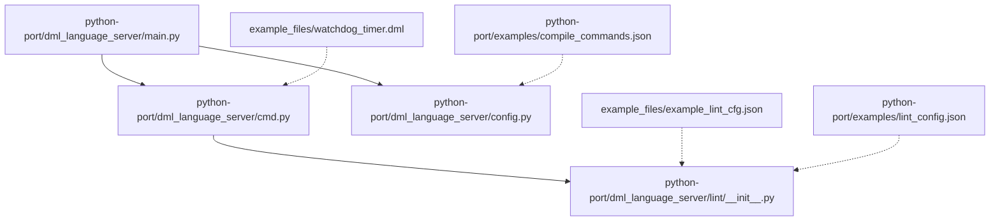
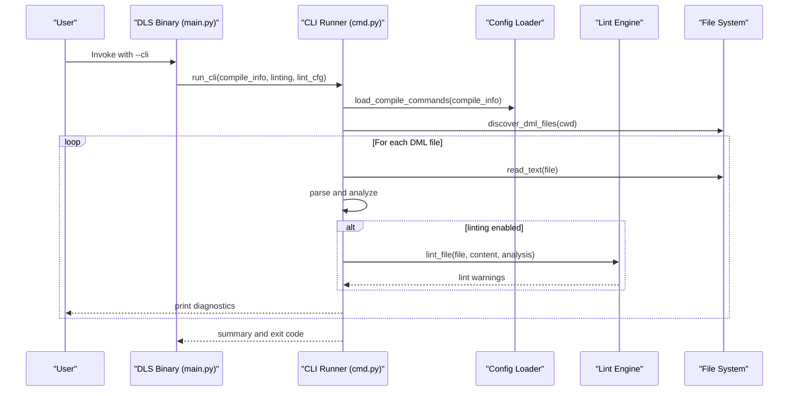
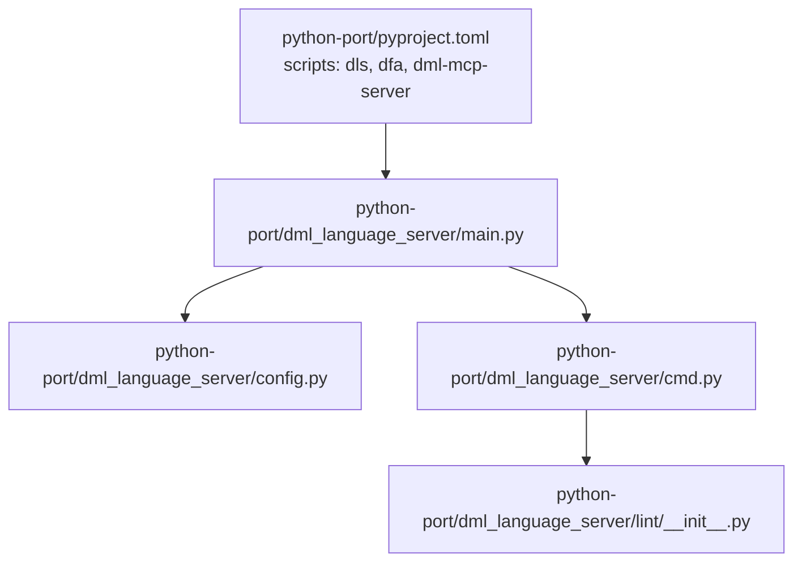

# Basic Usage Examples

<cite>
**Referenced Files in This Document**
- [README.md](file://README.md)
- [USAGE.md](file://USAGE.md)
- [clients.md](file://clients.md)
- [example_files/watchdog_timer.dml](file://example_files/watchdog_timer.dml)
- [example_files/example_lint_cfg.json](file://example_files/example_lint_cfg.json)
- [python-port/README.md](file://python-port/README.md)
- [python-port/dml_language_server/main.py](file://python-port/dml_language_server/main.py)
- [python-port/dml_language_server/cmd.py](file://python-port/dml_language_server/cmd.py)
- [python-port/dml_language_server/config.py](file://python-port/dml_language_server/config.py)
- [python-port/dml_language_server/lint/__init__.py](file://python-port/dml_language_server/lint/__init__.py)
- [python-port/examples/compile_commands.json](file://python-port/examples/compile_commands.json)
- [python-port/examples/lint_config.json](file://python-port/examples/lint_config.json)
- [python-port/examples/sample_device.dml](file://python-port/examples/sample_device.dml)
- [python-port/pyproject.toml](file://python-port/pyproject.toml)
- [python-port/tests/test_cli_functionality.py](file://python-port/tests/test_cli_functionality.py)
</cite>

## Table of Contents
1. [Introduction](#introduction)
2. [Project Structure](#project-structure)
3. [Core Components](#core-components)
4. [Architecture Overview](#architecture-overview)
5. [Detailed Component Analysis](#detailed-component-analysis)
6. [Dependency Analysis](#dependency-analysis)
7. [Performance Considerations](#performance-considerations)
8. [Troubleshooting Guide](#troubleshooting-guide)
9. [Conclusion](#conclusion)
10. [Appendices](#appendices)

## Introduction
This document provides practical, step-by-step guidance for using the DML Language Server (DLS) to improve authoring and analysis of DML device model files. It covers:
- IDE integration with VS Code, Neovim, and Emacs using the DLS LSP server
- Command-line analysis with the dls binary, including linting and output interpretation
- Practical DML examples from watchdog_timer.dml showcasing device definitions, properties, and methods
- Basic lint configuration using example_lint_cfg.json and inline lint control
- Troubleshooting tips for first-time users

## Project Structure
The repository includes:
- A Python port of the DML Language Server with CLI, LSP server, lint engine, and supporting modules
- Example DML files and lint configurations
- Client integration guidance and usage documentation

**Diagram sources**
- [python-port/dml_language_server/main.py](file://python-port/dml_language_server/main.py#L25-L90)
- [python-port/dml_language_server/cmd.py](file://python-port/dml_language_server/cmd.py#L21-L115)
- [python-port/dml_language_server/config.py](file://python-port/dml_language_server/config.py#L89-L311)
- [python-port/dml_language_server/lint/__init__.py](file://python-port/dml_language_server/lint/__init__.py#L196-L288)
- [example_files/watchdog_timer.dml](file://example_files/watchdog_timer.dml#L1-L146)
- [example_files/example_lint_cfg.json](file://example_files/example_lint_cfg.json#L1-L23)
- [python-port/examples/compile_commands.json](file://python-port/examples/compile_commands.json#L1-L14)
- [python-port/examples/lint_config.json](file://python-port/examples/lint_config.json#L1-L25)

**Section sources**
- [README.md](file://README.md#L1-L57)
- [python-port/README.md](file://python-port/README.md#L1-L243)

## Core Components
- LSP Server: Runs as a Language Server Protocol endpoint for IDE integration
- CLI Tool: Provides batch analysis and linting via the dls command
- Lint Engine: Applies configurable lint rules to DML files
- Configuration Manager: Loads compile commands and lint configurations
- Example DML and Lint Configurations: Ready-to-use samples for quick start

Key capabilities include:
- Syntax error reporting
- Symbol search and navigation (definition, references, implementation)
- Basic linting with configurable rules
- Inline lint control via comments

**Section sources**
- [README.md](file://README.md#L7-L21)
- [USAGE.md](file://USAGE.md#L15-L48)
- [python-port/README.md](file://python-port/README.md#L33-L77)

## Architecture Overview
The DLS exposes two primary modes:
- LSP Server: IDE integration over stdio using the Language Server Protocol
- CLI Mode: Batch analysis and linting with structured output

**Diagram sources**
- [python-port/dml_language_server/main.py](file://python-port/dml_language_server/main.py#L25-L90)
- [python-port/dml_language_server/cmd.py](file://python-port/dml_language_server/cmd.py#L21-L115)
- [python-port/dml_language_server/config.py](file://python-port/dml_language_server/config.py#L131-L164)
- [python-port/dml_language_server/lint/__init__.py](file://python-port/dml_language_server/lint/__init__.py#L246-L269)

## Detailed Component Analysis

### IDE Integration Setup
Follow these steps to integrate DLS with popular editors using the LSP server.

- VS Code
  - Install a generic LSP extension
  - Configure the DLS command to target the dls executable
  - Associate DLS with DML files

- Neovim (nvim-lspconfig)
  - Use nvim-lspconfig to register the DML LSP client
  - Point the client to the dls command and set filetypes to DML
  - Configure root detection using compile_commands.json or .git

- Emacs (lsp-mode)
  - Register the DML LSP client with lsp-mode
  - Use stdio connection to launch dls
  - Set major modes to DML

These steps are derived from the Python port documentation and client implementation guidance.

**Section sources**
- [python-port/README.md](file://python-port/README.md#L128-L166)
- [clients.md](file://clients.md#L20-L54)

### Command-Line Analysis with dls
The dls binary supports a CLI mode for batch analysis and linting.

- Basic CLI invocation
  - Start CLI mode with the --cli flag
  - Optionally enable/disable linting with --linting/--no-linting
  - Provide compile commands and lint configuration files as needed

- Output interpretation
  - Syntax errors are printed with file, line, column, and message
  - Lint warnings are printed similarly when linting is enabled
  - A summary reports total errors and warnings

- Example commands
  - Run CLI analysis in the examples directory
  - Enable verbose logging for debugging
  - Disable linting to reduce noise

These behaviors are implemented in the CLI runner and validated by tests.

**Section sources**
- [python-port/dml_language_server/main.py](file://python-port/dml_language_server/main.py#L25-L90)
- [python-port/dml_language_server/cmd.py](file://python-port/dml_language_server/cmd.py#L21-L115)
- [python-port/tests/test_cli_functionality.py](file://python-port/tests/test_cli_functionality.py#L63-L173)

### Practical DML Syntax Highlighting, Hover, and Navigation
- Syntax highlighting
  - Use an editor with LSP support to enable DLS-provided syntax highlighting for DML files
- Hover information
  - Hover over symbols to receive contextual information provided by the server
- Navigation
  - Go to definition/reference/implementation
  - Find document symbols and workspace symbols for quick navigation

These features are part of the LSP server’s capabilities and are documented in the project README.

**Section sources**
- [README.md](file://README.md#L9-L11)

### Lint Configuration Setup
Two approaches are available:

- Global lint configuration (JSON)
  - Use example_lint_cfg.json as a baseline
  - Adjust rule settings such as indentation spaces, line length limits, and rule toggles
  - Apply the configuration via the CLI with --lint-cfg

- Inline lint control (comments)
  - Use in-line directives to suppress specific rules for a file or line
  - Supported commands include allow-file and allow

- Example lint configuration files
  - example_files/example_lint_cfg.json
  - python-port/examples/lint_config.json

**Section sources**
- [example_files/example_lint_cfg.json](file://example_files/example_lint_cfg.json#L1-L23)
- [USAGE.md](file://USAGE.md#L15-L48)
- [python-port/examples/lint_config.json](file://python-port/examples/lint_config.json#L1-L25)

### Real DML Code Examples
The watchdog_timer.dml example demonstrates common DML patterns:
- Device declaration and parameters
- Import statements
- Connect definitions for signals
- Register banks with registers and fields
- Methods for read/write operations
- Identification registers and attributes

Use this file as a reference for structuring DML devices and understanding server features.

**Section sources**
- [example_files/watchdog_timer.dml](file://example_files/watchdog_timer.dml#L1-L146)

### Compile Commands and Imports
To ensure accurate analysis and import resolution:
- Create a compile_commands.json file specifying include paths and DMLC flags per device
- Reference the example compile_commands.json for structure and fields

**Section sources**
- [README.md](file://README.md#L36-L57)
- [python-port/examples/compile_commands.json](file://python-port/examples/compile_commands.json#L1-L14)

## Dependency Analysis
The DLS binary is exposed via pyproject.toml scripts and integrates with the Python port modules.

**Diagram sources**
- [python-port/pyproject.toml](file://python-port/pyproject.toml#L60-L64)
- [python-port/dml_language_server/main.py](file://python-port/dml_language_server/main.py#L25-L90)
- [python-port/dml_language_server/config.py](file://python-port/dml_language_server/config.py#L89-L311)
- [python-port/dml_language_server/cmd.py](file://python-port/dml_language_server/cmd.py#L21-L115)
- [python-port/dml_language_server/lint/__init__.py](file://python-port/dml_language_server/lint/__init__.py#L196-L288)

**Section sources**
- [python-port/pyproject.toml](file://python-port/pyproject.toml#L60-L64)

## Performance Considerations
- Prefer enabling linting selectively to reduce overhead
- Limit diagnostics per file using configuration options
- Keep compile commands accurate to avoid unnecessary scanning
- Use verbose logging only when diagnosing issues

[No sources needed since this section provides general guidance]

## Troubleshooting Guide
- LSP client does not start
  - Verify the dls binary is installed and on PATH
  - Confirm editor LSP configuration points to the dls command and DML filetypes
- No diagnostics or slow responsiveness
  - Ensure compile_commands.json is present and accurate
  - Check that the workspace root is correctly detected by the client
- Excessive lint warnings
  - Disable linting temporarily with --no-linting
  - Apply a lint configuration file via --lint-cfg
  - Use inline directives to suppress specific issues
- CLI analysis returns success despite errors
  - The CLI returns a non-zero exit code when errors are found; review stderr/stdout for summaries
- Editor shows incorrect imports or missing symbols
  - Regenerate compile_commands.json or adjust include paths
  - Confirm DML version and API flags match your environment

**Section sources**
- [python-port/README.md](file://python-port/README.md#L126-L166)
- [clients.md](file://clients.md#L38-L54)
- [USAGE.md](file://USAGE.md#L15-L48)
- [python-port/tests/test_cli_functionality.py](file://python-port/tests/test_cli_functionality.py#L63-L173)

## Conclusion
With the DLS, you can enhance your DML development workflow through IDE integration, command-line analysis, and configurable linting. Start with the example files and configurations, then tailor settings to your environment. Use the troubleshooting guidance to resolve common setup issues quickly.

[No sources needed since this section summarizes without analyzing specific files]

## Appendices

### Appendix A: Quick Start Checklist
- Install the DLS binary and ensure it is on PATH
- Prepare compile_commands.json for your DML project
- Configure your editor to use the DLS LSP server for DML files
- Run dls --cli in your examples directory to validate installation
- Review lint configuration and apply inline directives as needed

**Section sources**
- [python-port/README.md](file://python-port/README.md#L17-L48)
- [python-port/examples/compile_commands.json](file://python-port/examples/compile_commands.json#L1-L14)
- [python-port/tests/test_cli_functionality.py](file://python-port/tests/test_cli_functionality.py#L63-L102)