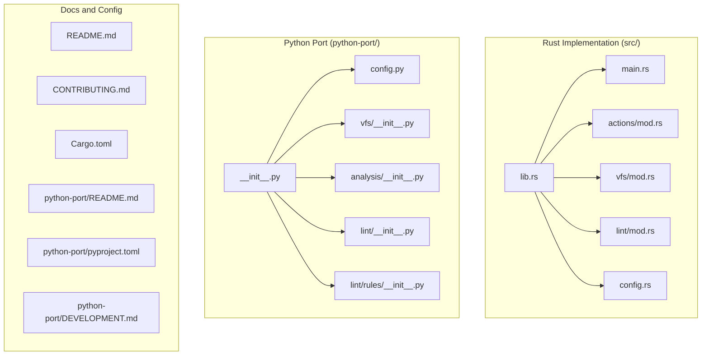
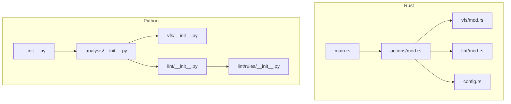
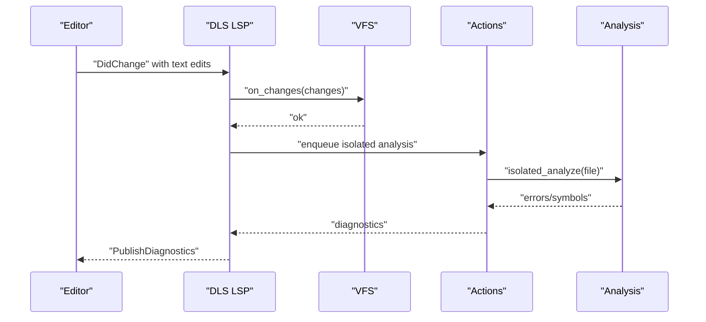
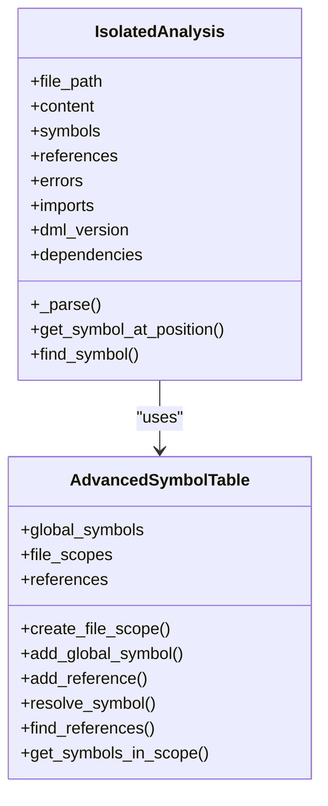
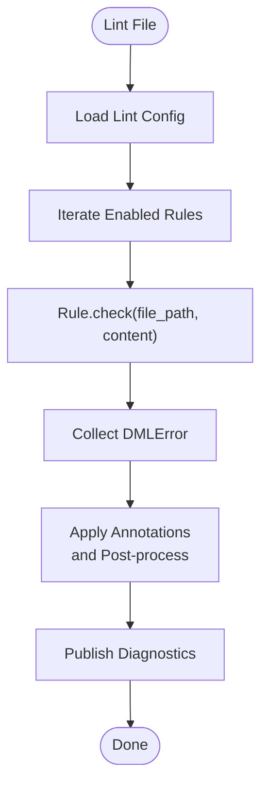
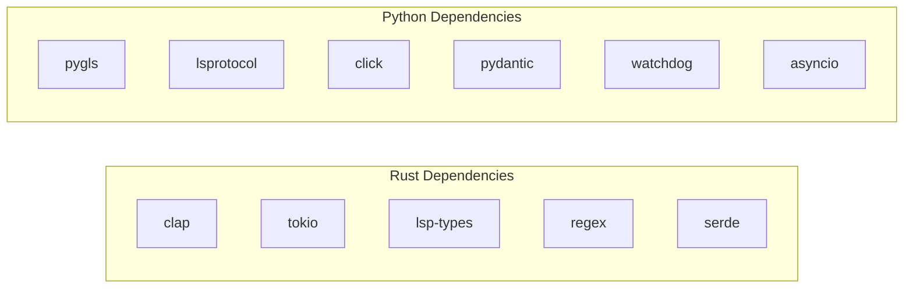

# Best Practices and Workflows

<cite>
**Referenced Files in This Document**
- [README.md](file://README.md)
- [CONTRIBUTING.md](file://CONTRIBUTING.md)
- [Cargo.toml](file://Cargo.toml)
- [python-port/README.md](file://python-port/README.md)
- [python-port/pyproject.toml](file://python-port/pyproject.toml)
- [python-port/DEVELOPMENT.md](file://python-port/DEVELOPMENT.md)
- [src/lib.rs](file://src/lib.rs)
- [src/main.rs](file://src/main.rs)
- [src/config.rs](file://src/config.rs)
- [src/vfs/mod.rs](file://src/vfs/mod.rs)
- [src/actions/mod.rs](file://src/actions/mod.rs)
- [src/lint/mod.rs](file://src/lint/mod.rs)
- [python-port/dml_language_server/__init__.py](file://python-port/dml_language_server/__init__.py)
- [python-port/dml_language_server/config.py](file://python-port/dml_language_server/config.py)
- [python-port/dml_language_server/vfs/__init__.py](file://python-port/dml_language_server/vfs/__init__.py)
- [python-port/dml_language_server/analysis/__init__.py](file://python-port/dml_language_server/analysis/__init__.py)
- [python-port/dml_language_server/lint/__init__.py](file://python-port/dml_language_server/lint/__init__.py)
- [python-port/dml_language_server/lint/rules/__init__.py](file://python-port/dml_language_server/lint/rules/__init__.py)
</cite>

## Table of Contents
1. [Introduction](#introduction)
2. [Project Structure](#project-structure)
3. [Core Components](#core-components)
4. [Architecture Overview](#architecture-overview)
5. [Detailed Component Analysis](#detailed-component-analysis)
6. [Dependency Analysis](#dependency-analysis)
7. [Performance Considerations](#performance-considerations)
8. [Troubleshooting Guide](#troubleshooting-guide)
9. [Conclusion](#conclusion)
10. [Appendices](#appendices)

## Introduction
This document provides comprehensive best practices for developing DML (Device Modeling Language) codebases using the DML Language Server (DLS). It covers optimal development workflows, coding standards, project structure patterns, language server integration, team collaboration practices, performance optimization, debugging workflows, and maintenance strategies. The guidance is grounded in the repository’s Rust and Python implementations of the language server, including analysis engines, VFS, linting, and CLI tooling.

## Project Structure
The repository includes:
- A Rust implementation of the DLS with a CLI, LSP server, analysis engine, VFS, linting, and MCP tooling.
- A Python port that mirrors the Rust architecture with VFS, analysis, linting, and CLI tools, plus MCP and DFA utilities.
- Documentation and configuration files for building, testing, linting, and development workflows.

Key directories and roles:
- src/: Rust core (LSP server, analysis, VFS, linting, actions, MCP, DFA).
- python-port/: Python port mirroring the Rust architecture (analysis, VFS, linting, CLI tools).
- example_files/: Example lint configuration and watchdog timer DML file.
- Root docs: README, CONTRIBUTING, USAGE, clients, and security-related policies.

**Diagram sources**
- [src/lib.rs](file://src/lib.rs#L31-L47)
- [src/main.rs](file://src/main.rs#L15-L59)
- [src/actions/mod.rs](file://src/actions/mod.rs#L62-L68)
- [src/vfs/mod.rs](file://src/vfs/mod.rs#L29-L288)
- [src/lint/mod.rs](file://src/lint/mod.rs#L67-L126)
- [src/config.rs](file://src/config.rs#L120-L139)
- [python-port/dml_language_server/__init__.py](file://python-port/dml_language_server/__init__.py#L16-L31)
- [python-port/dml_language_server/config.py](file://python-port/dml_language_server/config.py#L89-L98)
- [python-port/dml_language_server/vfs/__init__.py](file://python-port/dml_language_server/vfs/__init__.py#L123-L134)
- [python-port/dml_language_server/analysis/__init__.py](file://python-port/dml_language_server/analysis/__init__.py#L181-L216)
- [python-port/dml_language_server/lint/__init__.py](file://python-port/dml_language_server/lint/__init__.py#L196-L208)
- [python-port/dml_language_server/lint/rules/__init__.py](file://python-port/dml_language_server/lint/rules/__init__.py#L34-L54)
- [README.md](file://README.md#L5-L35)
- [python-port/README.md](file://python-port/README.md#L1-L176)
- [python-port/pyproject.toml](file://python-port/pyproject.toml#L5-L42)
- [python-port/DEVELOPMENT.md](file://python-port/DEVELOPMENT.md#L5-L40)

**Section sources**
- [README.md](file://README.md#L5-L35)
- [python-port/README.md](file://python-port/README.md#L1-L176)
- [python-port/pyproject.toml](file://python-port/pyproject.toml#L5-L42)
- [python-port/DEVELOPMENT.md](file://python-port/DEVELOPMENT.md#L5-L40)

## Core Components
This section outlines the core subsystems and their responsibilities, focusing on how they interoperate to deliver incremental analysis, symbol navigation, diagnostics, and linting.

- Virtual File System (VFS)
  - Rust: Tracks file changes, caches content, and invalidates on edits. Provides line/span access and change coalescing.
  - Python: Async file loader, memory-backed cache, file watcher, and change callbacks.
- Analysis Engine
  - Rust: Two-phase analysis (isolated and device), dependency tracking, progress notifications, and diagnostics publishing.
  - Python: Enhanced parsing with AST traversal, template system, symbol scopes, and cross-file reference tracking.
- Linting Engine
  - Rust: Configurable lint rules, per-file style checks, annotation filtering, and post-processing.
  - Python: Pluggable lint rules with severity levels, rule configuration, and DMLError generation.
- Language Server Protocol (LSP)
  - Rust: Request handling, progress reporting, diagnostics publishing, and device context management.
  - Python: LSP server implementation, MCP server, and CLI tools for DFA and MCP.

Recommended project structure patterns:
- Feature-based organization: group related modules (analysis, lint, VFS) under feature-focused packages.
- Layered design: keep VFS at the base, analysis on top, and LSP/MCP at the edges.
- Clear separation of concerns: parsers, symbol tables, and diagnostics should be distinct modules.

**Section sources**
- [src/vfs/mod.rs](file://src/vfs/mod.rs#L180-L288)
- [python-port/dml_language_server/vfs/__init__.py](file://python-port/dml_language_server/vfs/__init__.py#L123-L134)
- [src/actions/mod.rs](file://src/actions/mod.rs#L70-L150)
- [python-port/dml_language_server/analysis/__init__.py](file://python-port/dml_language_server/analysis/__init__.py#L181-L216)
- [src/lint/mod.rs](file://src/lint/mod.rs#L67-L126)
- [python-port/dml_language_server/lint/__init__.py](file://python-port/dml_language_server/lint/__init__.py#L196-L208)

## Architecture Overview
The DLS architecture integrates VFS, analysis, and LSP layers. The Rust implementation emphasizes correctness and performance with structured queues and progress notifications. The Python port mirrors this with async-first design and modular components.

**Diagram sources**
- [src/main.rs](file://src/main.rs#L15-L59)
- [src/actions/mod.rs](file://src/actions/mod.rs#L62-L68)
- [src/vfs/mod.rs](file://src/vfs/mod.rs#L29-L288)
- [src/lint/mod.rs](file://src/lint/mod.rs#L67-L126)
- [src/config.rs](file://src/config.rs#L120-L139)
- [python-port/dml_language_server/__init__.py](file://python-port/dml_language_server/__init__.py#L16-L31)
- [python-port/dml_language_server/analysis/__init__.py](file://python-port/dml_language_server/analysis/__init__.py#L181-L216)
- [python-port/dml_language_server/vfs/__init__.py](file://python-port/dml_language_server/vfs/__init__.py#L123-L134)
- [python-port/dml_language_server/lint/__init__.py](file://python-port/dml_language_server/lint/__init__.py#L196-L208)
- [python-port/dml_language_server/lint/rules/__init__.py](file://python-port/dml_language_server/lint/rules/__init__.py#L34-L54)

## Detailed Component Analysis

### VFS and Incremental Analysis
- Rust VFS
  - Supports add/replace text changes, line indexing, and change coalescing. Maintains in-memory snapshots and invalidation semantics.
  - Provides APIs to load spans, lines, and entire files, with robust error handling for bad locations and file kinds.
- Python VFS
  - Async file loader, memory-backed cache, and watchdog-based file watching. Emits change events and notifies callbacks.

Efficient development workflows:
- Use VFS change tracking to trigger incremental analysis on edits.
- Coalesce multiple edits into a single update to reduce redundant parsing.
- Invalidate caches on file deletions and monitor include paths for external changes.

**Diagram sources**
- [src/vfs/mod.rs](file://src/vfs/mod.rs#L354-L379)
- [src/actions/mod.rs](file://src/actions/mod.rs#L761-L788)
- [src/actions/mod.rs](file://src/actions/mod.rs#L463-L518)

**Section sources**
- [src/vfs/mod.rs](file://src/vfs/mod.rs#L354-L379)
- [src/actions/mod.rs](file://src/actions/mod.rs#L463-L518)
- [python-port/dml_language_server/vfs/__init__.py](file://python-port/dml_language_server/vfs/__init__.py#L280-L304)

### Analysis Engine and Symbol Resolution
- Rust
  - Two-phase analysis: isolated (syntax/semantic) and device (contextual). Tracks dependencies, device triggers, and progress notifications.
  - Device context modes control activation of device analyses.
- Python
  - Enhanced parser with AST declarations, template system, and symbol scopes. Builds global symbol tables and resolves references across files.

Guidelines:
- Keep isolated analysis fast and device analysis contextual.
- Use symbol scopes to resolve names locally before falling back to global scope.
- Maintain dependency graphs to invalidate affected files efficiently.

**Diagram sources**
- [python-port/dml_language_server/analysis/__init__.py](file://python-port/dml_language_server/analysis/__init__.py#L181-L216)
- [python-port/dml_language_server/analysis/__init__.py](file://python-port/dml_language_server/analysis/__init__.py#L109-L179)

**Section sources**
- [src/actions/mod.rs](file://src/actions/mod.rs#L569-L601)
- [python-port/dml_language_server/analysis/__init__.py](file://python-port/dml_language_server/analysis/__init__.py#L372-L547)

### Linting Engine and Shared Configuration
- Rust
  - Configurable lint rules with per-file annotations and post-processing to remove redundant warnings.
  - Unknown fields detection and client notifications for misconfigured lint settings.
- Python
  - Pluggable lint rules with severity levels and rule-specific configuration.
  - LintEngine applies enabled/disabled rules and rule-specific settings from configuration.

Team collaboration:
- Share lint configuration files across the team.
- Enforce rule sets via CI checks and pre-commit hooks.
- Use rule annotations sparingly and document rationale.

**Diagram sources**
- [src/lint/mod.rs](file://src/lint/mod.rs#L209-L229)
- [python-port/dml_language_server/lint/__init__.py](file://python-port/dml_language_server/lint/__init__.py#L246-L269)

**Section sources**
- [src/lint/mod.rs](file://src/lint/mod.rs#L37-L64)
- [python-port/dml_language_server/lint/__init__.py](file://python-port/dml_language_server/lint/__init__.py#L213-L245)
- [python-port/dml_language_server/lint/rules/__init__.py](file://python-port/dml_language_server/lint/rules/__init__.py#L19-L80)

### Language Server and Client Integration
- Rust
  - CLI mode for debugging and DFA binary usage.
  - Device context modes and workspace roots influence analysis scope.
- Python
  - LSP server, MCP server, and CLI tools for DFA and MCP.
  - Initialization options include compile commands, linting enablement, and log levels.

Development workflow:
- Start DLS in CLI mode for targeted debugging.
- Configure compile commands JSON to resolve imports and include paths.
- Use LSP capabilities for go-to-definition, references, and hover.

**Section sources**
- [src/main.rs](file://src/main.rs#L44-L59)
- [CONTRIBUTING.md](file://CONTRIBUTING.md#L109-L129)
- [python-port/README.md](file://python-port/README.md#L33-L77)
- [python-port/dml_language_server/config.py](file://python-port/dml_language_server/config.py#L60-L86)

## Dependency Analysis
External dependencies and integration points:
- Rust
  - LSP types, JSON-RPC, regex, rayon, tokio, and others for concurrency and protocol handling.
  - Cargo profile release with debug info enabled.
- Python
  - pygls, lsprotocol, click, pydantic, watchdog, regex, and asyncio-based tools.

**Diagram sources**
- [Cargo.toml](file://Cargo.toml#L33-L61)
- [python-port/pyproject.toml](file://python-port/pyproject.toml#L28-L42)

**Section sources**
- [Cargo.toml](file://Cargo.toml#L33-L61)
- [python-port/pyproject.toml](file://python-port/pyproject.toml#L28-L42)

## Performance Considerations
- Caching strategies
  - VFS caches file contents and marks dirty files; clear caches on file changes and monitor include paths.
  - Analysis caches isolated and device results; invalidate only affected files in dependency graphs.
- Selective analysis
  - Trigger device analysis only when dependencies are ready and outdated.
  - Limit diagnostics per file and cap concurrent jobs.
- Resource management
  - Use async I/O and thread pools for parallel parsing.
  - Clean up file watchers and observers on shutdown.

**Section sources**
- [python-port/DEVELOPMENT.md](file://python-port/DEVELOPMENT.md#L238-L253)
- [src/actions/mod.rs](file://src/actions/mod.rs#L569-L601)
- [src/vfs/mod.rs](file://src/vfs/mod.rs#L354-L379)

## Troubleshooting Guide
Common issues and resolutions:
- Import errors and include paths
  - Verify compile commands JSON and workspace roots.
  - Ensure device context mode aligns with project layout.
- Async and file watching
  - Confirm proper cleanup of file watchers and observers.
  - Use logging to trace VFS and analysis updates.
- LSP protocol errors
  - Validate JSON-RPC messages and LSP spec compliance.
  - Use client-side debugging tools and logs.

**Section sources**
- [CONTRIBUTING.md](file://CONTRIBUTING.md#L183-L225)
- [python-port/DEVELOPMENT.md](file://python-port/DEVELOPMENT.md#L204-L237)
- [python-port/dml_language_server/vfs/__init__.py](file://python-port/dml_language_server/vfs/__init__.py#L261-L269)

## Conclusion
By adopting the modular architecture, incremental analysis, and robust VFS design shown in the repository, teams can develop scalable DML codebases with reliable IDE integration. Shared lint configurations, pre-commit hooks, and CI checks ensure consistency. Performance is optimized through caching, selective analysis, and resource management. Debugging is streamlined via CLI mode, logging, and LSP diagnostics.

## Appendices

### Recommended Coding Standards
- File organization
  - Feature-based packages: analysis/, lint/, vfs/, server/, mcp/, dfa/.
  - Layered modules: VFS at the base, analysis in the middle, LSP/MCP at the edges.
- Naming conventions
  - Modules lowercase with underscores; classes PascalCase; constants UPPER_SNAKE_CASE.
  - Use descriptive names for analysis phases (isolated vs device).
- Modular design
  - Separate parsing, symbol resolution, and diagnostics.
  - Keep rule implementations pluggable and configurable.

**Section sources**
- [python-port/DEVELOPMENT.md](file://python-port/DEVELOPMENT.md#L128-L153)
- [python-port/dml_language_server/lint/rules/__init__.py](file://python-port/dml_language_server/lint/rules/__init__.py#L19-L80)

### Team Collaboration and Consistency
- Shared lint configuration
  - Maintain a central lint config JSON and enforce via CI.
- Code review
  - Require tests and documentation for new rules and LSP features.
  - Use commit message formats and PR templates.
- Consistency enforcement
  - Pre-commit hooks for formatting, imports, linting, and type checking.
  - Automated test suites and coverage checks.

**Section sources**
- [python-port/README.md](file://python-port/README.md#L186-L200)
- [python-port/pyproject.toml](file://python-port/pyproject.toml#L77-L106)
- [python-port/DEVELOPMENT.md](file://python-port/DEVELOPMENT.md#L300-L307)

### Maintenance Best Practices
- Code cleanup
  - Regular refactoring of rule implementations and analysis components.
  - Remove dead code and unused dependencies.
- Dependency management
  - Pin versions in Cargo.lock and pyproject.toml; update systematically.
- Upgrade strategies
  - Backward-compatible changes for LSP and lint configurations.
  - Incremental migration from Python to Rust where beneficial.

**Section sources**
- [python-port/DEVELOPMENT.md](file://python-port/DEVELOPMENT.md#L308-L317)
- [Cargo.toml](file://Cargo.toml#L1-L16)
- [python-port/pyproject.toml](file://python-port/pyproject.toml#L5-L27)