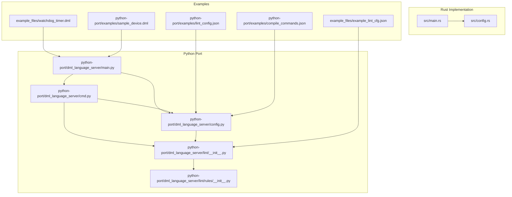
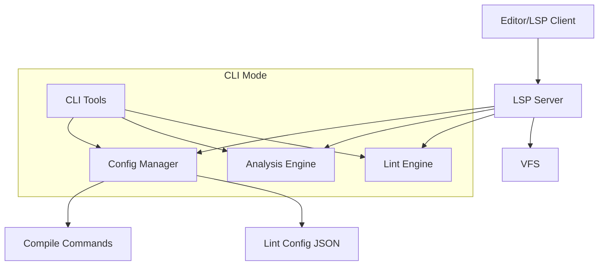
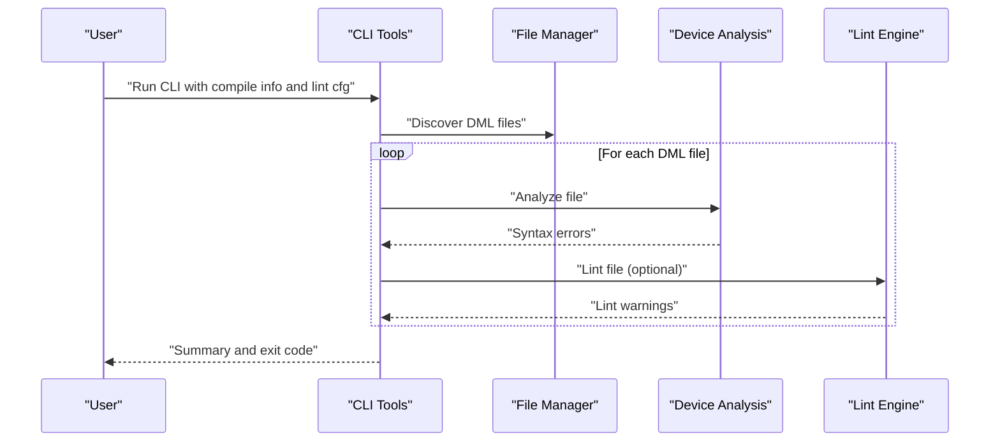
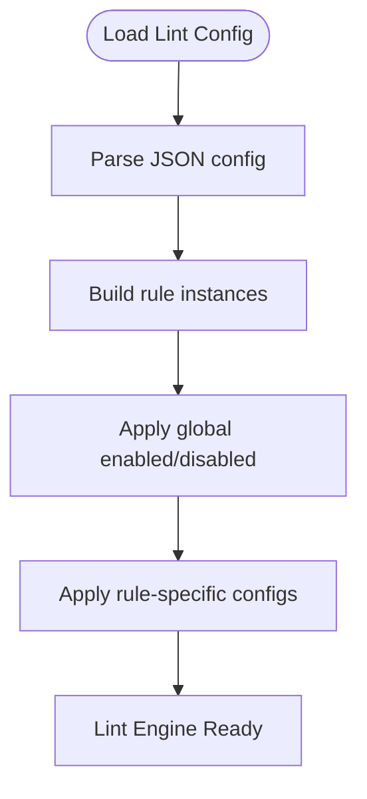
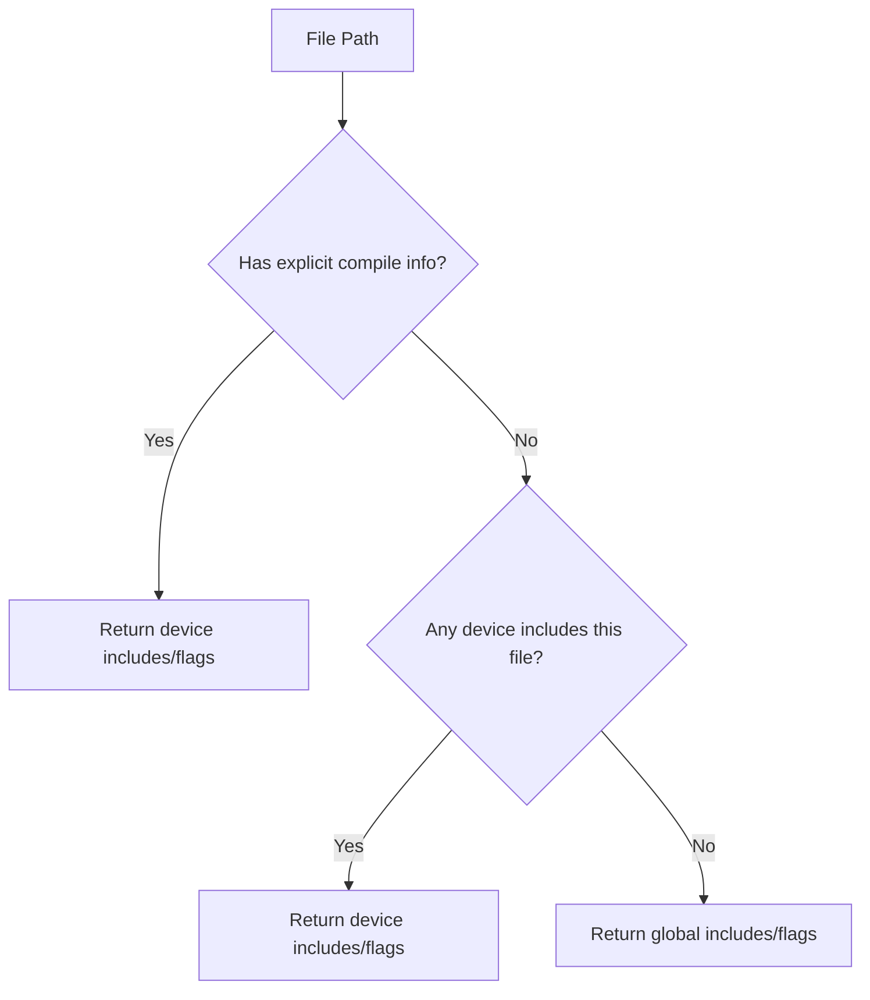
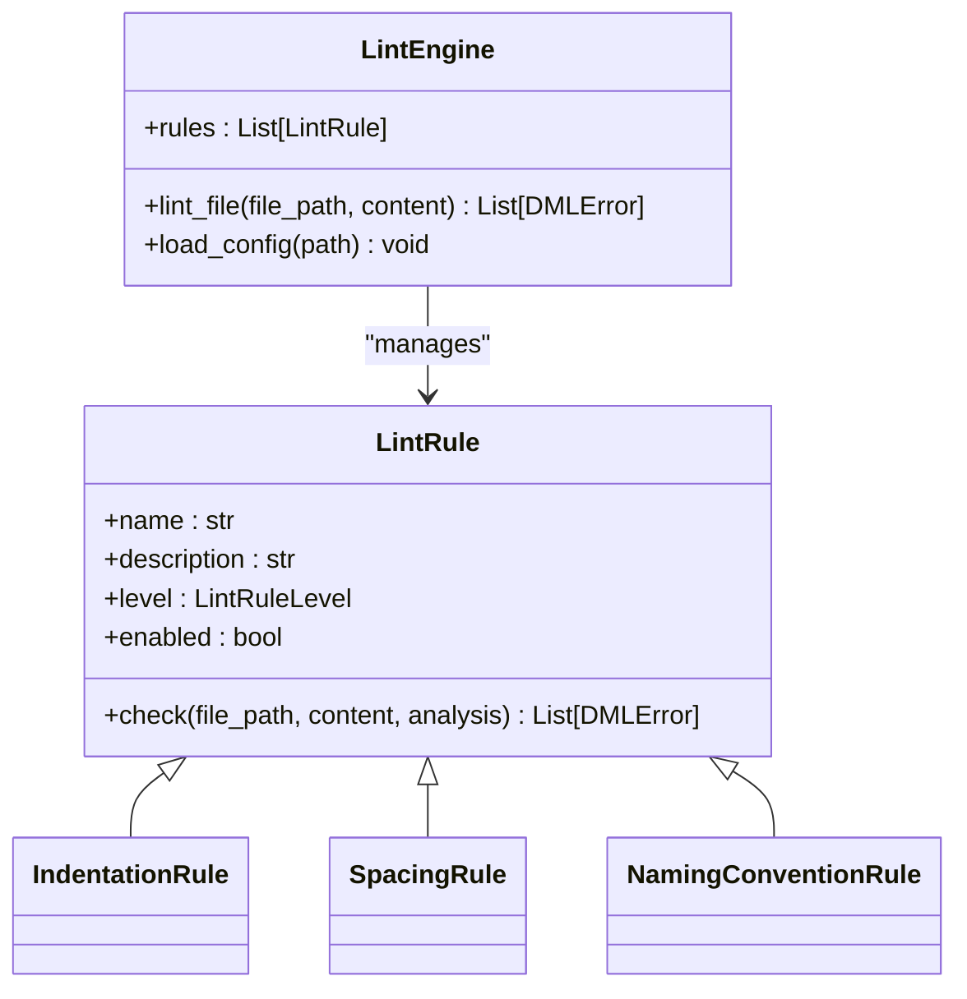
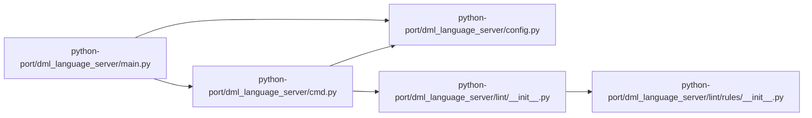

# Examples and Tutorials

<cite>
**Referenced Files in This Document**
- [README.md](file://README.md)
- [USAGE.md](file://USAGE.md)
- [clients.md](file://clients.md)
- [python-port/README.md](file://python-port/README.md)
- [example_files/example_lint_cfg.json](file://example_files/example_lint_cfg.json)
- [example_files/watchdog_timer.dml](file://example_files/watchdog_timer.dml)
- [python-port/examples/lint_config.json](file://python-port/examples/lint_config.json)
- [python-port/examples/compile_commands.json](file://python-port/examples/compile_commands.json)
- [python-port/examples/sample_device.dml](file://python-port/examples/sample_device.dml)
- [python-port/dml_language_server/lint/__init__.py](file://python-port/dml_language_server/lint/__init__.py)
- [python-port/dml_language_server/lint/rules/__init__.py](file://python-port/dml_language_server/lint/rules/__init__.py)
- [python-port/dml_language_server/config.py](file://python-port/dml_language_server/config.py)
- [python-port/dml_language_server/cmd.py](file://python-port/dml_language_server/cmd.py)
- [python-port/dml_language_server/main.py](file://python-port/dml_language_server/main.py)
- [src/main.rs](file://src/main.rs)
- [src/config.rs](file://src/config.rs)
</cite>

## Table of Contents
1. [Introduction](#introduction)
2. [Project Structure](#project-structure)
3. [Core Components](#core-components)
4. [Architecture Overview](#architecture-overview)
5. [Detailed Component Analysis](#detailed-component-analysis)
6. [Dependency Analysis](#dependency-analysis)
7. [Performance Considerations](#performance-considerations)
8. [Troubleshooting Guide](#troubleshooting-guide)
9. [Conclusion](#conclusion)
10. [Appendices](#appendices)

## Introduction
This document provides practical examples and tutorials for using the DML Language Server (DLS), including IDE integration, command-line analysis, and lint configuration. It covers:
- Basic usage patterns for editors and IDEs
- Command-line analysis with compile commands and lint configuration
- Advanced configuration for multi-device projects and custom linting rules
- Integration examples with popular editors and CI/CD pipelines
- Best practices for DML development workflows, performance optimization, and troubleshooting
- Real-world scenarios such as migrating existing DML codebases and extending language server capabilities

## Project Structure
The repository includes both a Rust implementation and a Python port of the DML Language Server. The Python port provides:
- LSP server, CLI tools, lint engine, and configuration management
- Example DML files and lint configurations
- Usage instructions and client integration guidance

**Diagram sources**
- [src/main.rs](file://src/main.rs#L14-L59)
- [src/config.rs](file://src/config.rs#L120-L139)
- [python-port/dml_language_server/main.py](file://python-port/dml_language_server/main.py#L25-L91)
- [python-port/dml_language_server/cmd.py](file://python-port/dml_language_server/cmd.py#L21-L114)
- [python-port/dml_language_server/config.py](file://python-port/dml_language_server/config.py#L89-L311)
- [python-port/dml_language_server/lint/__init__.py](file://python-port/dml_language_server/lint/__init__.py#L196-L298)
- [python-port/dml_language_server/lint/rules/__init__.py](file://python-port/dml_language_server/lint/rules/__init__.py#L34-L231)
- [example_files/watchdog_timer.dml](file://example_files/watchdog_timer.dml#L1-L146)
- [example_files/example_lint_cfg.json](file://example_files/example_lint_cfg.json#L1-L23)
- [python-port/examples/sample_device.dml](file://python-port/examples/sample_device.dml#L1-L188)
- [python-port/examples/lint_config.json](file://python-port/examples/lint_config.json#L1-L25)
- [python-port/examples/compile_commands.json](file://python-port/examples/compile_commands.json#L1-L14)

**Section sources**
- [README.md](file://README.md#L1-L57)
- [python-port/README.md](file://python-port/README.md#L1-L243)

## Core Components
- Lint Engine: Provides configurable linting rules (indentation, spacing, naming) and integrates with analysis results.
- Configuration Manager: Loads compile commands and lint configurations, and exposes include paths and flags per device.
- CLI Tools: Batch analysis and reporting for DML files, with optional linting.
- LSP Server: Language Server Protocol implementation for IDE/editor integration.

Key configuration surfaces:
- Initialization options for LSP clients (compile commands file, linting toggle, lint config file, diagnostic limits, log level).
- Lint configuration JSON enabling/disabling rules and setting rule-specific parameters.
- Compile commands JSON mapping device files to include paths and DMLC flags.

**Section sources**
- [python-port/dml_language_server/lint/__init__.py](file://python-port/dml_language_server/lint/__init__.py#L196-L298)
- [python-port/dml_language_server/lint/rules/__init__.py](file://python-port/dml_language_server/lint/rules/__init__.py#L34-L231)
- [python-port/dml_language_server/config.py](file://python-port/dml_language_server/config.py#L89-L311)
- [python-port/dml_language_server/cmd.py](file://python-port/dml_language_server/cmd.py#L21-L114)
- [src/config.rs](file://src/config.rs#L120-L139)

## Architecture Overview
The DLS architecture separates concerns into modular components:
- VFS/File Management: Tracks file changes and resolves device contexts.
- Analysis Engine: Parses DML and produces diagnostics and symbol information.
- LSP Server: Bridges the Language Server Protocol to editors.
- Lint Engine: Applies configurable rules to enforce code quality.
- CLI Tools: Batch analysis and reporting for automation.

**Diagram sources**
- [python-port/dml_language_server/main.py](file://python-port/dml_language_server/main.py#L25-L91)
- [python-port/dml_language_server/cmd.py](file://python-port/dml_language_server/cmd.py#L21-L114)
- [python-port/dml_language_server/config.py](file://python-port/dml_language_server/config.py#L89-L311)
- [python-port/dml_language_server/lint/__init__.py](file://python-port/dml_language_server/lint/__init__.py#L196-L298)

## Detailed Component Analysis

### Basic Usage Examples

#### IDE Integration
- VS Code: Configure a generic LSP extension to launch the DLS command for DML files.
- Neovim: Use nvim-lspconfig to start the DLS with appropriate filetypes and root detection.
- Emacs: Use lsp-mode to register a DLS client via stdio connection.

These steps are derived from the Python port’s usage documentation and client integration guidance.

**Section sources**
- [python-port/README.md](file://python-port/README.md#L126-L166)
- [clients.md](file://clients.md#L20-L54)

#### Command-Line Analysis
- Start the DLS in CLI mode with optional compile info and lint configuration.
- Analyze a single file or discover and analyze all DML files in the current directory.
- View syntax errors and lint warnings with line and column positions.

**Diagram sources**
- [python-port/dml_language_server/cmd.py](file://python-port/dml_language_server/cmd.py#L21-L114)
- [python-port/dml_language_server/main.py](file://python-port/dml_language_server/main.py#L25-L91)

**Section sources**
- [python-port/README.md](file://python-port/README.md#L33-L68)
- [python-port/dml_language_server/cmd.py](file://python-port/dml_language_server/cmd.py#L21-L114)
- [python-port/dml_language_server/main.py](file://python-port/dml_language_server/main.py#L25-L91)

#### Lint Configuration Setup
- Enable/disable lint rules and set severity levels.
- Configure rule-specific parameters (e.g., indentation size).
- Load lint configuration from a JSON file and apply it to the Lint Engine.

**Diagram sources**
- [python-port/dml_language_server/lint/__init__.py](file://python-port/dml_language_server/lint/__init__.py#L213-L245)
- [python-port/dml_language_server/config.py](file://python-port/dml_language_server/config.py#L240-L262)

**Section sources**
- [python-port/README.md](file://python-port/README.md#L78-L125)
- [python-port/examples/lint_config.json](file://python-port/examples/lint_config.json#L1-L25)
- [example_files/example_lint_cfg.json](file://example_files/example_lint_cfg.json#L1-L23)
- [python-port/dml_language_server/lint/__init__.py](file://python-port/dml_language_server/lint/__init__.py#L196-L298)

### Advanced Configuration Examples

#### Multi-Device Analysis Scenarios
- Use compile commands JSON to define include paths and DMLC flags per device.
- The configuration manager resolves include paths and flags for a given file by matching against device entries and parent directories.

**Diagram sources**
- [python-port/dml_language_server/config.py](file://python-port/dml_language_server/config.py#L165-L224)

**Section sources**
- [README.md](file://README.md#L36-L57)
- [python-port/examples/compile_commands.json](file://python-port/examples/compile_commands.json#L1-L14)
- [python-port/dml_language_server/config.py](file://python-port/dml_language_server/config.py#L131-L224)

#### Custom Linting Rules
- Extend the lint engine by adding new rule classes and registering them.
- Rules can be configured with severity levels and rule-specific parameters.
- Inline lint directives allow per-file or per-line suppression of specific rules.

**Diagram sources**
- [python-port/dml_language_server/lint/__init__.py](file://python-port/dml_language_server/lint/__init__.py#L196-L298)
- [python-port/dml_language_server/lint/rules/__init__.py](file://python-port/dml_language_server/lint/rules/__init__.py#L34-L231)

**Section sources**
- [USAGE.md](file://USAGE.md#L15-L48)
- [python-port/dml_language_server/lint/__init__.py](file://python-port/dml_language_server/lint/__init__.py#L196-L298)
- [python-port/dml_language_server/lint/rules/__init__.py](file://python-port/dml_language_server/lint/rules/__init__.py#L34-L231)

### Integration Examples

#### IDE Integrations
- VS Code: Generic LSP configuration pointing to the DLS executable for DML filetype.
- Neovim: nvim-lspconfig setup with root detection and DML filetype.
- Emacs: lsp-mode registration via stdio connection.

**Section sources**
- [python-port/README.md](file://python-port/README.md#L126-L166)

#### CI/CD Pipelines
- Use CLI mode to analyze DML files in batch, capturing syntax errors and lint warnings.
- Integrate compile commands and lint configuration files into pipeline steps.
- Fail builds on lint errors or enforce maximum diagnostics per file thresholds.

**Section sources**
- [python-port/README.md](file://python-port/README.md#L33-L68)
- [python-port/dml_language_server/cmd.py](file://python-port/dml_language_server/cmd.py#L21-L114)
- [python-port/dml_language_server/config.py](file://python-port/dml_language_server/config.py#L263-L274)

### Practical Templates and Sample Files
- Example DML device: A comprehensive watchdog timer device demonstrating registers, fields, methods, and connections.
- Sample device: A minimal device showcasing banks, registers, fields, methods, and attributes.
- Lint configuration examples: Python port lint config and example lint config JSON.

**Section sources**
- [example_files/watchdog_timer.dml](file://example_files/watchdog_timer.dml#L1-L146)
- [python-port/examples/sample_device.dml](file://python-port/examples/sample_device.dml#L1-L188)
- [python-port/examples/lint_config.json](file://python-port/examples/lint_config.json#L1-L25)
- [example_files/example_lint_cfg.json](file://example_files/example_lint_cfg.json#L1-L23)

## Dependency Analysis
The DLS relies on a layered dependency model:
- CLI entry point delegates to either LSP server or CLI analyzer.
- CLI analyzer depends on configuration, file management, device analysis, and lint engine.
- Lint engine depends on configuration and analysis results.

**Diagram sources**
- [python-port/dml_language_server/main.py](file://python-port/dml_language_server/main.py#L25-L91)
- [python-port/dml_language_server/cmd.py](file://python-port/dml_language_server/cmd.py#L21-L114)
- [python-port/dml_language_server/config.py](file://python-port/dml_language_server/config.py#L89-L311)
- [python-port/dml_language_server/lint/__init__.py](file://python-port/dml_language_server/lint/__init__.py#L196-L298)
- [python-port/dml_language_server/lint/rules/__init__.py](file://python-port/dml_language_server/lint/rules/__init__.py#L34-L231)

**Section sources**
- [python-port/dml_language_server/main.py](file://python-port/dml_language_server/main.py#L25-L91)
- [python-port/dml_language_server/cmd.py](file://python-port/dml_language_server/cmd.py#L21-L114)
- [python-port/dml_language_server/config.py](file://python-port/dml_language_server/config.py#L89-L311)
- [python-port/dml_language_server/lint/__init__.py](file://python-port/dml_language_server/lint/__init__.py#L196-L298)
- [python-port/dml_language_server/lint/rules/__init__.py](file://python-port/dml_language_server/lint/rules/__init__.py#L34-L231)

## Performance Considerations
- Prefer CLI mode for batch analysis in CI environments to avoid repeated LSP overhead.
- Limit diagnostics per file to reduce noise and improve responsiveness.
- Use compile commands to restrict include search spaces and DMLC flags to relevant subsets.
- Keep lint rule sets focused to minimize analysis time for large codebases.

[No sources needed since this section provides general guidance]

## Troubleshooting Guide
- Lint inline directives: Use per-file or per-line allowances to temporarily suppress specific rules when justified.
- Configuration loading: Verify compile commands and lint config JSON paths and formats.
- Log levels: Increase verbosity in CLI mode to diagnose issues.
- Client configuration: Ensure LSP clients send configuration updates and handle server capability registration.

**Section sources**
- [USAGE.md](file://USAGE.md#L15-L48)
- [python-port/README.md](file://python-port/README.md#L178-L200)
- [python-port/dml_language_server/main.py](file://python-port/dml_language_server/main.py#L65-L70)

## Conclusion
This guide demonstrated practical usage patterns for the DML Language Server across IDEs, CLI tools, and CI/CD pipelines. It outlined advanced configuration techniques for multi-device projects, custom linting rules, and real-world migration strategies. Following the best practices and leveraging the provided examples will streamline DML development workflows and improve code quality.

[No sources needed since this section summarizes without analyzing specific files]

## Appendices

### Appendix A: CLI Invocation Reference
- Start in CLI mode with optional compile info and lint configuration.
- Analyze a single file or discover and analyze all DML files in the current directory.

**Section sources**
- [python-port/README.md](file://python-port/README.md#L33-L68)
- [python-port/dml_language_server/cmd.py](file://python-port/dml_language_server/cmd.py#L21-L114)
- [python-port/dml_language_server/main.py](file://python-port/dml_language_server/main.py#L25-L91)

### Appendix B: LSP Initialization Options
- Configure compile commands file, linting toggle, lint config file, max diagnostics per file, and log level.

**Section sources**
- [python-port/README.md](file://python-port/README.md#L112-L125)
- [python-port/dml_language_server/config.py](file://python-port/dml_language_server/config.py#L60-L87)

### Appendix C: Compile Commands Format
- Map device files to include paths and DMLC flags for accurate import resolution and compilation flags.

**Section sources**
- [README.md](file://README.md#L36-L57)
- [python-port/examples/compile_commands.json](file://python-port/examples/compile_commands.json#L1-L14)

### Appendix D: Lint Configuration Format
- Define enabled/disabled rules, severity levels, and rule-specific parameters.

**Section sources**
- [python-port/README.md](file://python-port/README.md#L93-L111)
- [python-port/examples/lint_config.json](file://python-port/examples/lint_config.json#L1-L25)
- [example_files/example_lint_cfg.json](file://example_files/example_lint_cfg.json#L1-L23)