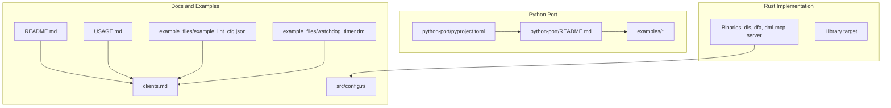
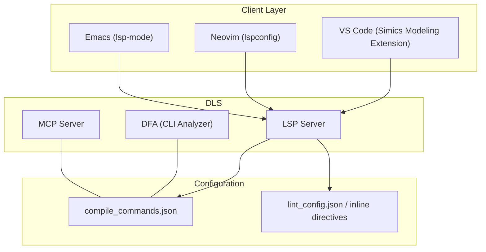
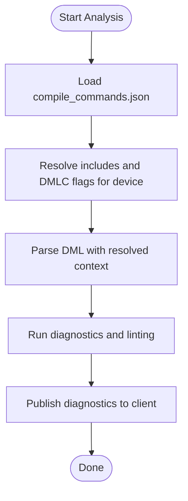
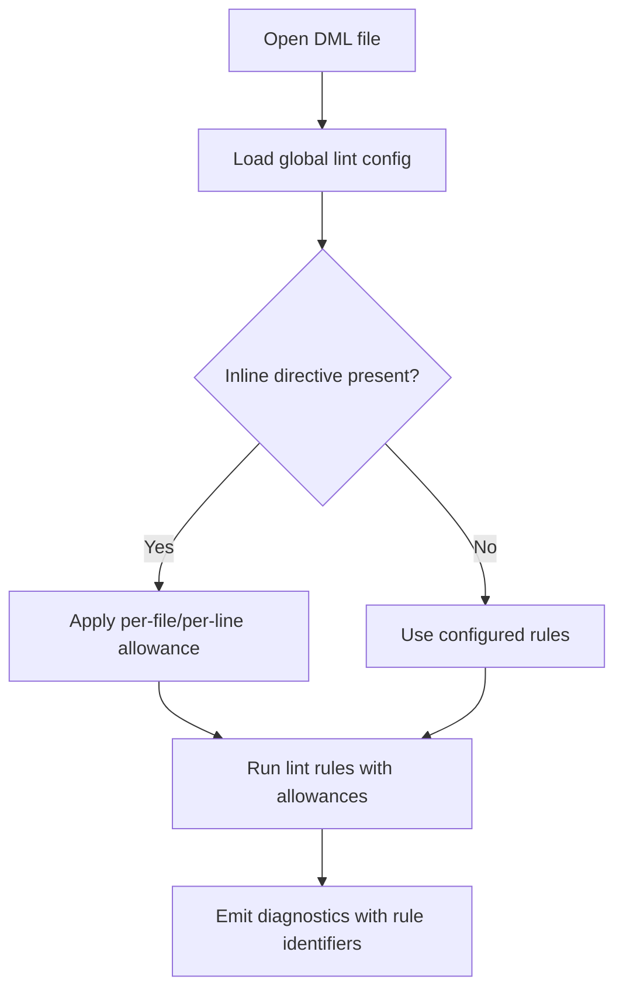
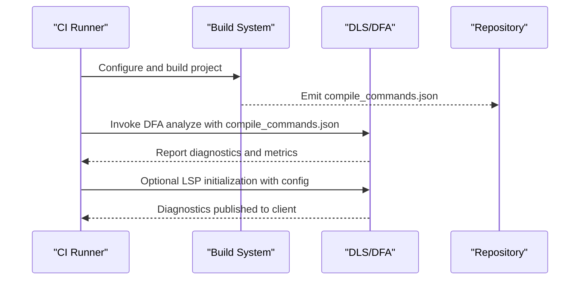
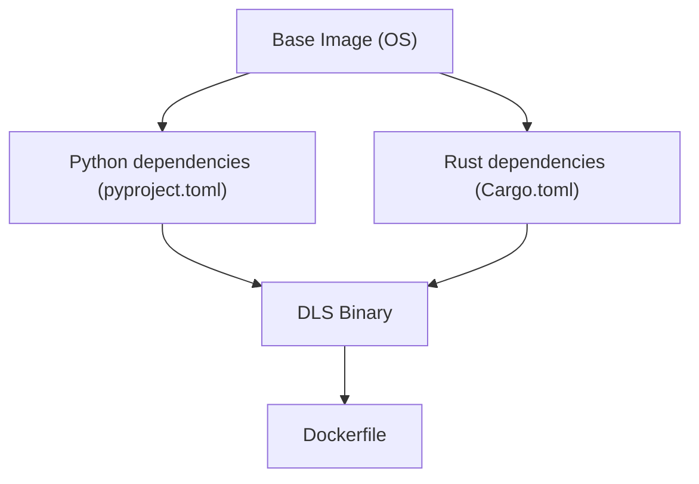
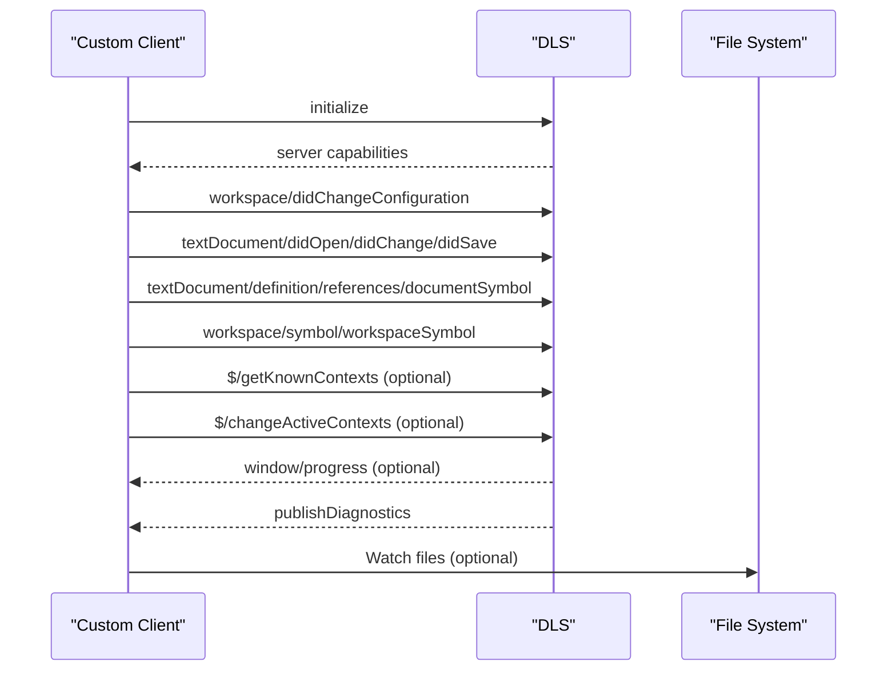
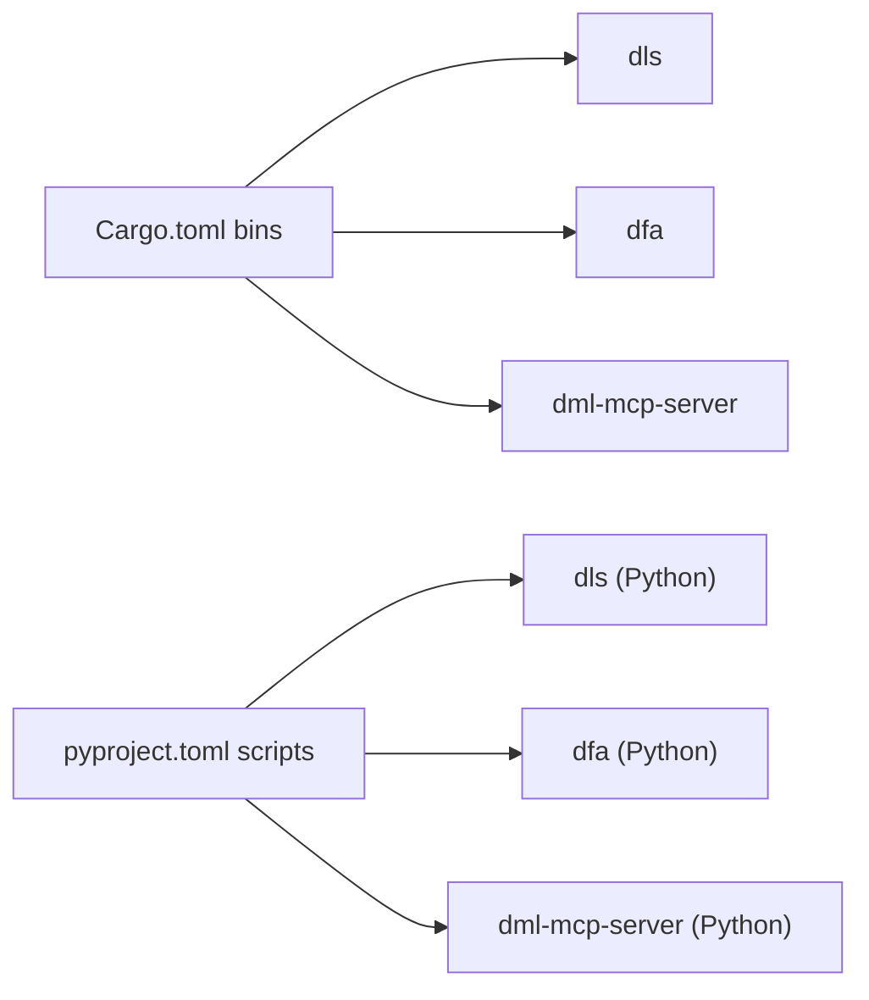

# Integration Patterns

<cite>
**Referenced Files in This Document**
- [README.md](file://README.md)
- [USAGE.md](file://USAGE.md)
- [clients.md](file://clients.md)
- [src/config.rs](file://src/config.rs)
- [Cargo.toml](file://Cargo.toml)
- [python-port/README.md](file://python-port/README.md)
- [python-port/pyproject.toml](file://python-port/pyproject.toml)
- [python-port/examples/compile_commands.json](file://python-port/examples/compile_commands.json)
- [python-port/examples/lint_config.json](file://python-port/examples/lint_config.json)
- [example_files/example_lint_cfg.json](file://example_files/example_lint_cfg.json)
- [example_files/watchdog_timer.dml](file://example_files/watchdog_timer.dml)
- [python-port/examples/sample_device.dml](file://python-port/examples/sample_device.dml)
- [python-port/examples/utility.dml](file://python-port/examples/utility.dml)
</cite>

## Table of Contents
1. [Introduction](#introduction)
2. [Project Structure](#project-structure)
3. [Core Components](#core-components)
4. [Architecture Overview](#architecture-overview)
5. [Detailed Component Analysis](#detailed-component-analysis)
6. [Dependency Analysis](#dependency-analysis)
7. [Performance Considerations](#performance-considerations)
8. [Troubleshooting Guide](#troubleshooting-guide)
9. [Conclusion](#conclusion)
10. [Appendices](#appendices)

## Introduction
This document provides integration patterns for the DML Language Server (DLS), covering IDE plugin integration for VS Code, Neovim, and Emacs; build system integration via compile_commands.json; CI/CD automation; Docker containerization; custom client development and protocol extensions; and version control integration with pre-commit hooks. It synthesizes guidance from the repository’s documentation and example configurations to help teams deploy consistent, reliable DML authoring experiences across diverse development environments.

## Project Structure
The repository includes:
- A Rust implementation of the language server, CLI tools, and MCP server
- A Python port with LSP, CLI, DFA, and MCP capabilities
- Example configurations for compile_commands.json and linting
- Client integration guidance and usage notes

**Diagram sources**
- [Cargo.toml](file://Cargo.toml#L18-L31)
- [python-port/README.md](file://python-port/README.md#L1-L243)
- [python-port/pyproject.toml](file://python-port/pyproject.toml#L60-L63)
- [README.md](file://README.md#L22-L34)
- [USAGE.md](file://USAGE.md#L15-L48)
- [clients.md](file://clients.md#L1-L191)
- [src/config.rs](file://src/config.rs#L120-L225)
- [example_files/example_lint_cfg.json](file://example_files/example_lint_cfg.json#L1-L23)
- [example_files/watchdog_timer.dml](file://example_files/watchdog_timer.dml)

**Section sources**
- [README.md](file://README.md#L1-L57)
- [USAGE.md](file://USAGE.md#L1-L48)
- [clients.md](file://clients.md#L1-L191)
- [Cargo.toml](file://Cargo.toml#L1-L62)
- [python-port/README.md](file://python-port/README.md#L1-L243)
- [python-port/pyproject.toml](file://python-port/pyproject.toml#L1-L106)

## Core Components
- Language Server Protocol (LSP) server for DML files
- CLI analyzer (DFA) for batch analysis and dependency checks
- MCP server for AI-assisted development
- Configuration model supporting linting, compile info, and analysis retention
- Example configurations for compile_commands.json and linting

Key integration touchpoints:
- LSP initialization options and configuration updates
- compile_commands.json for module resolution and DMLC flags
- Inline lint directives for per-file control
- Custom protocol extensions for context control and progress reporting

**Section sources**
- [README.md](file://README.md#L26-L34)
- [USAGE.md](file://USAGE.md#L15-L48)
- [clients.md](file://clients.md#L99-L181)
- [src/config.rs](file://src/config.rs#L120-L225)
- [python-port/README.md](file://python-port/README.md#L33-L77)

## Architecture Overview
The DLS operates as an LSP server with optional DFA and MCP extensions. Clients (IDEs/editors) communicate via standard LSP messages and can optionally use custom notifications/requests for advanced features.

**Diagram sources**
- [clients.md](file://clients.md#L126-L166)
- [python-port/README.md](file://python-port/README.md#L126-L166)
- [python-port/examples/compile_commands.json](file://python-port/examples/compile_commands.json#L1-L14)
- [python-port/examples/lint_config.json](file://python-port/examples/lint_config.json#L1-L25)
- [USAGE.md](file://USAGE.md#L15-L48)

## Detailed Component Analysis

### IDE Plugin Integration Patterns
- VS Code: Use the Simics Modeling Extension for DML. The extension manages LSP lifecycle and configuration.
- Neovim: Configure lspconfig to launch the DLS executable with appropriate filetypes and root detection.
- Emacs: Register an LSP client connection to the DLS for DML major modes.

Configuration examples are provided in the Python port documentation for generic LSP setups and in clients.md for the Rust server’s capabilities.

**Section sources**
- [clients.md](file://clients.md#L126-L166)
- [python-port/README.md](file://python-port/README.md#L128-L166)

### Build System Integration with compile_commands.json
The DLS uses compile_commands.json to resolve imports and derive DMLC flags per device. The file format includes per-device entries with include paths and flags.

Recommended generation:
- Export compile_commands.json from CMake projects by setting the appropriate environment variable before invoking cmake.
- Hand-author the file when necessary, ensuring each device file maps to its includes and DMLC flags.

**Diagram sources**
- [README.md](file://README.md#L36-L57)
- [python-port/examples/compile_commands.json](file://python-port/examples/compile_commands.json#L1-L14)

**Section sources**
- [README.md](file://README.md#L36-L57)
- [python-port/examples/compile_commands.json](file://python-port/examples/compile_commands.json#L1-L14)

### Linting Configuration and Inline Directives
- Global lint configuration via JSON enables/disables rules and sets rule-specific parameters.
- Inline directives allow per-file/per-line suppression of specific rules.
- Per-file allowance applies the rule suppression across the entire file.
- Per-line allowance applies to the next line without a leading comment or the current line if declared outside a leading comment.

**Diagram sources**
- [USAGE.md](file://USAGE.md#L15-L48)
- [python-port/examples/lint_config.json](file://python-port/examples/lint_config.json#L1-L25)
- [example_files/example_lint_cfg.json](file://example_files/example_lint_cfg.json#L1-L23)

**Section sources**
- [USAGE.md](file://USAGE.md#L15-L48)
- [python-port/examples/lint_config.json](file://python-port/examples/lint_config.json#L1-L25)
- [example_files/example_lint_cfg.json](file://example_files/example_lint_cfg.json#L1-L23)

### CI/CD Pipeline Integration
Recommended steps:
- Install the DLS binary or Python package in CI runners.
- Generate compile_commands.json during the build phase.
- Run DFA for batch analysis, dependency checks, and JSON reports.
- Integrate linting by invoking the LSP with configuration files or inline directives.

**Diagram sources**
- [python-port/README.md](file://python-port/README.md#L49-L77)
- [python-port/pyproject.toml](file://python-port/pyproject.toml#L60-L63)

**Section sources**
- [python-port/README.md](file://python-port/README.md#L33-L77)
- [python-port/pyproject.toml](file://python-port/pyproject.toml#L60-L63)

### Docker Containerization
Create a reproducible environment by packaging the DLS and dependencies:
- Base image: modern Linux distribution with Python 3.8+ or Rust toolchain
- Install dependencies: Python packages from pyproject.toml or Rust crates from Cargo.toml
- Entrypoint: launch the DLS binary or Python script
- Mount repository volume and expose ports if needed for MCP

**Diagram sources**
- [python-port/pyproject.toml](file://python-port/pyproject.toml#L28-L58)
- [Cargo.toml](file://Cargo.toml#L33-L62)

**Section sources**
- [python-port/pyproject.toml](file://python-port/pyproject.toml#L28-L58)
- [Cargo.toml](file://Cargo.toml#L33-L62)

### Custom Client Development and Protocol Extensions
Implementations should:
- Support required LSP notifications and requests for DML documents and workspace symbols.
- Send configuration updates via workspace/didChangeConfiguration and handle workspace/configuration if using pull-style updates.
- Implement custom notifications/requests for context control and progress reporting when supported by the server.

**Diagram sources**
- [clients.md](file://clients.md#L63-L98)
- [clients.md](file://clients.md#L99-L181)

**Section sources**
- [clients.md](file://clients.md#L20-L54)
- [clients.md](file://clients.md#L63-L98)
- [clients.md](file://clients.md#L99-L181)

### Version Control Integration and Pre-commit Hooks
- Use compile_commands.json and lint configuration in version control to ensure consistent analysis across environments.
- Add pre-commit hooks to run DFA or LSP-based checks before commits.
- Keep inline directives minimal and documented to avoid noise in diffs.

**Section sources**
- [USAGE.md](file://USAGE.md#L15-L48)
- [python-port/examples/compile_commands.json](file://python-port/examples/compile_commands.json#L1-L14)
- [python-port/examples/lint_config.json](file://python-port/examples/lint_config.json#L1-L25)

## Dependency Analysis
The Rust and Python implementations expose binaries and scripts that clients can invoke. The Python port additionally provides a CLI for DFA and MCP.

**Diagram sources**
- [Cargo.toml](file://Cargo.toml#L18-L31)
- [python-port/pyproject.toml](file://python-port/pyproject.toml#L60-L63)

**Section sources**
- [Cargo.toml](file://Cargo.toml#L18-L31)
- [python-port/pyproject.toml](file://python-port/pyproject.toml#L60-L63)

## Performance Considerations
- Prefer saving-before-analyzing when frequent edits occur to reduce overhead.
- Tune analysis retention duration to balance freshness and stability.
- Use compile_commands.json to limit unnecessary parsing by restricting include scopes.
- Limit lint rule scope to relevant subsets for large repositories.

[No sources needed since this section provides general guidance]

## Troubleshooting Guide
- Verify compile_commands.json correctness and device-specific entries for accurate imports and flags.
- Confirm configuration updates are sent on changes and that the client supports pull-style configuration if used.
- Check for custom capability support (context control and progress) and handle gracefully when unsupported.
- Validate inline lint directives syntax and placement to ensure intended allowances.

**Section sources**
- [README.md](file://README.md#L36-L57)
- [USAGE.md](file://USAGE.md#L15-L48)
- [clients.md](file://clients.md#L32-L54)
- [clients.md](file://clients.md#L166-L181)

## Conclusion
By aligning IDE integrations with LSP, configuring compile_commands.json for precise analysis, enforcing lint policies via global and inline directives, automating analysis in CI, containerizing environments, and extending clients with protocol capabilities, teams can achieve robust, scalable DML authoring workflows across diverse development ecosystems.

[No sources needed since this section summarizes without analyzing specific files]

## Appendices

### Appendix A: Example DML Files
- Example device demonstrating DML constructs and templates
- Utility library with reusable templates and helpers

**Section sources**
- [python-port/examples/sample_device.dml](file://python-port/examples/sample_device.dml#L1-L188)
- [python-port/examples/utility.dml](file://python-port/examples/utility.dml#L1-L77)
- [example_files/watchdog_timer.dml](file://example_files/watchdog_timer.dml)