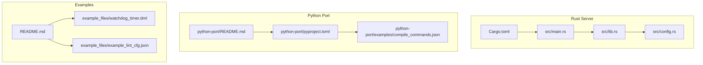
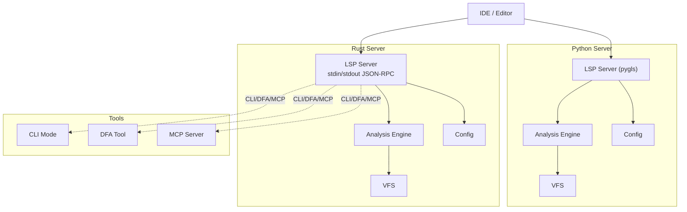
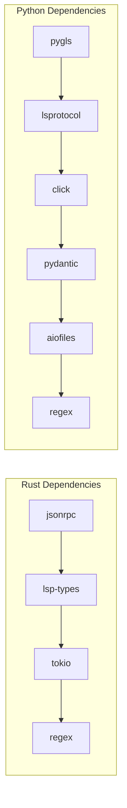

# Getting Started

<cite>
**Referenced Files in This Document**
- [README.md](file://README.md)
- [USAGE.md](file://USAGE.md)
- [clients.md](file://clients.md)
- [CONTRIBUTING.md](file://CONTRIBUTING.md)
- [Cargo.toml](file://Cargo.toml)
- [src/main.rs](file://src/main.rs)
- [src/lib.rs](file://src/lib.rs)
- [src/config.rs](file://src/config.rs)
- [python-port/README.md](file://python-port/README.md)
- [python-port/pyproject.toml](file://python-port/pyproject.toml)
- [python-port/examples/compile_commands.json](file://python-port/examples/compile_commands.json)
- [example_files/example_lint_cfg.json](file://example_files/example_lint_cfg.json)
- [example_files/watchdog_timer.dml](file://example_files/watchdog_timer.dml)
</cite>

## Table of Contents
1. [Introduction](#introduction)
2. [Project Structure](#project-structure)
3. [Core Components](#core-components)
4. [Architecture Overview](#architecture-overview)
5. [Detailed Component Analysis](#detailed-component-analysis)
6. [Dependency Analysis](#dependency-analysis)
7. [Performance Considerations](#performance-considerations)
8. [Troubleshooting Guide](#troubleshooting-guide)
9. [Conclusion](#conclusion)
10. [Appendices](#appendices)

## Introduction
This guide helps you install and integrate the DML Language Server (DLS) for DML 1.4 development. It covers:
- Building from source (Rust-based server)
- Running pre-built binaries
- Using the Python port alternative
- Basic workflow from installation to first IDE integration
- Prerequisites: DML language basics, LSP protocol understanding, and editor configuration
- IDE setup for common editors
- Configuring compile_commands.json
- Initial testing and verification
- Troubleshooting and verification steps
- Guidance on choosing between Rust-based and Python-based deployments

## Project Structure
The repository provides:
- A Rust-based language server with CLI and LSP modes
- A Python port that mirrors the Rust architecture and APIs
- Example DML files and configuration samples
- Documentation for usage, clients, and contribution

**Diagram sources**
- [src/main.rs](file://src/main.rs#L1-L60)
- [src/lib.rs](file://src/lib.rs#L1-L54)
- [src/config.rs](file://src/config.rs#L120-L139)
- [Cargo.toml](file://Cargo.toml#L1-L62)
- [python-port/README.md](file://python-port/README.md#L1-L243)
- [python-port/pyproject.toml](file://python-port/pyproject.toml#L1-L106)
- [python-port/examples/compile_commands.json](file://python-port/examples/compile_commands.json#L1-L14)
- [README.md](file://README.md#L1-L57)
- [example_files/example_lint_cfg.json](file://example_files/example_lint_cfg.json#L1-L23)
- [example_files/watchdog_timer.dml](file://example_files/watchdog_timer.dml#L1-L146)

**Section sources**
- [README.md](file://README.md#L1-L57)
- [python-port/README.md](file://python-port/README.md#L1-L243)
- [Cargo.toml](file://Cargo.toml#L1-L62)

## Core Components
- Rust server binary and library:
  - Entry point parses CLI and runs either LSP server or CLI mode
  - Configuration model supports linting, compile info, and analysis policies
- Python port:
  - Provides the same LSP, CLI, DFA, and MCP tools as the Rust server
  - Scripts registered for dls, dfa, and dml-mcp-server
- Examples:
  - Sample DML device file and lint configuration for quick testing

Key capabilities:
- LSP-based IDE integration
- CLI mode for testing and debugging
- DFA for batch analysis
- MCP server for AI-assisted development

**Section sources**
- [src/main.rs](file://src/main.rs#L21-L60)
- [src/lib.rs](file://src/lib.rs#L32-L47)
- [src/config.rs](file://src/config.rs#L120-L139)
- [python-port/README.md](file://python-port/README.md#L33-L77)
- [python-port/pyproject.toml](file://python-port/pyproject.toml#L60-L63)
- [example_files/example_lint_cfg.json](file://example_files/example_lint_cfg.json#L1-L23)
- [example_files/watchdog_timer.dml](file://example_files/watchdog_timer.dml#L1-L146)

## Architecture Overview
High-level architecture for both Rust and Python ports:

**Diagram sources**
- [src/main.rs](file://src/main.rs#L44-L59)
- [src/lib.rs](file://src/lib.rs#L32-L47)
- [src/config.rs](file://src/config.rs#L120-L139)
- [python-port/README.md](file://python-port/README.md#L33-L77)
- [python-port/pyproject.toml](file://python-port/pyproject.toml#L60-L63)

## Detailed Component Analysis

### Rust Server: Build and Run
- Build from source:
  - Use cargo to build the release target
- Run modes:
  - LSP server over stdio (default)
  - CLI mode for interactive testing and debugging
- CLI usage:
  - Start with --cli flag
  - Look for initialization completion messages
  - Use help to explore available commands

Verification steps:
- After build, run the server and confirm it starts
- Switch to CLI mode and run a simple query to verify responsiveness

**Section sources**
- [README.md](file://README.md#L22-L31)
- [CONTRIBUTING.md](file://CONTRIBUTING.md#L72-L130)
- [src/main.rs](file://src/main.rs#L21-L60)

### Python Port: Install and Run
- Install from source:
  - Use pip in editable mode for development
  - Optional dev extras for testing and formatting
- Run tools:
  - dls for LSP server
  - dfa for device file analyzer
  - dml-mcp-server for AI-assisted development
- CLI mode:
  - Supports --cli and --compile-info for batch analysis

Verification steps:
- Confirm scripts are installed and runnable
- Test CLI mode and inspect initialization messages

**Section sources**
- [python-port/README.md](file://python-port/README.md#L17-L77)
- [python-port/pyproject.toml](file://python-port/pyproject.toml#L60-L63)

### Configuration: compile_commands.json
Purpose:
- Provide include paths and DMLC flags per module
- Enable accurate import resolution and device analysis

Format:
- JSON mapping device file paths to include directories and DMLC flags

Guidance:
- Generated by CMake projects exporting compile commands
- Hand-craft when necessary for small setups

**Section sources**
- [README.md](file://README.md#L36-L57)
- [python-port/examples/compile_commands.json](file://python-port/examples/compile_commands.json#L1-L14)

### Lint Configuration
- Per-file inline configuration via comments
- Global lint configuration files for rule sets and severity
- Inline commands allow-file and allow for granular control

**Section sources**
- [USAGE.md](file://USAGE.md#L15-L48)
- [example_files/example_lint_cfg.json](file://example_files/example_lint_cfg.json#L1-L23)

### IDE Integration: Setup Guides
- VS Code:
  - Use a generic LSP extension and point it to the dls command
  - Configure file types for DML
- Neovim:
  - Use nvim-lspconfig to launch dls via stdio
  - Set root detection to include compile_commands.json or .git
- Emacs:
  - Use lsp-mode to register a dml-ls connection

Notes:
- Ensure the DLS binary is discoverable on PATH
- Send workspace/didChangeConfiguration when configuration changes

**Section sources**
- [clients.md](file://clients.md#L20-L54)
- [python-port/README.md](file://python-port/README.md#L126-L166)

### Workflow: From Installation to First Integration
1. Choose deployment:
   - Rust server for production-grade performance
   - Python port for rapid iteration and Python tooling
2. Install prerequisites:
   - Rust toolchain (for Rust server)
   - Python 3.8+ (for Python port)
3. Build or install:
   - Rust: cargo build --release
   - Python: pip install -e .
4. Prepare compile_commands.json for your project
5. Start the server:
   - Rust: run the binary or cargo run --bin dls
   - Python: run dls
6. Configure your editor to connect to the server
7. Open a DML 1.4 file and verify diagnostics and goto-definition

**Section sources**
- [README.md](file://README.md#L22-L31)
- [python-port/README.md](file://python-port/README.md#L17-L41)
- [python-port/examples/compile_commands.json](file://python-port/examples/compile_commands.json#L1-L14)
- [clients.md](file://clients.md#L20-L54)

## Dependency Analysis
- Rust server dependencies include LSP types, JSON-RPC, async runtime, and parsing libraries
- Python port dependencies include pygls, lsprotocol, click, pydantic, aiofiles, watchdog, and regex
- Both expose the same tooling entry points (dls, dfa, dml-mcp-server)

**Diagram sources**
- [Cargo.toml](file://Cargo.toml#L33-L62)
- [python-port/pyproject.toml](file://python-port/pyproject.toml#L28-L42)

**Section sources**
- [Cargo.toml](file://Cargo.toml#L33-L62)
- [python-port/pyproject.toml](file://python-port/pyproject.toml#L28-L42)

## Performance Considerations
- Rust server benefits from native performance and efficient concurrency
- Python port offers easier development ergonomics and broader Python tooling
- Choose Rust for large projects and tight feedback loops; choose Python for quick prototyping and CI-friendly workflows

[No sources needed since this section provides general guidance]

## Troubleshooting Guide
Common issues and resolutions:
- Server fails to start:
  - Verify PATH includes the installed binary
  - Check logs and ensure compile_commands.json is valid
- No diagnostics or imports unresolved:
  - Confirm compile_commands.json includes the device file and correct include paths
  - Ensure DML version is set to 1.4
- LSP client disconnects:
  - Ensure the client restarts the server on exit and handles crashes gracefully
- Lint not applied:
  - Verify lint configuration file path and rule sets
  - Use inline directives for per-file overrides

Verification checklist:
- Open a DML 1.4 example file and confirm diagnostics appear
- Try goto-definition and find-references
- Toggle linting and observe changes
- Run CLI mode and verify initialization messages

**Section sources**
- [README.md](file://README.md#L36-L57)
- [USAGE.md](file://USAGE.md#L15-L48)
- [clients.md](file://clients.md#L39-L42)
- [CONTRIBUTING.md](file://CONTRIBUTING.md#L109-L130)

## Conclusion
You now have the essentials to install, configure, and integrate the DML Language Server. Start with the Rust server for production use or the Python port for rapid iteration. Prepare compile_commands.json, configure your editor, and verify functionality with the example DML file and lint configuration.

[No sources needed since this section summarizes without analyzing specific files]

## Appendices

### Appendix A: Quick Start Checklist
- Install Rust toolchain or Python 3.8+
- Build or install DLS (Rust or Python)
- Create compile_commands.json for your project
- Configure your editor to launch the DLS
- Open a DML 1.4 file and verify features

**Section sources**
- [README.md](file://README.md#L22-L31)
- [python-port/README.md](file://python-port/README.md#L17-L41)
- [example_files/watchdog_timer.dml](file://example_files/watchdog_timer.dml#L7-L10)

### Appendix B: Example Files Reference
- Example DML device file for testing
- Example lint configuration for rule sets and severity

**Section sources**
- [example_files/watchdog_timer.dml](file://example_files/watchdog_timer.dml#L1-L146)
- [example_files/example_lint_cfg.json](file://example_files/example_lint_cfg.json#L1-L23)