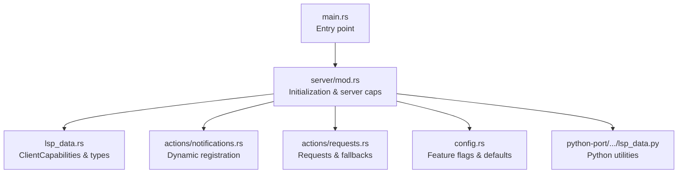
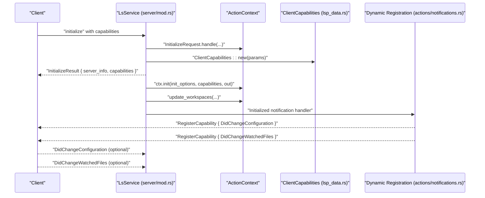
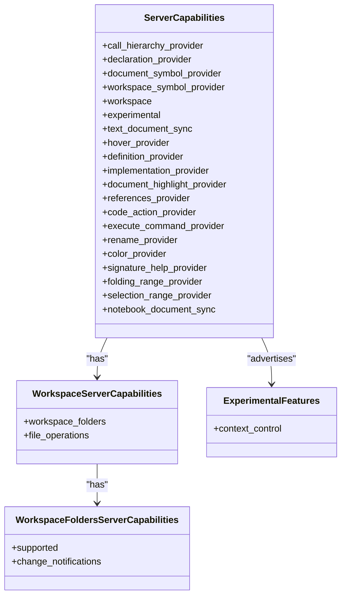
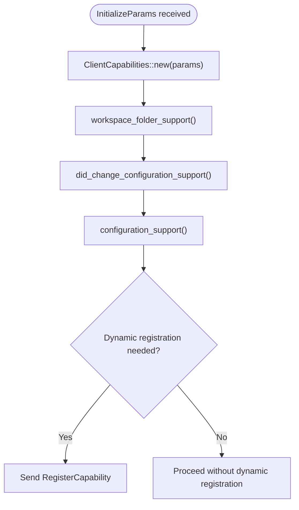
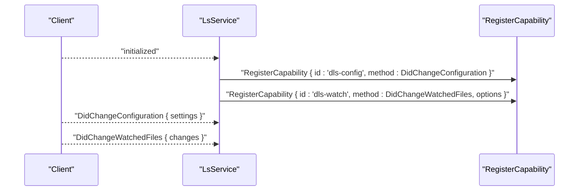
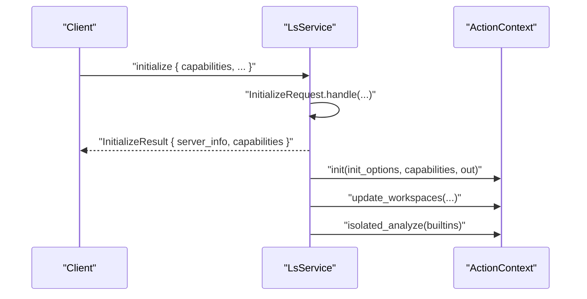
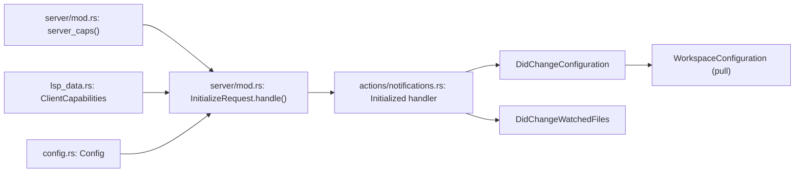

# Client Capability Negotiation

<cite>
**Referenced Files in This Document**
- [lsp_data.rs](file://src/lsp_data.rs)
- [config.rs](file://src/config.rs)
- [server/mod.rs](file://src/server/mod.rs)
- [actions/notifications.rs](file://src/actions/notifications.rs)
- [actions/requests.rs](file://src/actions/requests.rs)
- [main.rs](file://src/main.rs)
- [python-port/dml_language_server/lsp_data.py](file://python-port/dml_language_server/lsp_data.py)
</cite>

## Table of Contents
1. [Introduction](#introduction)
2. [Project Structure](#project-structure)
3. [Core Components](#core-components)
4. [Architecture Overview](#architecture-overview)
5. [Detailed Component Analysis](#detailed-component-analysis)
6. [Dependency Analysis](#dependency-analysis)
7. [Performance Considerations](#performance-considerations)
8. [Troubleshooting Guide](#troubleshooting-guide)
9. [Conclusion](#conclusion)

## Introduction
This document explains how the DML Language Server negotiates client capabilities, advertises server capabilities, discovers client features, and adapts dynamically to client support. It covers:
- ServerCapabilities structure and advertisement
- Client capability discovery and validation
- Dynamic feature registration (workspace folder support, configuration change handling, watched files)
- Experimental features and backward compatibility
- Text document synchronization options
- Initialization handshake and fallback mechanisms for unsupported features
- Examples of capability queries and dynamic updates
- Backward compatibility considerations and troubleshooting

## Project Structure
The capability negotiation logic spans several modules:
- Server capability advertisement and initialization
- Client capability discovery and feature checks
- Dynamic registration of client-side features
- Configuration and feature flags exposed to clients
- Python port utilities for LSP interoperability

**Diagram sources**
- [main.rs](file://src/main.rs#L44-L59)
- [server/mod.rs](file://src/server/mod.rs#L677-L729)
- [lsp_data.rs](file://src/lsp_data.rs#L313-L354)
- [actions/notifications.rs](file://src/actions/notifications.rs#L32-L71)
- [actions/requests.rs](file://src/actions/requests.rs#L401-L424)
- [config.rs](file://src/config.rs#L120-L139)
- [python-port/dml_language_server/lsp_data.py](file://python-port/dml_language_server/lsp_data.py#L334-L358)

**Section sources**
- [main.rs](file://src/main.rs#L44-L59)
- [server/mod.rs](file://src/server/mod.rs#L677-L729)
- [lsp_data.rs](file://src/lsp_data.rs#L313-L354)
- [actions/notifications.rs](file://src/actions/notifications.rs#L32-L71)
- [actions/requests.rs](file://src/actions/requests.rs#L401-L424)
- [config.rs](file://src/config.rs#L120-L139)
- [python-port/dml_language_server/lsp_data.py](file://python-port/dml_language_server/lsp_data.py#L334-L358)

## Core Components
- ServerCapabilities: Defines advertised server features, workspace folder support, and text document synchronization options.
- ClientCapabilities: Wraps client-provided capabilities and exposes convenience methods to check support for workspace folders, dynamic configuration, and configuration requests.
- Dynamic registration: Registers client-side handlers for configuration changes and watched file events upon receiving the initialized notification.
- Initialization handshake: Validates the initialize request, responds with ServerCapabilities, and initializes workspaces and built-in analysis.
- Configuration model: Exposes feature flags and default behaviors that influence capability behavior.

**Section sources**
- [server/mod.rs](file://src/server/mod.rs#L677-L729)
- [lsp_data.rs](file://src/lsp_data.rs#L313-L354)
- [actions/notifications.rs](file://src/actions/notifications.rs#L32-L71)
- [actions/notifications.rs](file://src/actions/notifications.rs#L176-L223)
- [config.rs](file://src/config.rs#L120-L139)

## Architecture Overview
The capability negotiation flow is centered around the initialization handshake and subsequent dynamic registrations.

**Diagram sources**
- [server/mod.rs](file://src/server/mod.rs#L207-L289)
- [lsp_data.rs](file://src/lsp_data.rs#L322-L333)
- [actions/notifications.rs](file://src/actions/notifications.rs#L32-L71)

## Detailed Component Analysis

### ServerCapabilities Advertisement
The server constructs ServerCapabilities during initialization and advertises:
- Text document synchronization: open/close, incremental changes, save support
- Provider capabilities: hover, goto-definition, goto-implementation, document-symbol, workspace-symbol
- Workspace folders: supported and change notifications
- Experimental features: a structured JSON object indicating optional features

**Diagram sources**
- [server/mod.rs](file://src/server/mod.rs#L677-L729)
- [server/mod.rs](file://src/server/mod.rs#L665-L675)

**Section sources**
- [server/mod.rs](file://src/server/mod.rs#L677-L729)
- [server/mod.rs](file://src/server/mod.rs#L665-L675)

### ClientCapabilities Discovery and Validation
ClientCapabilities wraps the incoming InitializeParams and provides:
- Workspace folder support detection
- Dynamic configuration support and dynamic registration capability
- Configuration request support

These methods enable the server to decide whether to register dynamic capabilities and how to fetch configuration.

**Diagram sources**
- [lsp_data.rs](file://src/lsp_data.rs#L322-L333)
- [lsp_data.rs](file://src/lsp_data.rs#L336-L354)
- [actions/notifications.rs](file://src/actions/notifications.rs#L32-L71)

**Section sources**
- [lsp_data.rs](file://src/lsp_data.rs#L313-L354)
- [actions/notifications.rs](file://src/actions/notifications.rs#L32-L71)

### Dynamic Feature Registration
After the initialized notification, the server conditionally registers:
- DidChangeConfiguration with dynamic registration enabled
- DidChangeWatchedFiles with watchers configuration derived from current settings

This allows the client to push configuration updates and file change notifications without the server having to poll.

**Diagram sources**
- [actions/notifications.rs](file://src/actions/notifications.rs#L32-L71)
- [actions/notifications.rs](file://src/actions/notifications.rs#L176-L223)

**Section sources**
- [actions/notifications.rs](file://src/actions/notifications.rs#L32-L71)
- [actions/notifications.rs](file://src/actions/notifications.rs#L176-L223)

### Configuration Model and Feature Flags
The configuration model exposes feature flags that influence server behavior and capability adaptation:
- Feature toggles and defaults
- Update semantics and validation
- Unknown/deprecated/duplicated configuration warnings

These flags are consumed during initialization and dynamic configuration updates.

**Section sources**
- [config.rs](file://src/config.rs#L120-L139)
- [config.rs](file://src/config.rs#L232-L318)
- [server/mod.rs](file://src/server/mod.rs#L207-L289)

### Text Document Synchronization Options
The server advertises:
- Open/close tracking
- Incremental synchronization
- Save support

Fallback behavior for unsupported features is handled by responding with None or minimal capability fields when clients do not support advanced modes.

**Section sources**
- [server/mod.rs](file://src/server/mod.rs#L690-L698)

### Experimental Features System
The server advertises experimental features via the experimental field in ServerCapabilities. The experimental payload is a structured JSON object indicating optional capabilities (e.g., context control). Clients can probe and adapt behavior accordingly.

**Section sources**
- [server/mod.rs](file://src/server/mod.rs#L677-L729)
- [server/mod.rs](file://src/server/mod.rs#L665-L675)

### Initialization Handshake and Capability Validation
The initialization flow validates the request, responds with ServerCapabilities, initializes workspaces, and starts built-in analysis. Capability checks are performed to decide dynamic registration and configuration retrieval strategies.

**Diagram sources**
- [server/mod.rs](file://src/server/mod.rs#L207-L289)

**Section sources**
- [server/mod.rs](file://src/server/mod.rs#L207-L289)

### Capability Queries and Dynamic Updates
- Pull-style configuration: When dynamic configuration is supported, the server requests configuration via WorkspaceConfiguration after receiving DidChangeConfiguration with empty settings.
- Watched files: The server registers DidChangeWatchedFiles and updates compilation info and linter configuration when relevant file changes are detected.

**Section sources**
- [actions/notifications.rs](file://src/actions/notifications.rs#L176-L223)
- [actions/notifications.rs](file://src/actions/notifications.rs#L243-L256)

### Client-Specific Feature Adaptations
- Workspace folders: The server supports both workspace_folders array and legacy root_uri/root_path.
- Configuration: Supports both push-style (DidChangeConfiguration) and pull-style (WorkspaceConfiguration) depending on client capability.
- Context control: Uses a custom notification ($/changeActiveContexts) to adapt analysis contexts per file or globally.

**Section sources**
- [server/mod.rs](file://src/server/mod.rs#L263-L271)
- [actions/notifications.rs](file://src/actions/notifications.rs#L313-L351)

### Backward Compatibility Considerations
- Legacy root_path/root_uri handling is retained for older clients.
- Unknown, duplicated, and deprecated configuration keys are detected and warned about without failing initialization.
- Dynamic registration is optional; the server gracefully proceeds without it.

**Section sources**
- [server/mod.rs](file://src/server/mod.rs#L263-L271)
- [server/mod.rs](file://src/server/mod.rs#L207-L289)
- [lsp_data.rs](file://src/lsp_data.rs#L240-L276)

## Dependency Analysis
The capability negotiation depends on:
- Server capability construction and advertisement
- Client capability discovery and validation
- Dynamic registration of client-side features
- Configuration model and update pipeline

**Diagram sources**
- [server/mod.rs](file://src/server/mod.rs#L677-L729)
- [server/mod.rs](file://src/server/mod.rs#L207-L289)
- [lsp_data.rs](file://src/lsp_data.rs#L313-L354)
- [actions/notifications.rs](file://src/actions/notifications.rs#L32-L71)
- [config.rs](file://src/config.rs#L120-L139)

**Section sources**
- [server/mod.rs](file://src/server/mod.rs#L677-L729)
- [lsp_data.rs](file://src/lsp_data.rs#L313-L354)
- [actions/notifications.rs](file://src/actions/notifications.rs#L32-L71)
- [config.rs](file://src/config.rs#L120-L139)

## Performance Considerations
- Prefer incremental text document synchronization to minimize bandwidth and CPU usage.
- Defer analysis until after initialization to avoid redundant work.
- Use dynamic configuration registration to reduce polling overhead.
- Limit excessive configuration updates to avoid thrashing.

## Troubleshooting Guide
Common issues and resolutions:
- Unknown configuration keys: Detected and logged as warnings; adjust client settings to match supported keys.
- Deprecated configuration keys: Deprecation notices are sent to the client; migrate to new keys.
- Duplicated configuration keys: Warnings indicate conflicting keys; consolidate to a single snake_case form.
- Dynamic registration failures: If dynamic configuration is not supported, fall back to pull-style configuration via WorkspaceConfiguration.
- Workspace folder handling: Ensure either workspace_folders or root_uri/root_path is provided; the server supports both.

**Section sources**
- [server/mod.rs](file://src/server/mod.rs#L207-L289)
- [lsp_data.rs](file://src/lsp_data.rs#L240-L276)
- [actions/notifications.rs](file://src/actions/notifications.rs#L176-L223)

## Conclusion
The DML Language Server implements a robust capability negotiation and dynamic feature registration mechanism. It advertises a clear set of ServerCapabilities, validates client capabilities, and adapts dynamically through registration of client-side handlers. The configuration model provides flexibility and backward compatibility, while the initialization handshake ensures proper setup and readiness for feature-rich interactions.