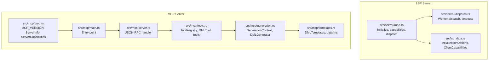
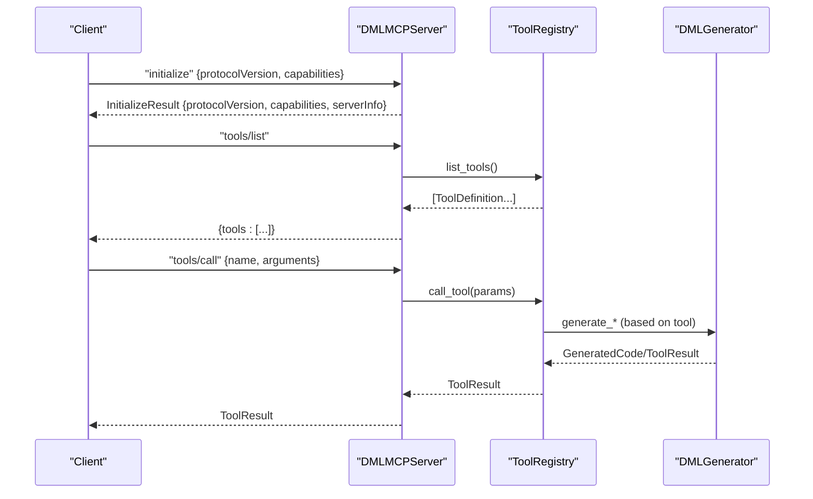
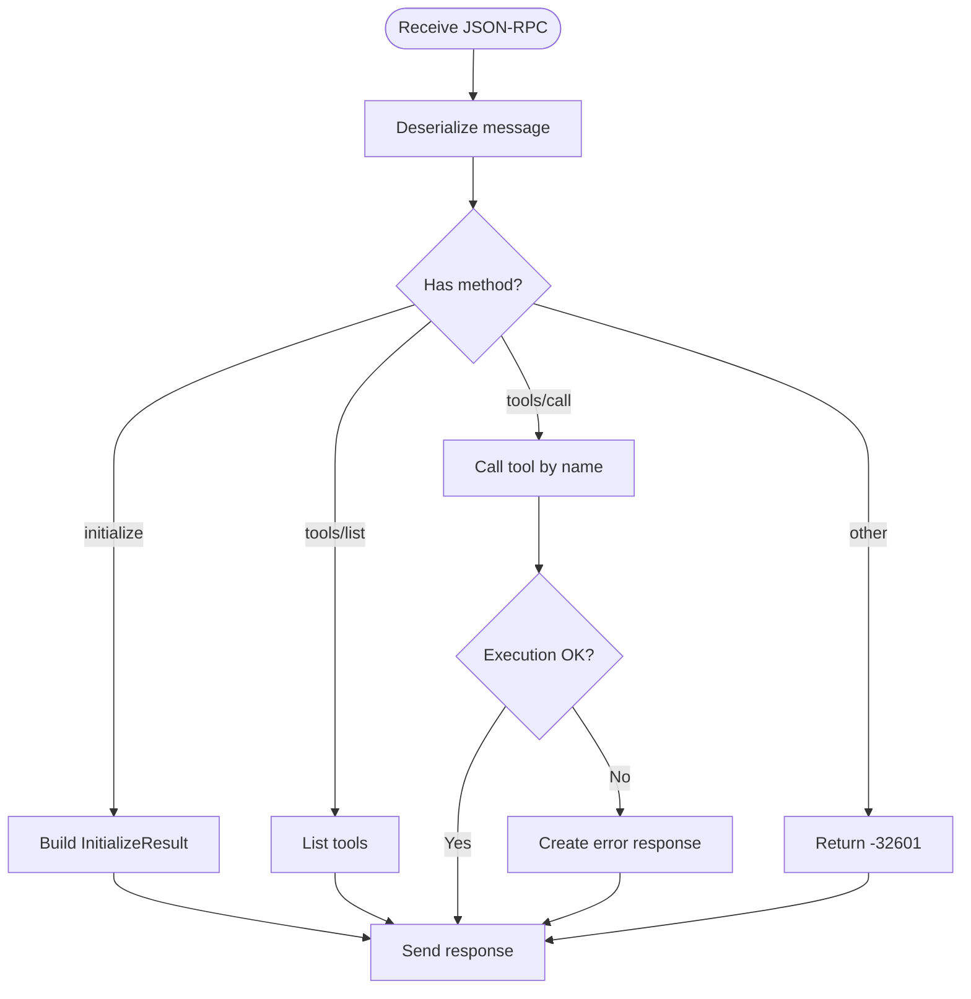
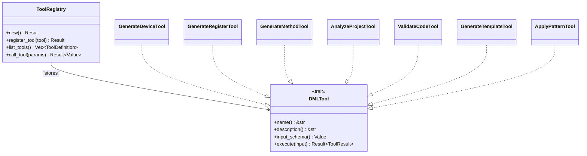
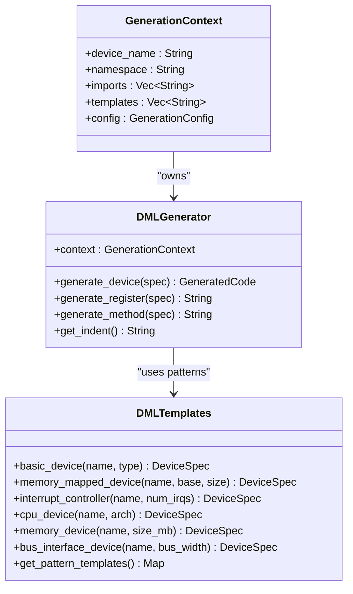
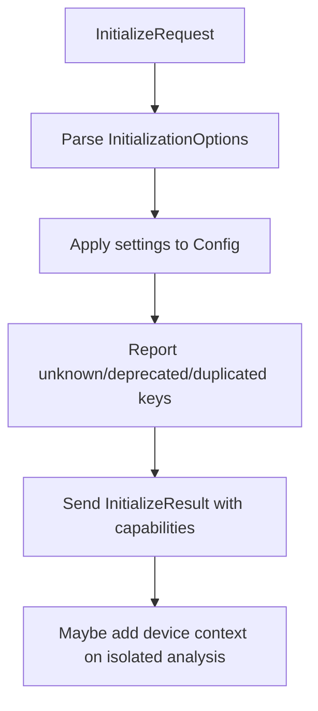
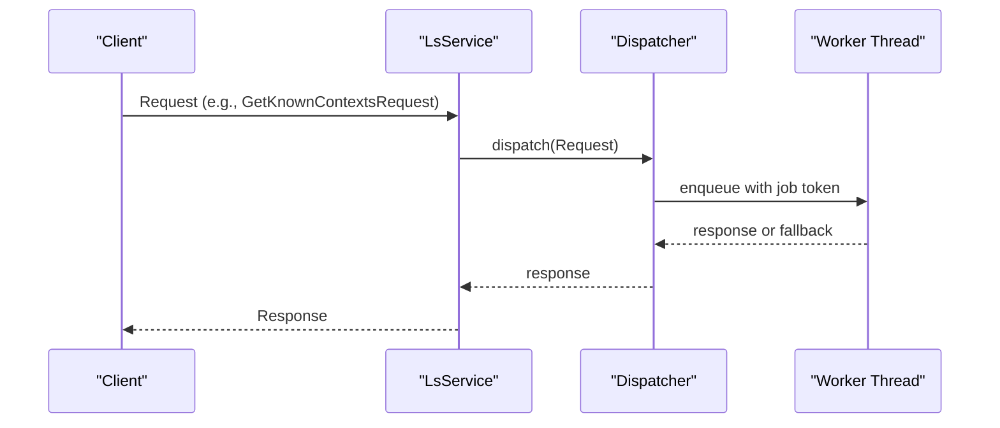
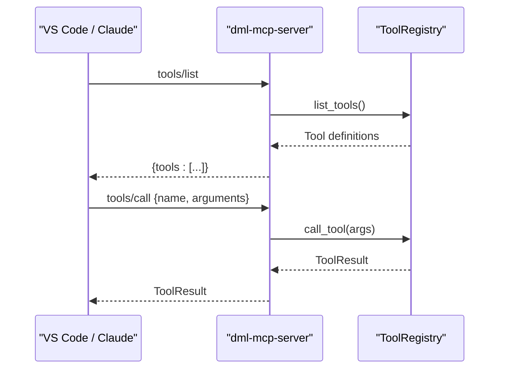
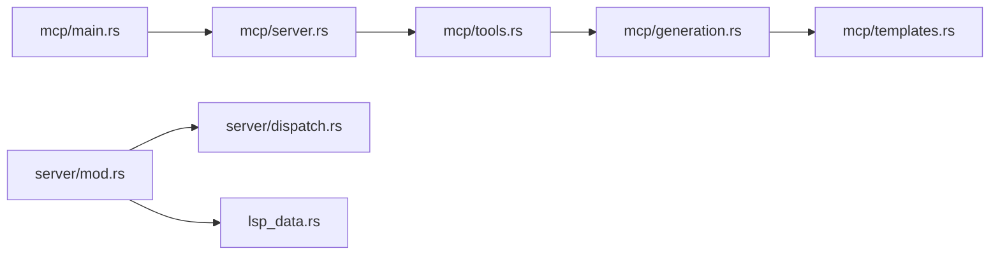

# Custom Protocol Extensions

<cite>
**Referenced Files in This Document**
- [README.md](file://README.md)
- [MCP_SERVER_GUIDE.md](file://MCP_SERVER_GUIDE.md)
- [lib.rs](file://src/lib.rs)
- [main.rs](file://src/main.rs)
- [lsp_data.rs](file://src/lsp_data.rs)
- [server/mod.rs](file://src/server/mod.rs)
- [server/dispatch.rs](file://src/server/dispatch.rs)
- [mcp/mod.rs](file://src/mcp/mod.rs)
- [mcp/main.rs](file://src/mcp/main.rs)
- [mcp/server.rs](file://src/mcp/server.rs)
- [mcp/tools.rs](file://src/mcp/tools.rs)
- [mcp/generation.rs](file://src/mcp/generation.rs)
- [mcp/templates.rs](file://src/mcp/templates.rs)
</cite>

## Table of Contents
1. [Introduction](#introduction)
2. [Project Structure](#project-structure)
3. [Core Components](#core-components)
4. [Architecture Overview](#architecture-overview)
5. [Detailed Component Analysis](#detailed-component-analysis)
6. [Dependency Analysis](#dependency-analysis)
7. [Performance Considerations](#performance-considerations)
8. [Troubleshooting Guide](#troubleshooting-guide)
9. [Conclusion](#conclusion)
10. [Appendices](#appendices)

## Introduction
This document explains the custom protocol extensions and experimental capabilities implemented in the DML Language Server (DLS). It focuses on:
- The Model Context Protocol (MCP) server that extends the DLS with DML code generation tools
- Experimental LSP features, including device context control
- Custom initialization options for the LSP server
- Extended request handlers and diagnostics integration points
- Guidance for versioning, compatibility, and migration of custom extensions

The DLS currently targets DML 1.4 and integrates with MCP for AI-assisted code generation, while maintaining LSP compatibility for IDE integrations.

**Section sources**
- [README.md](file://README.md#L1-L57)

## Project Structure
The repository organizes DLS core logic and MCP extensions as follows:
- LSP server core: initialization, capabilities, dispatch, and actions
- MCP server: JSON-RPC over stdio, tool registry, generation engine, and templates
- Shared LSP data types and initialization options

**Diagram sources**
- [server/mod.rs](file://src/server/mod.rs#L1-L836)
- [server/dispatch.rs](file://src/server/dispatch.rs#L1-L206)
- [lsp_data.rs](file://src/lsp_data.rs#L1-L419)
- [mcp/mod.rs](file://src/mcp/mod.rs#L1-L54)
- [mcp/main.rs](file://src/mcp/main.rs#L1-L23)
- [mcp/server.rs](file://src/mcp/server.rs#L1-L229)
- [mcp/tools.rs](file://src/mcp/tools.rs#L1-L399)
- [mcp/generation.rs](file://src/mcp/generation.rs#L1-L411)
- [mcp/templates.rs](file://src/mcp/templates.rs#L1-L428)

**Section sources**
- [lib.rs](file://src/lib.rs#L1-L54)
- [main.rs](file://src/main.rs#L1-L60)
- [server/mod.rs](file://src/server/mod.rs#L1-L836)
- [mcp/mod.rs](file://src/mcp/mod.rs#L1-L54)

## Core Components
- MCP server entry and runtime
  - Binary entry point initializes logging and runs the MCP server
  - Implements JSON-RPC over stdio with initialize, tools/list, and tools/call
- Tool registry and DML tools
  - Registers built-in tools and validates tool invocation
  - Provides JSON schemas for tool inputs
- Generation engine and templates
  - Generates DML device, register, method, and bank structures
  - Supports configurable formatting and optional validation hooks
- LSP experimental features and initialization options
  - Exposes experimental capabilities for device context control
  - Accepts initialization options for configuration and startup behavior

**Section sources**
- [mcp/main.rs](file://src/mcp/main.rs#L1-L23)
- [mcp/server.rs](file://src/mcp/server.rs#L1-L229)
- [mcp/tools.rs](file://src/mcp/tools.rs#L1-L399)
- [mcp/generation.rs](file://src/mcp/generation.rs#L1-L411)
- [mcp/templates.rs](file://src/mcp/templates.rs#L1-L428)
- [server/mod.rs](file://src/server/mod.rs#L665-L729)
- [lsp_data.rs](file://src/lsp_data.rs#L282-L354)

## Architecture Overview
The MCP server augments the LSP server by adding a dedicated JSON-RPC protocol over stdio. The LSP server handles IDE interactions, while the MCP server exposes DML code generation tools.

**Diagram sources**
- [mcp/server.rs](file://src/mcp/server.rs#L104-L206)
- [mcp/tools.rs](file://src/mcp/tools.rs#L90-L121)
- [mcp/generation.rs](file://src/mcp/generation.rs#L66-L111)

## Detailed Component Analysis

### MCP Server and Protocol
- JSON-RPC message envelope supports id, method, params, result, and error
- Methods:
  - initialize: returns protocol version, server capabilities, and server info
  - tools/list: lists registered tools with descriptions and input schemas
  - tools/call: executes a named tool with validated arguments
- Error handling uses standardized JSON-RPC error codes

**Diagram sources**
- [mcp/server.rs](file://src/mcp/server.rs#L104-L229)

**Section sources**
- [mcp/server.rs](file://src/mcp/server.rs#L1-L229)
- [mcp/mod.rs](file://src/mcp/mod.rs#L17-L54)

### Tool Registry and DML Tools
- ToolRegistry manages a HashMap of DMLTool implementations
- Built-in tools include device generation, register generation, method generation, project analysis, code validation, template generation, and pattern application
- Each tool defines a JSON Schema for input validation and returns ToolResult with content array

**Diagram sources**
- [mcp/tools.rs](file://src/mcp/tools.rs#L46-L121)
- [mcp/tools.rs](file://src/mcp/tools.rs#L125-L325)

**Section sources**
- [mcp/tools.rs](file://src/mcp/tools.rs#L1-L399)

### Generation Engine and Templates
- GenerationContext carries device metadata, imports, templates, and GenerationConfig
- DMLGenerator builds DML code from DeviceSpec, BankSpec, RegisterSpec, FieldSpec, MethodSpec, and InterfaceSpec
- DMLTemplates provides predefined device patterns (memory-mapped, interrupt controller, CPU, memory, bus interface) and common snippets

**Diagram sources**
- [mcp/generation.rs](file://src/mcp/generation.rs#L8-L111)
- [mcp/generation.rs](file://src/mcp/generation.rs#L355-L411)
- [mcp/templates.rs](file://src/mcp/templates.rs#L11-L359)

**Section sources**
- [mcp/generation.rs](file://src/mcp/generation.rs#L1-L411)
- [mcp/templates.rs](file://src/mcp/templates.rs#L1-L428)

### LSP Experimental Features and Initialization Options
- Experimental features flag enables device context control capability
- InitializationOptions supports:
  - omit_init_analyse: defer initial analysis
  - cmd_run: CLI mode toggle
  - settings: upfront configuration payload nested under dml
- ClientCapabilities wraps lsp_types::ClientCapabilities and exposes convenience checks

**Diagram sources**
- [server/mod.rs](file://src/server/mod.rs#L207-L289)
- [lsp_data.rs](file://src/lsp_data.rs#L282-L354)

**Section sources**
- [server/mod.rs](file://src/server/mod.rs#L665-L729)
- [lsp_data.rs](file://src/lsp_data.rs#L282-L354)

### Extended Request Handlers and Diagnostics Integration
- The LSP server dispatches requests to worker threads with timeouts
- Known extended handlers include:
  - GetKnownContextsRequest: retrieves device contexts
  - Additional requests are routed via the dispatcher
- Diagnostics and error reporting are integrated during analysis and lint phases

**Diagram sources**
- [server/dispatch.rs](file://src/server/dispatch.rs#L109-L147)
- [server/mod.rs](file://src/server/mod.rs#L578-L596)

**Section sources**
- [server/dispatch.rs](file://src/server/dispatch.rs#L1-L206)
- [server/mod.rs](file://src/server/mod.rs#L578-L596)

### MCP Integration Examples and Client Handling
- MCP server supports:
  - initialize with MCP_VERSION
  - tools/list and tools/call
- Clients can integrate via stdin/stdout or external MCP servers
- Example configurations show how to wire MCP servers in popular tools

**Diagram sources**
- [MCP_SERVER_GUIDE.md](file://MCP_SERVER_GUIDE.md#L146-L170)
- [mcp/server.rs](file://src/mcp/server.rs#L154-L206)

**Section sources**
- [MCP_SERVER_GUIDE.md](file://MCP_SERVER_GUIDE.md#L1-L280)
- [mcp/server.rs](file://src/mcp/server.rs#L1-L229)

## Dependency Analysis
- MCP server depends on:
  - ToolRegistry for tool lifecycle
  - DMLGenerator for code synthesis
  - DMLTemplates for patterns
- LSP server depends on:
  - Dispatcher for non-blocking request handling
  - InitializationOptions and ClientCapabilities for configuration
  - Experimental features for device context control

**Diagram sources**
- [mcp/main.rs](file://src/mcp/main.rs#L1-L23)
- [mcp/server.rs](file://src/mcp/server.rs#L1-L229)
- [mcp/tools.rs](file://src/mcp/tools.rs#L1-L399)
- [mcp/generation.rs](file://src/mcp/generation.rs#L1-L411)
- [mcp/templates.rs](file://src/mcp/templates.rs#L1-L428)
- [server/mod.rs](file://src/server/mod.rs#L1-L836)
- [server/dispatch.rs](file://src/server/dispatch.rs#L1-L206)
- [lsp_data.rs](file://src/lsp_data.rs#L1-L419)

**Section sources**
- [mcp/main.rs](file://src/mcp/main.rs#L1-L23)
- [server/mod.rs](file://src/server/mod.rs#L1-L836)

## Performance Considerations
- MCP server uses async/await with Tokio for efficient IO over stdio
- Tool execution is validated against JSON schemas to reduce runtime errors
- LSP server employs a worker-pool dispatcher with timeouts to prevent backlog
- Generation engine supports configurable formatting and optional validation hooks

[No sources needed since this section provides general guidance]

## Troubleshooting Guide
- MCP protocol compliance
  - Ensure protocolVersion matches MCP_VERSION
  - Verify tools/list returns expected tool definitions
- Tool invocation failures
  - Confirm tool name exists in registry
  - Validate arguments against tool input schemas
- LSP initialization warnings
  - Unknown, duplicated, or deprecated configuration keys are reported via notifications
- Server readiness
  - LSP requires initialize before handling most requests; otherwise returns a not-initialized error

**Section sources**
- [mcp/server.rs](file://src/mcp/server.rs#L104-L229)
- [mcp/tools.rs](file://src/mcp/tools.rs#L101-L121)
- [server/mod.rs](file://src/server/mod.rs#L207-L289)
- [lsp_data.rs](file://src/lsp_data.rs#L109-L205)

## Conclusion
The DML Language Server extends its core LSP capabilities with:
- A robust MCP server for DML code generation
- Experimental device context control via LSP experimental features
- Flexible initialization options and configuration
- A modular tool registry, generation engine, and template library

These extensions provide a foundation for AI-assisted development and IDE integrations while preserving LSP compatibility and maintainable architecture.

[No sources needed since this section summarizes without analyzing specific files]

## Appendices

### Versioning Strategies for Custom Extensions
- MCP protocol versioning
  - MCP_VERSION is defined centrally; clients must negotiate protocolVersion during initialize
- LSP experimental features
  - ExperimentalFeatures is serialized into server capabilities; clients can probe for context_control
- Migration paths
  - Backward-compatible additions to tools/input schemas
  - Deprecation notices for initialization options surfaced via notifications
  - Gradual rollout of new tools and templates without breaking existing clients

**Section sources**
- [mcp/mod.rs](file://src/mcp/mod.rs#L17-L54)
- [server/mod.rs](file://src/server/mod.rs#L665-L675)
- [lsp_data.rs](file://src/lsp_data.rs#L294-L311)

### Compatibility Maintenance
- MCP server adheres to MCP 2024-11-05 and JSON-RPC 2.0
- LSP server maintains compatibility with standard LSP requests and capabilities
- InitializationOptions parsing reports unknown/deprecated/duplicated keys to aid migration

**Section sources**
- [MCP_SERVER_GUIDE.md](file://MCP_SERVER_GUIDE.md#L211-L216)
- [lsp_data.rs](file://src/lsp_data.rs#L240-L276)