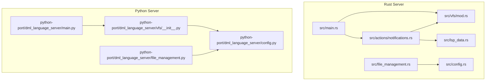
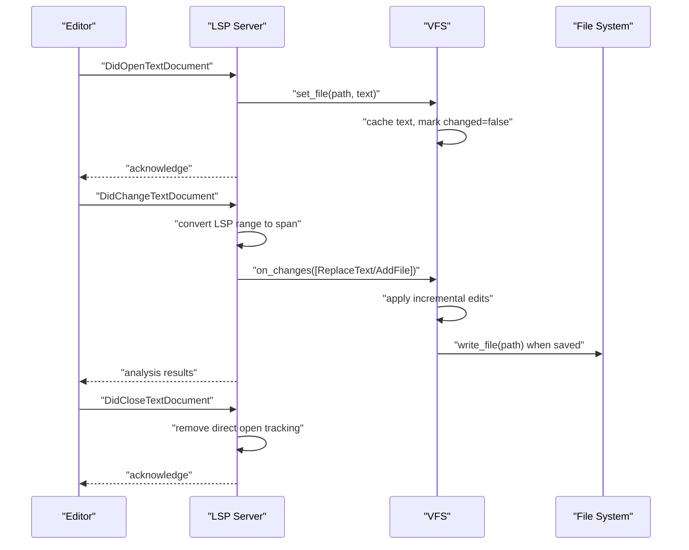
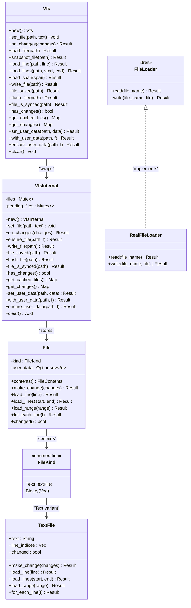
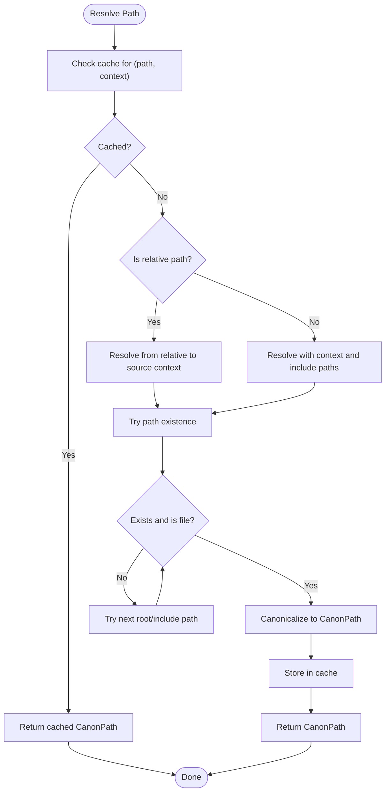
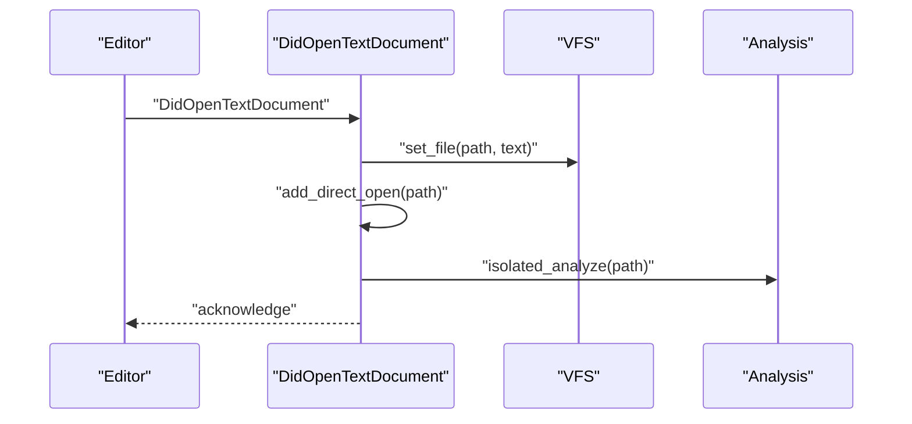
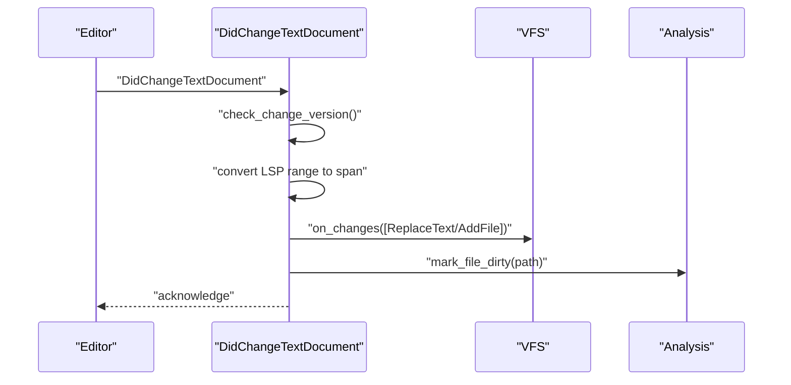
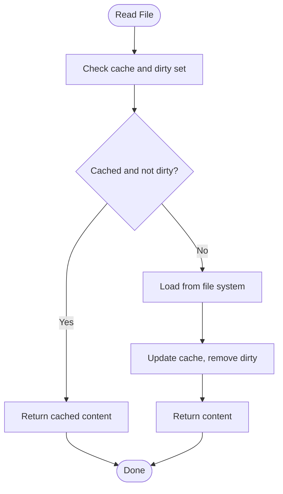
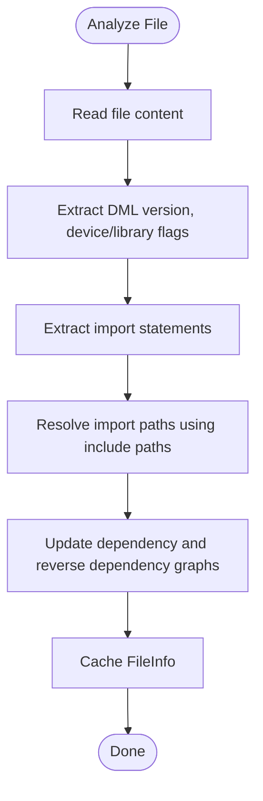
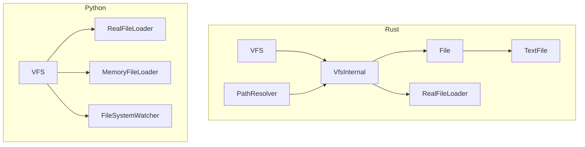

# File Management and Virtual File System Integration

<cite>
**Referenced Files in This Document**
- [file_management.rs](file://src/file_management.rs)
- [vfs/mod.rs](file://src/vfs/mod.rs)
- [vfs/test.rs](file://src/vfs/test.rs)
- [lsp_data.rs](file://src/lsp_data.rs)
- [actions/notifications.rs](file://src/actions/notifications.rs)
- [config.rs](file://src/config.rs)
- [main.rs](file://src/main.rs)
- [file_management.py](file://python-port/dml_language_server/file_management.py)
- [vfs/__init__.py](file://python-port/dml_language_server/vfs/__init__.py)
- [config.py](file://python-port/dml_language_server/config.py)
- [main.py](file://python-port/dml_language_server/main.py)
</cite>

## Table of Contents
1. [Introduction](#introduction)
2. [Project Structure](#project-structure)
3. [Core Components](#core-components)
4. [Architecture Overview](#architecture-overview)
5. [Detailed Component Analysis](#detailed-component-analysis)
6. [Dependency Analysis](#dependency-analysis)
7. [Performance Considerations](#performance-considerations)
8. [Troubleshooting Guide](#troubleshooting-guide)
9. [Conclusion](#conclusion)
10. [Appendices](#appendices)

## Introduction
This document explains the file management and Virtual File System (VFS) integration within the Language Server Protocol (LSP) implementation. It covers the virtual file system architecture, file caching strategies, and change tracking mechanisms. It also documents file open/close operations, content synchronization, incremental updates, and workspace file management. The integration between LSP file operations and the underlying VFS layer is explained, including file resolution, path handling, and cross-referencing. Practical examples, performance optimization techniques, and troubleshooting guidance for distributed development environments are included.

## Project Structure
The project implements both a Rust-based server and a Python-based server. The Rust server focuses on the VFS and LSP integration, while the Python server provides a complementary VFS implementation and file watcher.

**Diagram sources**
- [main.rs](file://src/main.rs#L56-L58)
- [vfs/mod.rs](file://src/vfs/mod.rs#L180-L288)
- [actions/notifications.rs](file://src/actions/notifications.rs#L75-L106)
- [lsp_data.rs](file://src/lsp_data.rs#L47-L107)
- [file_management.rs](file://src/file_management.rs#L30-L64)
- [main.py](file://python-port/dml_language_server/main.py#L82-L83)
- [vfs/__init__.py](file://python-port/dml_language_server/vfs/__init__.py#L123-L133)
- [file_management.py](file://python-port/dml_language_server/file_management.py#L33-L41)
- [config.py](file://python-port/dml_language_server/config.py#L89-L129)

**Section sources**
- [main.rs](file://src/main.rs#L56-L58)
- [main.py](file://python-port/dml_language_server/main.py#L82-L83)

## Core Components
- Rust VFS: A thread-safe in-memory file cache with change tracking, line indexing, and user data storage. It supports incremental edits, file snapshots, and persistence to disk.
- Rust PathResolver: Canonicalizes and resolves file paths against include directories and workspace roots.
- Rust LSP integration: Handlers for DidOpenTextDocument, DidCloseTextDocument, and DidChangeTextDocument that synchronize editor content with the VFS.
- Python VFS: Async file loader with caching, dirty tracking, and file system change monitoring via watchdog.
- Python file manager: Discovers DML files, categorizes them, extracts imports, and resolves include paths.
- Configuration: Centralized configuration for include paths, linting, and analysis behavior.

**Section sources**
- [vfs/mod.rs](file://src/vfs/mod.rs#L180-L288)
- [file_management.rs](file://src/file_management.rs#L55-L64)
- [actions/notifications.rs](file://src/actions/notifications.rs#L75-L106)
- [vfs/__init__.py](file://python-port/dml_language_server/vfs/__init__.py#L123-L133)
- [file_management.py](file://python-port/dml_language_server/file_management.py#L33-L41)
- [config.py](file://python-port/dml_language_server/config.py#L89-L129)

## Architecture Overview
The LSP server integrates VFS operations with editor notifications. Rust-side handlers convert LSP ranges to internal spans, apply incremental changes to the VFS, and trigger analysis. The Python-side VFS provides asynchronous file loading and change monitoring.

**Diagram sources**
- [actions/notifications.rs](file://src/actions/notifications.rs#L75-L106)
- [actions/notifications.rs](file://src/actions/notifications.rs#L108-L163)
- [vfs/mod.rs](file://src/vfs/mod.rs#L221-L231)
- [vfs/mod.rs](file://src/vfs/mod.rs#L202-L205)
- [vfs/mod.rs](file://src/vfs/mod.rs#L514-L530)

## Detailed Component Analysis

### Rust VFS: Architecture and Operations
The VFS maintains an in-memory cache of files, tracks changes, and supports efficient line-based access. It distinguishes between text and binary files, supports user data per file, and coordinates concurrent access with pending file locks.

Key capabilities:
- Incremental edits: AddFile and ReplaceText changes applied to cached text.
- Line indexing: Precomputed indices for fast line and range access.
- Change tracking: Per-file “changed” flag and “has_changes” aggregation.
- Persistence: write_file writes cached content to disk via a file loader.
- Concurrency: Pending file queues coordinate readers/writers to avoid race conditions.

**Diagram sources**
- [vfs/mod.rs](file://src/vfs/mod.rs#L180-L288)
- [vfs/mod.rs](file://src/vfs/mod.rs#L293-L602)
- [vfs/mod.rs](file://src/vfs/mod.rs#L625-L729)
- [vfs/mod.rs](file://src/vfs/mod.rs#L847-L845)
- [vfs/mod.rs](file://src/vfs/mod.rs#L895-L952)

**Section sources**
- [vfs/mod.rs](file://src/vfs/mod.rs#L180-L288)
- [vfs/mod.rs](file://src/vfs/mod.rs#L293-L602)
- [vfs/mod.rs](file://src/vfs/mod.rs#L625-L729)
- [vfs/mod.rs](file://src/vfs/mod.rs#L847-L845)
- [vfs/mod.rs](file://src/vfs/mod.rs#L895-L952)

### Rust Path Resolution and Include Paths
The PathResolver resolves relative paths to absolute paths using include directories and workspace roots. It caches resolution results and supports context-aware resolution.

Key features:
- Roots: Workspace roots and include directories.
- Caching: Memoized resolution results keyed by path and optional context.
- Priority: include_paths -> workspace_folders -> root -> extra_path.

**Diagram sources**
- [file_management.rs](file://src/file_management.rs#L104-L148)
- [file_management.rs](file://src/file_management.rs#L150-L206)

**Section sources**
- [file_management.rs](file://src/file_management.rs#L55-L64)
- [file_management.rs](file://src/file_management.rs#L104-L148)
- [file_management.rs](file://src/file_management.rs#L150-L206)

### LSP File Operations and VFS Integration
The server handles DidOpenTextDocument, DidCloseTextDocument, and DidChangeTextDocument. It converts LSP ranges to internal spans, applies incremental edits, and triggers analysis.

- DidOpenTextDocument: Sets initial file content in VFS and marks as directly opened.
- DidCloseTextDocument: Removes direct open tracking.
- DidChangeTextDocument: Validates version ordering, converts LSP ranges to spans, applies ReplaceText/AddFile changes, and marks file dirty.

**Diagram sources**
- [actions/notifications.rs](file://src/actions/notifications.rs#L75-L91)

**Diagram sources**
- [actions/notifications.rs](file://src/actions/notifications.rs#L108-L163)

**Section sources**
- [actions/notifications.rs](file://src/actions/notifications.rs#L75-L106)
- [actions/notifications.rs](file://src/actions/notifications.rs#L108-L163)
- [lsp_data.rs](file://src/lsp_data.rs#L134-L186)

### Python VFS: Async File Loader and Watcher
The Python VFS provides asynchronous file loading, caching, and change monitoring. It supports two loaders: RealFileLoader (disk) and MemoryFileLoader (in-memory). It uses watchdog to monitor file system changes and invalidates cache entries accordingly.

Key features:
- read_file: Returns cached content if available and not dirty; otherwise loads from disk.
- write_file: Stores content in memory cache and marks as dirty.
- save_file: Writes cached content to disk.
- watch_directory: Starts monitoring a directory for DML file changes.
- process_changes: Processes file change events asynchronously.

**Diagram sources**
- [vfs/__init__.py](file://python-port/dml_language_server/vfs/__init__.py#L135-L163)

**Section sources**
- [vfs/__init__.py](file://python-port/dml_language_server/vfs/__init__.py#L123-L133)
- [vfs/__init__.py](file://python-port/dml_language_server/vfs/__init__.py#L135-L163)
- [vfs/__init__.py](file://python-port/dml_language_server/vfs/__init__.py#L178-L197)
- [vfs/__init__.py](file://python-port/dml_language_server/vfs/__init__.py#L240-L269)
- [vfs/__init__.py](file://python-port/dml_language_server/vfs/__init__.py#L280-L304)

### Python File Manager: Discovery, Categorization, and Dependencies
The Python file manager discovers DML files, extracts metadata (device/library classification, imports), and resolves include paths. It maintains dependency graphs and supports invalidation.

Key operations:
- discover_dml_files: Recursively finds DML files.
- get_file_info: Analyzes file content to extract metadata and imports.
- _resolve_import_path: Resolves import names to absolute paths using include paths.
- get_dependencies/get_dependents: Retrieves direct and transitive dependencies.
- invalidate_file: Clears caches and returns affected files.

**Diagram sources**
- [file_management.py](file://python-port/dml_language_server/file_management.py#L100-L137)
- [file_management.py](file://python-port/dml_language_server/file_management.py#L163-L188)

**Section sources**
- [file_management.py](file://python-port/dml_language_server/file_management.py#L42-L74)
- [file_management.py](file://python-port/dml_language_server/file_management.py#L100-L137)
- [file_management.py](file://python-port/dml_language_server/file_management.py#L163-L188)
- [file_management.py](file://python-port/dml_language_server/file_management.py#L216-L241)
- [file_management.py](file://python-port/dml_language_server/file_management.py#L305-L334)

### Configuration and Include Paths
Configuration controls include paths, linting, and analysis behavior. The Python Config class loads compile commands and lint configurations, and exposes helper methods to resolve include paths and flags for a given file.

Key responsibilities:
- load_compile_commands: Loads device-specific include paths and flags.
- get_include_paths_for_file: Returns include paths for a file, considering device context.
- get_dmlc_flags_for_file: Returns compiler flags for a file.
- Initialization options: Log level, linting enablement, and diagnostic limits.

**Section sources**
- [config.py](file://python-port/dml_language_server/config.py#L131-L201)
- [config.py](file://python-port/dml_language_server/config.py#L202-L224)
- [config.py](file://python-port/dml_language_server/config.py#L116-L129)

## Dependency Analysis
The Rust VFS depends on internal file loaders and maintains thread-safe access to cached files. The Python VFS depends on async file operations and watchdog for change detection. Both integrate with LSP handlers to synchronize editor content.

**Diagram sources**
- [vfs/mod.rs](file://src/vfs/mod.rs#L180-L288)
- [vfs/mod.rs](file://src/vfs/mod.rs#L293-L602)
- [vfs/mod.rs](file://src/vfs/mod.rs#L625-L729)
- [vfs/mod.rs](file://src/vfs/mod.rs#L900-L952)
- [vfs/__init__.py](file://python-port/dml_language_server/vfs/__init__.py#L123-L133)
- [vfs/__init__.py](file://python-port/dml_language_server/vfs/__init__.py#L92-L121)
- [vfs/__init__.py](file://python-port/dml_language_server/vfs/__init__.py#L50-L90)

**Section sources**
- [vfs/mod.rs](file://src/vfs/mod.rs#L180-L288)
- [vfs/mod.rs](file://src/vfs/mod.rs#L293-L602)
- [vfs/__init__.py](file://python-port/dml_language_server/vfs/__init__.py#L123-L133)
- [vfs/__init__.py](file://python-port/dml_language_server/vfs/__init__.py#L92-L121)

## Performance Considerations
- Incremental edits: Prefer ReplaceText over full reloads to minimize overhead.
- Line indexing: Precomputed line indices enable O(1) line access and efficient range operations.
- Concurrency: Pending file queues prevent race conditions and reduce contention.
- Caching: Use VFS get_cached_files and get_changes to batch operations and avoid repeated disk I/O.
- Async I/O: Python VFS uses async file operations and watchdog to avoid blocking the event loop.
- Include path resolution: Cache resolution results to avoid repeated filesystem checks.
- Dirty tracking: Separate dirty sets allow targeted saves and reduce unnecessary writes.

[No sources needed since this section provides general guidance]

## Troubleshooting Guide
Common issues and resolutions:
- Out-of-sync files: Use file_is_synced to detect unsaved changes; call write_file to persist.
- Bad locations: Verify LSP range conversion and UTF-16 vs UTF-8 offsets; use VfsSpan helpers.
- Circular dependencies: Detect and handle cycles when computing transitive dependencies.
- File not cached: Ensure ensure_file is called before accessing cached content.
- Change ordering: Validate version ordering to avoid applying edits out of order.
- Watcher errors: Restart watchers if file system events fail; ensure DML file filtering.

**Section sources**
- [vfs/mod.rs](file://src/vfs/mod.rs#L110-L128)
- [vfs/mod.rs](file://src/vfs/mod.rs#L346-L352)
- [vfs/mod.rs](file://src/vfs/mod.rs#L468-L512)
- [actions/notifications.rs](file://src/actions/notifications.rs#L125-L135)
- [vfs/__init__.py](file://python-port/dml_language_server/vfs/__init__.py#L280-L304)

## Conclusion
The LSP implementation integrates a robust VFS with incremental file operations, change tracking, and path resolution. The Rust server emphasizes thread safety and efficient text editing, while the Python server complements with async file loading and change monitoring. Together, they provide a scalable foundation for file management in distributed development environments.

[No sources needed since this section summarizes without analyzing specific files]

## Appendices

### Example Workflows

- Open a file:
  - Editor sends DidOpenTextDocument.
  - Server calls VFS.set_file and marks as directly opened.
  - Analysis is triggered if configured.

- Edit a file incrementally:
  - Editor sends DidChangeTextDocument with content changes.
  - Server validates version ordering, converts ranges, and applies ReplaceText/AddFile.
  - VFS updates cached content and marks file as changed.

- Close a file:
  - Editor sends DidCloseTextDocument.
  - Server removes direct open tracking.

- Save a file:
  - Server calls write_file to persist cached content to disk.

**Section sources**
- [actions/notifications.rs](file://src/actions/notifications.rs#L75-L106)
- [actions/notifications.rs](file://src/actions/notifications.rs#L108-L163)
- [vfs/mod.rs](file://src/vfs/mod.rs#L221-L231)
- [vfs/mod.rs](file://src/vfs/mod.rs#L514-L530)