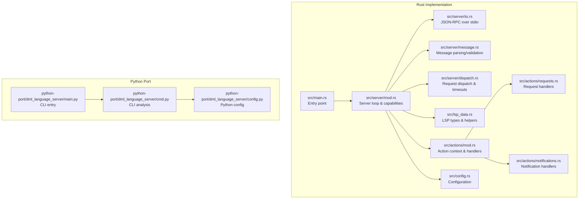
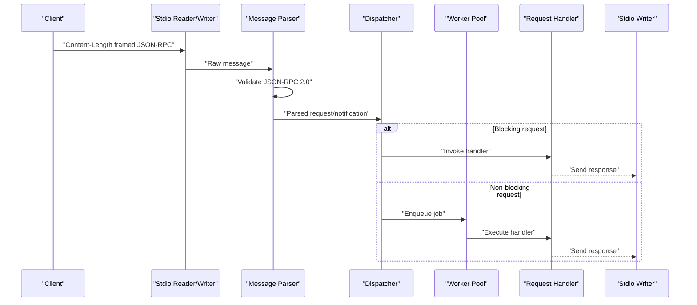
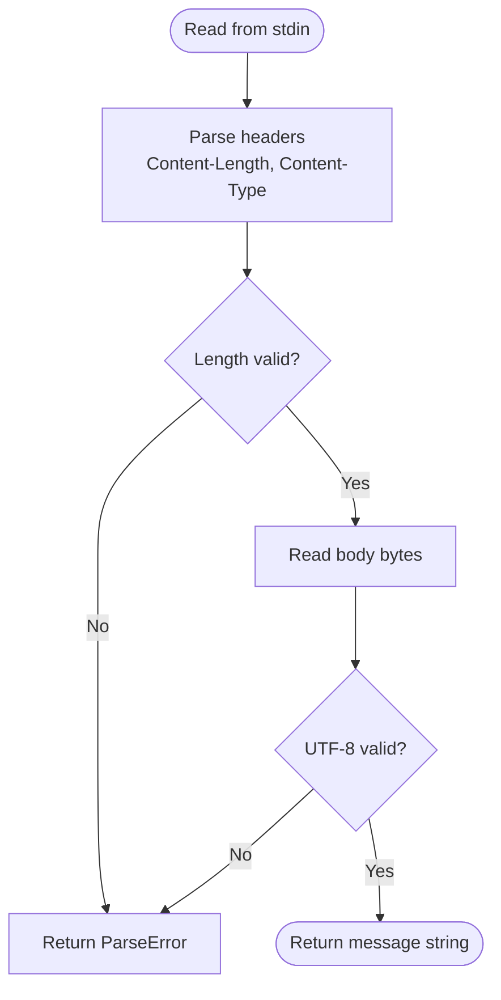
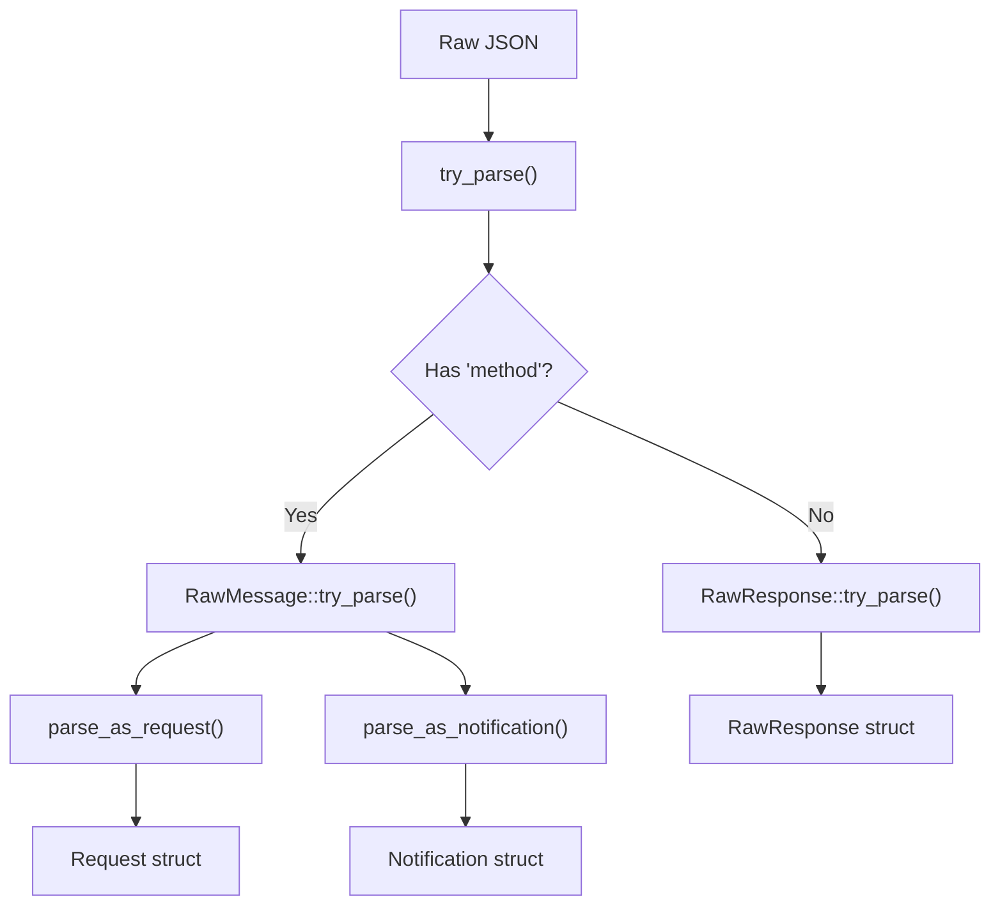
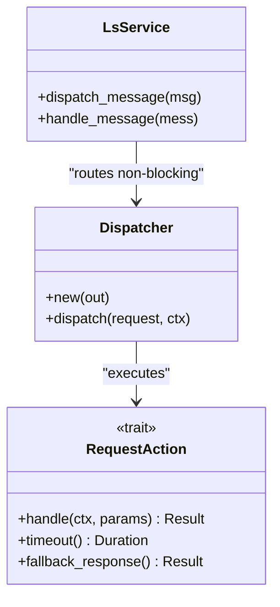
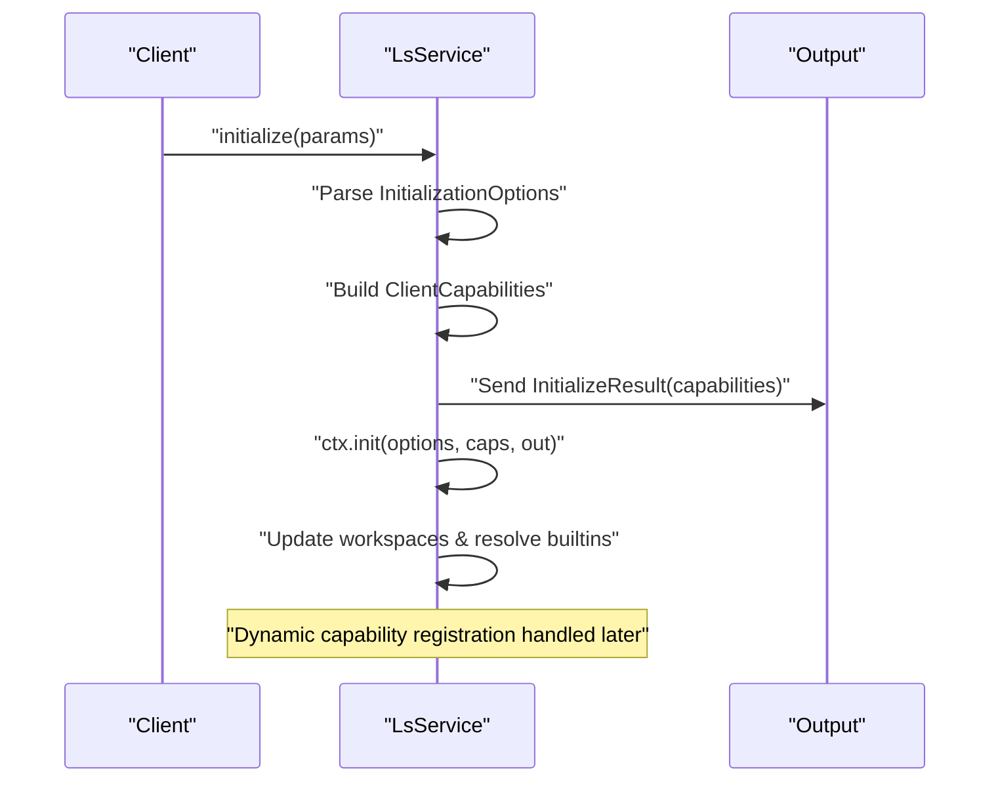
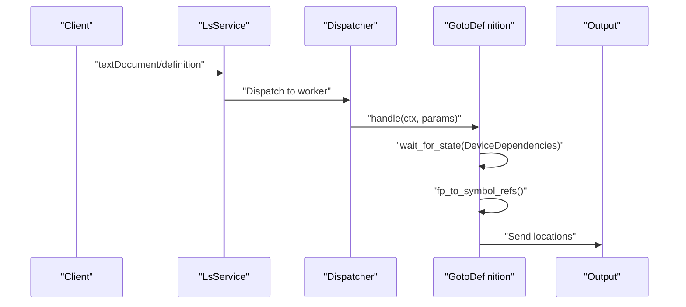
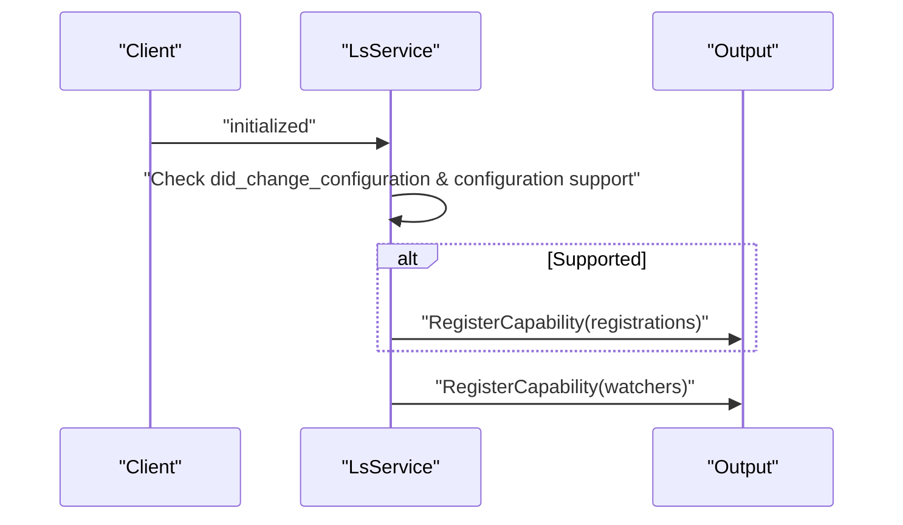
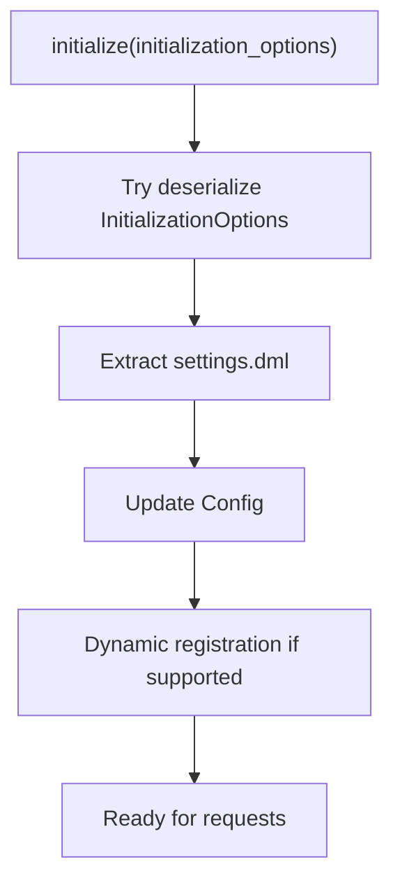
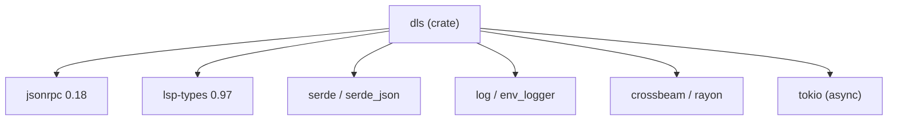

# Language Server Protocol Implementation

<cite>
**Referenced Files in This Document**
- [Cargo.toml](file://Cargo.toml)
- [README.md](file://README.md)
- [src/lib.rs](file://src/lib.rs)
- [src/main.rs](file://src/main.rs)
- [src/server/mod.rs](file://src/server/mod.rs)
- [src/server/dispatch.rs](file://src/server/dispatch.rs)
- [src/server/io.rs](file://src/server/io.rs)
- [src/server/message.rs](file://src/server/message.rs)
- [src/lsp_data.rs](file://src/lsp_data.rs)
- [src/actions/mod.rs](file://src/actions/mod.rs)
- [src/actions/requests.rs](file://src/actions/requests.rs)
- [src/actions/notifications.rs](file://src/actions/notifications.rs)
- [src/config.rs](file://src/config.rs)
- [python-port/dml_language_server/__init__.py](file://python-port/dml_language_server/__init__.py)
- [python-port/dml_language_server/main.py](file://python-port/dml_language_server/main.py)
- [python-port/dml_language_server/cmd.py](file://python-port/dml_language_server/cmd.py)
- [python-port/dml_language_server/config.py](file://python-port/dml_language_server/config.py)
</cite>

## Table of Contents
1. [Introduction](#introduction)
2. [Project Structure](#project-structure)
3. [Core Components](#core-components)
4. [Architecture Overview](#architecture-overview)
5. [Detailed Component Analysis](#detailed-component-analysis)
6. [Dependency Analysis](#dependency-analysis)
7. [Performance Considerations](#performance-considerations)
8. [Troubleshooting Guide](#troubleshooting-guide)
9. [Conclusion](#conclusion)
10. [Appendices](#appendices)

## Introduction
This document provides comprehensive documentation for the Language Server Protocol (LSP) implementation powering the DML Language Server (DLS). It covers LSP 3.x specification compliance, request/response handling, client capability negotiation, JSON-RPC over stdio communication, message parsing/validation, and the dispatch system. It also documents supported LSP features such as textDocument/definition, textDocument/references, textDocument/hover, and workspace/symbol requests, alongside custom protocol extensions for DML analysis, initialization options, and dynamic capability registration. Practical examples, error handling strategies, performance optimization techniques, and client implementation guidelines are included for IDE developers and debugging assistance.

## Project Structure
The DLS is implemented primarily in Rust with a Python port for development and CLI usage. The Rust implementation provides the production LSP server, while the Python port demonstrates CLI usage and configuration handling.

**Diagram sources**
- [src/main.rs](file://src/main.rs#L1-L60)
- [src/server/mod.rs](file://src/server/mod.rs#L1-L120)
- [src/server/io.rs](file://src/server/io.rs#L1-L120)
- [src/server/message.rs](file://src/server/message.rs#L1-L120)
- [src/server/dispatch.rs](file://src/server/dispatch.rs#L1-L80)
- [src/lsp_data.rs](file://src/lsp_data.rs#L1-L120)
- [src/actions/mod.rs](file://src/actions/mod.rs#L1-L120)
- [src/actions/requests.rs](file://src/actions/requests.rs#L1-L120)
- [src/actions/notifications.rs](file://src/actions/notifications.rs#L1-L120)
- [src/config.rs](file://src/config.rs#L1-L120)
- [python-port/dml_language_server/main.py](file://python-port/dml_language_server/main.py#L1-L106)
- [python-port/dml_language_server/cmd.py](file://python-port/dml_language_server/cmd.py#L1-L162)
- [python-port/dml_language_server/config.py](file://python-port/dml_language_server/config.py#L1-L120)

**Section sources**
- [src/lib.rs](file://src/lib.rs#L1-L54)
- [src/main.rs](file://src/main.rs#L1-L60)
- [README.md](file://README.md#L1-L57)

## Core Components
- Server Loop and Capabilities: Initializes the server, parses initialization options, negotiates client capabilities, and advertises server capabilities.
- JSON-RPC over stdio: Implements Content-Length framing, UTF-8 validation, and response formatting.
- Message Parsing and Validation: Validates JSON-RPC 2.0 requests/responses, handles missing parameters, and converts to typed structures.
- Dispatch System: Routes requests to appropriate handlers, manages timeouts, and executes work on a worker pool.
- Action Context: Manages persistent state across requests, including analysis storage, configuration, and device contexts.
- Request Handlers: Implements core LSP requests including goto-definition, references, hover, document/workspace symbols.
- Notification Handlers: Processes file change events, configuration updates, and dynamic capability registration.
- Configuration: Supports initialization options, runtime configuration updates, and linting settings.

**Section sources**
- [src/server/mod.rs](file://src/server/mod.rs#L67-L120)
- [src/server/io.rs](file://src/server/io.rs#L1-L120)
- [src/server/message.rs](file://src/server/message.rs#L1-L120)
- [src/server/dispatch.rs](file://src/server/dispatch.rs#L1-L80)
- [src/actions/mod.rs](file://src/actions/mod.rs#L70-L150)
- [src/actions/requests.rs](file://src/actions/requests.rs#L400-L480)
- [src/actions/notifications.rs](file://src/actions/notifications.rs#L29-L120)
- [src/config.rs](file://src/config.rs#L120-L225)

## Architecture Overview
The DLS follows a layered architecture:
- Transport Layer: stdio with JSON-RPC 2.0 framing.
- Message Layer: Parsing and validation of requests, notifications, and responses.
- Dispatch Layer: Routing to blocking vs non-blocking handlers and worker pool execution.
- Action Layer: Persistent context and request-specific logic.
- Capability Layer: Dynamic registration of client capabilities and workspace folder support.

**Diagram sources**
- [src/server/io.rs](file://src/server/io.rs#L46-L110)
- [src/server/message.rs](file://src/server/message.rs#L318-L396)
- [src/server/dispatch.rs](file://src/server/dispatch.rs#L50-L84)
- [src/server/mod.rs](file://src/server/mod.rs#L472-L598)

**Section sources**
- [src/server/mod.rs](file://src/server/mod.rs#L67-L120)
- [src/server/dispatch.rs](file://src/server/dispatch.rs#L109-L147)
- [src/server/message.rs](file://src/server/message.rs#L318-L396)

## Detailed Component Analysis

### JSON-RPC over stdio Communication Model
- Framing: Uses Content-Length and Content-Type headers with UTF-8 validation.
- Serialization: Ensures jsonrpc "2.0" field presence and omits absent optional fields.
- Responses: Formats success responses and standardized error codes.

**Diagram sources**
- [src/server/io.rs](file://src/server/io.rs#L46-L110)

**Section sources**
- [src/server/io.rs](file://src/server/io.rs#L19-L120)
- [src/server/io.rs](file://src/server/io.rs#L204-L220)

### Message Parsing and Validation
- RawMessage parsing validates method, id, and params.
- Request/Notification conversion handles missing params as null internally.
- Response parsing enforces either result or error, not both.

**Diagram sources**
- [src/server/message.rs](file://src/server/message.rs#L366-L396)
- [src/server/message.rs](file://src/server/message.rs#L318-L396)
- [src/server/message.rs](file://src/server/message.rs#L435-L476)

**Section sources**
- [src/server/message.rs](file://src/server/message.rs#L318-L396)
- [src/server/message.rs](file://src/server/message.rs#L435-L476)

### Dispatch System and Request Handling
- Blocking vs Non-blocking: Initialize and Shutdown are blocking; others are dispatched to worker pool.
- Timeout Management: Non-blocking requests timeout after a default duration; handlers can override.
- Worker Pool: Executes handlers asynchronously and returns responses or fallbacks.

**Diagram sources**
- [src/server/dispatch.rs](file://src/server/dispatch.rs#L109-L147)
- [src/server/dispatch.rs](file://src/server/dispatch.rs#L151-L168)
- [src/server/mod.rs](file://src/server/mod.rs#L472-L598)

**Section sources**
- [src/server/dispatch.rs](file://src/server/dispatch.rs#L20-L87)
- [src/server/dispatch.rs](file://src/server/dispatch.rs#L109-L147)
- [src/server/mod.rs](file://src/server/mod.rs#L562-L598)

### Initialization and Capability Negotiation
- Initialization Options: Supports omit_init_analyse, cmd_run, and settings payload.
- Client Capabilities: Extracted from initialize params; used to decide dynamic registration.
- Server Capabilities: Declares textDocument sync, hover, definition, references, document symbols, workspace symbols, and experimental features.

**Diagram sources**
- [src/server/mod.rs](file://src/server/mod.rs#L207-L289)
- [src/lsp_data.rs](file://src/lsp_data.rs#L282-L311)
- [src/lsp_data.rs](file://src/lsp_data.rs#L313-L354)
- [src/server/mod.rs](file://src/server/mod.rs#L677-L729)

**Section sources**
- [src/server/mod.rs](file://src/server/mod.rs#L207-L289)
- [src/lsp_data.rs](file://src/lsp_data.rs#L282-L354)
- [src/server/mod.rs](file://src/server/mod.rs#L677-L729)

### Supported LSP Features

#### textDocument/definition
- Waits for device dependencies to be analyzed, resolves symbol/reference at position, aggregates definitions, and returns locations with potential limitations.

**Diagram sources**
- [src/actions/requests.rs](file://src/actions/requests.rs#L604-L660)
- [src/server/dispatch.rs](file://src/server/dispatch.rs#L50-L84)

**Section sources**
- [src/actions/requests.rs](file://src/actions/requests.rs#L604-L660)

#### textDocument/references
- Resolves symbol/reference at position, collects references across device analyses, and returns unique locations with limitations.

**Section sources**
- [src/actions/requests.rs](file://src/actions/requests.rs#L662-L717)

#### textDocument/hover
- Generates hover tooltips from analysis context and returns structured hover content with range.

**Section sources**
- [src/actions/requests.rs](file://src/actions/requests.rs#L460-L480)

#### workspace/symbol
- Aggregates symbols from all isolated analyses and filters by query string.

**Section sources**
- [src/actions/requests.rs](file://src/actions/requests.rs#L401-L424)

### Custom Protocol Extensions
- Experimental Features: Exposes experimental capabilities object indicating feature availability.
- Dynamic Capability Registration: Registers DidChangeConfiguration and file watchers dynamically based on client capabilities.
- ChangeActiveContexts: Custom notification to update active device contexts for a file or globally.

**Diagram sources**
- [src/server/mod.rs](file://src/server/mod.rs#L665-L675)
- [src/actions/notifications.rs](file://src/actions/notifications.rs#L29-L72)

**Section sources**
- [src/server/mod.rs](file://src/server/mod.rs#L665-L675)
- [src/actions/notifications.rs](file://src/actions/notifications.rs#L29-L72)
- [src/actions/notifications.rs](file://src/actions/notifications.rs#L308-L351)

### Initialization Options and Configuration
- InitializationOptions: Supports omit_init_analyse, cmd_run, and nested settings payload.
- Runtime Configuration: Handles DidChangeConfiguration with dynamic registration and workspace/configuration requests.
- Configuration Schema: Extensible Config with linting, analysis retention, device context modes, and compile info.

**Diagram sources**
- [src/lsp_data.rs](file://src/lsp_data.rs#L282-L311)
- [src/server/mod.rs](file://src/server/mod.rs#L207-L289)
- [src/actions/notifications.rs](file://src/actions/notifications.rs#L176-L223)
- [src/config.rs](file://src/config.rs#L120-L225)

**Section sources**
- [src/lsp_data.rs](file://src/lsp_data.rs#L282-L311)
- [src/server/mod.rs](file://src/server/mod.rs#L207-L289)
- [src/actions/notifications.rs](file://src/actions/notifications.rs#L176-L223)
- [src/config.rs](file://src/config.rs#L120-L225)

### Practical Examples of LSP Message Exchanges
- Initialization: Client sends initialize with capabilities and initialization_options; server responds with InitializeResult and capabilities.
- Request/Response: Client sends a request with id and method; server parses, dispatches, and returns result or error.
- Notification: Client sends notifications like didChangeTextDocument; server applies changes and reports diagnostics.

Note: Example payloads are not included here; refer to the message parsing and validation code for expected shapes.

**Section sources**
- [src/server/mod.rs](file://src/server/mod.rs#L207-L289)
- [src/server/message.rs](file://src/server/message.rs#L318-L396)
- [src/actions/notifications.rs](file://src/actions/notifications.rs#L74-L163)

## Dependency Analysis
The DLS relies on external crates for JSON-RPC, LSP types, logging, serialization, and concurrency.

**Diagram sources**
- [Cargo.toml](file://Cargo.toml#L33-L62)

**Section sources**
- [Cargo.toml](file://Cargo.toml#L1-L62)

## Performance Considerations
- Request Timeout: Non-blocking requests use a default timeout to avoid long-running operations blocking the main thread.
- Worker Pool: Offloads heavy computation to worker threads; handlers can override timeout behavior.
- Analysis Retention: Optional retention duration prevents premature discarding of analysis artifacts.
- Concurrency Controls: Atomic flags and job tokens coordinate concurrent operations and shutdown.

Recommendations:
- Tune DEFAULT_REQUEST_TIMEOUT for client latency expectations.
- Use analysis_retain_duration to balance memory usage and responsiveness.
- Prefer incremental textDocument sync to reduce payload sizes.

**Section sources**
- [src/server/dispatch.rs](file://src/server/dispatch.rs#L22-L30)
- [src/server/dispatch.rs](file://src/server/dispatch.rs#L151-L168)
- [src/server/mod.rs](file://src/server/mod.rs#L374-L380)
- [src/config.rs](file://src/config.rs#L137-L138)

## Troubleshooting Guide
Common issues and resolutions:
- Parse Errors: Occur when headers are missing, content-type invalid, or UTF-8 is invalid. Verify transport framing and encoding.
- Invalid Request/Params: Errors arise from malformed JSON-RPC objects or unsupported parameter types. Validate method, id, and params.
- Not Initialized: Sending requests before initialize yields a specific error code. Ensure initialize completes before other requests.
- Out of Order Changes: Client sends changes out of sequence; server warns and ignores duplicates.
- Unknown/Duplicated/Deprecated Config Keys: Server emits warnings and ignores unknown keys; use documented configuration schema.

Debugging Tips:
- Enable verbose logging to trace message parsing and dispatch decisions.
- Use stderr/stdout separation for protocol traffic and logs.
- Validate client capability negotiation before relying on dynamic features.

**Section sources**
- [src/server/io.rs](file://src/server/io.rs#L46-L110)
- [src/server/message.rs](file://src/server/message.rs#L305-L310)
- [src/server/mod.rs](file://src/server/mod.rs#L65-L66)
- [src/actions/notifications.rs](file://src/actions/notifications.rs#L124-L133)
- [src/server/mod.rs](file://src/server/mod.rs#L109-L205)

## Conclusion
The DML Language Server provides a robust LSP 3.x-compliant implementation with careful attention to JSON-RPC over stdio, message validation, and capability negotiation. Its dispatch system scales request handling through a worker pool, while the action context maintains state for analysis and configuration. The server supports core LSP features for DML code navigation and symbol queries, exposes custom protocol extensions for advanced scenarios, and offers practical configuration and performance tuning options. The Python port complements the Rust implementation by demonstrating CLI usage and configuration handling.

## Appendices

### Client Implementation Guidelines
- Initialize Early: Send initialize with capabilities and initialization_options before other requests.
- Respect Capabilities: Use dynamic registration for configuration and file watching when supported.
- Handle Responses: Expect JSON-RPC 2.0 responses; handle both result and error fields.
- Incremental Sync: Use incremental textDocument sync to minimize bandwidth.
- Context Awareness: Use ChangeActiveContexts to reflect device context changes.

**Section sources**
- [src/server/mod.rs](file://src/server/mod.rs#L207-L289)
- [src/actions/notifications.rs](file://src/actions/notifications.rs#L29-L72)
- [src/actions/notifications.rs](file://src/actions/notifications.rs#L308-L351)

### Python Port Notes
- CLI Mode: Supports standalone analysis with optional linting and compile info.
- Configuration: Mirrors Rust configuration concepts for compile commands and lint settings.

**Section sources**
- [python-port/dml_language_server/main.py](file://python-port/dml_language_server/main.py#L25-L106)
- [python-port/dml_language_server/cmd.py](file://python-port/dml_language_server/cmd.py#L21-L162)
- [python-port/dml_language_server/config.py](file://python-port/dml_language_server/config.py#L89-L311)