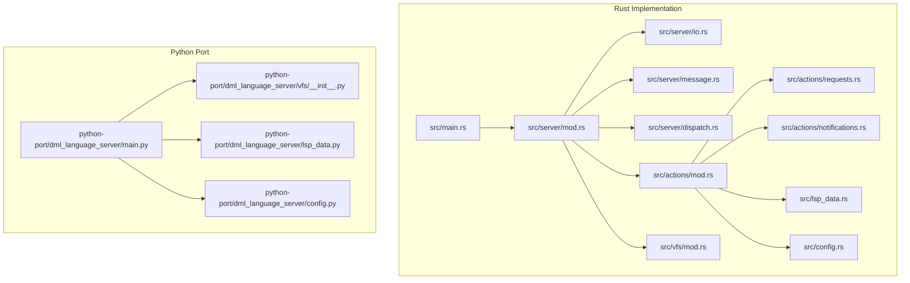
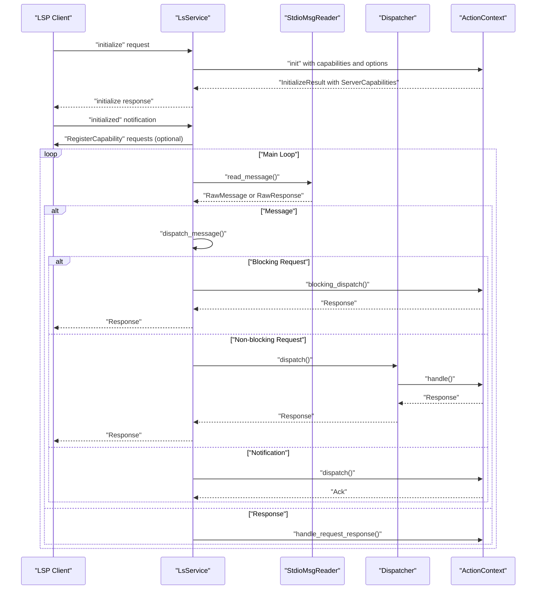
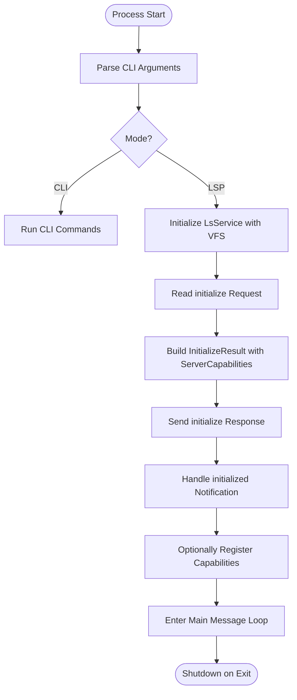
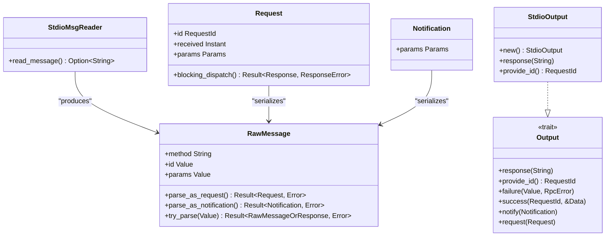
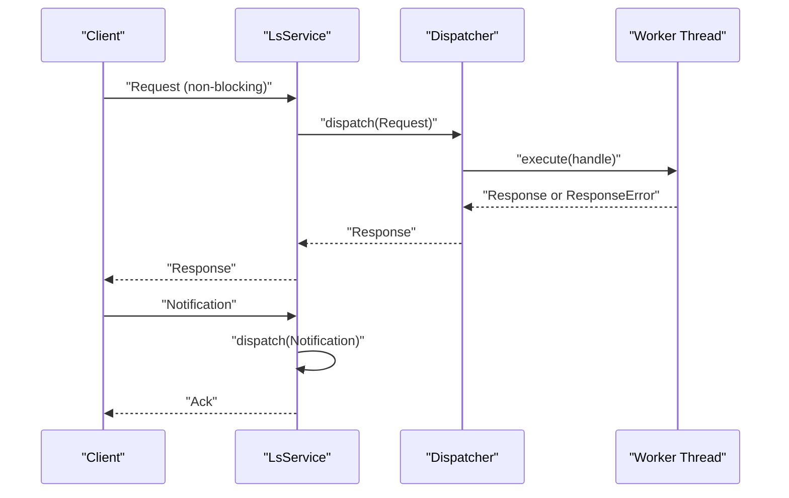
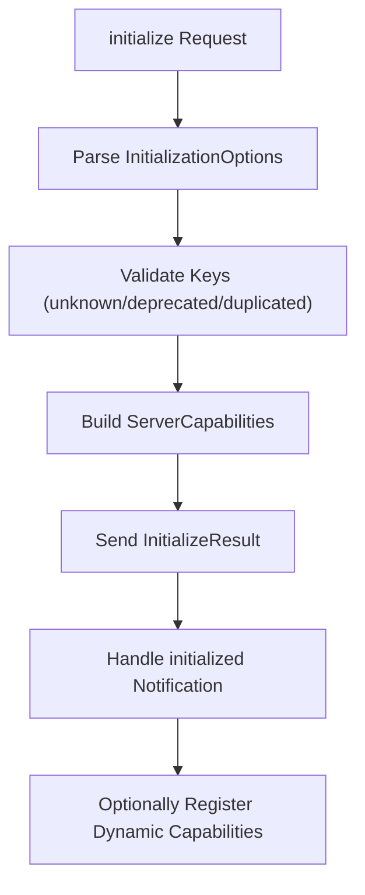
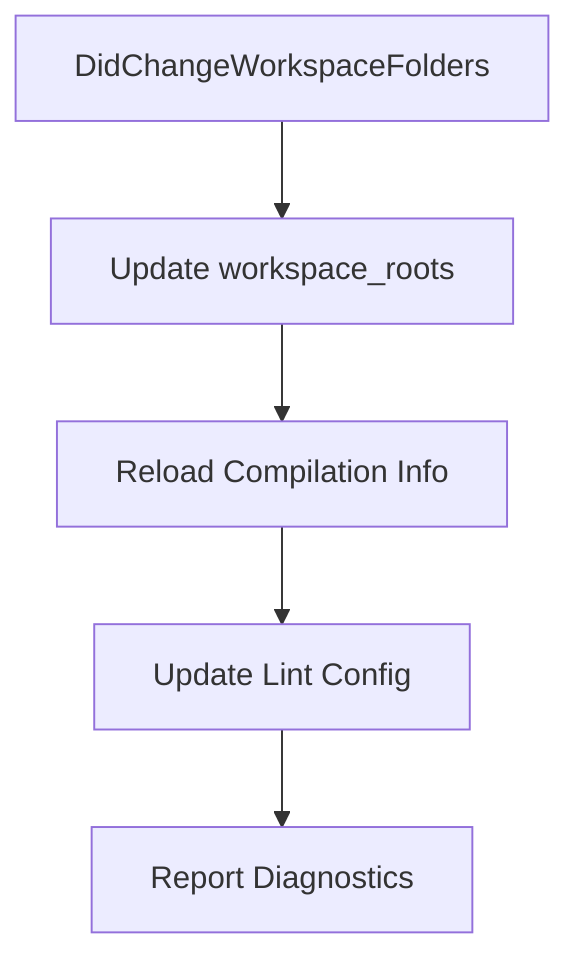
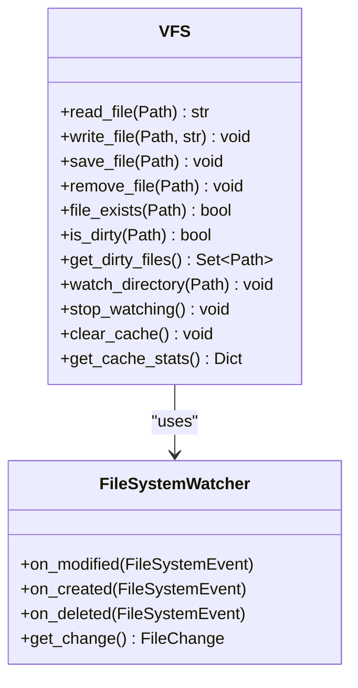
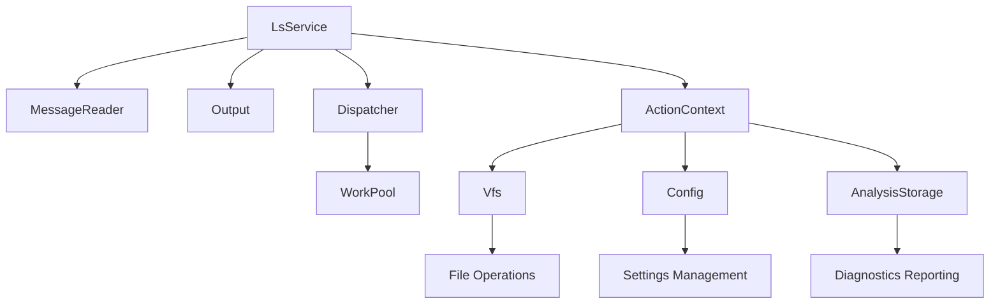

# Language Server Protocol Implementation

<cite>
**Referenced Files in This Document**
- [main.py](file://python-port/dml_language_server/main.py)
- [main.rs](file://src/main.rs)
- [server/mod.rs](file://src/server/mod.rs)
- [lsp_data.rs](file://src/lsp_data.rs)
- [io.rs](file://src/server/io.rs)
- [message.rs](file://src/server/message.rs)
- [dispatch.rs](file://src/server/dispatch.rs)
- [vfs/mod.rs](file://src/vfs/mod.rs)
- [vfs/__init__.py](file://python-port/dml_language_server/vfs/__init__.py)
- [actions/mod.rs](file://src/actions/mod.rs)
- [actions/requests.rs](file://src/actions/requests.rs)
- [actions/notifications.rs](file://src/actions/notifications.rs)
- [config.rs](file://src/config.rs)
- [lsp_data.py](file://python-port/dml_language_server/lsp_data.py)
- [config.py](file://python-port/dml_language_server/config.py)
</cite>

## Table of Contents
1. [Introduction](#introduction)
2. [Project Structure](#project-structure)
3. [Core Components](#core-components)
4. [Architecture Overview](#architecture-overview)
5. [Detailed Component Analysis](#detailed-component-analysis)
6. [Dependency Analysis](#dependency-analysis)
7. [Performance Considerations](#performance-considerations)
8. [Troubleshooting Guide](#troubleshooting-guide)
9. [Conclusion](#conclusion)

## Introduction
This document provides comprehensive technical documentation for the Language Server Protocol (LSP) implementation within the DML Language Server. It covers LSP 3.0+ compliance, server lifecycle management, protocol message handling, JSON-RPC communication, request/response/notification processing, initialization and capability negotiation, workspace management, file management via Virtual File System (VFS), change tracking, caching mechanisms, practical client-server interaction examples, error handling strategies, performance optimization techniques, protocol-specific debugging approaches, and integration patterns with IDEs and editors.

## Project Structure
The DML Language Server is implemented in Rust with a companion Python port. The Rust implementation provides the primary LSP server, while the Python port offers complementary utilities and a VFS implementation for asynchronous file operations and change detection.

**Diagram sources**
- [main.rs](file://src/main.rs#L15-L59)
- [server/mod.rs](file://src/server/mod.rs#L68-L84)
- [io.rs](file://src/server/io.rs#L19-L219)
- [message.rs](file://src/server/message.rs#L1-L712)
- [dispatch.rs](file://src/server/dispatch.rs#L1-L223)
- [actions/mod.rs](file://src/actions/mod.rs#L1-L177)
- [actions/requests.rs](file://src/actions/requests.rs#L1-L998)
- [actions/notifications.rs](file://src/actions/notifications.rs#L1-L376)
- [lsp_data.rs](file://src/lsp_data.rs#L1-L421)
- [config.rs](file://src/config.rs#L1-L321)
- [vfs/mod.rs](file://src/vfs/mod.rs#L1-L971)
- [main.py](file://python-port/dml_language_server/main.py#L25-L91)
- [lsp_data.py](file://python-port/dml_language_server/lsp_data.py#L1-L358)
- [vfs/__init__.py](file://python-port/dml_language_server/vfs/__init__.py#L123-L329)
- [config.py](file://python-port/dml_language_server/config.py#L1-L311)

**Section sources**
- [main.rs](file://src/main.rs#L15-L59)
- [main.py](file://python-port/dml_language_server/main.py#L25-L91)

## Core Components
This section outlines the fundamental building blocks of the LSP implementation and their roles in the overall architecture.

- LSP Server Runtime
  - Initializes the server, sets up the VFS, and manages the main message loop.
  - Handles stdin/stdout communication using JSON-RPC 2.0 over the base LSP protocol.
  - Implements capability negotiation, workspace management, and request/response routing.

- JSON-RPC Communication Layer
  - Encodes/decodes JSON-RPC 2.0 messages with proper header parsing and UTF-8 validation.
  - Supports request IDs, notifications, and responses with standardized error codes.

- Action Context and Dispatch
  - Maintains persistent state across requests, including configuration, VFS, analysis queues, and device contexts.
  - Routes requests to appropriate handlers and manages timeouts for non-blocking requests.

- Virtual File System (VFS)
  - Caches file contents in memory, tracks changes, and supports efficient text editing operations.
  - Coordinates with the analysis engine to invalidate and refresh cached analyses on file changes.

- Configuration Management
  - Centralized configuration with support for dynamic updates, deprecation warnings, and validation.
  - Integrates with workspace roots, compilation info, and lint configurations.

**Section sources**
- [server/mod.rs](file://src/server/mod.rs#L68-L84)
- [io.rs](file://src/server/io.rs#L19-L219)
- [message.rs](file://src/server/message.rs#L1-L712)
- [dispatch.rs](file://src/server/dispatch.rs#L1-L223)
- [vfs/mod.rs](file://src/vfs/mod.rs#L1-L971)
- [config.rs](file://src/config.rs#L120-L321)

## Architecture Overview
The LSP server follows a structured architecture with clear separation of concerns across modules. The server initializes, negotiates capabilities with the client, manages workspace roots, and processes requests and notifications asynchronously.

**Diagram sources**
- [server/mod.rs](file://src/server/mod.rs#L207-L289)
- [server/mod.rs](file://src/server/mod.rs#L474-L636)
- [dispatch.rs](file://src/server/dispatch.rs#L126-L157)
- [io.rs](file://src/server/io.rs#L28-L110)

**Section sources**
- [server/mod.rs](file://src/server/mod.rs#L68-L84)
- [server/mod.rs](file://src/server/mod.rs#L207-L289)
- [server/mod.rs](file://src/server/mod.rs#L474-L636)
- [dispatch.rs](file://src/server/dispatch.rs#L126-L157)
- [io.rs](file://src/server/io.rs#L28-L110)

## Detailed Component Analysis

### LSP Server Lifecycle and Initialization
The server lifecycle begins with process startup, followed by initialization, capability negotiation, and continuous message processing.

- Process Startup
  - Rust entry point parses CLI arguments and either runs in CLI mode or starts the LSP server with an initialized VFS.
  - Python entry point mirrors this behavior, supporting CLI and LSP modes with logging configuration.

- Initialization and Capability Negotiation
  - The server responds to the `initialize` request with server capabilities and optional initialization options.
  - Capability negotiation includes workspace folder support, configuration registration, and watched file registration.
  - After `initialized`, the server optionally registers for dynamic configuration updates and file change notifications.

- Server Capabilities
  - Text document synchronization with incremental changes and save options.
  - Provider capabilities for hover, goto definition/declaration/implementation, references, document symbols, workspace symbols, and experimental features.
  - Workspace folder support with change notifications.

**Diagram sources**
- [main.rs](file://src/main.rs#L44-L59)
- [main.py](file://python-port/dml_language_server/main.py#L52-L91)
- [server/mod.rs](file://src/server/mod.rs#L207-L289)
- [server/mod.rs](file://src/server/mod.rs#L678-L731)

**Section sources**
- [main.rs](file://src/main.rs#L44-L59)
- [main.py](file://python-port/dml_language_server/main.py#L52-L91)
- [server/mod.rs](file://src/server/mod.rs#L207-L289)
- [server/mod.rs](file://src/server/mod.rs#L678-L731)

### JSON-RPC Communication Layer
The JSON-RPC communication layer handles message framing, parsing, and serialization according to the LSP specification.

- Message Framing
  - Uses Content-Length and Content-Type headers with UTF-8 validation.
  - Reads entire message bodies and validates UTF-8 encoding.

- Parsing and Serialization
  - Parses JSON-RPC 2.0 messages, distinguishing between requests (with IDs) and notifications (without IDs).
  - Serializes responses with proper JSON-RPC structure and handles missing parameters as null values.

- Error Handling
  - Emits standardized JSON-RPC errors for parse failures, invalid requests, and invalid parameters.
  - Provides custom failure methods for server-side errors with appropriate codes.

**Diagram sources**
- [io.rs](file://src/server/io.rs#L26-L219)
- [message.rs](file://src/server/message.rs#L185-L303)
- [message.rs](file://src/server/message.rs#L311-L418)

**Section sources**
- [io.rs](file://src/server/io.rs#L28-L110)
- [io.rs](file://src/server/io.rs#L112-L219)
- [message.rs](file://src/server/message.rs#L311-L418)
- [message.rs](file://src/server/message.rs#L185-L303)

### Request/Response and Notification Processing
The server routes incoming messages to appropriate handlers based on method names and maintains strict ordering semantics.

- Blocking vs Non-blocking Requests
  - Blocking requests (e.g., initialize, shutdown) are handled synchronously on the main thread.
  - Non-blocking requests are dispatched to worker threads via a dispatcher with configurable timeouts.

- Notification Handling
  - Notifications are processed immediately on the main thread and include document open/close/change, save, configuration changes, workspace folder changes, and watched file changes.

- Response Error Handling
  - Uses standardized JSON-RPC error codes and custom messages for server-side failures.
  - Supports response-with-message variants to emit warnings or errors alongside responses.

**Diagram sources**
- [server/mod.rs](file://src/server/mod.rs#L502-L599)
- [dispatch.rs](file://src/server/dispatch.rs#L126-L157)
- [dispatch.rs](file://src/server/dispatch.rs#L159-L222)

**Section sources**
- [server/mod.rs](file://src/server/mod.rs#L502-L599)
- [dispatch.rs](file://src/server/dispatch.rs#L126-L157)
- [dispatch.rs](file://src/server/dispatch.rs#L159-L222)

### Server Initialization and Capability Negotiation
Initialization establishes server capabilities and prepares the server for client interaction.

- Initialization Options
  - Supports initialization options including omission of immediate analysis, command execution flags, and upfront settings.
  - Validates and reports unknown, deprecated, and duplicated configuration keys.

- Client Capabilities
  - Extracts client capabilities from the initialize parameters and stores them for feature gating.
  - Determines workspace folder support and configuration change capability.

- Server Capabilities
  - Declares provider capabilities for hover, goto definitions, references, document/workspace symbols, and experimental features.
  - Configures text document synchronization with incremental changes and save options.

**Diagram sources**
- [server/mod.rs](file://src/server/mod.rs#L207-L289)
- [lsp_data.rs](file://src/lsp_data.rs#L284-L313)
- [server/mod.rs](file://src/server/mod.rs#L678-L731)

**Section sources**
- [server/mod.rs](file://src/server/mod.rs#L207-L289)
- [lsp_data.rs](file://src/lsp_data.rs#L284-L313)
- [server/mod.rs](file://src/server/mod.rs#L678-L731)

### Workspace Management
Workspace management enables multi-root workspaces, dynamic updates, and integration with compilation and lint configurations.

- Workspace Roots
  - Supports workspace folders with change notifications.
  - Updates compilation info and linter configuration when workspace roots change.

- Compilation Information
  - Loads compilation info from JSON files and integrates include paths and flags.
  - Validates that compilation info is within workspace roots and warns if not.

- Lint Configuration
  - Loads lint configuration from JSON files and updates dynamically on changes.
  - Supports enabling/disabling linting and controlling direct-only linting behavior.

**Diagram sources**
- [actions/notifications.rs](file://src/actions/notifications.rs#L260-L272)
- [actions/mod.rs](file://src/actions/mod.rs#L424-L437)
- [actions/mod.rs](file://src/actions/mod.rs#L453-L501)

**Section sources**
- [actions/notifications.rs](file://src/actions/notifications.rs#L260-L272)
- [actions/mod.rs](file://src/actions/mod.rs#L424-L437)
- [actions/mod.rs](file://src/actions/mod.rs#L453-L501)

### File Management Through Virtual File System (VFS)
The VFS provides efficient caching, change tracking, and text editing operations.

- File Operations
  - Caches file contents in memory, tracks dirty files, and supports saving to disk.
  - Provides APIs for reading, writing, removing, and checking file existence.

- Change Tracking
  - Monitors file system changes via a watcher and invalidates caches accordingly.
  - Processes change events asynchronously and notifies registered callbacks.

- Text Editing
  - Supports incremental text changes with UTF-16 code unit offsets.
  - Coalesces multiple changes and applies them efficiently.

**Diagram sources**
- [vfs/mod.rs](file://src/vfs/mod.rs#L180-L288)
- [vfs/__init__.py](file://python-port/dml_language_server/vfs/__init__.py#L123-L329)

**Section sources**
- [vfs/mod.rs](file://src/vfs/mod.rs#L180-L288)
- [vfs/__init__.py](file://python-port/dml_language_server/vfs/__init__.py#L123-L329)

### Practical Examples of LSP Client-Server Interactions
Below are representative examples of typical LSP client-server interactions, focusing on the Rust implementation.

- Initialization and Capability Negotiation
  - Client sends `initialize` with capabilities and initialization options.
  - Server responds with `InitializeResult` and `ServerCapabilities`.
  - Client sends `initialized` notification; server optionally registers dynamic capabilities.

- Document Open/Change/Save
  - Client sends `didOpenTextDocument` with document content; server caches content and triggers analysis.
  - Client sends `didChangeTextDocument` with incremental changes; server applies changes and updates analysis.
  - Client sends `didSaveTextDocument`; server marks file as saved and optionally triggers analysis.

- Request-Response Patterns
  - Client sends `hover` request; server responds with hover content.
  - Client sends `gotoDefinition` request; server resolves definition locations and responds.
  - Client sends `workspaceSymbol` request; server returns matching symbols.

- Notification Handling
  - Client sends `didChangeConfiguration`; server reloads configuration and updates analysis.
  - Client sends `didChangeWorkspaceFolders`; server updates workspace roots and re-evaluates compilation info.

**Section sources**
- [server/mod.rs](file://src/server/mod.rs#L207-L289)
- [actions/notifications.rs](file://src/actions/notifications.rs#L75-L164)
- [actions/notifications.rs](file://src/actions/notifications.rs#L177-L242)
- [actions/requests.rs](file://src/actions/requests.rs#L354-L380)
- [actions/requests.rs](file://src/actions/requests.rs#L500-L554)

### Error Handling Strategies
Robust error handling ensures graceful degradation and informative feedback.

- JSON-RPC Errors
  - Parse errors, invalid requests, and invalid parameters are handled with standardized error codes.
  - Custom failure methods emit server-side errors with appropriate messages.

- Configuration Validation
  - Unknown, deprecated, and duplicated configuration keys are reported with warnings.
  - Invalid configuration values are rejected with descriptive messages.

- Analysis Errors
  - Missing file, isolated analysis, lint analysis, or device analysis errors are handled gracefully.
  - Limitation warnings are issued when partial results are returned.

**Section sources**
- [io.rs](file://src/server/io.rs#L120-L154)
- [server/mod.rs](file://src/server/mod.rs#L109-L125)
- [server/mod.rs](file://src/server/mod.rs#L167-L181)
- [actions/requests.rs](file://src/actions/requests.rs#L58-L87)

### Performance Optimization Techniques
Several techniques optimize performance and resource usage.

- Request Throttling and Timeouts
  - Non-blocking requests are dispatched to worker threads with configurable timeouts.
  - Requests are identified and can be canceled if they exceed timeout thresholds.

- Analysis Queue Management
  - Analysis queue limits CPU usage and prevents over-subscription.
  - Progress notifications provide feedback during long-running operations.

- Caching and Change Coalescing
  - VFS caches file contents and coalesces multiple changes to minimize I/O.
  - Analysis storage retains recent results and discards outdated entries based on retention policies.

- Concurrency Controls
  - Atomic flags track shutdown state and quiescence to coordinate request handling.
  - Job tokens manage concurrent job lifecycles and cancellation.

**Section sources**
- [dispatch.rs](file://src/server/dispatch.rs#L24-L29)
- [dispatch.rs](file://src/server/dispatch.rs#L159-L185)
- [actions/mod.rs](file://src/actions/mod.rs#L365-L401)
- [vfs/mod.rs](file://src/vfs/mod.rs#L605-L612)

### Protocol-Specific Debugging Approaches
Effective debugging leverages structured logging and protocol-aware diagnostics.

- Logging Levels
  - Configure logging levels via initialization options and runtime configuration.
  - Use debug, trace, and info levels to trace message parsing, dispatch, and analysis.

- Message Tracing
  - Log raw message parsing and dispatch decisions for diagnosing protocol mismatches.
  - Trace request/response flows and timeout handling.

- Diagnostics Reporting
  - Publish diagnostics with severity levels and related information.
  - Use progress notifications to indicate ongoing analysis tasks.

**Section sources**
- [main.py](file://python-port/dml_language_server/main.py#L65-L69)
- [server/mod.rs](file://src/server/mod.rs#L334-L366)
- [actions/mod.rs](file://src/actions/mod.rs#L503-L557)

### Integration Patterns with IDEs and Editors
The server integrates with various IDEs and editors through standard LSP capabilities.

- Multi-root Workspaces
  - Support workspace folders with dynamic addition/removal and change notifications.
  - Integrate with editor-specific workspace management features.

- Dynamic Capabilities
  - Optionally register for configuration and file change notifications.
  - Adapt to client capabilities for advanced features.

- Client-Specific Features
  - Handle editor-specific notifications and requests (e.g., context control).
  - Provide tailored responses for hover, goto definitions, and references.

**Section sources**
- [server/mod.rs](file://src/server/mod.rs#L721-L731)
- [actions/notifications.rs](file://src/actions/notifications.rs#L33-L73)
- [actions/notifications.rs](file://src/actions/notifications.rs#L274-L353)

## Dependency Analysis
This section examines component dependencies and coupling to understand the overall system structure.

**Diagram sources**
- [server/mod.rs](file://src/server/mod.rs#L292-L320)
- [dispatch.rs](file://src/server/dispatch.rs#L126-L157)
- [actions/mod.rs](file://src/actions/mod.rs#L98-L177)
- [vfs/mod.rs](file://src/vfs/mod.rs#L293-L306)

**Section sources**
- [server/mod.rs](file://src/server/mod.rs#L292-L320)
- [dispatch.rs](file://src/server/dispatch.rs#L126-L157)
- [actions/mod.rs](file://src/actions/mod.rs#L98-L177)
- [vfs/mod.rs](file://src/vfs/mod.rs#L293-L306)

## Performance Considerations
- Use incremental text document synchronization to minimize bandwidth and processing overhead.
- Leverage analysis queues and timeouts to prevent resource exhaustion during heavy analysis loads.
- Cache frequently accessed files and analysis results to reduce repeated computation.
- Monitor and adjust analysis retention durations to balance memory usage and responsiveness.
- Utilize progress notifications to keep clients informed during long-running operations.

## Troubleshooting Guide
Common issues and their resolutions:

- Parse Errors
  - Verify UTF-8 encoding and valid JSON-RPC structure.
  - Check Content-Length and Content-Type headers.

- Initialization Failures
  - Ensure client capabilities are valid and supported.
  - Validate initialization options and report unknown/deprecated keys.

- Analysis Errors
  - Confirm workspace roots include compilation info files.
  - Check device context activation and module relationships.

- VFS Issues
  - Verify file watchers are configured and operational.
  - Ensure cache invalidation occurs on external file changes.

**Section sources**
- [io.rs](file://src/server/io.rs#L46-L110)
- [server/mod.rs](file://src/server/mod.rs#L109-L125)
- [actions/mod.rs](file://src/actions/mod.rs#L453-L501)
- [vfs/mod.rs](file://src/vfs/mod.rs#L240-L268)

## Conclusion
The DML Language Server provides a robust, LSP 3.0+ compliant implementation with comprehensive support for initialization, capability negotiation, workspace management, and file operations through a sophisticated VFS. Its modular architecture, strong error handling, and performance optimizations enable reliable integration with modern IDEs and editors, delivering responsive and accurate language services for DML development.