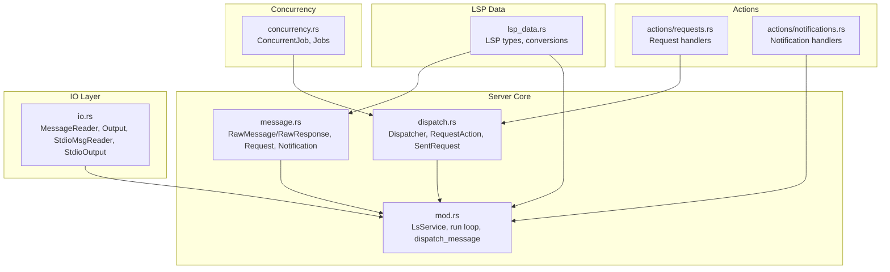
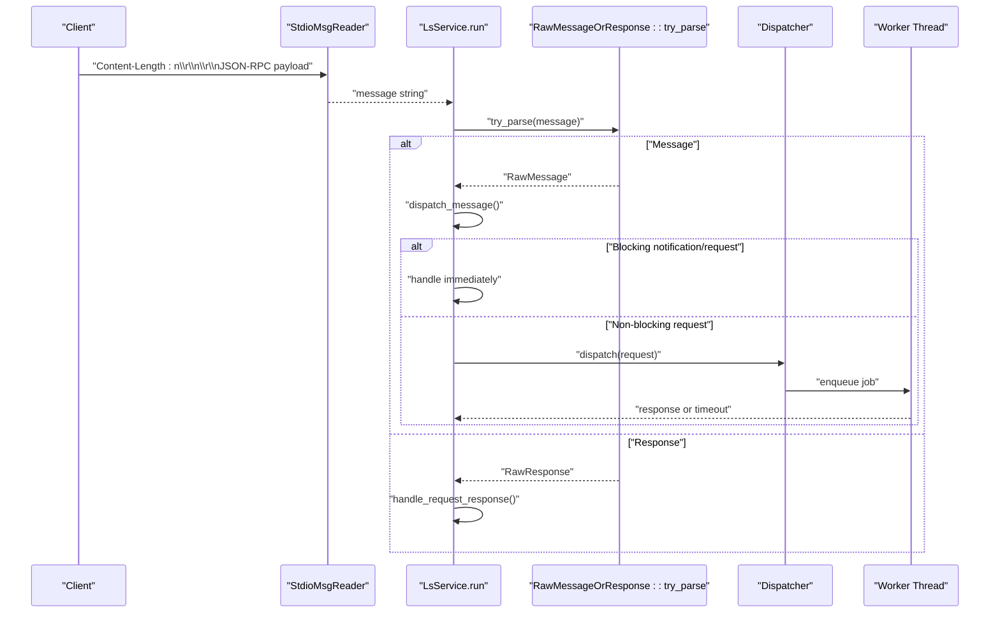
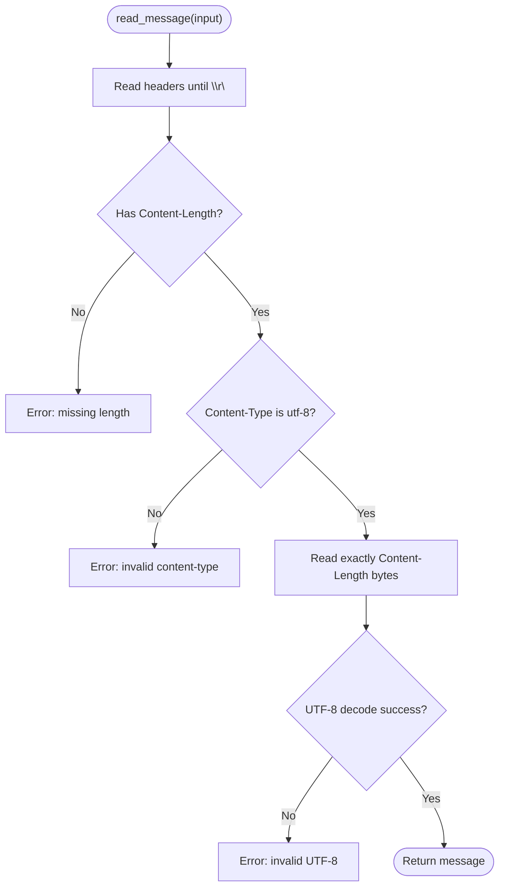
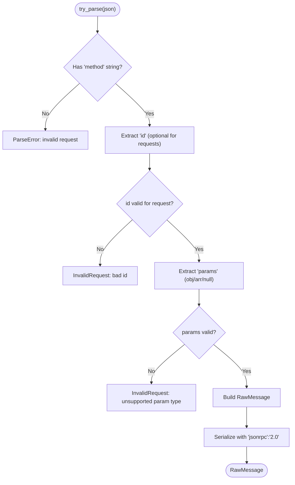
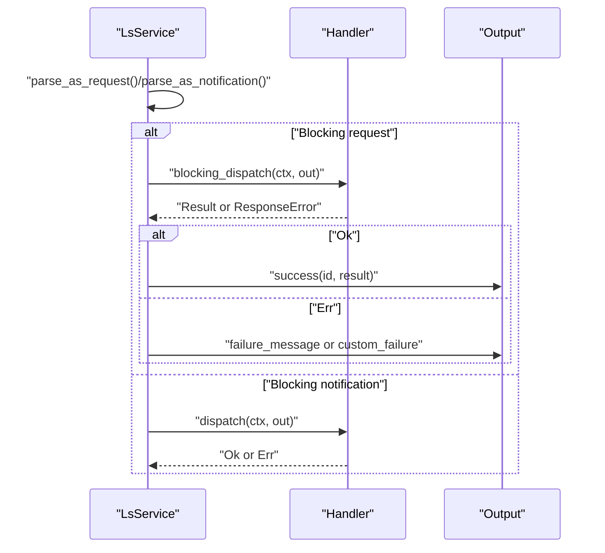
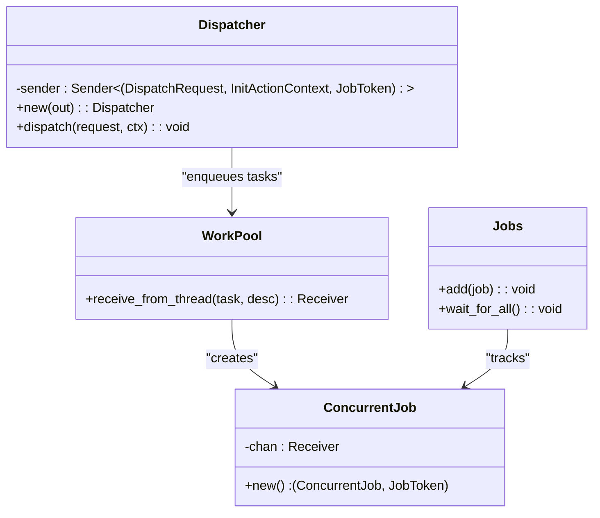
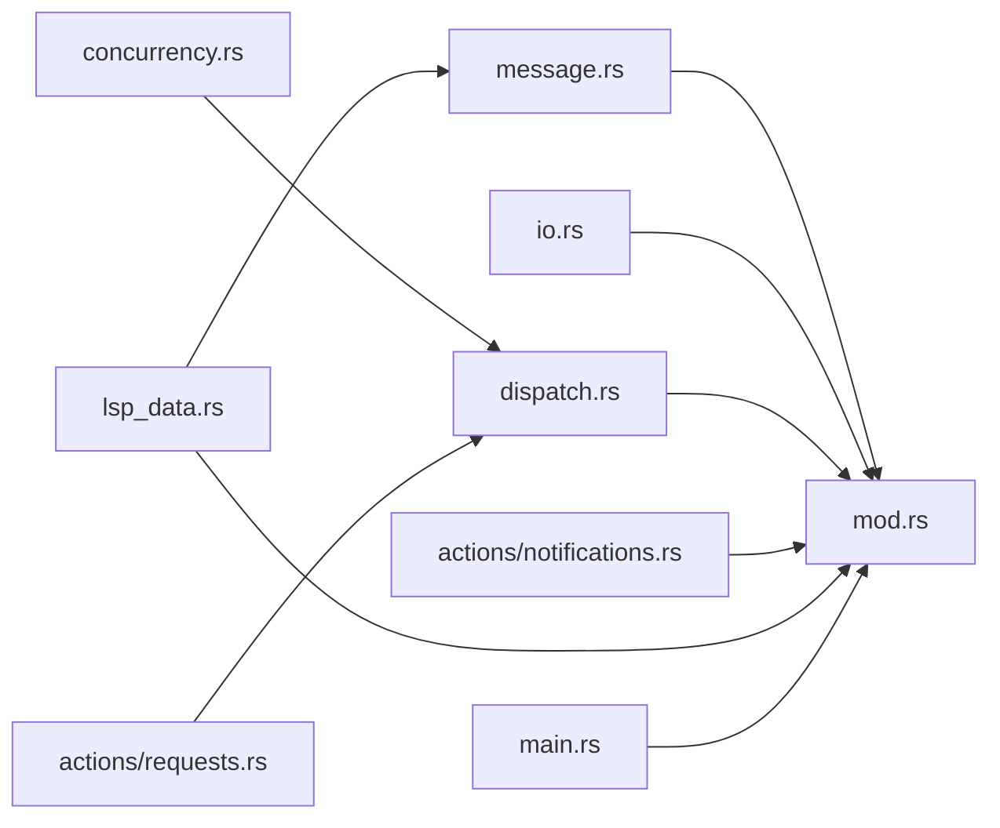

# Message Handling and Communication

<cite>
**Referenced Files in This Document**
- [src/server/message.rs](file://src/server/message.rs)
- [src/server/io.rs](file://src/server/io.rs)
- [src/server/dispatch.rs](file://src/server/dispatch.rs)
- [src/server/mod.rs](file://src/server/mod.rs)
- [src/concurrency.rs](file://src/concurrency.rs)
- [src/actions/requests.rs](file://src/actions/requests.rs)
- [src/actions/notifications.rs](file://src/actions/notifications.rs)
- [src/lsp_data.rs](file://src/lsp_data.rs)
- [src/main.rs](file://src/main.rs)
</cite>

## Table of Contents
1. [Introduction](#introduction)
2. [Project Structure](#project-structure)
3. [Core Components](#core-components)
4. [Architecture Overview](#architecture-overview)
5. [Detailed Component Analysis](#detailed-component-analysis)
6. [Dependency Analysis](#dependency-analysis)
7. [Performance Considerations](#performance-considerations)
8. [Troubleshooting Guide](#troubleshooting-guide)
9. [Conclusion](#conclusion)

## Introduction
This document explains the message handling and communication layer of the DML Language Server. It focuses on the JSON-RPC over stdio protocol, including message parsing, validation, serialization, and the threading model for client communication. It documents the RawMessage and RawResponse structures, the message reader/writer implementations, and the lifecycle from reception to dispatch. It also covers error handling for malformed messages, protocol compliance verification, practical message exchange patterns, performance considerations for high-throughput scenarios, and debugging techniques for communication issues.

## Project Structure
The communication layer spans several modules:
- Server core: message parsing, dispatch, and runtime loop
- IO: stdio reader/writer and header parsing
- Concurrency: job tracking and worker coordination
- Actions: request/notification handlers and server capabilities
- LSP data: LSP types and conversion utilities

**Diagram sources**
- [src/server/message.rs](file://src/server/message.rs#L1-L712)
- [src/server/dispatch.rs](file://src/server/dispatch.rs#L1-L206)
- [src/server/mod.rs](file://src/server/mod.rs#L1-L836)
- [src/server/io.rs](file://src/server/io.rs#L1-L319)
- [src/concurrency.rs](file://src/concurrency.rs#L1-L103)
- [src/actions/requests.rs](file://src/actions/requests.rs#L1-L200)
- [src/actions/notifications.rs](file://src/actions/notifications.rs#L1-L200)
- [src/lsp_data.rs](file://src/lsp_data.rs#L1-L200)

**Section sources**
- [src/server/message.rs](file://src/server/message.rs#L1-L712)
- [src/server/io.rs](file://src/server/io.rs#L1-L319)
- [src/server/dispatch.rs](file://src/server/dispatch.rs#L1-L206)
- [src/server/mod.rs](file://src/server/mod.rs#L1-L836)
- [src/concurrency.rs](file://src/concurrency.rs#L1-L103)
- [src/actions/requests.rs](file://src/actions/requests.rs#L1-L200)
- [src/actions/notifications.rs](file://src/actions/notifications.rs#L1-L200)
- [src/lsp_data.rs](file://src/lsp_data.rs#L1-L200)

## Core Components
- RawMessage and RawResponse: JSON-RPC message containers with strict parsing/validation and controlled serialization.
- MessageReader and Output: stdio transport abstraction with Base Protocol header parsing and framing.
- Request and Notification: typed wrappers around RawMessage for requests and notifications, with method/params/id handling.
- Dispatcher and RequestAction: non-blocking request dispatch to worker threads with timeouts and job tracking.
- LsService: main server loop that reads messages, parses them, dispatches to handlers, and manages server state.

Key responsibilities:
- Parsing: validate JSON-RPC fields, method presence, id presence for requests, params shape, and content-type/length headers.
- Validation: enforce protocol compliance (e.g., missing id for notifications, unsupported param types).
- Serialization: ensure consistent JSON-RPC 2.0 framing and optional fields.
- Threading: single-threaded read loop, immediate handling for blocking notifications/requests, worker-thread dispatch for non-blocking requests.

**Section sources**
- [src/server/message.rs](file://src/server/message.rs#L311-L476)
- [src/server/io.rs](file://src/server/io.rs#L19-L189)
- [src/server/mod.rs](file://src/server/mod.rs#L291-L470)
- [src/server/dispatch.rs](file://src/server/dispatch.rs#L109-L147)

## Architecture Overview
The server runs a dedicated reader thread that reads stdio messages, parses them into RawMessage or RawResponse, and forwards them to the main server loop via a channel. The main loop dispatches messages to either:
- Immediate handlers (blocking notifications and blocking requests)
- Worker-thread dispatch (non-blocking requests)

**Diagram sources**
- [src/server/io.rs](file://src/server/io.rs#L28-L110)
- [src/server/mod.rs](file://src/server/mod.rs#L322-L470)
- [src/server/message.rs](file://src/server/message.rs#L483-L520)
- [src/server/dispatch.rs](file://src/server/dispatch.rs#L117-L147)

## Detailed Component Analysis

### JSON-RPC over stdio: Reader and Writer
- MessageReader reads stdio using the Base Protocol, extracting Content-Length and validating Content-Type.
- Output writes framed responses with Content-Length header and UTF-8 content.
- The writer ensures JSON-RPC 2.0 framing and serializes responses with id/result/error.

**Diagram sources**
- [src/server/io.rs](file://src/server/io.rs#L46-L110)

**Section sources**
- [src/server/io.rs](file://src/server/io.rs#L19-L189)

### RawMessage and RawResponse: Parsing and Serialization
- RawMessage carries method, id, and params. It enforces protocol rules:
  - Requests require id; notifications must not include id.
  - Method must be a string; params must be object/array/null (null normalized internally).
- RawResponse enforces that exactly one of result or error is present and id is required.
- Controlled serialization omits absent fields (id for notifications, params when empty) to match JSON-RPC 2.0.

**Diagram sources**
- [src/server/message.rs](file://src/server/message.rs#L366-L396)
- [src/server/message.rs](file://src/server/message.rs#L400-L418)

**Section sources**
- [src/server/message.rs](file://src/server/message.rs#L311-L476)

### Request and Notification Lifecycle
- Request wraps id, received timestamp, and params, with a phantom action type.
- Notification wraps params without id.
- Both can be converted to RawMessage for serialization.
- BlockingNotificationAction and BlockingRequestAction are handled immediately on the main thread.
- Non-blocking requests are dispatched to a worker thread via Dispatcher.

**Diagram sources**
- [src/server/message.rs](file://src/server/message.rs#L185-L275)
- [src/server/mod.rs](file://src/server/mod.rs#L472-L598)

**Section sources**
- [src/server/message.rs](file://src/server/message.rs#L185-L275)
- [src/server/mod.rs](file://src/server/mod.rs#L472-L598)

### Dispatcher and Threading Model
- Dispatcher spawns a worker thread and forwards requests via a channel.
- Each request is wrapped in a macro-generated enum and scheduled on a work pool.
- Requests carry a timeout; if already elapsed, a fallback response is returned.
- JobTokens track active jobs; Jobs table waits for completion during shutdown.

**Diagram sources**
- [src/server/dispatch.rs](file://src/server/dispatch.rs#L109-L147)
- [src/concurrency.rs](file://src/concurrency.rs#L22-L86)

**Section sources**
- [src/server/dispatch.rs](file://src/server/dispatch.rs#L109-L147)
- [src/concurrency.rs](file://src/concurrency.rs#L1-L103)

### Practical Message Exchange Patterns
- Initialization: client sends initialize request; server responds with InitializeResult and initializes context.
- Notifications: didOpen/didChange/didClose/didSave, initialized, configuration/watched files updates.
- Requests: completion, goto definition/declaration/implementation, references, hover, symbols, formatting, rename, code actions, codelens, resolve completion, execute command, get known contexts.
- Responses: server sends results or errors for client-initiated requests; handles client responses for server-initiated requests.

**Section sources**
- [src/server/mod.rs](file://src/server/mod.rs#L207-L289)
- [src/actions/notifications.rs](file://src/actions/notifications.rs#L32-L174)
- [src/actions/requests.rs](file://src/actions/requests.rs#L22-L42)
- [src/server/dispatch.rs](file://src/server/dispatch.rs#L89-L107)

## Dependency Analysis
- LsService depends on MessageReader, Output, and ActionContext.
- Message parsing relies on LSP types and serde for JSON.
- Dispatcher depends on work pool and crossbeam channels.
- Concurrency primitives coordinate job lifecycles.

**Diagram sources**
- [src/server/message.rs](file://src/server/message.rs#L1-L712)
- [src/server/mod.rs](file://src/server/mod.rs#L1-L836)
- [src/server/io.rs](file://src/server/io.rs#L1-L319)
- [src/server/dispatch.rs](file://src/server/dispatch.rs#L1-L206)
- [src/concurrency.rs](file://src/concurrency.rs#L1-L103)
- [src/actions/requests.rs](file://src/actions/requests.rs#L1-L200)
- [src/actions/notifications.rs](file://src/actions/notifications.rs#L1-L200)
- [src/lsp_data.rs](file://src/lsp_data.rs#L1-L200)
- [src/main.rs](file://src/main.rs#L1-L60)

**Section sources**
- [src/server/mod.rs](file://src/server/mod.rs#L1-L836)
- [src/server/message.rs](file://src/server/message.rs#L1-L712)
- [src/server/io.rs](file://src/server/io.rs#L1-L319)
- [src/server/dispatch.rs](file://src/server/dispatch.rs#L1-L206)
- [src/concurrency.rs](file://src/concurrency.rs#L1-L103)
- [src/actions/requests.rs](file://src/actions/requests.rs#L1-L200)
- [src/actions/notifications.rs](file://src/actions/notifications.rs#L1-L200)
- [src/lsp_data.rs](file://src/lsp_data.rs#L1-L200)
- [src/main.rs](file://src/main.rs#L1-L60)

## Performance Considerations
- Throughput: The reader thread decouples IO from the main loop. Non-blocking requests are dispatched to worker threads, preventing head-of-line blocking.
- Backpressure: The work pool and AnalysisQueue limit concurrent heavy work; Jobs tracking prevents orphaned tasks.
- Serialization overhead: Minimal allocations by serializing only required fields and reusing string buffers.
- Timeouts: Non-blocking requests are checked against a timeout before starting; if expired, a fallback response is returned to avoid wasted work.
- Resource management: Atomic counters and channels ensure safe shutdown and graceful exit.

[No sources needed since this section provides general guidance]

## Troubleshooting Guide
Common issues and diagnostics:
- Malformed headers: missing Content-Length or invalid Content-Type lead to parse failures.
- Invalid JSON-RPC: missing method, unsupported param type, both result and error in response, or missing id in response.
- Protocol violations: notifications with id, requests without id, or invalid id types.
- Shutdown behavior: after shutdown, only exit notifications are honored; others are ignored.
- Debugging: enable trace logging to inspect raw messages and responses; parse errors surface as JSON-RPC ParseError with details.

Practical checks:
- Verify stdio framing and UTF-8 content.
- Confirm method names match LSPRequest/LSPNotification constants.
- Ensure params are object/array/null; avoid scalars for params.
- Validate id types: numeric or string for requests; absence for notifications.

**Section sources**
- [src/server/io.rs](file://src/server/io.rs#L46-L110)
- [src/server/message.rs](file://src/server/message.rs#L366-L396)
- [src/server/message.rs](file://src/server/message.rs#L435-L476)
- [src/server/mod.rs](file://src/server/mod.rs#L603-L635)

## Conclusion
The DML Language Server implements a robust JSON-RPC over stdio communication layer. It enforces protocol compliance, validates messages rigorously, and separates IO-bound work from request handling via a dedicated reader thread and worker dispatch. The design balances correctness, performance, and maintainability, with clear boundaries between parsing, dispatching, and execution.