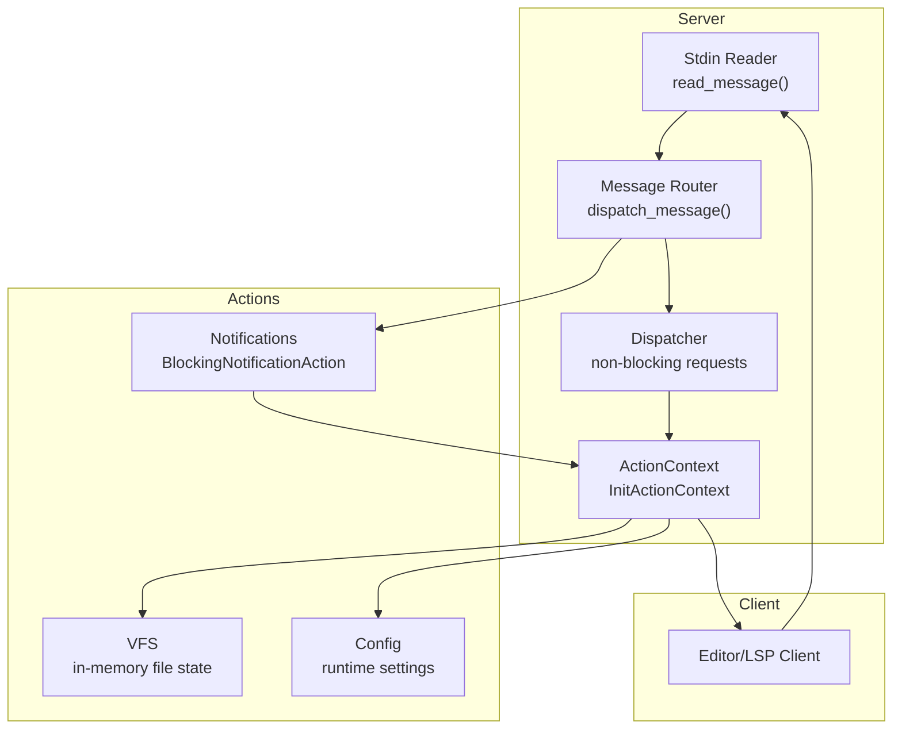
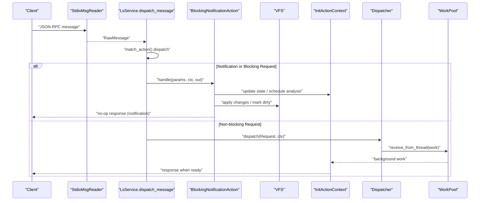
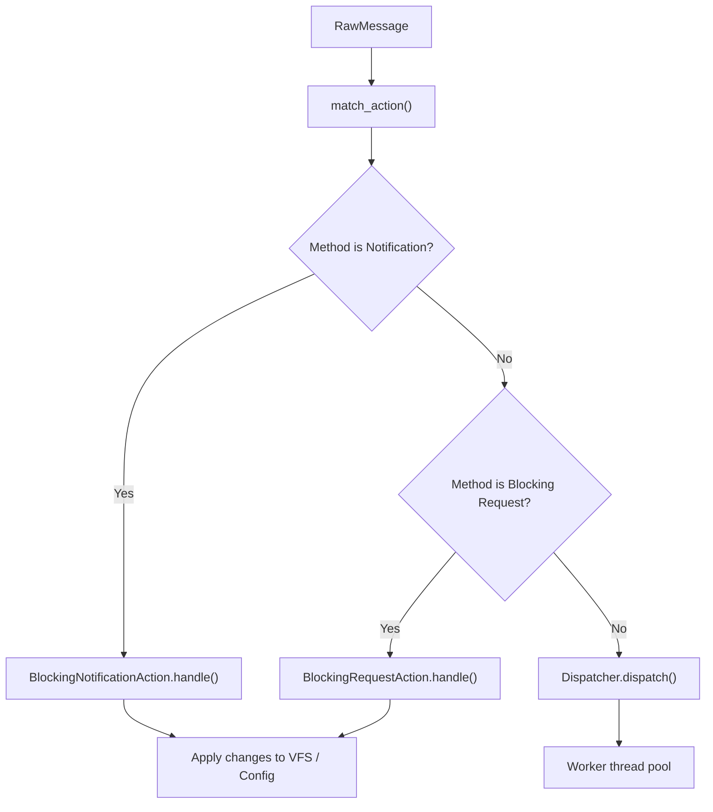
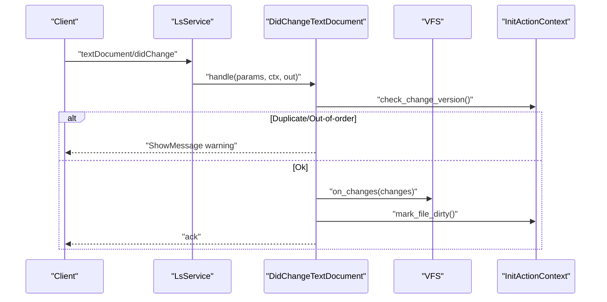
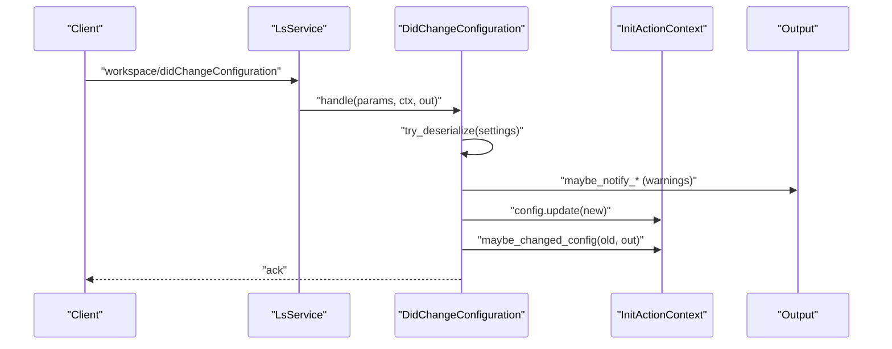
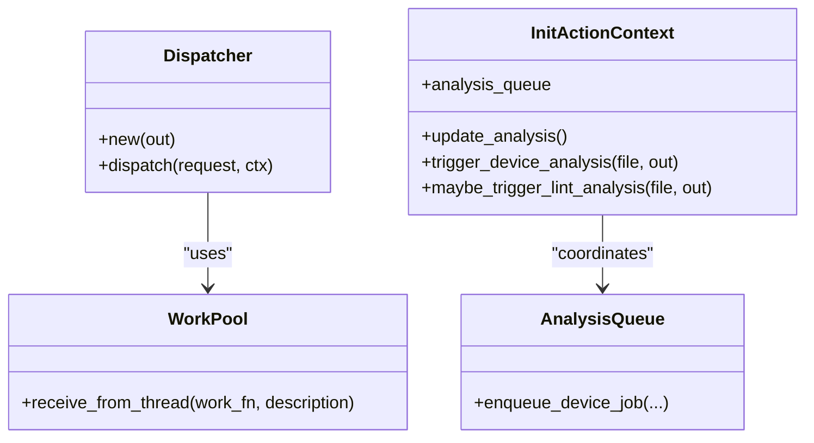
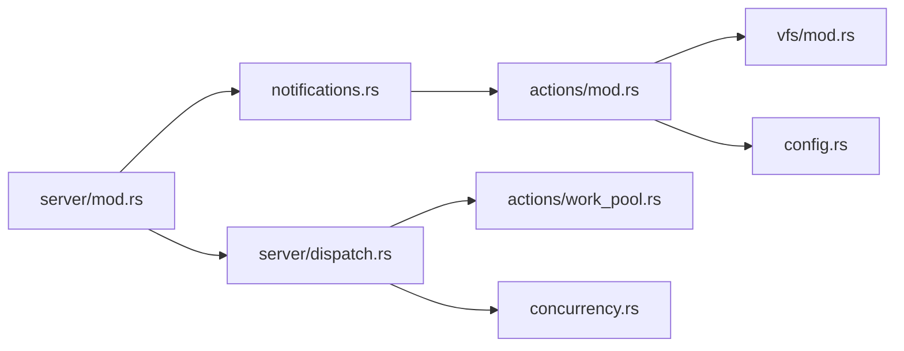

# Notification Handling and Asynchronous Updates

<cite>
**Referenced Files in This Document**
- [notifications.rs](file://src/actions/notifications.rs)
- [mod.rs (actions)](file://src/actions/mod.rs)
- [dispatch.rs](file://src/server/dispatch.rs)
- [mod.rs (server)](file://src/server/mod.rs)
- [message.rs](file://src/server/message.rs)
- [io.rs](file://src/server/io.rs)
- [concurrency.rs](file://src/concurrency.rs)
- [mod.rs (vfs)](file://src/vfs/mod.rs)
- [lsp_data.rs](file://src/lsp_data.rs)
- [config.rs](file://src/config.rs)
- [main.rs](file://src/main.rs)
</cite>

## Table of Contents
1. [Introduction](#introduction)
2. [Project Structure](#project-structure)
3. [Core Components](#core-components)
4. [Architecture Overview](#architecture-overview)
5. [Detailed Component Analysis](#detailed-component-analysis)
6. [Dependency Analysis](#dependency-analysis)
7. [Performance Considerations](#performance-considerations)
8. [Troubleshooting Guide](#troubleshooting-guide)
9. [Conclusion](#conclusion)

## Introduction
This document explains the notification processing and asynchronous update mechanisms in the DML Language Server (DLS). It covers how the server handles file change notifications, configuration updates, workspace folder changes, and client-initiated notifications. It also details the dispatch mechanism, state synchronization, error handling for notification failures, practical workflows, performance considerations for frequent notifications, and debugging techniques.

## Project Structure
The notification pipeline spans several modules:
- Server input/output and message parsing
- Dispatch of non-blocking requests to worker threads
- Action context and notification handlers
- Virtual File System (VFS) for in-memory file state
- Concurrency primitives for safe async coordination

**Diagram sources**
- [io.rs](file://src/server/io.rs#L46-L110)
- [mod.rs (server)](file://src/server/mod.rs#L474-L600)
- [dispatch.rs](file://src/server/dispatch.rs#L122-L157)
- [mod.rs (actions)](file://src/actions/mod.rs#L251-L401)
- [mod.rs (vfs)](file://src/vfs/mod.rs#L180-L288)

**Section sources**
- [io.rs](file://src/server/io.rs#L19-L110)
- [mod.rs (server)](file://src/server/mod.rs#L474-L600)
- [dispatch.rs](file://src/server/dispatch.rs#L122-L157)
- [mod.rs (actions)](file://src/actions/mod.rs#L251-L401)
- [mod.rs (vfs)](file://src/vfs/mod.rs#L180-L288)

## Core Components
- Notification handlers implement a blocking action interface and mutate in-memory state or trigger analysis.
- The server routes incoming messages and invokes handlers immediately for notifications and blocking requests.
- Non-blocking requests are dispatched to a worker thread pool with timeouts and concurrency limits.
- VFS applies incremental changes atomically and tracks dirty state.
- Concurrency utilities coordinate long-running jobs and ensure determinism in tests.

Key responsibilities:
- Immediate processing: text document lifecycle, configuration changes, watched file changes, workspace folder changes, and client context activation.
- Background coordination: analysis queues, device dependency triggers, and linter re-analysis on config changes.
- Error handling: structured responses and warnings for malformed or out-of-order inputs.

**Section sources**
- [notifications.rs](file://src/actions/notifications.rs#L33-L272)
- [mod.rs (server)](file://src/server/mod.rs#L474-L600)
- [dispatch.rs](file://src/server/dispatch.rs#L60-L94)
- [mod.rs (vfs)](file://src/vfs/mod.rs#L354-L379)
- [concurrency.rs](file://src/concurrency.rs#L58-L144)

## Architecture Overview
The server reads LSP messages from stdin, parses them, and routes them to either:
- Immediate handlers for notifications and blocking requests
- Worker threads for non-blocking requests

**Diagram sources**
- [io.rs](file://src/server/io.rs#L28-L110)
- [mod.rs (server)](file://src/server/mod.rs#L474-L600)
- [dispatch.rs](file://src/server/dispatch.rs#L60-L94)
- [work_pool.rs](file://src/actions/work_pool.rs#L53-L103)

**Section sources**
- [io.rs](file://src/server/io.rs#L28-L110)
- [mod.rs (server)](file://src/server/mod.rs#L474-L600)
- [dispatch.rs](file://src/server/dispatch.rs#L60-L94)
- [work_pool.rs](file://src/actions/work_pool.rs#L53-L103)

## Detailed Component Analysis

### Notification Dispatch Mechanism
- The router matches the method against known notifications and invokes their handlers immediately.
- Notifications are processed synchronously on the main thread to maintain ordering and avoid race conditions.
- Blocking requests are handled similarly but may wait for non-blocking requests to complete depending on design.

**Diagram sources**
- [mod.rs (server)](file://src/server/mod.rs#L474-L598)
- [message.rs](file://src/server/message.rs#L105-L124)

**Section sources**
- [mod.rs (server)](file://src/server/mod.rs#L474-L598)
- [message.rs](file://src/server/message.rs#L105-L124)

### Immediate Processing Requirements

#### Text Document Lifecycle
- Open/close/save: update VFS, track direct opens, and optionally trigger analysis.
- Change: apply incremental edits, detect duplicates/out-of-order versions, mark file dirty, and optionally analyze immediately.

**Diagram sources**
- [notifications.rs](file://src/actions/notifications.rs#L108-L163)
- [mod.rs (vfs)](file://src/vfs/mod.rs#L354-L379)
- [mod.rs (actions)](file://src/actions/mod.rs#L1357-L1370)

**Section sources**
- [notifications.rs](file://src/actions/notifications.rs#L75-L106)
- [notifications.rs](file://src/actions/notifications.rs#L108-L163)
- [mod.rs (vfs)](file://src/vfs/mod.rs#L354-L379)
- [mod.rs (actions)](file://src/actions/mod.rs#L1357-L1370)

#### Configuration Updates
- Dynamic registration of configuration change notifications is performed during initialization.
- On change, the server validates settings, reports unknown/deprecated/duplicated keys, updates runtime config, and coordinates re-analysis.

**Diagram sources**
- [notifications.rs](file://src/actions/notifications.rs#L177-L224)
- [server/mod.rs](file://src/server/mod.rs#L109-L205)
- [mod.rs (actions)](file://src/actions/mod.rs#L645-L740)
- [lsp_data.rs](file://src/lsp_data.rs#L242-L278)

**Section sources**
- [notifications.rs](file://src/actions/notifications.rs#L33-L73)
- [notifications.rs](file://src/actions/notifications.rs#L177-L224)
- [server/mod.rs](file://src/server/mod.rs#L109-L205)
- [mod.rs (actions)](file://src/actions/mod.rs#L645-L740)
- [lsp_data.rs](file://src/lsp_data.rs#L242-L278)

#### Watched File Changes
- On file watcher events, the server refreshes compilation info and linter config if relevant changes are detected.

**Section sources**
- [notifications.rs](file://src/actions/notifications.rs#L244-L257)
- [mod.rs (actions)](file://src/actions/mod.rs#L439-L501)

#### Workspace Folder Changes
- Adds/removes roots and recomputes compilation info when roots change.

**Section sources**
- [notifications.rs](file://src/actions/notifications.rs#L260-L271)
- [mod.rs (actions)](file://src/actions/mod.rs#L424-L437)

#### Client-Initiated Context Activation
- Supports a custom notification to change active device contexts and re-reports diagnostics accordingly.

**Section sources**
- [notifications.rs](file://src/actions/notifications.rs#L274-L353)
- [mod.rs (actions)](file://src/actions/mod.rs#L503-L557)

### Background Update Coordination
- Non-blocking requests are scheduled on a worker pool with concurrency limits and timeouts.
- Analysis is queued and executed asynchronously; device dependency triggers and linter re-analysis are coordinated.
- Progress notifications are issued to keep the client informed.

**Diagram sources**
- [dispatch.rs](file://src/server/dispatch.rs#L122-L157)
- [work_pool.rs](file://src/actions/work_pool.rs#L53-L103)
- [mod.rs (actions)](file://src/actions/mod.rs#L845-L874)

**Section sources**
- [dispatch.rs](file://src/server/dispatch.rs#L60-L94)
- [work_pool.rs](file://src/actions/work_pool.rs#L53-L103)
- [mod.rs (actions)](file://src/actions/mod.rs#L845-L874)

### State Synchronization
- The server maintains an atomic flag indicating whether the system is quiescent; handlers reset it when mutating changes arrive.
- After background analysis completes, the server checks waits and publishes diagnostics.

**Section sources**
- [mod.rs (actions)](file://src/actions/mod.rs#L262-L262)
- [mod.rs (server)](file://src/server/mod.rs#L394-L470)

### Error Handling for Notification Failures
- Unknown/deprecated/duplicated configuration keys are warned and reported to the client.
- Out-of-order or duplicate text document change notifications are ignored with a warning.
- Parsing and dispatch errors are surfaced to the client with standardized error responses.

**Section sources**
- [server/mod.rs](file://src/server/mod.rs#L109-L205)
- [notifications.rs](file://src/actions/notifications.rs#L125-L134)
- [io.rs](file://src/server/io.rs#L120-L154)

## Dependency Analysis
- Notifications depend on the action context for VFS updates, config mutation, and analysis orchestration.
- The dispatcher depends on the worker pool and concurrency utilities.
- VFS depends on path resolution and change coalescing.

**Diagram sources**
- [notifications.rs](file://src/actions/notifications.rs#L1-L376)
- [mod.rs (actions)](file://src/actions/mod.rs#L1-L1471)
- [mod.rs (vfs)](file://src/vfs/mod.rs#L1-L971)
- [config.rs](file://src/config.rs#L1-L321)
- [mod.rs (server)](file://src/server/mod.rs#L1-L838)
- [dispatch.rs](file://src/server/dispatch.rs#L1-L223)
- [work_pool.rs](file://src/actions/work_pool.rs#L1-L104)
- [concurrency.rs](file://src/concurrency.rs#L1-L177)

**Section sources**
- [notifications.rs](file://src/actions/notifications.rs#L1-L376)
- [mod.rs (server)](file://src/server/mod.rs#L1-L838)
- [dispatch.rs](file://src/server/dispatch.rs#L1-L223)
- [mod.rs (actions)](file://src/actions/mod.rs#L1-L1471)
- [mod.rs (vfs)](file://src/vfs/mod.rs#L1-L971)
- [config.rs](file://src/config.rs#L1-L321)
- [concurrency.rs](file://src/concurrency.rs#L1-L177)

## Performance Considerations
- Frequent text document changes: The server detects duplicates/out-of-order versions and ignores them to avoid redundant work. Immediate analysis is skipped when configured to analyze on save only.
- Concurrency limits: The worker pool caps total concurrent tasks and prevents starting new similar work when capacity is reached, avoiding overload.
- Retention policy: Analysis results older than a minimum threshold are discarded to prevent excessive memory usage.
- Progress reporting: Begin/end progress notifications are issued to keep the client informed during heavy workloads.

Practical tips:
- Prefer saving over frequent incremental analysis when editing rapidly.
- Monitor server logs for warnings about configuration duplication or unknown keys.
- Keep workspace roots minimal to reduce unnecessary compilation info updates.

**Section sources**
- [notifications.rs](file://src/actions/notifications.rs#L115-L134)
- [work_pool.rs](file://src/actions/work_pool.rs#L45-L76)
- [mod.rs (server)](file://src/server/mod.rs#L374-L380)
- [server/mod.rs](file://src/server/mod.rs#L127-L147)

## Troubleshooting Guide
Common issues and resolutions:
- Out-of-order or duplicate text changes: The server warns and ignores them. Ensure the client sends changes in order and avoids resending the same version.
- Configuration warnings: Unknown, deprecated, or duplicated keys are reported. Fix the client configuration to use supported keys.
- Parsing errors: If the server cannot parse a message, it responds with a standardized error. Verify the client’s JSON-RPC formatting.
- Shutdown behavior: While shutting down, the server ignores most messages except exit; ensure the client sends exit after shutdown.

Debugging techniques:
- Enable server logging to observe notification handling and progress updates.
- Use the exit code signaling to detect fatal errors during message parsing.
- Inspect the action context for current state (direct opens, workspace roots, device contexts).

**Section sources**
- [notifications.rs](file://src/actions/notifications.rs#L125-L134)
- [server/mod.rs](file://src/server/mod.rs#L109-L205)
- [io.rs](file://src/server/io.rs#L120-L154)
- [mod.rs (server)](file://src/server/mod.rs#L605-L636)

## Conclusion
The DLS implements a robust notification handling system that balances immediate processing for critical events (open/close/save/change) with asynchronous coordination for analysis and diagnostics. The design ensures correctness through strict ordering for notifications, careful concurrency control for non-blocking requests, and comprehensive error reporting. By tuning configuration and understanding the workflows, users can achieve responsive and reliable language server behavior.