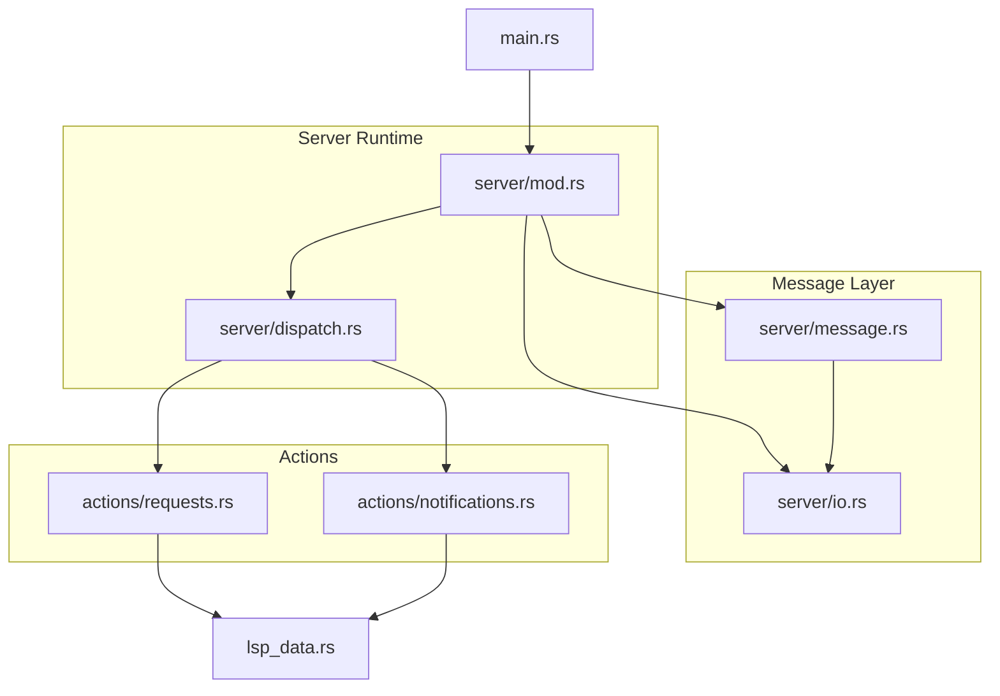
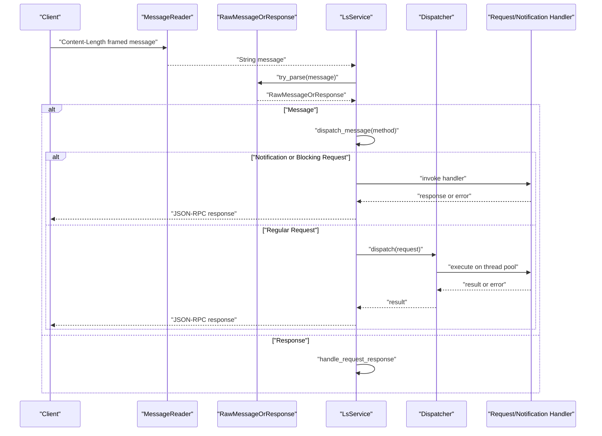
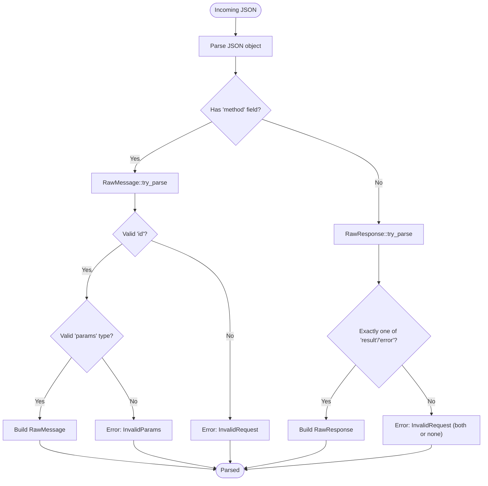
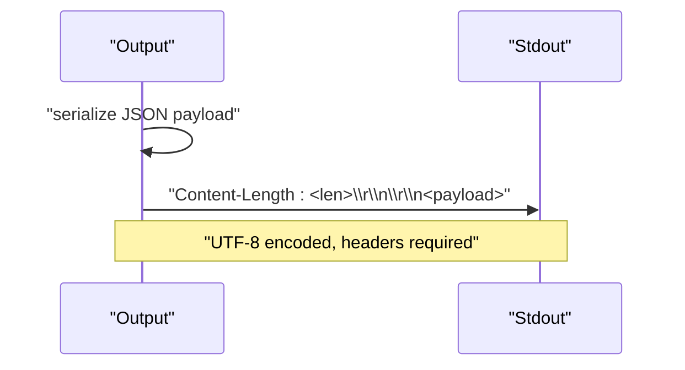
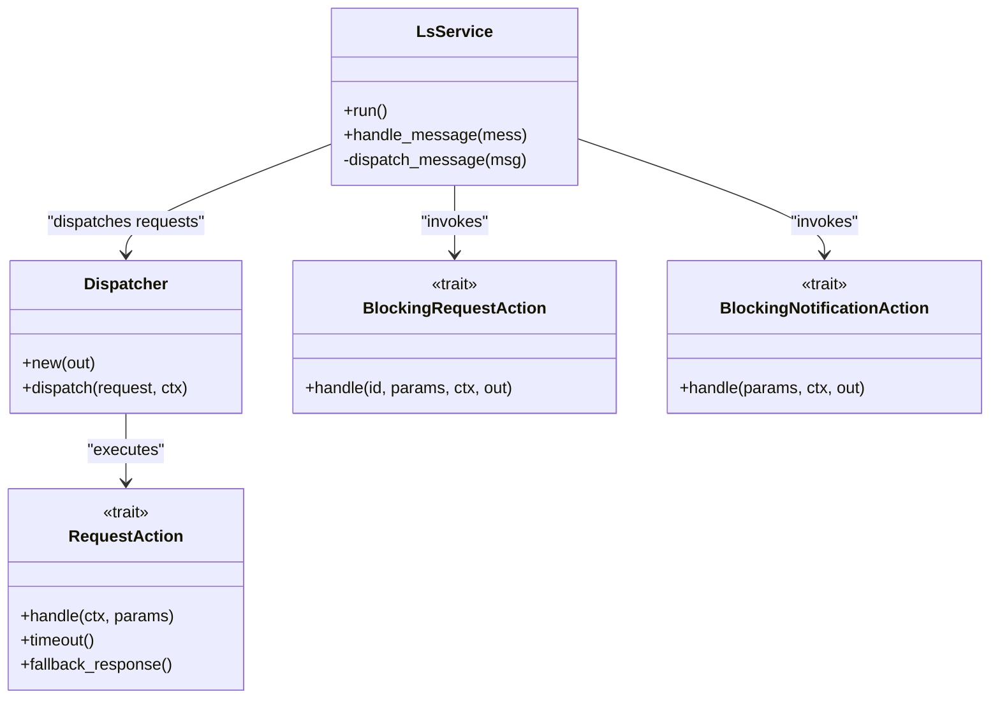
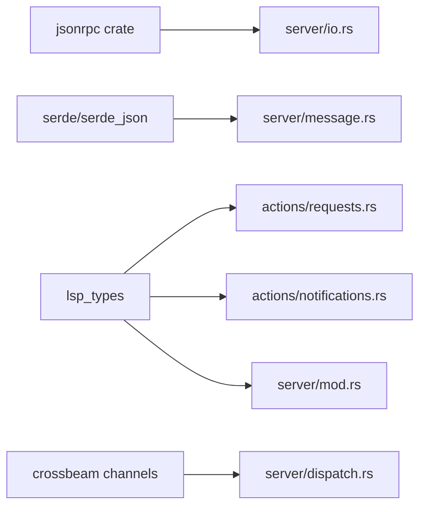

# Protocol Fundamentals and Message Format

<cite>
**Referenced Files in This Document**
- [message.rs](file://src/server/message.rs)
- [io.rs](file://src/server/io.rs)
- [mod.rs](file://src/server/mod.rs)
- [dispatch.rs](file://src/server/dispatch.rs)
- [lsp_data.rs](file://src/lsp_data.rs)
- [requests.rs](file://src/actions/requests.rs)
- [notifications.rs](file://src/actions/notifications.rs)
- [main.rs](file://src/main.rs)
</cite>

## Table of Contents
1. [Introduction](#introduction)
2. [Project Structure](#project-structure)
3. [Core Components](#core-components)
4. [Architecture Overview](#architecture-overview)
5. [Detailed Component Analysis](#detailed-component-analysis)
6. [Dependency Analysis](#dependency-analysis)
7. [Performance Considerations](#performance-considerations)
8. [Troubleshooting Guide](#troubleshooting-guide)
9. [Conclusion](#conclusion)

## Introduction
This document explains the Language Server Protocol (LSP) fundamentals as implemented in the DML Language Server. It covers the JSON-RPC 2.0 message format, request/response lifecycle, notification handling, error codes, and the parsing/serialization mechanisms. Practical examples illustrate typical message exchanges, protocol compliance requirements, and debugging techniques for message-level issues. Special considerations for DML language server implementation are highlighted throughout.

## Project Structure
The LSP implementation is centered around three primary modules:
- Server IO and message parsing: handles transport framing, JSON-RPC parsing, and raw message representation
- Server runtime and dispatch: orchestrates request/response handling, method routing, timeouts, and error propagation
- Actions: defines concrete LSP requests and notifications and their handlers

**Diagram sources**
- [mod.rs](file://src/server/mod.rs#L291-L472)
- [io.rs](file://src/server/io.rs#L19-L110)
- [message.rs](file://src/server/message.rs#L311-L396)
- [dispatch.rs](file://src/server/dispatch.rs#L31-L116)
- [requests.rs](file://src/actions/requests.rs#L23-L43)
- [notifications.rs](file://src/actions/notifications.rs#L23-L28)
- [lsp_data.rs](file://src/lsp_data.rs#L9-L12)
- [main.rs](file://src/main.rs#L44-L59)

**Section sources**
- [mod.rs](file://src/server/mod.rs#L291-L472)
- [io.rs](file://src/server/io.rs#L19-L110)
- [message.rs](file://src/server/message.rs#L311-L396)
- [dispatch.rs](file://src/server/dispatch.rs#L31-L116)
- [requests.rs](file://src/actions/requests.rs#L23-L43)
- [notifications.rs](file://src/actions/notifications.rs#L23-L28)
- [lsp_data.rs](file://src/lsp_data.rs#L9-L12)
- [main.rs](file://src/main.rs#L44-L59)

## Core Components
- RawMessage: JSON-RPC 2.0 envelope with method, id, and params; supports serialization with "jsonrpc": "2.0" and conditional inclusion of id and params
- RawResponse: JSON-RPC 2.0 response envelope with id and either result or error
- RawMessageOrResponse: Discriminator for incoming messages that are either requests/notifications or responses
- Output: Transport abstraction for sending responses and notifications over stdout with Content-Length framing and UTF-8 encoding
- MessageReader: Transport abstraction for reading framed messages from stdin
- Request/Notification: Strongly-typed wrappers for LSP methods with parameter deserialization and display formatting

Key protocol behaviors:
- Requests require an id (string or number); Notifications do not include id
- Missing params are represented internally as null to simplify type handling
- Responses must include exactly one of result or error; both or neither is invalid
- Transport framing uses Content-Length and Content-Type: utf-8

**Section sources**
- [message.rs](file://src/server/message.rs#L311-L396)
- [message.rs](file://src/server/message.rs#L420-L476)
- [message.rs](file://src/server/message.rs#L478-L520)
- [io.rs](file://src/server/io.rs#L17-L18)
- [io.rs](file://src/server/io.rs#L19-L40)
- [io.rs](file://src/server/io.rs#L46-L110)
- [io.rs](file://src/server/io.rs#L112-L189)

## Architecture Overview
The server reads framed messages from stdin, parses them into RawMessage/RawResponse, routes them to appropriate handlers, and writes responses back to stdout. Blocking requests and notifications are handled synchronously; other requests are dispatched to a worker pool with timeouts.

**Diagram sources**
- [io.rs](file://src/server/io.rs#L46-L110)
- [message.rs](file://src/server/message.rs#L483-L496)
- [mod.rs](file://src/server/mod.rs#L322-L367)
- [mod.rs](file://src/server/mod.rs#L382-L471)
- [dispatch.rs](file://src/server/dispatch.rs#L122-L157)

**Section sources**
- [io.rs](file://src/server/io.rs#L46-L110)
- [message.rs](file://src/server/message.rs#L483-L496)
- [mod.rs](file://src/server/mod.rs#L322-L367)
- [mod.rs](file://src/server/mod.rs#L382-L471)
- [dispatch.rs](file://src/server/dispatch.rs#L122-L157)

## Detailed Component Analysis

### JSON-RPC 2.0 Message Parsing and Serialization
- RawMessage serialization ensures "jsonrpc": "2.0" is always present and conditionally serializes id and params
- RawMessage parsing validates method type, id presence/format, and params shape; missing params are normalized to null
- RawResponse parsing enforces mutual exclusivity of result and error and validates id
- RawMessageOrResponse discriminates between incoming messages and responses

**Diagram sources**
- [message.rs](file://src/server/message.rs#L366-L396)
- [message.rs](file://src/server/message.rs#L435-L476)
- [message.rs](file://src/server/message.rs#L483-L496)

**Section sources**
- [message.rs](file://src/server/message.rs#L366-L396)
- [message.rs](file://src/server/message.rs#L435-L476)
- [message.rs](file://src/server/message.rs#L483-L496)

### Transport Framing and Output
- read_message enforces Content-Length and Content-Type headers, UTF-8 decoding, and proper framing
- Output.response composes Content-Length: N followed by CRLF CRLF and the JSON payload
- Output.success formats a standard JSON-RPC response with "jsonrpc":"2.0" and "result"
- Output.failure formats a JSON-RPC response with "jsonrpc":"2.0" and "error"

**Diagram sources**
- [io.rs](file://src/server/io.rs#L46-L110)
- [io.rs](file://src/server/io.rs#L204-L219)
- [io.rs](file://src/server/io.rs#L156-L179)
- [io.rs](file://src/server/io.rs#L120-L154)

**Section sources**
- [io.rs](file://src/server/io.rs#L46-L110)
- [io.rs](file://src/server/io.rs#L204-L219)
- [io.rs](file://src/server/io.rs#L156-L179)
- [io.rs](file://src/server/io.rs#L120-L154)

### Request/Response Lifecycle and Method Routing
- LsService.run spawns a reader thread that parses inbound messages and forwards them to the main loop
- handle_message dispatches to dispatch_message, which routes by method to:
  - Blocking notifications and requests (handled immediately)
  - Regular requests (dispatched to worker pool with timeout)
- BlockingRequestAction and BlockingNotificationAction define the interface for immediate handlers
- RequestAction defines the interface for async handlers with timeouts and fallback responses

**Diagram sources**
- [mod.rs](file://src/server/mod.rs#L322-L471)
- [dispatch.rs](file://src/server/dispatch.rs#L122-L185)
- [message.rs](file://src/server/message.rs#L105-L124)

**Section sources**
- [mod.rs](file://src/server/mod.rs#L322-L471)
- [dispatch.rs](file://src/server/dispatch.rs#L122-L185)
- [message.rs](file://src/server/message.rs#L105-L124)

### Error Handling Strategies
- StandardError codes are mapped to JSON-RPC error codes using standard_error
- InvalidParams, InvalidRequest, ParseError are raised during parsing/validation
- ResponseError carries either empty or message-based errors; message-based errors include a code and message
- Output.failure_message accepts a numeric code value; otherwise falls back to InternalError

Common error scenarios:
- Missing or invalid id in requests
- Unsupported parameter types
- Both result and error present in responses
- Unknown or unsupported method names
- Server not initialized when handling requests

**Section sources**
- [message.rs](file://src/server/message.rs#L8-L12)
- [message.rs](file://src/server/message.rs#L333-L348)
- [message.rs](file://src/server/message.rs#L358-L361)
- [message.rs](file://src/server/message.rs#L460-L471)
- [io.rs](file://src/server/io.rs#L144-L154)
- [mod.rs](file://src/server/mod.rs#L63-L65)
- [mod.rs](file://src/server/mod.rs#L99-L106)

### Practical Examples of LSP Message Exchanges
- Request with string id and no params
  - Client sends: {"jsonrpc":"2.0","id":"abc","method":"someRpcCall"}
  - Server parses into RawMessage and dispatches to handler
- Request with numeric id and params
  - Client sends: {"jsonrpc":"2.0","id":1,"method":"initialize","params":{...}}
  - Server responds with InitializeResult immediately upon InitializeRequest
- Response with result
  - Server sends: {"jsonrpc":"2.0","id":"abc","result":{"this":0,"really":"could","be":["anything"]}}
- Response with error
  - Server sends: {"jsonrpc":"2.0","id":"abc","error":{"code":0,"message":"oh no!"}}

These examples reflect the parsing and serialization behavior validated by unit tests.

**Section sources**
- [message.rs](file://src/server/message.rs#L547-L565)
- [message.rs](file://src/server/message.rs#L567-L585)
- [message.rs](file://src/server/message.rs#L659-L683)
- [message.rs](file://src/server/message.rs#L684-L710)

### Protocol Compliance Requirements
- Transport framing: Content-Length header required; Content-Type must be utf-8
- JSON-RPC 2.0 envelope: "jsonrpc":"2.0" required
- Requests: must include id (string or number)
- Notifications: must not include id
- Responses: must include id and exactly one of result or error
- Parameter handling: missing params represented as null; arrays and objects supported

**Section sources**
- [io.rs](file://src/server/io.rs#L46-L110)
- [message.rs](file://src/server/message.rs#L398-L418)
- [message.rs](file://src/server/message.rs#L366-L396)
- [message.rs](file://src/server/message.rs#L435-L476)

### Debugging Techniques for Message-Level Issues
- Enable logging to capture parsing failures and dispatch errors
- Inspect raw message strings to verify framing and JSON validity
- Validate that Content-Length matches the actual payload length
- Confirm method names match LSPRequest::METHOD or LSPNotification::METHOD
- Check that id types conform to string or number as per JSON-RPC 2.0
- Verify that params are either omitted, null, an object, or an array

**Section sources**
- [io.rs](file://src/server/io.rs#L334-L367)
- [mod.rs](file://src/server/mod.rs#L347-L367)
- [mod.rs](file://src/server/mod.rs#L625-L633)

## Dependency Analysis
The server’s LSP implementation depends on:
- jsonrpc crate for standardized error codes and response structures
- serde/serde_json for JSON serialization/deserialization
- lsp_types for LSP method definitions and capability structures
- crossbeam channels for inter-thread communication in the dispatcher

**Diagram sources**
- [io.rs](file://src/server/io.rs#L1-L15)
- [message.rs](file://src/server/message.rs#L9-L18)
- [requests.rs](file://src/actions/requests.rs#L1-L10)
- [notifications.rs](file://src/actions/notifications.rs#L1-L15)
- [mod.rs](file://src/server/mod.rs#L1-L50)
- [dispatch.rs](file://src/server/dispatch.rs#L1-L10)

**Section sources**
- [io.rs](file://src/server/io.rs#L1-L15)
- [message.rs](file://src/server/message.rs#L9-L18)
- [requests.rs](file://src/actions/requests.rs#L1-L10)
- [notifications.rs](file://src/actions/notifications.rs#L1-L15)
- [mod.rs](file://src/server/mod.rs#L1-L50)
- [dispatch.rs](file://src/server/dispatch.rs#L1-L10)

## Performance Considerations
- Worker-pool dispatch: Long-running requests are executed on a thread pool with timeouts to prevent starvation
- Request timeouts: DEFAULT_REQUEST_TIMEOUT governs fallback behavior for slow requests
- Non-blocking design: Notifications and regular requests are handled asynchronously to keep stdin free
- Minimal allocations: RawMessage serializes only necessary fields (id and params) based on presence

**Section sources**
- [dispatch.rs](file://src/server/dispatch.rs#L22-L29)
- [dispatch.rs](file://src/server/dispatch.rs#L161-L185)
- [dispatch.rs](file://src/server/dispatch.rs#L122-L157)

## Troubleshooting Guide
Common issues and resolutions:
- Parse errors: Occur when JSON is invalid or headers are missing/incorrect; check Content-Length and UTF-8 encoding
- InvalidRequest: Raised when id is missing or malformed, or when both result and error are present in a response
- InvalidParams: Raised when params cannot be deserialized; ensure params match the expected structure
- Internal errors: Emitted when handlers return empty responses or unexpected conditions
- Initialization errors: Requests before initialize may receive a specific error code indicating server not ready

**Section sources**
- [io.rs](file://src/server/io.rs#L334-L367)
- [message.rs](file://src/server/message.rs#L333-L348)
- [message.rs](file://src/server/message.rs#L358-L361)
- [message.rs](file://src/server/message.rs#L460-L471)
- [mod.rs](file://src/server/mod.rs#L63-L65)
- [mod.rs](file://src/server/mod.rs#L99-L106)

## Conclusion
The DML Language Server implements a robust LSP over JSON-RPC 2.0 with strict parsing, compliant transport framing, and clear error semantics. The design separates immediate handling for notifications and blocking requests from asynchronous dispatch for regular requests, ensuring responsiveness and reliability. Adhering to the outlined protocol requirements and using the provided debugging techniques will help maintain protocol compliance and smooth operation.