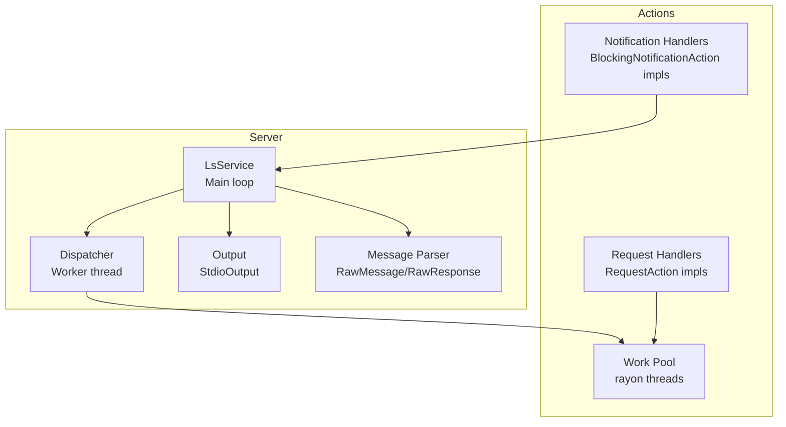
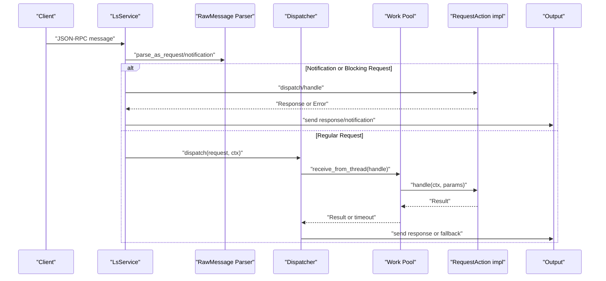
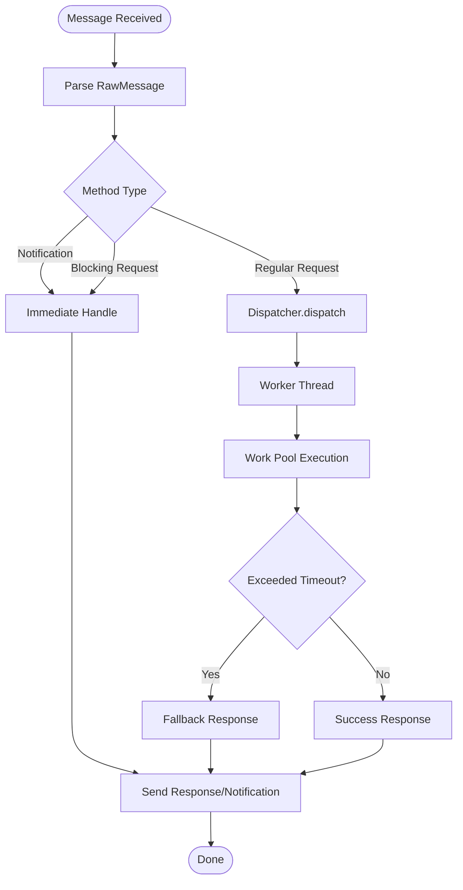
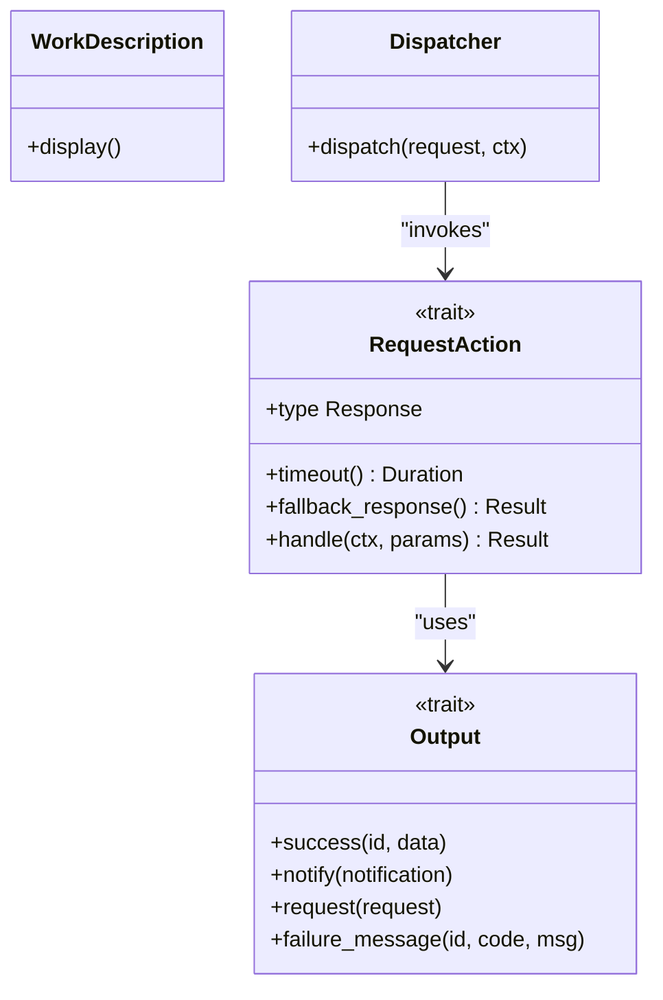
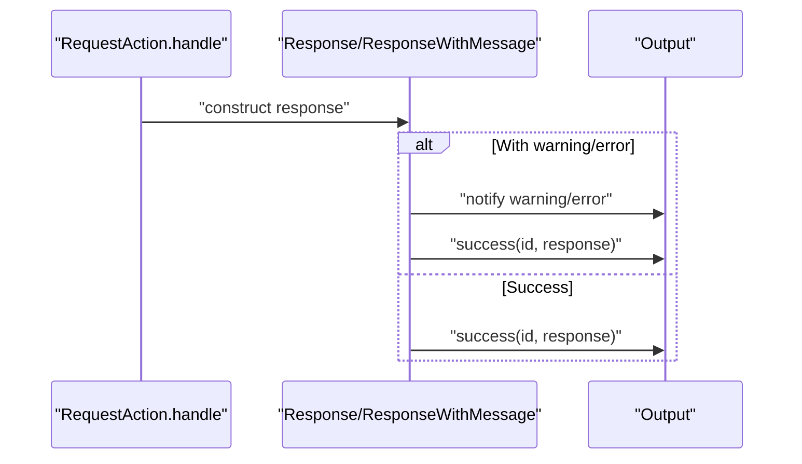
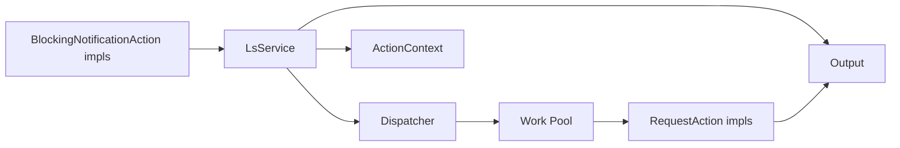

# Request Dispatch and Routing

<cite>
**Referenced Files in This Document**
- [dispatch.rs](file://src/server/dispatch.rs)
- [mod.rs](file://src/server/mod.rs)
- [message.rs](file://src/server/message.rs)
- [io.rs](file://src/server/io.rs)
- [requests.rs](file://src/actions/requests.rs)
- [notifications.rs](file://src/actions/notifications.rs)
- [work_pool.rs](file://src/actions/work_pool.rs)
- [concurrency.rs](file://src/concurrency.rs)
- [lsp_data.rs](file://src/lsp_data.rs)
- [lib.rs](file://src/lib.rs)
</cite>

## Table of Contents
1. [Introduction](#introduction)
2. [Project Structure](#project-structure)
3. [Core Components](#core-components)
4. [Architecture Overview](#architecture-overview)
5. [Detailed Component Analysis](#detailed-component-analysis)
6. [Dependency Analysis](#dependency-analysis)
7. [Performance Considerations](#performance-considerations)
8. [Troubleshooting Guide](#troubleshooting-guide)
9. [Conclusion](#conclusion)

## Introduction
This document explains the request dispatch and routing system of the DML Language Server. It covers the Dispatcher architecture, method matching, request categorization into notifications, blocking requests, and regular requests, the dispatch_action-like RequestAction trait system, request/response handling patterns, and the three-tier processing model (immediate, queued, timeout). It also documents response serialization, error propagation, examples of custom request handlers, performance optimization techniques, debugging approaches for dispatch failures, concurrent request handling, priority queuing, and resource contention management.

## Project Structure
The dispatch and routing logic spans several modules:
- Server core: message parsing, request/response traits, output handling, and the main service loop
- Actions: request handlers implementing RequestAction and notification handlers implementing BlockingNotificationAction
- Concurrency: job tracking and worker pool integration
- LSP data: LSPRequest/LSPNotification traits and utilities

**Diagram sources**
- [mod.rs](file://src/server/mod.rs#L291-L470)
- [dispatch.rs](file://src/server/dispatch.rs#L113-L147)
- [message.rs](file://src/server/message.rs#L185-L275)
- [io.rs](file://src/server/io.rs#L113-L189)
- [requests.rs](file://src/actions/requests.rs#L401-L424)
- [notifications.rs](file://src/actions/notifications.rs#L32-L72)
- [work_pool.rs](file://src/actions/work_pool.rs#L34-L38)

**Section sources**
- [mod.rs](file://src/server/mod.rs#L1-L80)
- [lib.rs](file://src/lib.rs#L31-L47)

## Core Components
- Dispatcher: a worker-threaded dispatcher that forwards requests to the work pool and handles timeouts
- RequestAction: trait for regular (non-blocking) requests with timeout and fallback behavior
- BlockingNotificationAction and BlockingRequestAction: traits for immediate handling on the main thread
- WorkDescription and receive_from_thread: worker pool integration with concurrency limits and warnings
- Output: JSON-RPC serialization and sending responses/notifications
- LSPRequest/LSPNotification: LSP method contracts used for method matching and parsing

Key behaviors:
- Immediate handling: notifications and blocking requests are handled synchronously on the main thread
- Deferred handling: regular requests are dispatched to a worker thread and executed via the work pool
- Timeout handling: requests check elapsed time against per-request timeout and return fallback responses when exceeded
- Error propagation: ResponseError carries either empty or structured error responses; Output methods serialize and send them

**Section sources**
- [dispatch.rs](file://src/server/dispatch.rs#L113-L168)
- [message.rs](file://src/server/message.rs#L107-L124)
- [message.rs](file://src/server/message.rs#L34-L47)
- [work_pool.rs](file://src/actions/work_pool.rs#L53-L103)
- [io.rs](file://src/server/io.rs#L113-L189)
- [lsp_data.rs](file://src/lsp_data.rs#L9-L12)

## Architecture Overview
The server’s main loop reads messages, parses them into RawMessage or RawResponse, and routes them to the appropriate handler category. Notifications and blocking requests are handled immediately on the main thread. Regular requests are dispatched to a worker thread and executed asynchronously with timeout protection.

**Diagram sources**
- [mod.rs](file://src/server/mod.rs#L472-L598)
- [dispatch.rs](file://src/server/dispatch.rs#L113-L147)
- [dispatch.rs](file://src/server/dispatch.rs#L50-L84)
- [work_pool.rs](file://src/actions/work_pool.rs#L53-L103)
- [message.rs](file://src/server/message.rs#L185-L275)
- [io.rs](file://src/server/io.rs#L157-L189)

## Detailed Component Analysis

### Dispatcher and Method Matching
- The Dispatcher wraps a channel to a dedicated worker thread and a Job token registry for lifecycle management.
- Method matching is centralized in the main loop using a macro-driven match over LSP method strings. Notifications and blocking requests are dispatched immediately; regular requests are dispatched to the worker thread.
- The macro enum DispatchRequest encapsulates all supported request types and delegates to their respective RequestAction implementations.

Processing flow:
- LsService.handle_message parses the message and routes it to dispatch_message
- dispatch_message uses a macro to match the method string against known LSP methods
- Notifications and blocking requests are handled immediately
- Regular requests are dispatched via Dispatcher.dispatch

**Diagram sources**
- [mod.rs](file://src/server/mod.rs#L472-L598)
- [dispatch.rs](file://src/server/dispatch.rs#L113-L147)
- [dispatch.rs](file://src/server/dispatch.rs#L50-L84)

**Section sources**
- [mod.rs](file://src/server/mod.rs#L472-L598)
- [dispatch.rs](file://src/server/dispatch.rs#L32-L87)

### RequestAction Trait and Three-Tier Processing Model
The RequestAction trait defines the contract for regular requests:
- Response type must implement server::Response
- timeout(): per-request timeout (defaults to DEFAULT_REQUEST_TIMEOUT)
- fallback_response(): response returned when timeout occurs
- handle(): the processing logic executed on the work pool

Three-tier processing:
- Immediate: notifications and blocking requests handled synchronously on the main thread
- Queued: regular requests enqueued to the work pool with concurrency limits
- Timeout: requests check elapsed time before starting work and return fallback responses if already timed out

**Diagram sources**
- [dispatch.rs](file://src/server/dispatch.rs#L151-L168)
- [work_pool.rs](file://src/actions/work_pool.rs#L13-L20)
- [io.rs](file://src/server/io.rs#L113-L189)
- [dispatch.rs](file://src/server/dispatch.rs#L113-L147)

**Section sources**
- [dispatch.rs](file://src/server/dispatch.rs#L151-L168)
- [work_pool.rs](file://src/actions/work_pool.rs#L47-L103)

### Request/Response Handling Patterns and Serialization
- RawMessage and RawResponse provide parsing and serialization for JSON-RPC messages
- Request and Notification wrappers carry method metadata and parameters
- Response trait abstracts sending responses; ResponseWithMessage augments responses with warnings or errors
- Output serializes and sends responses/notifications; failure_message/custom_failure handle error propagation

**Diagram sources**
- [message.rs](file://src/server/message.rs#L34-L47)
- [message.rs](file://src/server/message.rs#L69-L96)
- [io.rs](file://src/server/io.rs#L157-L189)

**Section sources**
- [message.rs](file://src/server/message.rs#L34-L96)
- [io.rs](file://src/server/io.rs#L157-L189)

### Examples of Custom Request Handlers
- WorkspaceSymbolRequest: implements RequestAction with fallback returning None
- DocumentSymbolRequest: implements RequestAction with fallback returning None
- HoverRequest: implements RequestAction returning a Hover response with fallback of empty contents
- GotoDefinition/Declaration/Implementation/References: implement RequestAction with increased timeouts and response augmentation via ResponseWithMessage
- ExecuteCommand: implements RequestAction returning a server-to-client request (ApplyWorkspaceEdit) followed by an Ack
- Formatting/RangeFormatting: implement RequestAction with error fallbacks
- ResolveCompletion/CodeLensRequest: implement RequestAction with empty fallbacks
- GetKnownContextsRequest: implements RequestAction with extended timeout and context-aware filtering

These handlers demonstrate:
- Using fallback_response for graceful degradation
- Leveraging ResponseWithMessage to attach user-visible warnings
- Integrating with Output to emit notifications and requests
- Waiting for analysis state via InitActionContext.wait_for_state

**Section sources**
- [requests.rs](file://src/actions/requests.rs#L401-L424)
- [requests.rs](file://src/actions/requests.rs#L426-L458)
- [requests.rs](file://src/actions/requests.rs#L460-L480)
- [requests.rs](file://src/actions/requests.rs#L482-L544)
- [requests.rs](file://src/actions/requests.rs#L546-L602)
- [requests.rs](file://src/actions/requests.rs#L604-L660)
- [requests.rs](file://src/actions/requests.rs#L662-L717)
- [requests.rs](file://src/actions/requests.rs#L719-L733)
- [requests.rs](file://src/actions/requests.rs#L735-L749)
- [requests.rs](file://src/actions/requests.rs#L751-L768)
- [requests.rs](file://src/actions/requests.rs#L776-L795)
- [requests.rs](file://src/actions/requests.rs#L797-L812)
- [requests.rs](file://src/actions/requests.rs#L835-L871)
- [requests.rs](file://src/actions/requests.rs#L886-L899)
- [requests.rs](file://src/actions/requests.rs#L925-L986)

### Notification Handling
Notifications are handled immediately on the main thread via BlockingNotificationAction implementations:
- Initialized: registers capabilities and watchers
- DidOpenTextDocument/DidCloseTextDocument: updates VFS and schedules analysis
- DidChangeTextDocument: applies changes to VFS, marks files dirty, optionally triggers analysis
- DidSaveTextDocument: saves file via VFS and optionally triggers analysis
- DidChangeConfiguration: pulls configuration from client and updates settings
- DidChangeWatchedFiles: refreshes compilation info and linter config when relevant
- DidChangeWorkspaceFolders: updates workspace roots
- Cancel: no-op placeholder
- ChangeActiveContexts: updates active device contexts and re-reports diagnostics

**Section sources**
- [notifications.rs](file://src/actions/notifications.rs#L32-L72)
- [notifications.rs](file://src/actions/notifications.rs#L74-L91)
- [notifications.rs](file://src/actions/notifications.rs#L93-L105)
- [notifications.rs](file://src/actions/notifications.rs#L107-L163)
- [notifications.rs](file://src/actions/notifications.rs#L165-L174)
- [notifications.rs](file://src/actions/notifications.rs#L176-L223)
- [notifications.rs](file://src/actions/notifications.rs#L225-L241)
- [notifications.rs](file://src/actions/notifications.rs#L243-L257)
- [notifications.rs](file://src/actions/notifications.rs#L259-L271)
- [notifications.rs](file://src/actions/notifications.rs#L313-L352)

### Blocking Requests
Blocking requests are handled synchronously on the main thread and may wait for concurrent jobs depending on the request semantics:
- InitializeRequest: validates initialization options, sends response early, initializes context, and triggers initial analysis
- ShutdownRequest: waits for concurrent jobs, sets shutdown flag, and returns Ack

**Section sources**
- [mod.rs](file://src/server/mod.rs#L86-L107)
- [mod.rs](file://src/server/mod.rs#L207-L289)

## Dependency Analysis
The dispatch system integrates tightly with the server loop, message parsing, output, and work pool. Key dependencies:
- LsService depends on Dispatcher, Output, and ActionContext
- Dispatcher depends on work_pool and concurrency primitives
- RequestAction implementations depend on InitActionContext and Output
- Notifications depend on InitActionContext for stateful operations

**Diagram sources**
- [mod.rs](file://src/server/mod.rs#L291-L320)
- [dispatch.rs](file://src/server/dispatch.rs#L113-L147)
- [work_pool.rs](file://src/actions/work_pool.rs#L34-L38)
- [requests.rs](file://src/actions/requests.rs#L401-L424)
- [notifications.rs](file://src/actions/notifications.rs#L32-L72)

**Section sources**
- [mod.rs](file://src/server/mod.rs#L291-L320)
- [dispatch.rs](file://src/server/dispatch.rs#L113-L147)
- [work_pool.rs](file://src/actions/work_pool.rs#L34-L38)

## Performance Considerations
- Concurrency limits: the work pool caps total concurrent tasks and limits similar work types to prevent overload
- Timeout strategy: requests check elapsed time before starting work and return fallback responses promptly
- Worker thread pool: rayon-based threads with configurable number of workers
- Warning on long tasks: tasks exceeding a threshold duration log warnings
- Immediate vs deferred: notifications and blocking requests avoid worker overhead by handling on the main thread

Optimization techniques:
- Tune DEFAULT_REQUEST_TIMEOUT for client latency expectations
- Adjust MAX_SIMILAR_CONCURRENT_WORK to balance throughput and fairness
- Use wait_for_state judiciously to avoid unnecessary blocking
- Minimize heavy work in RequestAction.handle; delegate to analysis queues when possible

**Section sources**
- [work_pool.rs](file://src/actions/work_pool.rs#L22-L39)
- [work_pool.rs](file://src/actions/work_pool.rs#L41-L46)
- [work_pool.rs](file://src/actions/work_pool.rs#L95-L101)
- [dispatch.rs](file://src/server/dispatch.rs#L22-L29)
- [dispatch.rs](file://src/server/dispatch.rs#L58-L70)

## Troubleshooting Guide
Common issues and debugging approaches:
- Dispatch failures: LsService.handle_message logs dispatch errors and sends a generic internal error response
- Parsing errors: RawMessage.try_parse and RawResponse.try_parse return structured errors; Output.custom_failure sends standardized error responses
- Timeout handling: If a request exceeds its timeout, fallback_response is used; verify timeout values and workload characteristics
- Empty responses: ResponseError::Empty leads to a custom failure with internal error; ensure handlers return appropriate responses
- Worker capacity: receive_from_thread may refuse work if capacity is reached; monitor warnings and adjust NUM_THREADS or MAX_SIMILAR_CONCURRENT_WORK

Debugging tips:
- Enable logging around message parsing and dispatch
- Inspect RequestId and method names in logs
- Verify that notifications and blocking requests are handled on the main thread
- Confirm that regular requests reach the work pool and respect timeouts

**Section sources**
- [mod.rs](file://src/server/mod.rs#L624-L632)
- [message.rs](file://src/server/message.rs#L366-L396)
- [message.rs](file://src/server/message.rs#L435-L476)
- [io.rs](file://src/server/io.rs#L134-L154)
- [work_pool.rs](file://src/actions/work_pool.rs#L60-L78)

## Conclusion
The DML Language Server employs a clear separation of concerns for request dispatch and routing:
- Immediate handling for notifications and blocking requests ensures responsiveness
- Deferred handling via Dispatcher and work pool enables scalable processing of regular requests
- RequestAction provides a uniform interface for request handlers with timeout and fallback support
- Robust error propagation and response serialization maintain compatibility with the LSP specification
- Concurrency controls and warnings help manage resource contention and detect performance issues

This design supports extensibility through RequestAction and BlockingNotificationAction implementations, enabling developers to add new request handlers with minimal boilerplate while maintaining consistent performance and reliability.