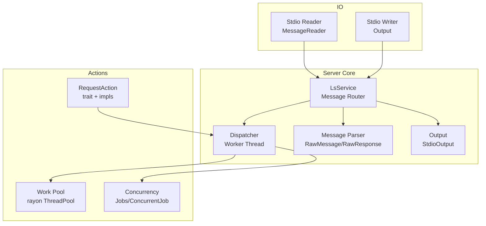
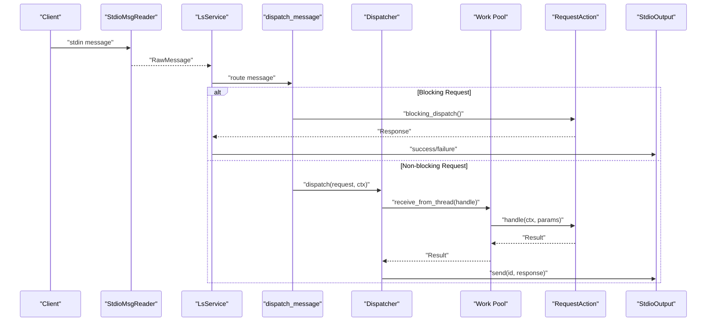
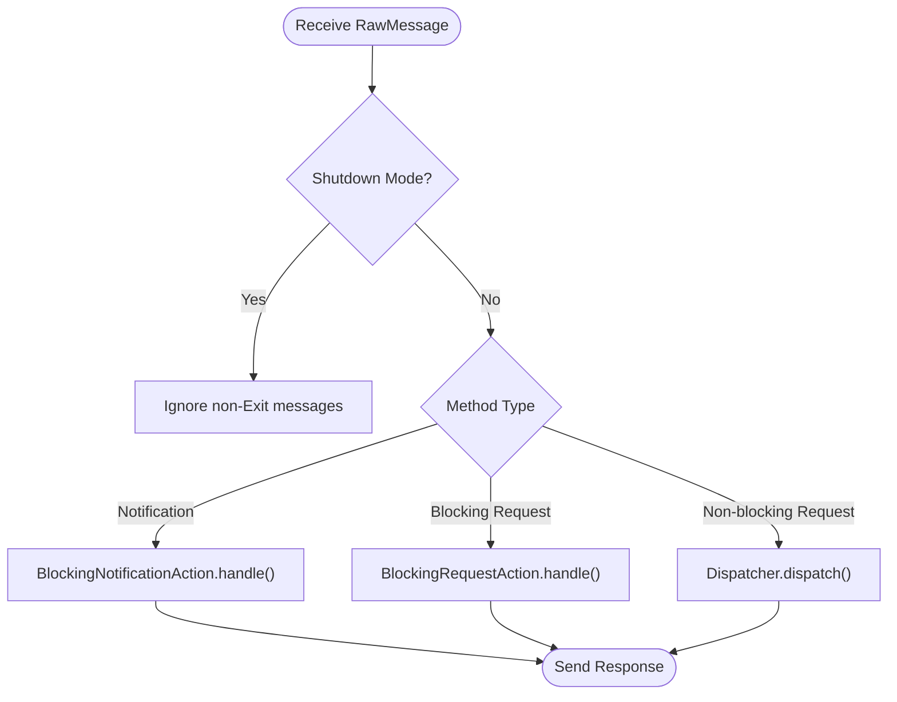
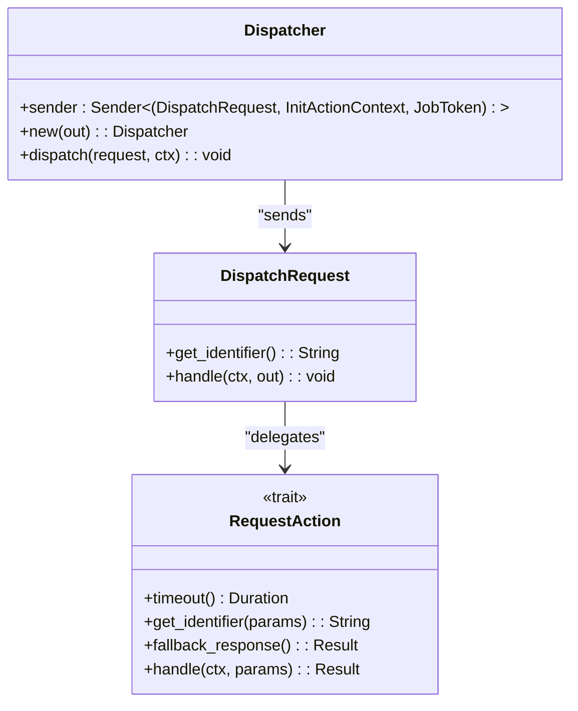
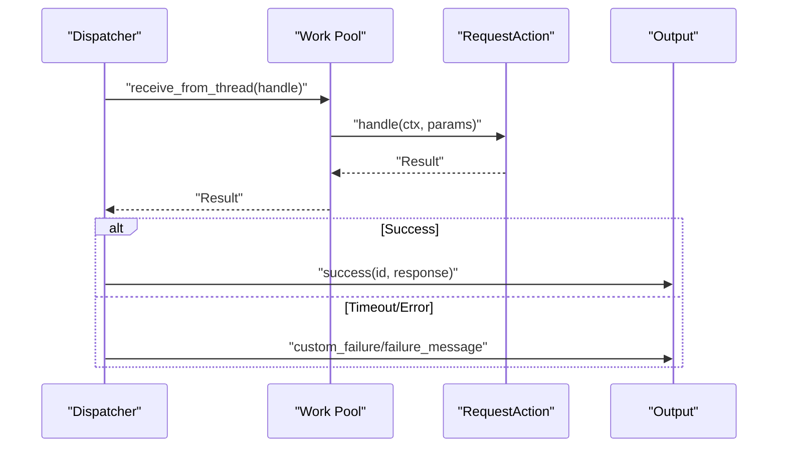
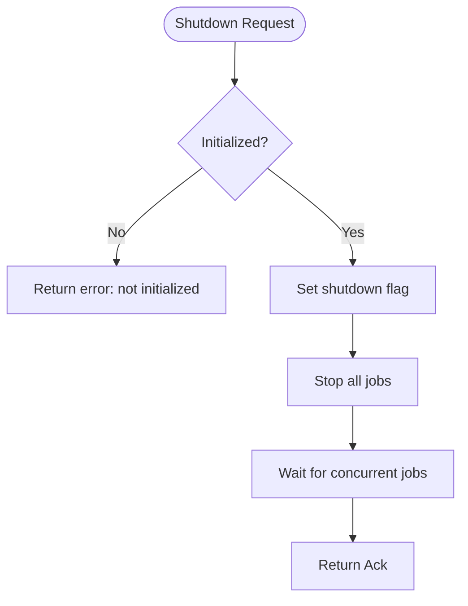
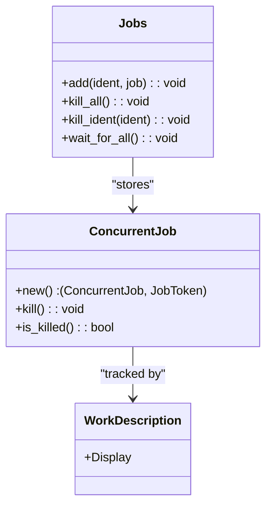
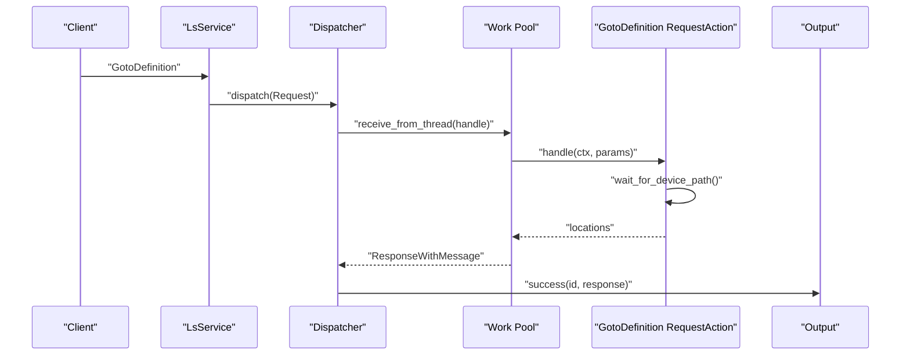
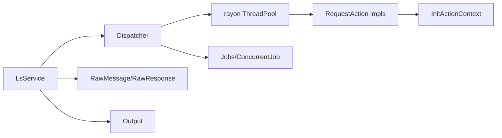

# Request Processing and Dispatch

<cite>
**Referenced Files in This Document**
- [dispatch.rs](file://src/server/dispatch.rs)
- [mod.rs](file://src/server/mod.rs)
- [message.rs](file://src/server/message.rs)
- [io.rs](file://src/server/io.rs)
- [requests.rs](file://src/actions/requests.rs)
- [work_pool.rs](file://src/actions/work_pool.rs)
- [concurrency.rs](file://src/concurrency.rs)
- [main.rs](file://src/main.rs)
- [lib.rs](file://src/lib.rs)
</cite>

## Table of Contents
1. [Introduction](#introduction)
2. [Project Structure](#project-structure)
3. [Core Components](#core-components)
4. [Architecture Overview](#architecture-overview)
5. [Detailed Component Analysis](#detailed-component-analysis)
6. [Dependency Analysis](#dependency-analysis)
7. [Performance Considerations](#performance-considerations)
8. [Troubleshooting Guide](#troubleshooting-guide)
9. [Conclusion](#conclusion)

## Introduction
This document explains the request processing and dispatch mechanisms of the DML Language Server. It covers how requests are routed, the distinction between synchronous and asynchronous handling, timeout management, the dispatcher architecture, request action registration, response generation, and blocking request handling for critical operations like shutdown and initialization. It also includes examples of request processing workflows, error propagation, performance optimization techniques, request queuing, priority handling, and concurrent request management strategies.

## Project Structure
The request processing pipeline spans several modules:
- Server core: message parsing, routing, and dispatch
- Action registry: request handlers and response types
- Concurrency: job tracking and worker pools
- IO: message framing and transport

**Diagram sources**
- [mod.rs](file://src/server/mod.rs#L291-L472)
- [dispatch.rs](file://src/server/dispatch.rs#L122-L157)
- [message.rs](file://src/server/message.rs#L185-L275)
- [io.rs](file://src/server/io.rs#L19-L23)
- [work_pool.rs](file://src/actions/work_pool.rs#L22-L39)
- [concurrency.rs](file://src/concurrency.rs#L70-L122)

**Section sources**
- [mod.rs](file://src/server/mod.rs#L1-L84)
- [lib.rs](file://src/lib.rs#L32-L48)

## Core Components
- Request routing and dispatch: LsService parses incoming messages, routes notifications, blocking requests, and non-blocking requests to appropriate handlers.
- Dispatcher: A dedicated worker thread and channel-based mechanism for non-blocking request processing with timeouts.
- RequestAction trait: Defines request handlers, timeouts, identifiers, and fallback responses.
- Work pool: Rayon-based thread pool for concurrent request execution with capacity and similar-work limiting.
- Concurrency primitives: Jobs table and ConcurrentJob tokens for tracking and cancellation of long-running tasks.
- Output and IO: Stdio-based message framing and transport with request ID management.

**Section sources**
- [dispatch.rs](file://src/server/dispatch.rs#L122-L185)
- [mod.rs](file://src/server/mod.rs#L474-L599)
- [work_pool.rs](file://src/actions/work_pool.rs#L53-L103)
- [concurrency.rs](file://src/concurrency.rs#L58-L122)
- [io.rs](file://src/server/io.rs#L113-L189)

## Architecture Overview
The server runs a main loop that reads messages from stdin, parses them, and routes them to either:
- Blocking handlers (notifications and specific blocking requests) executed synchronously on the main thread
- Non-blocking handlers dispatched to a worker thread via a channel, executed on the work pool with timeout protection

**Diagram sources**
- [mod.rs](file://src/server/mod.rs#L323-L472)
- [dispatch.rs](file://src/server/dispatch.rs#L126-L157)
- [work_pool.rs](file://src/actions/work_pool.rs#L53-L103)
- [io.rs](file://src/server/io.rs#L204-L219)

## Detailed Component Analysis

### Request Routing and Dispatch
- LsService.run spawns a client reader thread that reads messages and forwards them to the main loop via a channel.
- The main loop receives messages and delegates to dispatch_message, which:
  - Routes notifications to BlockingNotificationAction handlers (executed synchronously)
  - Routes blocking requests (e.g., Initialize, Shutdown) to BlockingRequestAction handlers (executed synchronously)
  - Routes non-blocking requests (e.g., Completion, GotoDefinition, References) to Dispatcher for async processing
- During shutdown, the server ignores non-Exit messages and responds to Exit appropriately.

**Diagram sources**
- [mod.rs](file://src/server/mod.rs#L605-L636)
- [mod.rs](file://src/server/mod.rs#L474-L599)

**Section sources**
- [mod.rs](file://src/server/mod.rs#L323-L472)
- [mod.rs](file://src/server/mod.rs#L605-L636)

### Dispatcher Architecture and Timeout Management
- Dispatcher wraps a worker thread and a channel. It creates a ConcurrentJob per request and registers it in the context’s Jobs table for tracking and cancellation.
- Each non-blocking request is wrapped in a DispatchRequest enum and sent to the worker thread.
- The worker thread:
  - Checks the request’s timeout against the time since reception
  - Uses the work pool to execute the handler with panic safety
  - Receives the result with a timeout equal to the request’s timeout
  - Sends the response or an error/fallback response

**Diagram sources**
- [dispatch.rs](file://src/server/dispatch.rs#L122-L185)

**Section sources**
- [dispatch.rs](file://src/server/dispatch.rs#L122-L185)

### Request Action Registration and Response Generation
- RequestAction is implemented for each supported request. Each implementation defines:
  - Response type
  - Identifier function for job tracking
  - Timeout override (default is DEFAULT_REQUEST_TIMEOUT)
  - Fallback response for timeouts
  - Handler logic
- Responses implement the Response trait and are sent via Output.success or custom failure methods.

**Diagram sources**
- [dispatch.rs](file://src/server/dispatch.rs#L60-L94)
- [work_pool.rs](file://src/actions/work_pool.rs#L53-L103)
- [message.rs](file://src/server/message.rs#L34-L47)

**Section sources**
- [requests.rs](file://src/actions/requests.rs#L276-L303)
- [requests.rs](file://src/actions/requests.rs#L500-L554)
- [message.rs](file://src/server/message.rs#L34-L47)

### Blocking Request Handling (Shutdown and Initialization)
- ShutdownRequest is a BlockingRequestAction that:
  - Sets a shutdown flag
  - Stops all jobs and waits for concurrent jobs to finish
  - Returns an Acknowledgement
- InitializeRequest is a BlockingRequestAction that:
  - Validates initialization options and reports unknown/deprecated/duplicated configuration keys
  - Sends the InitializeResult immediately
  - Initializes capabilities and workspace roots
  - Triggers analysis of implicit imports

**Diagram sources**
- [mod.rs](file://src/server/mod.rs#L86-L107)

**Section sources**
- [mod.rs](file://src/server/mod.rs#L86-L107)
- [mod.rs](file://src/server/mod.rs#L207-L289)

### Concurrency, Job Tracking, and Worker Pool
- Jobs table tracks ConcurrentJob instances keyed by request identifiers. It supports:
  - Adding jobs
  - Killing specific jobs or all jobs
  - Waiting for all jobs to complete
- Work pool enforces:
  - Total concurrency limit (number of threads)
  - Per-request-type concurrency limit (MAX_SIMILAR_CONCURRENT_WORK)
  - Panic isolation and warning on long-running tasks
- RequestAction implementations can override timeout and provide identifiers for job tracking.

**Diagram sources**
- [concurrency.rs](file://src/concurrency.rs#L70-L122)
- [work_pool.rs](file://src/actions/work_pool.rs#L13-L45)

**Section sources**
- [concurrency.rs](file://src/concurrency.rs#L58-L122)
- [work_pool.rs](file://src/actions/work_pool.rs#L53-L103)

### Request Processing Workflows and Examples
- Example: GotoDefinition
  - RequestAction::timeout increases timeout for heavy operations
  - Handler resolves position, waits for device analysis readiness, computes locations, and returns a ResponseWithMessage with warnings if applicable
- Example: GetKnownContextsRequest
  - Long-running request with extended timeout
  - Handler waits for isolated analysis existence, collects device contexts, converts to URIs, and returns a filtered list

**Diagram sources**
- [requests.rs](file://src/actions/requests.rs#L500-L554)
- [dispatch.rs](file://src/server/dispatch.rs#L60-L94)

**Section sources**
- [requests.rs](file://src/actions/requests.rs#L500-L554)
- [requests.rs](file://src/actions/requests.rs#L863-L943)

### Error Propagation and Response Generation
- ResponseError variants:
  - Empty: no response
  - Message: client-visible error with code and message
- Response trait:
  - Response::send handles serialization and success responses
  - ResponseWithMessage can attach warnings or errors alongside the response
- Output trait:
  - Provides success, failure, and failure_message helpers
  - Manages request ID allocation and message framing

**Section sources**
- [message.rs](file://src/server/message.rs#L49-L96)
- [message.rs](file://src/server/message.rs#L113-L124)
- [io.rs](file://src/server/io.rs#L113-L189)

## Dependency Analysis
- LsService depends on:
  - Dispatcher for non-blocking request handling
  - Message parsing for routing decisions
  - Output for response emission
- Dispatcher depends on:
  - Work pool for execution
  - ConcurrentJob for job lifecycle
  - RequestAction implementations for request handling
- RequestAction implementations depend on:
  - InitActionContext for analysis and configuration
  - Path resolution and VFS for file operations
  - ResponseWithMessage for partial-result warnings

**Diagram sources**
- [mod.rs](file://src/server/mod.rs#L291-L320)
- [dispatch.rs](file://src/server/dispatch.rs#L122-L157)
- [work_pool.rs](file://src/actions/work_pool.rs#L22-L39)
- [concurrency.rs](file://src/concurrency.rs#L70-L122)

**Section sources**
- [mod.rs](file://src/server/mod.rs#L291-L320)
- [dispatch.rs](file://src/server/dispatch.rs#L122-L157)

## Performance Considerations
- Timeout strategy:
  - DEFAULT_REQUEST_TIMEOUT governs default timeouts
  - Some requests override timeout for heavier operations
  - Worker checks elapsed time before starting work to avoid wasted CPU
- Concurrency limits:
  - Work pool limits total threads and per-type concurrency to prevent overload
  - Warnings logged for long-running tasks exceeding a threshold
- Request queuing:
  - Channel-based dispatcher prevents message drops and ensures non-blocking stdin
  - Jobs table enables coordinated cancellation during shutdown
- Recommendations:
  - Prefer shorter timeouts for frequently invoked lightweight requests
  - Use wait_for_device_path and similar waits to avoid redundant computation
  - Monitor warning logs for long-running tasks and adjust thread count if needed

[No sources needed since this section provides general guidance]

## Troubleshooting Guide
- Timeout-related issues:
  - If a request times out, fallback_response is used and an error is returned
  - Check request-specific timeout overrides and increase if necessary for heavy operations
- Shutdown hangs:
  - Ensure stop_all_jobs and wait_for_concurrent_jobs are invoked
  - Verify no orphaned ConcurrentJob remains unclosed
- Parsing errors:
  - RawMessage parsing validates method, id, and params; errors are reported as ParseError or InvalidRequest
- Serialization failures:
  - Output.success logs serialization errors and avoids sending malformed responses

**Section sources**
- [dispatch.rs](file://src/server/dispatch.rs#L78-L94)
- [work_pool.rs](file://src/actions/work_pool.rs#L95-L101)
- [message.rs](file://src/server/message.rs#L318-L396)
- [io.rs](file://src/server/io.rs#L156-L169)

## Conclusion
The DML Language Server employs a robust request processing architecture:
- Clear separation between blocking and non-blocking handlers
- Reliable timeout management with fallback responses
- A dedicated dispatcher and work pool for concurrent, controlled execution
- Strong error propagation and response generation
- Comprehensive job tracking and graceful shutdown

This design ensures responsiveness, reliability, and scalability for a wide range of LSP requests while maintaining predictable behavior under load.