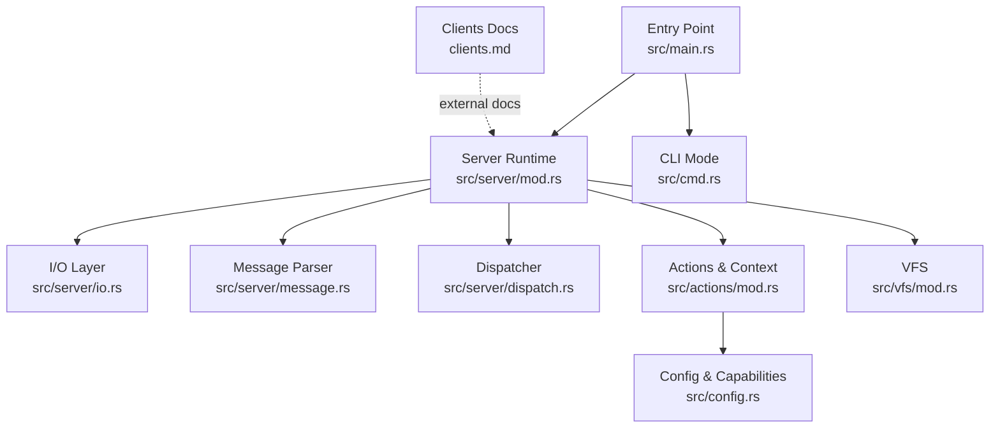
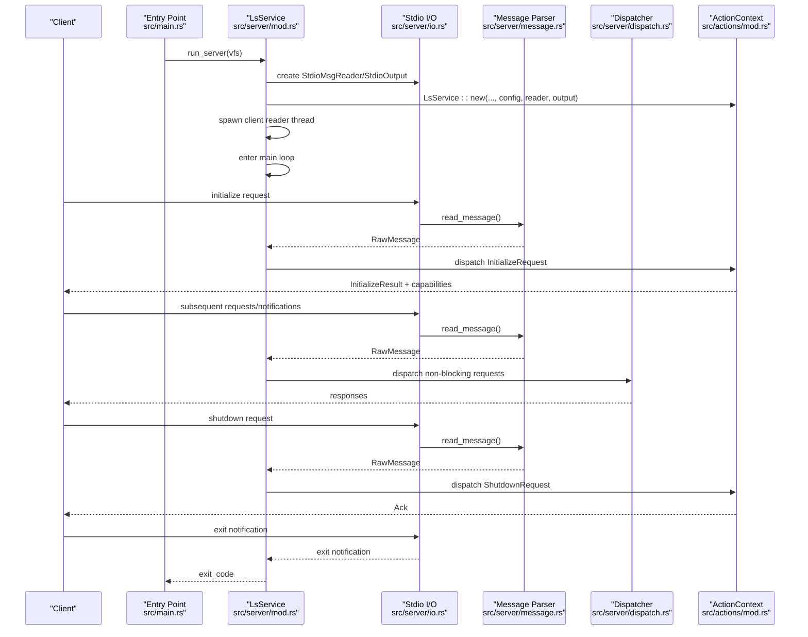
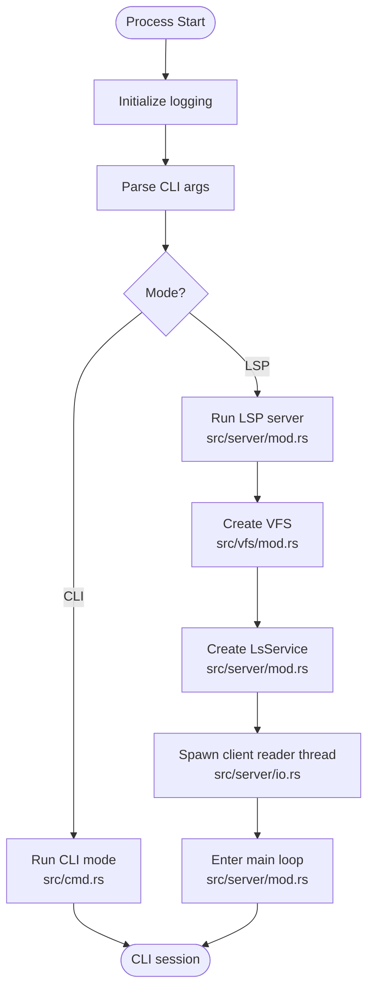
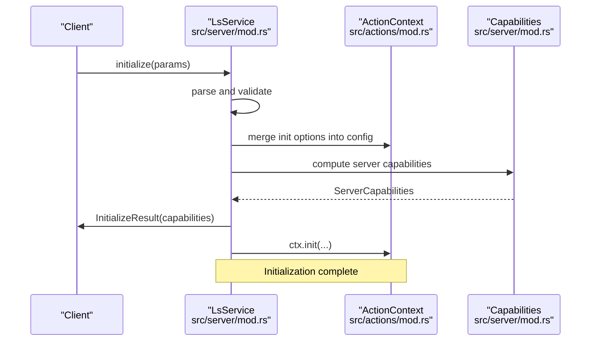
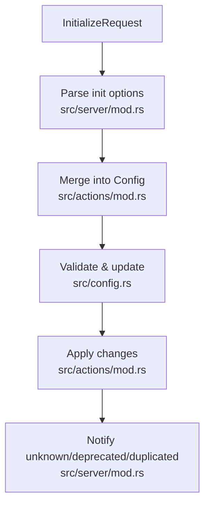
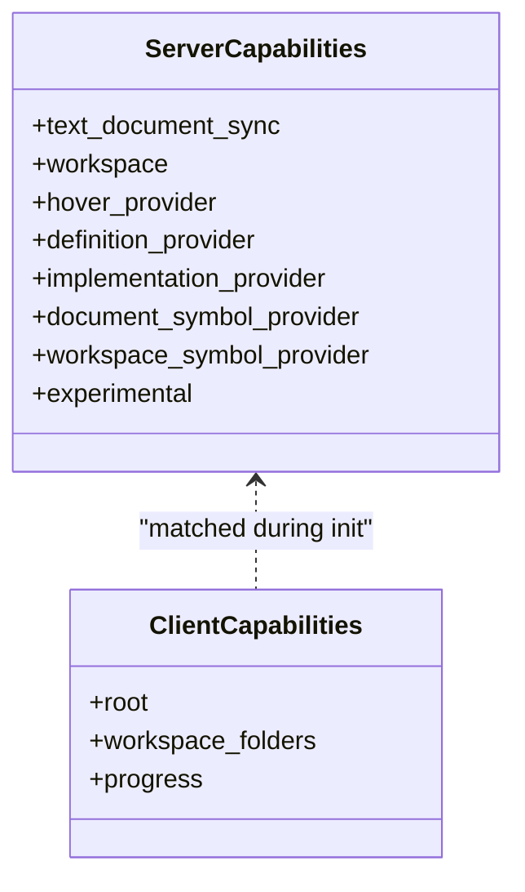
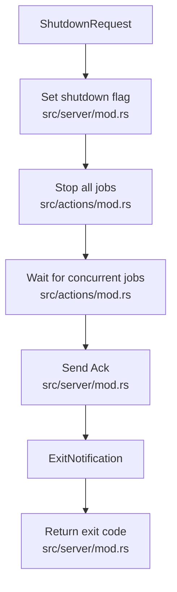
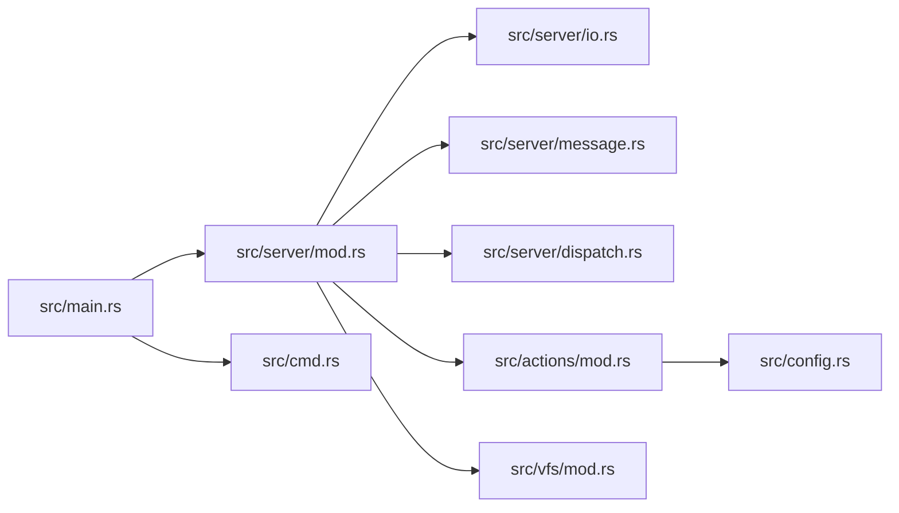

# Server Lifecycle Management

<cite>
**Referenced Files in This Document**
- [main.rs](file://src/main.rs)
- [lib.rs](file://src/lib.rs)
- [server/mod.rs](file://src/server/mod.rs)
- [server/io.rs](file://src/server/io.rs)
- [server/message.rs](file://src/server/message.rs)
- [server/dispatch.rs](file://src/server/dispatch.rs)
- [actions/mod.rs](file://src/actions/mod.rs)
- [config.rs](file://src/config.rs)
- [vfs/mod.rs](file://src/vfs/mod.rs)
- [cmd.rs](file://src/cmd.rs)
- [clients.md](file://clients.md)
</cite>

## Table of Contents
1. [Introduction](#introduction)
2. [Project Structure](#project-structure)
3. [Core Components](#core-components)
4. [Architecture Overview](#architecture-overview)
5. [Detailed Component Analysis](#detailed-component-analysis)
6. [Dependency Analysis](#dependency-analysis)
7. [Performance Considerations](#performance-considerations)
8. [Troubleshooting Guide](#troubleshooting-guide)
9. [Conclusion](#conclusion)

## Introduction
This document explains the server lifecycle management of the DML Language Server, covering the complete startup sequence, initialization process, capability negotiation, and shutdown procedures. It details server state transitions, initialization options processing, configuration validation, server capabilities registration, client capability matching, and feature enablement. Practical examples illustrate initialization parameters, capability declarations, and graceful shutdown handling. It also addresses lifecycle-related error conditions, recovery strategies, and performance considerations during startup and termination.

## Project Structure
The server lifecycle spans several modules:
- Entry point and CLI argument parsing
- Server runtime and I/O handling
- Message parsing and dispatch
- Action context and initialization
- Configuration and capability negotiation
- Virtual File System (VFS) integration
- Command-line interface mode

**Diagram sources**
- [main.rs](file://src/main.rs#L15-L59)
- [server/mod.rs](file://src/server/mod.rs#L68-L84)
- [server/io.rs](file://src/server/io.rs#L19-L40)
- [server/message.rs](file://src/server/message.rs#L311-L396)
- [server/dispatch.rs](file://src/server/dispatch.rs#L122-L157)
- [actions/mod.rs](file://src/actions/mod.rs#L97-L177)
- [config.rs](file://src/config.rs#L120-L140)
- [vfs/mod.rs](file://src/vfs/mod.rs#L180-L288)
- [cmd.rs](file://src/cmd.rs#L47-L49)

**Section sources**
- [main.rs](file://src/main.rs#L15-L59)
- [lib.rs](file://src/lib.rs#L31-L48)

## Core Components
- Entry point and CLI: parses arguments and selects CLI or LSP mode.
- Server runtime: constructs VFS, initializes configuration, creates LsService, and runs the main loop.
- I/O layer: reads LSP messages from stdin and writes responses to stdout with Content-Length framing.
- Message parser: validates JSON-RPC 2.0 and LSP envelopes, parses requests and notifications.
- Dispatcher: routes non-blocking requests to worker threads with timeouts.
- Action context: manages server state transitions and initialization options.
- Configuration: merges client settings, validates and normalizes options, and applies updates.
- VFS: in-memory file cache supporting incremental edits and snapshots.
- CLI mode: embeds the LSP server in a command-line interface for interactive use.

**Section sources**
- [main.rs](file://src/main.rs#L15-L59)
- [server/mod.rs](file://src/server/mod.rs#L68-L84)
- [server/io.rs](file://src/server/io.rs#L19-L40)
- [server/message.rs](file://src/server/message.rs#L311-L396)
- [server/dispatch.rs](file://src/server/dispatch.rs#L122-L157)
- [actions/mod.rs](file://src/actions/mod.rs#L97-L177)
- [config.rs](file://src/config.rs#L120-L140)
- [vfs/mod.rs](file://src/vfs/mod.rs#L180-L288)
- [cmd.rs](file://src/cmd.rs#L47-L49)

## Architecture Overview
The server follows a clear lifecycle:
- Startup: initialize logging, parse CLI, construct VFS, create LsService, and enter the main loop.
- Initialization: handle initialize request, merge initialization options, set capabilities, and prepare workspaces.
- Operation: read messages, dispatch to blocking or non-blocking handlers, manage analysis jobs, and respond to requests.
- Shutdown: handle shutdown request, stop jobs, and exit gracefully upon receiving exit notification.

**Diagram sources**
- [main.rs](file://src/main.rs#L15-L59)
- [server/mod.rs](file://src/server/mod.rs#L68-L84)
- [server/io.rs](file://src/server/io.rs#L28-L40)
- [server/message.rs](file://src/server/message.rs#L311-L396)
- [server/dispatch.rs](file://src/server/dispatch.rs#L122-L157)
- [actions/mod.rs](file://src/actions/mod.rs#L97-L177)

## Detailed Component Analysis

### Server Startup Sequence
- Logging initialization occurs at process start.
- CLI parsing determines whether to run in LSP or CLI mode.
- In LSP mode, a VFS instance is created and passed to LsService.
- LsService constructs an ActionContext, initializes configuration, and starts a dedicated reader thread to consume stdin.
- The main loop processes incoming messages and handles state changes.

**Diagram sources**
- [main.rs](file://src/main.rs#L15-L59)
- [cmd.rs](file://src/cmd.rs#L47-L49)
- [server/mod.rs](file://src/server/mod.rs#L68-L84)
- [server/io.rs](file://src/server/io.rs#L28-L40)
- [vfs/mod.rs](file://src/vfs/mod.rs#L180-L288)

**Section sources**
- [main.rs](file://src/main.rs#L15-L59)
- [server/mod.rs](file://src/server/mod.rs#L68-L84)
- [vfs/mod.rs](file://src/vfs/mod.rs#L180-L288)

### Initialization Process and Capability Negotiation
- The initialize request is handled synchronously; the server responds with InitializeResult and server capabilities before marking the context initialized.
- Initialization options are deserialized and merged into the server configuration.
- Client capabilities are captured and stored in the initialized context.
- The server registers capabilities such as text document synchronization, workspace folders, hover, goto definition, implementation, document symbol, workspace symbol, and experimental features.

**Diagram sources**
- [server/mod.rs](file://src/server/mod.rs#L207-L289)
- [actions/mod.rs](file://src/actions/mod.rs#L127-L160)
- [server/mod.rs](file://src/server/mod.rs#L678-L731)

**Section sources**
- [server/mod.rs](file://src/server/mod.rs#L207-L289)
- [actions/mod.rs](file://src/actions/mod.rs#L127-L160)
- [server/mod.rs](file://src/server/mod.rs#L678-L731)

### Configuration Validation and Options Processing
- Initialization options are deserialized into a Config object, with duplicate detection, unknown field warnings, and deprecation notices surfaced to the client via notifications.
- The server validates and updates configuration, including analysis retention duration constraints and lint configuration updates.
- Configuration changes trigger re-evaluation of compilation info, linter settings, and diagnostics reporting.

**Diagram sources**
- [server/mod.rs](file://src/server/mod.rs#L216-L245)
- [actions/mod.rs](file://src/actions/mod.rs#L970-L996)
- [config.rs](file://src/config.rs#L234-L320)

**Section sources**
- [server/mod.rs](file://src/server/mod.rs#L216-L245)
- [actions/mod.rs](file://src/actions/mod.rs#L970-L996)
- [config.rs](file://src/config.rs#L234-L320)

### Server Capabilities Registration and Client Matching
- Server capabilities include text document synchronization, workspace folders, hover provider, goto definition/provider, implementation provider, document/workspace symbols, and experimental features.
- Client capabilities are captured during initialization and influence behavior such as workspace roots and progress notifications.
- Clients can request capability registration forDidChangeWatchedFiles andDidChangeConfiguration for pull-style configuration updates.

**Diagram sources**
- [server/mod.rs](file://src/server/mod.rs#L678-L731)
- [actions/mod.rs](file://src/actions/mod.rs#L790-L800)
- [clients.md](file://clients.md#L166-L180)

**Section sources**
- [server/mod.rs](file://src/server/mod.rs#L678-L731)
- [actions/mod.rs](file://src/actions/mod.rs#L790-L800)
- [clients.md](file://clients.md#L166-L180)

### Feature Enablement and Experimental Features
- Experimental features are exposed via server capabilities, including context control toggles.
- Feature flags and lint settings are controlled by configuration, with dynamic updates applied during runtime.

**Section sources**
- [server/mod.rs](file://src/server/mod.rs#L666-L676)
- [config.rs](file://src/config.rs#L120-L140)

### Graceful Shutdown Handling
- The shutdown request sets a shutdown flag, stops all jobs, and waits for concurrent jobs to finish.
- The server ignores non-shutdown messages while in shutdown mode and exits cleanly upon receiving the exit notification.

**Diagram sources**
- [server/mod.rs](file://src/server/mod.rs#L86-L107)
- [actions/mod.rs](file://src/actions/mod.rs#L365-L401)
- [server/mod.rs](file://src/server/mod.rs#L605-L636)

**Section sources**
- [server/mod.rs](file://src/server/mod.rs#L86-L107)
- [actions/mod.rs](file://src/actions/mod.rs#L365-L401)
- [server/mod.rs](file://src/server/mod.rs#L605-L636)

### Practical Examples

- Server initialization parameters (CLI):
  - --cli: run in CLI mode
  - --compile-info PATH: optional compile info file path
  - --linting/--no-linting: toggle linting
  - --lint-cfg PATH: optional lint configuration file path
  - --verbose/-v: enable verbose logging

- Capability declarations:
  - Server capabilities include text document synchronization, workspace folders, hover, goto definition, implementation, document/workspace symbols, and experimental features.

- Graceful shutdown handling:
  - Client sends shutdown request; server responds with Ack and proceeds to clean up.
  - Client then sends exit notification; server returns an exit code.

**Section sources**
- [main.rs](file://src/main.rs#L21-L42)
- [server/mod.rs](file://src/server/mod.rs#L678-L731)
- [server/mod.rs](file://src/server/mod.rs#L86-L107)

## Dependency Analysis
The server lifecycle depends on:
- Entry point to server runtime and CLI mode selection
- I/O layer for message transport
- Message parser for JSON-RPC and LSP envelopes
- Dispatcher for non-blocking request handling
- Action context for state transitions and configuration updates
- Configuration for validation and feature toggles
- VFS for file caching and incremental edits

**Diagram sources**
- [main.rs](file://src/main.rs#L15-L59)
- [server/mod.rs](file://src/server/mod.rs#L68-L84)
- [server/io.rs](file://src/server/io.rs#L19-L40)
- [server/message.rs](file://src/server/message.rs#L311-L396)
- [server/dispatch.rs](file://src/server/dispatch.rs#L122-L157)
- [actions/mod.rs](file://src/actions/mod.rs#L97-L177)
- [config.rs](file://src/config.rs#L120-L140)
- [vfs/mod.rs](file://src/vfs/mod.rs#L180-L288)
- [cmd.rs](file://src/cmd.rs#L47-L49)

**Section sources**
- [main.rs](file://src/main.rs#L15-L59)
- [server/mod.rs](file://src/server/mod.rs#L68-L84)
- [server/io.rs](file://src/server/io.rs#L19-L40)
- [server/message.rs](file://src/server/message.rs#L311-L396)
- [server/dispatch.rs](file://src/server/dispatch.rs#L122-L157)
- [actions/mod.rs](file://src/actions/mod.rs#L97-L177)
- [config.rs](file://src/config.rs#L120-L140)
- [vfs/mod.rs](file://src/vfs/mod.rs#L180-L288)
- [cmd.rs](file://src/cmd.rs#L47-L49)

## Performance Considerations
- Message parsing and dispatch:
  - The reader thread continuously parses messages and forwards them to the main loop, minimizing latency.
  - Non-blocking requests are dispatched to a worker pool with timeouts to prevent long-tail impacts.
- Analysis and job management:
  - Analysis queues and job tokens coordinate concurrent work, preventing resource contention.
  - Retention duration checks prune stale analysis results to maintain responsiveness.
- I/O throughput:
  - Framed Content-Length headers ensure robust parsing and reduce overhead.
- Logging and diagnostics:
  - Progress notifications provide visibility into long-running tasks without blocking the main loop.

**Section sources**
- [server/io.rs](file://src/server/io.rs#L46-L110)
- [server/dispatch.rs](file://src/server/dispatch.rs#L24-L29)
- [actions/mod.rs](file://src/actions/mod.rs#L816-L874)
- [server/mod.rs](file://src/server/mod.rs#L371-L380)

## Troubleshooting Guide
- Unknown or duplicated configuration keys:
  - The server reports unknown keys and duplicates via notifications and logs.
- Deprecated configuration keys:
  - Deprecation notices are surfaced to the client with optional guidance.
- Invalid or malformed messages:
  - Parse errors lead to standardized failure responses and exit code signaling.
- Shutdown timing:
  - If exit is received before shutdown, the server returns a non-zero exit code; after shutdown, exit returns success.
- Missing built-in templates:
  - The server warns when essential built-ins are not found, affecting semantic analysis.

**Section sources**
- [server/mod.rs](file://src/server/mod.rs#L109-L205)
- [server/message.rs](file://src/server/message.rs#L311-L396)
- [server/mod.rs](file://src/server/mod.rs#L605-L636)
- [actions/mod.rs](file://src/actions/mod.rs#L776-L788)

## Conclusion
The DML Language Server implements a robust lifecycle with clear startup, initialization, operation, and shutdown phases. It validates and merges configuration options, negotiates capabilities with the client, and manages resources efficiently through VFS and job coordination. The design supports graceful shutdown and provides actionable diagnostics and notifications to aid troubleshooting.