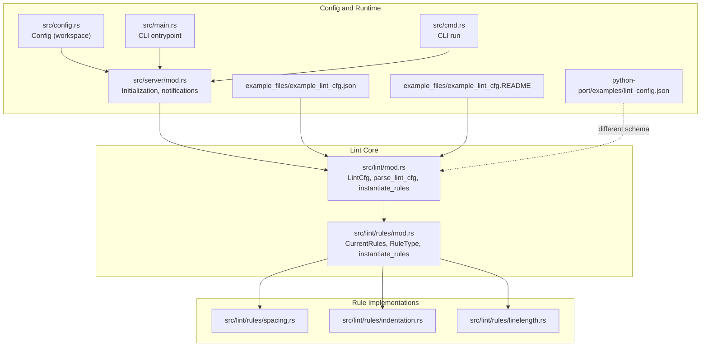
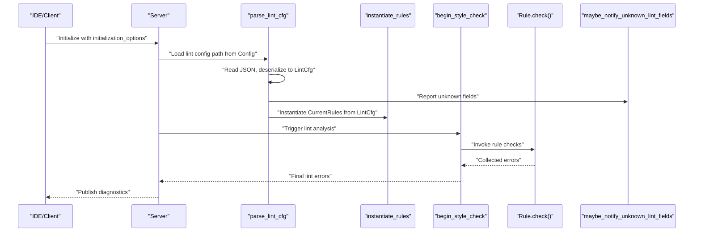
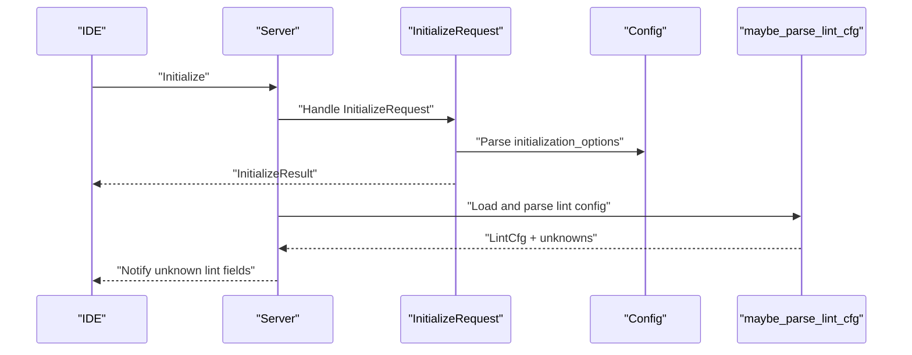
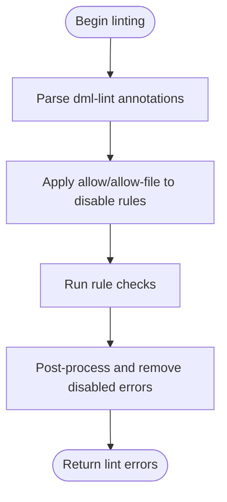

# Configuration Management

<cite>
**Referenced Files in This Document**
- [src/lint/mod.rs](file://src/lint/mod.rs)
- [src/lint/rules/mod.rs](file://src/lint/rules/mod.rs)
- [src/lint/rules/spacing.rs](file://src/lint/rules/spacing.rs)
- [src/lint/rules/indentation.rs](file://src/lint/rules/indentation.rs)
- [src/lint/rules/linelength.rs](file://src/lint/rules/linelength.rs)
- [src/lint/README.md](file://src/lint/README.md)
- [example_files/example_lint_cfg.json](file://example_files/example_lint_cfg.json)
- [example_files/example_lint_cfg.README](file://example_files/example_lint_cfg.README)
- [python-port/examples/lint_config.json](file://python-port/examples/lint_config.json)
- [src/config.rs](file://src/config.rs)
- [src/server/mod.rs](file://src/server/mod.rs)
- [src/main.rs](file://src/main.rs)
- [src/cmd.rs](file://src/cmd.rs)
</cite>

## Table of Contents
1. [Introduction](#introduction)
2. [Project Structure](#project-structure)
3. [Core Components](#core-components)
4. [Architecture Overview](#architecture-overview)
5. [Detailed Component Analysis](#detailed-component-analysis)
6. [Dependency Analysis](#dependency-analysis)
7. [Performance Considerations](#performance-considerations)
8. [Troubleshooting Guide](#troubleshooting-guide)
9. [Conclusion](#conclusion)
10. [Appendices](#appendices)

## Introduction
This document explains how lint configuration is modeled, parsed, validated, and enforced in the language server. It covers the LintCfg structure, the JSON configuration format, default rule settings, parsing and validation mechanisms, error handling for malformed configurations, rule-specific options, inheritance and override behavior, and practical guidance for team-wide linting standards. It also documents integration with IDE settings, CI/CD configuration, and dynamic configuration reloading, along with migration and backward compatibility considerations.

## Project Structure
The lint configuration management spans several modules:
- Lint core and parsing: src/lint/mod.rs
- Rule registry and instantiation: src/lint/rules/mod.rs
- Rule implementations: spacing.rs, indentation.rs, linelength.rs
- Example configurations: example_files/example_lint_cfg.json and its explanatory README
- Python port example configuration: python-port/examples/lint_config.json
- Server-side configuration and runtime integration: src/config.rs, src/server/mod.rs, src/main.rs, src/cmd.rs

**Diagram sources**
- [src/lint/mod.rs](file://src/lint/mod.rs#L49-L76)
- [src/lint/rules/mod.rs](file://src/lint/rules/mod.rs#L36-L88)
- [src/lint/rules/spacing.rs](file://src/lint/rules/spacing.rs#L26-L37)
- [src/lint/rules/indentation.rs](file://src/lint/rules/indentation.rs#L59-L92)
- [src/lint/rules/linelength.rs](file://src/lint/rules/linelength.rs#L31-L45)
- [src/config.rs](file://src/config.rs#L120-L140)
- [src/server/mod.rs](file://src/server/mod.rs#L207-L289)
- [src/main.rs](file://src/main.rs#L38-L59)
- [src/cmd.rs](file://src/cmd.rs#L47-L71)
- [example_files/example_lint_cfg.json](file://example_files/example_lint_cfg.json#L1-L28)
- [example_files/example_lint_cfg.README](file://example_files/example_lint_cfg.README#L1-L28)
- [python-port/examples/lint_config.json](file://python-port/examples/lint_config.json#L1-L25)

**Section sources**
- [src/lint/mod.rs](file://src/lint/mod.rs#L49-L76)
- [src/lint/rules/mod.rs](file://src/lint/rules/mod.rs#L36-L88)
- [src/lint/README.md](file://src/lint/README.md#L1-L71)
- [example_files/example_lint_cfg.json](file://example_files/example_lint_cfg.json#L1-L28)
- [example_files/example_lint_cfg.README](file://example_files/example_lint_cfg.README#L1-L28)
- [python-port/examples/lint_config.json](file://python-port/examples/lint_config.json#L1-L25)
- [src/config.rs](file://src/config.rs#L120-L140)
- [src/server/mod.rs](file://src/server/mod.rs#L207-L289)
- [src/main.rs](file://src/main.rs#L38-L59)
- [src/cmd.rs](file://src/cmd.rs#L47-L71)

## Core Components
- LintCfg: The central configuration structure that maps to the JSON configuration file. It enables or disables rules and sets rule-specific options. It includes defaults for all rules and a default annotate_lints flag.
- Rule registry and instantiation: CurrentRules aggregates all rule instances and sets their enabled/disabled state based on LintCfg. RuleType enumerates rule categories and identifiers.
- Rule implementations: Each rule defines Options structs for configuration and a Rule trait with a check method. Examples include spacing rules (e.g., spacing around operators), indentation rules (e.g., indentation sizes and continuation line alignment), and line-length rules (e.g., breaking before operators).
- Parsing and validation: parse_lint_cfg reads a JSON file, deserializes into LintCfg, tracks unknown fields, and normalizes indentation options.

Key behaviors:
- Unknown fields in the JSON are captured and surfaced to the client as warnings.
- Indentation options inherit from indent_size for related indentation rules.
- annotate_lints controls whether rule identifiers are prefixed to lint messages.

**Section sources**
- [src/lint/mod.rs](file://src/lint/mod.rs#L80-L184)
- [src/lint/rules/mod.rs](file://src/lint/rules/mod.rs#L36-L88)
- [src/lint/rules/spacing.rs](file://src/lint/rules/spacing.rs#L26-L37)
- [src/lint/rules/indentation.rs](file://src/lint/rules/indentation.rs#L59-L92)
- [src/lint/rules/linelength.rs](file://src/lint/rules/linelength.rs#L31-L45)

## Architecture Overview
The lint configuration lifecycle:
- Configuration file is parsed into LintCfg.
- Unknown fields are detected and reported.
- Indentation options are normalized to a single base size.
- Rules are instantiated from LintCfg.
- Linter traverses the AST and performs per-line checks.
- Lint annotations in source code can selectively disable rules for specific lines or files.
- Final errors are post-processed and optionally annotated with rule identifiers.

**Diagram sources**
- [src/server/mod.rs](file://src/server/mod.rs#L207-L289)
- [src/lint/mod.rs](file://src/lint/mod.rs#L49-L76)
- [src/lint/rules/mod.rs](file://src/lint/rules/mod.rs#L62-L88)
- [src/lint/mod.rs](file://src/lint/mod.rs#L245-L265)

## Detailed Component Analysis

### LintCfg Structure and JSON Configuration Format
- LintCfg is a serde-annotated struct with optional fields for each rule group. Presence of a field indicates the rule is enabled; absence disables it. Some rules accept Options structs with parameters (e.g., max_length, indentation_spaces).
- The default configuration enables most rules with sensible defaults (e.g., indentation_spaces defaults to 4, max_length defaults to 80).
- annotate_lints defaults to true, prefixing rule identifiers to error descriptions.

JSON configuration semantics:
- Empty object {} enables a rule without additional parameters.
- null disables a rule.
- Nested objects provide rule-specific parameters (e.g., long_lines, indent_size).
- Unknown fields are collected and reported as errors to the client.

**Section sources**
- [src/lint/mod.rs](file://src/lint/mod.rs#L80-L184)
- [src/lint/mod.rs](file://src/lint/mod.rs#L135-L148)
- [src/lint/README.md](file://src/lint/README.md#L43-L52)
- [example_files/example_lint_cfg.json](file://example_files/example_lint_cfg.json#L1-L28)
- [example_files/example_lint_cfg.README](file://example_files/example_lint_cfg.README#L13-L28)

### Configuration Parsing and Validation
- parse_lint_cfg reads the file, parses JSON, and uses a deserialization helper to collect unknown fields.
- maybe_parse_lint_cfg integrates with the server to notify about unknown fields and normalize indentation options.
- setup_indentation_size propagates a global indentation size to related indentation rule options.

Validation outcomes:
- Successful parse yields a LintCfg plus a list of unknown field names.
- Unknown fields are surfaced to the client as warnings.
- Malformed JSON produces an error string.

**Section sources**
- [src/lint/mod.rs](file://src/lint/mod.rs#L49-L76)
- [src/lint/rules/indentation.rs](file://src/lint/rules/indentation.rs#L40-L58)
- [src/server/mod.rs](file://src/server/mod.rs#L167-L181)

### Rule-Specific Configuration Options and Defaults
- Spacing rules (e.g., sp_brace, sp_binop, sp_ternary, sp_punct, sp_ptrdecl, nsp_funpar, nsp_inparen, nsp_unary, nsp_trailing): Enabled by presence of an empty Options struct; no parameters.
- Indentation rules:
  - long_lines: Options include max_length.
  - indent_size: Sets the base indentation unit; affects other indentation rules.
  - indent_no_tabs: Enforces no tab characters.
  - indent_code_block, indent_closing_brace, indent_switch_case, indent_empty_loop, indent_continuation_line: Options include indentation_spaces.
  - indent_paren_expr: No Options; enabled by presence.
- Line-length rules:
  - break_func_call_open_paren: Options include indentation_spaces.
  - break_method_output: No Options.
  - break_conditional_expression: No Options.
  - break_before_binary_op: No Options.

Defaults:
- Many rules default to enabled in the default LintCfg.
- Global defaults for indentation_spaces and max_length are defined and applied during normalization.

**Section sources**
- [src/lint/rules/spacing.rs](file://src/lint/rules/spacing.rs#L26-L37)
- [src/lint/rules/spacing.rs](file://src/lint/rules/spacing.rs#L132-L144)
- [src/lint/rules/spacing.rs](file://src/lint/rules/spacing.rs#L243-L263)
- [src/lint/rules/spacing.rs](file://src/lint/rules/spacing.rs#L297-L321)
- [src/lint/rules/spacing.rs](file://src/lint/rules/spacing.rs#L371-L408)
- [src/lint/rules/spacing.rs](file://src/lint/rules/spacing.rs#L518-L548)
- [src/lint/rules/spacing.rs](file://src/lint/rules/spacing.rs#L573-L606)
- [src/lint/rules/spacing.rs](file://src/lint/rules/spacing.rs#L677-L706)
- [src/lint/rules/spacing.rs](file://src/lint/rules/spacing.rs#L740-L760)
- [src/lint/rules/spacing.rs](file://src/lint/rules/spacing.rs#L774-L806)
- [src/lint/rules/spacing.rs](file://src/lint/rules/spacing.rs#L842-L863)
- [src/lint/rules/indentation.rs](file://src/lint/rules/indentation.rs#L59-L92)
- [src/lint/rules/indentation.rs](file://src/lint/rules/indentation.rs#L105-L111)
- [src/lint/rules/indentation.rs](file://src/lint/rules/indentation.rs#L147-L151)
- [src/lint/rules/indentation.rs](file://src/lint/rules/indentation.rs#L259-L263)
- [src/lint/rules/indentation.rs](file://src/lint/rules/indentation.rs#L393-L394)
- [src/lint/rules/indentation.rs](file://src/lint/rules/indentation.rs#L572-L576)
- [src/lint/rules/indentation.rs](file://src/lint/rules/indentation.rs#L654-L658)
- [src/lint/rules/indentation.rs](file://src/lint/rules/indentation.rs#L742-L746)
- [src/lint/rules/linelength.rs](file://src/lint/rules/linelength.rs#L31-L45)
- [src/lint/rules/linelength.rs](file://src/lint/rules/linelength.rs#L84-L88)
- [src/lint/rules/linelength.rs](file://src/lint/rules/linelength.rs#L226-L227)
- [src/lint/rules/linelength.rs](file://src/lint/rules/linelength.rs#L331-L333)

### Inheritance Behavior and Overrides
- Indentation inheritance: setup_indentation_size reads indent_size and applies its indentation_spaces value to related indentation rules (indent_code_block, indent_switch_case, indent_empty_loop, indent_continuation_line).
- Rule enable/disable: Presence of a field enables the rule; absence disables it. null is treated as disabled for rules that accept Options.
- annotate_lints: When true, rule identifiers are prepended to error descriptions.

**Section sources**
- [src/lint/rules/indentation.rs](file://src/lint/rules/indentation.rs#L40-L58)
- [src/lint/mod.rs](file://src/lint/mod.rs#L228-L234)

### Dynamic Configuration Reloading and IDE Integration
- Initialization: The server’s InitializeRequest handles initialization_options and triggers analysis and linting.
- Unknown configuration fields: The server reports unknown lint fields as errors to the client.
- CLI integration: The CLI entrypoint supports passing a lint configuration path and enabling/disabling linting.

**Diagram sources**
- [src/server/mod.rs](file://src/server/mod.rs#L207-L289)
- [src/lint/mod.rs](file://src/lint/mod.rs#L63-L76)
- [src/config.rs](file://src/config.rs#L120-L140)

**Section sources**
- [src/server/mod.rs](file://src/server/mod.rs#L207-L289)
- [src/lint/mod.rs](file://src/lint/mod.rs#L63-L76)
- [src/config.rs](file://src/config.rs#L120-L140)
- [src/main.rs](file://src/main.rs#L38-L59)
- [src/cmd.rs](file://src/cmd.rs#L47-L71)

### Lint Annotations and Source-Level Overrides
- dml-lint annotations allow selective disabling of rules:
  - allow-file disables a rule for the entire file.
  - allow disables a rule for subsequent lines until a non-empty line without annotation.
- Invalid commands or targets produce configuration errors with precise ranges.
- After linting, disabled lints are removed from the final error set.

**Diagram sources**
- [src/lint/mod.rs](file://src/lint/mod.rs#L245-L265)
- [src/lint/mod.rs](file://src/lint/mod.rs#L288-L399)
- [src/lint/mod.rs](file://src/lint/mod.rs#L416-L427)

**Section sources**
- [src/lint/mod.rs](file://src/lint/mod.rs#L288-L399)
- [src/lint/mod.rs](file://src/lint/mod.rs#L416-L427)

### Example Configuration Files and Patterns
- example_files/example_lint_cfg.json demonstrates a full configuration with spacing, indentation, and line-length rules, including parameterized options.
- example_files/example_lint_cfg.README explains how to enable/disable rules and configure parameters.
- python-port/examples/lint_config.json illustrates a different configuration schema (enabled_rules, disabled_rules, rule_configs), useful for understanding alternative approaches.

Common patterns:
- Enable/disable entire categories by toggling rule fields.
- Set global indentation size and rely on inheritance for related rules.
- Tune line length thresholds and operator-breaking preferences.

**Section sources**
- [example_files/example_lint_cfg.json](file://example_files/example_lint_cfg.json#L1-L28)
- [example_files/example_lint_cfg.README](file://example_files/example_lint_cfg.README#L13-L28)
- [python-port/examples/lint_config.json](file://python-port/examples/lint_config.json#L1-L25)

## Dependency Analysis
The lint configuration system depends on:
- serde for JSON parsing and serialization.
- regex for parsing dml-lint annotations.
- Rule implementations that depend on AST node types and token iterators.
- Server integration for reporting unknown fields and triggering lint jobs.

**Diagram sources**
- [src/lint/mod.rs](file://src/lint/mod.rs#L49-L76)
- [src/lint/rules/mod.rs](file://src/lint/rules/mod.rs#L62-L88)
- [src/lint/mod.rs](file://src/lint/mod.rs#L245-L265)

**Section sources**
- [src/lint/mod.rs](file://src/lint/mod.rs#L49-L76)
- [src/lint/rules/mod.rs](file://src/lint/rules/mod.rs#L62-L88)
- [src/lint/mod.rs](file://src/lint/mod.rs#L245-L265)

## Performance Considerations
- Parsing and deserialization are lightweight; unknown field detection adds minimal overhead.
- Rule checks operate on AST nodes and per-line scans; complexity scales linearly with file size.
- Indentation normalization avoids repeated computation by applying a single base value across related rules.
- Consider caching LintCfg instances when frequently reloading configurations to minimize IO and parsing costs.

## Troubleshooting Guide
Common issues and resolutions:
- Unknown fields in configuration: Detected during parsing and reported to the client as errors. Review the configuration against the documented fields.
- Malformed JSON: parse_lint_cfg returns an error string; fix syntax or encoding.
- Lint annotations without effect: Occur when annotations are placed after the last non-empty line; ensure annotations precede problematic lines.
- Invalid annotation commands/targets: Produce configuration errors with precise ranges; correct the command or rule name.

**Section sources**
- [src/lint/mod.rs](file://src/lint/mod.rs#L49-L76)
- [src/lint/mod.rs](file://src/lint/mod.rs#L288-L399)
- [src/server/mod.rs](file://src/server/mod.rs#L167-L181)

## Conclusion
The lint configuration system provides a robust, extensible mechanism for defining and enforcing style rules. Its JSON-based configuration is easy to adopt, supports granular rule tuning, and integrates cleanly with the server’s initialization and diagnostics pipeline. Teams can establish consistent standards by basing their configurations on the defaults and gradually adding rule-specific options.

## Appendices

### Best Practices for Team-Wide Standards
- Start from the default configuration and enable/disable rules as needed.
- Centralize configuration in a shared JSON file and commit it to version control.
- Use dml-lint annotations sparingly and document their usage in team guidelines.
- Keep indentation_spaces uniform across the codebase; rely on inheritance to propagate the setting.
- Regularly review unknown field warnings to keep configurations up-to-date.

### CI/CD Integration
- Configure the server to load the lint configuration file at startup.
- Treat lint warnings as non-blocking informational feedback or gate builds based on policy.
- Use the CLI mode to run linting on demand or as part of scripts.

**Section sources**
- [src/server/mod.rs](file://src/server/mod.rs#L207-L289)
- [src/main.rs](file://src/main.rs#L38-L59)
- [src/cmd.rs](file://src/cmd.rs#L47-L71)

### Migration and Backward Compatibility
- Unknown fields are tolerated and reported rather than causing hard failures, aiding incremental migration.
- The default LintCfg ensures existing setups continue to work without explicit configuration.
- When renaming or removing fields, maintain backward compatibility by accepting unknown fields and issuing warnings.

**Section sources**
- [src/lint/mod.rs](file://src/lint/mod.rs#L135-L148)
- [src/lint/mod.rs](file://src/lint/mod.rs#L49-L76)
- [src/server/mod.rs](file://src/server/mod.rs#L167-L181)