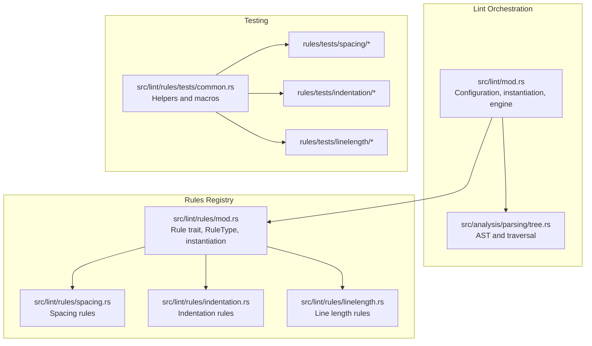
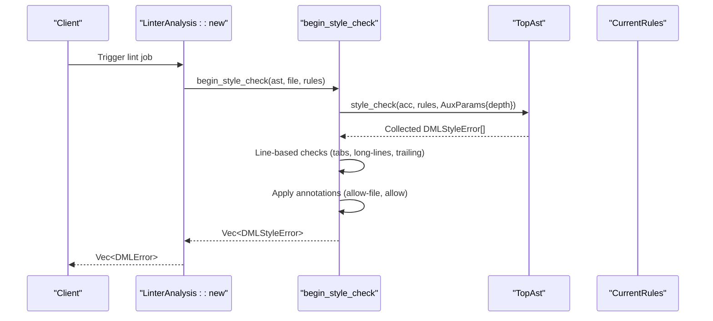
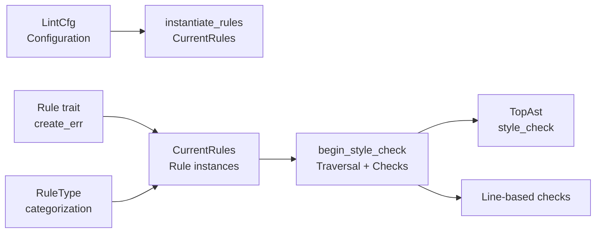

# Custom Rule Development

<cite>
**Referenced Files in This Document**
- [mod.rs](file://src/lint/mod.rs)
- [rules/mod.rs](file://src/lint/rules/mod.rs)
- [rules/spacing.rs](file://src/lint/rules/spacing.rs)
- [rules/indentation.rs](file://src/lint/rules/indentation.rs)
- [rules/linelength.rs](file://src/lint/rules/linelength.rs)
- [tree.rs](file://src/analysis/parsing/tree.rs)
- [README.md](file://src/lint/README.md)
- [features.md](file://src/lint/features.md)
- [rules/tests/common.rs](file://src/lint/rules/tests/common.rs)
- [rules/tests/spacing/nsp_funpar.rs](file://src/lint/rules/tests/spacing/nsp_funpar.rs)
- [rules/tests/spacing/sp_braces.rs](file://src/lint/rules/tests/spacing/sp_braces.rs)
- [rules/tests/indentation/closing_brace.rs](file://src/lint/rules/tests/indentation/closing_brace.rs)
- [rules/tests/linelength/break_before_binary_op.rs](file://src/lint/rules/tests/linelength/break_before_binary_op.rs)
</cite>

## Table of Contents
1. [Introduction](#introduction)
2. [Project Structure](#project-structure)
3. [Core Components](#core-components)
4. [Architecture Overview](#architecture-overview)
5. [Detailed Component Analysis](#detailed-component-analysis)
6. [Dependency Analysis](#dependency-analysis)
7. [Performance Considerations](#performance-considerations)
8. [Troubleshooting Guide](#troubleshooting-guide)
9. [Conclusion](#conclusion)
10. [Appendices](#appendices)

## Introduction
This document explains how to develop custom lint rules for the DML language server. It covers the Rule trait, rule registration, AST traversal, error reporting, configuration options, and testing strategies. It also provides step-by-step examples and best practices for rule maintenance and distribution.

## Project Structure
The lint subsystem is organized into:
- A central lint orchestrator that loads configuration, instantiates rules, and runs checks against the AST.
- A rules module with categorized rule implementations (spacing, indentation, line length).
- A shared trait and type registry for rule identification and categorization.
- A robust testing framework with helpers for asserting expected violations.

**Diagram sources**
- [mod.rs](file://src/lint/mod.rs#L1-L265)
- [rules/mod.rs](file://src/lint/rules/mod.rs#L1-L171)
- [tree.rs](file://src/analysis/parsing/tree.rs#L109-L120)
- [rules/spacing.rs](file://src/lint/rules/spacing.rs#L1-L130)
- [rules/indentation.rs](file://src/lint/rules/indentation.rs#L1-L140)
- [rules/linelength.rs](file://src/lint/rules/linelength.rs#L1-L100)
- [rules/tests/common.rs](file://src/lint/rules/tests/common.rs#L1-L56)

**Section sources**
- [mod.rs](file://src/lint/mod.rs#L1-L265)
- [rules/mod.rs](file://src/lint/rules/mod.rs#L1-L171)
- [README.md](file://src/lint/README.md#L1-L71)

## Core Components
- Rule trait: Defines rule identity, description, and creation of DMLStyleError via a convenience method.
- RuleType: Enumerates rule categories and supports parsing rule names to types.
- CurrentRules: Holds all instantiated rule instances based on LintCfg.
- LintCfg: Deserializes user configuration and enables/disables rules and sets options.
- Engine: Traverses the AST, collects line-based checks, applies rule annotations, and produces DMLError results.

Key responsibilities:
- Rule trait and RuleType enable consistent identification and categorization.
- LintCfg drives rule instantiation and configuration.
- begin_style_check orchestrates traversal and line-based checks.
- Annotation parsing allows selective suppression of violations.

**Section sources**
- [rules/mod.rs](file://src/lint/rules/mod.rs#L90-L171)
- [mod.rs](file://src/lint/mod.rs#L80-L184)
- [mod.rs](file://src/lint/mod.rs#L245-L265)
- [mod.rs](file://src/lint/mod.rs#L288-L427)

## Architecture Overview
The linting pipeline:
1. Configuration is parsed into LintCfg.
2. CurrentRules is instantiated from LintCfg.
3. begin_style_check performs:
   - AST traversal via TreeElement::style_check.
   - Line-based checks (e.g., trailing whitespace, tabs, long lines).
   - Annotation processing to suppress disabled rules.
4. Errors are post-processed and returned as DMLError.

**Diagram sources**
- [mod.rs](file://src/lint/mod.rs#L208-L243)
- [mod.rs](file://src/lint/mod.rs#L245-L265)
- [tree.rs](file://src/analysis/parsing/tree.rs#L109-L120)

**Section sources**
- [README.md](file://src/lint/README.md#L13-L25)
- [mod.rs](file://src/lint/mod.rs#L208-L243)

## Detailed Component Analysis

### Rule Trait and RuleType
- Rule trait provides:
  - name(): Unique rule name.
  - description(): Human-readable description.
  - get_rule_type(): Category for rule identification.
  - create_err(range): Builds a DMLStyleError with rule metadata.
- RuleType enumerates categories (e.g., Sp*, In*, Ll*) and supports parsing rule names to types.

Implementation highlights:
- RuleType::from_str uses a macro to map rule names to types.
- RuleType is used by annotation parsing to resolve targets.

**Section sources**
- [rules/mod.rs](file://src/lint/rules/mod.rs#L90-L171)

### Rule Registration and Instantiation
- CurrentRules aggregates all rule instances with fields for each rule category.
- instantiate_rules constructs CurrentRules from LintCfg, enabling rules based on presence of options.

Configuration-driven instantiation:
- Options like Some(...) enable a rule; None disables it.
- Options structs (e.g., IndentSizeOptions) carry parameters (e.g., indentation_spaces).

**Section sources**
- [rules/mod.rs](file://src/lint/rules/mod.rs#L36-L88)
- [mod.rs](file://src/lint/mod.rs#L80-L184)

### AST Traversal Patterns
- TreeElement::style_check recursively traverses the AST:
  - Optionally increments depth for nodes that should increase nesting.
  - Calls evaluate_rules on the current node with auxiliary parameters.
  - Recurses into child nodes.
- Nodes implement evaluate_rules to invoke applicable rule checks.

Depth handling:
- should_increment_depth controls whether depth increases for a node.
- AuxParams carries depth down the tree to support indentation calculations.

**Section sources**
- [tree.rs](file://src/analysis/parsing/tree.rs#L109-L120)

### Error Reporting Mechanisms
- Rules create DMLStyleError via Rule::create_err, embedding:
  - LocalDMLError with range and description.
  - rule_ident (rule name).
  - rule_type (RuleType).
- LinterAnalysis wraps DMLStyleError into DMLError and optionally annotates descriptions with rule identifiers.

Post-processing:
- post_process_linting_errors removes redundant errors for certain categories.
- remove_disabled_lints filters out errors matching allow-file or allow annotations.

**Section sources**
- [rules/mod.rs](file://src/lint/rules/mod.rs#L95-L104)
- [mod.rs](file://src/lint/mod.rs#L186-L243)
- [mod.rs](file://src/lint/mod.rs#L401-L427)

### Configuration Option Handling
- LintCfg fields mirror rule categories and options.
- Default configuration enables most rules with sensible defaults.
- Line-based checks (tabs, long-lines, trailing) are handled outside AST traversal.

Examples of options:
- IndentSizeOptions, IndentCodeBlockOptions, IndentSwitchCaseOptions, IndentEmptyLoopOptions, IndentContinuationLineOptions.
- LongLineOptions with max_length.
- Break* options for line-breaking rules.

**Section sources**
- [mod.rs](file://src/lint/mod.rs#L80-L184)
- [rules/indentation.rs](file://src/lint/rules/indentation.rs#L59-L103)
- [rules/linelength.rs](file://src/lint/rules/linelength.rs#L31-L101)

### Testing Framework
- Test helpers:
  - define_expected_errors!: Macro to define expected violations as tuples of ranges and rule types.
  - run_linter: Builds AST from snippet and runs begin_style_check.
  - assert_snippet: Compares actual vs expected errors.
  - set_up: Creates CurrentRules from default LintCfg.
- Example tests demonstrate:
  - Correct and incorrect code samples.
  - Disabling rules by toggling enabled flags.
  - Assertions on expected ranges and rule types.

**Section sources**
- [rules/tests/common.rs](file://src/lint/rules/tests/common.rs#L1-L56)
- [rules/tests/spacing/nsp_funpar.rs](file://src/lint/rules/tests/spacing/nsp_funpar.rs#L1-L39)
- [rules/tests/spacing/sp_braces.rs](file://src/lint/rules/tests/spacing/sp_braces.rs#L1-L97)
- [rules/tests/indentation/closing_brace.rs](file://src/lint/rules/tests/indentation/closing_brace.rs#L1-L205)
- [rules/tests/linelength/break_before_binary_op.rs](file://src/lint/rules/tests/linelength/break_before_binary_op.rs#L1-L60)

### Step-by-Step: Creating a New Rule
Follow these steps to add a new rule:

1. Choose a category and file:
   - Spacing: rules/spacing.rs
   - Indentation: rules/indentation.rs
   - Line length: rules/linelength.rs

2. Define options struct(s):
   - Place under #[derive(Clone, Debug, Serialize, Deserialize, PartialEq)].
   - Use defaults via serde(default) where appropriate.

3. Define rule struct:
   - Add enabled flag for toggling.
   - Optionally add parameters (e.g., indentation_spaces).

4. Implement Rule trait:
   - name(), description(), get_rule_type().

5. Implement check logic:
   - For AST-driven rules, accept extracted arguments and push DMLStyleError via create_err.
   - For line-based rules, accept (row, line) and push errors.

6. Add extraction helpers:
   - Implement From* methods to extract arguments from AST nodes.
   - Ensure they return Option<T> to handle absent cases.

7. Integrate into instantiation:
   - Add fields to CurrentRules.
   - Update instantiate_rules to construct the rule from options.

8. Register in configuration:
   - Add a field to LintCfg with serde(default) or Option<T>.
   - Ensure default configuration enables the rule if desired.

9. Write tests:
   - Create a test file under the appropriate category.
   - Use define_expected_errors!, set_up, and assert_snippet.
   - Include both correct and incorrect code samples.

10. Verify:
   - Run cargo test lint to ensure tests pass/fail as expected.

Illustrative references:
- Spacing rule pattern: [rules/spacing.rs](file://src/lint/rules/spacing.rs#L26-L130)
- Indentation rule pattern: [rules/indentation.rs](file://src/lint/rules/indentation.rs#L59-L140)
- Line length rule pattern: [rules/linelength.rs](file://src/lint/rules/linelength.rs#L31-L101)
- Test helpers: [rules/tests/common.rs](file://src/lint/rules/tests/common.rs#L19-L56)

**Section sources**
- [rules/spacing.rs](file://src/lint/rules/spacing.rs#L26-L130)
- [rules/indentation.rs](file://src/lint/rules/indentation.rs#L59-L140)
- [rules/linelength.rs](file://src/lint/rules/linelength.rs#L31-L101)
- [rules/tests/common.rs](file://src/lint/rules/tests/common.rs#L19-L56)

### Rule Categorization System
Rules are categorized by RuleType:
- Spacing: SpReserved, SpBraces, SpPunct, SpBinop, SpTernary, SpPtrDecl, NspFunpar, NspInparen, NspUnary, NspTrailing.
- Indentation: IN1, IN2, IN3, IN4, IN5, IN9, IN10.
- Line length: LL1, LL2, LL3, LL5, LL6.

RuleType supports parsing rule names to types, enabling annotation targeting.

**Section sources**
- [rules/mod.rs](file://src/lint/rules/mod.rs#L107-L171)

### Implementation Patterns Across Categories

#### Spacing Rules
- Typical pattern:
  - Define Options struct.
  - Define Rule struct with enabled flag.
  - Implement Rule trait.
  - Implement check accepting extracted arguments.
  - Provide From* helpers to extract arguments from AST nodes.
- Examples:
  - SpReserved: [rules/spacing.rs](file://src/lint/rules/spacing.rs#L26-L130)
  - SpBraces: [rules/spacing.rs](file://src/lint/rules/spacing.rs#L132-L241)
  - SpBinop: [rules/spacing.rs](file://src/lint/rules/spacing.rs#L243-L295)
  - SpTernary: [rules/spacing.rs](file://src/lint/rules/spacing.rs#L297-L369)
  - SpPunct: [rules/spacing.rs](file://src/lint/rules/spacing.rs#L371-L516)
  - NspFunpar: [rules/spacing.rs](file://src/lint/rules/spacing.rs#L518-L571)
  - NspInparen: [rules/spacing.rs](file://src/lint/rules/spacing.rs#L573-L675)
  - NspUnary: [rules/spacing.rs](file://src/lint/rules/spacing.rs#L676-L738)
  - NspTrailing: [rules/spacing.rs](file://src/lint/rules/spacing.rs#L739-L772)
  - SpPtrDecl: [rules/spacing.rs](file://src/lint/rules/spacing.rs#L773-L893)

**Section sources**
- [rules/spacing.rs](file://src/lint/rules/spacing.rs#L26-L130)
- [rules/spacing.rs](file://src/lint/rules/spacing.rs#L132-L241)
- [rules/spacing.rs](file://src/lint/rules/spacing.rs#L243-L295)
- [rules/spacing.rs](file://src/lint/rules/spacing.rs#L297-L369)
- [rules/spacing.rs](file://src/lint/rules/spacing.rs#L371-L516)
- [rules/spacing.rs](file://src/lint/rules/spacing.rs#L518-L571)
- [rules/spacing.rs](file://src/lint/rules/spacing.rs#L573-L675)
- [rules/spacing.rs](file://src/lint/rules/spacing.rs#L676-L738)
- [rules/spacing.rs](file://src/lint/rules/spacing.rs#L739-L772)
- [rules/spacing.rs](file://src/lint/rules/spacing.rs#L773-L893)

#### Indentation Rules
- Pattern:
  - Options structs with indentation_spaces.
  - from_options to construct rules from LintCfg.
  - check methods that compute expected indentation and compare against actual.
  - Depth-aware logic via AuxParams and should_increment_depth.
- Examples:
  - LongLinesRule: [rules/indentation.rs](file://src/lint/rules/indentation.rs#L64-L103)
  - IndentNoTabRule: [rules/indentation.rs](file://src/lint/rules/indentation.rs#L113-L140)
  - IndentCodeBlockRule: [rules/indentation.rs](file://src/lint/rules/indentation.rs#L142-L252)
  - IndentClosingBraceRule: [rules/indentation.rs](file://src/lint/rules/indentation.rs#L254-L386)
  - IndentParenExprRule: [rules/indentation.rs](file://src/lint/rules/indentation.rs#L389-L564)
  - IndentSwitchCaseRule: [rules/indentation.rs](file://src/lint/rules/indentation.rs#L567-L646)
  - IndentEmptyLoopRule: [rules/indentation.rs](file://src/lint/rules/indentation.rs#L648-L734)
  - IndentContinuationLineRule: [rules/indentation.rs](file://src/lint/rules/indentation.rs#L736-L859)

**Section sources**
- [rules/indentation.rs](file://src/lint/rules/indentation.rs#L64-L103)
- [rules/indentation.rs](file://src/lint/rules/indentation.rs#L113-L140)
- [rules/indentation.rs](file://src/lint/rules/indentation.rs#L142-L252)
- [rules/indentation.rs](file://src/lint/rules/indentation.rs#L254-L386)
- [rules/indentation.rs](file://src/lint/rules/indentation.rs#L389-L564)
- [rules/indentation.rs](file://src/lint/rules/indentation.rs#L567-L646)
- [rules/indentation.rs](file://src/lint/rules/indentation.rs#L648-L734)
- [rules/indentation.rs](file://src/lint/rules/indentation.rs#L736-L859)

#### Line Length Rules
- Pattern:
  - Options structs with indentation_spaces defaults.
  - from_options to construct rules from LintCfg.
  - check methods that enforce line-breaking preferences.
- Examples:
  - BreakBeforeBinaryOpRule: [rules/linelength.rs](file://src/lint/rules/linelength.rs#L222-L274)
  - BreakConditionalExpressionRule: [rules/linelength.rs](file://src/lint/rules/linelength.rs#L276-L327)
  - BreakMethodOutputRule: [rules/linelength.rs](file://src/lint/rules/linelength.rs#L21-L71)
  - BreakFuncCallOpenParenRule: [rules/linelength.rs](file://src/lint/rules/linelength.rs#L73-L220)

**Section sources**
- [rules/linelength.rs](file://src/lint/rules/linelength.rs#L222-L274)
- [rules/linelength.rs](file://src/lint/rules/linelength.rs#L276-L327)
- [rules/linelength.rs](file://src/lint/rules/linelength.rs#L21-L71)
- [rules/linelength.rs](file://src/lint/rules/linelength.rs#L73-L220)

### Example Workflows

#### Spacing Rule Example
- Scenario: Enforce no space between function name and opening parenthesis.
- Steps:
  1. Define NspFunparOptions and NspFunparRule.
  2. Implement Rule trait.
  3. Implement check that detects gaps and pushes errors.
  4. Add NspFunparArgs with From* helpers to extract ranges from Method and FunctionCall nodes.
  5. Add field to CurrentRules and instantiate_rules.
  6. Add field to LintCfg with serde(default).
  7. Write tests using define_expected_errors!.

References:
- [rules/spacing.rs](file://src/lint/rules/spacing.rs#L518-L571)
- [rules/tests/spacing/nsp_funpar.rs](file://src/lint/rules/tests/spacing/nsp_funpar.rs#L1-L39)

#### Indentation Rule Example
- Scenario: Enforce closing brace alignment.
- Steps:
  1. Define IndentClosingBraceOptions and IndentClosingBraceRule.
  2. Implement Rule trait.
  3. Implement check that verifies expected indentation level.
  4. Add IndentClosingBraceArgs with From* helpers for Compound, ObjectStatements, Switch, StructType, Layout, Bitfields.
  5. Add field to CurrentRules and instantiate_rules.
  6. Add field to LintCfg with serde(default).
  7. Write tests covering correct and incorrect alignments.

References:
- [rules/indentation.rs](file://src/lint/rules/indentation.rs#L254-L386)
- [rules/tests/indentation/closing_brace.rs](file://src/lint/rules/tests/indentation/closing_brace.rs#L1-L205)

#### Line Length Rule Example
- Scenario: Enforce breaking before binary operators.
- Steps:
  1. Define BreakBeforeBinaryOpOptions and BreakBeforeBinaryOpRule.
  2. Implement Rule trait.
  3. Implement check that validates operator placement.
  4. Add BreakBeforeBinaryOpArgs with From* helper for BinaryExpression.
  5. Add field to CurrentRules and instantiate_rules.
  6. Add field to LintCfg with serde(default).
  7. Write tests for correct and incorrect operator placement.

References:
- [rules/linelength.rs](file://src/lint/rules/linelength.rs#L222-L274)
- [rules/tests/linelength/break_before_binary_op.rs](file://src/lint/rules/tests/linelength/break_before_binary_op.rs#L1-L60)

## Dependency Analysis
- Lint orchestration depends on:
  - LintCfg for configuration.
  - CurrentRules for rule instances.
  - TreeElement traversal for AST checks.
  - Line-based checks for text analysis.
- Rules depend on:
  - Rule trait for identity and error creation.
  - AST node types for argument extraction.
  - Serde options for configuration.

**Diagram sources**
- [mod.rs](file://src/lint/mod.rs#L62-L88)
- [mod.rs](file://src/lint/mod.rs#L245-L265)
- [rules/mod.rs](file://src/lint/rules/mod.rs#L90-L171)

**Section sources**
- [mod.rs](file://src/lint/mod.rs#L62-L88)
- [rules/mod.rs](file://src/lint/rules/mod.rs#L90-L171)

## Performance Considerations
- Prefer early exits in rule checks (e.g., return if !enabled).
- Minimize allocations by reusing ranges and avoiding unnecessary collections.
- Keep argument extraction functions efficient and return Option<T> to skip irrelevant nodes.
- Use line-based checks judiciously; they iterate over all lines.
- Avoid redundant error reporting by leveraging post-processing logic.

[No sources needed since this section provides general guidance]

## Troubleshooting Guide
Common issues and resolutions:
- Unknown configuration fields:
  - Detected during deserialization; unknowns are collected and surfaced via notifications.
- Invalid rule targets in annotations:
  - Parsing errors produce DMLStyleError with RuleType::Configuration.
- Annotations without effect:
  - Unapplied annotations at EOF produce warnings.

Diagnostic references:
- Unknown fields detection: [mod.rs](file://src/lint/mod.rs#L135-L148)
- Annotation parsing and errors: [mod.rs](file://src/lint/mod.rs#L288-L427)
- Example tests for annotations: [mod.rs](file://src/lint/mod.rs#L516-L621)

**Section sources**
- [mod.rs](file://src/lint/mod.rs#L135-L148)
- [mod.rs](file://src/lint/mod.rs#L288-L427)
- [mod.rs](file://src/lint/mod.rs#L516-L621)

## Conclusion
Custom rule development follows a consistent pattern: define options, implement a rule struct with Rule trait, extract arguments from AST nodes, integrate via instantiate_rules, and add tests. Configuration is driven by LintCfg, and the engine orchestrates traversal and line-based checks. Use the provided testing helpers and examples to ensure correctness and maintainability.

[No sources needed since this section summarizes without analyzing specific files]

## Appendices

### Appendix A: Supported Rules Overview
- Spacing rules: SpReserved, SpBraces, SpPunct, SpBinop, SpTernary, SpPtrDecl, NspFunpar, NspInparen, NspUnary, NspTrailing.
- Indentation rules: IN1, IN2, IN3, IN4, IN5, IN9, IN10.
- Line length rules: LL1, LL2, LL3, LL5, LL6.

**Section sources**
- [features.md](file://src/lint/features.md#L1-L75)