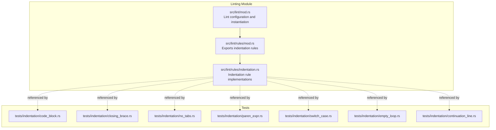
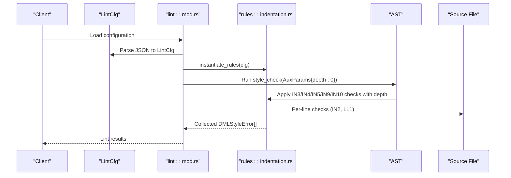
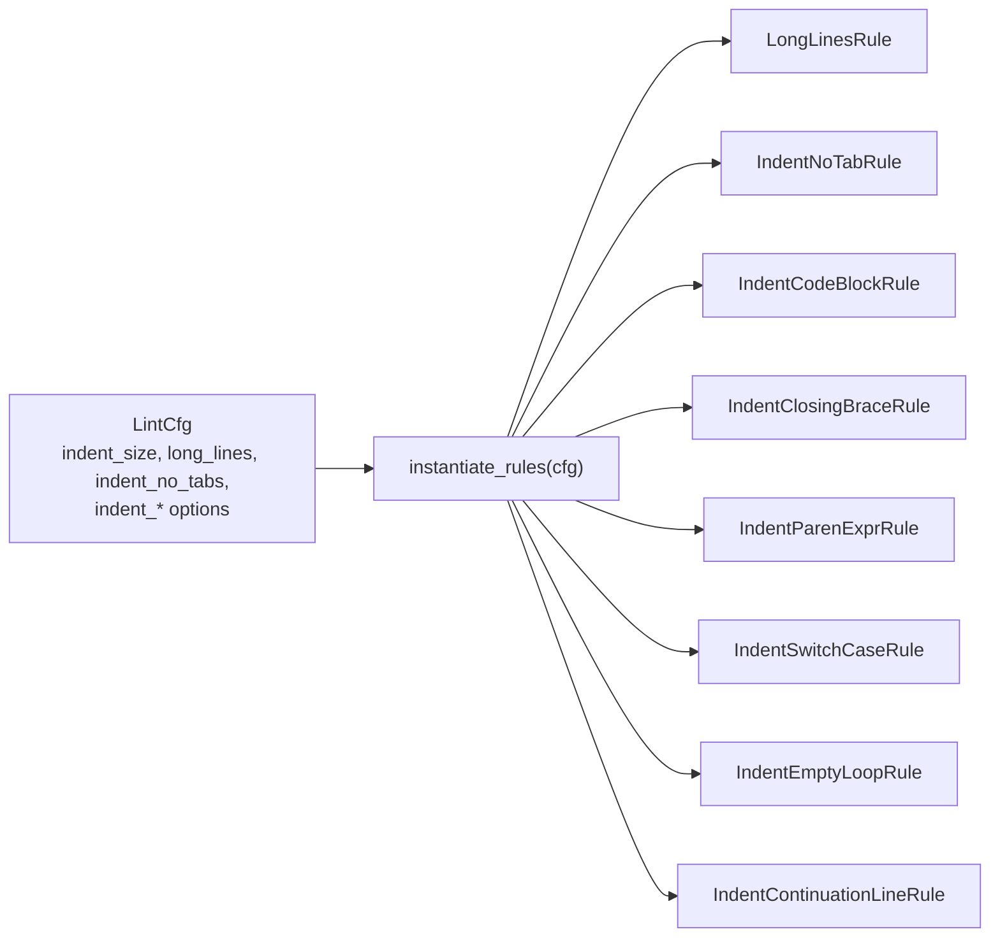

# Indentation Rules

<cite>
**Referenced Files in This Document**
- [indentation.rs](file://src/lint/rules/indentation.rs)
- [mod.rs](file://src/lint/mod.rs)
- [features.md](file://src/lint/features.md)
- [example_lint_cfg.json](file://example_files/example_lint_cfg.json)
- [example_lint_cfg.README](file://example_files/example_lint_cfg.README)
- [code_block.rs](file://src/lint/rules/tests/indentation/code_block.rs)
- [closing_brace.rs](file://src/lint/rules/tests/indentation/closing_brace.rs)
- [no_tabs.rs](file://src/lint/rules/tests/indentation/no_tabs.rs)
- [paren_expr.rs](file://src/lint/rules/tests/indentation/paren_expr.rs)
- [switch_case.rs](file://src/lint/rules/tests/indentation/switch_case.rs)
- [empty_loop.rs](file://src/lint/rules/tests/indentation/empty_loop.rs)
- [continuation_line.rs](file://src/lint/rules/tests/indentation/continuation_line.rs)
</cite>

## Table of Contents
1. [Introduction](#introduction)
2. [Project Structure](#project-structure)
3. [Core Components](#core-components)
4. [Architecture Overview](#architecture-overview)
5. [Detailed Component Analysis](#detailed-component-analysis)
6. [Dependency Analysis](#dependency-analysis)
7. [Performance Considerations](#performance-considerations)
8. [Troubleshooting Guide](#troubleshooting-guide)
9. [Conclusion](#conclusion)
10. [Appendices](#appendices)

## Introduction
This document describes the indentation rules subsystem of the DML language server. It covers all indentation-related rules, including long_lines, indent_size, indent_no_tabs, indent_code_block, indent_closing_brace, indent_paren_expr, indent_switch_case, indent_empty_loop, and indent_continuation_line. It explains the indentation calculation algorithm, depth tracking system, and line length validation. It also documents configuration options for indentation spaces, tab enforcement, and nested structure handling, along with examples of correct patterns, common violations, and automated correction strategies. Finally, it details the relationship between indentation rules and the auxiliary parameter system used for depth calculation.

## Project Structure
The indentation rules are implemented as part of the linting subsystem. The core logic resides in a single module file, with rule-specific implementations and supporting configuration structures. Tests are organized per-rule under dedicated test modules.

**Diagram sources**
- [mod.rs](file://src/lint/mod.rs#L1-L171)
- [indentation.rs](file://src/lint/rules/indentation.rs#L1-L859)
- [code_block.rs](file://src/lint/rules/tests/indentation/code_block.rs#L1-L301)
- [closing_brace.rs](file://src/lint/rules/tests/indentation/closing_brace.rs#L1-L205)
- [no_tabs.rs](file://src/lint/rules/tests/indentation/no_tabs.rs#L1-L74)
- [paren_expr.rs](file://src/lint/rules/tests/indentation/paren_expr.rs#L1-L379)
- [switch_case.rs](file://src/lint/rules/tests/indentation/switch_case.rs#L1-L59)
- [empty_loop.rs](file://src/lint/rules/tests/indentation/empty_loop.rs#L1-L113)
- [continuation_line.rs](file://src/lint/rules/tests/indentation/continuation_line.rs#L1-L195)

**Section sources**
- [mod.rs](file://src/lint/mod.rs#L1-L171)
- [indentation.rs](file://src/lint/rules/indentation.rs#L1-L859)

## Core Components
- LongLinesRule: Validates line length against a configurable maximum.
- IndentNoTabRule: Enforces that tabs are not used for indentation.
- IndentCodeBlockRule: Ensures code block members align to the expected indentation level based on depth and indentation_spaces.
- IndentClosingBraceRule: Validates closing brace alignment and placement.
- IndentParenExprRule: Validates continuation lines inside parenthesized expressions.
- IndentSwitchCaseRule: Validates switch case and statement indentation.
- IndentEmptyLoopRule: Validates indentation of empty loop bodies.
- IndentContinuationLineRule: Validates continuation lines outside parenthesized expressions.

These rules are instantiated from configuration and integrated into the linting pipeline.

**Section sources**
- [indentation.rs](file://src/lint/rules/indentation.rs#L64-L140)
- [indentation.rs](file://src/lint/rules/indentation.rs#L142-L252)
- [indentation.rs](file://src/lint/rules/indentation.rs#L254-L386)
- [indentation.rs](file://src/lint/rules/indentation.rs#L389-L564)
- [indentation.rs](file://src/lint/rules/indentation.rs#L567-L646)
- [indentation.rs](file://src/lint/rules/indentation.rs#L648-L734)
- [indentation.rs](file://src/lint/rules/indentation.rs#L736-L859)
- [mod.rs](file://src/lint/mod.rs#L21-L88)

## Architecture Overview
The indentation rules are part of the broader linting framework. Configuration is deserialized into a typed structure, then rules are instantiated and applied during analysis. The auxiliary parameter system supplies depth information to rules that require it.

**Diagram sources**
- [mod.rs](file://src/lint/mod.rs#L245-L265)
- [mod.rs](file://src/lint/mod.rs#L63-L76)
- [indentation.rs](file://src/lint/rules/indentation.rs#L1-L859)

**Section sources**
- [mod.rs](file://src/lint/mod.rs#L245-L265)
- [mod.rs](file://src/lint/mod.rs#L63-L76)

## Detailed Component Analysis

### Indentation Calculation Algorithm and Depth Tracking
- Base unit: indentation_spaces defines the number of spaces per indentation level.
- Depth is tracked via an auxiliary parameter passed to AST traversal. Rules compute expected indentation as depth × indentation_spaces.
- Implicit rule IN7: Non-indented lines inherit indentation from the previous non-empty line; this is enforced indirectly by IN3’s alignment logic.

Key behaviors:
- IN3 (indent_code_block): Members inside blocks must align to depth × indentation_spaces.
- IN4 (indent_closing_brace): Closing brace alignment depends on the expected depth derived from the containing construct.
- IN5 (indent_paren_expr): Continuation lines inside parentheses align to the column right after the opening parenthesis on the first line.
- IN9 (indent_switch_case): Case labels align to switch depth; statements inside a compound case align deeper.
- IN10 (indent_empty_loop): Empty loop semicolons align to the loop body depth.
- IN6 (indent_continuation_line): Continuation lines outside parentheses align to (depth + 1) × indentation_spaces.

Depth derivation:
- Compound statements and blocks increase depth.
- Switch constructs adjust depth differently for closing brace checks.
- Loop constructs increase depth for empty body semicolons.

**Section sources**
- [indentation.rs](file://src/lint/rules/indentation.rs#L234-L238)
- [indentation.rs](file://src/lint/rules/indentation.rs#L380-L384)
- [indentation.rs](file://src/lint/rules/indentation.rs#L535-L550)
- [indentation.rs](file://src/lint/rules/indentation.rs#L628-L632)
- [indentation.rs](file://src/lint/rules/indentation.rs#L717-L720)
- [indentation.rs](file://src/lint/rules/indentation.rs#L825-L844)

### Configuration Options and Defaults
- indent_size: Sets indentation_spaces globally for indentation rules that accept an indentation_spaces option.
- long_lines: Controls line length validation with max_length.
- indent_no_tabs: Disables tabs for indentation.
- indent_code_block, indent_closing_brace, indent_switch_case, indent_empty_loop, indent_continuation_line: Accept indentation_spaces to customize spacing per rule.
- indent_paren_expr: No configuration; applies fixed alignment inside parentheses.

Defaults are defined and applied during configuration initialization.

**Section sources**
- [mod.rs](file://src/lint/mod.rs#L106-L133)
- [mod.rs](file://src/lint/mod.rs#L154-L184)
- [indentation.rs](file://src/lint/rules/indentation.rs#L33-L38)
- [indentation.rs](file://src/lint/rules/indentation.rs#L40-L58)
- [example_lint_cfg.json](file://example_files/example_lint_cfg.json#L1-L28)
- [example_lint_cfg.README](file://example_files/example_lint_cfg.README#L22-L28)

### Rule-by-Rule Behavior and Examples

#### LongLinesRule (LL1)
- Purpose: Enforce a maximum line length.
- Behavior: Emits an error when a line exceeds max_length.
- Configuration: long_lines.max_length.

Examples:
- Correct: Lines under the threshold.
- Incorrect: Lines exceeding the threshold.

**Section sources**
- [indentation.rs](file://src/lint/rules/indentation.rs#L64-L92)
- [mod.rs](file://src/lint/mod.rs#L106-L106)
- [features.md](file://src/lint/features.md#L52-L53)

#### IndentNoTabRule (IN2)
- Purpose: Prohibit tab characters in indentation.
- Behavior: Scans each line and reports tabs found within indentation.
- Configuration: indent_no_tabs (enable/disable).

Examples:
- Correct: Only spaces used for indentation.
- Incorrect: Tabs used in indentation.

**Section sources**
- [indentation.rs](file://src/lint/rules/indentation.rs#L113-L140)
- [no_tabs.rs](file://src/lint/rules/tests/indentation/no_tabs.rs#L1-L74)

#### IndentCodeBlockRule (IN3)
- Purpose: Align code block members to expected indentation.
- Behavior: Computes expected column as depth × indentation_spaces and validates each member.
- Configuration: indent_code_block.indentation_spaces.

Examples:
- Correct: Members indented consistently inside blocks.
- Incorrect: Misaligned members inside blocks.

**Section sources**
- [indentation.rs](file://src/lint/rules/indentation.rs#L142-L252)
- [code_block.rs](file://src/lint/rules/tests/indentation/code_block.rs#L1-L301)

#### IndentClosingBraceRule (IN4)
- Purpose: Validate closing brace alignment and placement.
- Behavior: Checks that closing brace appears first on the line and aligns to the expected depth; special handling for switch constructs.
- Configuration: indent_closing_brace.indentation_spaces.

Examples:
- Correct: Brace on its own line and properly aligned.
- Incorrect: Over/under-indented or not-first-in-line.

**Section sources**
- [indentation.rs](file://src/lint/rules/indentation.rs#L254-L386)
- [closing_brace.rs](file://src/lint/rules/tests/indentation/closing_brace.rs#L1-L205)

#### IndentParenExprRule (IN5)
- Purpose: Align continuation lines inside parenthesized expressions with the opening parenthesis.
- Behavior: Filters tokens to avoid nested parentheses and checks continuation lines’ alignment.
- Configuration: none.

Examples:
- Correct: Continuation lines line up inside parentheses.
- Incorrect: Misaligned continuation lines inside parentheses.

**Section sources**
- [indentation.rs](file://src/lint/rules/indentation.rs#L389-L564)
- [paren_expr.rs](file://src/lint/rules/tests/indentation/paren_expr.rs#L1-L379)

#### IndentSwitchCaseRule (IN9)
- Purpose: Align case labels and statements within switch blocks.
- Behavior: Case labels align to switch depth; statements inside a compound case align deeper; excludes certain constructs.
- Configuration: indent_switch_case.indentation_spaces.

Examples:
- Correct: Case labels and statements properly indented.
- Incorrect: Misaligned case labels or statements.

**Section sources**
- [indentation.rs](file://src/lint/rules/indentation.rs#L567-L646)
- [switch_case.rs](file://src/lint/rules/tests/indentation/switch_case.rs#L1-L59)

#### IndentEmptyLoopRule (IN10)
- Purpose: Indent empty loop bodies appropriately.
- Behavior: Validates semicolon alignment and ensures it is not on the same line as the loop keyword.
- Configuration: indent_empty_loop.indentation_spaces.

Examples:
- Correct: Semicolon indented at loop body depth.
- Incorrect: Misaligned or misplaced semicolon.

**Section sources**
- [indentation.rs](file://src/lint/rules/indentation.rs#L648-L734)
- [empty_loop.rs](file://src/lint/rules/tests/indentation/empty_loop.rs#L1-L113)

#### IndentContinuationLineRule (IN6)
- Purpose: Align continuation lines outside parentheses to (depth + 1) × indentation_spaces.
- Behavior: Filters tokens and enforces alignment for continuation lines.
- Configuration: indent_continuation_line.indentation_spaces.

Examples:
- Correct: Continuation lines indented one level deeper than parent depth.
- Incorrect: Misaligned continuation lines.

**Section sources**
- [indentation.rs](file://src/lint/rules/indentation.rs#L736-L859)
- [continuation_line.rs](file://src/lint/rules/tests/indentation/continuation_line.rs#L1-L195)

### Automated Correction Strategies
- Indentation fixes are typically performed by adjusting leading whitespace to match expected columns computed from depth and indentation_spaces.
- For IN3/IN9/IN10, align the first token of the line to depth × indentation_spaces or (depth + 1) × indentation_spaces.
- For IN4, ensure the closing brace is first on the line and aligned to the expected depth.
- For IN5, align continuation lines inside parentheses to the position right after the opening parenthesis on the first line.
- For IN6, align continuation lines outside parentheses to (depth + 1) × indentation_spaces.
- For IN2, replace tab characters with the equivalent number of spaces based on the current column and indentation_spaces.

[No sources needed since this section provides general guidance]

## Dependency Analysis
The indentation rules share a common configuration model and rely on the auxiliary depth parameter. They are instantiated from LintCfg and applied during AST traversal and per-line scanning.

**Diagram sources**
- [mod.rs](file://src/lint/mod.rs#L62-L88)
- [indentation.rs](file://src/lint/rules/indentation.rs#L1-L859)

**Section sources**
- [mod.rs](file://src/lint/mod.rs#L62-L88)
- [indentation.rs](file://src/lint/rules/indentation.rs#L1-L859)

## Performance Considerations
- Token filtering and iteration occur primarily in IN5 and IN6; avoid unnecessary allocations by reusing iterators and minimizing repeated scans.
- IN2 performs a linear scan per line; keep line lengths reasonable to minimize overhead.
- IN3/IN9/IN10 rely on precomputed ranges; ensure efficient range queries and avoid redundant computations.

[No sources needed since this section provides general guidance]

## Troubleshooting Guide
Common issues and resolutions:
- Misaligned closing braces: Ensure the closing brace is first on the line and aligned to the expected depth.
- Misaligned code block members: Verify indentation_spaces and depth are consistent across nested constructs.
- Misaligned continuation lines: For IN5, align inside parentheses; for IN6, align to (depth + 1) × indentation_spaces.
- Empty loop semicolons: Ensure the semicolon is indented at the loop body depth and not on the same line as the loop keyword.
- Tabs in indentation: Replace tabs with spaces based on indentation_spaces.

Validation references:
- IN2: Per-line tab scanning.
- IN3: Member alignment checks.
- IN4: Closing brace alignment and placement.
- IN5: Parentheses continuation alignment.
- IN6: Continuation line alignment outside parentheses.
- IN9: Switch case and statement alignment.
- IN10: Empty loop body alignment.

**Section sources**
- [indentation.rs](file://src/lint/rules/indentation.rs#L117-L128)
- [indentation.rs](file://src/lint/rules/indentation.rs#L220-L233)
- [indentation.rs](file://src/lint/rules/indentation.rs#L363-L385)
- [indentation.rs](file://src/lint/rules/indentation.rs#L529-L550)
- [indentation.rs](file://src/lint/rules/indentation.rs#L820-L845)
- [indentation.rs](file://src/lint/rules/indentation.rs#L619-L627)
- [indentation.rs](file://src/lint/rules/indentation.rs#L705-L716)

## Conclusion
The indentation rules subsystem provides comprehensive enforcement of indentation styles across DML constructs. By centralizing indentation_spaces configuration and leveraging a shared depth parameter, the rules maintain consistency across nested structures. Tests validate expected behaviors for each rule, ensuring reliable detection and guiding automated corrections.

[No sources needed since this section summarizes without analyzing specific files]

## Appendices

### Configuration Reference
- indent_size: Sets indentation_spaces globally for indentation rules.
- long_lines: Controls line length validation with max_length.
- indent_no_tabs: Enables tab prohibition.
- indent_code_block, indent_closing_brace, indent_switch_case, indent_empty_loop, indent_continuation_line: Accept indentation_spaces.

**Section sources**
- [mod.rs](file://src/lint/mod.rs#L106-L133)
- [example_lint_cfg.json](file://example_files/example_lint_cfg.json#L1-L28)
- [example_lint_cfg.README](file://example_files/example_lint_cfg.README#L22-L28)

### Rule Type Index
- IN2: indent_no_tabs
- IN3: indent_code_block
- IN4: indent_closing_brace
- IN5: indent_paren_expr
- IN6: indent_continuation_line
- IN9: indent_switch_case
- IN10: indent_empty_loop
- LL1: long_lines

**Section sources**
- [mod.rs](file://src/lint/mod.rs#L107-L133)
- [features.md](file://src/lint/features.md#L22-L51)