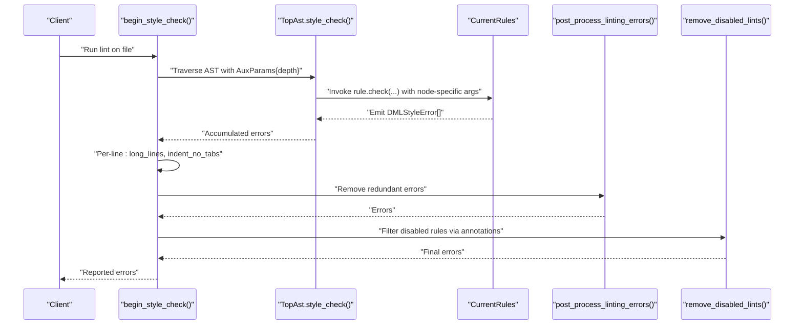
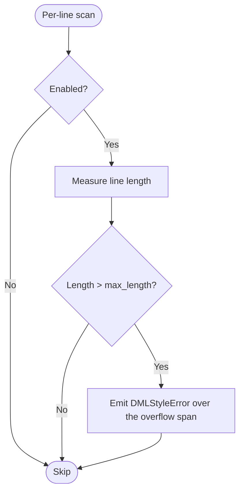
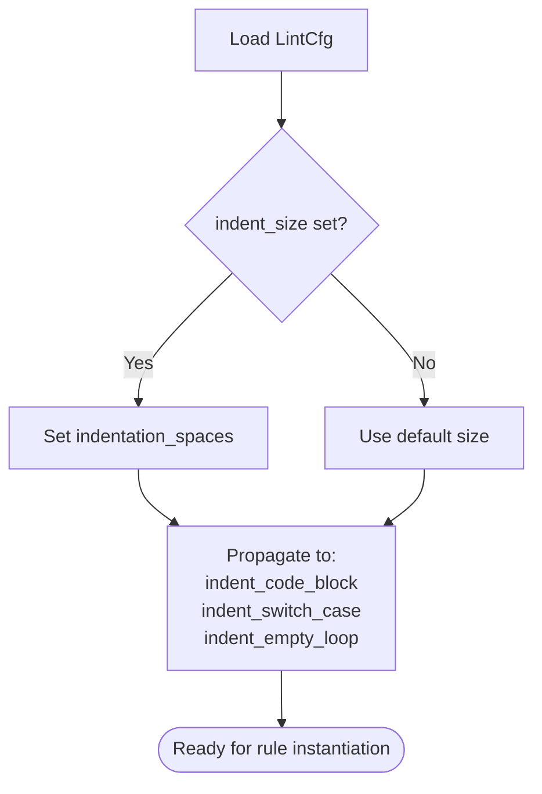
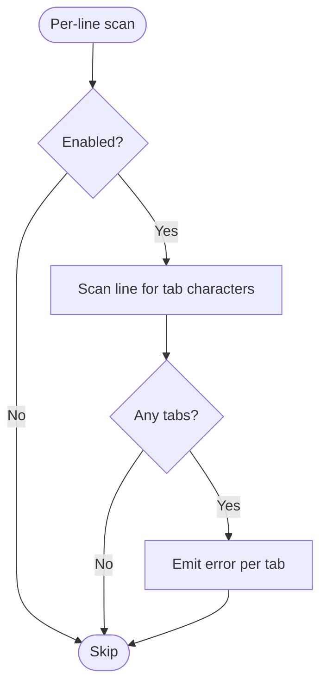
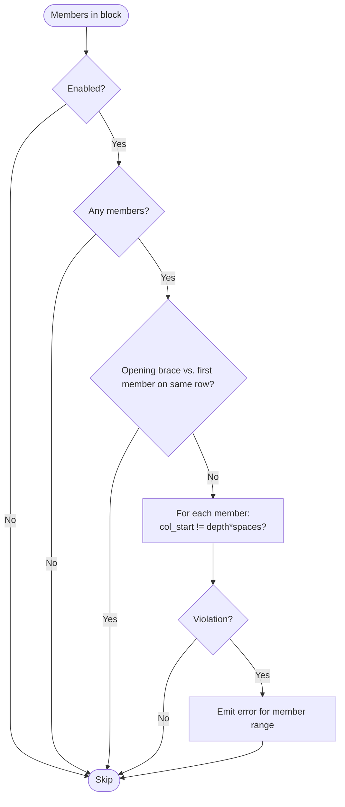
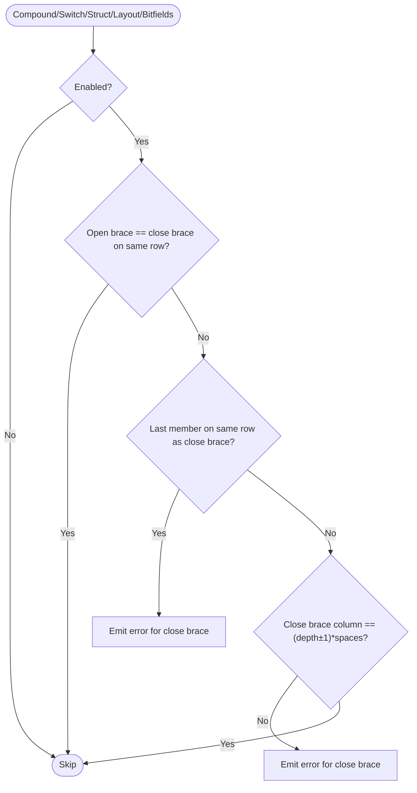
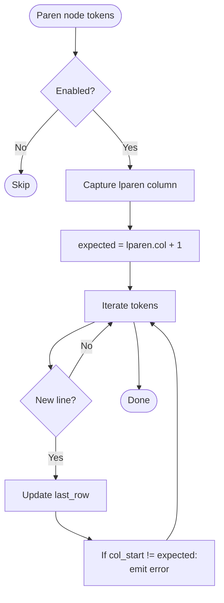
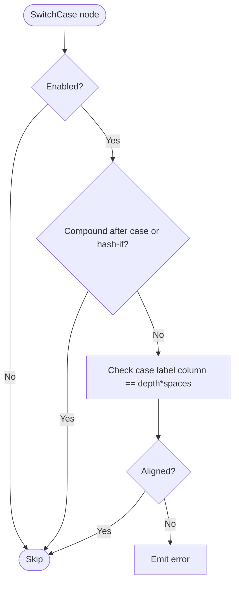
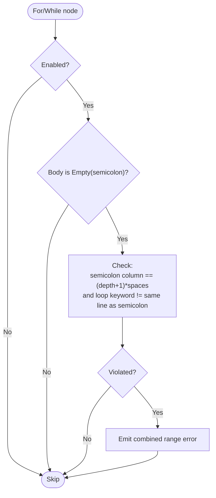
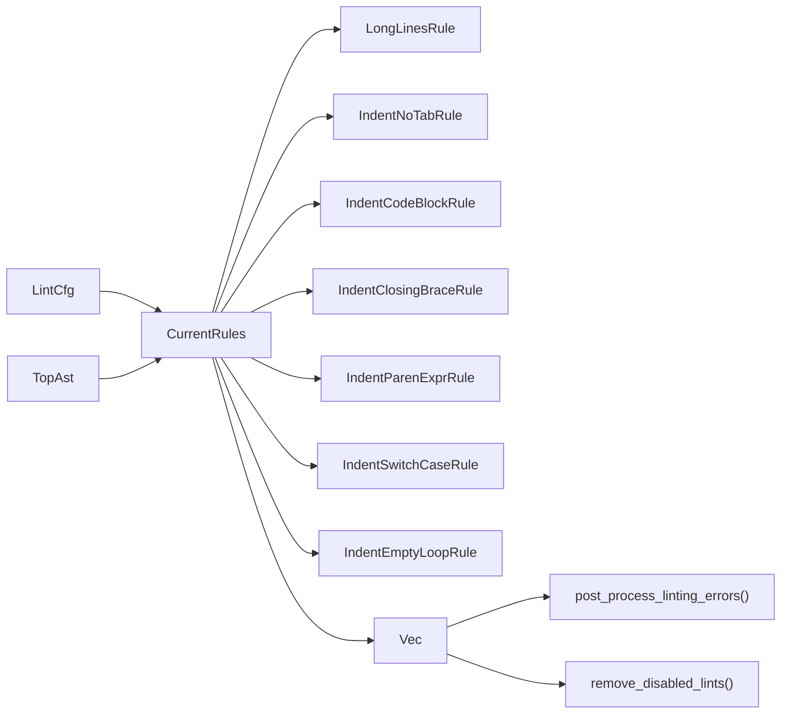

# Indentation Rules

<cite>
**Referenced Files in This Document**
- [indentation.rs](file://src/lint/rules/indentation.rs)
- [mod.rs](file://src/lint/rules/mod.rs)
- [lint/mod.rs](file://src/lint/mod.rs)
- [no_tabs.rs](file://src/lint/rules/tests/indentation/no_tabs.rs)
- [code_block.rs](file://src/lint/rules/tests/indentation/code_block.rs)
- [closing_brace.rs](file://src/lint/rules/tests/indentation/closing_brace.rs)
- [paren_expr.rs](file://src/lint/rules/tests/indentation/paren_expr.rs)
- [switch_case.rs](file://src/lint/rules/tests/indentation/switch_case.rs)
- [empty_loop.rs](file://src/lint/rules/tests/indentation/empty_loop.rs)
- [tests/mod.rs](file://src/lint/rules/tests/indentation/mod.rs)
</cite>

## Table of Contents
1. [Introduction](#introduction)
2. [Project Structure](#project-structure)
3. [Core Components](#core-components)
4. [Architecture Overview](#architecture-overview)
5. [Detailed Component Analysis](#detailed-component-analysis)
6. [Dependency Analysis](#dependency-analysis)
7. [Performance Considerations](#performance-considerations)
8. [Troubleshooting Guide](#troubleshooting-guide)
9. [Conclusion](#conclusion)

## Introduction
This document explains the indentation-related lint rules that enforce consistent indentation practices in DML code. It covers each rule’s configuration, behavior, and interaction with the AST traversal pipeline. It also documents the depth parameter system for nested structures, indentation calculation algorithms, hierarchical enforcement, post-processing logic, and performance characteristics. Examples and edge cases are included to help diagnose violations and tune configurations.

## Project Structure
The indentation rules live under the linting subsystem and are integrated with the AST traversal and per-line checks. Configuration is centralized and supports defaults and overrides.

```mermaid
graph TB
subgraph "Linting"
LintCfg["LintCfg<br/>configuration"]
Rules["CurrentRules<br/>instantiation"]
PostProc["post_process_linting_errors()<br/>remove redundant errors"]
Disabled["remove_disabled_lints()<br/>apply annotations"]
end
subgraph "Rules"
IndentRules["Indentation Rules<br/>LongLines, NoTabs,<br/>CodeBlock, ClosingBrace,<br/>ParenExpr, SwitchCase,<br/>EmptyLoop"]
end
subgraph "AST"
AST["TopAst<br/>style_check()"]
Depth["AuxParams.depth<br/>nested depth tracking"]
end
LintCfg --> Rules
Rules --> AST
AST --> Depth
AST --> IndentRules
AST --> PostProc
PostProc --> Disabled
```

**Diagram sources**
- [lint/mod.rs](file://src/lint/mod.rs#L209-L229)
- [indentation.rs](file://src/lint/rules/indentation.rs#L1-L695)
- [mod.rs](file://src/lint/rules/mod.rs#L43-L64)

**Section sources**
- [lint/mod.rs](file://src/lint/mod.rs#L68-L157)
- [mod.rs](file://src/lint/rules/mod.rs#L18-L64)

## Core Components
- LongLinesRule: Enforces a configurable maximum line length.
- IndentNoTabRule: Prohibits tab characters in indentation.
- IndentCodeBlockRule: Enforces alignment of code block members relative to the opening brace.
- IndentClosingBraceRule: Enforces closing brace alignment and placement.
- IndentParenExprRule: Enforces continuation alignment inside parenthesized expressions.
- IndentSwitchCaseRule: Enforces case/default indentation and statement indentation.
- IndentEmptyLoopRule: Enforces indentation of empty loop bodies.

Each rule exposes:
- Options struct for configuration (e.g., IndentSizeOptions, IndentCodeBlockOptions).
- A from_options constructor to build rule instances from LintCfg.
- A check method that validates AST nodes or lines and appends DMLStyleError entries.

Defaults and global indentation size propagation are handled centrally.

**Section sources**
- [indentation.rs](file://src/lint/rules/indentation.rs#L16-L38)
- [indentation.rs](file://src/lint/rules/indentation.rs#L40-L83)
- [indentation.rs](file://src/lint/rules/indentation.rs#L85-L120)
- [indentation.rs](file://src/lint/rules/indentation.rs#L122-L232)
- [indentation.rs](file://src/lint/rules/indentation.rs#L234-L366)
- [indentation.rs](file://src/lint/rules/indentation.rs#L369-L524)
- [indentation.rs](file://src/lint/rules/indentation.rs#L527-L606)
- [indentation.rs](file://src/lint/rules/indentation.rs#L608-L695)
- [mod.rs](file://src/lint/rules/mod.rs#L18-L64)

## Architecture Overview
The linting pipeline integrates indentation rules in two passes:
- AST traversal pass: Rules receive structured arguments (e.g., IndentCodeBlockArgs, IndentParenExprArgs) and emit errors based on nested depth and structural positions.
- Per-line pass: LongLinesRule and IndentNoTabRule scan each line for violations.

Post-processing removes redundant errors caused by tab violations and applies user annotations to suppress specific rules.



**Diagram sources**
- [lint/mod.rs](file://src/lint/mod.rs#L209-L229)
- [mod.rs](file://src/lint/rules/mod.rs#L22-L41)

## Detailed Component Analysis

### LongLineOptions and LongLinesRule
- Purpose: Detect lines exceeding a configured maximum length.
- Configuration: LongLineOptions.max_length; default is provided.
- Behavior: Emits a single error spanning the overflow region on the violating line.
- Integration: Per-line check during begin_style_check.



**Diagram sources**
- [indentation.rs](file://src/lint/rules/indentation.rs#L49-L72)
- [lint/mod.rs](file://src/lint/mod.rs#L214-L220)

**Section sources**
- [indentation.rs](file://src/lint/rules/indentation.rs#L40-L83)
- [tests/mod.rs](file://src/lint/rules/tests/indentation/mod.rs#L15-L43)
- [lint/mod.rs](file://src/lint/mod.rs#L214-L220)

### IndentSizeOptions and Global Propagation
- Purpose: Centralize indentation size for indentation-sensitive rules.
- Behavior: setup_indentation_size propagates indentation_spaces to related options (code block, switch case, empty loop).



**Diagram sources**
- [indentation.rs](file://src/lint/rules/indentation.rs#L23-L38)
- [lint/mod.rs](file://src/lint/mod.rs#L56-L56)

**Section sources**
- [indentation.rs](file://src/lint/rules/indentation.rs#L16-L38)
- [lint/mod.rs](file://src/lint/mod.rs#L31-L34)
- [lint/mod.rs](file://src/lint/mod.rs#L146-L156)

### IndentNoTabOptions and IndentNoTabRule
- Purpose: Prohibit tab characters in indentation.
- Behavior: Scans each line and emits an error for each tab found.
- Post-processing: post_process_linting_errors removes subsequent indentation rule errors on lines containing tabs.



**Diagram sources**
- [indentation.rs](file://src/lint/rules/indentation.rs#L97-L110)
- [lint/mod.rs](file://src/lint/mod.rs#L214-L220)
- [lint/mod.rs](file://src/lint/mod.rs#L366-L379)

**Section sources**
- [indentation.rs](file://src/lint/rules/indentation.rs#L85-L120)
- [no_tabs.rs](file://src/lint/rules/tests/indentation/no_tabs.rs#L4-L41)
- [lint/mod.rs](file://src/lint/mod.rs#L366-L379)

### IndentCodeBlockOptions and IndentCodeBlockRule
- Purpose: Enforce that members inside code blocks align with expected indentation derived from depth.
- Calculation: expected column = depth × indentation_spaces.
- Scope: Works with compound statements, object statements (list form), struct types, layouts, and bitfields.
- Edge cases: Ignores empty blocks and trivial cases where brace and member are on the same row.



**Diagram sources**
- [indentation.rs](file://src/lint/rules/indentation.rs#L187-L219)
- [indentation.rs](file://src/lint/rules/indentation.rs#L140-L185)

**Section sources**
- [indentation.rs](file://src/lint/rules/indentation.rs#L122-L232)
- [code_block.rs](file://src/lint/rules/tests/indentation/code_block.rs#L4-L37)
- [code_block.rs](file://src/lint/rules/tests/indentation/code_block.rs#L144-L175)

### IndentClosingBraceOptions and IndentClosingBraceRule
- Purpose: Enforce closing brace alignment and placement.
- Calculation: expected column for closing brace is (depth − 1) × indentation_spaces (or depth for switch).
- Logic: If the opening and closing brace are on the same line, skip. If the last member and closing brace share a row, flag. Otherwise, check alignment against expected depth.



**Diagram sources**
- [indentation.rs](file://src/lint/rules/indentation.rs#L329-L366)
- [indentation.rs](file://src/lint/rules/indentation.rs#L266-L327)

**Section sources**
- [indentation.rs](file://src/lint/rules/indentation.rs#L234-L366)
- [closing_brace.rs](file://src/lint/rules/tests/indentation/closing_brace.rs#L17-L95)
- [closing_brace.rs](file://src/lint/rules/tests/indentation/closing_brace.rs#L177-L202)

### IndentParenExprOptions and IndentParenExprRule
- Purpose: Enforce continuation alignment inside parenthesized expressions.
- Algorithm: Compute expected start column as (left-paren column + 1). For each continuation token, ensure it starts at the expected column on its line.
- Filtering: Nested parentheses are filtered out to avoid double-checking nested expressions that are validated by their own rule.



**Diagram sources**
- [indentation.rs](file://src/lint/rules/indentation.rs#L493-L511)
- [indentation.rs](file://src/lint/rules/indentation.rs#L381-L491)

**Section sources**
- [indentation.rs](file://src/lint/rules/indentation.rs#L369-L524)
- [paren_expr.rs](file://src/lint/rules/tests/indentation/paren_expr.rs#L7-L32)
- [paren_expr.rs](file://src/lint/rules/tests/indentation/paren_expr.rs#L109-L129)

### IndentSwitchCaseOptions and IndentSwitchCaseRule
- Purpose: Enforce case/default indentation and statement indentation.
- Calculation: Case labels align to depth × indentation_spaces; statements inside a case are indented one additional level.
- Exceptions: Skips compound statements immediately after case and hash-if constructs.



**Diagram sources**
- [indentation.rs](file://src/lint/rules/indentation.rs#L566-L593)
- [indentation.rs](file://src/lint/rules/indentation.rs#L543-L564)

**Section sources**
- [indentation.rs](file://src/lint/rules/indentation.rs#L527-L606)
- [switch_case.rs](file://src/lint/rules/tests/indentation/switch_case.rs#L27-L56)

### IndentEmptyLoopOptions and IndentEmptyLoopRule
- Purpose: Enforce indentation of the semicolon in empty loops.
- Calculation: Semicolon column should equal (loop_depth + 1) × indentation_spaces; loop keyword and semicolon must not be on the same line.
- Supported constructs: for and while empty loops.



**Diagram sources**
- [indentation.rs](file://src/lint/rules/indentation.rs#L652-L681)
- [indentation.rs](file://src/lint/rules/indentation.rs#L620-L650)

**Section sources**
- [indentation.rs](file://src/lint/rules/indentation.rs#L608-L695)
- [empty_loop.rs](file://src/lint/rules/tests/indentation/empty_loop.rs#L4-L18)
- [empty_loop.rs](file://src/lint/rules/tests/indentation/empty_loop.rs#L54-L110)

## Dependency Analysis
- Rule instantiation: CurrentRules aggregates all rules and sets enabled flags from LintCfg.
- Rule types: Each rule implements Rule and exposes a RuleType discriminant for filtering and annotations.
- Post-processing: A dedicated pass removes redundant errors produced by tab violations; another pass filters errors suppressed by user annotations.



**Diagram sources**
- [mod.rs](file://src/lint/rules/mod.rs#L22-L64)
- [lint/mod.rs](file://src/lint/mod.rs#L209-L229)

**Section sources**
- [mod.rs](file://src/lint/rules/mod.rs#L18-L64)
- [lint/mod.rs](file://src/lint/mod.rs#L366-L392)

## Performance Considerations
- Single-pass scanning: LongLinesRule and IndentNoTabRule operate in O(n_lines) time with minimal overhead.
- AST traversal: Indentation rules rely on node-specific argument builders that collect ranges efficiently; avoid re-scanning tokens unnecessarily.
- Post-processing cost: post_process_linting_errors iterates over errors once and performs containment checks; keep error counts reasonable.
- Token filtering: IndentParenExprRule filters nested parentheses to prevent redundant checks; this reduces repeated work on deeply nested expressions.

[No sources needed since this section provides general guidance]

## Troubleshooting Guide
Common issues and debugging techniques:
- Tabs in indentation cause cascading errors across multiple rules. The post-processor removes subsequent indentation rule errors on lines containing tabs. To investigate, temporarily disable post-processing or review the per-line pass.
- Switch case misalignment often occurs when the statement indentation level is incorrect. Verify the expected depth and indentation_spaces.
- Empty loop errors frequently arise when the semicolon is not indented to the next level or appears on the same line as the loop keyword.
- Parenthesized expression continuation errors indicate misaligned continuation lines; confirm the expected column equals the left-paren column plus one.
- Use dml-lint annotations to allow specific rules per file or per line to isolate problematic regions and narrow down the root cause.

**Section sources**
- [lint/mod.rs](file://src/lint/mod.rs#L366-L379)
- [lint/mod.rs](file://src/lint/mod.rs#L252-L364)
- [switch_case.rs](file://src/lint/rules/tests/indentation/switch_case.rs#L27-L56)
- [empty_loop.rs](file://src/lint/rules/tests/indentation/empty_loop.rs#L4-L18)
- [paren_expr.rs](file://src/lint/rules/tests/indentation/paren_expr.rs#L7-L32)

## Conclusion
The indentation lint suite enforces consistent DML indentation through a combination of AST-aware checks and per-line validations. The depth parameter system and indentation size propagation enable predictable, hierarchical enforcement. Post-processing ensures clean reporting by removing redundant errors, while annotations provide fine-grained control over rule applicability. Tuning configuration and understanding the depth semantics are key to effective diagnostics and maintenance of consistent indentation across complex DML constructs.