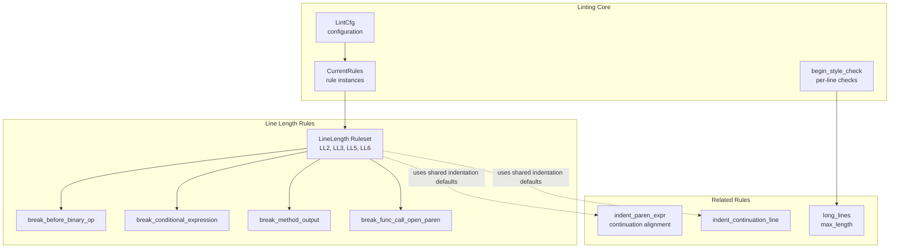
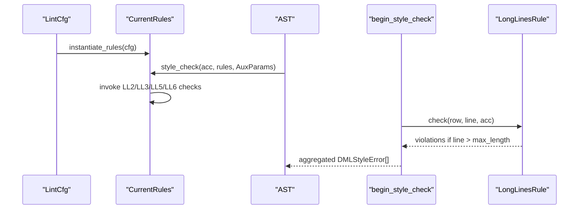
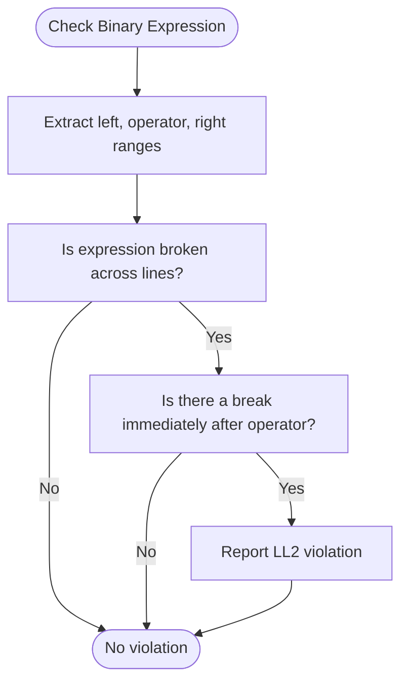
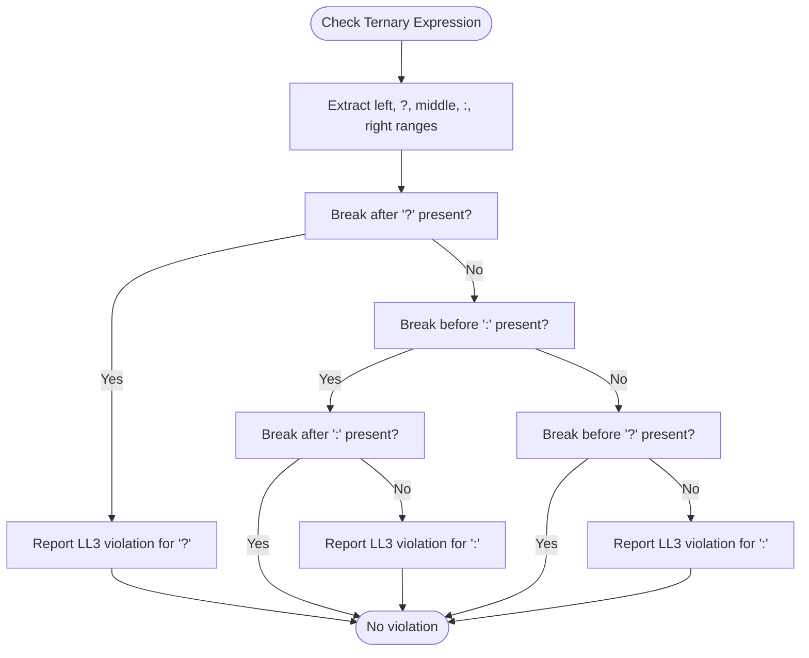
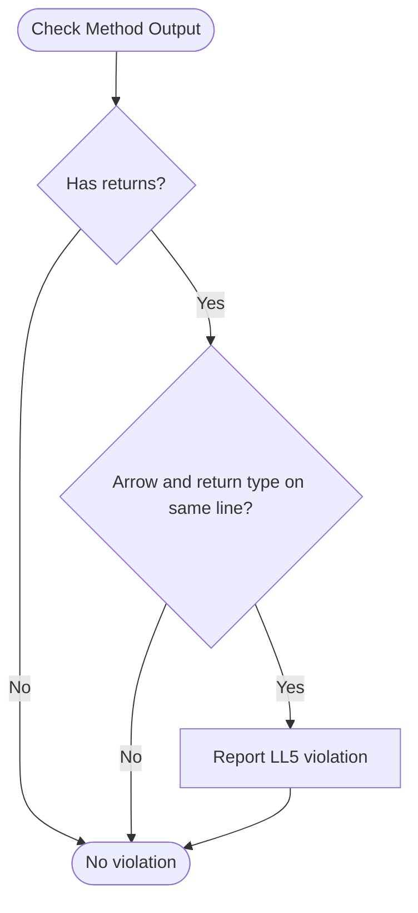
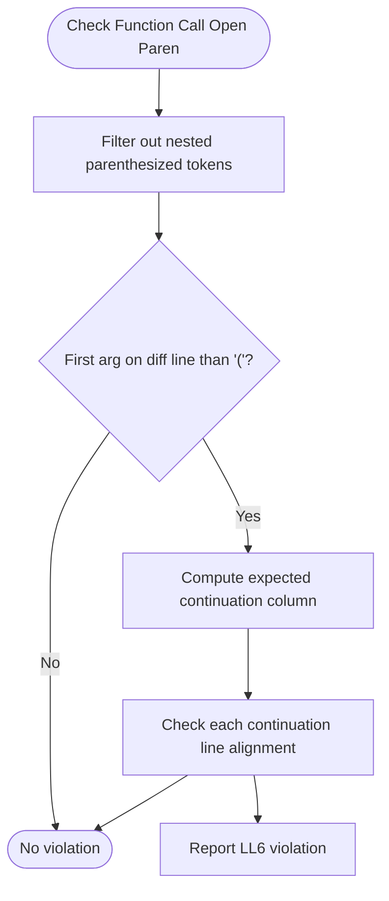
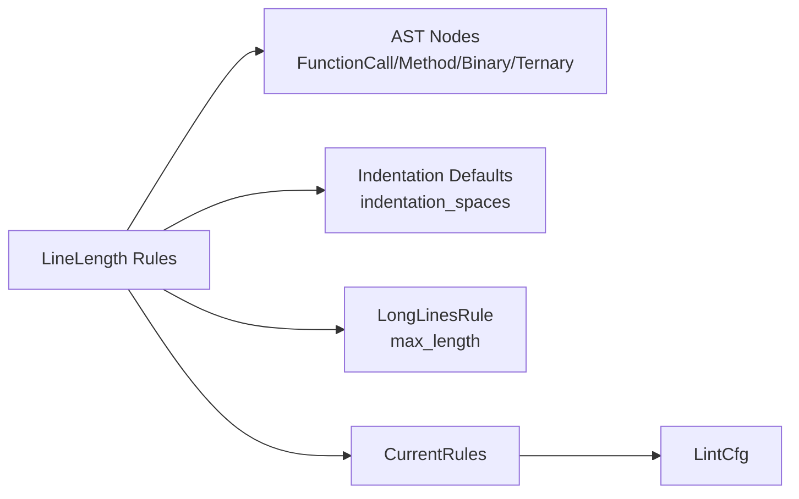

# Line Length Rules

<cite>
**Referenced Files in This Document**
- [linelength.rs](file://src/lint/rules/linelength.rs)
- [indentation.rs](file://src/lint/rules/indentation.rs)
- [mod.rs](file://src/lint/mod.rs)
- [break_func_call_open_paren.rs](file://src/lint/rules/tests/linelength/break_func_call_open_paren.rs)
- [break_conditional_expression.rs](file://src/lint/rules/tests/linelength/break_conditional_expression.rs)
- [break_method_output.rs](file://src/lint/rules/tests/linelength/break_method_output.rs)
- [break_before_binary_op.rs](file://src/lint/rules/tests/linelength/break_before_binary_op.rs)
- [example_lint_cfg.json](file://example_files/example_lint_cfg.json)
</cite>

## Table of Contents
1. [Introduction](#introduction)
2. [Project Structure](#project-structure)
3. [Core Components](#core-components)
4. [Architecture Overview](#architecture-overview)
5. [Detailed Component Analysis](#detailed-component-analysis)
6. [Dependency Analysis](#dependency-analysis)
7. [Performance Considerations](#performance-considerations)
8. [Troubleshooting Guide](#troubleshooting-guide)
9. [Conclusion](#conclusion)

## Introduction
This document describes the line length rules subsystem that enforces readable, maintainable line formatting in DML code. It focuses on four targeted rules:
- break_func_call_open_paren: Enforces continuation indentation after an opening parenthesis for function/method calls and casts.
- break_conditional_expression: Enforces proper wrapping of ternary operators to improve readability.
- break_method_output: Enforces line-breaking before the arrow in method signatures with output parameters.
- break_before_binary_op: Enforces placing line breaks before binary operators rather than after.

It explains the underlying algorithms, configuration options, and integration with the broader linting pipeline. It also covers how these rules interact with the global maximum line length enforcement and editor auto-formatting workflows.

## Project Structure
The line length rules live under the linting subsystem and integrate with the broader lint configuration and rule instantiation framework.

**Diagram sources**
- [mod.rs](file://src/lint/mod.rs#L62-L88)
- [linelength.rs](file://src/lint/rules/linelength.rs#L21-L346)
- [indentation.rs](file://src/lint/rules/indentation.rs#L64-L103)

**Section sources**
- [mod.rs](file://src/lint/mod.rs#L62-L88)
- [linelength.rs](file://src/lint/rules/linelength.rs#L21-L346)
- [indentation.rs](file://src/lint/rules/indentation.rs#L64-L103)

## Core Components
- break_before_binary_op (LL2): Detects when a binary expression is broken after the operator and reports a violation, requiring the break to occur before the operator.
- break_conditional_expression (LL3): Ensures proper wrapping of ternary expressions, preferring breaks before the ? and optionally before the : when needed.
- break_method_output (LL5): Requires breaking the method signature before the arrow when output parameters are present, ensuring consistent formatting.
- break_func_call_open_paren (LL6): Enforces continuation indentation immediately after an opening parenthesis for function calls, casts, and method signatures, using a configurable indentation level.

These rules are instantiated from the lint configuration and participate in the AST traversal and per-line checks.

**Section sources**
- [linelength.rs](file://src/lint/rules/linelength.rs#L21-L346)
- [mod.rs](file://src/lint/mod.rs#L62-L88)

## Architecture Overview
The linting pipeline loads the configuration, instantiates rules, traverses the AST to collect style violations, and performs per-line checks including maximum line length. The line length rules are invoked during AST traversal and rely on token ranges and indentation defaults.

**Diagram sources**
- [mod.rs](file://src/lint/mod.rs#L245-L265)
- [indentation.rs](file://src/lint/rules/indentation.rs#L64-L92)

**Section sources**
- [mod.rs](file://src/lint/mod.rs#L245-L265)
- [indentation.rs](file://src/lint/rules/indentation.rs#L64-L92)

## Detailed Component Analysis

### break_before_binary_op (LL2)
Purpose: Prevents breaking binary expressions after the operator. Instead, the line break must occur before the operator.

Algorithm:
- Extract left operand, operator, and right operand ranges from a binary expression.
- Determine if the expression is broken across lines and whether there is a break immediately after the operator.
- Report a violation if both conditions are true.

Smart wrapping strategy:
- Prefer placing the operator at the end of the previous line to keep the continuation clean and readable.

**Diagram sources**
- [linelength.rs](file://src/lint/rules/linelength.rs#L222-L274)

**Section sources**
- [linelength.rs](file://src/lint/rules/linelength.rs#L222-L274)
- [break_before_binary_op.rs](file://src/lint/rules/tests/linelength/break_before_binary_op.rs#L1-L60)

### break_conditional_expression (LL3)
Purpose: Enforce consistent wrapping of ternary expressions. Prefer breaking before the ? and optionally before the : when necessary.

Algorithm:
- Extract ranges for left, left_operation (?), middle, right_operation (:), and right.
- Check for breaks around the ? and : operators.
- Report violations when breaks occur after ? or after : without corresponding breaks before ?.

Smart wrapping strategy:
- Place the ? on its own line when continuing the expression.
- Optionally place the : on its own line for clarity in complex ternary chains.

**Diagram sources**
- [linelength.rs](file://src/lint/rules/linelength.rs#L276-L345)

**Section sources**
- [linelength.rs](file://src/lint/rules/linelength.rs#L276-L345)
- [break_conditional_expression.rs](file://src/lint/rules/tests/linelength/break_conditional_expression.rs#L1-L85)

### break_method_output (LL5)
Purpose: Enforce breaking method signatures with output parameters before the arrow (->) to improve readability.

Algorithm:
- Build arguments from the method’s return clause.
- Compare the rows of the arrow and the return type.
- Report a violation if the arrow and return type are not on separate lines.

Smart wrapping strategy:
- Keep the method name and parameter list on the first line, move the arrow and return type to the next line.

**Diagram sources**
- [linelength.rs](file://src/lint/rules/linelength.rs#L21-L71)

**Section sources**
- [linelength.rs](file://src/lint/rules/linelength.rs#L21-L71)
- [break_method_output.rs](file://src/lint/rules/tests/linelength/break_method_output.rs#L1-L62)

### break_func_call_open_paren (LL6)
Purpose: Enforce continuation indentation immediately after an opening parenthesis for function calls, casts, and method signatures.

Algorithm:
- Filter tokens to exclude nested parenthesized expressions to avoid double counting.
- Determine if the first argument starts on a different line than the opening parenthesis.
- Compute the expected indentation for continuation lines based on the configured indentation level and nesting depth.
- Report violations when continuation lines are not aligned to the expected column.

Smart wrapping strategy:
- Place the first argument on the same line as the opening parenthesis when possible.
- Otherwise, align subsequent arguments to the expected continuation column.

**Diagram sources**
- [linelength.rs](file://src/lint/rules/linelength.rs#L73-L220)

**Section sources**
- [linelength.rs](file://src/lint/rules/linelength.rs#L73-L220)
- [break_func_call_open_paren.rs](file://src/lint/rules/tests/linelength/break_func_call_open_paren.rs#L1-L161)

### Configuration and Integration
- Configuration keys:
  - break_func_call_open_paren: accepts indentation_spaces to control continuation indentation.
  - break_conditional_expression: enables LL3.
  - break_method_output: enables LL5.
  - break_before_binary_op: enables LL2.
  - long_lines: controls maximum line length via max_length.
  - indent_size: sets the base indentation level used by various rules.

- Instantiation:
  - CurrentRules aggregates rule instances from LintCfg options.
  - begin_style_check runs per-line checks (including long_lines) and collects violations.

- Editor integration:
  - Example configuration demonstrates enabling all line-length-related rules and setting max_length and indentation_spaces.

**Section sources**
- [mod.rs](file://src/lint/mod.rs#L80-L184)
- [indentation.rs](file://src/lint/rules/indentation.rs#L60-L92)
- [example_lint_cfg.json](file://example_files/example_lint_cfg.json#L13-L25)

## Dependency Analysis
The line length rules depend on:
- AST node types for extracting token ranges (function calls, method signatures, binary expressions, ternary expressions).
- Shared indentation defaults (indentation_spaces) for continuation alignment.
- Global long_lines rule for maximum line length enforcement.

**Diagram sources**
- [linelength.rs](file://src/lint/rules/linelength.rs#L1-L14)
- [mod.rs](file://src/lint/mod.rs#L62-L88)
- [indentation.rs](file://src/lint/rules/indentation.rs#L33-L62)

**Section sources**
- [linelength.rs](file://src/lint/rules/linelength.rs#L1-L14)
- [mod.rs](file://src/lint/mod.rs#L62-L88)
- [indentation.rs](file://src/lint/rules/indentation.rs#L33-L62)

## Performance Considerations
- Token filtering: The rules filter out nested parenthesized tokens to avoid redundant checks, reducing unnecessary computation.
- Early exits: Many checks return early when conditions are not met (e.g., same-line arguments, missing breaks).
- Per-line checks: LongLinesRule operates on each line independently, keeping memory usage linear with file size.
- Configuration-driven enablement: Disabling rules reduces overhead when not needed.

Recommendations:
- Keep indentation_spaces reasonable to minimize misalignment checks.
- Prefer enabling only necessary rules to reduce AST traversal cost.
- For very large files, consider incremental linting strategies if applicable.

[No sources needed since this section provides general guidance]

## Troubleshooting Guide
Common issues and resolutions:
- Violations reported by LL2: Move the binary operator to the end of the previous line to avoid breaking after the operator.
- Violations reported by LL3: Place the ? and optionally the : on their own lines; avoid breaking after ? or after : without corresponding breaks before ?.
- Violations reported by LL5: Ensure the arrow and return type are on a separate line from the parameter list.
- Violations reported by LL6: Align continuation lines to the expected column computed from indentation_spaces and nesting depth.
- Editor auto-formatting: Enable the relevant rules in the lint configuration and ensure the editor invokes the formatter on save or on change.

Integration tips:
- Use the example lint configuration as a baseline and adjust max_length and indentation_spaces to match team standards.
- Combine line length rules with long_lines to enforce both structural wrapping and absolute length limits.

**Section sources**
- [break_before_binary_op.rs](file://src/lint/rules/tests/linelength/break_before_binary_op.rs#L1-L60)
- [break_conditional_expression.rs](file://src/lint/rules/tests/linelength/break_conditional_expression.rs#L1-L85)
- [break_method_output.rs](file://src/lint/rules/tests/linelength/break_method_output.rs#L1-L62)
- [break_func_call_open_paren.rs](file://src/lint/rules/tests/linelength/break_func_call_open_paren.rs#L1-L161)
- [example_lint_cfg.json](file://example_files/example_lint_cfg.json#L13-L25)

## Conclusion
The line length rules subsystem provides precise control over how long lines are wrapped in DML code. By enforcing consistent patterns for binary operators, ternary expressions, method output clauses, and function call continuations—and by integrating with global maximum length enforcement—they help maintain readability and consistency. Proper configuration and editor integration further streamline adoption in development workflows.