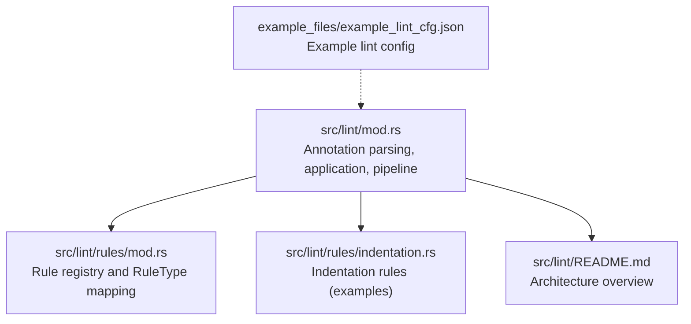
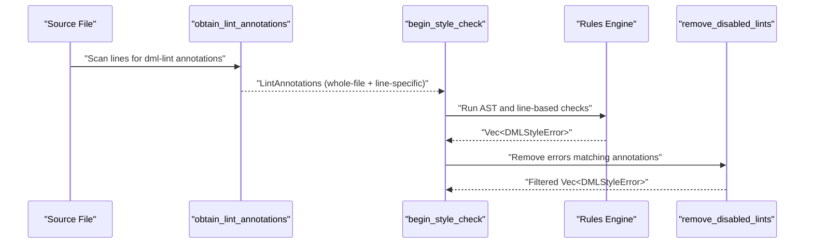
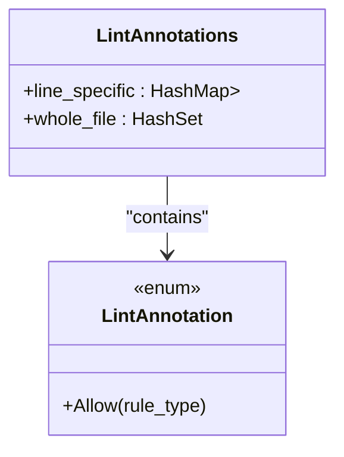
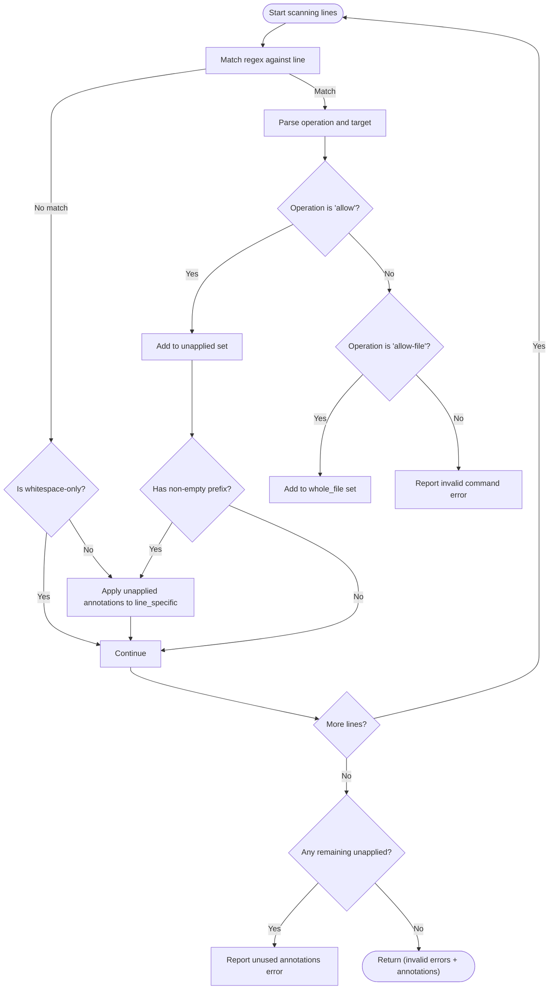
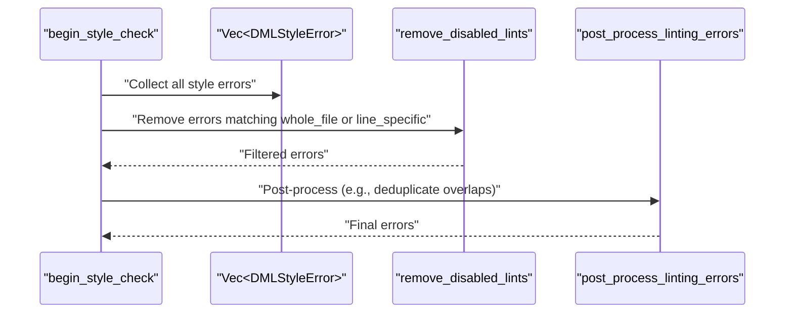
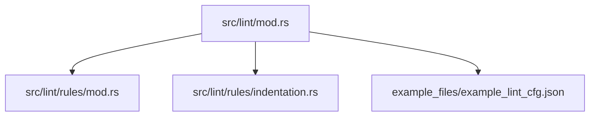

# Lint Annotations

<cite>
**Referenced Files in This Document**
- [src/lint/mod.rs](file://src/lint/mod.rs)
- [src/lint/rules/mod.rs](file://src/lint/rules/mod.rs)
- [src/lint/rules/indentation.rs](file://src/lint/rules/indentation.rs)
- [src/lint/README.md](file://src/lint/README.md)
- [example_files/example_lint_cfg.json](file://example_files/example_lint_cfg.json)
</cite>

## Table of Contents
1. [Introduction](#introduction)
2. [Project Structure](#project-structure)
3. [Core Components](#core-components)
4. [Architecture Overview](#architecture-overview)
5. [Detailed Component Analysis](#detailed-component-analysis)
6. [Dependency Analysis](#dependency-analysis)
7. [Performance Considerations](#performance-considerations)
8. [Troubleshooting Guide](#troubleshooting-guide)
9. [Conclusion](#conclusion)

## Introduction
This document explains the per-file and per-line lint annotation system that selectively disables specific rules via comments. It covers the dml-lint annotation syntax, supported operations, rule targeting, parsing logic, data structures, annotation application, error reporting for invalid annotations, precedence rules, and integration with the linting pipeline. Practical usage scenarios and best practices are included to help teams adopt selective linting safely and efficiently.

## Project Structure
The lint subsystem is implemented primarily in the Rust module under src/lint. The key files involved in the annotation system are:
- Annotation parsing and application logic
- Rule registry and rule type mapping
- Indentation and spacing rule implementations (used in examples)
- Linting pipeline integration and documentation

**Diagram sources**
- [src/lint/mod.rs](file://src/lint/mod.rs#L209-L392)
- [src/lint/rules/mod.rs](file://src/lint/rules/mod.rs#L83-L142)
- [src/lint/rules/indentation.rs](file://src/lint/rules/indentation.rs#L44-L83)
- [src/lint/README.md](file://src/lint/README.md#L1-L67)
- [example_files/example_lint_cfg.json](file://example_files/example_lint_cfg.json#L1-L23)

**Section sources**
- [src/lint/mod.rs](file://src/lint/mod.rs#L209-L392)
- [src/lint/README.md](file://src/lint/README.md#L1-L67)

## Core Components
- LintAnnotation enum: Encodes a single annotation action (currently allow).
- LintAnnotations struct: Stores two kinds of annotations:
  - Whole-file annotations: applied globally for a specific rule type.
  - Line-specific annotations: stacked per line and applied only to the targeted rule type on that line.
- Regular expression pattern: Detects dml-lint annotations in comments.
- Parser and application:
  - obtain_lint_annotations: Scans the file and builds LintAnnotations.
  - remove_disabled_lints: Filters out errors matching disabled annotations.
  - begin_style_check: Orchestrates linting, annotation discovery, and filtering.

Key behaviors:
- Supported operations: allow, allow-file.
- Rule targeting: Uses RuleType::from_str to resolve rule names to types.
- Stacking: Multiple allow annotations on a line stack until a non-empty non-comment line is encountered.
- Error reporting: Invalid commands, invalid targets, and unused annotations produce DMLStyleError entries.

**Section sources**
- [src/lint/mod.rs](file://src/lint/mod.rs#L233-L392)

## Architecture Overview
The annotation system integrates into the linting pipeline as follows:
- The pipeline runs AST-based checks, then line-based checks.
- Before post-processing and removal of disabled lints, annotations are parsed and applied.
- Disabled errors are removed from the final error set.

**Diagram sources**
- [src/lint/mod.rs](file://src/lint/mod.rs#L209-L229)
- [src/lint/mod.rs](file://src/lint/mod.rs#L252-L364)
- [src/lint/mod.rs](file://src/lint/mod.rs#L381-L392)

## Detailed Component Analysis

### Annotation Syntax and Operations
- Syntax: A comment containing the literal prefix followed by a colon and space, then an operation, equals sign, and a rule target. The pattern matches lines that are not purely whitespace and contain the dml-lint directive.
- Supported operations:
  - allow: Applies to the specified rule type for subsequent lines until a non-empty non-comment line is encountered.
  - allow-file: Applies to the specified rule type for the entire file.
- Rule targeting:
  - The target is resolved via RuleType::from_str using the rule’s canonical name.
  - Unknown rule names produce an error.
- Stacking:
  - Multiple allow annotations on the same line are accumulated in a set until the next non-empty non-comment line triggers application to the line-specific map.

**Section sources**
- [src/lint/mod.rs](file://src/lint/mod.rs#L244-L250)
- [src/lint/mod.rs](file://src/lint/mod.rs#L279-L344)
- [src/lint/rules/mod.rs](file://src/lint/rules/mod.rs#L107-L142)

### Data Structures: LintAnnotation and LintAnnotations
- LintAnnotation enum:
  - Allow(RuleType): Disables a specific rule type.
- LintAnnotations struct:
  - line_specific: HashMap<u32, HashSet<LintAnnotation>> stores per-line stacks.
  - whole_file: HashSet<LintAnnotation> stores file-wide disables.

**Diagram sources**
- [src/lint/mod.rs](file://src/lint/mod.rs#L233-L242)

**Section sources**
- [src/lint/mod.rs](file://src/lint/mod.rs#L233-L242)

### Annotation Parsing Logic
- Regex pattern:
  - Captures optional non-comment prefix, operation, and target.
  - Ignores lines that are only whitespace.
- Operation resolution:
  - allow: Adds to a temporary set of unapplied annotations.
  - allow-file: Adds to whole_file set immediately.
- Application:
  - On encountering a non-empty non-comment line, the current unapplied set is moved into line_specific for that line.
- Error reporting:
  - Invalid command: Produces a configuration error with the offending token range.
  - Invalid target: Produces a configuration error with the target range.
  - Unused annotations: Emits a configuration error indicating annotations without effect at end of file.

**Diagram sources**
- [src/lint/mod.rs](file://src/lint/mod.rs#L252-L364)

**Section sources**
- [src/lint/mod.rs](file://src/lint/mod.rs#L252-L364)

### Annotation Application Process
- After linting completes, remove_disabled_lints filters out errors whose rule type is disabled either globally (whole_file) or per line (line_specific[row]).
- Post-processing removes certain errors that overlap with indent_no_tabs ranges to avoid redundant messages.

**Diagram sources**
- [src/lint/mod.rs](file://src/lint/mod.rs#L209-L229)
- [src/lint/mod.rs](file://src/lint/mod.rs#L381-L392)

**Section sources**
- [src/lint/mod.rs](file://src/lint/mod.rs#L209-L229)
- [src/lint/mod.rs](file://src/lint/mod.rs#L381-L392)

### Rule Targeting Mechanism
- RuleType::from_str resolves a rule name to its RuleType variant by comparing against each rule’s canonical name.
- The mapping covers indentation and spacing rules used in examples.

**Section sources**
- [src/lint/rules/mod.rs](file://src/lint/rules/mod.rs#L107-L142)
- [src/lint/rules/indentation.rs](file://src/lint/rules/indentation.rs#L44-L83)

### Error Reporting for Invalid Annotations
- Invalid command: Reports a configuration error with the range of the operation token.
- Invalid target: Reports a configuration error with the range of the target token.
- Unused annotations: Reports a configuration error at the last line when unapplied annotations remain at EOF.

**Section sources**
- [src/lint/mod.rs](file://src/lint/mod.rs#L285-L304)
- [src/lint/mod.rs](file://src/lint/mod.rs#L307-L323)
- [src/lint/mod.rs](file://src/lint/mod.rs#L346-L362)

### Practical Examples and Best Practices
- Example usage scenarios:
  - Allow a specific rule for a single line: place the annotation on the line immediately before or after the violation.
  - Allow a rule for the entire file: place the annotation near the top of the file.
  - Combine allow-file and per-line allow to fine-tune exceptions.
- Best practices:
  - Keep annotations close to the violating code and explain why the exception is necessary.
  - Prefer allow-file for global exceptions and allow for targeted exceptions to minimize scope.
  - Avoid stacking conflicting annotations on the same line; the last effective annotation takes precedence.
  - Use the configuration example as a baseline for enabling/disabling rules.

**Section sources**
- [src/lint/mod.rs](file://src/lint/mod.rs#L486-L540)
- [src/lint/mod.rs](file://src/lint/mod.rs#L554-L585)
- [example_files/example_lint_cfg.json](file://example_files/example_lint_cfg.json#L1-L23)

### Integration with the Linting Pipeline
- begin_style_check orchestrates:
  - Annotation discovery via obtain_lint_annotations.
  - AST traversal and line-based checks.
  - Removal of disabled lints via remove_disabled_lints.
  - Post-processing to refine overlapping errors.
- LintCfg controls whether annotations are shown in error descriptions.

**Section sources**
- [src/lint/mod.rs](file://src/lint/mod.rs#L181-L207)
- [src/lint/mod.rs](file://src/lint/mod.rs#L209-L229)
- [src/lint/README.md](file://src/lint/README.md#L1-L67)

## Dependency Analysis
- The annotation system depends on:
  - Rule registry and RuleType mapping for resolving rule names.
  - Regex-based scanning for detecting annotations.
  - Linting pipeline to collect and filter errors.
- Coupling:
  - Low to moderate: Parsing and application are encapsulated in a small set of functions.
  - Cohesion: Annotation logic is centralized in one module.

**Diagram sources**
- [src/lint/mod.rs](file://src/lint/mod.rs#L209-L392)
- [src/lint/rules/mod.rs](file://src/lint/rules/mod.rs#L83-L142)
- [src/lint/rules/indentation.rs](file://src/lint/rules/indentation.rs#L44-L83)
- [example_files/example_lint_cfg.json](file://example_files/example_lint_cfg.json#L1-L23)

**Section sources**
- [src/lint/mod.rs](file://src/lint/mod.rs#L209-L392)
- [src/lint/rules/mod.rs](file://src/lint/rules/mod.rs#L83-L142)

## Performance Considerations
- Regex scanning: Linear pass over lines; regex compilation is static and reused.
- Annotation storage: Hash sets and hash maps provide efficient insertion and lookup.
- Filtering cost: remove_disabled_lints iterates over all errors once; complexity is O(E) where E is the number of errors.
- Post-processing: Additional linear pass over errors to handle overlaps.
- Recommendations:
  - Keep annotation files concise and avoid excessive comments.
  - Prefer allow-file for broad exceptions to reduce per-line overhead.
  - Avoid deeply nested annotations that require large stacks.

[No sources needed since this section provides general guidance]

## Troubleshooting Guide
Common issues and resolutions:
- Invalid command in annotation:
  - Symptom: Error indicating an unsupported operation.
  - Resolution: Use allow or allow-file only.
- Invalid rule target:
  - Symptom: Error indicating an unknown rule name.
  - Resolution: Verify the rule name matches the canonical name from the rule registry.
- Annotations without effect at end of file:
  - Symptom: Warning that unapplied annotations at EOF have no effect.
  - Resolution: Move the annotation to a preceding line or remove it.
- Conflicting annotations:
  - Symptom: Unexpected behavior when multiple allow annotations target the same rule.
  - Resolution: Prefer a single allow-file or the most specific allow per line; remove duplicates.

**Section sources**
- [src/lint/mod.rs](file://src/lint/mod.rs#L285-L304)
- [src/lint/mod.rs](file://src/lint/mod.rs#L307-L323)
- [src/lint/mod.rs](file://src/lint/mod.rs#L346-L362)

## Conclusion
The dml-lint annotation system provides precise control over rule enforcement by supporting per-line and whole-file disables. Its design centers on a simple, readable syntax, robust parsing with explicit error reporting, and efficient application during the linting pipeline. By following best practices—limiting scope, keeping annotations close to violations, and leveraging allow-file for global exceptions—teams can maintain clean, consistent codebases while accommodating legitimate exceptions.