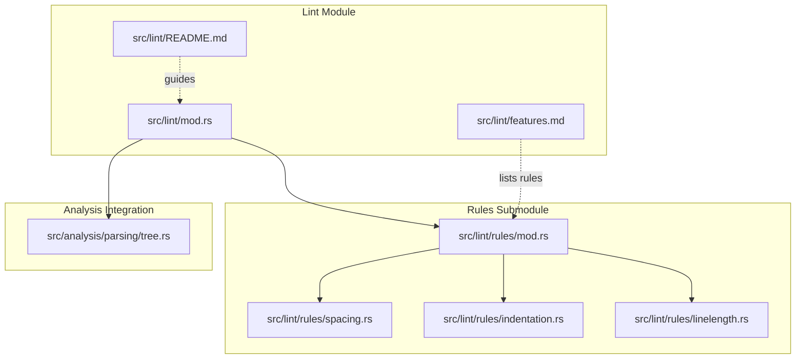
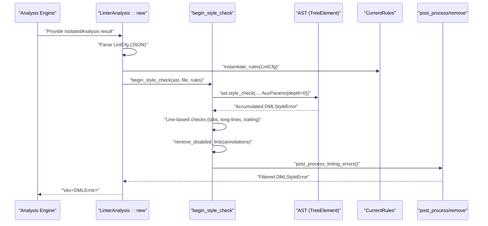
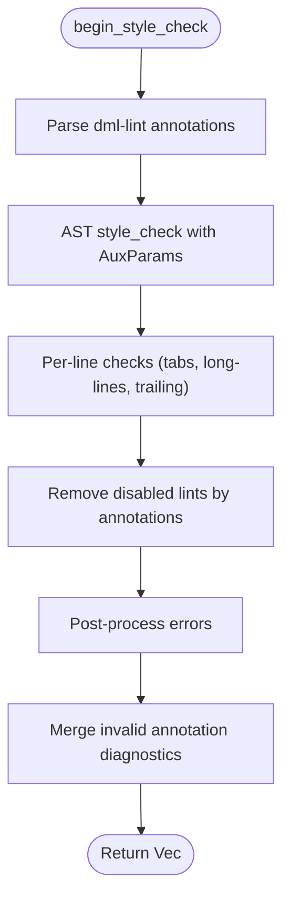
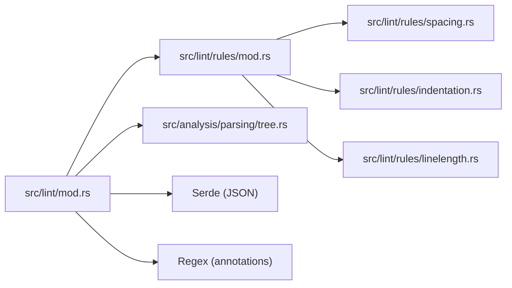

# Lint Architecture and Engine

<cite>
**Referenced Files in This Document**
- [lint/mod.rs](file://src/lint/mod.rs)
- [lint/rules/mod.rs](file://src/lint/rules/mod.rs)
- [lint/README.md](file://src/lint/README.md)
- [lint/features.md](file://src/lint/features.md)
- [lint/rules/spacing.rs](file://src/lint/rules/spacing.rs)
- [lint/rules/indentation.rs](file://src/lint/rules/indentation.rs)
- [lint/rules/linelength.rs](file://src/lint/rules/linelength.rs)
- [lint/rules/tests/common.rs](file://src/lint/rules/tests/common.rs)
- [analysis/parsing/tree.rs](file://src/analysis/parsing/tree.rs)
</cite>

## Table of Contents
1. [Introduction](#introduction)
2. [Project Structure](#project-structure)
3. [Core Components](#core-components)
4. [Architecture Overview](#architecture-overview)
5. [Detailed Component Analysis](#detailed-component-analysis)
6. [Dependency Analysis](#dependency-analysis)
7. [Performance Considerations](#performance-considerations)
8. [Troubleshooting Guide](#troubleshooting-guide)
9. [Conclusion](#conclusion)

## Introduction
This document explains the lint architecture and engine of the DML language server. It covers the pluggable linting framework, rule instantiation, execution pipeline, configuration model, rule categorization, auxiliary parameter passing, selective rule disabling via annotations, post-processing for error deduplication, and integration with the analysis engine. It also provides examples of rule instantiation, configuration loading, and error collection workflows.

## Project Structure
The lint subsystem is organized into:
- A central module that orchestrates configuration parsing, rule instantiation, and the lint execution pipeline.
- A rules submodule that groups rules by category (spacing, indentation, line length) and exposes a uniform Rule trait and RuleType enumeration.
- Integration with the analysis engine through AST traversal and token streams.

**Diagram sources**
- [lint/mod.rs](file://src/lint/mod.rs#L1-L622)
- [lint/rules/mod.rs](file://src/lint/rules/mod.rs#L1-L171)
- [lint/README.md](file://src/lint/README.md#L1-L71)
- [lint/features.md](file://src/lint/features.md#L1-L75)
- [analysis/parsing/tree.rs](file://src/analysis/parsing/tree.rs#L1-L200)

**Section sources**
- [lint/mod.rs](file://src/lint/mod.rs#L1-L622)
- [lint/rules/mod.rs](file://src/lint/rules/mod.rs#L1-L171)
- [lint/README.md](file://src/lint/README.md#L1-L71)
- [lint/features.md](file://src/lint/features.md#L1-L75)
- [analysis/parsing/tree.rs](file://src/analysis/parsing/tree.rs#L1-L200)

## Core Components
- LintCfg: Declarative configuration parsed from JSON, enabling/disabling rules and configuring parameters. It supports unknown field detection and defaults for all rules.
- CurrentRules: A container of instantiated rule instances, one per rule, created from LintCfg.
- Rule trait and RuleType: Defines the interface for rules and enumerates rule categories/types.
- AuxParams: Auxiliary data passed down the AST during traversal (e.g., nesting depth).
- LinterAnalysis: Orchestrates lint execution for a file, invoking the pipeline and transforming results.
- Annotation system: Selectively disables rules per file or per line via comments.
- Post-processing: Deduplicates and filters errors (e.g., removing line-specific errors already reported by a broader rule).

Key responsibilities:
- Configuration parsing and validation
- Rule instantiation and configuration propagation
- AST-driven rule evaluation and line-based checks
- Error collection and transformation
- Annotation-driven suppression and post-processing

**Section sources**
- [lint/mod.rs](file://src/lint/mod.rs#L49-L184)
- [lint/mod.rs](file://src/lint/mod.rs#L186-L243)
- [lint/rules/mod.rs](file://src/lint/rules/mod.rs#L36-L105)
- [lint/rules/mod.rs](file://src/lint/rules/mod.rs#L107-L171)
- [analysis/parsing/tree.rs](file://src/analysis/parsing/tree.rs#L109-L120)

## Architecture Overview
The lint engine integrates tightly with the analysis engine. After the AST is built, the linter:
1. Parses LintCfg from a JSON file.
2. Instantiates CurrentRules from LintCfg.
3. Traverses the AST via style_check, applying rule checks and passing AuxParams.
4. Performs line-based checks (e.g., trailing whitespace, long lines, tabs).
5. Applies annotations to suppress specific errors.
6. Post-processes errors (e.g., deduplicate).
7. Transforms results into DMLError for reporting.

**Diagram sources**
- [lint/mod.rs](file://src/lint/mod.rs#L208-L243)
- [lint/mod.rs](file://src/lint/mod.rs#L245-L265)
- [analysis/parsing/tree.rs](file://src/analysis/parsing/tree.rs#L109-L120)

## Detailed Component Analysis

### LintCfg: Configuration Model
- Fields enable/disable rule categories and configure parameters (e.g., indentation_spaces, max_length).
- Unknown fields are captured during deserialization for diagnostics.
- Default enables most rules with sensible defaults.

Operational highlights:
- Deserialization uses a helper to record unknown keys.
- Defaults initialize all rule categories with default options.

**Section sources**
- [lint/mod.rs](file://src/lint/mod.rs#L80-L184)

### CurrentRules: Rule Container and Instantiation
- Holds one instance per rule, enabling or disabling based on LintCfg.
- Some rules accept options (e.g., indentation_spaces, max_length) and expose from_options constructors.
- Provides a unified interface for rule invocation during traversal.

Instantiation logic:
- Each rule’s enabled flag is derived from whether its corresponding LintCfg option is present.
- Options are propagated to rules that support them.

**Section sources**
- [lint/rules/mod.rs](file://src/lint/rules/mod.rs#L36-L88)
- [lint/rules/indentation.rs](file://src/lint/rules/indentation.rs#L69-L103)
- [lint/rules/linelength.rs](file://src/lint/rules/linelength.rs#L314-L345)

### Rule Trait and RuleType: Pluggable Rule Interface
- Rule trait defines name, description, get_rule_type, and a convenience create_err.
- RuleType enumerates categories (e.g., SpReserved, IN2, LL1) and supports string conversion for annotation targets.

Design implications:
- New rules integrate by implementing Rule and choosing a RuleType.
- Annotation targets map to RuleType via string matching.

**Section sources**
- [lint/rules/mod.rs](file://src/lint/rules/mod.rs#L90-L171)

### AuxParams: Passing Context Down the AST
- AuxParams carries auxiliary data (e.g., nesting depth) during traversal.
- TreeElement increments depth when should_increment_depth returns true, ensuring rules can compute indentation levels correctly.

Usage:
- Passed into style_check and forwarded to children.
- Enables indentation-aware rules to compute expected column positions.

**Section sources**
- [lint/mod.rs](file://src/lint/mod.rs#L430-L441)
- [analysis/parsing/tree.rs](file://src/analysis/parsing/tree.rs#L109-L120)

### Execution Pipeline: begin_style_check
End-to-end flow:
1. Parse annotations from source text.
2. Traverse AST via style_check to collect rule violations.
3. Apply line-based checks (tabs, long-lines, trailing).
4. Remove suppressed errors via annotations.
5. Post-process to deduplicate and refine results.
6. Append invalid annotation diagnostics.

**Diagram sources**
- [lint/mod.rs](file://src/lint/mod.rs#L245-L265)

**Section sources**
- [lint/mod.rs](file://src/lint/mod.rs#L245-L265)

### Annotation System: Selective Rule Disabling
- Supports allow and allow-file directives.
- Annotations are parsed into LintAnnotations with per-line and whole-file sets.
- Removal step filters out errors whose rule type is suppressed at the error’s line or file scope.

Supported operations:
- allow=<RuleName>: suppress a rule for subsequent lines until reset.
- allow-file=<RuleName>: suppress a rule for the entire file.

Validation:
- Invalid commands and targets produce diagnostic errors.

**Section sources**
- [lint/mod.rs](file://src/lint/mod.rs#L269-L427)

### Post-processing Phase: Error Deduplication
- Removes errors produced by less specific rules when a more specific rule already reported an error on the same line.
- Example: IN2 (no tabs) errors are removed if the same row was already flagged by other indentation rules.

**Section sources**
- [lint/mod.rs](file://src/lint/mod.rs#L401-L414)

### Integration with Analysis Engine
- LinterAnalysis::new receives an IsolatedAnalysis result and the file text.
- It instantiates rules from LintCfg and invokes begin_style_check.
- Results are transformed into DMLError for client notification.

**Section sources**
- [lint/mod.rs](file://src/lint/mod.rs#L208-L243)

### Examples

#### Example: Rule Instantiation from Configuration
- Load LintCfg from JSON.
- Call instantiate_rules to build CurrentRules.
- Use CurrentRules to drive AST traversal and line-based checks.

Paths:
- [LintCfg::default and try_deserialize](file://src/lint/mod.rs#L135-L184)
- [instantiate_rules](file://src/lint/rules/mod.rs#L62-L88)

#### Example: Configuration Loading and Unknown Field Detection
- Parse JSON into LintCfg.
- Capture unknown fields for diagnostics.
- Compare against expected defaults.

Paths:
- [parse_lint_cfg](file://src/lint/mod.rs#L49-L61)
- [LintCfg::try_deserialize](file://src/lint/mod.rs#L135-L148)

#### Example: Error Collection Workflow
- Build AST from snippet.
- Run begin_style_check with CurrentRules.
- Assert expected errors by range and rule type.

Paths:
- [run_linter and assert_snippet helpers](file://src/lint/rules/tests/common.rs#L33-L55)

## Dependency Analysis
- Lint module depends on:
  - Analysis engine types (AST, ranges, tokens).
  - Rules submodule for rule implementations.
  - Serde for configuration parsing.
  - Regex for annotation parsing.
- Rules depend on:
  - TreeElement trait for AST traversal.
  - Range types for error positioning.
  - Rule trait for uniform invocation.

**Diagram sources**
- [lint/mod.rs](file://src/lint/mod.rs#L1-L622)
- [lint/rules/mod.rs](file://src/lint/rules/mod.rs#L1-L171)
- [analysis/parsing/tree.rs](file://src/analysis/parsing/tree.rs#L1-L200)

**Section sources**
- [lint/mod.rs](file://src/lint/mod.rs#L1-L622)
- [lint/rules/mod.rs](file://src/lint/rules/mod.rs#L1-L171)
- [analysis/parsing/tree.rs](file://src/analysis/parsing/tree.rs#L1-L200)

## Performance Considerations
- AST traversal is O(nodes) with per-node rule evaluations.
- Line-based checks iterate over lines; keep regex and string operations minimal.
- Post-processing removes duplicates efficiently by scanning ranges.
- Consider batching rule invocations and avoiding redundant allocations in hot paths.

## Troubleshooting Guide
Common issues and resolutions:
- Unknown fields in configuration: Detected during deserialization; review LintCfg fields and consult the example configuration.
- Invalid annotation targets or commands: Reported as diagnostics with precise ranges.
- Suppressed errors not appearing: Verify allow/allow-file annotations and their scope.
- Post-processed errors missing: Confirm post-processing deduplication logic and that the intended rule types are not filtered out.

Paths for inspection:
- [Unknown field detection](file://src/lint/mod.rs#L135-L148)
- [Annotation parsing and diagnostics](file://src/lint/mod.rs#L288-L399)
- [Suppression logic](file://src/lint/mod.rs#L416-L427)
- [Post-processing](file://src/lint/mod.rs#L401-L414)

**Section sources**
- [lint/mod.rs](file://src/lint/mod.rs#L135-L148)
- [lint/mod.rs](file://src/lint/mod.rs#L288-L399)
- [lint/mod.rs](file://src/lint/mod.rs#L416-L427)
- [lint/mod.rs](file://src/lint/mod.rs#L401-L414)

## Conclusion
The lint architecture provides a robust, pluggable framework for DML style checking. Configuration-driven rule instantiation, AST-centric traversal, and line-based checks deliver comprehensive coverage. The annotation system and post-processing ensure flexibility and clean error reporting. The design cleanly separates concerns between configuration, rule execution, and analysis integration, enabling easy extension and maintenance.