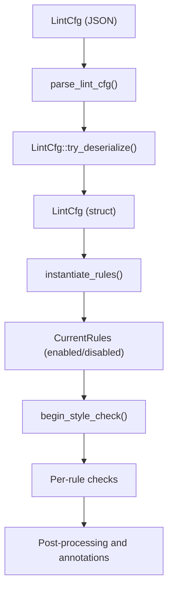
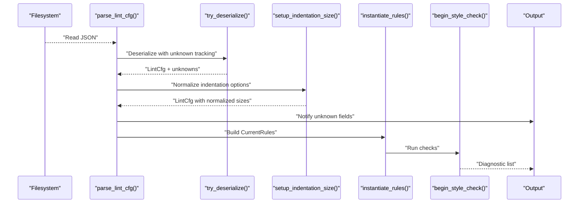
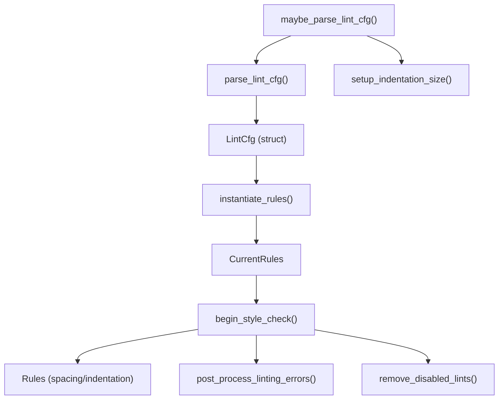

# Lint Configuration

<cite>
**Referenced Files in This Document**
- [mod.rs](file://src/lint/mod.rs)
- [rules/mod.rs](file://src/lint/rules/mod.rs)
- [rules/indentation.rs](file://src/lint/rules/indentation.rs)
- [config.rs](file://src/config.rs)
- [example_lint_cfg.json](file://example_files/example_lint_cfg.json)
- [README.md](file://src/lint/README.md)
</cite>

## Table of Contents
1. [Introduction](#introduction)
2. [Project Structure](#project-structure)
3. [Core Components](#core-components)
4. [Architecture Overview](#architecture-overview)
5. [Detailed Component Analysis](#detailed-component-analysis)
6. [Dependency Analysis](#dependency-analysis)
7. [Performance Considerations](#performance-considerations)
8. [Troubleshooting Guide](#troubleshooting-guide)
9. [Conclusion](#conclusion)
10. [Appendices](#appendices)

## Introduction
This document explains the lint configuration system used by the DML language server. It focuses on the LintCfg struct, its JSON configuration format, rule categories, defaults, configuration parsing, unknown field detection, and integration with the analysis pipeline. It also covers the setup_indentation_size function and the annotate_lints flag behavior, along with practical configuration scenarios and validation/error handling.

## Project Structure
The lint configuration lives in the lint module and integrates with the rules subsystem and the broader analysis pipeline. Key files:
- Lint configuration and parsing: src/lint/mod.rs
- Rule instantiation and rule types: src/lint/rules/mod.rs
- Indentation rule options and defaults: src/lint/rules/indentation.rs
- Workspace configuration (for comparison): src/config.rs
- Example configuration: example_files/example_lint_cfg.json
- Architecture overview: src/lint/README.md

**Diagram sources**
- [mod.rs](file://src/lint/mod.rs#L37-L64)
- [rules/mod.rs](file://src/lint/rules/mod.rs#L43-L64)

**Section sources**
- [mod.rs](file://src/lint/mod.rs#L37-L64)
- [rules/mod.rs](file://src/lint/rules/mod.rs#L43-L64)
- [README.md](file://src/lint/README.md#L1-L67)

## Core Components
- LintCfg: The central configuration struct that mirrors the JSON schema. It enables or disables rule categories and sets parameters for applicable rules.
- Rule categories: Spacing rules (sp_reserved, sp_brace, sp_punct, sp_binop, sp_ternary, sp_ptrdecl), Non-spacing rules (nsp_ptrdecl, nsp_funpar, nsp_inparen, nsp_unary, nsp_trailing), Line-length and indentation rules (long_lines, indent_size, indent_no_tabs, indent_code_block, indent_closing_brace, indent_paren_expr, indent_switch_case, indent_empty_loop), plus annotate_lints.
- Parsing and validation: parse_lint_cfg reads a JSON file, tries_deserialize captures unknown fields, and maybe_parse_lint_cfg handles errors and applies setup_indentation_size.
- Initialization and defaults: LintCfg::default provides sensible defaults for most categories; setup_indentation_size normalizes indentation rule parameters.

**Section sources**
- [mod.rs](file://src/lint/mod.rs#L68-L157)
- [rules/indentation.rs](file://src/lint/rules/indentation.rs#L16-L38)

## Architecture Overview
The lint configuration is parsed from JSON into LintCfg, then transformed into CurrentRules for runtime checks. The pipeline performs AST-based checks and line-based checks, supports per-line annotations to allow specific rules, and optionally annotates diagnostics with rule identifiers.

**Diagram sources**
- [mod.rs](file://src/lint/mod.rs#L37-L64)
- [rules/mod.rs](file://src/lint/rules/mod.rs#L43-L64)
- [rules/indentation.rs](file://src/lint/rules/indentation.rs#L23-L38)

## Detailed Component Analysis

### LintCfg JSON Schema and Defaults
LintCfg mirrors the JSON configuration. Each field corresponds to a rule category or option. Fields are optional; presence indicates enabling the rule category. Some categories accept nested options.

Key fields and defaults:
- sp_reserved: Enabled by default via default() (empty options struct).
- sp_brace: Enabled by default.
- sp_punct: Enabled by default.
- sp_binop: Enabled by default.
- sp_ternary: Enabled by default.
- sp_ptrdecl: Enabled by default.
- nsp_ptrdecl: Enabled by default.
- nsp_funpar: Enabled by default.
- nsp_inparen: Enabled by default.
- nsp_unary: Enabled by default.
- nsp_trailing: Enabled by default.
- long_lines: Enabled by default with max_length set to the global default.
- indent_size: Enabled by default with indentation_spaces set to the global default.
- indent_no_tabs: Enabled by default (no options).
- indent_code_block: Enabled by default with indentation_spaces set to the global default.
- indent_closing_brace: Enabled by default with indentation_spaces set to the global default.
- indent_paren_expr: Enabled by default (no options).
- indent_switch_case: Enabled by default with indentation_spaces set to the global default.
- indent_empty_loop: Enabled by default with indentation_spaces set to the global default.
- annotate_lints: Enabled by default (true).

Note: The default() implementation sets many categories to Some(...) with minimal option structs, meaning they are enabled with default parameters. Categories without explicit options are enabled without additional parameters.

**Section sources**
- [mod.rs](file://src/lint/mod.rs#L68-L157)
- [rules/indentation.rs](file://src/lint/rules/indentation.rs#L16-L38)

### Configuration Parsing and Unknown Field Detection
- parse_lint_cfg reads a JSON file and deserializes it into a serde_json::Value, then passes it to LintCfg::try_deserialize.
- LintCfg::try_deserialize uses serde_ignored to collect unknown fields into a vector. This allows the system to detect typos or unsupported keys without failing the entire parse.
- maybe_parse_lint_cfg wraps the parse, notifies about unknown fields via maybe_notify_unknown_lint_fields, normalizes indentation sizes, and logs failures.

Validation behavior:
- Unknown fields are collected and reported; the rest of the configuration is still applied.
- Deserialization errors are surfaced as strings and logged.

**Section sources**
- [mod.rs](file://src/lint/mod.rs#L37-L64)
- [mod.rs](file://src/lint/mod.rs#L114-L126)

### Annotate Lints Flag
- annotate_lints controls whether diagnostic messages include the rule identifier prefix. When true, each diagnostic’s description is prefixed with the rule identifier.
- This flag is part of LintCfg and is applied during LinterAnalysis construction.

**Section sources**
- [mod.rs](file://src/lint/mod.rs#L109-L111)
- [mod.rs](file://src/lint/mod.rs#L192-L196)

### setup_indentation_size Function
Purpose:
- Normalize indentation rule parameters to a single shared indentation_spaces value derived from indent_size.
- Apply the normalized value to related indentation rules: indent_code_block, indent_switch_case, indent_empty_loop.

Behavior:
- If indent_size is present, its indentation_spaces becomes the global indentation_spaces.
- Otherwise, the global default is used.
- The function updates the relevant rule option structs in-place.

Integration:
- Called by maybe_parse_lint_cfg after deserialization and unknown field reporting.

**Section sources**
- [rules/indentation.rs](file://src/lint/rules/indentation.rs#L23-L38)
- [mod.rs](file://src/lint/mod.rs#L56-L56)

### Rule Instantiation and Runtime Behavior
- instantiate_rules constructs CurrentRules from LintCfg. For each rule category, it sets enabled=true if the corresponding LintCfg field is Some(...), otherwise disabled.
- For rules with options (e.g., long_lines, indent_* rules), from_options converts Option<T> into rule instances with enabled=true and the provided parameters, or enabled=false with defaults if None.

**Section sources**
- [rules/mod.rs](file://src/lint/rules/mod.rs#L43-L64)
- [rules/indentation.rs](file://src/lint/rules/indentation.rs#L49-L61)
- [rules/indentation.rs](file://src/lint/rules/indentation.rs#L187-L199)
- [rules/indentation.rs](file://src/lint/rules/indentation.rs#L329-L341)
- [rules/indentation.rs](file://src/lint/rules/indentation.rs#L566-L578)
- [rules/indentation.rs](file://src/lint/rules/indentation.rs#L652-L664)

### Annotation-Based Overrides
- The system supports dml-lint annotations to selectively allow rules for a line or the entire file.
- Supported operations:
  - allow=<rule>: Allow a specific rule for subsequent lines until a non-empty line without annotation.
  - allow-file=<rule>: Allow a specific rule for the entire file.
- Invalid commands or targets produce diagnostics with rule type Configuration.

Processing:
- obtain_lint_annotations parses comments and builds a LintAnnotations structure containing line-specific and whole-file allowances.
- remove_disabled_lints filters out errors whose rule types are allowed by the annotations.
- post_process_linting_errors removes certain errors that overlap with indent_no_tabs rows to avoid redundant warnings.

**Section sources**
- [mod.rs](file://src/lint/mod.rs#L252-L364)
- [mod.rs](file://src/lint/mod.rs#L381-L392)
- [mod.rs](file://src/lint/mod.rs#L366-L379)

### Practical Configuration Scenarios
- Minimal enablement: Enable only a subset of categories by including them in the JSON with empty objects.
- Parameter tuning:
  - long_lines: Set max_length to adjust the line length threshold.
  - indent_size: Set indentation_spaces to define the base indentation unit.
  - Other indentation rules: They inherit the normalized indentation_spaces from indent_size.
- Disable categories: Omit a category from the JSON to leave it disabled.
- Annotate diagnostics: Set annotate_lints to true to include rule identifiers in messages.

Reference example configuration:
- example_files/example_lint_cfg.json demonstrates typical usage and defaults.

**Section sources**
- [example_lint_cfg.json](file://example_files/example_lint_cfg.json#L1-L23)

### Inheritance Patterns and Override Strategies
- Global normalization: setup_indentation_size ensures that indent_code_block, indent_switch_case, and indent_empty_loop align with indent_size.
- Per-file overrides: allow-file annotations can disable rules for the entire file.
- Per-line overrides: allow annotations can disable rules for subsequent lines until a non-empty line without annotation.
- Unknown fields: Detected and reported without breaking the configuration; known fields are applied as usual.

**Section sources**
- [rules/indentation.rs](file://src/lint/rules/indentation.rs#L23-L38)
- [mod.rs](file://src/lint/mod.rs#L252-L364)
- [mod.rs](file://src/lint/mod.rs#L381-L392)

## Dependency Analysis
The lint configuration interacts with the rules subsystem and the analysis pipeline. The following diagram shows key dependencies:

**Diagram sources**
- [mod.rs](file://src/lint/mod.rs#L37-L64)
- [rules/mod.rs](file://src/lint/rules/mod.rs#L43-L64)
- [rules/indentation.rs](file://src/lint/rules/indentation.rs#L23-L38)

**Section sources**
- [mod.rs](file://src/lint/mod.rs#L37-L64)
- [rules/mod.rs](file://src/lint/rules/mod.rs#L43-L64)

## Performance Considerations
- Unknown field detection uses serde_ignored, which is efficient and avoids deserialization overhead.
- Normalization via setup_indentation_size is O(1) per affected rule category.
- Rule instantiation is O(number of rule categories).
- begin_style_check iterates the AST and lines; performance depends on file size and rule count.

## Troubleshooting Guide
Common issues and resolutions:
- Unknown fields in JSON:
  - Symptom: Warnings about unknown fields.
  - Resolution: Correct the field names or remove unsupported keys. The system continues to apply known fields.
- Deserialization errors:
  - Symptom: Failure to parse lint configuration.
  - Resolution: Validate JSON syntax and types; ensure numeric fields are integers and booleans are boolean.
- Indentation misalignment:
  - Symptom: Errors from indentation rules.
  - Resolution: Adjust indent_size and ensure related rules inherit the normalized value.
- Overly broad allow annotations:
  - Symptom: Unexpected silence on violations.
  - Resolution: Review dml-lint annotations; use allow-file judiciously.

**Section sources**
- [mod.rs](file://src/lint/mod.rs#L37-L64)
- [mod.rs](file://src/lint/mod.rs#L252-L364)
- [mod.rs](file://src/lint/mod.rs#L381-L392)

## Conclusion
The lint configuration system provides a flexible, JSON-based mechanism to enable/disable rule categories, tune parameters, and annotate diagnostics. It robustly handles unknown fields, normalizes indentation settings, and integrates tightly with the analysis pipeline. By combining global configuration with per-line annotations, users can tailor style enforcement to their needs while maintaining clear diagnostics.

## Appendices

### Appendix A: Rule Categories and Options Reference
- Spacing rules (enabled by default):
  - sp_reserved
  - sp_brace
  - sp_punct
  - sp_binop
  - sp_ternary
  - sp_ptrdecl
- Non-spacing rules (enabled by default):
  - nsp_ptrdecl
  - nsp_funpar
  - nsp_inparen
  - nsp_unary
  - nsp_trailing
- Line and indentation rules (enabled by default):
  - long_lines: max_length
  - indent_size: indentation_spaces
  - indent_no_tabs
  - indent_code_block: indentation_spaces
  - indent_closing_brace: indentation_spaces
  - indent_paren_expr
  - indent_switch_case: indentation_spaces
  - indent_empty_loop: indentation_spaces
- Diagnostics:
  - annotate_lints: boolean

Defaults and behaviors are defined in LintCfg::default and the rule option structs.

**Section sources**
- [mod.rs](file://src/lint/mod.rs#L68-L157)
- [rules/indentation.rs](file://src/lint/rules/indentation.rs#L40-L88)
- [rules/indentation.rs](file://src/lint/rules/indentation.rs#L127-L131)
- [rules/indentation.rs](file://src/lint/rules/indentation.rs#L239-L243)
- [rules/indentation.rs](file://src/lint/rules/indentation.rs#L532-L536)
- [rules/indentation.rs](file://src/lint/rules/indentation.rs#L614-L618)