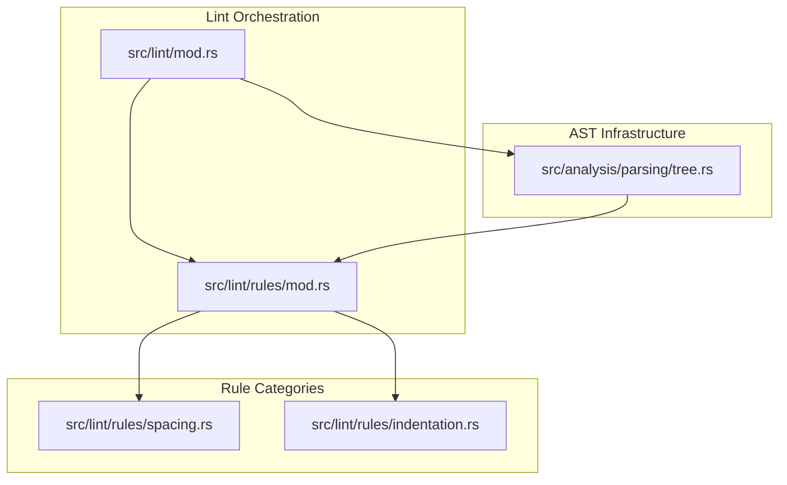
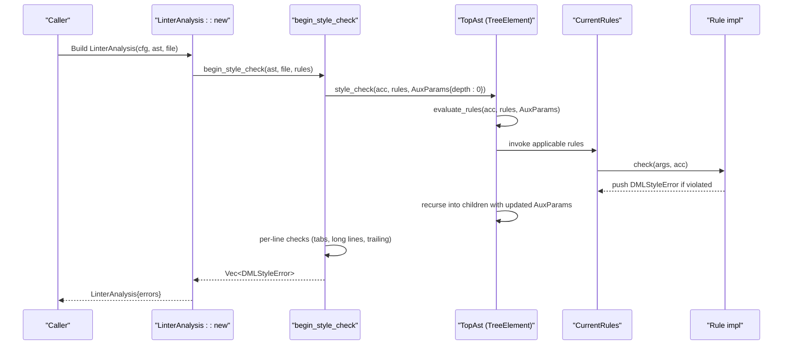
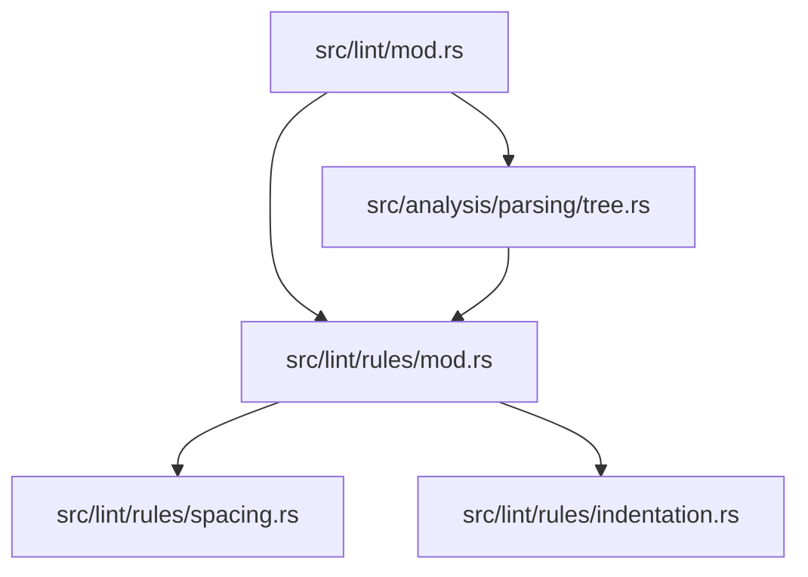

# Lint Rules Overview

<cite>
**Referenced Files in This Document**
- [src/lint/mod.rs](file://src/lint/mod.rs)
- [src/lint/rules/mod.rs](file://src/lint/rules/mod.rs)
- [src/lint/rules/spacing.rs](file://src/lint/rules/spacing.rs)
- [src/lint/rules/indentation.rs](file://src/lint/rules/indentation.rs)
- [src/lint/rules/tests/common.rs](file://src/lint/rules/tests/common.rs)
- [src/analysis/parsing/tree.rs](file://src/analysis/parsing/tree.rs)
</cite>

## Table of Contents
1. [Introduction](#introduction)
2. [Project Structure](#project-structure)
3. [Core Components](#core-components)
4. [Architecture Overview](#architecture-overview)
5. [Detailed Component Analysis](#detailed-component-analysis)
6. [Dependency Analysis](#dependency-analysis)
7. [Performance Considerations](#performance-considerations)
8. [Troubleshooting Guide](#troubleshooting-guide)
9. [Conclusion](#conclusion)

## Introduction
This document explains the lint rule architecture and classification system used by the DML language server. It covers the Rule trait, rule categorization by type (spacing rules, indentation rules, common pattern rules), the instantiation mechanism for rules, the RuleType enumeration and its mapping to specific rule implementations, the rule execution pipeline, parameter passing via AuxParams, and the relationship between rules and the AST traversal. It also outlines rule development patterns, testing methodologies, and performance considerations for rule execution across large codebases.

## Project Structure
The lint subsystem is organized into:
- A central lint module that orchestrates configuration parsing, rule instantiation, and the linting pipeline.
- A rules module that defines the Rule trait, the RuleType classification, and the CurrentRules container.
- Submodules for rule categories:
  - Spacing rules (spacing.rs)
  - Indentation rules (indentation.rs)
- A shared AST traversal infrastructure that invokes rule evaluation during AST walks.

**Diagram sources**
- [src/lint/mod.rs](file://src/lint/mod.rs#L180-L229)
- [src/lint/rules/mod.rs](file://src/lint/rules/mod.rs#L43-L64)
- [src/lint/rules/spacing.rs](file://src/lint/rules/spacing.rs#L1-L120)
- [src/lint/rules/indentation.rs](file://src/lint/rules/indentation.rs#L1-L83)
- [src/analysis/parsing/tree.rs](file://src/analysis/parsing/tree.rs#L109-L119)

**Section sources**
- [src/lint/mod.rs](file://src/lint/mod.rs#L180-L229)
- [src/lint/rules/mod.rs](file://src/lint/rules/mod.rs#L43-L64)
- [src/lint/rules/spacing.rs](file://src/lint/rules/spacing.rs#L1-L120)
- [src/lint/rules/indentation.rs](file://src/lint/rules/indentation.rs#L1-L83)
- [src/analysis/parsing/tree.rs](file://src/analysis/parsing/tree.rs#L109-L119)

## Core Components
- Rule trait: Defines the contract for all rules, including identification, description, type, and error creation helpers.
- RuleType enumeration: Classifies rules by category and subtype (e.g., spacing, indentation).
- CurrentRules container: Holds all instantiated rule instances according to the active configuration.
- LintCfg: Configuration model that enables/disables rule families and sets options.
- AuxParams: A lightweight parameter bag passed down the AST traversal to supply contextual data (e.g., nesting depth).
- AST TreeElement trait: Provides the traversal hook for invoking rule evaluation at each AST node.

Key responsibilities:
- Rule trait ensures consistent naming, descriptions, and typed error reporting.
- RuleType supports dynamic mapping from human-readable names to rule types for lint annotations.
- CurrentRules is populated by instantiate_rules based on LintCfg, enabling selective rule execution.
- AuxParams allows rules to adapt behavior based on structural context (e.g., indentation levels).
- TreeElement.style_check drives the traversal and rule invocation.

**Section sources**
- [src/lint/rules/mod.rs](file://src/lint/rules/mod.rs#L67-L81)
- [src/lint/rules/mod.rs](file://src/lint/rules/mod.rs#L83-L105)
- [src/lint/rules/mod.rs](file://src/lint/rules/mod.rs#L43-L64)
- [src/lint/mod.rs](file://src/lint/mod.rs#L395-L406)
- [src/analysis/parsing/tree.rs](file://src/analysis/parsing/tree.rs#L109-L119)

## Architecture Overview
The lint pipeline integrates configuration-driven rule instantiation with AST traversal. At runtime:
- LintCfg is parsed and normalized.
- instantiate_rules constructs CurrentRules from LintCfg.
- begin_style_check triggers AST traversal and per-line checks.
- During traversal, TreeElement.style_check invokes rule evaluation with AuxParams.
- Rule implementations inspect AST content and append DMLStyleError entries when violations are found.
- Lint annotations allow selective suppression of specific rule types.

**Diagram sources**
- [src/lint/mod.rs](file://src/lint/mod.rs#L182-L207)
- [src/lint/mod.rs](file://src/lint/mod.rs#L209-L229)
- [src/analysis/parsing/tree.rs](file://src/analysis/parsing/tree.rs#L109-L119)
- [src/lint/rules/mod.rs](file://src/lint/rules/mod.rs#L22-L41)

## Detailed Component Analysis

### Rule Trait and RuleType Classification
- Rule trait:
  - Provides name(), description(), get_rule_type(), and a convenience create_err() that builds DMLStyleError with rule metadata.
  - Ensures uniformity across all rule implementations.
- RuleType enumeration:
  - Enumerates categories such as SpReserved, SpBraces, SpPunct, SpBinop, SpTernary, SpPtrDecl, NspPtrDecl, NspFunpar, NspInparen, NspUnary, NspTrailing, LL1 (long lines), IN2-IN10 (indentation variants), and Configuration.
  - Implements FromStr to map a rule’s name() to its RuleType, enabling lint annotations to target specific rules by name.

Implementation highlights:
- Rule trait definition and helper methods.
- RuleType enum and FromStr mapping across concrete rule types.

**Section sources**
- [src/lint/rules/mod.rs](file://src/lint/rules/mod.rs#L67-L81)
- [src/lint/rules/mod.rs](file://src/lint/rules/mod.rs#L83-L105)
- [src/lint/rules/mod.rs](file://src/lint/rules/mod.rs#L107-L142)

### Rule Instantiation and Configuration
- LintCfg:
  - Serializable configuration with optional sections for each rule family.
  - Default configuration enables most rules with sensible defaults.
- instantiate_rules:
  - Constructs CurrentRules from LintCfg by enabling/disabling rules and initializing options (e.g., indentation sizes).
  - Returns a strongly-typed container of rule instances ready for traversal.

Execution flow:
- LintCfg is parsed and normalized.
- instantiate_rules creates CurrentRules.
- begin_style_check invokes AST traversal and per-line checks.

**Section sources**
- [src/lint/mod.rs](file://src/lint/mod.rs#L68-L157)
- [src/lint/mod.rs](file://src/lint/mod.rs#L182-L207)
- [src/lint/rules/mod.rs](file://src/lint/rules/mod.rs#L43-L64)

### Spacing Rules
Spacing rules enforce spacing around tokens and operators. Examples include:
- SpReservedRule: Enforces spacing around reserved keywords.
- SpBracesRule: Enforces spacing around braces.
- SpBinopRule: Enforces spacing around binary operators.
- SpTernaryRule: Enforces spacing around ? and :.
- SpPunctRule: Enforces spacing after punctuation marks.
- NspFunparRule: No space between function/method name and '('.
- NspInparenRule: No space after '(' or before ')' or '[' ']'.
- NspUnaryRule: No space between unary operator and operand.
- NspTrailingRule: Detects trailing whitespace on a line.
- SpPtrDeclRule and NspPtrDeclRule: Pointer declaration spacing rules.

Each rule:
- Exposes a public struct with an enabled flag and optional options.
- Implements Rule trait with a unique name and description.
- Provides a check method that accepts structured arguments derived from AST nodes and appends DMLStyleError when violations are detected.

RuleType mapping:
- SpReservedRule -> RuleType::SpReserved
- SpBracesRule -> RuleType::SpBraces
- SpBinopRule -> RuleType::SpBinop
- SpTernaryRule -> RuleType::SpTernary
- SpPunctRule -> RuleType::SpPunct
- NspFunparRule -> RuleType::NspFunpar
- NspInparenRule -> RuleType::NspInparen
- NspUnaryRule -> RuleType::NspUnary
- NspTrailingRule -> RuleType::NspTrailing
- SpPtrDeclRule -> RuleType::SpPtrDecl
- NspPtrDeclRule -> RuleType::NspPtrDecl

**Section sources**
- [src/lint/rules/spacing.rs](file://src/lint/rules/spacing.rs#L24-L128)
- [src/lint/rules/spacing.rs](file://src/lint/rules/spacing.rs#L130-L239)
- [src/lint/rules/spacing.rs](file://src/lint/rules/spacing.rs#L241-L293)
- [src/lint/rules/spacing.rs](file://src/lint/rules/spacing.rs#L295-L367)
- [src/lint/rules/spacing.rs](file://src/lint/rules/spacing.rs#L369-L514)
- [src/lint/rules/spacing.rs](file://src/lint/rules/spacing.rs#L517-L573)
- [src/lint/rules/spacing.rs](file://src/lint/rules/spacing.rs#L571-L673)
- [src/lint/rules/spacing.rs](file://src/lint/rules/spacing.rs#L675-L761)
- [src/lint/rules/spacing.rs](file://src/lint/rules/spacing.rs#L763-L881)

### Indentation Rules
Indentation rules enforce structural indentation and alignment. Examples include:
- LongLinesRule: Detects overly long lines.
- IndentNoTabRule: Detects tab characters used for indentation.
- IndentCodeBlockRule: Enforces indentation levels for code blocks.
- IndentClosingBraceRule: Enforces alignment of closing braces.
- IndentParenExprRule: Enforces continuation indentation inside parentheses.
- IndentSwitchCaseRule: Enforces indentation for switch cases.
- IndentEmptyLoopRule: Enforces indentation for empty loops.

Each rule:
- Exposes a public struct with an enabled flag and options (e.g., indentation_spaces).
- Implements Rule trait with a unique name and description.
- Provides a check method that either inspects per-line text (for line-wide checks) or structured arguments derived from AST nodes.

RuleType mapping:
- LongLinesRule -> RuleType::LL1
- IndentNoTabRule -> RuleType::IN2
- IndentCodeBlockRule -> RuleType::IN3
- IndentClosingBraceRule -> RuleType::IN4
- IndentParenExprRule -> RuleType::IN5
- IndentSwitchCaseRule -> RuleType::IN9
- IndentEmptyLoopRule -> RuleType::IN10

**Section sources**
- [src/lint/rules/indentation.rs](file://src/lint/rules/indentation.rs#L40-L83)
- [src/lint/rules/indentation.rs](file://src/lint/rules/indentation.rs#L90-L120)
- [src/lint/rules/indentation.rs](file://src/lint/rules/indentation.rs#L122-L232)
- [src/lint/rules/indentation.rs](file://src/lint/rules/indentation.rs#L234-L366)
- [src/lint/rules/indentation.rs](file://src/lint/rules/indentation.rs#L369-L524)
- [src/lint/rules/indentation.rs](file://src/lint/rules/indentation.rs#L527-L606)
- [src/lint/rules/indentation.rs](file://src/lint/rules/indentation.rs#L608-L694)

### Rule Execution Pipeline and AST Traversal
- TreeElement.style_check:
  - Recursively traverses the AST.
  - Increments AuxParams.depth when nodes request it.
  - Invokes evaluate_rules on each node to run applicable rule checks.
  - Recurses into child nodes with the updated AuxParams.
- begin_style_check:
  - Orchestrates the lint run: collects lint annotations, performs AST traversal, runs per-line checks, filters disabled lints, and post-processes results.

AuxParams:
- Holds traversal context such as nesting depth used by indentation rules to compute expected indentation levels.

Per-line checks:
- Tabs detection, long line detection, and trailing whitespace detection are performed against the source text lines.

**Section sources**
- [src/analysis/parsing/tree.rs](file://src/analysis/parsing/tree.rs#L109-L119)
- [src/lint/mod.rs](file://src/lint/mod.rs#L209-L229)
- [src/lint/mod.rs](file://src/lint/mod.rs#L395-L406)

### Rule Registration Mechanism and Type System
- Rule registration:
  - Rules are registered implicitly by listing them in CurrentRules and instantiate_rules.
  - RuleType::from_str dynamically resolves a rule’s type by comparing its name() to the provided string, enabling annotation targeting.
- RuleType system:
  - Enumerates all supported rule categories and subtypes.
  - Supports mapping from rule names to RuleType for annotation parsing and filtering.

**Section sources**
- [src/lint/rules/mod.rs](file://src/lint/rules/mod.rs#L22-L41)
- [src/lint/rules/mod.rs](file://src/lint/rules/mod.rs#L107-L142)

### Testing Methodologies
- Test harness:
  - define_expected_errors macro and assert_snippet provide a concise way to declare expected errors and compare actual vs expected.
  - set_up builds a default LintCfg and instantiates CurrentRules for tests.
  - run_linter executes begin_style_check on a snippet and returns collected errors.
- Annotation tests:
  - Tests demonstrate parsing and application of dml-lint annotations to suppress specific rules or entire files.

**Section sources**
- [src/lint/rules/tests/common.rs](file://src/lint/rules/tests/common.rs#L17-L48)
- [src/lint/mod.rs](file://src/lint/mod.rs#L481-L586)

## Dependency Analysis
The lint system exhibits clear separation of concerns:
- Lint orchestration depends on configuration parsing and rule instantiation.
- Rule implementations depend on AST structures and token ranges.
- AST traversal depends on the rule registry and parameter passing.

**Diagram sources**
- [src/lint/mod.rs](file://src/lint/mod.rs#L180-L229)
- [src/lint/rules/mod.rs](file://src/lint/rules/mod.rs#L43-L64)
- [src/lint/rules/spacing.rs](file://src/lint/rules/spacing.rs#L1-L120)
- [src/lint/rules/indentation.rs](file://src/lint/rules/indentation.rs#L1-L83)
- [src/analysis/parsing/tree.rs](file://src/analysis/parsing/tree.rs#L109-L119)

**Section sources**
- [src/lint/mod.rs](file://src/lint/mod.rs#L180-L229)
- [src/lint/rules/mod.rs](file://src/lint/rules/mod.rs#L43-L64)
- [src/lint/rules/spacing.rs](file://src/lint/rules/spacing.rs#L1-L120)
- [src/lint/rules/indentation.rs](file://src/lint/rules/indentation.rs#L1-L83)
- [src/analysis/parsing/tree.rs](file://src/analysis/parsing/tree.rs#L109-L119)

## Performance Considerations
- Early exits:
  - Rules check enabled flags before performing expensive checks.
- Minimal allocations:
  - Rules reuse existing ranges and avoid unnecessary cloning.
- Single-pass traversal:
  - TreeElement.style_check visits each node once, reducing overhead.
- Per-line checks:
  - Line-wide checks (tabs, long lines, trailing) are O(n) over the number of lines and short-circuit per character when possible.
- Parameter passing:
  - AuxParams avoids global state and reduces recomputation by propagating context along the traversal path.

Recommendations:
- Keep rule checks linear in input size.
- Prefer range-based comparisons over reconstructing strings.
- Avoid deep recursion in rule logic; rely on AST traversal.

[No sources needed since this section provides general guidance]

## Troubleshooting Guide
Common issues and resolutions:
- Unknown configuration fields:
  - LintCfg parsing detects unknown fields and reports them; ensure field names match supported rule families.
- Invalid lint annotations:
  - Unknown rule names or unsupported commands produce DMLStyleError with RuleType::Configuration; fix annotation targets or commands.
- Disabled lints not appearing:
  - Ensure annotations are applied before post-processing removes disabled errors.
- Post-processing side effects:
  - Some errors may be removed if they overlap with specific rule types (e.g., IN2); review post_process_linting_errors behavior.

**Section sources**
- [src/lint/mod.rs](file://src/lint/mod.rs#L113-L126)
- [src/lint/mod.rs](file://src/lint/mod.rs#L252-L364)
- [src/lint/mod.rs](file://src/lint/mod.rs#L366-L392)

## Conclusion
The lint rule architecture cleanly separates configuration, rule definitions, and traversal. The Rule trait and RuleType system enable consistent rule behavior and flexible targeting via annotations. The CurrentRules container and instantiate_rules provide a scalable mechanism to enable/disable and parameterize rules. The AST traversal with AuxParams ensures rules receive contextual information efficiently. Together, these components support robust, maintainable, and performant linting across large codebases.