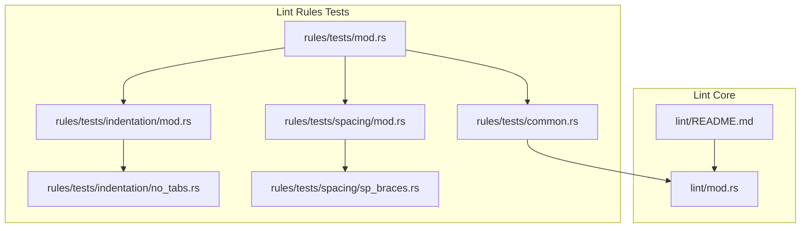
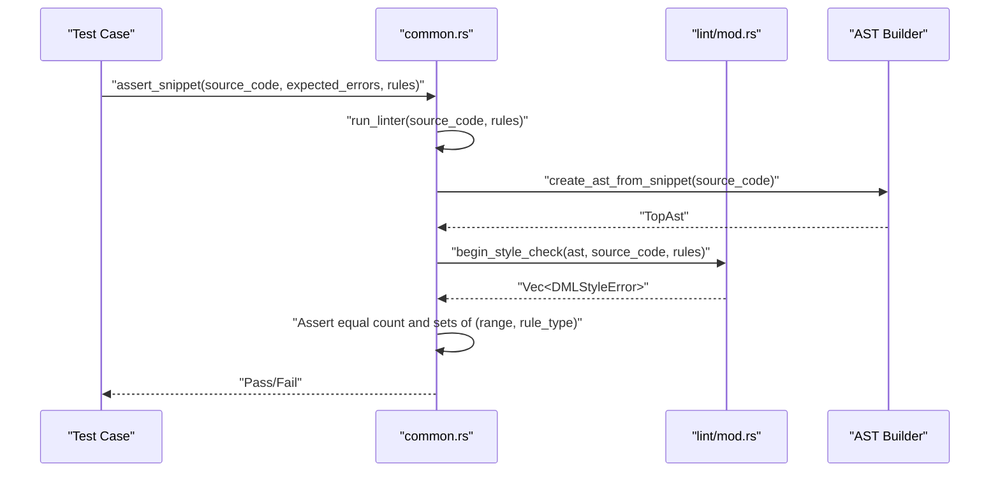
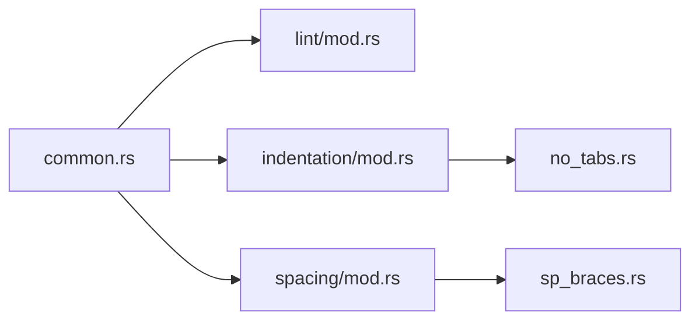

# Lint Testing Framework

<cite>
**Referenced Files in This Document**
- [src/lint/README.md](file://src/lint/README.md)
- [src/lint/mod.rs](file://src/lint/mod.rs)
- [src/lint/rules/tests/mod.rs](file://src/lint/rules/tests/mod.rs)
- [src/lint/rules/tests/common.rs](file://src/lint/rules/tests/common.rs)
- [src/lint/rules/tests/indentation/mod.rs](file://src/lint/rules/tests/indentation/mod.rs)
- [src/lint/rules/tests/indentation/no_tabs.rs](file://src/lint/rules/tests/indentation/no_tabs.rs)
- [src/lint/rules/tests/spacing/mod.rs](file://src/lint/rules/tests/spacing/mod.rs)
- [src/lint/rules/tests/spacing/sp_braces.rs](file://src/lint/rules/tests/spacing/sp_braces.rs)
</cite>

## Table of Contents
1. [Introduction](#introduction)
2. [Project Structure](#project-structure)
3. [Core Components](#core-components)
4. [Architecture Overview](#architecture-overview)
5. [Detailed Component Analysis](#detailed-component-analysis)
6. [Dependency Analysis](#dependency-analysis)
7. [Performance Considerations](#performance-considerations)
8. [Troubleshooting Guide](#troubleshooting-guide)
9. [Conclusion](#conclusion)
10. [Appendices](#appendices)

## Introduction
This document describes the lint testing framework and unit testing strategies for the DML language server. It explains the test infrastructure setup, the ExpectedDMLStyleError structure used for test assertions, and the assert_snippet helper function. It documents how tests are organized by rule categories, how test cases are created, and how assertions validate lint rule outcomes. It also covers integration with the broader test suite, test data management, continuous integration considerations, and best practices for writing robust lint rule tests.

## Project Structure
The lint testing framework is located under the Rust source tree within the lint module’s rules tests. The tests are organized by rule categories (e.g., indentation, spacing) and share common utilities for constructing ASTs, instantiating rules, and asserting violations.

**Diagram sources**
- [src/lint/rules/tests/mod.rs](file://src/lint/rules/tests/mod.rs#L1-L5)
- [src/lint/rules/tests/common.rs](file://src/lint/rules/tests/common.rs#L1-L54)
- [src/lint/rules/tests/indentation/mod.rs](file://src/lint/rules/tests/indentation/mod.rs#L1-L44)
- [src/lint/rules/tests/spacing/mod.rs](file://src/lint/rules/tests/spacing/mod.rs#L1-L25)
- [src/lint/rules/tests/indentation/no_tabs.rs](file://src/lint/rules/tests/indentation/no_tabs.rs#L1-L71)
- [src/lint/rules/tests/spacing/sp_braces.rs](file://src/lint/rules/tests/spacing/sp_braces.rs#L1-L95)
- [src/lint/README.md](file://src/lint/README.md#L1-L67)
- [src/lint/mod.rs](file://src/lint/mod.rs#L413-L413)

**Section sources**
- [src/lint/rules/tests/mod.rs](file://src/lint/rules/tests/mod.rs#L1-L5)
- [src/lint/rules/tests/common.rs](file://src/lint/rules/tests/common.rs#L1-L54)
- [src/lint/rules/tests/indentation/mod.rs](file://src/lint/rules/tests/indentation/mod.rs#L1-L44)
- [src/lint/rules/tests/spacing/mod.rs](file://src/lint/rules/tests/spacing/mod.rs#L1-L25)
- [src/lint/README.md](file://src/lint/README.md#L1-L67)

## Core Components
- ExpectedDMLStyleError: A test-time structure representing a single expected violation. It captures the zero-based character range and the rule type that should report the violation.
- define_expected_errors!: A macro that constructs vectors of ExpectedDMLStyleError entries from line/column coordinates.
- run_linter(): A helper that builds an AST from a snippet and invokes the style checker, returning collected violations.
- assert_snippet(): The primary assertion helper that compares actual vs expected violations by range and rule type.
- set_up(): A convenience function to initialize default lint configuration and instantiate all rules.

Key responsibilities:
- ExpectedDMLStyleError: Encapsulates the assertion criteria for a single violation.
- define_expected_errors!: Provides concise, readable syntax for specifying expected error locations.
- run_linter(): Bridges test input (source snippet) to the linter output (violations).
- assert_snippet(): Validates that the linter emits exactly the expected violations.
- set_up(): Standardizes rule instantiation for tests.

**Section sources**
- [src/lint/rules/tests/common.rs](file://src/lint/rules/tests/common.rs#L8-L54)

## Architecture Overview
The lint testing pipeline converts a source snippet into an AST, runs the style checker, and asserts the resulting violations against expected ones.

**Diagram sources**
- [src/lint/rules/tests/common.rs](file://src/lint/rules/tests/common.rs#L31-L48)
- [src/lint/mod.rs](file://src/lint/mod.rs#L413-L413)

## Detailed Component Analysis

### ExpectedDMLStyleError and define_expected_errors
- ExpectedDMLStyleError holds:
  - range: Zero-based character range of the violation.
  - rule_type: The rule type responsible for the violation.
- define_expected_errors! constructs a vector of ExpectedDMLStyleError from a series of (start_line, end_line, start_col, end_col) tuples. It internally maps these coordinates to ZeroRange and attaches the provided RuleType.

Usage pattern:
- Each test defines expected violations for a specific rule type.
- Coordinates are inclusive/inclusive for both lines and columns.

Validation:
- The macro ensures that tests remain concise while preserving explicit location semantics.

**Section sources**
- [src/lint/rules/tests/common.rs](file://src/lint/rules/tests/common.rs#L8-L29)

### assert_snippet Helper
- Purpose: Centralized assertion for lint rule tests.
- Behavior:
  - Runs the linter on the given snippet.
  - Compares the number of actual violations to the expected count.
  - Builds sets of (range, rule_type) pairs for both actual and expected violations and asserts equality.
- Benefits:
  - Ignores ordering differences.
  - Ensures precise coverage of both location and rule type.

Integration:
- Used across rule-specific test modules to validate correctness and regressions.

**Section sources**
- [src/lint/rules/tests/common.rs](file://src/lint/rules/tests/common.rs#L40-L48)

### set_up and Rule Instantiation
- set_up creates a default LintCfg and instantiates all rules, returning CurrentRules.
- Tests commonly reuse this to ensure consistent baseline behavior.

Practical use:
- Tests can override specific rule settings (e.g., disabling a rule or adjusting thresholds) before invoking assert_snippet.

**Section sources**
- [src/lint/rules/tests/common.rs](file://src/lint/rules/tests/common.rs#L50-L54)

### Test Organization by Rule Categories
- Indentation tests live under indentation/, including tests for tab usage and line length.
- Spacing tests live under spacing/, covering various spacing rules (e.g., brace spacing).
- Each category module aggregates rule-specific tests and may include shared fixtures or constants.

Example patterns:
- Indentation: Tests assert violations for specific column positions within indented blocks.
- Spacing: Tests assert violations around braces and other punctuation.

**Section sources**
- [src/lint/rules/tests/indentation/mod.rs](file://src/lint/rules/tests/indentation/mod.rs#L1-L44)
- [src/lint/rules/tests/spacing/mod.rs](file://src/lint/rules/tests/spacing/mod.rs#L1-L25)

### Example: Indentation Rule Test (no_tabs)
- The test demonstrates:
  - Defining a snippet with tab-based indentation.
  - Using define_expected_errors! to specify expected violation ranges.
  - Calling assert_snippet to validate violations.
  - Optionally disabling the rule to expect zero violations.

This pattern is repeated across indentation tests.

**Section sources**
- [src/lint/rules/tests/indentation/no_tabs.rs](file://src/lint/rules/tests/indentation/no_tabs.rs#L28-L41)

### Example: Spacing Rule Test (sp_braces)
- The test demonstrates:
  - A snippet with missing spaces around braces.
  - Multiple expected violations across methods, bank/register blocks, and typedefs/layouts.
  - Validation that correct spacing yields zero violations.
  - Optional rule disabling to confirm behavior.

This pattern is representative of spacing rule tests.

**Section sources**
- [src/lint/rules/tests/spacing/sp_braces.rs](file://src/lint/rules/tests/spacing/sp_braces.rs#L20-L36)
- [src/lint/rules/tests/spacing/sp_braces.rs](file://src/lint/rules/tests/spacing/sp_braces.rs#L53-L57)
- [src/lint/rules/tests/spacing/sp_braces.rs](file://src/lint/rules/tests/spacing/sp_braces.rs#L64-L80)
- [src/lint/rules/tests/spacing/sp_braces.rs](file://src/lint/rules/tests/spacing/sp_braces.rs#L87-L94)

### Lint Module Overview and Entry Points
- The lint module documentation explains:
  - The linter runs after AST construction.
  - begin_style_check is the main entry point.
  - Violations are aggregated and reported as LocalDMLError, later converted to DMLError for the server.

This context helps interpret test expectations and error semantics.

**Section sources**
- [src/lint/README.md](file://src/lint/README.md#L1-L67)

### AST Construction for Tests
- The test utilities rely on create_ast_from_snippet to parse a snippet into a TopAst.
- This enables focused testing of lint rules without requiring external files.

**Section sources**
- [src/lint/mod.rs](file://src/lint/mod.rs#L413-L413)

## Dependency Analysis
The lint tests depend on:
- Common test utilities for building ASTs, instantiating rules, and asserting violations.
- Rule categories that aggregate rule-specific tests.
- The lint core for the style checker entry points and error types.

**Diagram sources**
- [src/lint/rules/tests/common.rs](file://src/lint/rules/tests/common.rs#L1-L54)
- [src/lint/mod.rs](file://src/lint/mod.rs#L413-L413)
- [src/lint/rules/tests/indentation/mod.rs](file://src/lint/rules/tests/indentation/mod.rs#L1-L44)
- [src/lint/rules/tests/indentation/no_tabs.rs](file://src/lint/rules/tests/indentation/no_tabs.rs#L1-L71)
- [src/lint/rules/tests/spacing/mod.rs](file://src/lint/rules/tests/spacing/mod.rs#L1-L25)
- [src/lint/rules/tests/spacing/sp_braces.rs](file://src/lint/rules/tests/spacing/sp_braces.rs#L1-L95)

**Section sources**
- [src/lint/rules/tests/common.rs](file://src/lint/rules/tests/common.rs#L1-L54)
- [src/lint/rules/tests/indentation/mod.rs](file://src/lint/rules/tests/indentation/mod.rs#L1-L44)
- [src/lint/rules/tests/spacing/mod.rs](file://src/lint/rules/tests/spacing/mod.rs#L1-L25)

## Performance Considerations
- Test granularity: Keep snippets minimal to reduce parsing and linting overhead.
- Shared setup: Use set_up to avoid repeated rule instantiation across tests in the same module.
- Macro usage: define_expected_errors! reduces boilerplate and potential mistakes in coordinate specification.
- Avoid redundant assertions: Prefer a single assert_snippet per test case to minimize assertion overhead.

## Troubleshooting Guide
Common issues and resolutions:
- Mismatched violation counts:
  - Cause: Missing or extra violations.
  - Action: Inspect the printed snippet and AST to confirm expected locations; adjust coordinates or add/remove expected violations.
- Range mismatches:
  - Cause: Off-by-one errors in coordinates or confusion between inclusive bounds.
  - Action: Re-check line and column indices; remember that coordinates are zero-based and inclusive.
- Rule disabled unexpectedly:
  - Cause: Misconfigured rule settings.
  - Action: Verify rule enablement and configuration overrides before calling assert_snippet.
- CI flakiness:
  - Cause: Environment-dependent formatting or configuration.
  - Action: Pin lint configuration in tests; ensure deterministic behavior by using set_up and explicit rule toggles.

Debugging tips:
- Print the snippet and AST during tests to validate parsing.
- Temporarily disable rule-specific logic to isolate failures.
- Compare actual vs expected sets of (range, rule_type) to identify missing or extra violations.

**Section sources**
- [src/lint/rules/tests/common.rs](file://src/lint/rules/tests/common.rs#L31-L48)

## Conclusion
The lint testing framework provides a structured, reusable approach to validating DML lint rules. By leveraging ExpectedDMLStyleError, define_expected_errors!, run_linter, and assert_snippet, tests can precisely validate both the presence and location of violations. Organizing tests by rule categories improves maintainability and readability. Following the guidelines in this document ensures reliable, efficient, and comprehensive lint rule validation across diverse code patterns.

## Appendices

### Writing Effective Lint Rule Tests
- Keep snippets small and focused on a single rule or concept.
- Use define_expected_errors! to clearly specify violation locations.
- Prefer explicit rule toggles (e.g., enabling/disabling a rule) to validate behavior changes.
- Validate both positive and negative cases (violations present and absent).
- Maintain deterministic configurations using set_up and explicit overrides.

### Edge Cases and Best Practices
- Test boundary conditions (first/last column, empty blocks, nested structures).
- Validate interactions between rules (e.g., spacing and indentation).
- Ensure tests remain stable across formatting changes by pinning configurations.
- Use consistent naming conventions for test snippets and expected error lists.

### Continuous Integration Testing
- Integrate lint rule tests into the Rust test suite using cargo test.
- Keep tests fast and deterministic to support frequent CI runs.
- Document test categories and expected failures to aid maintenance.