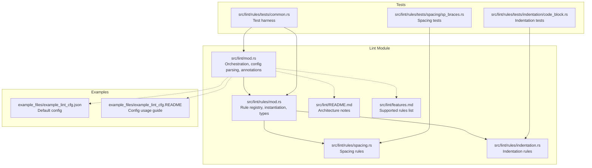
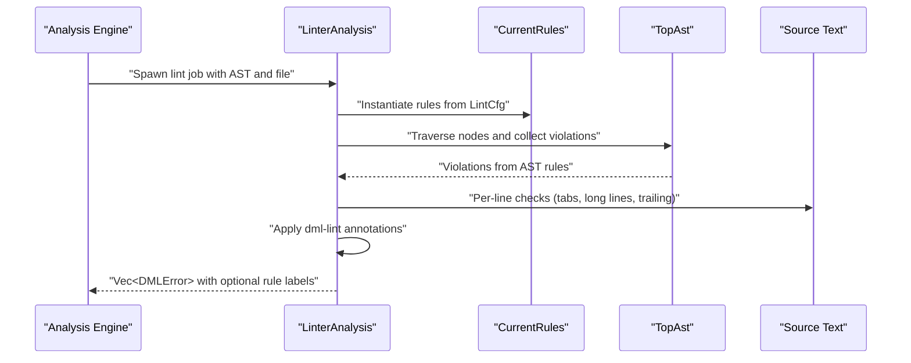
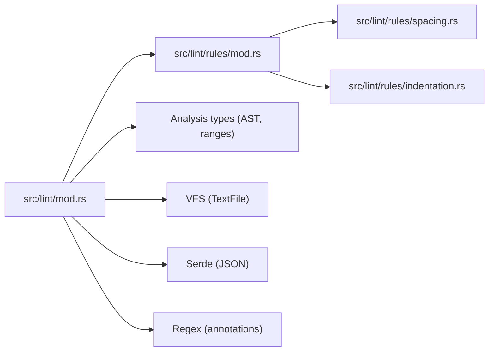

# Linting System

<cite>
**Referenced Files in This Document**
- [mod.rs](file://src/lint/mod.rs)
- [rules/mod.rs](file://src/lint/rules/mod.rs)
- [rules/spacing.rs](file://src/lint/rules/spacing.rs)
- [rules/indentation.rs](file://src/lint/rules/indentation.rs)
- [README.md](file://src/lint/README.md)
- [features.md](file://src/lint/features.md)
- [example_lint_cfg.json](file://example_files/example_lint_cfg.json)
- [example_lint_cfg.README](file://example_files/example_lint_cfg.README)
- [tests/common.rs](file://src/lint/rules/tests/common.rs)
- [tests/spacing/sp_braces.rs](file://src/lint/rules/tests/spacing/sp_braces.rs)
- [tests/indentation/code_block.rs](file://src/lint/rules/tests/indentation/code_block.rs)
</cite>

## Table of Contents
1. [Introduction](#introduction)
2. [Project Structure](#project-structure)
3. [Core Components](#core-components)
4. [Architecture Overview](#architecture-overview)
5. [Detailed Component Analysis](#detailed-component-analysis)
6. [Dependency Analysis](#dependency-analysis)
7. [Performance Considerations](#performance-considerations)
8. [Troubleshooting Guide](#troubleshooting-guide)
9. [Conclusion](#conclusion)
10. [Appendices](#appendices)

## Introduction
This document describes the configurable linting system for the DML language server. It explains the pluggable rule architecture, configuration management, per-file/per-line annotations, and integration with the analysis engine for real-time feedback. It also covers rule categories (spacing, indentation, line length), rule parameters, configuration file format, and practical guidance for extending and debugging rules.

## Project Structure
The linting subsystem is implemented in Rust under src/lint and src/lint/rules. Key areas:
- Lint orchestration and configuration parsing live in src/lint/mod.rs.
- Rule categories are split into spacing and indentation under src/lint/rules/.
- Rule metadata and types are defined in src/lint/rules/mod.rs.
- Documentation and feature lists are in src/lint/README.md and src/lint/features.md.
- Example configuration and usage guidance are in example_files/example_lint_cfg.*.
- Tests demonstrate rule behavior and validation in src/lint/rules/tests/.

**Diagram sources**
- [mod.rs](file://src/lint/mod.rs#L1-L587)
- [rules/mod.rs](file://src/lint/rules/mod.rs#L1-L143)
- [rules/spacing.rs](file://src/lint/rules/spacing.rs#L1-L881)
- [rules/indentation.rs](file://src/lint/rules/indentation.rs#L1-L695)
- [README.md](file://src/lint/README.md#L1-L67)
- [features.md](file://src/lint/features.md#L1-L52)
- [example_lint_cfg.json](file://example_files/example_lint_cfg.json#L1-L23)
- [example_lint_cfg.README](file://example_files/example_lint_cfg.README#L1-L30)
- [tests/common.rs](file://src/lint/rules/tests/common.rs#L1-L54)
- [tests/spacing/sp_braces.rs](file://src/lint/rules/tests/spacing/sp_braces.rs#L1-L95)
- [tests/indentation/code_block.rs](file://src/lint/rules/tests/indentation/code_block.rs#L1-L299)

**Section sources**
- [mod.rs](file://src/lint/mod.rs#L1-L587)
- [rules/mod.rs](file://src/lint/rules/mod.rs#L1-L143)
- [README.md](file://src/lint/README.md#L1-L67)
- [features.md](file://src/lint/features.md#L1-L52)
- [example_lint_cfg.json](file://example_files/example_lint_cfg.json#L1-L23)
- [example_lint_cfg.README](file://example_files/example_lint_cfg.README#L1-L30)
- [tests/common.rs](file://src/lint/rules/tests/common.rs#L1-L54)
- [tests/spacing/sp_braces.rs](file://src/lint/rules/tests/spacing/sp_braces.rs#L1-L95)
- [tests/indentation/code_block.rs](file://src/lint/rules/tests/indentation/code_block.rs#L1-L299)

## Core Components
- Lint configuration model and parsing:
  - LintCfg holds per-rule options and global flags (e.g., annotate_lints).
  - Configuration is parsed from JSON with unknown field detection and defaults.
- Rule instantiation:
  - CurrentRules aggregates all rule instances, enabling/disabling them based on LintCfg.
- Style checking pipeline:
  - begin_style_check traverses the AST and collects violations.
  - Per-line checks (e.g., trailing spaces, long lines, tabs) run after AST traversal.
  - Per-file/per-line annotations allow selective suppression of violations.
- Error reporting:
  - Violations are emitted as DMLError with optional rule annotation.

Key implementation references:
- Configuration parsing and defaults: [LintCfg](file://src/lint/mod.rs#L68-L157)
- Instantiation of rules: [instantiate_rules](file://src/lint/mod.rs#L43-L64), [CurrentRules](file://src/lint/rules/mod.rs#L22-L41)
- Style checking entry point: [begin_style_check](file://src/lint/mod.rs#L209-L229)
- Annotation parsing and application: [obtain_lint_annotations](file://src/lint/mod.rs#L252-L364), [remove_disabled_lints](file://src/lint/mod.rs#L381-L392)

**Section sources**
- [mod.rs](file://src/lint/mod.rs#L37-L157)
- [rules/mod.rs](file://src/lint/rules/mod.rs#L22-L64)

## Architecture Overview
The linting pipeline integrates with the analysis engine:
- After IsolatedAnalysis produces the AST, LinterAnalysis is spawned.
- begin_style_check performs two passes:
  - AST-driven checks via rule.style_check implementations.
  - Line-based checks for spacing and length.
- Per-line annotations are collected and applied to suppress violations.

**Diagram sources**
- [mod.rs](file://src/lint/mod.rs#L182-L229)
- [README.md](file://src/lint/README.md#L3-L21)

**Section sources**
- [mod.rs](file://src/lint/mod.rs#L182-L229)
- [README.md](file://src/lint/README.md#L3-L21)

## Detailed Component Analysis

### Configuration Model and Parsing
- LintCfg fields mirror rule categories:
  - Spacing: sp_reserved, sp_brace, sp_punct, sp_binop, sp_ternary, sp_ptrdecl, nsp_ptrdecl, nsp_funpar, nsp_inparen, nsp_unary, nsp_trailing.
  - Indentation: long_lines, indent_size, indent_no_tabs, indent_code_block, indent_closing_brace, indent_paren_expr, indent_switch_case, indent_empty_loop.
  - Global: annotate_lints.
- Unknown fields are detected during deserialization and reported to the client.
- Defaults enable most rules with sensible parameters.

References:
- [LintCfg struct](file://src/lint/mod.rs#L68-L157)
- [Default configuration](file://src/lint/mod.rs#L132-L157)
- [Unknown field detection](file://src/lint/mod.rs#L114-L125)

**Section sources**
- [mod.rs](file://src/lint/mod.rs#L68-L157)

### Rule Registry and Instantiation
- CurrentRules aggregates all rule instances with an enabled flag per rule.
- instantiate_rules maps LintCfg options to rule-specific options and enables rules accordingly.

References:
- [CurrentRules](file://src/lint/rules/mod.rs#L22-L41)
- [instantiate_rules](file://src/lint/rules/mod.rs#L43-L64)

**Section sources**
- [rules/mod.rs](file://src/lint/rules/mod.rs#L22-L64)

### Spacing Rules
- Implemented in rules/spacing.rs with dedicated structs and argument extractors for each AST node type.
- Examples include:
  - SpReserved: spaces around reserved words in specific contexts.
  - SpBraces: spaces around braces in compound/object/struct/layout/bitfields.
  - SpBinop: spaces around binary operators.
  - SpTernary: spaces around ? and :.
  - SpPunct: spacing after punctuation marks.
  - NspFunpar/NspInparen/NspUnary/NspPtrDecl/NspTrailing: no-space rules for function name-paren, inside parentheses/brackets, unary ops, pointer decl, trailing whitespace.

References:
- [Spacing rules module](file://src/lint/rules/spacing.rs#L1-L881)
- [Supported rules list](file://src/lint/features.md#L5-L17)

**Section sources**
- [rules/spacing.rs](file://src/lint/rules/spacing.rs#L1-L881)
- [features.md](file://src/lint/features.md#L5-L17)

### Indentation Rules
- Implemented in rules/indentation.rs with configurable indentation_spaces inherited from indent_size.
- Includes:
  - LongLinesRule: enforces max_length.
  - IndentNoTabRule: bans tab characters.
  - IndentCodeBlockRule: aligns block members to expected depth.
  - IndentClosingBraceRule: aligns closing braces to expected indentation.
  - IndentParenExprRule: continuation lines inside parentheses align with opening paren.
  - IndentSwitchCaseRule: case labels and statements indentation.
  - IndentEmptyLoopRule: semicolon in empty loops indented to body level.

References:
- [Indentation rules module](file://src/lint/rules/indentation.rs#L1-L695)
- [Supported rules list](file://src/lint/features.md#L18-L47)

**Section sources**
- [rules/indentation.rs](file://src/lint/rules/indentation.rs#L1-L695)
- [features.md](file://src/lint/features.md#L18-L47)

### Per-Line and Per-File Annotations
- Syntax: comments containing dml-lint: allow=<rule> or allow-file=<rule>.
- Scope:
  - allow applies to subsequent lines until a non-comment line or end-of-file.
  - allow-file applies to the entire file for the named rule.
- Validation:
  - Unknown commands and targets produce diagnostics.
  - Unapplied annotations at EOF are flagged.

References:
- [Annotation regex and parsing](file://src/lint/mod.rs#L244-L364)
- [Annotation application](file://src/lint/mod.rs#L381-L392)

**Section sources**
- [mod.rs](file://src/lint/mod.rs#L244-L392)

### Integration with Analysis Engine
- LinterAnalysis.new constructs a lint job after AST creation.
- begin_style_check coordinates AST traversal and per-line checks, then applies annotations and post-processing.

References:
- [LinterAnalysis::new](file://src/lint/mod.rs#L182-L207)
- [begin_style_check](file://src/lint/mod.rs#L209-L229)
- [Architecture notes](file://src/lint/README.md#L3-L21)

**Section sources**
- [mod.rs](file://src/lint/mod.rs#L182-L229)
- [README.md](file://src/lint/README.md#L3-L21)

### Practical Examples and Tests
- Spacing tests demonstrate correct and incorrect spacing around braces.
- Indentation tests show correct and incorrect indentation across nested constructs.

References:
- [Spacing brace tests](file://src/lint/rules/tests/spacing/sp_braces.rs#L1-L95)
- [Indentation code-block tests](file://src/lint/rules/tests/indentation/code_block.rs#L1-L299)
- [Test harness](file://src/lint/rules/tests/common.rs#L1-L54)

**Section sources**
- [tests/spacing/sp_braces.rs](file://src/lint/rules/tests/spacing/sp_braces.rs#L1-L95)
- [tests/indentation/code_block.rs](file://src/lint/rules/tests/indentation/code_block.rs#L1-L299)
- [tests/common.rs](file://src/lint/rules/tests/common.rs#L1-L54)

## Dependency Analysis
The lint module depends on:
- Analysis engine types for AST and ranges.
- VFS for file text access.
- Serde for configuration serialization/deserialization.
- Regex for annotation parsing.

**Diagram sources**
- [mod.rs](file://src/lint/mod.rs#L1-L35)
- [rules/mod.rs](file://src/lint/rules/mod.rs#L1-L21)

**Section sources**
- [mod.rs](file://src/lint/mod.rs#L1-L35)
- [rules/mod.rs](file://src/lint/rules/mod.rs#L1-L21)

## Performance Considerations
- AST traversal is O(nodes) in the AST size.
- Per-line checks iterate over lines; complexity is O(L) where L is number of lines.
- Annotation parsing uses a single pass with regex scanning; complexity is O(L).
- Post-processing filters errors by range intersection; cost is proportional to number of violations.
- Recommendations:
  - Keep rule sets minimal for large codebases to reduce AST traversal overhead.
  - Prefer disabling heavy rules (e.g., long_lines) when not needed.
  - Use per-file/per-line annotations to selectively suppress noisy rules in specific contexts.

[No sources needed since this section provides general guidance]

## Troubleshooting Guide
Common issues and remedies:
- Unknown configuration fields:
  - Detected during parsing; review example configuration and remove unsupported keys.
  - Reference: [parse_lint_cfg](file://src/lint/mod.rs#L37-L64), [try_deserialize](file://src/lint/mod.rs#L114-L125)
- Invalid dml-lint annotations:
  - Unknown commands or rule names produce diagnostics; fix spelling or remove the annotation.
  - Reference: [obtain_lint_annotations](file://src/lint/mod.rs#L285-L324)
- Unapplied annotations at EOF:
  - Indicates allow annotations without effect; remove or reposition.
  - Reference: [obtain_lint_annotations](file://src/lint/mod.rs#L346-L363)
- Rules not triggering:
  - Verify the rule is enabled in LintCfg; confirm options are set appropriately.
  - Reference: [instantiate_rules](file://src/lint/rules/mod.rs#L43-L64)
- Balancing strictness and productivity:
  - Start with defaults; selectively disable or adjust rules per team preference.
  - Use per-file/per-line annotations for exceptions rather than blanket disables.

**Section sources**
- [mod.rs](file://src/lint/mod.rs#L37-L64)
- [mod.rs](file://src/lint/mod.rs#L114-L125)
- [mod.rs](file://src/lint/mod.rs#L285-L363)
- [rules/mod.rs](file://src/lint/rules/mod.rs#L43-L64)

## Conclusion
The linting system provides a modular, configurable framework for enforcing style consistency in DML code. Its pluggable rule architecture, robust configuration model, and per-line/per-file annotation support integrate tightly with the analysis engine to deliver real-time feedback. By leveraging defaults, targeted adjustments, and annotations, teams can balance strictness with developer productivity while maintaining code quality.

[No sources needed since this section summarizes without analyzing specific files]

## Appendices

### Configuration File Format and Options
- Enable/disable rules by including or omitting entries.
- Configure rules with nested objects (e.g., long_lines, indent_size).
- annotate_lints controls whether rule names are included in diagnostic messages.
- Example configuration and usage guide:
  - [example_lint_cfg.json](file://example_files/example_lint_cfg.json#L1-L23)
  - [example_lint_cfg.README](file://example_files/example_lint_cfg.README#L1-L30)

**Section sources**
- [example_lint_cfg.json](file://example_files/example_lint_cfg.json#L1-L23)
- [example_lint_cfg.README](file://example_files/example_lint_cfg.README#L1-L30)

### Rule Categories and Parameters
- Spacing rules:
  - sp_reserved, sp_brace, sp_punct, sp_binop, sp_ternary, sp_ptrdecl, nsp_ptrdecl, nsp_funpar, nsp_inparen, nsp_unary, nsp_trailing.
  - Reference: [features.md](file://src/lint/features.md#L5-L17)
- Indentation rules:
  - long_lines (max_length), indent_no_tabs, indent_code_block (indentation_spaces), indent_closing_brace (indentation_spaces), indent_paren_expr, indent_switch_case (indentation_spaces), indent_empty_loop (indentation_spaces).
  - Reference: [features.md](file://src/lint/features.md#L18-L47)

**Section sources**
- [features.md](file://src/lint/features.md#L5-L47)

### Extending the Linting System
- Add a new rule:
  - Define rule struct and options struct(s).
  - Implement Rule trait and a check method.
  - Add extraction helpers to derive arguments from AST nodes.
  - Register the rule in CurrentRules and mapping in instantiate_rules.
  - Add tests under the appropriate category.
- References:
  - [Rule trait](file://src/lint/rules/mod.rs#L66-L81)
  - [RuleType mapping](file://src/lint/rules/mod.rs#L107-L142)
  - [Architecture notes](file://src/lint/README.md#L50-L67)

**Section sources**
- [rules/mod.rs](file://src/lint/rules/mod.rs#L66-L142)
- [README.md](file://src/lint/README.md#L50-L67)