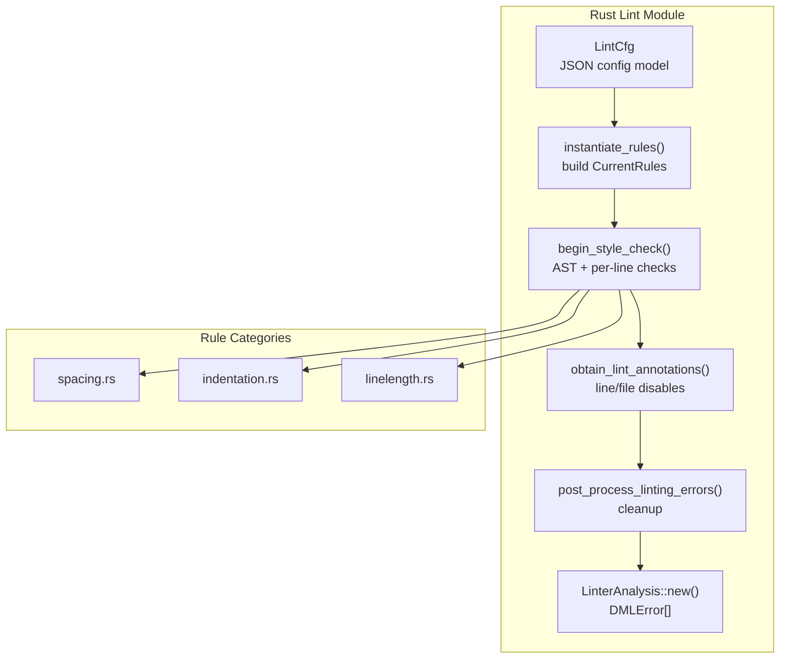
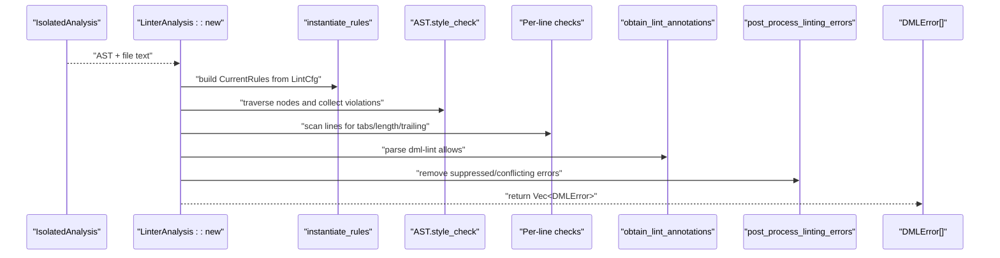
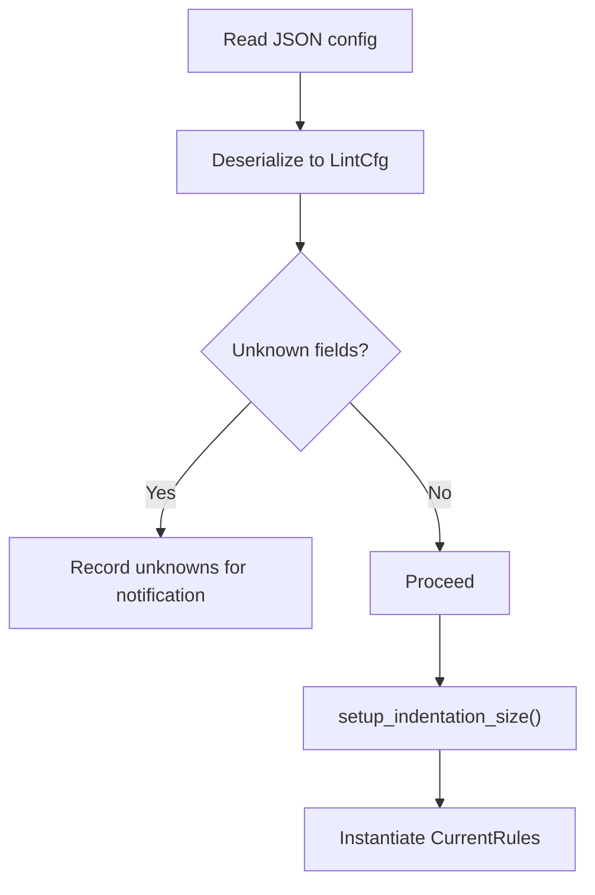
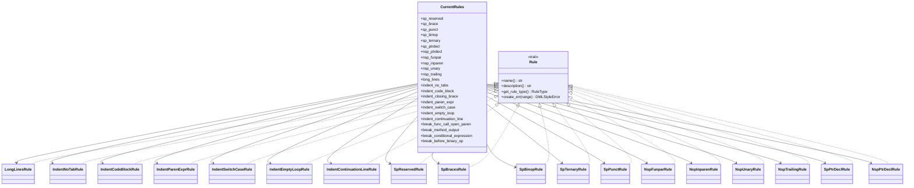
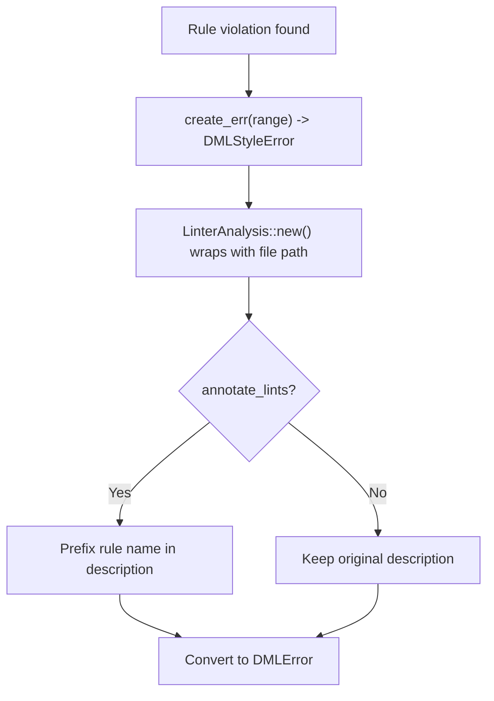
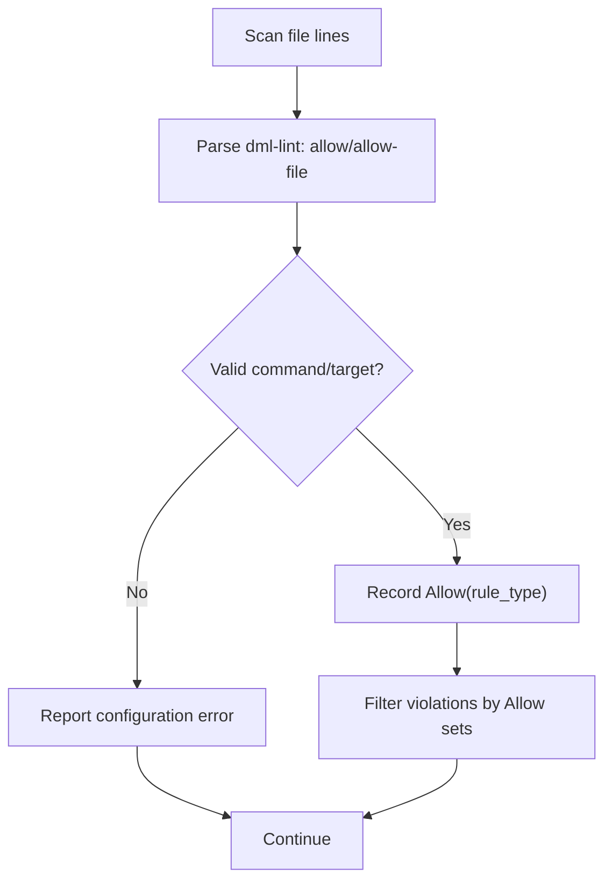
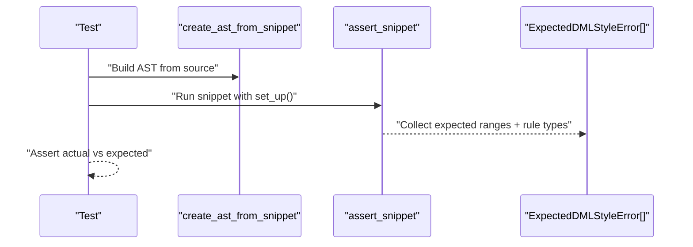
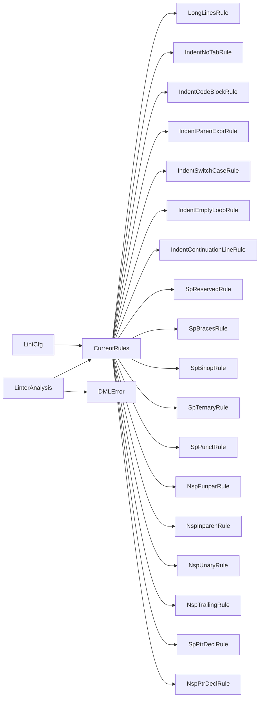

# Linting System

<cite>
**Referenced Files in This Document**
- [src/lint/mod.rs](file://src/lint/mod.rs)
- [src/lint/features.md](file://src/lint/features.md)
- [src/lint/README.md](file://src/lint/README.md)
- [src/lint/rule categories](file://src/lint/rule categories)
- [src/lint/rule categories/spacing.rs](file://src/lint/rule categories/spacing.rs)
- [src/lint/rule categories/indentation.rs](file://src/lint/rule categories/indentation.rs)
- [src/lint/rule categories/linelength.rs](file://src/lint/rule categories/linelength.rs)
- [src/lint/rules/mod.rs](file://src/lint/rules/mod.rs)
- [src/lint/rules/tests/common.rs](file://src/lint/rules/tests/common.rs)
- [example_files/example_lint_cfg.json](file://example_files/example_lint_cfg.json)
- [example_files/example_lint_cfg.README](file://example_files/example_lint_cfg.README)
- [python-port/dml_language_server/lint/__init__.py](file://python-port/dml_language_server/lint/__init__.py)
- [python-port/dml_language_server/lint/rules/__init__.py](file://python-port/dml_language_server/lint/rules/__init__.py)
</cite>

## Table of Contents
1. [Introduction](#introduction)
2. [Project Structure](#project-structure)
3. [Core Components](#core-components)
4. [Architecture Overview](#architecture-overview)
5. [Detailed Component Analysis](#detailed-component-analysis)
6. [Dependency Analysis](#dependency-analysis)
7. [Performance Considerations](#performance-considerations)
8. [Troubleshooting Guide](#troubleshooting-guide)
9. [Conclusion](#conclusion)
10. [Appendices](#appendices)

## Introduction
This document describes the linting system used by the DML Language Server. It explains the pluggable linting architecture, rule categories (spacing, indentation, line length), configuration management, the lint rule execution engine, error reporting, customizable severity levels, rule development and testing, performance optimization, and integration into development workflows. It also covers the lint configuration file format and runtime settings, and how linting relates to code quality enforcement and CI/IDE integration.

## Project Structure
The linting system is implemented primarily in Rust under the src/lint directory, with a companion Python port for linting logic. The core architecture centers on:
- A configuration model (LintCfg) parsed from a JSON file
- A rule instantiation engine that builds a CurrentRules bundle from configuration
- An execution engine that traverses the AST and applies rules, plus per-line checks
- Annotation support to selectively disable rules for specific lines or files
- Error conversion and reporting via DMLError

**Diagram sources**
- [src/lint/mod.rs](file://src/lint/mod.rs#L49-L184)
- [src/lint/mod.rs](file://src/lint/mod.rs#L245-L265)
- [src/lint/rules/mod.rs](file://src/lint/rules/mod.rs#L62-L88)
- [src/lint/rule categories/spacing.rs](file://src/lint/rule categories/spacing.rs)
- [src/lint/rule categories/indentation.rs](file://src/lint/rule categories/indentation.rs)
- [src/lint/rule categories/linelength.rs](file://src/lint/rule categories/linelength.rs)

**Section sources**
- [src/lint/mod.rs](file://src/lint/mod.rs#L49-L184)
- [src/lint/README.md](file://src/lint/README.md#L5-L25)

## Core Components
- LintCfg: Deserializes the lint configuration JSON into a strongly typed model. Unknown fields are captured for diagnostics. Defaults enable most rules with sensible thresholds.
- CurrentRules: A bundle of instantiated rule instances derived from LintCfg. Each rule carries an enabled flag and optional parameters.
- LinterAnalysis: Orchestrates lint execution for a single file, converting raw style errors into DMLError with optional rule annotations.
- RuleType: Enumerated rule identifiers used for selective disabling via annotations.
- Execution pipeline: AST traversal with style_check() per node, followed by per-line checks (tabs, long lines, trailing spaces), annotation filtering, and post-processing.

Key behaviors:
- Configuration-driven enabling/disabling and parameterization
- Per-line checks complement AST-based checks
- Selective rule suppression via dml-lint annotations
- Post-processing to avoid redundant or conflicting errors

**Section sources**
- [src/lint/mod.rs](file://src/lint/mod.rs#L80-L184)
- [src/lint/mod.rs](file://src/lint/mod.rs#L186-L243)
- [src/lint/rules/mod.rs](file://src/lint/rules/mod.rs#L36-L88)
- [src/lint/rules/mod.rs](file://src/lint/rules/mod.rs#L107-L171)

## Architecture Overview
The linting pipeline integrates with the language server’s analysis phase. After IsolatedAnalysis produces an AST, the linter:
1. Instantiates rules from LintCfg
2. Traverses the AST to collect style violations
3. Performs per-line checks (tabs, long lines, trailing)
4. Applies dml-lint annotations to suppress violations
5. Post-processes to remove duplicates/conflicts
6. Converts to DMLError and returns to the server

**Diagram sources**
- [src/lint/mod.rs](file://src/lint/mod.rs#L214-L243)
- [src/lint/mod.rs](file://src/lint/mod.rs#L245-L265)
- [src/lint/mod.rs](file://src/lint/mod.rs#L288-L427)
- [src/lint/rules/mod.rs](file://src/lint/rules/mod.rs#L62-L88)

## Detailed Component Analysis

### Configuration Management
- LintCfg supports granular toggles and parameters for each rule category. Unknown fields are captured during deserialization for user feedback.
- Defaults enable a comprehensive set of rules with safe thresholds (e.g., long-lines default length, indentation default spacing).
- Runtime setup normalizes shared parameters (e.g., propagating indent size to related indentation rules).

**Diagram sources**
- [src/lint/mod.rs](file://src/lint/mod.rs#L49-L76)
- [src/lint/mod.rs](file://src/lint/mod.rs#L135-L148)
- [src/lint/rule categories/indentation.rs](file://src/lint/rule categories/indentation.rs#L40-L58)

**Section sources**
- [src/lint/mod.rs](file://src/lint/mod.rs#L49-L76)
- [src/lint/mod.rs](file://src/lint/mod.rs#L135-L184)
- [src/lint/rule categories/indentation.rs](file://src/lint/rule categories/indentation.rs#L40-L58)

### Rule Categories and Execution Engine
- Spacing rules enforce spacing around operators, punctuation, braces, and pointer declarations, and disallow unintended spaces in various contexts.
- Indentation rules enforce indentation sizes, prohibit tabs, align closing braces, handle code blocks and parenthetical continuations, manage switch cases and empty loops, and align continuation lines.
- Line-length rules enforce maximum line length and prescribe where to break long expressions and declarations.

Execution engine:
- AST traversal: Each AST node implements style_check() to traverse children and accumulate violations.
- Per-line checks: Tabs, long lines, and trailing spaces are scanned line-by-line.
- Annotation filtering: dml-lint annotations allow suppressing specific rules for whole-file or line-scoped contexts.
- Post-processing: Removes errors whose rows are already flagged by tab-indentation violations to avoid duplication.

**Diagram sources**
- [src/lint/rules/mod.rs](file://src/lint/rules/mod.rs#L36-L88)
- [src/lint/rules/mod.rs](file://src/lint/rules/mod.rs#L90-L171)
- [src/lint/rule categories/spacing.rs](file://src/lint/rule categories/spacing.rs)
- [src/lint/rule categories/indentation.rs](file://src/lint/rule categories/indentation.rs)
- [src/lint/rule categories/linelength.rs](file://src/lint/rule categories/linelength.rs)

**Section sources**
- [src/lint/features.md](file://src/lint/features.md#L9-L75)
- [src/lint/README.md](file://src/lint/README.md#L26-L71)
- [src/lint/rules/mod.rs](file://src/lint/rules/mod.rs#L90-L171)

### Error Reporting and Severity
- Each rule creates DMLStyleError with a rule identifier and type, then converts to DMLError with optional prefixing of the rule name when annotation is enabled.
- Severity is controlled by the rule’s configuration; the lint engine surfaces violations as DMLError with appropriate severities.

**Diagram sources**
- [src/lint/rules/mod.rs](file://src/lint/rules/mod.rs#L95-L104)
- [src/lint/mod.rs](file://src/lint/mod.rs#L224-L234)

**Section sources**
- [src/lint/mod.rs](file://src/lint/mod.rs#L186-L243)

### Annotation-Based Suppression
- dml-lint annotations allow disabling specific rules for a line or the entire file.
- Parsing captures allowed rule targets and validates commands and targets.
- Disabled violations are filtered out before reporting.

**Diagram sources**
- [src/lint/mod.rs](file://src/lint/mod.rs#L288-L427)

**Section sources**
- [src/lint/mod.rs](file://src/lint/mod.rs#L288-L427)

### Rule Development Framework and Testing
- Add a new rule by implementing a struct with a check() method and a Rule trait implementation, registering it in CurrentRules, and wiring its options into LintCfg.
- Tests use a helper to build an AST from a snippet and assert expected violations.
- The test suite validates configuration parsing, unknown field detection, and annotation parsing/apply behavior.

**Diagram sources**
- [src/lint/mod.rs](file://src/lint/mod.rs#L444-L621)

**Section sources**
- [src/lint/README.md](file://src/lint/README.md#L54-L71)
- [src/lint/mod.rs](file://src/lint/mod.rs#L444-L621)

### Python Port Linting Engine (Alternative Implementation)
The Python port provides a simpler, file-content-centric lint engine with:
- A base LintRule class and several built-in rules (indentation, spacing, long lines)
- A LintEngine that loads configuration, registers default rules, and applies user overrides
- Severity levels mapped to diagnostic severities

This is useful for environments where the Rust engine is not used, or for prototyping rule logic.

**Section sources**
- [python-port/dml_language_server/lint/__init__.py](file://python-port/dml_language_server/lint/__init__.py#L196-L288)
- [python-port/dml_language_server/lint/rules/__init__.py](file://python-port/dml_language_server/lint/rules/__init__.py#L34-L231)

## Dependency Analysis
- LintCfg depends on serde for JSON parsing and on rule option structs for parameters.
- CurrentRules aggregates rule structs and exposes unified check interfaces.
- LinterAnalysis depends on the AST, file text, and CurrentRules to produce DMLError.
- RuleType enables annotation-based suppression by rule identity.

**Diagram sources**
- [src/lint/rules/mod.rs](file://src/lint/rules/mod.rs#L36-L88)
- [src/lint/mod.rs](file://src/lint/mod.rs#L214-L243)

**Section sources**
- [src/lint/rules/mod.rs](file://src/lint/rules/mod.rs#L36-L88)
- [src/lint/mod.rs](file://src/lint/mod.rs#L214-L243)

## Performance Considerations
- Minimize allocations by reusing vectors and avoiding repeated string copies during per-line scans.
- Keep rule checks O(n) over the number of lines/nodes; avoid nested scans where possible.
- Use early exits in rule checks when conditions are not met.
- Batch error construction and conversion to DMLError to reduce overhead.
- Consider caching rule options derived from LintCfg (e.g., normalized indentation sizes) to avoid recomputation.

## Troubleshooting Guide
Common issues and resolutions:
- Unknown fields in configuration: Detected during deserialization; review the lint config and remove unsupported keys.
- dml-lint annotation misuse: Invalid commands or targets produce configuration errors; fix the annotation text or rule name.
- Suppressed errors not appearing: Verify allow/allow-file scopes and ensure the rule type matches the targeted rule.
- Post-processing removing expected errors: Some errors are intentionally removed if they overlap with indentation-no-tabs violations; adjust expectations accordingly.

**Section sources**
- [src/lint/mod.rs](file://src/lint/mod.rs#L135-L148)
- [src/lint/mod.rs](file://src/lint/mod.rs#L320-L398)
- [src/lint/mod.rs](file://src/lint/mod.rs#L401-L427)

## Conclusion
The linting system provides a robust, configurable, and extensible framework for enforcing DML style guidelines. Its pluggable architecture, clear separation of AST-based and per-line checks, and annotation-driven suppression make it suitable for diverse development workflows. With proper configuration and CI integration, it helps maintain consistent code quality across teams.

## Appendices

### Configuration File Format and Examples
- LintCfg is a JSON object with optional fields for each rule category. Unknown fields are captured for diagnostics.
- Example configuration and its documentation are provided alongside the repository.

**Section sources**
- [src/lint/mod.rs](file://src/lint/mod.rs#L49-L76)
- [example_files/example_lint_cfg.json](file://example_files/example_lint_cfg.json)
- [example_files/example_lint_cfg.README](file://example_files/example_lint_cfg.README)

### Rule Categories Overview
- Spacing rules: Enforce spacing around operators, punctuation, braces, and pointer declarations; disallow unintended spaces.
- Indentation rules: Enforce indentation size, prohibit tabs, align closing braces, handle code blocks and parenthetical continuations, manage switch cases and empty loops, align continuation lines.
- Line-length rules: Enforce maximum line length and prescribe where to break long expressions and declarations.

**Section sources**
- [src/lint/features.md](file://src/lint/features.md#L9-L75)

### Creating Custom Rules
- Implement a rule struct with a check() method and Rule trait implementation.
- Register the rule in CurrentRules and wire its options into LintCfg.
- Add tests using the snippet-based testing helper to assert expected violations.

**Section sources**
- [src/lint/README.md](file://src/lint/README.md#L54-L71)
- [src/lint/rules/mod.rs](file://src/lint/rules/mod.rs#L90-L171)

### Integrating Linting into Workflows
- IDE integration: Surface DMLError diagnostics in editors via the language server.
- Continuous Integration: Run linting as part of pre-commit hooks or CI jobs to enforce style standards.
- Configuration: Commit a lint configuration file to standardize team-wide rules.

[No sources needed since this section provides general guidance]