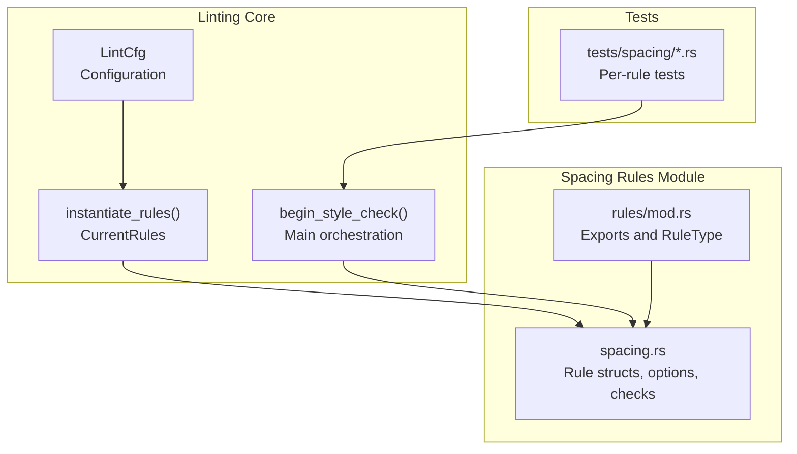
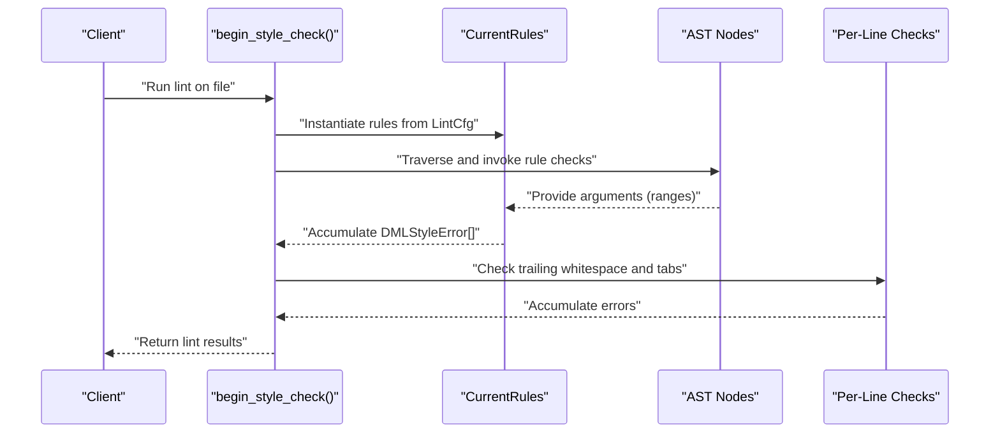
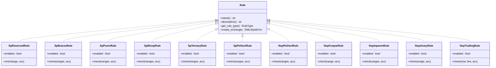

# Spacing Rules

<cite>
**Referenced Files in This Document**
- [spacing.rs](file://src/lint/rules/spacing.rs)
- [mod.rs](file://src/lint/rules/mod.rs)
- [lint/mod.rs](file://src/lint/mod.rs)
- [sp_reserved.rs](file://src/lint/rules/tests/spacing/sp_reserved.rs)
- [sp_braces.rs](file://src/lint/rules/tests/spacing/sp_braces.rs)
- [sp_punct.rs](file://src/lint/rules/tests/spacing/sp_punct.rs)
- [sp_binop.rs](file://src/lint/rules/tests/spacing/sp_binop.rs)
- [sp_ternary.rs](file://src/lint/rules/tests/spacing/sp_ternary.rs)
</cite>

## Table of Contents
1. [Introduction](#introduction)
2. [Project Structure](#project-structure)
3. [Core Components](#core-components)
4. [Architecture Overview](#architecture-overview)
5. [Detailed Component Analysis](#detailed-component-analysis)
6. [Dependency Analysis](#dependency-analysis)
7. [Performance Considerations](#performance-considerations)
8. [Troubleshooting Guide](#troubleshooting-guide)
9. [Conclusion](#conclusion)

## Introduction
This document describes the spacing-related lint rules that enforce whitespace and spacing consistency in DML code. It covers the design, parameters, validation logic, error reporting, and integration with the broader linting system for the following rules:
- SpReservedOptions (reserved keyword spacing)
- SpBraceOptions (brace spacing)
- SpPunctOptions (punctuation spacing)
- SpBinopOptions (binary operator spacing)
- SpTernaryOptions (ternary operator spacing)
- SpPtrDeclOptions (pointer declaration spacing)
- NspPtrDeclOptions (no-space pointer declaration)
- NspFunparOptions (no-space function parameters)
- NspInparenOptions (no-space in parentheses)
- NspUnaryOptions (no-space unary operators)
- NspTrailingOptions (no-space trailing)

It also provides practical examples of violations and their corrections, performance implications, and testing strategies.

## Project Structure
The spacing rules are implemented under the linting subsystem. The primary implementation resides in a single module file, with rule instantiation and configuration managed centrally, and tests organized per-rule under a dedicated tests directory.

**Diagram sources**
- [spacing.rs](file://src/lint/rules/spacing.rs#L1-L881)
- [mod.rs](file://src/lint/rules/mod.rs#L1-L143)
- [lint/mod.rs](file://src/lint/mod.rs#L180-L229)

**Section sources**
- [spacing.rs](file://src/lint/rules/spacing.rs#L1-L881)
- [mod.rs](file://src/lint/rules/mod.rs#L1-L143)
- [lint/mod.rs](file://src/lint/mod.rs#L180-L229)

## Core Components
- Rule options and rule structs: Each rule defines a small options struct (often empty) and a corresponding rule struct with an enabled flag and a check method. Examples include SpReservedOptions/SpReservedRule, SpBraceOptions/SpBracesRule, SpPunctOptions/SpPunctRule, SpBinopOptions/SpBinopRule, SpTernaryOptions/SpTernaryRule, SpPtrDeclOptions/SpPtrDeclRule, NspPtrDeclOptions/NspPtrDeclRule, NspFunparOptions/NspFunparRule, NspInparenOptions/NspInparenRule, NspUnaryOptions/NspUnaryRule, NspTrailingOptions/NspTrailingRule.
- Argument builders: Each rule exposes argument constructors that extract relevant ranges from parsed AST nodes (e.g., SpReservedArgs.from_if, SpBracesArgs.from_compound, SpPunctArgs.from_method, SpBinopArgs.from_binary_expression_content, SpTernaryArgs.from_tertiary_expression_content, NspFunparArgs.from_method, NspInparenArgs.from_if, NspUnaryArgs.from_unary_expr, NspPtrDeclArgs.from_cdecl).
- Validation logic: Each rule’s check method compares token positions to detect missing spaces or unwanted spaces, pushing errors via a shared error creation mechanism.
- Error reporting: All rules report via a common DMLStyleError creation routine that attaches rule identity and type.

Key integration points:
- Rule instantiation: Rules are enabled/disabled based on LintCfg fields and collected into CurrentRules.
- Orchestration: begin_style_check traverses the AST and invokes rule checks, then performs per-line checks for trailing whitespace and tab indentation.

**Section sources**
- [spacing.rs](file://src/lint/rules/spacing.rs#L24-L128)
- [spacing.rs](file://src/lint/rules/spacing.rs#L130-L239)
- [spacing.rs](file://src/lint/rules/spacing.rs#L241-L293)
- [spacing.rs](file://src/lint/rules/spacing.rs#L295-L367)
- [spacing.rs](file://src/lint/rules/spacing.rs#L369-L514)
- [spacing.rs](file://src/lint/rules/spacing.rs#L516-L569)
- [spacing.rs](file://src/lint/rules/spacing.rs#L571-L673)
- [spacing.rs](file://src/lint/rules/spacing.rs#L675-L727)
- [spacing.rs](file://src/lint/rules/spacing.rs#L729-L761)
- [spacing.rs](file://src/lint/rules/spacing.rs#L763-L829)
- [spacing.rs](file://src/lint/rules/spacing.rs#L831-L880)
- [mod.rs](file://src/lint/rules/mod.rs#L22-L64)
- [lint/mod.rs](file://src/lint/mod.rs#L180-L229)

## Architecture Overview
The spacing rules participate in a centralized linting pipeline:
- Configuration drives rule enablement.
- AST traversal triggers rule-specific checks.
- Per-line checks handle trailing whitespace and indentation.
- Annotations can selectively disable rules for specific lines or files.

**Diagram sources**
- [lint/mod.rs](file://src/lint/mod.rs#L180-L229)
- [mod.rs](file://src/lint/rules/mod.rs#L22-L64)

## Detailed Component Analysis

### SpReservedRule (sp_reserved)
Purpose: Enforce spacing around reserved keywords such as if, else, for, while, and after.

Parameters:
- Options struct: SpReservedOptions (empty; rule toggled by presence of option in LintCfg).

Validation logic:
- Builds argument sets for specific constructs (after, if, for, while).
- Compares token adjacency to detect missing spaces before or after reserved tokens.
- Emits errors spanning the affected token pair.

Integration:
- Enabled via LintCfg.sp_reserved.
- Part of CurrentRules and invoked during AST traversal.

Practical examples:
- Violations occur when reserved keywords touch identifiers or parentheses without spaces.
- Corrections add a single space adjacent to the reserved keyword.

Testing strategy:
- Tests cover if, for, while constructs with incorrect spacing and verify correct spacing produces no errors.
- Rule disable test ensures disabling suppresses reported errors.

**Section sources**
- [spacing.rs](file://src/lint/rules/spacing.rs#L24-L128)
- [spacing.rs](file://src/lint/rules/spacing.rs#L37-L88)
- [spacing.rs](file://src/lint/rules/spacing.rs#L90-L116)
- [sp_reserved.rs](file://src/lint/rules/tests/spacing/sp_reserved.rs#L1-L154)

### SpBracesRule (sp_brace)
Purpose: Enforce spacing around braces for compound blocks, object statements, struct types, layouts, and bitfields.

Parameters:
- Options struct: SpBraceOptions (empty; rule toggled by presence of option in LintCfg).

Validation logic:
- Extracts body start/end and brace ranges from container constructs.
- Detects missing space between the opening brace and the first body element, and between the last body element and the closing brace.

Integration:
- Enabled via LintCfg.sp_brace.
- Invoked during AST traversal for applicable containers.

Practical examples:
- Violations occur when braces abut the first or last statement/declaration.
- Corrections insert a single space between the brace and the adjacent element.

Testing strategy:
- Tests include method bodies, empty methods, struct/typedef, layout/bitfields, and verify correct spacing yields no errors.
- Rule disable test confirms suppression.

**Section sources**
- [spacing.rs](file://src/lint/rules/spacing.rs#L130-L239)
- [spacing.rs](file://src/lint/rules/spacing.rs#L144-L209)
- [spacing.rs](file://src/lint/rules/spacing.rs#L211-L227)
- [sp_braces.rs](file://src/lint/rules/tests/spacing/sp_braces.rs#L1-L95)

### SpPunctRule (sp_punct)
Purpose: Enforce spacing after punctuation marks (commas, semicolons, colons) but not before them.

Parameters:
- Options struct: SpPunctOptions (empty; rule toggled by presence of option in LintCfg).

Validation logic:
- Builds argument lists for method signatures, function calls, expression statements, and variable declarations.
- Ensures a space exists between the preceding element and the punctuation, and between the punctuation and the next element (where applicable).
- Emits errors covering the gap between tokens.

Integration:
- Enabled via LintCfg.sp_punct.
- Invoked during AST traversal for relevant statements and expressions.

Practical examples:
- Violations occur when commas, semicolons, or colons touch adjacent tokens without proper spacing.
- Corrections insert a single space after punctuation.

Testing strategy:
- Tests cover method signatures, function calls, and statements with incorrect spacing and verify correct spacing produces no errors.
- Rule disable test confirms suppression.

**Section sources**
- [spacing.rs](file://src/lint/rules/spacing.rs#L369-L514)
- [spacing.rs](file://src/lint/rules/spacing.rs#L382-L468)
- [spacing.rs](file://src/lint/rules/spacing.rs#L470-L501)
- [sp_punct.rs](file://src/lint/rules/tests/spacing/sp_punct.rs#L1-L46)

### SpBinopRule (sp_binop)
Purpose: Enforce spacing around binary operators (excluding member access operators).

Parameters:
- Options struct: SpBinopOptions (empty; rule toggled by presence of option in LintCfg).

Validation logic:
- Extracts left operand, operator, and right operand ranges from binary expressions.
- Detects missing spaces around the operator on both sides.

Integration:
- Enabled via LintCfg.sp_binop.
- Invoked during AST traversal for binary expressions.

Practical examples:
- Violations occur when operators like +, -, ==, etc., touch operands without spaces.
- Corrections insert a single space around the operator.

Testing strategy:
- Tests cover arithmetic and conditional operators with incorrect spacing and verify correct spacing yields no errors.
- Rule disable test confirms suppression.

**Section sources**
- [spacing.rs](file://src/lint/rules/spacing.rs#L241-L293)
- [spacing.rs](file://src/lint/rules/spacing.rs#L254-L262)
- [spacing.rs](file://src/lint/rules/spacing.rs#L264-L281)
- [sp_binop.rs](file://src/lint/rules/tests/spacing/sp_binop.rs#L1-L78)

### SpTernaryRule (sp_ternary)
Purpose: Enforce spacing around ? and : in ternary conditional expressions.

Parameters:
- Options struct: SpTernaryOptions (empty; rule toggled by presence of option in LintCfg).

Validation logic:
- Extracts ranges for left operand, left operator (?), middle operand, right operator (:), and right operand.
- Detects gaps between each adjacent pair and reports missing spaces.

Integration:
- Enabled via LintCfg.sp_ternary.
- Invoked during AST traversal for ternary expressions.

Practical examples:
- Violations occur when ?, :, or operands touch without spaces.
- Corrections insert a single space around both operators.

Testing strategy:
- Tests cover variable and parameter ternary expressions with incorrect spacing and verify correct spacing produces no errors.
- Rule disable test confirms suppression.

**Section sources**
- [spacing.rs](file://src/lint/rules/spacing.rs#L295-L367)
- [spacing.rs](file://src/lint/rules/spacing.rs#L310-L320)
- [spacing.rs](file://src/lint/rules/spacing.rs#L327-L354)
- [sp_ternary.rs](file://src/lint/rules/tests/spacing/sp_ternary.rs#L1-L70)

### SpPtrDeclRule (sp_ptrdecl)
Purpose: Enforce a space between the base type and the * operator in pointer declarations.

Parameters:
- Options struct: SpPtrDeclOptions (empty; rule toggled by presence of option in LintCfg).

Validation logic:
- Extracts the base type range and all * operator ranges from a C-style declaration.
- Reports an error if any * is not immediately adjacent to the base type (ensuring a space exists between type and the first *).

Integration:
- Enabled via LintCfg.sp_ptrdecl.
- Invoked during AST traversal for C declarations.

Practical examples:
- Violations occur when type and * are adjacent without a separating space.
- Corrections insert a single space between type and the first *.

Testing strategy:
- Tests demonstrate correct spacing and verify absence of errors.
- Rule disable test confirms suppression.

**Section sources**
- [spacing.rs](file://src/lint/rules/spacing.rs#L763-L829)
- [spacing.rs](file://src/lint/rules/spacing.rs#L787-L796)
- [spacing.rs](file://src/lint/rules/spacing.rs#L804-L817)

### NspPtrDeclRule (nsp_ptrdecl)
Purpose: Enforce no space after the * operator in pointer declarations (specifically after the rightmost *).

Parameters:
- Options struct: NspPtrDeclOptions (empty; rule toggled by presence of option in LintCfg).

Validation logic:
- Extracts the rightmost * operator and the identifier range from a C-style declaration.
- Reports an error if a space exists between the rightmost * and the identifier.

Integration:
- Enabled via LintCfg.nsp_ptrdecl.
- Invoked during AST traversal for C declarations.

Practical examples:
- Violations occur when a space exists after the last * and before the identifier.
- Corrections remove the space after the last *.

Testing strategy:
- Tests demonstrate correct spacing and verify absence of errors.
- Rule disable test confirms suppression.

**Section sources**
- [spacing.rs](file://src/lint/rules/spacing.rs#L831-L880)
- [spacing.rs](file://src/lint/rules/spacing.rs#L843-L853)
- [spacing.rs](file://src/lint/rules/spacing.rs#L855-L867)

### NspFunparRule (nsp_funpar)
Purpose: Enforce no space between a method or function name and its opening parenthesis.

Parameters:
- Options struct: NspFunparOptions (empty; rule toggled by presence of option in LintCfg).

Validation logic:
- Computes the gap between the function/method name and the following (.
- Reports an error if a space exists in this gap.

Integration:
- Enabled via LintCfg.nsp_funpar.
- Invoked during AST traversal for methods and function calls.

Practical examples:
- Violations occur when a space exists between the name and (.
- Corrections remove the space.

Testing strategy:
- Tests demonstrate correct spacing and verify absence of errors.
- Rule disable test confirms suppression.

**Section sources**
- [spacing.rs](file://src/lint/rules/spacing.rs#L516-L569)
- [spacing.rs](file://src/lint/rules/spacing.rs#L526-L546)
- [spacing.rs](file://src/lint/rules/spacing.rs#L548-L557)

### NspInparenRule (nsp_inparen)
Purpose: Enforce no space after an opening parenthesis/bracket or before a closing parenthesis/bracket.

Parameters:
- Options struct: NspInparenOptions (empty; rule toggled by presence of option in LintCfg).

Validation logic:
- Extracts opening, content start, content end, and closing ranges for methods/functions, function calls, if conditions, and index expressions.
- Reports errors for spaces after the opening or before the closing delimiter.

Integration:
- Enabled via LintCfg.nsp_inparen.
- Invoked during AST traversal for relevant constructs.

Practical examples:
- Violations occur when spaces exist after ( or before ), or after [ or before ].
- Corrections remove the offending spaces.

Testing strategy:
- Tests demonstrate correct spacing and verify absence of errors.
- Rule disable test confirms suppression.

**Section sources**
- [spacing.rs](file://src/lint/rules/spacing.rs#L571-L673)
- [spacing.rs](file://src/lint/rules/spacing.rs#L585-L637)
- [spacing.rs](file://src/lint/rules/spacing.rs#L639-L660)

### NspUnaryRule (nsp_unary)
Purpose: Enforce no space between unary operators and their operands.

Parameters:
- Options struct: NspUnaryOptions (empty; rule toggled by presence of option in LintCfg).

Validation logic:
- Extracts ranges for unary and post-unary expressions.
- Reports an error if a space exists between the operator and the operand.

Integration:
- Enabled via LintCfg.nsp_unary.
- Invoked during AST traversal for unary expressions.

Practical examples:
- Violations occur when spaces exist between ++/-- and their operands.
- Corrections remove the space.

Testing strategy:
- Tests demonstrate correct spacing and verify absence of errors.
- Rule disable test confirms suppression.

**Section sources**
- [spacing.rs](file://src/lint/rules/spacing.rs#L675-L727)
- [spacing.rs](file://src/lint/rules/spacing.rs#L685-L704)
- [spacing.rs](file://src/lint/rules/spacing.rs#L706-L715)

### NspTrailingRule (nsp_trailing)
Purpose: Detect and report trailing whitespace on lines.

Parameters:
- Options struct: NspTrailingOptions (empty; rule toggled by presence of option in LintCfg).

Validation logic:
- Iterates over each line, trims trailing whitespace, and detects if the trimmed length differs from the original line length.
- Reports an error for the trailing whitespace range.

Integration:
- Enabled via LintCfg.nsp_trailing.
- Performed after AST traversal in begin_style_check.

Practical examples:
- Violations occur when lines end with spaces or tabs.
- Corrections remove trailing whitespace.

Testing strategy:
- Tests demonstrate detection of trailing spaces/tabs and verify absence of errors after correction.
- Rule disable test confirms suppression.

**Section sources**
- [spacing.rs](file://src/lint/rules/spacing.rs#L729-L761)
- [lint/mod.rs](file://src/lint/mod.rs#L214-L220)

## Dependency Analysis
The spacing rules share common infrastructure:
- Rule trait and error creation: All rules implement a shared trait and use a common error constructor.
- RuleType enumeration: Each rule has a corresponding RuleType variant.
- Centralized instantiation: Rules are enabled/disabled based on LintCfg fields and assembled into CurrentRules.

**Diagram sources**
- [spacing.rs](file://src/lint/rules/spacing.rs#L118-L128)
- [spacing.rs](file://src/lint/rules/spacing.rs#L230-L239)
- [spacing.rs](file://src/lint/rules/spacing.rs#L504-L514)
- [spacing.rs](file://src/lint/rules/spacing.rs#L283-L293)
- [spacing.rs](file://src/lint/rules/spacing.rs#L357-L367)
- [spacing.rs](file://src/lint/rules/spacing.rs#L819-L829)
- [spacing.rs](file://src/lint/rules/spacing.rs#L870-L880)
- [spacing.rs](file://src/lint/rules/spacing.rs#L559-L569)
- [spacing.rs](file://src/lint/rules/spacing.rs#L663-L673)
- [spacing.rs](file://src/lint/rules/spacing.rs#L717-L727)
- [spacing.rs](file://src/lint/rules/spacing.rs#L751-L761)

**Section sources**
- [mod.rs](file://src/lint/rules/mod.rs#L67-L81)
- [mod.rs](file://src/lint/rules/mod.rs#L83-L105)

## Performance Considerations
- Complexity characteristics:
  - Most rules operate in O(n) with respect to the number of tokens they inspect (e.g., binary expressions, method arguments, declarations).
  - SpPunctRule iterates over argument lists and punctuation pairs; complexity scales linearly with argument count.
  - NspTrailingRule operates per line; overhead is proportional to total line count.
- Early exits: Rules check enabled flags and short-circuit when disabled.
- Range comparisons: Adjacency checks are constant-time operations on token coordinates.
- Memory: Argument builders collect ranges; memory usage is proportional to the number of constructs matched.

Recommendations:
- Keep rule options minimal to reduce branching.
- Prefer targeted argument extraction to avoid scanning unrelated parts of the AST.
- Avoid redundant passes by leveraging the centralized orchestration.

[No sources needed since this section provides general guidance]

## Troubleshooting Guide
Common issues and resolutions:
- Rule not triggering:
  - Verify the corresponding LintCfg option is present (enabling the rule).
  - Confirm the rule is included in CurrentRules instantiation.
- False positives:
  - Check argument builders to ensure they extract the intended ranges.
  - Validate that the rule’s condition correctly identifies gaps versus legitimate adjacent tokens.
- False negatives:
  - Ensure the rule is invoked during AST traversal for the relevant constructs.
  - Confirm per-line checks (e.g., trailing whitespace) are executed.

Testing strategies:
- Use per-rule test suites to validate both violation and correction scenarios.
- Add tests that disable specific rules to confirm suppression.
- Validate configuration parsing and default rule enablement.

**Section sources**
- [lint/mod.rs](file://src/lint/mod.rs#L43-L64)
- [mod.rs](file://src/lint/rules/mod.rs#L22-L64)
- [sp_reserved.rs](file://src/lint/rules/tests/spacing/sp_reserved.rs#L19-L34)
- [sp_braces.rs](file://src/lint/rules/tests/spacing/sp_braces.rs#L20-L36)
- [sp_punct.rs](file://src/lint/rules/tests/spacing/sp_punct.rs#L13-L32)
- [sp_binop.rs](file://src/lint/rules/tests/spacing/sp_binop.rs#L28-L37)
- [sp_ternary.rs](file://src/lint/rules/tests/spacing/sp_ternary.rs#L22-L33)

## Conclusion
The spacing rules form a cohesive subsystem that enforces whitespace consistency across DML constructs. They leverage a shared rule framework, centralized configuration, and robust testing to ensure reliable and predictable linting behavior. By understanding each rule’s parameters, validation logic, and integration points, developers can effectively configure and troubleshoot spacing-related style enforcement.

[No sources needed since this section summarizes without analyzing specific files]