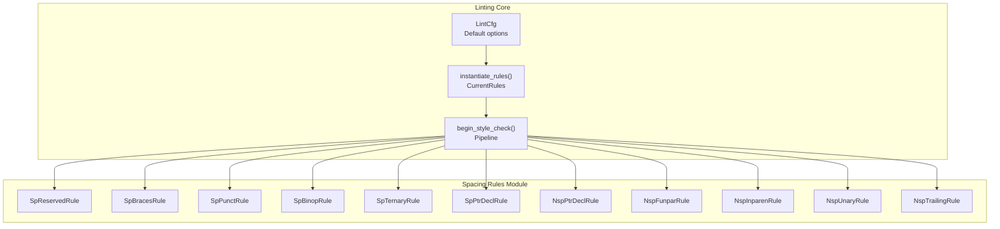
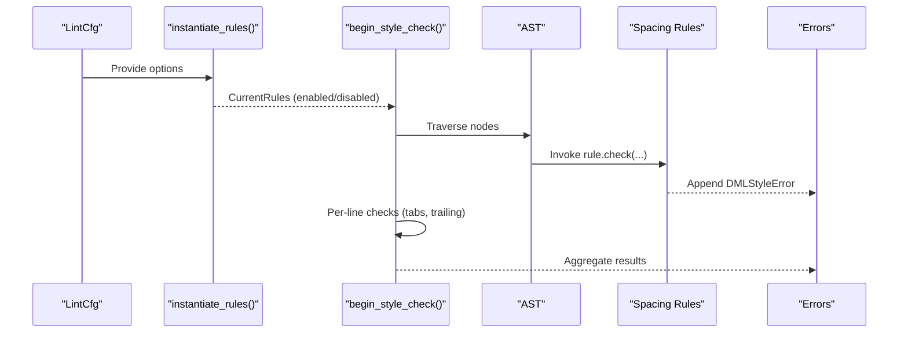
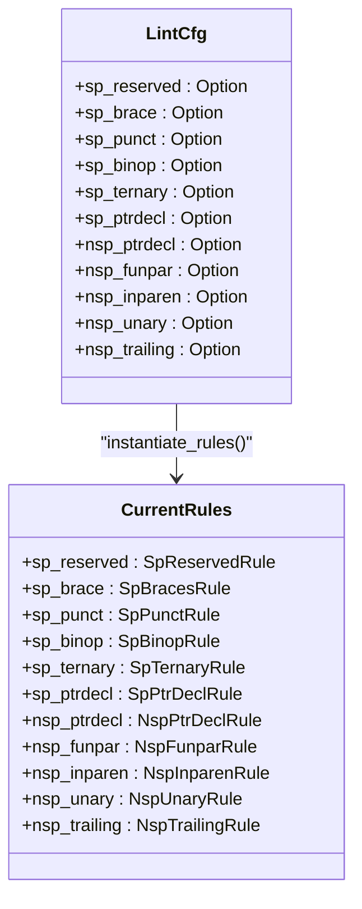

# Spacing Rules

<cite>
**Referenced Files in This Document**
- [spacing.rs](file://src/lint/rules/spacing.rs)
- [mod.rs](file://src/lint/mod.rs)
- [rules_mod.rs](file://src/lint/rules/mod.rs)
- [sp_reserved.rs](file://src/lint/rules/tests/spacing/sp_reserved.rs)
- [sp_braces.rs](file://src/lint/rules/tests/spacing/sp_braces.rs)
- [sp_punct.rs](file://src/lint/rules/tests/spacing/sp_punct.rs)
</cite>

## Table of Contents
1. [Introduction](#introduction)
2. [Project Structure](#project-structure)
3. [Core Components](#core-components)
4. [Architecture Overview](#architecture-overview)
5. [Detailed Component Analysis](#detailed-component-analysis)
6. [Dependency Analysis](#dependency-analysis)
7. [Performance Considerations](#performance-considerations)
8. [Troubleshooting Guide](#troubleshooting-guide)
9. [Conclusion](#conclusion)

## Introduction
This document describes the spacing rules subsystem of the DML language server linting framework. It covers all spacing-related rules, including sp_reserved, sp_brace, sp_punct, sp_binop, sp_ternary, sp_ptrdecl, nsp_ptrdecl, nsp_funpar, nsp_inparen, nsp_unary, and nsp_trailing. For each rule, we explain purpose, implementation, parameter configurations, validation logic, defaults, customization, and integration with the broader linting system. Practical examples, test case demonstrations, and performance considerations are included.

## Project Structure
The spacing rules are implemented in a dedicated module and integrated into the global linting pipeline. The key files are:
- Rule definitions and logic: src/lint/rules/spacing.rs
- Global rule instantiation and configuration: src/lint/mod.rs
- Rule registry and rule type mapping: src/lint/rules/mod.rs
- Test coverage for selected spacing rules: src/lint/rules/tests/spacing/*.rs

**Diagram sources**
- [mod.rs](file://src/lint/mod.rs#L62-L88)
- [rules_mod.rs](file://src/lint/rules/mod.rs#L36-L60)
- [spacing.rs](file://src/lint/rules/spacing.rs#L26-L893)

**Section sources**
- [spacing.rs](file://src/lint/rules/spacing.rs#L1-L893)
- [mod.rs](file://src/lint/mod.rs#L1-L622)
- [rules_mod.rs](file://src/lint/rules/mod.rs#L1-L171)

## Core Components
This section summarizes each spacing rule’s purpose, configuration, and behavior.

- sp_reserved
  - Purpose: Enforce spaces around reserved keywords (e.g., if, else, for, while).
  - Options: SpReservedOptions (no parameters).
  - Default: Enabled.
  - Validation: Checks gaps between reserved keyword tokens and surrounding constructs; reports missing space ranges.

- sp_brace
  - Purpose: Enforce spaces around braces { and }.
  - Options: SpBraceOptions (no parameters).
  - Default: Enabled.
  - Validation: Checks gaps between opening/closing brace tokens and the first/last items inside the block.

- sp_punct
  - Purpose: Enforce spaces after punctuation marks (commas, semicolons, colons in ternary).
  - Options: SpPunctOptions (no parameters).
  - Default: Enabled.
  - Validation: Iterates argument/punctuation pairs and checks missing spaces before/after punctuation.

- sp_binop
  - Purpose: Enforce spaces around binary operators.
  - Options: SpBinopOptions (no parameters).
  - Default: Enabled.
  - Validation: Checks gaps around operator tokens between left/right operands.

- sp_ternary
  - Purpose: Enforce spaces around ? and : in ternary expressions.
  - Options: SpTernaryOptions (no parameters).
  - Default: Enabled.
  - Validation: Checks gaps around both left and right operators in ternary expressions.

- sp_ptrdecl
  - Purpose: Enforce a space between the base type and the * operator in pointer declarations.
  - Options: SpPtrDeclOptions (no parameters).
  - Default: Enabled.
  - Validation: Ensures at least one space exists between the type name and the first * operator.

- nsp_ptrdecl
  - Purpose: Enforce no space after the * operator closest to the identifier in a pointer declaration.
  - Options: NspPtrDeclOptions (no parameters).
  - Default: Enabled.
  - Validation: Checks the rightmost * and the identifier; flags space between them.

- nsp_funpar
  - Purpose: Enforce no space between a method/function name and its opening parenthesis.
  - Options: NspFunparOptions (no parameters).
  - Default: Enabled.
  - Validation: Detects a gap between the function/method name and the following (.

- nsp_inparen
  - Purpose: Enforce no space immediately after an opening delimiter ((), []) and no space immediately before a closing delimiter.
  - Options: NspInparenOptions (no parameters).
  - Default: Enabled.
  - Validation: Checks gaps between opening delimiter and first content, and between last content and closing delimiter.

- nsp_unary
  - Purpose: Enforce no space between unary operators and their operand.
  - Options: NspUnaryOptions (no parameters).
  - Default: Enabled.
  - Validation: Detects a gap between operator and operand; allows a special case for a defined keyword.

- nsp_trailing
  - Purpose: Detect trailing whitespace on a line.
  - Options: NspTrailingOptions (no parameters).
  - Default: Enabled.
  - Validation: Compares trimmed length to total length per line.

**Section sources**
- [spacing.rs](file://src/lint/rules/spacing.rs#L26-L893)
- [mod.rs](file://src/lint/mod.rs#L80-L184)

## Architecture Overview
The spacing rules are part of the CurrentRules collection instantiated from LintCfg. The linting pipeline traverses the AST, invokes rule checks, and aggregates errors. Line-scoped checks (e.g., trailing whitespace) are applied per line.

**Diagram sources**
- [mod.rs](file://src/lint/mod.rs#L62-L88)
- [mod.rs](file://src/lint/mod.rs#L245-L265)

**Section sources**
- [mod.rs](file://src/lint/mod.rs#L245-L265)
- [rules_mod.rs](file://src/lint/rules/mod.rs#L36-L60)

## Detailed Component Analysis

### SpReservedRule (sp_reserved)
- Purpose: Ensure spaces around reserved words like if, else, for, while.
- Implementation highlights:
  - Extracts argument sets for if/else, for, while, and after statements.
  - Validates gaps between reserved keyword tokens and adjacent constructs.
- Parameter configuration: SpReservedOptions (empty).
- Default: Enabled via LintCfg default.
- Example violations and fixes:
  - Violation: if(this_some_integer == 0x666) → Fix: if (this_some_integer == 0x666)
  - Violation: for(local uint16 i = 0; ...) → Fix: for (local uint16 i = 0; ...)
  - Violation: else{ → Fix: else {
- Integration: Instantiated from LintCfg.sp_reserved; disabled when option is None.

**Section sources**
- [spacing.rs](file://src/lint/rules/spacing.rs#L29-L130)
- [sp_reserved.rs](file://src/lint/rules/tests/spacing/sp_reserved.rs#L6-L156)

### SpBracesRule (sp_brace)
- Purpose: Ensure spaces around braces { and }.
- Implementation highlights:
  - Builds arguments from compound statements, object statements, struct types, layouts, and bitfields.
  - Validates gaps between braces and first/last items inside the block.
- Parameter configuration: SpBraceOptions (empty).
- Default: Enabled via LintCfg default.
- Example violations and fixes:
  - Violation: method() {return 0;} → Fix: method() { return 0; }
  - Violation: typedef struct {uint16 idx;} → Fix: typedef struct { uint16 idx; }

**Section sources**
- [spacing.rs](file://src/lint/rules/spacing.rs#L135-L241)
- [sp_braces.rs](file://src/lint/rules/tests/spacing/sp_braces.rs#L6-L97)

### SpPunctRule (sp_punct)
- Purpose: Ensure spaces after punctuation marks (commas, semicolons, colons in ternary).
- Implementation highlights:
  - Iterates argument lists and expressions with commas; validates gaps before and after punctuation.
- Parameter configuration: SpPunctOptions (empty).
- Default: Enabled via LintCfg default.
- Example violations and fixes:
  - Violation: bool flag ,int8 var → Fix: bool flag, int8 var
  - Violation: local int x = 0 ; → Fix: local int x = 0;

**Section sources**
- [spacing.rs](file://src/lint/rules/spacing.rs#L374-L516)
- [sp_punct.rs](file://src/lint/rules/tests/spacing/sp_punct.rs#L6-L49)

### SpBinopRule (sp_binop)
- Purpose: Ensure spaces around binary operators.
- Implementation highlights:
  - Extracts left operand, operator, and right operand ranges from binary expressions.
  - Validates gaps around the operator.
- Parameter configuration: SpBinopOptions (empty).
- Default: Enabled via LintCfg default.

**Section sources**
- [spacing.rs](file://src/lint/rules/spacing.rs#L246-L295)

### SpTernaryRule (sp_ternary)
- Purpose: Ensure spaces around ? and : in ternary expressions.
- Implementation highlights:
  - Extracts left/middle/right and both operators in a ternary expression.
  - Uses a helper to detect gaps between adjacent tokens.
- Parameter configuration: SpTernaryOptions (empty).
- Default: Enabled via LintCfg default.

**Section sources**
- [spacing.rs](file://src/lint/rules/spacing.rs#L300-L369)

### SpPtrDeclRule (sp_ptrdecl)
- Purpose: Ensure a space between the base type and the first * in pointer declarations.
- Implementation highlights:
  - Scans C-style declaration modifiers for multiply tokens and ensures spacing with the base type.
- Parameter configuration: SpPtrDeclOptions (empty).
- Default: Enabled via LintCfg default.

**Section sources**
- [spacing.rs](file://src/lint/rules/spacing.rs#L774-L840)

### NspPtrDeclRule (nsp_ptrdecl)
- Purpose: Ensure no space after the rightmost * and the identifier in pointer declarations.
- Implementation highlights:
  - Identifies the rightmost multiply operator and the identifier; flags space between them.
- Parameter configuration: NspPtrDeclOptions (empty).
- Default: Enabled via LintCfg default.

**Section sources**
- [spacing.rs](file://src/lint/rules/spacing.rs#L842-L892)

### NspFunparRule (nsp_funpar)
- Purpose: Ensure no space between a function/method name and its opening parenthesis.
- Implementation highlights:
  - Computes the gap between the name and the following (.
- Parameter configuration: NspFunparOptions (empty).
- Default: Enabled via LintCfg default.

**Section sources**
- [spacing.rs](file://src/lint/rules/spacing.rs#L518-L571)

### NspInparenRule (nsp_inparen)
- Purpose: Ensure no space immediately after an opening delimiter ((), []) and no space immediately before a closing delimiter.
- Implementation highlights:
  - Validates gaps between opening delimiter and first content, and between last content and closing delimiter.
- Parameter configuration: NspInparenOptions (empty).
- Default: Enabled via LintCfg default.

**Section sources**
- [spacing.rs](file://src/lint/rules/spacing.rs#L573-L675)

### NspUnaryRule (nsp_unary)
- Purpose: Ensure no space between unary operators and their operand.
- Implementation highlights:
  - Special-case handling for a defined keyword; otherwise enforces no gap.
- Parameter configuration: NspUnaryOptions (empty).
- Default: Enabled via LintCfg default.

**Section sources**
- [spacing.rs](file://src/lint/rules/spacing.rs#L677-L738)

### NspTrailingRule (nsp_trailing)
- Purpose: Detect trailing whitespace on a line.
- Implementation highlights:
  - Compares trimmed length to total length per line and reports the trailing range.
- Parameter configuration: NspTrailingOptions (empty).
- Default: Enabled via LintCfg default.

**Section sources**
- [spacing.rs](file://src/lint/rules/spacing.rs#L740-L772)

## Dependency Analysis
The spacing rules are registered and instantiated centrally. The CurrentRules struct holds all rule instances, enabling or disabling them based on LintCfg options. The linting pipeline invokes rule checks during AST traversal and applies per-line checks afterward.

**Diagram sources**
- [mod.rs](file://src/lint/mod.rs#L80-L184)
- [rules_mod.rs](file://src/lint/rules/mod.rs#L36-L60)

**Section sources**
- [rules_mod.rs](file://src/lint/rules/mod.rs#L10-L60)
- [mod.rs](file://src/lint/mod.rs#L62-L88)

## Performance Considerations
- Rule activation: Each rule is enabled only when its corresponding LintCfg option is present. Disabling unused rules reduces overhead.
- Linear scans: Many rules scan sequences (e.g., argument lists) with O(n) complexity; keep argument lists short to minimize checks.
- Gap detection: Most validations rely on comparing token positions (rows/columns). These are constant-time comparisons per pair.
- Pipeline stages: The linting pipeline performs AST traversal followed by per-line checks. Limiting unnecessary rule checks improves throughput.

[No sources needed since this section provides general guidance]

## Troubleshooting Guide
- Rule not triggering:
  - Verify the rule’s option is present in LintCfg (e.g., sp_brace). If None, the rule is disabled.
  - Confirm the code pattern matches the rule’s scope (e.g., sp_punct applies to comma-separated argument lists).
- False positives:
  - For nsp_unary, a defined keyword is intentionally exempted. Adjust expectations accordingly.
  - For nsp_inparen, empty parentheses/brackets are handled specially; ensure content exists if spacing is expected.
- Test-driven validation:
  - Use the provided test cases as references for expected ranges and behaviors. Disable a rule temporarily to isolate issues.

**Section sources**
- [mod.rs](file://src/lint/mod.rs#L62-L88)
- [spacing.rs](file://src/lint/rules/spacing.rs#L687-L715)
- [sp_reserved.rs](file://src/lint/rules/tests/spacing/sp_reserved.rs#L21-L36)
- [sp_braces.rs](file://src/lint/rules/tests/spacing/sp_braces.rs#L22-L38)
- [sp_punct.rs](file://src/lint/rules/tests/spacing/sp_punct.rs#L15-L34)

## Conclusion
The spacing rules subsystem provides comprehensive enforcement of spacing conventions across reserved words, braces, punctuation, operators, pointer declarations, unary operators, parentheses/brackets, and trailing whitespace. Each rule is configurable via LintCfg, defaults to enabled, and integrates seamlessly into the linting pipeline. The provided tests demonstrate typical violations and their fixes, aiding adoption and maintenance.