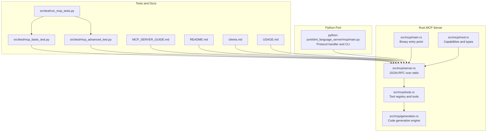
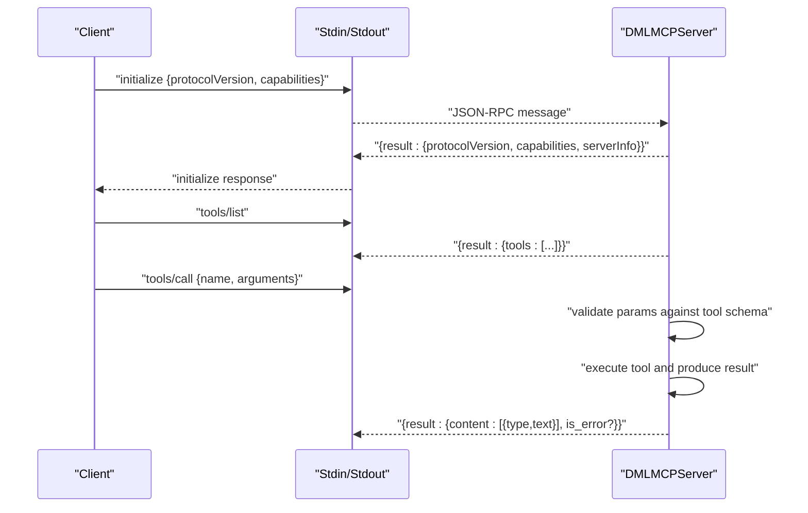
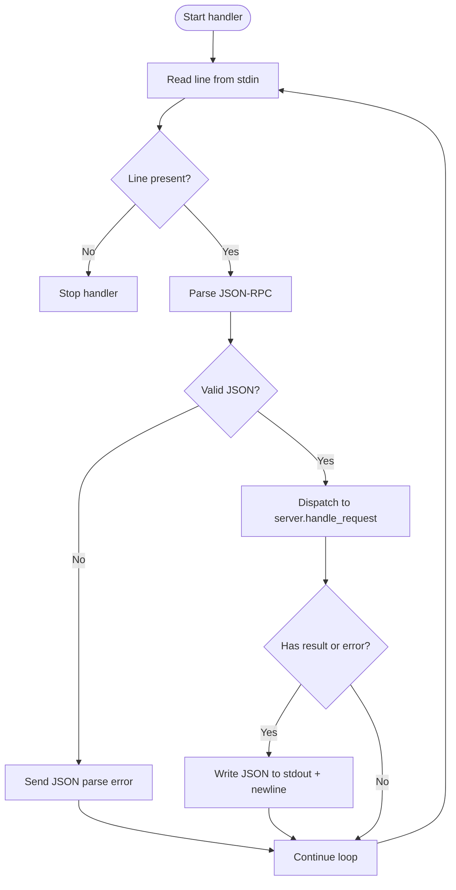
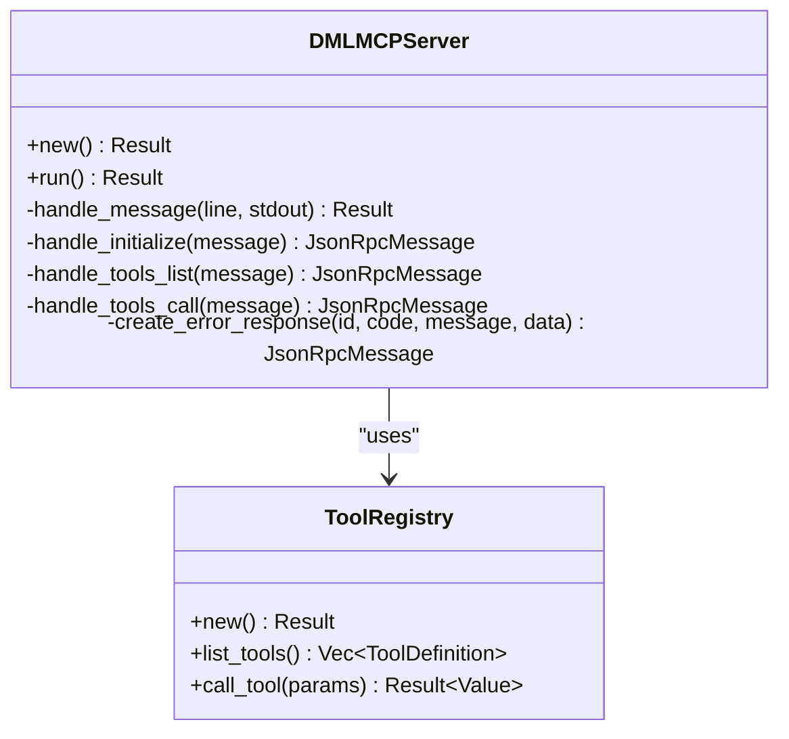
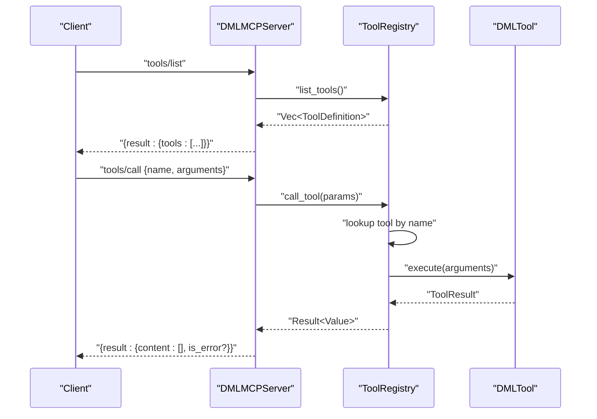
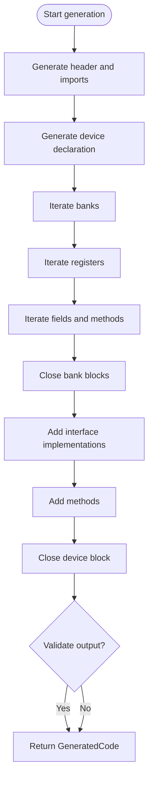
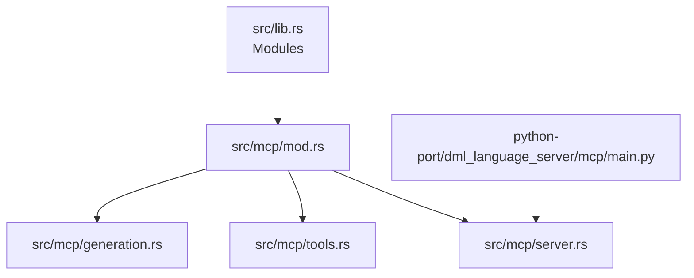

# Client Integration Guide

<cite>
**Referenced Files in This Document**
- [MCP_SERVER_GUIDE.md](file://MCP_SERVER_GUIDE.md)
- [README.md](file://README.md)
- [clients.md](file://clients.md)
- [USAGE.md](file://USAGE.md)
- [src/lib.rs](file://src/lib.rs)
- [src/mcp/mod.rs](file://src/mcp/mod.rs)
- [src/mcp/main.rs](file://src/mcp/main.rs)
- [src/mcp/server.rs](file://src/mcp/server.rs)
- [src/mcp/tools.rs](file://src/mcp/tools.rs)
- [src/mcp/generation.rs](file://src/mcp/generation.rs)
- [src/config.rs](file://src/config.rs)
- [python-port/dml_language_server/mcp/main.py](file://python-port/dml_language_server/mcp/main.py)
- [python-port/dml_language_server/__init__.py](file://python-port/dml_language_server/__init__.py)
- [src/test/mcp_basic_test.py](file://src/test/mcp_basic_test.py)
- [src/test/mcp_advanced_test.py](file://src/test/mcp_advanced_test.py)
- [src/test/run_mcp_tests.py](file://src/test/run_mcp_tests.py)
</cite>

## Table of Contents
1. [Introduction](#introduction)
2. [Project Structure](#project-structure)
3. [Core Components](#core-components)
4. [Architecture Overview](#architecture-overview)
5. [Detailed Component Analysis](#detailed-component-analysis)
6. [Dependency Analysis](#dependency-analysis)
7. [Performance Considerations](#performance-considerations)
8. [Troubleshooting Guide](#troubleshooting-guide)
9. [Conclusion](#conclusion)
10. [Appendices](#appendices)

## Introduction
This guide explains how to integrate the DML MCP server as a client-facing service for AI assistants and development tools. It documents the client-side implementation patterns, tool discovery mechanisms, and workflow integration approaches. You will learn how to discover and call MCP tools, configure tool parameters, handle generation results, and manage client-server communication. The guide also covers authentication considerations, error propagation, debugging techniques, and performance optimization for MCP-based integrations.

## Project Structure
The MCP server is implemented in Rust and exposes a JSON-RPC over stdio protocol compliant with the Model Context Protocol specification. The Python port provides an MCP server entry point for environments requiring Python-based orchestration. The repository includes comprehensive tests and integration examples.

**Diagram sources**
- [src/mcp/main.rs](file://src/mcp/main.rs#L1-L23)
- [src/mcp/server.rs](file://src/mcp/server.rs#L1-L229)
- [src/mcp/tools.rs](file://src/mcp/tools.rs#L1-L399)
- [src/mcp/generation.rs](file://src/mcp/generation.rs#L1-L411)
- [src/mcp/mod.rs](file://src/mcp/mod.rs#L1-L54)
- [python-port/dml_language_server/mcp/main.py](file://python-port/dml_language_server/mcp/main.py#L1-L166)
- [src/test/mcp_basic_test.py](file://src/test/mcp_basic_test.py#L1-L134)
- [src/test/mcp_advanced_test.py](file://src/test/mcp_advanced_test.py#L1-L184)
- [src/test/run_mcp_tests.py](file://src/test/run_mcp_tests.py#L1-L104)
- [MCP_SERVER_GUIDE.md](file://MCP_SERVER_GUIDE.md#L1-L280)
- [README.md](file://README.md#L1-L57)
- [clients.md](file://clients.md#L1-L191)
- [USAGE.md](file://USAGE.md#L1-L120)

**Section sources**
- [src/lib.rs](file://src/lib.rs#L1-L56)
- [MCP_SERVER_GUIDE.md](file://MCP_SERVER_GUIDE.md#L108-L118)
- [README.md](file://README.md#L22-L34)

## Core Components
- MCP Server (Rust): Implements JSON-RPC over stdio, handles initialization, tool discovery, and tool execution. See [DMLMCPServer](file://src/mcp/server.rs#L36-L55) and [methods](file://src/mcp/server.rs#L88-L229).
- Tool Registry: Manages built-in tools and their JSON schemas. See [ToolRegistry](file://src/mcp/tools.rs#L46-L121) and [built-in tools](file://src/mcp/tools.rs#L66-L81).
- Code Generation Engine: Produces DML code from structured specifications. See [DMLGenerator](file://src/mcp/generation.rs#L52-L111) and [GenerationConfig](file://src/mcp/generation.rs#L18-L50).
- Python Protocol Handler: Bridges MCP protocol over stdio for Python environments. See [MCPProtocolHandler](file://python-port/dml_language_server/mcp/main.py#L22-L96).

Key capabilities and server info are defined in [mod.rs](file://src/mcp/mod.rs#L17-L54).

**Section sources**
- [src/mcp/server.rs](file://src/mcp/server.rs#L36-L229)
- [src/mcp/tools.rs](file://src/mcp/tools.rs#L46-L121)
- [src/mcp/generation.rs](file://src/mcp/generation.rs#L52-L111)
- [src/mcp/mod.rs](file://src/mcp/mod.rs#L17-L54)
- [python-port/dml_language_server/mcp/main.py](file://python-port/dml_language_server/mcp/main.py#L22-L96)

## Architecture Overview
The MCP server communicates over stdin/stdout using JSON-RPC 2.0. Clients initialize the server, discover tools, and call tools with structured arguments. The server validates parameters against tool schemas and returns standardized results.

**Diagram sources**
- [src/mcp/server.rs](file://src/mcp/server.rs#L88-L206)
- [src/mcp/tools.rs](file://src/mcp/tools.rs#L90-L121)

**Section sources**
- [src/mcp/server.rs](file://src/mcp/server.rs#L88-L206)
- [MCP_SERVER_GUIDE.md](file://MCP_SERVER_GUIDE.md#L108-L143)

## Detailed Component Analysis

### MCP Protocol Handler (Python)
The Python handler reads lines from stdin, parses JSON-RPC, delegates to the server, and writes responses to stdout. It includes robust error handling for malformed JSON and runtime exceptions.

**Diagram sources**
- [python-port/dml_language_server/mcp/main.py](file://python-port/dml_language_server/mcp/main.py#L29-L96)

**Section sources**
- [python-port/dml_language_server/mcp/main.py](file://python-port/dml_language_server/mcp/main.py#L22-L96)

### DMLMCPServer (Rust)
Implements the MCP JSON-RPC endpoint with methods for initialization, tool listing, and tool execution. It constructs proper JSON-RPC responses and handles errors with standardized codes.

**Diagram sources**
- [src/mcp/server.rs](file://src/mcp/server.rs#L36-L229)
- [src/mcp/tools.rs](file://src/mcp/tools.rs#L46-L121)

**Section sources**
- [src/mcp/server.rs](file://src/mcp/server.rs#L36-L229)
- [src/mcp/tools.rs](file://src/mcp/tools.rs#L46-L121)

### Tool Discovery and Execution
Tools are registered dynamically and exposed via a discovery list. Each tool defines a JSON schema for input validation. Execution routes arguments to the appropriate tool implementation.

**Diagram sources**
- [src/mcp/server.rs](file://src/mcp/server.rs#L104-L206)
- [src/mcp/tools.rs](file://src/mcp/tools.rs#L90-L121)

**Section sources**
- [src/mcp/tools.rs](file://src/mcp/tools.rs#L90-L121)
- [src/mcp/server.rs](file://src/mcp/server.rs#L104-L206)

### Code Generation Engine
The generation engine transforms structured specifications into formatted DML code. It supports configurable indentation, line endings, documentation generation, and optional validation.

**Diagram sources**
- [src/mcp/generation.rs](file://src/mcp/generation.rs#L58-L111)

**Section sources**
- [src/mcp/generation.rs](file://src/mcp/generation.rs#L52-L111)

## Dependency Analysis
The MCP server module composes several subsystems: server, tools, generation, and templates. The Rust binary initializes logging and runs the server. The Python port provides an alternate entry point for stdio-based MCP servers.

**Diagram sources**
- [src/lib.rs](file://src/lib.rs#L31-L49)
- [src/mcp/mod.rs](file://src/mcp/mod.rs#L1-L15)
- [src/mcp/server.rs](file://src/mcp/server.rs#L1-L20)
- [src/mcp/tools.rs](file://src/mcp/tools.rs#L1-L12)
- [src/mcp/generation.rs](file://src/mcp/generation.rs#L1-L12)
- [python-port/dml_language_server/mcp/main.py](file://python-port/dml_language_server/mcp/main.py#L1-L20)

**Section sources**
- [src/lib.rs](file://src/lib.rs#L31-L49)
- [src/mcp/mod.rs](file://src/mcp/mod.rs#L1-L15)

## Performance Considerations
- Asynchronous I/O: The Rust server uses async/await with Tokio for non-blocking stdio handling. See [server.rs](file://src/mcp/server.rs#L57-L86).
- Minimal overhead: Tools are lightweight and return structured content; avoid unnecessary serialization costs.
- Logging: Use appropriate log levels to minimize I/O overhead during normal operation. See [main.rs](file://src/mcp/main.rs#L11-L22) and [python main](file://python-port/dml_language_server/mcp/main.py#L122-L138).
- Validation toggle: Generation validation can be disabled to reduce latency when not required. See [GenerationConfig](file://src/mcp/generation.rs#L18-L50).

[No sources needed since this section provides general guidance]

## Troubleshooting Guide
Common issues and resolutions:
- Initialization failures: Verify protocol version and capabilities in the initialize request. See [handle_initialize](file://src/mcp/server.rs#L134-L152).
- Unknown method errors: Ensure the client sends supported methods. See [handle_message](file://src/mcp/server.rs#L104-L122).
- Tool execution errors: Confirm tool name and arguments conform to the tool’s JSON schema. See [call_tool](file://src/mcp/tools.rs#L101-L121).
- JSON parse errors: Validate client JSON-RPC formatting. See [parse error handling](file://python-port/dml_language_server/mcp/main.py#L74-L87).
- Test harness: Use the provided Python test scripts to validate end-to-end behavior. See [basic test](file://src/test/mcp_basic_test.py#L37-L131) and [advanced test](file://src/test/mcp_advanced_test.py#L33-L181).

**Section sources**
- [src/mcp/server.rs](file://src/mcp/server.rs#L104-L152)
- [src/mcp/tools.rs](file://src/mcp/tools.rs#L101-L121)
- [python-port/dml_language_server/mcp/main.py](file://python-port/dml_language_server/mcp/main.py#L74-L87)
- [src/test/mcp_basic_test.py](file://src/test/mcp_basic_test.py#L37-L131)
- [src/test/mcp_advanced_test.py](file://src/test/mcp_advanced_test.py#L33-L181)

## Conclusion
The DML MCP server provides a standards-compliant, extensible foundation for integrating AI-assisted code generation into development workflows. Clients can discover tools, pass validated parameters, and receive structured generation results. The implementation emphasizes reliability, configurability, and performance, with comprehensive tests and documentation to support integration across diverse environments.

[No sources needed since this section summarizes without analyzing specific files]

## Appendices

### Client-Side Implementation Patterns
- Initialize the server with the required protocol version and capabilities. See [MCP_SERVER_GUIDE.md](file://MCP_SERVER_GUIDE.md#L7-L20).
- Discover tools via tools/list and cache the tool definitions and schemas. See [handle_tools_list](file://src/mcp/server.rs#L154-L171).
- Call tools with name and arguments; validate arguments against the tool’s input schema. See [handle_tools_call](file://src/mcp/server.rs#L173-L206) and [ToolDefinition](file://src/mcp/tools.rs#L27-L34).
- Handle results with content arrays and optional error flags. See [ToolResult](file://src/mcp/tools.rs#L12-L18).

**Section sources**
- [MCP_SERVER_GUIDE.md](file://MCP_SERVER_GUIDE.md#L7-L20)
- [src/mcp/server.rs](file://src/mcp/server.rs#L154-L206)
- [src/mcp/tools.rs](file://src/mcp/tools.rs#L12-L34)

### Workflow Integration Approaches
- AI Assistants: Use tools/call to generate device/register code based on natural language prompts. See [generate_device](file://src/mcp/tools.rs#L125-L203) and [generate_register](file://src/mcp/tools.rs#L205-L280).
- IDEs and Editors: Implement MCP client extensions or integrate via external process control. See [clients.md](file://clients.md#L1-L191).
- CI/CD Pipelines: Automate device model generation using the MCP server binary. See [MCP_SERVER_GUIDE.md](file://MCP_SERVER_GUIDE.md#L22-L33).

**Section sources**
- [src/mcp/tools.rs](file://src/mcp/tools.rs#L125-L280)
- [clients.md](file://clients.md#L1-L191)
- [MCP_SERVER_GUIDE.md](file://MCP_SERVER_GUIDE.md#L22-L33)

### Security Considerations
- Authentication: The MCP server does not implement authentication by default. Run the server in trusted environments or behind secure gateways. See [server.rs](file://src/mcp/server.rs#L57-L86).
- Sandboxing: Restrict server execution to controlled directories and limit file system access.
- Input validation: Tools enforce schema-based validation; avoid passing untrusted tool names or arguments.

**Section sources**
- [src/mcp/server.rs](file://src/mcp/server.rs#L57-L86)

### Rate Limiting and Concurrency
- The server processes one request at a time from stdio. For high-throughput scenarios, deploy multiple server instances or use asynchronous clients. See [server.rs](file://src/mcp/server.rs#L66-L83).
- Configure logging levels to reduce overhead under load. See [main.rs](file://src/mcp/main.rs#L11-L22).

**Section sources**
- [src/mcp/server.rs](file://src/mcp/server.rs#L66-L83)
- [src/mcp/main.rs](file://src/mcp/main.rs#L11-L22)

### Debugging Techniques
- Enable verbose logging for the Rust server and Python handler. See [main.rs](file://src/mcp/main.rs#L11-L22) and [python main](file://python-port/dml_language_server/mcp/main.py#L122-L138).
- Use the provided test scripts to simulate client interactions and verify behavior. See [run_mcp_tests.py](file://src/test/run_mcp_tests.py#L37-L104), [mcp_basic_test.py](file://src/test/mcp_basic_test.py#L37-L131), and [mcp_advanced_test.py](file://src/test/mcp_advanced_test.py#L33-L181).
- Validate MCP compliance using the interactive examples in the server guide. See [MCP_SERVER_GUIDE.md](file://MCP_SERVER_GUIDE.md#L163-L171).

**Section sources**
- [src/mcp/main.rs](file://src/mcp/main.rs#L11-L22)
- [python-port/dml_language_server/mcp/main.py](file://python-port/dml_language_server/mcp/main.py#L122-L138)
- [src/test/run_mcp_tests.py](file://src/test/run_mcp_tests.py#L37-L104)
- [src/test/mcp_basic_test.py](file://src/test/mcp_basic_test.py#L37-L131)
- [src/test/mcp_advanced_test.py](file://src/test/mcp_advanced_test.py#L33-L181)
- [MCP_SERVER_GUIDE.md](file://MCP_SERVER_GUIDE.md#L163-L171)