# Code Generation Tools

<cite>
**Referenced Files in This Document**
- [Cargo.toml](file://Cargo.toml)
- [README.md](file://README.md)
- [MCP_SERVER_GUIDE.md](file://MCP_SERVER_GUIDE.md)
- [src/mcp/mod.rs](file://src/mcp/mod.rs)
- [src/mcp/main.rs](file://src/mcp/main.rs)
- [src/mcp/server.rs](file://src/mcp/server.rs)
- [src/mcp/tools.rs](file://src/mcp/tools.rs)
- [src/mcp/generation.rs](file://src/mcp/generation.rs)
- [src/mcp/templates.rs](file://src/mcp/templates.rs)
- [src/test/mcp_basic_test.py](file://src/test/mcp_basic_test.py)
- [src/test/mcp_advanced_test.py](file://src/test/mcp_advanced_test.py)
- [src/test/mcp_unit_tests.rs](file://src/test/mcp_unit_tests.rs)
- [src/test/run_mcp_tests.py](file://src/test/run_mcp_tests.py)
</cite>

## Table of Contents
1. [Introduction](#introduction)
2. [Project Structure](#project-structure)
3. [Core Components](#core-components)
4. [Architecture Overview](#architecture-overview)
5. [Detailed Component Analysis](#detailed-component-analysis)
6. [Dependency Analysis](#dependency-analysis)
7. [Performance Considerations](#performance-considerations)
8. [Troubleshooting Guide](#troubleshooting-guide)
9. [Conclusion](#conclusion)
10. [Appendices](#appendices)

## Introduction
This document explains the MCP code generation tools within the DML language server. It covers the tool registration system, tool lifecycle management, and custom tool development. It also details device generation capabilities, register generation processes, and method generation workflows. The template system integration, code generation strategies, and output formatting options are documented alongside examples of tool configuration, generation parameters, and result processing. Tool validation, error handling during generation, and integration with the DML analysis pipeline are addressed, along with best practices for tool development and performance optimization.

## Project Structure
The MCP code generation tools live under the src/mcp/ module and integrate with the broader DML language server. The key files are:
- Entry point and binary: src/mcp/main.rs
- MCP protocol server: src/mcp/server.rs
- Tool registry and built-in tools: src/mcp/tools.rs
- Code generation engine: src/mcp/generation.rs
- Template library: src/mcp/templates.rs
- Module exports and constants: src/mcp/mod.rs
- Tests and examples: src/test/* (Python integration tests and Rust unit tests)

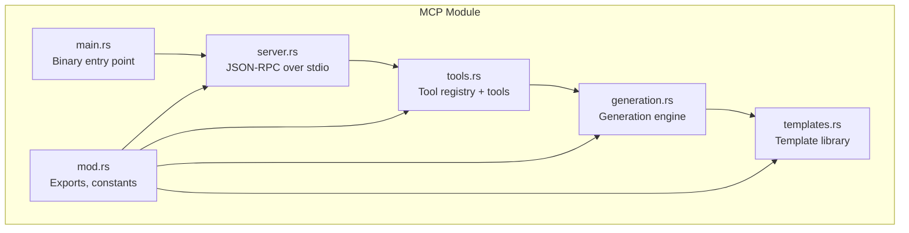

**Diagram sources**
- [src/mcp/mod.rs](file://src/mcp/mod.rs#L1-L54)
- [src/mcp/main.rs](file://src/mcp/main.rs#L1-L23)
- [src/mcp/server.rs](file://src/mcp/server.rs#L1-L229)
- [src/mcp/tools.rs](file://src/mcp/tools.rs#L1-L399)
- [src/mcp/generation.rs](file://src/mcp/generation.rs#L1-L411)
- [src/mcp/templates.rs](file://src/mcp/templates.rs#L1-L428)

**Section sources**
- [Cargo.toml](file://Cargo.toml#L18-L31)
- [README.md](file://README.md#L1-L57)
- [MCP_SERVER_GUIDE.md](file://MCP_SERVER_GUIDE.md#L1-L280)

## Core Components
- MCP Server: Implements JSON-RPC over stdio, handles initialize, tools/list, and tools/call methods, and routes tool execution to the registry.
- Tool Registry: Manages tool registration, discovery, and execution. Provides tool definitions with JSON schemas and executes tools asynchronously.
- Built-in Tools: Device generation, register generation, method generation placeholder, project analysis, code validation, template generation, and pattern application.
- Generation Engine: Produces DML code from structured specs, applies formatting and documentation, and optionally validates output.
- Template Library: Provides pre-defined device templates and patterns (e.g., memory-mapped devices, interrupt controllers, CPUs, memories, bus interfaces).

**Section sources**
- [src/mcp/server.rs](file://src/mcp/server.rs#L36-L229)
- [src/mcp/tools.rs](file://src/mcp/tools.rs#L45-L121)
- [src/mcp/generation.rs](file://src/mcp/generation.rs#L52-L310)
- [src/mcp/templates.rs](file://src/mcp/templates.rs#L8-L359)

## Architecture Overview
The MCP server runs as a standalone binary communicating over stdin/stdout using JSON-RPC 2.0. Clients call tools via tools/call with a name and arguments. The server delegates to the ToolRegistry, which executes the tool and returns a ToolResult containing content and optional error flag.

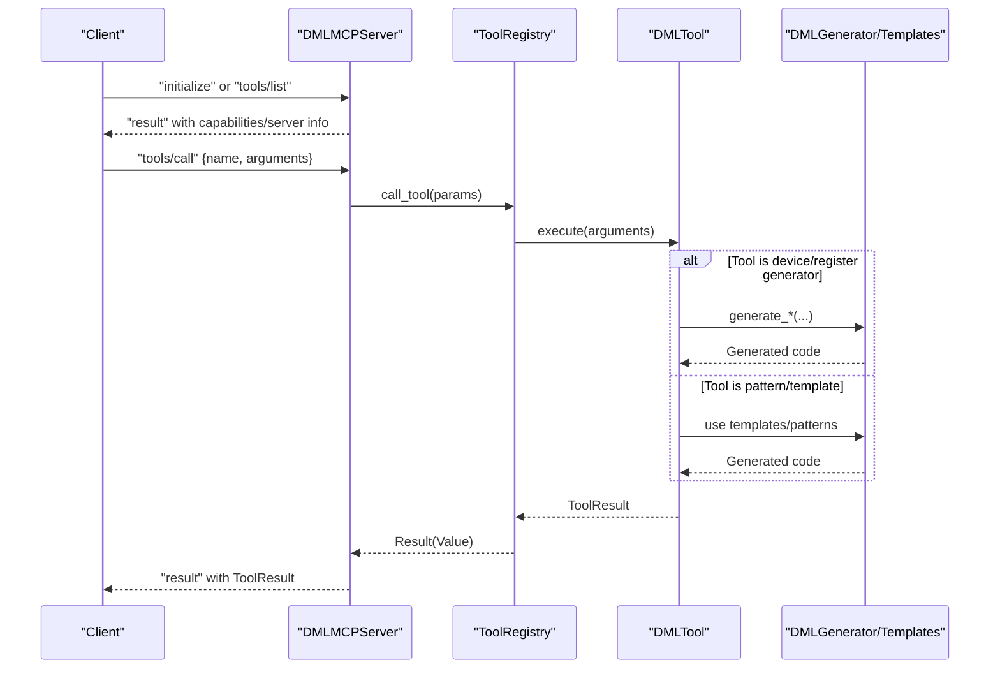

**Diagram sources**
- [src/mcp/server.rs](file://src/mcp/server.rs#L88-L206)
- [src/mcp/tools.rs](file://src/mcp/tools.rs#L101-L120)
- [src/mcp/generation.rs](file://src/mcp/generation.rs#L66-L111)
- [src/mcp/templates.rs](file://src/mcp/templates.rs#L327-L358)

## Detailed Component Analysis

### Tool Registration System
- ToolRegistry holds a HashMap of tool name to DMLTool trait object.
- New registry initializes Config, registers built-in tools, logs counts, and exposes list_tools and call_tool.
- Built-in tools registered include device generation, register generation, method generation placeholder, project analysis, code validation, template generation, and pattern application.

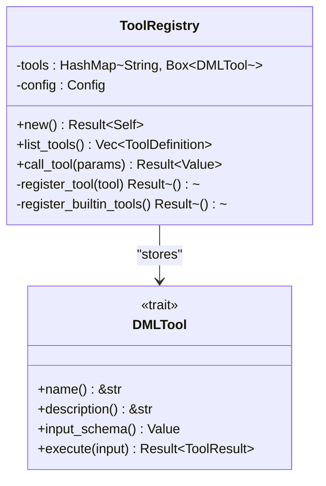

**Diagram sources**
- [src/mcp/tools.rs](file://src/mcp/tools.rs#L45-L121)

**Section sources**
- [src/mcp/tools.rs](file://src/mcp/tools.rs#L45-L121)

### Tool Lifecycle Management
- Creation: ToolRegistry::new loads defaults and registers built-ins.
- Discovery: list_tools returns ToolDefinition entries with name, description, and inputSchema.
- Execution: call_tool parses name and arguments, retrieves tool, executes, serializes result.
- Error handling: Missing name/arguments, unknown tool, and tool execution errors produce JSON-RPC error responses.

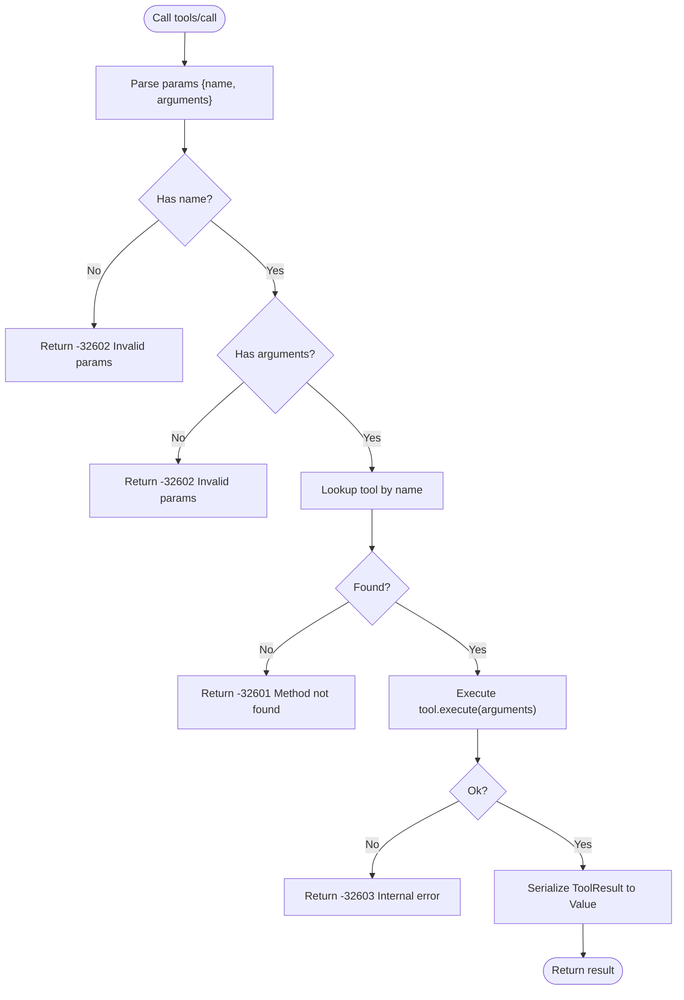

**Diagram sources**
- [src/mcp/server.rs](file://src/mcp/server.rs#L173-L206)
- [src/mcp/tools.rs](file://src/mcp/tools.rs#L101-L120)

**Section sources**
- [src/mcp/server.rs](file://src/mcp/server.rs#L88-L206)
- [src/mcp/tools.rs](file://src/mcp/tools.rs#L101-L120)

### Custom Tool Development
To add a new tool:
- Implement the DMLTool trait with name, description, input_schema, and execute.
- Optionally define a JSON schema for argument validation.
- Register the tool in register_builtin_tools or via a separate registration mechanism.
- Return a ToolResult with content and optional is_error flag.

Best practices:
- Keep input_schema minimal and explicit.
- Validate inputs early in execute.
- Use structured ToolContent with type=text for DML code.
- Log warnings for placeholders and future enhancements.

**Section sources**
- [src/mcp/tools.rs](file://src/mcp/tools.rs#L36-L43)
- [src/mcp/tools.rs](file://src/mcp/tools.rs#L66-L81)
- [src/mcp/tools.rs](file://src/mcp/tools.rs#L283-L318)

### Device Generation Capabilities
- GenerateDeviceTool produces a device with optional base template, registers, and interfaces.
- Input schema supports device_name, device_type, registers array, interfaces array, and template_base.
- Code generation composes device header, base template, register banks, and interface implementations.

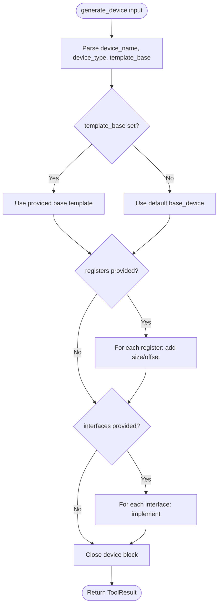

**Diagram sources**
- [src/mcp/tools.rs](file://src/mcp/tools.rs#L125-L203)
- [src/mcp/tools.rs](file://src/mcp/tools.rs#L328-L371)

**Section sources**
- [src/mcp/tools.rs](file://src/mcp/tools.rs#L125-L203)
- [src/mcp/tools.rs](file://src/mcp/tools.rs#L328-L371)

### Register Generation Processes
- GenerateRegisterTool creates a register with size, optional offset, documentation, and fields.
- Input schema supports name, size, offset, fields array, and documentation.
- Code generation adds optional documentation, register declaration, and field definitions with bits and access.

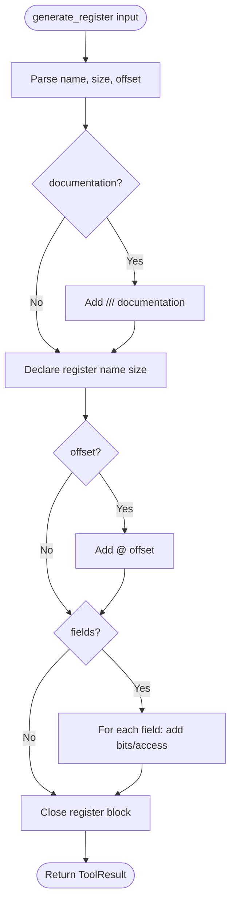

**Diagram sources**
- [src/mcp/tools.rs](file://src/mcp/tools.rs#L205-L280)
- [src/mcp/tools.rs](file://src/mcp/tools.rs#L373-L399)

**Section sources**
- [src/mcp/tools.rs](file://src/mcp/tools.rs#L205-L280)
- [src/mcp/tools.rs](file://src/mcp/tools.rs#L373-L399)

### Method Generation Workflows
- DMLGenerator.generate_method builds method signatures, parameters, return types, and bodies with configurable indentation and documentation.
- MethodSpec includes name, parameters, return_type, body, and documentation.
- Generation respects GenerationConfig for indentation style and line endings.

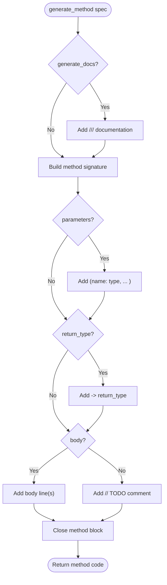

**Diagram sources**
- [src/mcp/generation.rs](file://src/mcp/generation.rs#L158-L204)

**Section sources**
- [src/mcp/generation.rs](file://src/mcp/generation.rs#L158-L204)
- [src/mcp/generation.rs](file://src/mcp/generation.rs#L398-L405)

### Template System Integration
- DMLTemplates provides pre-built DeviceSpec templates for common device types and patterns.
- Patterns include memory_mapped, interrupt_controller, cpu, memory, and bus_interface.
- Each pattern constructs DeviceSpec with banks, registers, fields, methods, and interfaces.

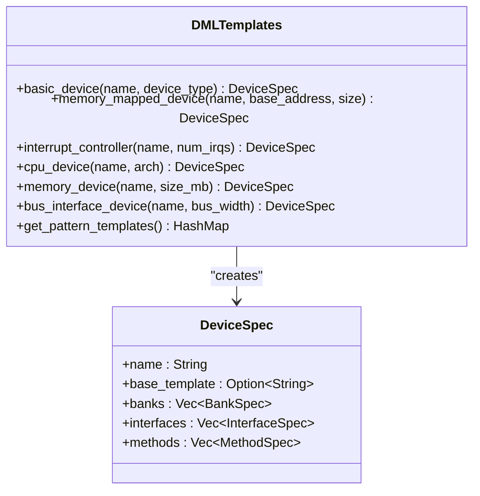

**Diagram sources**
- [src/mcp/templates.rs](file://src/mcp/templates.rs#L8-L359)

**Section sources**
- [src/mcp/templates.rs](file://src/mcp/templates.rs#L8-L359)

### Code Generation Strategies and Output Formatting
- GenerationConfig controls indentation style (spaces or tabs), line ending style, max line length, documentation generation, and output validation.
- DMLGenerator composes code from DeviceSpec/BankSpec/RegisterSpec/FieldSpec/MethodSpec with proper formatting and optional validation.
- Output is returned as ToolResult.content with type=text.

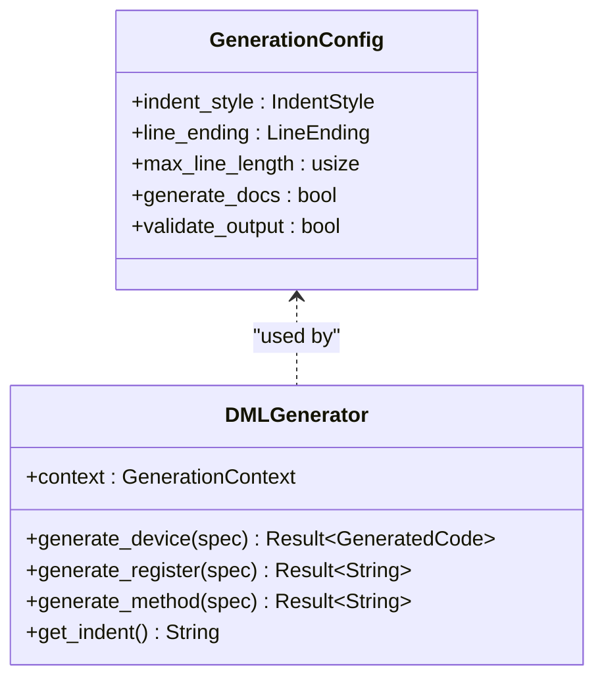

**Diagram sources**
- [src/mcp/generation.rs](file://src/mcp/generation.rs#L18-L50)
- [src/mcp/generation.rs](file://src/mcp/generation.rs#L52-L310)

**Section sources**
- [src/mcp/generation.rs](file://src/mcp/generation.rs#L18-L50)
- [src/mcp/generation.rs](file://src/mcp/generation.rs#L52-L310)

### Tool Validation and Error Handling
- Server-side error handling for JSON parsing, unknown methods, missing params, and tool execution failures.
- ToolResult supports an is_error flag for signaling non-fatal tool errors.
- Generation validation is present in the engine and can be integrated with the DML parser.

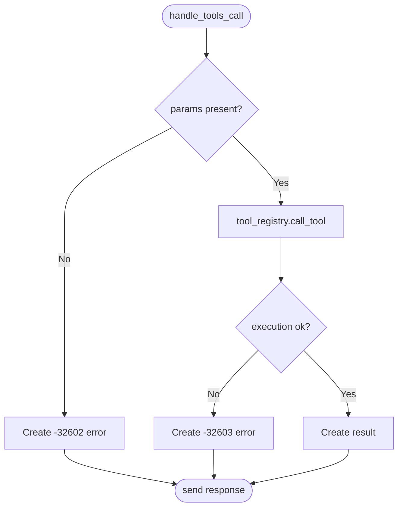

**Diagram sources**
- [src/mcp/server.rs](file://src/mcp/server.rs#L173-L206)

**Section sources**
- [src/mcp/server.rs](file://src/mcp/server.rs#L173-L206)
- [src/mcp/tools.rs](file://src/mcp/tools.rs#L12-L25)
- [src/mcp/generation.rs](file://src/mcp/generation.rs#L305-L310)

### Integration with DML Analysis Pipeline
- The MCP server reuses the DML language server’s analysis capabilities for code generation.
- Generation engine and templates leverage structured specs and formatting to produce valid DML 1.4 code.
- Future enhancements include deeper integration with the DML parser for validation.

**Section sources**
- [MCP_SERVER_GUIDE.md](file://MCP_SERVER_GUIDE.md#L108-L143)
- [src/mcp/generation.rs](file://src/mcp/generation.rs#L305-L310)

## Dependency Analysis
The MCP module depends on the DML language server’s core libraries and uses async I/O and JSON-RPC for communication.

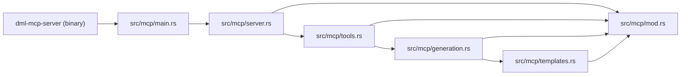

**Diagram sources**
- [Cargo.toml](file://Cargo.toml#L28-L31)
- [src/mcp/main.rs](file://src/mcp/main.rs#L6-L22)
- [src/mcp/server.rs](file://src/mcp/server.rs#L3-L11)
- [src/mcp/tools.rs](file://src/mcp/tools.rs#L1-L10)
- [src/mcp/generation.rs](file://src/mcp/generation.rs#L1-L8)
- [src/mcp/templates.rs](file://src/mcp/templates.rs#L1-L6)
- [src/mcp/mod.rs](file://src/mcp/mod.rs#L6-L14)

**Section sources**
- [Cargo.toml](file://Cargo.toml#L33-L62)
- [src/mcp/main.rs](file://src/mcp/main.rs#L6-L22)

## Performance Considerations
- Asynchronous I/O with Tokio ensures non-blocking operation over stdio.
- Built-in tools and generation engine are lightweight; avoid heavy computation in tool.execute.
- Prefer streaming or chunked generation for large outputs.
- Use GenerationConfig to tune formatting and reduce post-processing overhead.
- Validate output only when necessary to balance correctness and speed.

[No sources needed since this section provides general guidance]

## Troubleshooting Guide
Common issues and resolutions:
- JSON parsing errors: Verify messages conform to JSON-RPC 2.0 and include jsonrpc, method, id, and params/result/error fields.
- Unknown tool or missing name/arguments: Ensure tools/call includes a valid tool name and arguments matching the tool’s input schema.
- Tool execution failures: Check tool logs and return ToolResult with is_error set appropriately.
- EOF or read errors: Confirm the client properly writes newline-delimited JSON-RPC messages and flushes output.

**Section sources**
- [src/mcp/server.rs](file://src/mcp/server.rs#L88-L132)
- [src/mcp/server.rs](file://src/mcp/server.rs#L173-L206)

## Conclusion
The MCP code generation tools provide a robust, standards-compliant framework for generating DML 1.4 code. The modular design enables easy addition of new tools and templates while maintaining strong integration with the DML analysis pipeline. With configurable formatting, structured specs, and comprehensive error handling, the system supports both AI-assisted development and automated workflows.

[No sources needed since this section summarizes without analyzing specific files]

## Appendices

### Example Tool Configuration and Parameters
- Device generation: device_name, device_type, registers (array of name/size/offset), interfaces (array), template_base (optional).
- Register generation: name, size, offset, fields (array of name/bits/access), documentation (optional).
- Method generation: name, parameters (array of name/type), return_type, body, documentation.

**Section sources**
- [src/mcp/tools.rs](file://src/mcp/tools.rs#L144-L181)
- [src/mcp/tools.rs](file://src/mcp/tools.rs#L224-L258)
- [src/mcp/generation.rs](file://src/mcp/generation.rs#L398-L405)

### Result Processing
- ToolResult.content is an array of ToolContent with type=text and text fields.
- is_error is optional; set to true for non-fatal tool errors.

**Section sources**
- [src/mcp/tools.rs](file://src/mcp/tools.rs#L12-L25)

### Integration Examples
- Command-line initialization and tool listing:
  - echo '{"jsonrpc":"2.0","method":"initialize","id":1,"params":{"protocolVersion":"2024-11-05"}}' | ./target/debug/dml-mcp-server
  - echo '{"jsonrpc":"2.0","method":"tools/list","id":1}' | ./target/debug/dml-mcp-server
- Python-based integration tests demonstrate end-to-end usage for device and register generation.

**Section sources**
- [MCP_SERVER_GUIDE.md](file://MCP_SERVER_GUIDE.md#L163-L170)
- [src/test/mcp_basic_test.py](file://src/test/mcp_basic_test.py#L54-L120)
- [src/test/mcp_advanced_test.py](file://src/test/mcp_advanced_test.py#L47-L174)

### Best Practices for Tool Development
- Define precise input schemas to improve client UX and validation.
- Keep tool execution fast and deterministic.
- Use structured ToolContent and consistent error signaling.
- Leverage templates and specs for reusable patterns.
- Add unit tests for tool logic and integration tests for end-to-end flows.

**Section sources**
- [src/mcp/tools.rs](file://src/mcp/tools.rs#L36-L43)
- [src/test/mcp_unit_tests.rs](file://src/test/mcp_unit_tests.rs#L1-L406)