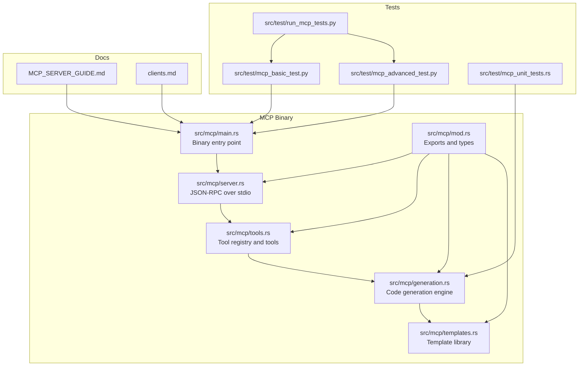
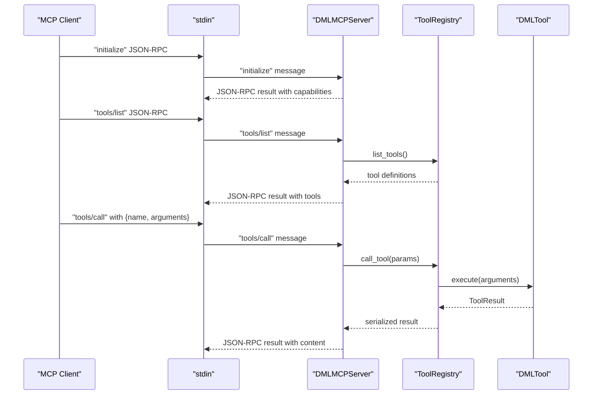
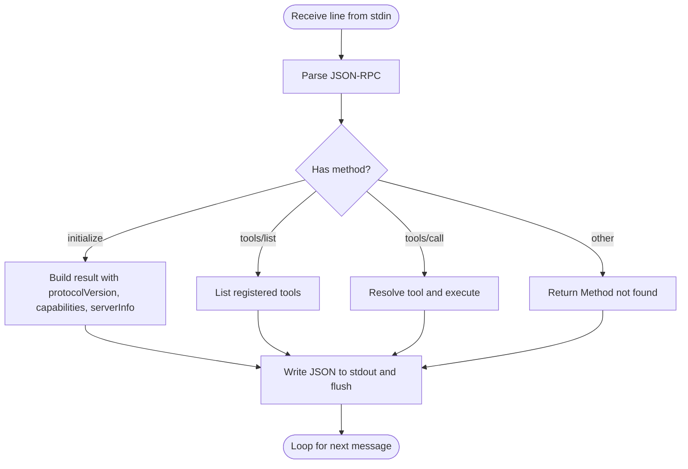
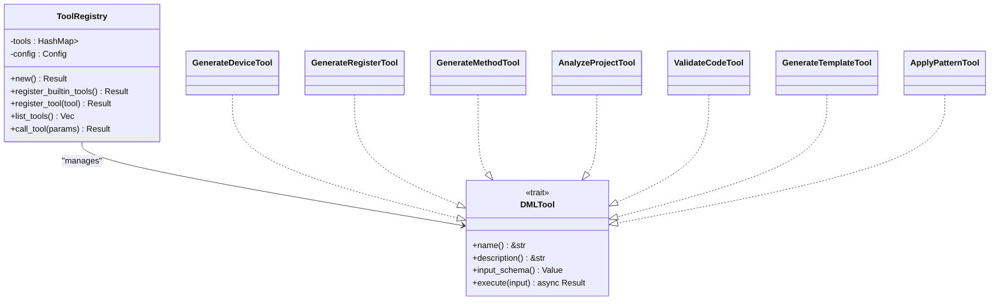
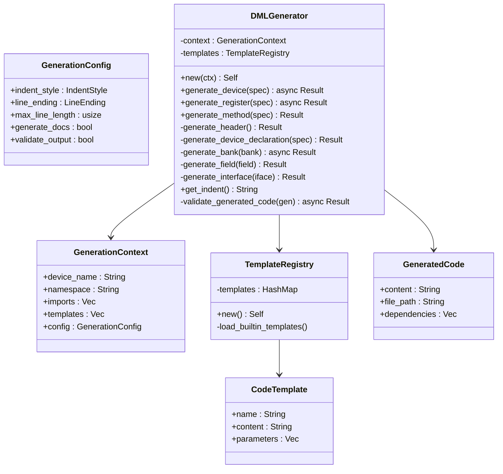
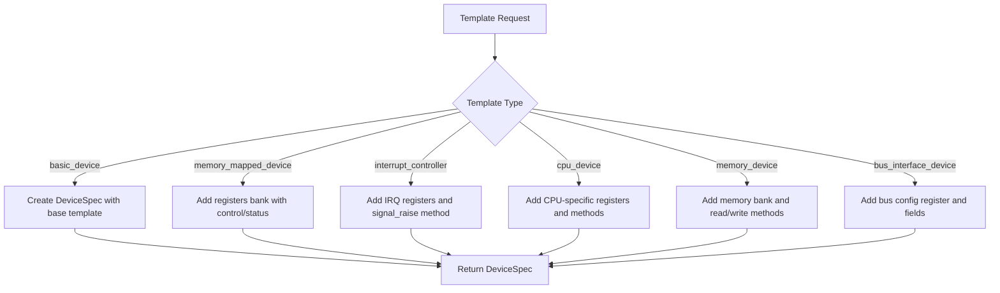
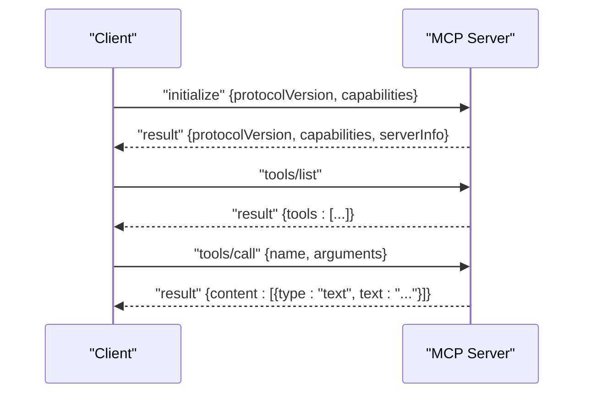
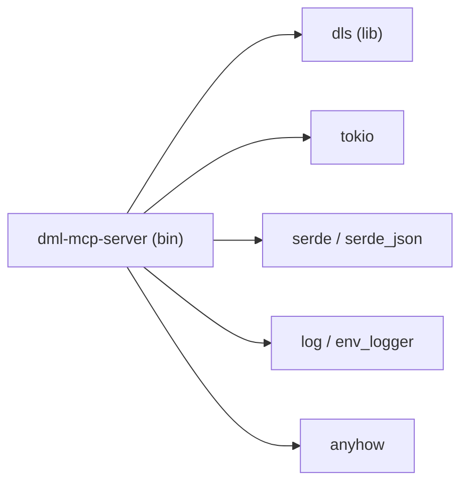

# MCP (Model Context Protocol) Integration

<cite>
**Referenced Files in This Document**
- [MCP_SERVER_GUIDE.md](file://MCP_SERVER_GUIDE.md)
- [Cargo.toml](file://Cargo.toml)
- [src/mcp/mod.rs](file://src/mcp/mod.rs)
- [src/mcp/main.rs](file://src/mcp/main.rs)
- [src/mcp/server.rs](file://src/mcp/server.rs)
- [src/mcp/tools.rs](file://src/mcp/tools.rs)
- [src/mcp/generation.rs](file://src/mcp/generation.rs)
- [src/mcp/templates.rs](file://src/mcp/templates.rs)
- [src/test/mcp_basic_test.py](file://src/test/mcp_basic_test.py)
- [src/test/mcp_advanced_test.py](file://src/test/mcp_advanced_test.py)
- [src/test/mcp_unit_tests.rs](file://src/test/mcp_unit_tests.rs)
- [src/test/run_mcp_tests.py](file://src/test/run_mcp_tests.py)
- [clients.md](file://clients.md)
</cite>

## Table of Contents
1. [Introduction](#introduction)
2. [Project Structure](#project-structure)
3. [Core Components](#core-components)
4. [Architecture Overview](#architecture-overview)
5. [Detailed Component Analysis](#detailed-component-analysis)
6. [Dependency Analysis](#dependency-analysis)
7. [Performance Considerations](#performance-considerations)
8. [Troubleshooting Guide](#troubleshooting-guide)
9. [Conclusion](#conclusion)
10. [Appendices](#appendices)

## Introduction
This document explains the MCP (Model Context Protocol) integration for the DML language server. It covers the MCP protocol overview, server implementation architecture, tool registration mechanisms, AI-assisted code generation capabilities, template system integration, and client–server communication patterns. It also documents configuration, tool lifecycle management, debugging approaches, and the relationship to traditional LSP features.

## Project Structure
The MCP server is implemented as a dedicated binary within the Rust workspace. The core MCP modules reside under src/mcp and include:
- Entry point and server runtime
- Protocol handling and JSON-RPC over stdio
- Tool registry and built-in tools
- Code generation engine and template library
- Tests and integration examples

**Diagram sources**
- [src/mcp/main.rs](file://src/mcp/main.rs#L1-L23)
- [src/mcp/server.rs](file://src/mcp/server.rs#L1-L229)
- [src/mcp/tools.rs](file://src/mcp/tools.rs#L1-L399)
- [src/mcp/generation.rs](file://src/mcp/generation.rs#L1-L411)
- [src/mcp/templates.rs](file://src/mcp/templates.rs#L1-L428)
- [src/mcp/mod.rs](file://src/mcp/mod.rs#L1-L54)
- [src/test/mcp_basic_test.py](file://src/test/mcp_basic_test.py#L1-L134)
- [src/test/mcp_advanced_test.py](file://src/test/mcp_advanced_test.py#L1-L184)
- [src/test/mcp_unit_tests.rs](file://src/test/mcp_unit_tests.rs#L1-L406)
- [src/test/run_mcp_tests.py](file://src/test/run_mcp_tests.py#L1-L104)
- [MCP_SERVER_GUIDE.md](file://MCP_SERVER_GUIDE.md#L1-L280)
- [clients.md](file://clients.md#L1-L191)

**Section sources**
- [Cargo.toml](file://Cargo.toml#L28-L31)
- [src/mcp/mod.rs](file://src/mcp/mod.rs#L1-L54)
- [src/mcp/main.rs](file://src/mcp/main.rs#L1-L23)

## Core Components
- MCP server runtime and protocol handler: Implements JSON-RPC over stdio, handles initialize, tools/list, and tools/call.
- Tool registry: Manages built-in tools and dispatches calls with input schema validation.
- Code generation engine: Produces DML code from structured specs with configurable formatting and optional validation.
- Template library: Provides pre-defined device templates and patterns (CPU, memory, peripherals, interrupts, buses).
- Tests and examples: Python-based integration tests and Rust unit tests validate server behavior and generation quality.

**Section sources**
- [src/mcp/server.rs](file://src/mcp/server.rs#L36-L229)
- [src/mcp/tools.rs](file://src/mcp/tools.rs#L46-L121)
- [src/mcp/generation.rs](file://src/mcp/generation.rs#L52-L310)
- [src/mcp/templates.rs](file://src/mcp/templates.rs#L8-L359)
- [src/test/mcp_basic_test.py](file://src/test/mcp_basic_test.py#L37-L134)
- [src/test/mcp_advanced_test.py](file://src/test/mcp_advanced_test.py#L33-L184)
- [src/test/mcp_unit_tests.rs](file://src/test/mcp_unit_tests.rs#L14-L406)

## Architecture Overview
The MCP server follows a simple, robust architecture:
- A binary entry point initializes logging and constructs the server.
- The server reads JSON-RPC messages from stdin, parses them, and routes to handlers.
- Handlers return JSON-RPC responses to stdout.
- Tools are registered statically at startup and executed asynchronously.
- Generation and templating are decoupled from protocol handling for testability and reuse.

**Diagram sources**
- [src/mcp/server.rs](file://src/mcp/server.rs#L88-L132)
- [src/mcp/tools.rs](file://src/mcp/tools.rs#L101-L121)

## Detailed Component Analysis

### MCP Protocol and Server Runtime
- Protocol version: MCP 2024-11-05.
- Transport: JSON-RPC 2.0 over stdio (Tokio async I/O).
- Methods:
  - initialize: Returns protocol version, capabilities, and server info.
  - tools/list: Lists registered tools with descriptions and input schemas.
  - tools/call: Executes a named tool with validated arguments and returns content.

**Diagram sources**
- [src/mcp/server.rs](file://src/mcp/server.rs#L88-L132)
- [src/mcp/server.rs](file://src/mcp/server.rs#L134-L206)

**Section sources**
- [src/mcp/server.rs](file://src/mcp/server.rs#L12-L229)
- [src/mcp/mod.rs](file://src/mcp/mod.rs#L17-L54)

### Tool Registration and Lifecycle
- ToolRegistry loads built-in tools at startup and exposes list and call operations.
- Tools implement a trait with name, description, input schema, and async execute.
- Built-in tools include device, register, method, analysis, template, and pattern tools.

**Diagram sources**
- [src/mcp/tools.rs](file://src/mcp/tools.rs#L46-L121)
- [src/mcp/tools.rs](file://src/mcp/tools.rs#L125-L325)

**Section sources**
- [src/mcp/tools.rs](file://src/mcp/tools.rs#L46-L121)
- [src/mcp/tools.rs](file://src/mcp/tools.rs#L125-L325)

### Code Generation Engine
- GenerationContext carries device metadata, imports, templates, and formatting preferences.
- DMLGenerator composes DML code from DeviceSpec/RegisterSpec/FieldSpec/MethodSpec.
- Supports configurable indentation, line endings, documentation generation, and optional validation hooks.
- TemplateRegistry holds built-in templates and parameters.

**Diagram sources**
- [src/mcp/generation.rs](file://src/mcp/generation.rs#L8-L310)
- [src/mcp/generation.rs](file://src/mcp/generation.rs#L312-L330)
- [src/mcp/generation.rs](file://src/mcp/generation.rs#L347-L411)

**Section sources**
- [src/mcp/generation.rs](file://src/mcp/generation.rs#L8-L310)
- [src/mcp/generation.rs](file://src/mcp/generation.rs#L312-L330)
- [src/mcp/generation.rs](file://src/mcp/generation.rs#L347-L411)

### Template System Integration
- DMLTemplates provides device templates for CPU, memory, peripheral, interrupt controller, and bus interface.
- Pattern templates are stored as closures keyed by name, enabling dynamic generation with configuration.
- Snippets define reusable method and field patterns.

**Diagram sources**
- [src/mcp/templates.rs](file://src/mcp/templates.rs#L12-L359)

**Section sources**
- [src/mcp/templates.rs](file://src/mcp/templates.rs#L8-L359)

### Client–Server Communication Patterns
- Clients send JSON-RPC messages over stdin and read responses from stdout.
- Typical flow: initialize → tools/list → tools/call.
- Example configurations show how to integrate with Claude Desktop and other MCP clients.

**Diagram sources**
- [src/mcp/server.rs](file://src/mcp/server.rs#L104-L132)
- [src/mcp/server.rs](file://src/mcp/server.rs#L154-L206)
- [MCP_SERVER_GUIDE.md](file://MCP_SERVER_GUIDE.md#L146-L171)

**Section sources**
- [src/test/mcp_basic_test.py](file://src/test/mcp_basic_test.py#L11-L36)
- [src/test/mcp_advanced_test.py](file://src/test/mcp_advanced_test.py#L10-L32)
- [MCP_SERVER_GUIDE.md](file://MCP_SERVER_GUIDE.md#L146-L171)

### AI-Assisted Code Generation and Workflows
- The MCP server enables AI agents to generate DML code by invoking tools with structured arguments.
- Example workflows:
  - Generate a device skeleton with registers and interfaces.
  - Generate a register with fields and access modes.
  - Apply design patterns (e.g., memory-mapped peripherals, interrupt controllers).
- The guide demonstrates integration with Claude Desktop and command-line testing.

**Section sources**
- [MCP_SERVER_GUIDE.md](file://MCP_SERVER_GUIDE.md#L35-L107)
- [MCP_SERVER_GUIDE.md](file://MCP_SERVER_GUIDE.md#L146-L171)

### Relationship to Traditional LSP Features
- The MCP server complements the LSP server by focusing on code generation and tooling.
- LSP clients can coexist with MCP servers; MCP provides specialized tool execution while LSP handles diagnostics, navigation, and editing features.

**Section sources**
- [clients.md](file://clients.md#L20-L54)

## Dependency Analysis
The MCP binary is defined as a separate target and depends on the dls library and standard crates for async I/O, logging, serialization, and JSON-RPC.

**Diagram sources**
- [Cargo.toml](file://Cargo.toml#L28-L31)
- [Cargo.toml](file://Cargo.toml#L33-L62)

**Section sources**
- [Cargo.toml](file://Cargo.toml#L28-L31)
- [Cargo.toml](file://Cargo.toml#L33-L62)

## Performance Considerations
- The server runs on Tokio for efficient async I/O over stdio.
- Generation is configurable for indentation and line endings to balance readability and compactness.
- Validation hooks are present for future integration with the DML parser.
- The implementation emphasizes memory safety and non-blocking operation.

**Section sources**
- [src/mcp/main.rs](file://src/mcp/main.rs#L11-L22)
- [src/mcp/generation.rs](file://src/mcp/generation.rs#L28-L50)
- [MCP_SERVER_GUIDE.md](file://MCP_SERVER_GUIDE.md#L205-L210)

## Troubleshooting Guide
- Build and run the MCP server using the provided guide.
- Use the Python test scripts to validate server behavior and tool execution.
- Inspect logs for initialization, tool listing, and tool execution outcomes.
- Verify JSON-RPC messages conform to the protocol version and method names.

Common checks:
- Confirm the server responds to initialize and tools/list.
- Ensure tools/call returns content with type text.
- Validate generated code adheres to DML 1.4 syntax.

**Section sources**
- [MCP_SERVER_GUIDE.md](file://MCP_SERVER_GUIDE.md#L7-L34)
- [src/test/mcp_basic_test.py](file://src/test/mcp_basic_test.py#L37-L134)
- [src/test/mcp_advanced_test.py](file://src/test/mcp_advanced_test.py#L33-L184)
- [src/test/run_mcp_tests.py](file://src/test/run_mcp_tests.py#L37-L104)

## Conclusion
The MCP integration delivers a standards-compliant, extensible server for AI-assisted DML code generation. It cleanly separates protocol handling, tooling, and generation logic, enabling robust client integrations and future enhancements.

## Appendices

### MCP Server Configuration
- Server capabilities include tools and logging; resources and prompts are disabled.
- Generation configuration supports configurable indentation, line endings, documentation generation, and output validation.

**Section sources**
- [src/mcp/mod.rs](file://src/mcp/mod.rs#L36-L54)
- [src/mcp/generation.rs](file://src/mcp/generation.rs#L18-L50)

### Tool Development Checklist
- Define tool name, description, and input schema.
- Implement DMLTool trait with execute returning ToolResult.
- Register tool in ToolRegistry::register_builtin_tools.
- Add unit tests validating inputs and outputs.

**Section sources**
- [src/mcp/tools.rs](file://src/mcp/tools.rs#L36-L43)
- [src/mcp/tools.rs](file://src/mcp/tools.rs#L66-L81)

### Security and Safety Notes
- The server is written in safe Rust with memory safety guarantees.
- Tool execution is sandboxed by design; input schemas should be enforced by clients.
- Logging is available for debugging without interfering with protocol output.

**Section sources**
- [src/mcp/main.rs](file://src/mcp/main.rs#L11-L22)
- [src/mcp/server.rs](file://src/mcp/server.rs#L58-L86)