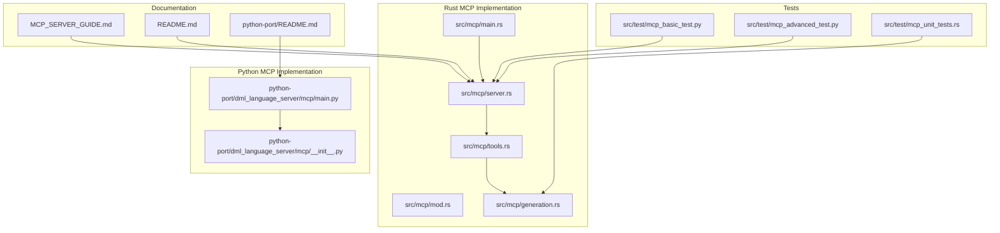
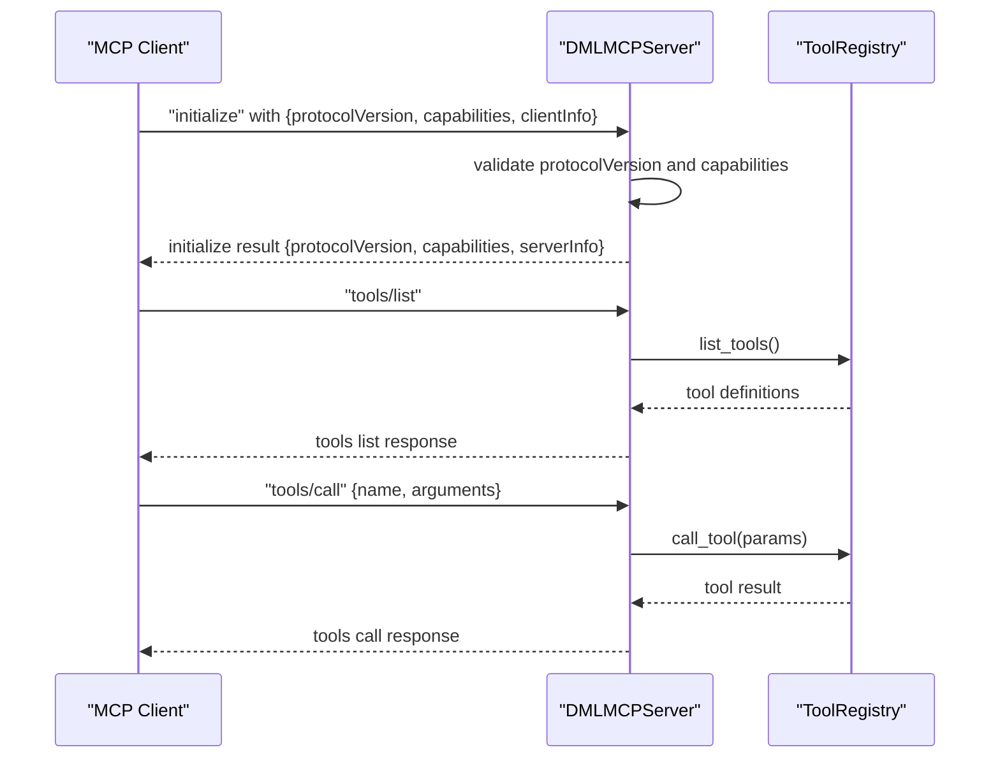
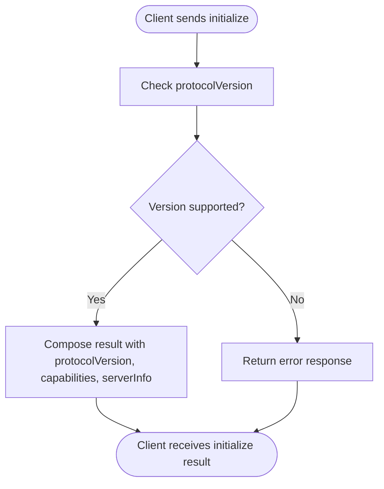
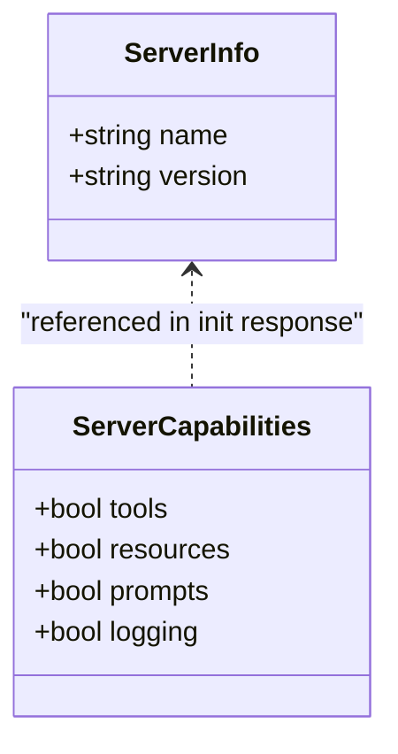
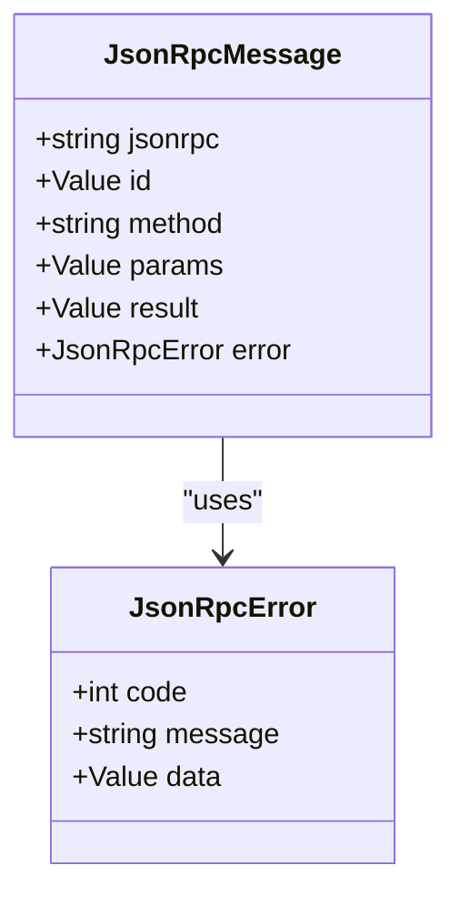
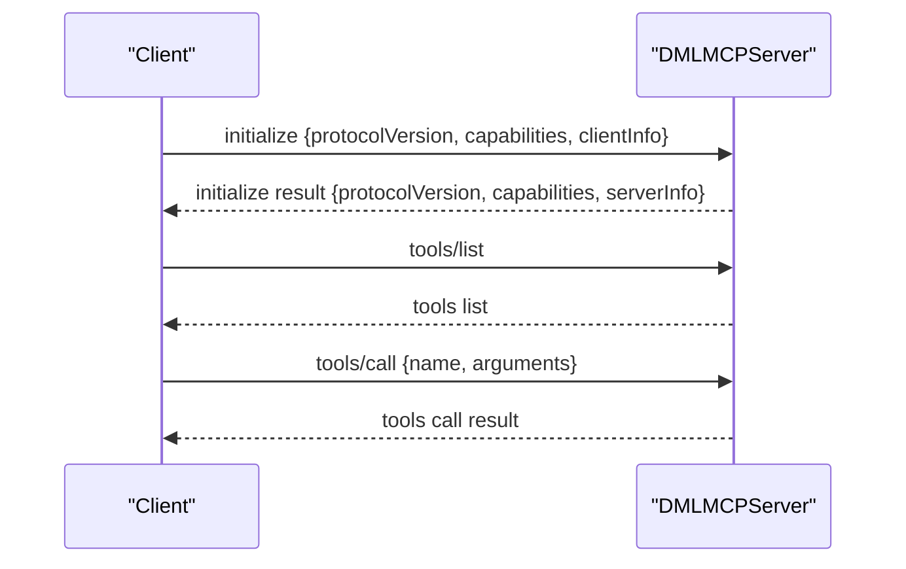
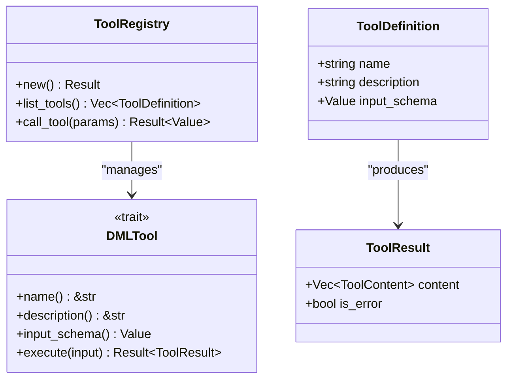
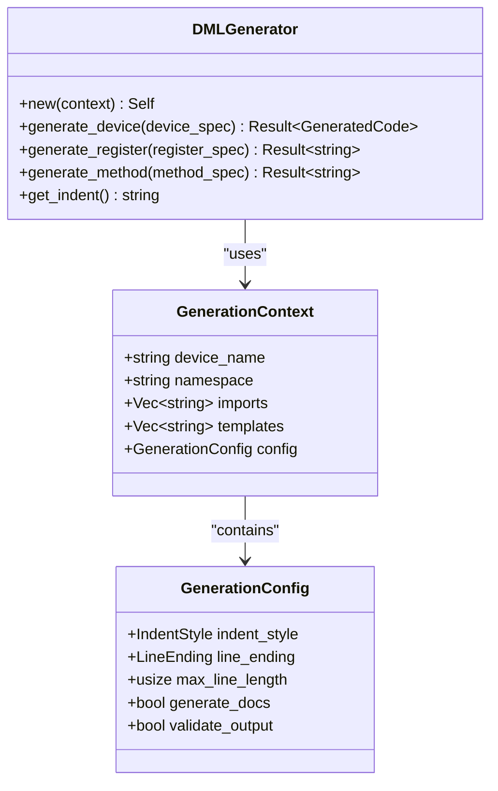
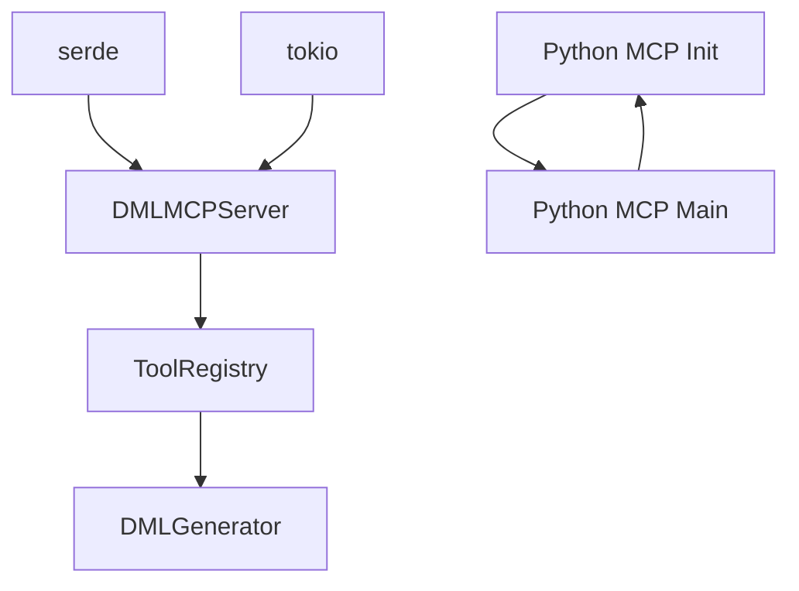

# MCP Protocol Overview

<cite>
**Referenced Files in This Document**
- [src/mcp/mod.rs](file://src/mcp/mod.rs)
- [src/mcp/main.rs](file://src/mcp/main.rs)
- [src/mcp/server.rs](file://src/mcp/server.rs)
- [src/mcp/tools.rs](file://src/mcp/tools.rs)
- [src/mcp/generation.rs](file://src/mcp/generation.rs)
- [python-port/dml_language_server/mcp/__init__.py](file://python-port/dml_language_server/mcp/__init__.py)
- [python-port/dml_language_server/mcp/main.py](file://python-port/dml_language_server/mcp/main.py)
- [src/test/mcp_basic_test.py](file://src/test/mcp_basic_test.py)
- [src/test/mcp_advanced_test.py](file://src/test/mcp_advanced_test.py)
- [src/test/mcp_unit_tests.rs](file://src/test/mcp_unit_tests.rs)
- [MCP_SERVER_GUIDE.md](file://MCP_SERVER_GUIDE.md)
- [README.md](file://README.md)
- [python-port/README.md](file://python-port/README.md)
</cite>

## Table of Contents
1. [Introduction](#introduction)
2. [Project Structure](#project-structure)
3. [Core Components](#core-components)
4. [Architecture Overview](#architecture-overview)
5. [Detailed Component Analysis](#detailed-component-analysis)
6. [Dependency Analysis](#dependency-analysis)
7. [Performance Considerations](#performance-considerations)
8. [Troubleshooting Guide](#troubleshooting-guide)
9. [Conclusion](#conclusion)

## Introduction
This document provides a comprehensive overview of the Model Context Protocol (MCP) implementation within the DML language server. It explains MCP 2024-11-05 specification compliance, server capabilities, protocol versioning, and the MCP server information structure. It also details capability flags (tools, resources, prompts, logging), server metadata, JSON-RPC communication patterns, message formatting, and protocol handshake procedures. Practical examples demonstrate MCP server initialization, capability negotiation, and version compatibility checks. Finally, it outlines the relationship between MCP and the Language Server Protocol (LSP), security considerations, and debugging approaches for MCP communications.

## Project Structure
The MCP implementation spans both a Rust-based server and a Python port, with shared protocol definitions and test suites validating compliance and functionality.

**Diagram sources**
- [src/mcp/mod.rs](file://src/mcp/mod.rs#L1-L54)
- [src/mcp/main.rs](file://src/mcp/main.rs#L1-L23)
- [src/mcp/server.rs](file://src/mcp/server.rs#L1-L229)
- [src/mcp/tools.rs](file://src/mcp/tools.rs#L1-L399)
- [src/mcp/generation.rs](file://src/mcp/generation.rs#L1-L411)
- [python-port/dml_language_server/mcp/__init__.py](file://python-port/dml_language_server/mcp/__init__.py#L1-L482)
- [python-port/dml_language_server/mcp/main.py](file://python-port/dml_language_server/mcp/main.py#L1-L166)
- [src/test/mcp_basic_test.py](file://src/test/mcp_basic_test.py#L1-L134)
- [src/test/mcp_advanced_test.py](file://src/test/mcp_advanced_test.py#L1-L184)
- [src/test/mcp_unit_tests.rs](file://src/test/mcp_unit_tests.rs#L1-L406)
- [MCP_SERVER_GUIDE.md](file://MCP_SERVER_GUIDE.md#L1-L280)
- [README.md](file://README.md#L1-L57)
- [python-port/README.md](file://python-port/README.md#L1-L243)

**Section sources**
- [src/mcp/mod.rs](file://src/mcp/mod.rs#L1-L54)
- [src/mcp/main.rs](file://src/mcp/main.rs#L1-L23)
- [src/mcp/server.rs](file://src/mcp/server.rs#L1-L229)
- [src/mcp/tools.rs](file://src/mcp/tools.rs#L1-L399)
- [src/mcp/generation.rs](file://src/mcp/generation.rs#L1-L411)
- [python-port/dml_language_server/mcp/__init__.py](file://python-port/dml_language_server/mcp/__init__.py#L1-L482)
- [python-port/dml_language_server/mcp/main.py](file://python-port/dml_language_server/mcp/main.py#L1-L166)
- [MCP_SERVER_GUIDE.md](file://MCP_SERVER_GUIDE.md#L1-L280)
- [README.md](file://README.md#L1-L57)
- [python-port/README.md](file://python-port/README.md#L1-L243)

## Core Components
- Protocol versioning: The server declares MCP version 2024-11-05 and embeds it in initialization responses.
- Server information: Includes server name and version metadata.
- Server capabilities: Defines capability flags for tools, resources, prompts, and logging.
- JSON-RPC transport: Messages are exchanged over stdin/stdout using JSON-RPC 2.0 framing.
- Handshake: Clients call initialize with protocolVersion and capabilities; server responds with protocolVersion, capabilities, and serverInfo.
- Tool registry: Supports tool discovery (tools/list) and execution (tools/call) with structured input schemas.

Key implementation references:
- Protocol version constant and server info/capabilities structures
- JSON-RPC message types and error handling
- Initialization response composition
- Tool registry and tool execution pipeline

**Section sources**
- [src/mcp/mod.rs](file://src/mcp/mod.rs#L17-L54)
- [src/mcp/server.rs](file://src/mcp/server.rs#L12-L132)
- [src/mcp/server.rs](file://src/mcp/server.rs#L134-L152)
- [src/mcp/tools.rs](file://src/mcp/tools.rs#L46-L121)

## Architecture Overview
The MCP server follows a clean separation of concerns:
- Entry point initializes logging and spawns the server.
- Server reads JSON-RPC messages from stdin, parses them, and routes to handlers.
- Handlers produce JSON-RPC responses and write them to stdout with newline termination.
- Tool registry manages tool discovery and execution with input validation.

**Diagram sources**
- [src/mcp/server.rs](file://src/mcp/server.rs#L57-L132)
- [src/mcp/server.rs](file://src/mcp/server.rs#L134-L206)
- [src/mcp/tools.rs](file://src/mcp/tools.rs#L90-L121)

**Section sources**
- [src/mcp/main.rs](file://src/mcp/main.rs#L11-L23)
- [src/mcp/server.rs](file://src/mcp/server.rs#L57-L132)
- [src/mcp/tools.rs](file://src/mcp/tools.rs#L46-L121)

## Detailed Component Analysis

### Protocol Versioning and Compliance
- The server defines MCP_VERSION as "2024-11-05".
- During initialization, the server echoes the protocolVersion and includes its own capabilities and serverInfo.
- Tests confirm clients can specify protocolVersion "2024-11-05" during initialize.

**Diagram sources**
- [src/mcp/mod.rs](file://src/mcp/mod.rs#L17-L18)
- [src/mcp/server.rs](file://src/mcp/server.rs#L134-L152)
- [src/test/mcp_basic_test.py](file://src/test/mcp_basic_test.py#L54-L72)

**Section sources**
- [src/mcp/mod.rs](file://src/mcp/mod.rs#L17-L18)
- [src/mcp/server.rs](file://src/mcp/server.rs#L134-L152)
- [src/test/mcp_basic_test.py](file://src/test/mcp_basic_test.py#L54-L72)

### Server Information and Capabilities
- ServerInfo includes name and version fields; defaults use package metadata.
- ServerCapabilities exposes four boolean flags: tools, resources, prompts, logging.
- Defaults indicate tools and logging are enabled; resources and prompts are disabled.

**Diagram sources**
- [src/mcp/mod.rs](file://src/mcp/mod.rs#L20-L54)

**Section sources**
- [src/mcp/mod.rs](file://src/mcp/mod.rs#L20-L54)

### JSON-RPC Communication and Message Formatting
- Messages are JSON objects with fields: jsonrpc, id, method, params, result, error.
- Responses include jsonrpc set to "2.0" and id copied from the request.
- Errors use standard JSON-RPC error codes and include optional data payloads.
- Transport is line-delimited JSON over stdin/stdout.

**Diagram sources**
- [src/mcp/server.rs](file://src/mcp/server.rs#L12-L34)

**Section sources**
- [src/mcp/server.rs](file://src/mcp/server.rs#L12-L34)
- [src/mcp/server.rs](file://src/mcp/server.rs#L88-L132)

### Protocol Handshake and Capability Negotiation
- Client sends initialize with protocolVersion and capabilities.
- Server validates and responds with its own protocolVersion, capabilities, and serverInfo.
- Tools are discovered via tools/list and executed via tools/call with structured arguments.

**Diagram sources**
- [src/mcp/server.rs](file://src/mcp/server.rs#L104-L132)
- [src/mcp/server.rs](file://src/mcp/server.rs#L134-L206)
- [src/test/mcp_basic_test.py](file://src/test/mcp_basic_test.py#L54-L115)

**Section sources**
- [src/mcp/server.rs](file://src/mcp/server.rs#L104-L132)
- [src/mcp/server.rs](file://src/mcp/server.rs#L134-L206)
- [src/test/mcp_basic_test.py](file://src/test/mcp_basic_test.py#L54-L115)

### Tool Registry and Execution Pipeline
- ToolRegistry dynamically registers tools and exposes list_tools and call_tool.
- Tools implement a trait with name, description, inputSchema, and execute.
- Execution validates presence of name and arguments, then invokes the tool and returns structured content.

**Diagram sources**
- [src/mcp/tools.rs](file://src/mcp/tools.rs#L46-L121)
- [src/mcp/tools.rs](file://src/mcp/tools.rs#L36-L43)

**Section sources**
- [src/mcp/tools.rs](file://src/mcp/tools.rs#L46-L121)
- [src/mcp/tools.rs](file://src/mcp/tools.rs#L125-L203)
- [src/mcp/tools.rs](file://src/mcp/tools.rs#L205-L280)

### Code Generation Engine
- GenerationContext and GenerationConfig define formatting and validation preferences.
- DMLGenerator composes device, bank, register, field, and method code with configurable indentation and documentation.
- TemplateRegistry and template patterns support pre-defined device structures.

**Diagram sources**
- [src/mcp/generation.rs](file://src/mcp/generation.rs#L8-L50)
- [src/mcp/generation.rs](file://src/mcp/generation.rs#L52-L111)
- [src/mcp/generation.rs](file://src/mcp/generation.rs#L113-L204)

**Section sources**
- [src/mcp/generation.rs](file://src/mcp/generation.rs#L8-L50)
- [src/mcp/generation.rs](file://src/mcp/generation.rs#L52-L111)
- [src/mcp/generation.rs](file://src/mcp/generation.rs#L113-L204)

### Python MCP Implementation
- The Python port mirrors the Rust implementation with equivalent protocol types, server info/capabilities, and tool definitions.
- It uses asyncio for stdio handling and JSON-RPC message parsing.
- The MCP server entry point initializes logging and runs the protocol handler.

**Section sources**
- [python-port/dml_language_server/mcp/__init__.py](file://python-port/dml_language_server/mcp/__init__.py#L25-L43)
- [python-port/dml_language_server/mcp/__init__.py](file://python-port/dml_language_server/mcp/__init__.py#L162-L333)
- [python-port/dml_language_server/mcp/main.py](file://python-port/dml_language_server/mcp/main.py#L22-L96)

## Dependency Analysis
- The Rust MCP server depends on serde for serialization and tokio for async I/O.
- The tool registry depends on the generation engine for code synthesis.
- Tests validate both Rust and Python implementations against the same protocol expectations.

**Diagram sources**
- [src/mcp/server.rs](file://src/mcp/server.rs#L1-L11)
- [src/mcp/tools.rs](file://src/mcp/tools.rs#L1-L11)
- [src/mcp/generation.rs](file://src/mcp/generation.rs#L1-L7)

**Section sources**
- [src/mcp/server.rs](file://src/mcp/server.rs#L1-L11)
- [src/mcp/tools.rs](file://src/mcp/tools.rs#L1-L11)
- [src/mcp/generation.rs](file://src/mcp/generation.rs#L1-L7)

## Performance Considerations
- Asynchronous I/O with tokio ensures non-blocking message handling.
- Tool execution is isolated per request, enabling concurrent processing where appropriate.
- Code generation is configurable for formatting and validation overhead.

[No sources needed since this section provides general guidance]

## Troubleshooting Guide
- Logging: Both Rust and Python implementations log initialization and errors; adjust log levels for diagnostics.
- Handshake failures: Verify protocolVersion matches "2024-11-05" in initialize.
- Tool execution errors: Inspect tool input schemas and argument presence; server returns structured error responses.
- Transport issues: Ensure newline-delimited JSON and proper stdin/stdout handling.

**Section sources**
- [src/mcp/main.rs](file://src/mcp/main.rs#L11-L23)
- [src/mcp/server.rs](file://src/mcp/server.rs#L134-L206)
- [src/test/mcp_basic_test.py](file://src/test/mcp_basic_test.py#L1-L134)
- [src/test/mcp_advanced_test.py](file://src/test/mcp_advanced_test.py#L1-L184)
- [src/test/mcp_unit_tests.rs](file://src/test/mcp_unit_tests.rs#L1-L406)

## Conclusion
The DML MCP server implements MCP 2024-11-05 with robust JSON-RPC over stdio, a clear server information and capability model, and a flexible tool registry. The Rust and Python implementations share the same protocol semantics and are validated by comprehensive tests. Integration with AI assistants and IDEs is straightforward, leveraging the standardized MCP handshake and tool execution patterns.