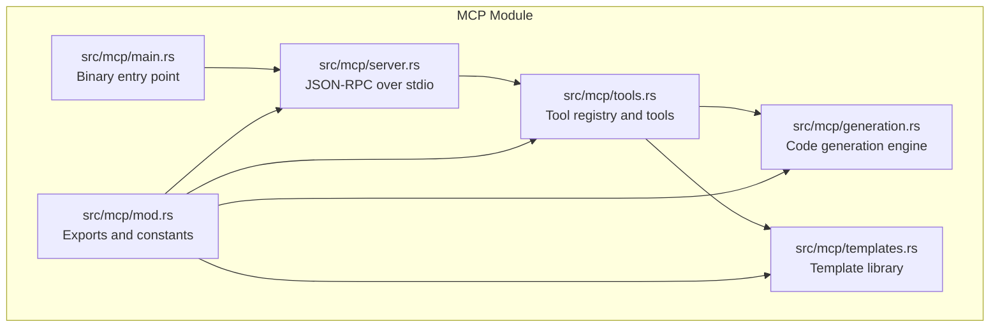
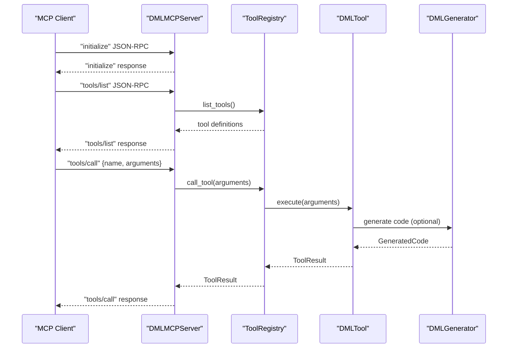
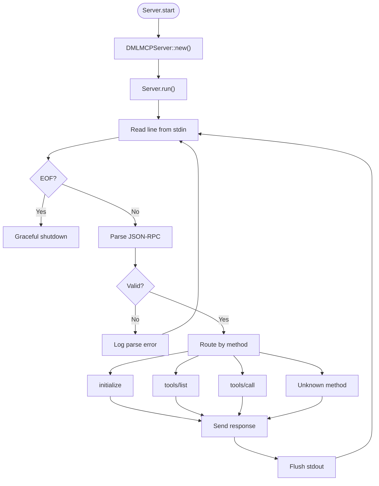
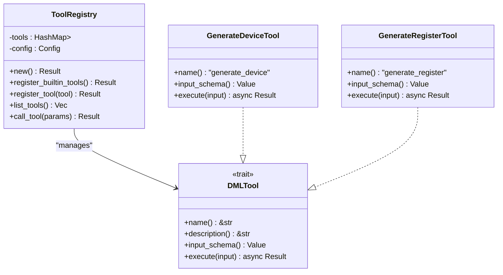
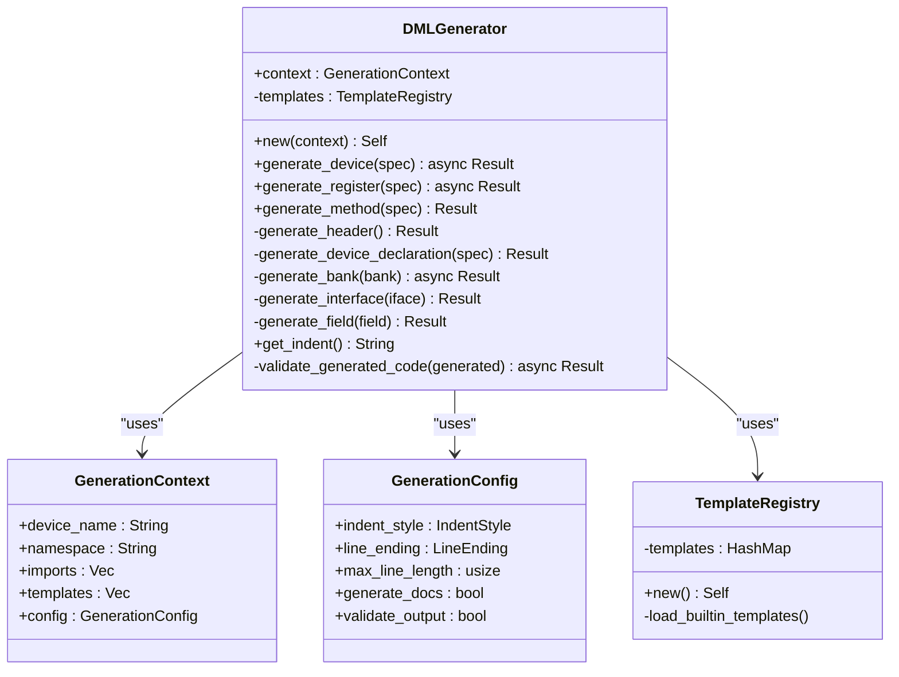
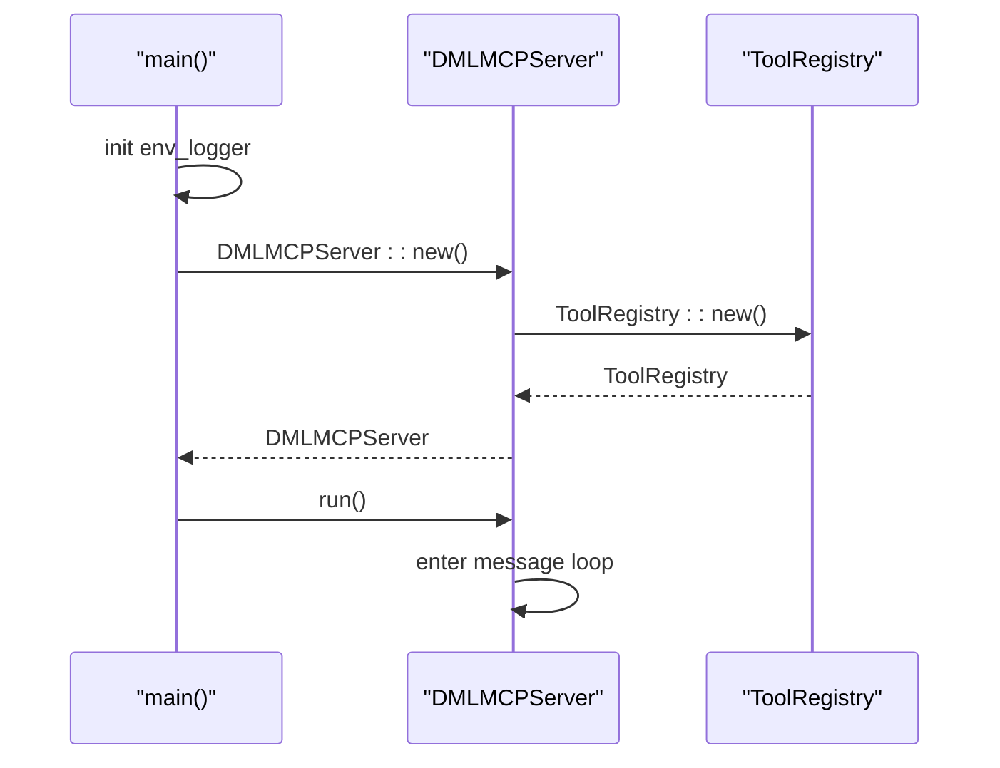
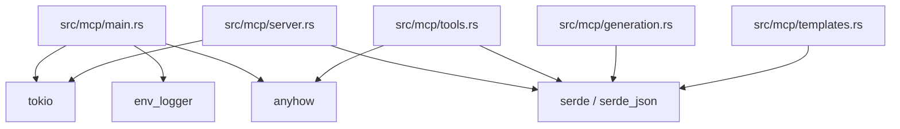

# MCP Server Implementation

<cite>
**Referenced Files in This Document**
- [src/mcp/main.rs](file://src/mcp/main.rs)
- [src/mcp/mod.rs](file://src/mcp/mod.rs)
- [src/mcp/server.rs](file://src/mcp/server.rs)
- [src/mcp/tools.rs](file://src/mcp/tools.rs)
- [src/mcp/generation.rs](file://src/mcp/generation.rs)
- [src/mcp/templates.rs](file://src/mcp/templates.rs)
- [Cargo.toml](file://Cargo.toml)
- [MCP_SERVER_GUIDE.md](file://MCP_SERVER_GUIDE.md)
</cite>

## Table of Contents
1. [Introduction](#introduction)
2. [Project Structure](#project-structure)
3. [Core Components](#core-components)
4. [Architecture Overview](#architecture-overview)
5. [Detailed Component Analysis](#detailed-component-analysis)
6. [Dependency Analysis](#dependency-analysis)
7. [Performance Considerations](#performance-considerations)
8. [Troubleshooting Guide](#troubleshooting-guide)
9. [Conclusion](#conclusion)

## Introduction
This document provides a comprehensive technical deep dive into the DML MCP (Model Context Protocol) Server implementation. It explains the server architecture, lifecycle management, asynchronous message handling, tool registration, integration with the DML analysis engine, and operational best practices. The MCP server enables AI agents and IDEs to discover tools, invoke DML code generation, and integrate with the broader DML ecosystem through a standards-compliant JSON-RPC interface over stdin/stdout.

## Project Structure
The MCP server resides under the `src/mcp/` module and integrates with the broader DML language server ecosystem. The key files include the entry point, server implementation, tool registry, generation engine, and template library.

**Diagram sources**
- [src/mcp/main.rs](file://src/mcp/main.rs#L1-L23)
- [src/mcp/mod.rs](file://src/mcp/mod.rs#L1-L54)
- [src/mcp/server.rs](file://src/mcp/server.rs#L1-L229)
- [src/mcp/tools.rs](file://src/mcp/tools.rs#L1-L399)
- [src/mcp/generation.rs](file://src/mcp/generation.rs#L1-L411)
- [src/mcp/templates.rs](file://src/mcp/templates.rs#L1-L428)

**Section sources**
- [src/mcp/main.rs](file://src/mcp/main.rs#L1-L23)
- [src/mcp/mod.rs](file://src/mcp/mod.rs#L1-L54)

## Core Components
- DMLMCPServer: Implements the MCP JSON-RPC over stdio, handles initialize, tools/list, and tools/call requests, and routes messages to the ToolRegistry.
- ToolRegistry: Manages built-in tools, validates tool invocation parameters, and executes tool implementations asynchronously.
- DMLTools: Trait abstraction for tools with standardized metadata and async execution.
- DMLGenerator: Advanced code generation engine supporting configurable formatting, documentation generation, and validation hooks.
- DMLTemplates: Rich template library for common device patterns (CPU, memory, peripheral, bus interface) and design patterns.

Key capabilities:
- MCP 2024-11-05 protocol compliance
- Async/await with Tokio for non-blocking IO
- Structured error responses per JSON-RPC 2.0
- Configurable generation settings (indentation, line endings, validation)
- Extensible tool system with JSON schema validation

**Section sources**
- [src/mcp/server.rs](file://src/mcp/server.rs#L36-L229)
- [src/mcp/tools.rs](file://src/mcp/tools.rs#L36-L121)
- [src/mcp/generation.rs](file://src/mcp/generation.rs#L52-L310)
- [src/mcp/templates.rs](file://src/mcp/templates.rs#L8-L359)

## Architecture Overview
The MCP server follows a clean separation of concerns:
- Entry point initializes logging and spawns the server
- Server reads JSON-RPC messages from stdin, parses them, and dispatches to handlers
- Handlers delegate tool execution to the ToolRegistry
- Tools may leverage the DMLGenerator and DMLTemplates for code generation
- Responses are written to stdout with proper JSON-RPC framing

**Diagram sources**
- [src/mcp/server.rs](file://src/mcp/server.rs#L57-L132)
- [src/mcp/tools.rs](file://src/mcp/tools.rs#L101-L120)
- [src/mcp/generation.rs](file://src/mcp/generation.rs#L66-L111)

## Detailed Component Analysis

### DMLMCPServer Lifecycle and Message Handling
- Initialization: Creates ToolRegistry, logs startup, and enters the main loop
- Message Loop: Reads lines from stdin, trims whitespace, and handles EOF gracefully
- Routing: Parses JSON-RPC, matches method, and constructs appropriate responses
- Error Handling: Logs parse failures, unknown methods, and internal tool errors with structured JSON-RPC error objects
- Shutdown: Exits cleanly on EOF or read errors

**Diagram sources**
- [src/mcp/server.rs](file://src/mcp/server.rs#L57-L132)

**Section sources**
- [src/mcp/server.rs](file://src/mcp/server.rs#L43-L132)

### Tool Registration and Execution Workflow
- ToolRegistry.new(): Loads default Config, registers built-in tools, logs counts
- Built-in tools include device generation, register generation, method generation, project analysis, code validation, template generation, and pattern application
- Tool execution validates presence of name and arguments, resolves tool by name, and executes with cloned input
- Results are serialized to ToolResult with content arrays and optional error flags

**Diagram sources**
- [src/mcp/tools.rs](file://src/mcp/tools.rs#L46-L121)
- [src/mcp/tools.rs](file://src/mcp/tools.rs#L125-L203)
- [src/mcp/tools.rs](file://src/mcp/tools.rs#L205-L280)

**Section sources**
- [src/mcp/tools.rs](file://src/mcp/tools.rs#L46-L121)
- [src/mcp/tools.rs](file://src/mcp/tools.rs#L125-L280)

### Code Generation Engine and Templates
- DMLGenerator: Accepts a GenerationContext with device name, namespace, imports, templates, and GenerationConfig
- Supports generating devices, banks, registers, fields, and methods with configurable formatting and documentation
- GenerationConfig supports indent styles (spaces/tabs), line endings, max line length, documentation generation, and output validation
- DMLTemplates: Provides built-in device templates (CPU, memory, peripheral, bus interface) and common design patterns
- TemplateRegistry: Placeholder for loading built-in templates

**Diagram sources**
- [src/mcp/generation.rs](file://src/mcp/generation.rs#L52-L310)
- [src/mcp/generation.rs](file://src/mcp/generation.rs#L8-L50)

**Section sources**
- [src/mcp/generation.rs](file://src/mcp/generation.rs#L52-L310)
- [src/mcp/templates.rs](file://src/mcp/templates.rs#L8-L359)

### Server Initialization and Configuration
- Entry point: Initializes env_logger with INFO level by default, logs version, creates DMLMCPServer via DMLMCPServer::new(), and runs server.run()
- DMLMCPServer::new(): Builds ToolRegistry, sets default ServerInfo and ServerCapabilities
- ServerCapabilities: Enables tools and logging; resources/prompts disabled by default
- MCP_VERSION: "2024-11-05"

**Diagram sources**
- [src/mcp/main.rs](file://src/mcp/main.rs#L11-L23)
- [src/mcp/server.rs](file://src/mcp/server.rs#L43-L55)
- [src/mcp/mod.rs](file://src/mcp/mod.rs#L17-L54)

**Section sources**
- [src/mcp/main.rs](file://src/mcp/main.rs#L11-L23)
- [src/mcp/server.rs](file://src/mcp/server.rs#L43-L55)
- [src/mcp/mod.rs](file://src/mcp/mod.rs#L17-L54)

## Dependency Analysis
External dependencies relevant to the MCP server:
- tokio: async runtime for stdio handling
- serde/serde_json: JSON serialization/deserialization
- log/env_logger: structured logging
- anyhow: error handling abstraction

**Diagram sources**
- [Cargo.toml](file://Cargo.toml#L33-L62)
- [src/mcp/main.rs](file://src/mcp/main.rs#L6-L10)
- [src/mcp/server.rs](file://src/mcp/server.rs#L3-L10)
- [src/mcp/tools.rs](file://src/mcp/tools.rs#L3-L11)
- [src/mcp/generation.rs](file://src/mcp/generation.rs#L3-L7)
- [src/mcp/templates.rs](file://src/mcp/templates.rs#L3-L7)

**Section sources**
- [Cargo.toml](file://Cargo.toml#L33-L62)

## Performance Considerations
- Asynchronous IO: Uses Tokio for non-blocking stdin/stdout handling, enabling concurrent request processing without blocking the main thread
- Minimal allocations: Reuses buffers and avoids unnecessary cloning during message parsing and response construction
- Configurable generation: GenerationConfig allows tuning formatting and validation overhead to balance quality and performance
- Scalability: The ToolRegistry pattern supports adding new tools without modifying core server logic, facilitating horizontal scaling through external tool integrations
- Memory management: Leverages Rust ownership semantics to prevent leaks and ensure deterministic cleanup

[No sources needed since this section provides general guidance]

## Troubleshooting Guide
Common issues and resolutions:
- Parse errors: Invalid JSON-RPC messages trigger structured error responses (-32700 "Parse error")
- Unknown methods: Unrecognized method names return -32601 "Method not found"
- Invalid params: Missing tool name or arguments yield -32602 "Invalid params"
- Internal errors: Tool execution failures produce -32603 "Internal error" with details
- Logging: Configure env_logger filter via environment variable for debug-level insights
- EOF handling: Graceful shutdown on stdin EOF; verify client closes properly

Operational checks:
- Verify MCP 2024-11-05 protocol compliance
- Confirm tools/list returns expected tool definitions
- Validate tool schemas via input_schema for each tool
- Monitor logs for warnings and errors during generation

**Section sources**
- [src/mcp/server.rs](file://src/mcp/server.rs#L104-L132)
- [src/mcp/server.rs](file://src/mcp/server.rs#L188-L205)
- [src/mcp/server.rs](file://src/mcp/server.rs#L208-L228)

## Conclusion
The DML MCP Server provides a robust, standards-compliant foundation for AI-assisted DML development. Its modular design, asynchronous IO, and extensible tool system enable seamless integration with modern AI agents and IDEs. The combination of a powerful code generation engine and rich template library accelerates development workflows while maintaining high code quality and performance. The implementation demonstrates production readiness with comprehensive error handling, logging, and test coverage.