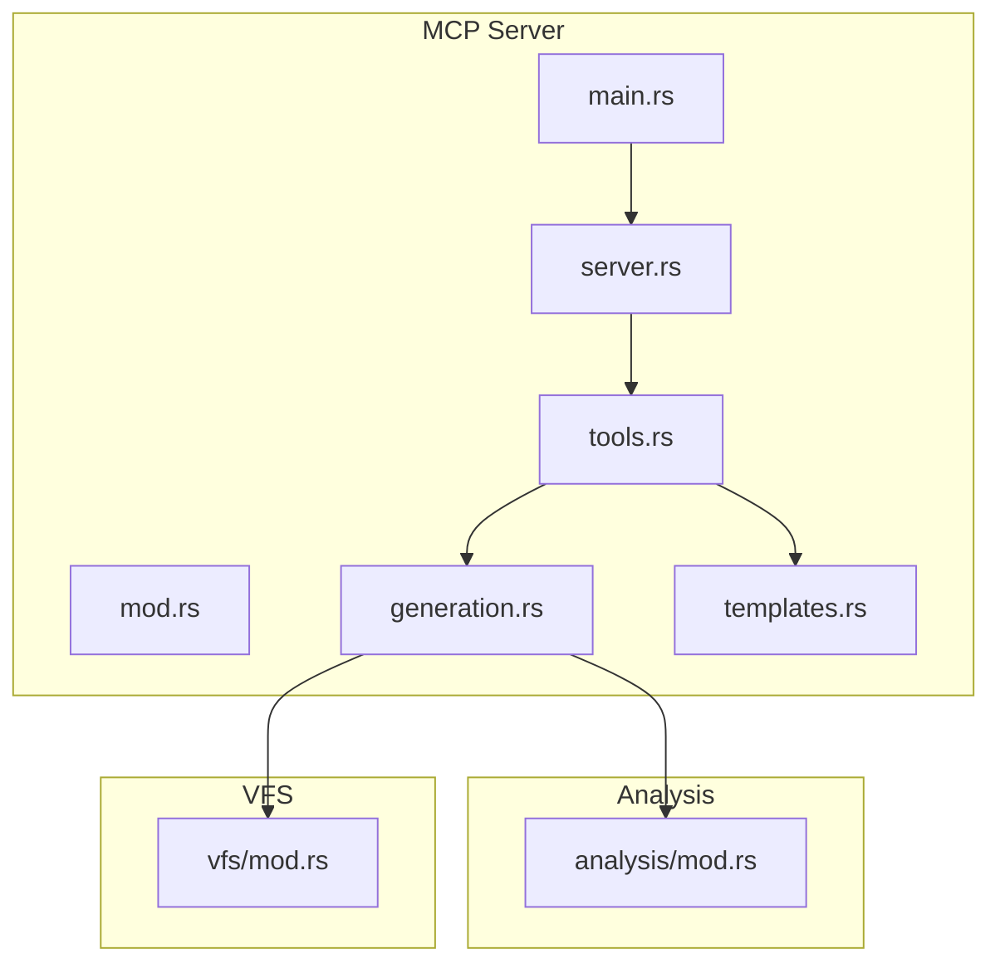
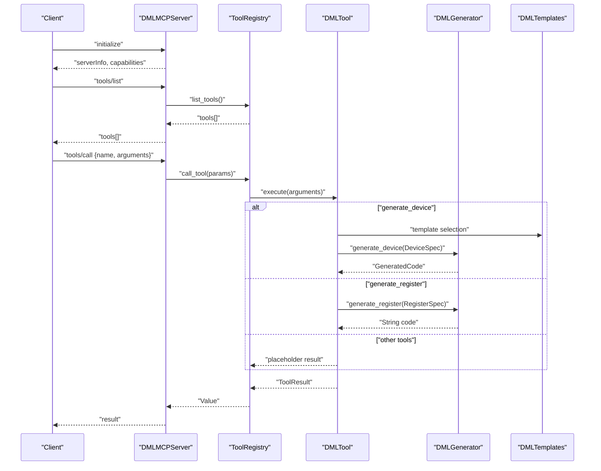
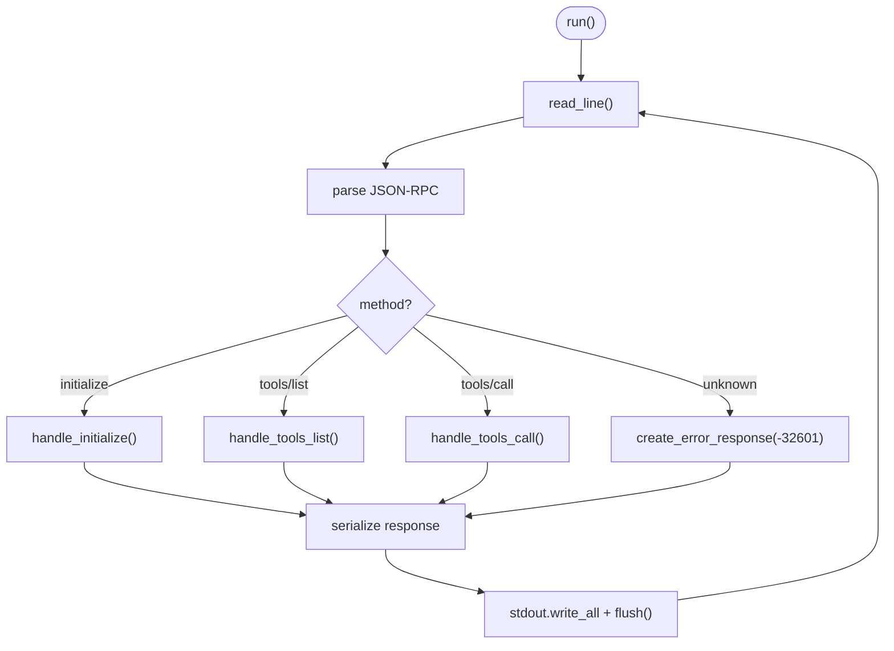
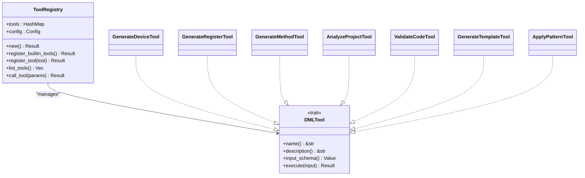
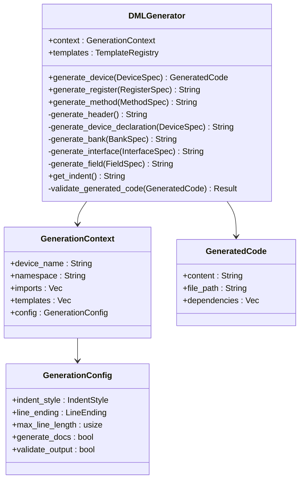
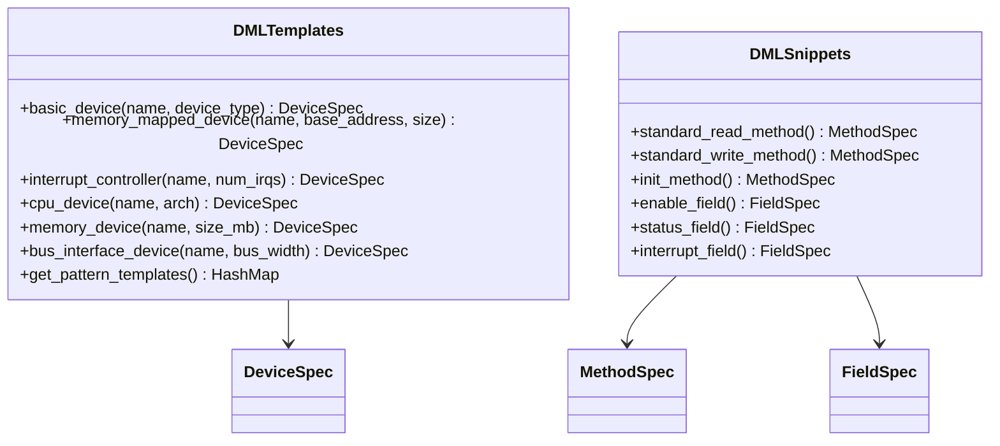
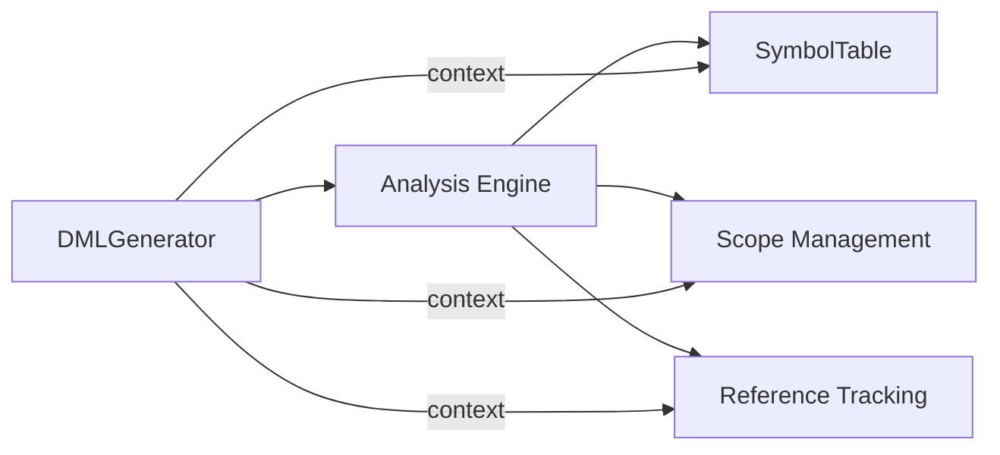
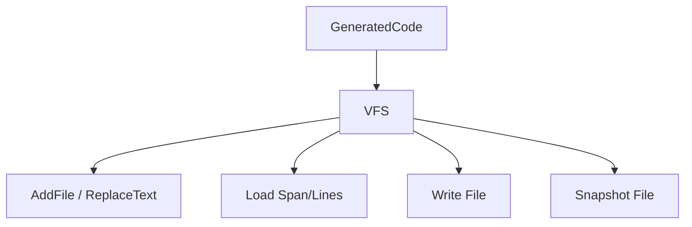
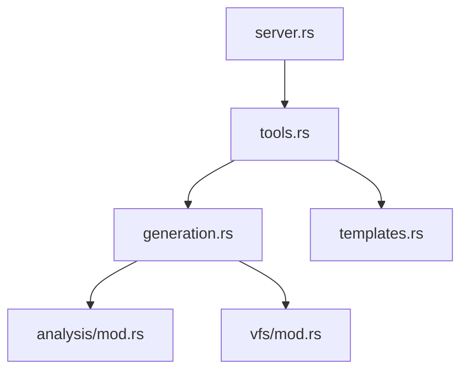

# Code Generation Engine

<cite>
**Referenced Files in This Document**
- [src/mcp/mod.rs](file://src/mcp/mod.rs)
- [src/mcp/generation.rs](file://src/mcp/generation.rs)
- [src/mcp/templates.rs](file://src/mcp/templates.rs)
- [src/mcp/server.rs](file://src/mcp/server.rs)
- [src/mcp/tools.rs](file://src/mcp/tools.rs)
- [src/mcp/main.rs](file://src/mcp/main.rs)
- [src/analysis/mod.rs](file://src/analysis/mod.rs)
- [src/vfs/mod.rs](file://src/vfs/mod.rs)
- [src/test/mcp_unit_tests.rs](file://src/test/mcp_unit_tests.rs)
- [src/test/mcp_basic_test.py](file://src/test/mcp_basic_test.py)
- [src/test/mcp_advanced_test.py](file://src/test/mcp_advanced_test.py)
- [MCP_SERVER_GUIDE.md](file://MCP_SERVER_GUIDE.md)
</cite>

## Table of Contents
1. [Introduction](#introduction)
2. [Project Structure](#project-structure)
3. [Core Components](#core-components)
4. [Architecture Overview](#architecture-overview)
5. [Detailed Component Analysis](#detailed-component-analysis)
6. [Dependency Analysis](#dependency-analysis)
7. [Performance Considerations](#performance-considerations)
8. [Troubleshooting Guide](#troubleshooting-guide)
9. [Conclusion](#conclusion)
10. [Appendices](#appendices)

## Introduction
This document describes the DML Model Context Protocol (MCP) code generation engine. It explains the generation pipeline from template selection to final code output, how the engine integrates with the analysis engine for context-aware generation, symbol resolution during generation, and validation of generated code. It also documents generation strategies, output formatting, error recovery mechanisms, examples of generation scenarios, parameter tuning, quality assurance, performance considerations for batch generation, memory management, scalability aspects, and the relationship between generation results and the virtual file system for seamless IDE integration.

## Project Structure
The MCP code generation engine resides under the MCP module and consists of:
- Server: JSON-RPC over stdio for MCP protocol handling
- Tools: Tool registry and built-in tools for generation and analysis
- Generation: Code generation engine with configuration and spec types
- Templates: Built-in device templates and patterns
- Integration: Analysis engine and virtual file system for context and persistence

**Diagram sources**
- [src/mcp/main.rs](file://src/mcp/main.rs#L1-L23)
- [src/mcp/mod.rs](file://src/mcp/mod.rs#L1-L54)
- [src/mcp/server.rs](file://src/mcp/server.rs#L1-L229)
- [src/mcp/tools.rs](file://src/mcp/tools.rs#L1-L399)
- [src/mcp/generation.rs](file://src/mcp/generation.rs#L1-L411)
- [src/mcp/templates.rs](file://src/mcp/templates.rs#L1-L428)
- [src/analysis/mod.rs](file://src/analysis/mod.rs#L1-L800)
- [src/vfs/mod.rs](file://src/vfs/mod.rs#L1-L800)

**Section sources**
- [src/mcp/mod.rs](file://src/mcp/mod.rs#L1-L54)
- [src/mcp/main.rs](file://src/mcp/main.rs#L1-L23)

## Core Components
- MCP Server: Implements JSON-RPC over stdio, handles initialize, tools/list, and tools/call, and manages server info, capabilities, and protocol version.
- Tool Registry: Registers built-in tools (device generation, register generation, method generation, analysis, validation, template generation, pattern application) and executes them.
- Generation Engine: Provides GenerationContext, GenerationConfig, DMLGenerator, and specification types (DeviceSpec, BankSpec, RegisterSpec, FieldSpec, MethodSpec, ParameterSpec). Supports configurable formatting and placeholder validation hook.
- Template Library: Provides built-in device templates (CPU, memory, peripheral, bus interface) and patterns with parameterized configurations.
- Analysis Integration: Leverages the existing analysis engine for symbol resolution and context-awareness.
- Virtual File System: Provides in-memory file caching, change tracking, and persistence for generated code.

**Section sources**
- [src/mcp/server.rs](file://src/mcp/server.rs#L1-L229)
- [src/mcp/tools.rs](file://src/mcp/tools.rs#L1-L399)
- [src/mcp/generation.rs](file://src/mcp/generation.rs#L1-L411)
- [src/mcp/templates.rs](file://src/mcp/templates.rs#L1-L428)
- [src/analysis/mod.rs](file://src/analysis/mod.rs#L1-L800)
- [src/vfs/mod.rs](file://src/vfs/mod.rs#L1-L800)

## Architecture Overview
The MCP server exposes a JSON-RPC interface over stdio. Clients call tools via tools/call with structured arguments. The tool registry resolves and executes the appropriate tool, which may use the generation engine and templates to produce DML code. Generated code can be validated and integrated into the virtual file system for IDE workflows.

**Diagram sources**
- [src/mcp/server.rs](file://src/mcp/server.rs#L88-L206)
- [src/mcp/tools.rs](file://src/mcp/tools.rs#L101-L121)
- [src/mcp/generation.rs](file://src/mcp/generation.rs#L66-L111)
- [src/mcp/templates.rs](file://src/mcp/templates.rs#L11-L358)

## Detailed Component Analysis

### MCP Server
- JSON-RPC over stdio with async I/O
- Methods: initialize, tools/list, tools/call
- Error handling with structured JsonRpcError
- Server info and capabilities exported

**Diagram sources**
- [src/mcp/server.rs](file://src/mcp/server.rs#L57-L132)

**Section sources**
- [src/mcp/server.rs](file://src/mcp/server.rs#L1-L229)

### Tool Registry and Tools
- Registers built-in tools: generate_device, generate_register, generate_method, analyze_project, validate_code, generate_template, apply_pattern
- Tool definitions include inputSchema for validation
- Tool execution returns ToolResult with content array

**Diagram sources**
- [src/mcp/tools.rs](file://src/mcp/tools.rs#L45-L121)
- [src/mcp/tools.rs](file://src/mcp/tools.rs#L125-L325)

**Section sources**
- [src/mcp/tools.rs](file://src/mcp/tools.rs#L1-L399)

### Generation Engine
- GenerationContext: device_name, namespace, imports, templates, GenerationConfig
- GenerationConfig: indent_style (Spaces(n) or Tabs), line_ending (Unix/Windows), max_line_length, generate_docs, validate_output
- DMLGenerator: generates device, register, method, bank, interface; supports configurable indentation; placeholder validation hook
- Specification types: DeviceSpec, BankSpec, RegisterSpec, FieldSpec, MethodSpec, ParameterSpec, GeneratedCode

**Diagram sources**
- [src/mcp/generation.rs](file://src/mcp/generation.rs#L8-L111)
- [src/mcp/generation.rs](file://src/mcp/generation.rs#L18-L50)
- [src/mcp/generation.rs](file://src/mcp/generation.rs#L52-L310)
- [src/mcp/generation.rs](file://src/mcp/generation.rs#L347-L353)

**Section sources**
- [src/mcp/generation.rs](file://src/mcp/generation.rs#L1-L411)

### Template Library
- DMLTemplates: provides built-in templates for device types and patterns
- Templates: basic_device, memory_mapped_device, interrupt_controller, cpu_device, memory_device, bus_interface_device
- Patterns: get_pattern_templates returns closures to generate DeviceSpec from JSON config

**Diagram sources**
- [src/mcp/templates.rs](file://src/mcp/templates.rs#L11-L358)
- [src/mcp/templates.rs](file://src/mcp/templates.rs#L364-L428)

**Section sources**
- [src/mcp/templates.rs](file://src/mcp/templates.rs#L1-L428)

### Analysis Engine Integration
- The analysis module provides symbol resolution, scope management, and device analysis
- The generation engine can leverage analysis results for context-aware generation
- Integration points include symbol tables, scope chains, and reference tracking

**Diagram sources**
- [src/analysis/mod.rs](file://src/analysis/mod.rs#L1-L800)
- [src/mcp/generation.rs](file://src/mcp/generation.rs#L1-L411)

**Section sources**
- [src/analysis/mod.rs](file://src/analysis/mod.rs#L1-L800)

### Virtual File System Integration
- VFS supports in-memory file caching, change tracking, and persistence
- Supports adding files, replacing text spans, loading spans/lines, and writing files
- Integrates with generation results for IDE workflows

**Diagram sources**
- [src/vfs/mod.rs](file://src/vfs/mod.rs#L1-L800)
- [src/mcp/generation.rs](file://src/mcp/generation.rs#L347-L353)

**Section sources**
- [src/vfs/mod.rs](file://src/vfs/mod.rs#L1-L800)

## Dependency Analysis
- MCP server depends on tool registry and capability definitions
- Tool registry depends on DMLTool trait and tool implementations
- Generation engine depends on templates and specification types
- Analysis engine provides context for symbol resolution
- VFS provides storage for generated artifacts

**Diagram sources**
- [src/mcp/server.rs](file://src/mcp/server.rs#L1-L229)
- [src/mcp/tools.rs](file://src/mcp/tools.rs#L1-L399)
- [src/mcp/generation.rs](file://src/mcp/generation.rs#L1-L411)
- [src/mcp/templates.rs](file://src/mcp/templates.rs#L1-L428)
- [src/analysis/mod.rs](file://src/analysis/mod.rs#L1-L800)
- [src/vfs/mod.rs](file://src/vfs/mod.rs#L1-L800)

**Section sources**
- [src/mcp/server.rs](file://src/mcp/server.rs#L1-L229)
- [src/mcp/tools.rs](file://src/mcp/tools.rs#L1-L399)
- [src/mcp/generation.rs](file://src/mcp/generation.rs#L1-L411)
- [src/mcp/templates.rs](file://src/mcp/templates.rs#L1-L428)
- [src/analysis/mod.rs](file://src/analysis/mod.rs#L1-L800)
- [src/vfs/mod.rs](file://src/vfs/mod.rs#L1-L800)

## Performance Considerations
- Asynchronous I/O: MCP server uses async/await with Tokio for non-blocking JSON-RPC handling
- Configurable formatting: Indentation and line endings are configurable to balance readability and performance
- Validation hook: Generation includes a placeholder for integrating with the DML parser for validation
- Scalability: Tool registry supports dynamic tool registration; templates enable rapid generation of common patterns
- Batch generation: Tools can be invoked multiple times; consider batching and caching for repeated generations

[No sources needed since this section provides general guidance]

## Troubleshooting Guide
- Initialization failures: Verify protocolVersion and capabilities in initialize request
- Tool discovery: Use tools/list to confirm available tools
- Tool execution errors: Check tool inputSchema and arguments; errors are returned as JsonRpcError with code and message
- Validation: Generation includes a validation hook; integrate with the DML parser for robust validation
- Logging: Server logs initialization, messages, and errors; configure log level appropriately

**Section sources**
- [src/mcp/server.rs](file://src/mcp/server.rs#L134-L206)
- [src/mcp/tools.rs](file://src/mcp/tools.rs#L101-L121)

## Conclusion
The DML MCP code generation engine provides a standards-compliant, extensible framework for generating DML code. It integrates with the analysis engine for context-aware generation, supports configurable formatting and validation, and leverages templates for common device patterns. Its architecture enables seamless IDE integration via the virtual file system and JSON-RPC over stdio.

[No sources needed since this section summarizes without analyzing specific files]

## Appendices

### Generation Pipeline Overview
- Template Selection: Choose built-in template or pattern based on device_type or configuration
- Specification Construction: Build DeviceSpec/BankSpec/RegisterSpec/FieldSpec/MethodSpec from parameters
- Code Generation: Use DMLGenerator to emit formatted DML code
- Validation: Optionally validate generated code against the DML parser
- Output: Return GeneratedCode with content, file_path, and dependencies

**Section sources**
- [src/mcp/templates.rs](file://src/mcp/templates.rs#L11-L358)
- [src/mcp/generation.rs](file://src/mcp/generation.rs#L66-L111)
- [src/mcp/generation.rs](file://src/mcp/generation.rs#L305-L309)

### Example Scenarios and Parameter Tuning
- Basic device generation: device_name, device_type, optional registers and interfaces
- Register generation: name, size, offset, fields, documentation
- CPU device: template_base derived from architecture
- Memory device: size_mb parameter
- Interrupt controller: num_irqs parameter
- Formatting: adjust indent_style and line_ending in GenerationConfig

**Section sources**
- [src/mcp/tools.rs](file://src/mcp/tools.rs#L183-L202)
- [src/mcp/tools.rs](file://src/mcp/tools.rs#L261-L279)
- [src/mcp/templates.rs](file://src/mcp/templates.rs#L12-L358)
- [src/mcp/generation.rs](file://src/mcp/generation.rs#L18-L50)

### Quality Assurance and Validation
- Unit tests validate generation config defaults, spec creation, generator behavior, and template patterns
- Integration tests demonstrate MCP protocol compliance and complex device generation
- Validation hook in generation engine indicates integration point with the DML parser

**Section sources**
- [src/test/mcp_unit_tests.rs](file://src/test/mcp_unit_tests.rs#L14-L406)
- [src/test/mcp_basic_test.py](file://src/test/mcp_basic_test.py#L1-L134)
- [src/test/mcp_advanced_test.py](file://src/test/mcp_advanced_test.py#L1-L184)
- [MCP_SERVER_GUIDE.md](file://MCP_SERVER_GUIDE.md#L172-L280)