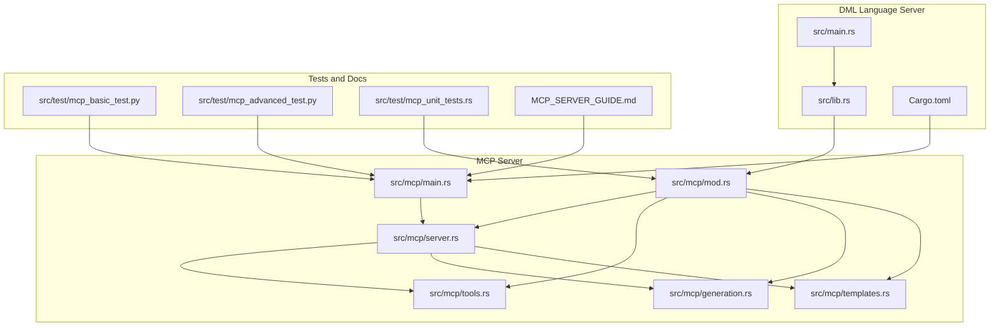
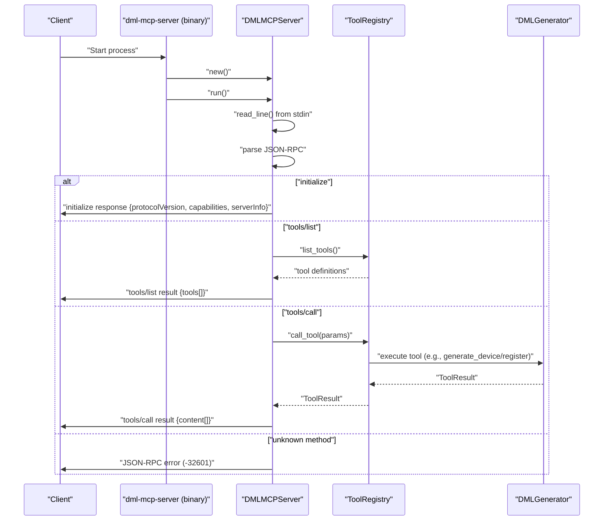
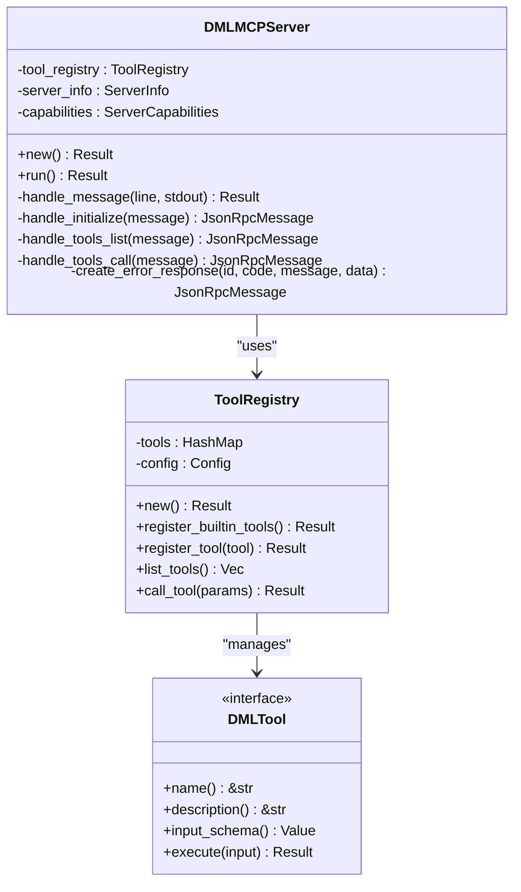
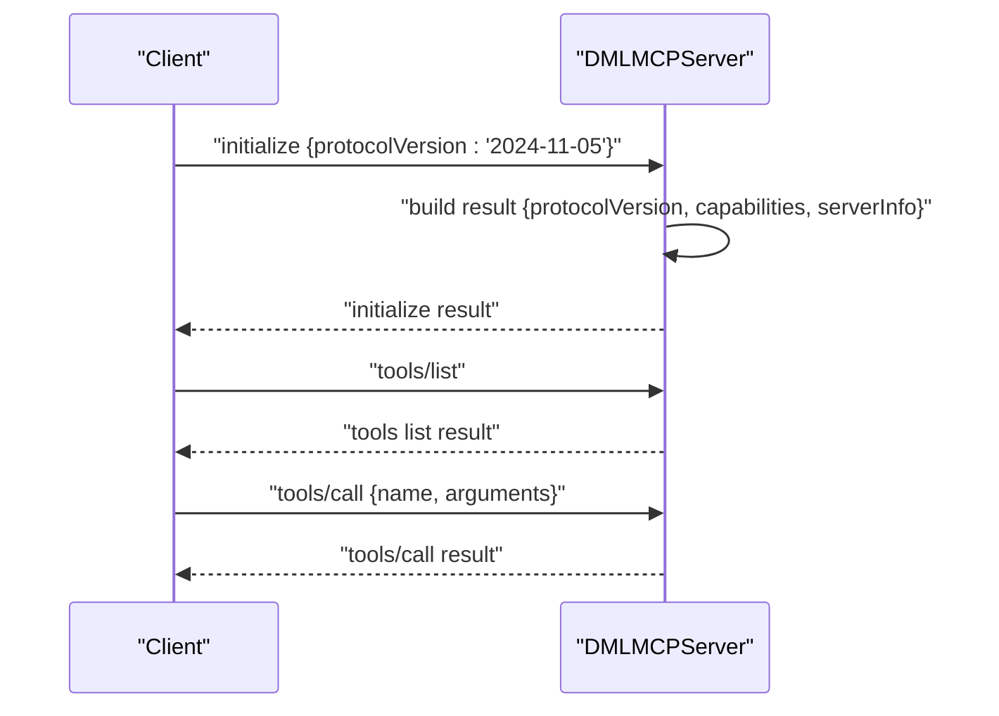
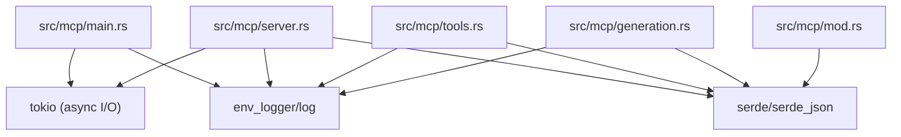

# MCP Server Architecture

<cite>
**Referenced Files in This Document**
- [src/mcp/main.rs](file://src/mcp/main.rs)
- [src/mcp/mod.rs](file://src/mcp/mod.rs)
- [src/mcp/server.rs](file://src/mcp/server.rs)
- [src/mcp/tools.rs](file://src/mcp/tools.rs)
- [src/mcp/generation.rs](file://src/mcp/generation.rs)
- [src/mcp/templates.rs](file://src/mcp/templates.rs)
- [src/lib.rs](file://src/lib.rs)
- [src/main.rs](file://src/main.rs)
- [Cargo.toml](file://Cargo.toml)
- [MCP_SERVER_GUIDE.md](file://MCP_SERVER_GUIDE.md)
- [src/test/mcp_basic_test.py](file://src/test/mcp_basic_test.py)
- [src/test/mcp_advanced_test.py](file://src/test/mcp_advanced_test.py)
- [src/test/mcp_unit_tests.rs](file://src/test/mcp_unit_tests.rs)
</cite>

## Table of Contents
1. [Introduction](#introduction)
2. [Project Structure](#project-structure)
3. [Core Components](#core-components)
4. [Architecture Overview](#architecture-overview)
5. [Detailed Component Analysis](#detailed-component-analysis)
6. [Dependency Analysis](#dependency-analysis)
7. [Performance Considerations](#performance-considerations)
8. [Troubleshooting Guide](#troubleshooting-guide)
9. [Conclusion](#conclusion)
10. [Appendices](#appendices)

## Introduction
This document explains the MCP (Model Context Protocol) server architecture embedded in the DML language server. It focuses on the DMLMCPServer implementation, server capabilities configuration, protocol version management, initialization and capability negotiation with clients, and the relationship between the MCP server and the main DML language server. It also documents the server info structure, capability flags (tools, resources, prompts, logging), integration with the analysis engine, and practical examples for configuration, client connection handling, and protocol specifications. Finally, it covers lifecycle management, error handling, and performance considerations for concurrent MCP operations.

## Project Structure
The MCP server is implemented as a dedicated binary and module within the DML language server codebase. The key files are:
- Binary entry point for the MCP server
- MCP module with protocol types, server implementation, tools, generation engine, and templates
- Relationship to the main DML language server binary
- Tests and documentation

**Diagram sources**
- [src/mcp/main.rs](file://src/mcp/main.rs#L1-L23)
- [src/mcp/mod.rs](file://src/mcp/mod.rs#L1-L54)
- [src/mcp/server.rs](file://src/mcp/server.rs#L1-L229)
- [src/mcp/tools.rs](file://src/mcp/tools.rs#L1-L399)
- [src/mcp/generation.rs](file://src/mcp/generation.rs#L1-L411)
- [src/mcp/templates.rs](file://src/mcp/templates.rs#L1-L428)
- [src/lib.rs](file://src/lib.rs#L41-L41)
- [src/main.rs](file://src/main.rs#L1-L60)
- [Cargo.toml](file://Cargo.toml#L28-L31)
- [src/test/mcp_basic_test.py](file://src/test/mcp_basic_test.py#L1-L134)
- [src/test/mcp_advanced_test.py](file://src/test/mcp_advanced_test.py#L1-L184)
- [src/test/mcp_unit_tests.rs](file://src/test/mcp_unit_tests.rs#L1-L406)
- [MCP_SERVER_GUIDE.md](file://MCP_SERVER_GUIDE.md#L1-L280)

**Section sources**
- [src/mcp/main.rs](file://src/mcp/main.rs#L1-L23)
- [src/mcp/mod.rs](file://src/mcp/mod.rs#L1-L54)
- [src/mcp/server.rs](file://src/mcp/server.rs#L1-L229)
- [src/mcp/tools.rs](file://src/mcp/tools.rs#L1-L399)
- [src/mcp/generation.rs](file://src/mcp/generation.rs#L1-L411)
- [src/mcp/templates.rs](file://src/mcp/templates.rs#L1-L428)
- [src/lib.rs](file://src/lib.rs#L41-L41)
- [src/main.rs](file://src/main.rs#L1-L60)
- [Cargo.toml](file://Cargo.toml#L28-L31)
- [MCP_SERVER_GUIDE.md](file://MCP_SERVER_GUIDE.md#L1-L280)

## Core Components
- DMLMCPServer: JSON-RPC over stdio MCP server implementing the Model Context Protocol 2024-11-05. It initializes a tool registry, handles initialize, tools/list, and tools/call requests, and responds with standardized JSON-RPC messages.
- Server info and capabilities: ServerInfo provides server metadata; ServerCapabilities defines capability flags for tools, resources, prompts, and logging.
- Tool registry: Manages built-in tools (e.g., generate_device, generate_register, generate_method, analyze_project, validate_code, generate_template, apply_pattern) with dynamic registration and JSON schema validation.
- Generation engine: Provides structured generation primitives (DeviceSpec, RegisterSpec, FieldSpec, MethodSpec) and a configurable DMLGenerator for producing DML code with formatting and optional validation.
- Templates: Offers predefined device templates and patterns (memory-mapped devices, interrupt controllers, CPUs, memories, bus interfaces) and helper snippets.

Key configuration and defaults:
- Protocol version: MCP_VERSION set to "2024-11-05".
- Server capabilities default: tools enabled, resources/prompts disabled, logging enabled.
- GenerationConfig defaults: 4-space indent, Unix line endings, max line length 100, generate docs enabled, validation enabled.

**Section sources**
- [src/mcp/mod.rs](file://src/mcp/mod.rs#L17-L54)
- [src/mcp/server.rs](file://src/mcp/server.rs#L36-L86)
- [src/mcp/tools.rs](file://src/mcp/tools.rs#L45-L121)
- [src/mcp/generation.rs](file://src/mcp/generation.rs#L18-L50)
- [src/mcp/generation.rs](file://src/mcp/generation.rs#L52-L310)
- [src/mcp/templates.rs](file://src/mcp/templates.rs#L8-L359)

## Architecture Overview
The MCP server runs as a separate binary and communicates with clients over stdin/stdout using JSON-RPC 2.0. The server:
- Initializes logging and creates a DMLMCPServer instance.
- Reads lines from stdin, parses JSON-RPC messages, and routes to handlers.
- Responds with JSON-RPC responses containing either result or error fields.
- Supports capability negotiation via the initialize method and tool discovery via tools/list.

**Diagram sources**
- [src/mcp/main.rs](file://src/mcp/main.rs#L11-L23)
- [src/mcp/server.rs](file://src/mcp/server.rs#L57-L132)
- [src/mcp/server.rs](file://src/mcp/server.rs#L134-L206)
- [src/mcp/tools.rs](file://src/mcp/tools.rs#L101-L121)
- [src/mcp/generation.rs](file://src/mcp/generation.rs#L58-L111)

**Section sources**
- [src/mcp/main.rs](file://src/mcp/main.rs#L11-L23)
- [src/mcp/server.rs](file://src/mcp/server.rs#L57-L132)
- [src/mcp/server.rs](file://src/mcp/server.rs#L134-L206)

## Detailed Component Analysis

### DMLMCPServer Implementation
DMLMCPServer encapsulates:
- A ToolRegistry for tool discovery and execution.
- ServerInfo and ServerCapabilities for metadata and capability negotiation.
- Message handling for initialize, tools/list, and tools/call with proper JSON-RPC error responses.

Processing logic:
- Reads newline-delimited JSON-RPC messages from stdin.
- Routes to handle_initialize, handle_tools_list, or handle_tools_call based on method.
- Returns responses with id matching the request and either result or error fields.
- Unknown methods return JSON-RPC error -32601.

**Diagram sources**
- [src/mcp/server.rs](file://src/mcp/server.rs#L36-L86)
- [src/mcp/tools.rs](file://src/mcp/tools.rs#L45-L121)

**Section sources**
- [src/mcp/server.rs](file://src/mcp/server.rs#L36-L229)
- [src/mcp/tools.rs](file://src/mcp/tools.rs#L36-L121)

### Server Capabilities Configuration and Protocol Version Management
- Protocol version: MCP_VERSION constant set to "2024-11-05".
- ServerInfo: Default name "dml-mcp-server" and version from package metadata.
- ServerCapabilities: Default flags indicate tools enabled and logging enabled; resources and prompts disabled.

Negotiation flow:
- Clients call initialize with protocolVersion and receive serverInfo, capabilities, and protocolVersion in response.

**Section sources**
- [src/mcp/mod.rs](file://src/mcp/mod.rs#L17-L54)
- [src/mcp/server.rs](file://src/mcp/server.rs#L134-L152)

### Server Initialization Process and Capability Negotiation
Initialization sequence:
- Binary initializes logging and constructs DMLMCPServer.
- Server reads stdin line-by-line and parses JSON-RPC.
- On initialize, server responds with protocolVersion, capabilities, and serverInfo.
- Clients can then call tools/list to discover tools and tools/call to execute them.

**Diagram sources**
- [src/mcp/server.rs](file://src/mcp/server.rs#L134-L206)
- [src/test/mcp_basic_test.py](file://src/test/mcp_basic_test.py#L54-L72)

**Section sources**
- [src/mcp/server.rs](file://src/mcp/server.rs#L134-L206)
- [src/test/mcp_basic_test.py](file://src/test/mcp_basic_test.py#L54-L72)

### Relationship Between MCP and the Main DML Language Server
- The MCP server is a separate binary (dml-mcp-server) built alongside the main DML language server binary (dls).
- Both share the dls library crate and can leverage the same analysis and generation infrastructure.
- The MCP server exposes code generation tools and templates via the MCP protocol, while the main DLS provides LSP-based IDE integration.

**Section sources**
- [Cargo.toml](file://Cargo.toml#L28-L31)
- [src/lib.rs](file://src/lib.rs#L41-L41)
- [src/main.rs](file://src/main.rs#L15-L59)

### Server Info Structure and Capability Flags
- ServerInfo: name and version fields.
- ServerCapabilities: tools, resources, prompts, logging booleans.
- Defaults reflect a focus on tool-based generation and logging, with resources and prompts disabled.

**Section sources**
- [src/mcp/mod.rs](file://src/mcp/mod.rs#L20-L54)

### Integration with the Analysis Engine
- The MCP tools and generation engine operate independently of the LSP server but reuse shared types and configuration.
- GenerationConfig and GenerationContext define formatting and validation behavior; DMLGenerator composes device, register, field, and method code.
- Templates module provides predefined device patterns and helper snippets.

**Section sources**
- [src/mcp/generation.rs](file://src/mcp/generation.rs#L8-L50)
- [src/mcp/generation.rs](file://src/mcp/generation.rs#L52-L310)
- [src/mcp/templates.rs](file://src/mcp/templates.rs#L8-L359)

### Practical Examples
- Building and running the MCP server:
  - Build: cargo build --bin dml-mcp-server
  - Run: ./target/debug/dml-mcp-server
- Client integration examples:
  - Claude Desktop MCP configuration and command-line invocation are documented in the guide.
- Tool usage examples:
  - generate_device, generate_register, and other tools are demonstrated in the test scripts.

**Section sources**
- [MCP_SERVER_GUIDE.md](file://MCP_SERVER_GUIDE.md#L9-L33)
- [MCP_SERVER_GUIDE.md](file://MCP_SERVER_GUIDE.md#L146-L170)
- [src/test/mcp_basic_test.py](file://src/test/mcp_basic_test.py#L86-L115)
- [src/test/mcp_advanced_test.py](file://src/test/mcp_advanced_test.py#L54-L170)

## Dependency Analysis
The MCP server depends on:
- tokio for async I/O over stdio.
- serde/serde_json for JSON serialization/deserialization.
- log/env_logger for logging.
- The dls crate for shared types and configuration.

**Diagram sources**
- [src/mcp/main.rs](file://src/mcp/main.rs#L6-L9)
- [src/mcp/server.rs](file://src/mcp/server.rs#L3-L7)
- [src/mcp/tools.rs](file://src/mcp/tools.rs#L3-L8)
- [src/mcp/generation.rs](file://src/mcp/generation.rs#L3-L6)
- [src/mcp/mod.rs](file://src/mcp/mod.rs#L15-L15)

**Section sources**
- [Cargo.toml](file://Cargo.toml#L33-L62)
- [src/mcp/main.rs](file://src/mcp/main.rs#L6-L9)
- [src/mcp/server.rs](file://src/mcp/server.rs#L3-L7)
- [src/mcp/tools.rs](file://src/mcp/tools.rs#L3-L8)
- [src/mcp/generation.rs](file://src/mcp/generation.rs#L3-L6)
- [src/mcp/mod.rs](file://src/mcp/mod.rs#L15-L15)

## Performance Considerations
- Concurrency: The server uses async I/O and processes one message at a time per connection. For concurrent clients, run multiple instances or gate clients at the process level.
- Throughput: JSON parsing and response writing are lightweight; most cost comes from tool execution and generation. Keep tool argument schemas minimal and validated early.
- Memory: GenerationConfig allows tuning formatting and validation overhead. Disable validation in hot paths if needed.
- Startup: Fast binary startup and minimal initialization reduce latency for short-lived client sessions.

[No sources needed since this section provides general guidance]

## Troubleshooting Guide
Common issues and resolutions:
- JSON parse errors: Ensure clients send valid JSON-RPC 2.0 messages with proper method and id fields.
- Unknown method errors: Verify client method names match supported methods (initialize, tools/list, tools/call).
- Tool execution failures: Check tool input schemas and required fields; see tool input schemas in tools.rs.
- EOF or read errors: Indicates client termination or broken pipe; server shuts down gracefully.

Logging:
- Enable verbose logging during development to inspect message flow and errors.

**Section sources**
- [src/mcp/server.rs](file://src/mcp/server.rs#L68-L83)
- [src/mcp/server.rs](file://src/mcp/server.rs#L104-L122)
- [src/mcp/server.rs](file://src/mcp/server.rs#L188-L196)
- [src/test/mcp_basic_test.py](file://src/test/mcp_basic_test.py#L37-L131)

## Conclusion
The DML MCP server provides a standards-compliant, extensible platform for AI-assisted DML code generation. It cleanly separates concerns between protocol handling, tool management, and generation, while sharing infrastructure with the main DML language server. With clear capability flags, robust error handling, and comprehensive tests, it is production-ready for integration with modern IDEs and AI tools.

[No sources needed since this section summarizes without analyzing specific files]

## Appendices

### Protocol Specifications
- Transport: stdin/stdout JSON-RPC 2.0 over newline-delimited messages.
- Methods:
  - initialize: negotiate protocolVersion and return serverInfo and capabilities.
  - tools/list: list available tools with descriptions and input schemas.
  - tools/call: execute a named tool with arguments; returns content array.
- Error codes:
  - -32601: Method not found
  - -32602: Invalid params
  - -32603: Internal error

**Section sources**
- [src/mcp/server.rs](file://src/mcp/server.rs#L104-L122)
- [src/mcp/server.rs](file://src/mcp/server.rs#L199-L205)
- [src/mcp/server.rs](file://src/mcp/server.rs#L208-L228)

### Server Lifecycle Management
- Startup: Binary initializes logging, constructs DMLMCPServer, and begins reading stdin.
- Runtime: Loop reads lines, parses JSON-RPC, dispatches to handlers, writes responses, flushes stdout.
- Shutdown: EOF triggers graceful shutdown; errors may terminate the process.

**Section sources**
- [src/mcp/main.rs](file://src/mcp/main.rs#L11-L23)
- [src/mcp/server.rs](file://src/mcp/server.rs#L57-L86)

### Tool Registry and Built-in Tools
- Registration: Built-in tools registered at startup; supports dynamic addition.
- Execution: Validates presence of name and arguments; executes tool and serializes result.

**Section sources**
- [src/mcp/tools.rs](file://src/mcp/tools.rs#L51-L81)
- [src/mcp/tools.rs](file://src/mcp/tools.rs#L101-L121)

### Generation Engine and Templates
- GenerationConfig: Controls indentation, line endings, line length, documentation generation, and output validation.
- DMLGenerator: Composes device, register, field, and method code according to specs.
- Templates: Provides predefined device patterns and helper snippets.

**Section sources**
- [src/mcp/generation.rs](file://src/mcp/generation.rs#L18-L50)
- [src/mcp/generation.rs](file://src/mcp/generation.rs#L58-L111)
- [src/mcp/templates.rs](file://src/mcp/templates.rs#L11-L359)