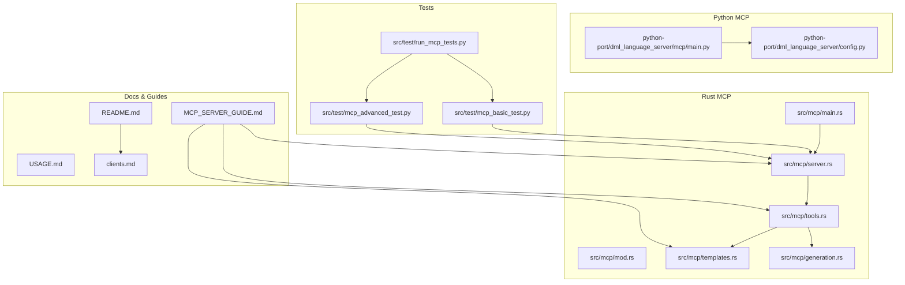
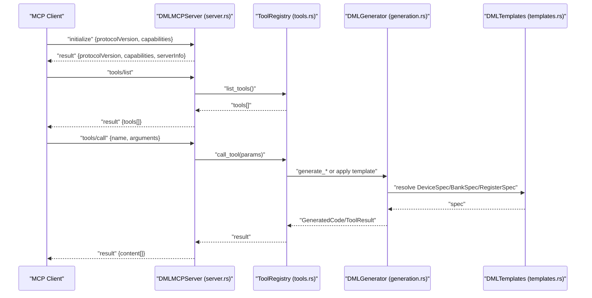
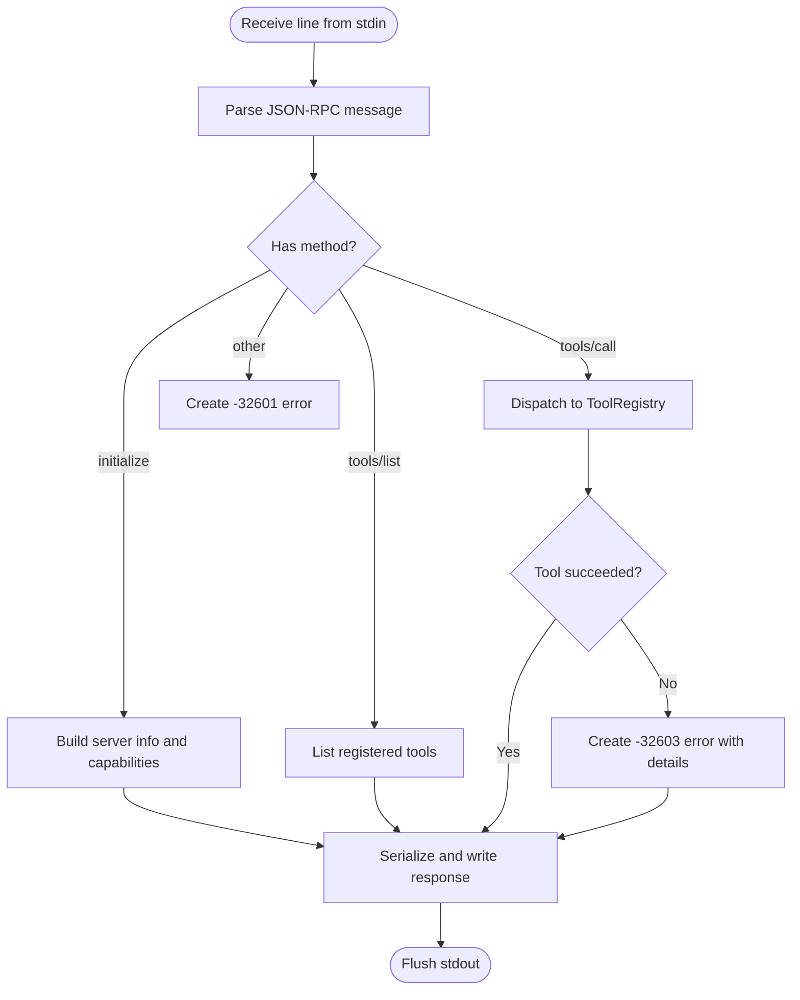
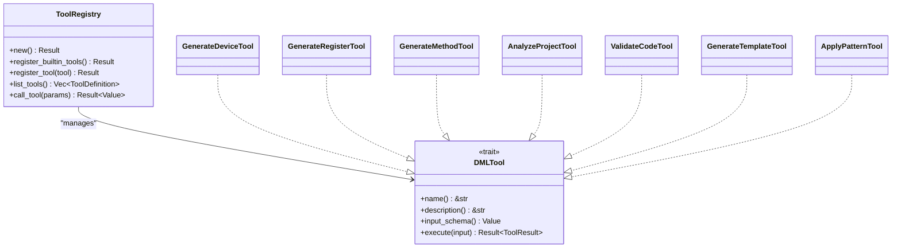
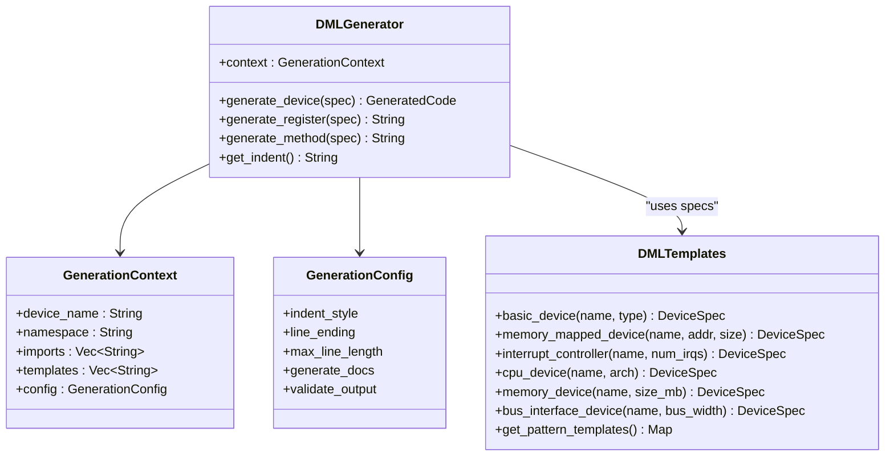
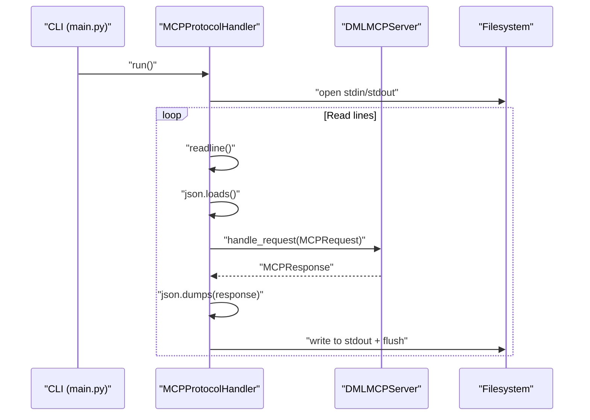
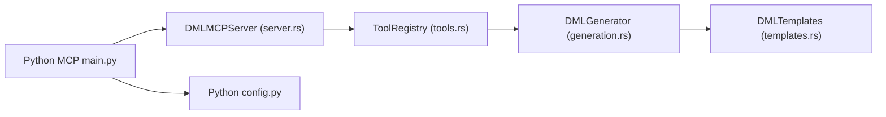

# Model Context Protocol

<cite>
**Referenced Files in This Document**
- [src/mcp/mod.rs](file://src/mcp/mod.rs)
- [src/mcp/main.rs](file://src/mcp/main.rs)
- [src/mcp/server.rs](file://src/mcp/server.rs)
- [src/mcp/tools.rs](file://src/mcp/tools.rs)
- [src/mcp/templates.rs](file://src/mcp/templates.rs)
- [src/mcp/generation.rs](file://src/mcp/generation.rs)
- [python-port/dml_language_server/mcp/main.py](file://python-port/dml_language_server/mcp/main.py)
- [MCP_SERVER_GUIDE.md](file://MCP_SERVER_GUIDE.md)
- [src/test/mcp_basic_test.py](file://src/test/mcp_basic_test.py)
- [src/test/mcp_advanced_test.py](file://src/test/mcp_advanced_test.py)
- [src/test/run_mcp_tests.py](file://src/test/run_mcp_tests.py)
- [src/config.rs](file://src/config.rs)
- [python-port/dml_language_server/config.py](file://python-port/dml_language_server/config.py)
- [README.md](file://README.md)
- [USAGE.md](file://USAGE.md)
- [clients.md](file://clients.md)
</cite>

## Table of Contents
1. [Introduction](#introduction)
2. [Project Structure](#project-structure)
3. [Core Components](#core-components)
4. [Architecture Overview](#architecture-overview)
5. [Detailed Component Analysis](#detailed-component-analysis)
6. [Dependency Analysis](#dependency-analysis)
7. [Performance Considerations](#performance-considerations)
8. [Troubleshooting Guide](#troubleshooting-guide)
9. [Conclusion](#conclusion)
10. [Appendices](#appendices)

## Introduction
This document explains the Model Context Protocol (MCP) implementation for DML development within the DML Language Server (DLS). It covers the MCP server architecture, the tool registry system, and template-based code generation capabilities. It also documents MCP server configuration, client connection handling, protocol specifications, and integration with the analysis engine for context-aware assistance. Practical examples demonstrate MCP tool usage, template customization, and extending the tool registry with custom analysis utilities. Finally, it compares MCP with traditional LSP features, outlines performance and security considerations, and provides best practices for integrating MCP into development workflows.

## Project Structure
The MCP implementation spans both Rust and Python ports:
- Rust MCP server entry point and runtime
- MCP protocol handler and tool registry
- Code generation engine and template library
- Python MCP protocol handler and configuration loader
- Test suites and integration examples

**Diagram sources**
- [src/mcp/main.rs](file://src/mcp/main.rs#L1-L23)
- [src/mcp/server.rs](file://src/mcp/server.rs#L1-L229)
- [src/mcp/tools.rs](file://src/mcp/tools.rs#L1-L399)
- [src/mcp/templates.rs](file://src/mcp/templates.rs#L1-L428)
- [src/mcp/generation.rs](file://src/mcp/generation.rs#L1-L411)
- [python-port/dml_language_server/mcp/main.py](file://python-port/dml_language_server/mcp/main.py#L1-L166)
- [python-port/dml_language_server/config.py](file://python-port/dml_language_server/config.py#L1-L311)
- [src/test/mcp_basic_test.py](file://src/test/mcp_basic_test.py#L1-L134)
- [src/test/mcp_advanced_test.py](file://src/test/mcp_advanced_test.py#L1-L184)
- [src/test/run_mcp_tests.py](file://src/test/run_mcp_tests.py#L1-L104)
- [MCP_SERVER_GUIDE.md](file://MCP_SERVER_GUIDE.md#L1-L280)
- [README.md](file://README.md#L1-L57)
- [USAGE.md](file://USAGE.md#L1-L48)
- [clients.md](file://clients.md#L1-L191)

**Section sources**
- [src/mcp/main.rs](file://src/mcp/main.rs#L1-L23)
- [src/mcp/server.rs](file://src/mcp/server.rs#L1-L229)
- [src/mcp/tools.rs](file://src/mcp/tools.rs#L1-L399)
- [src/mcp/templates.rs](file://src/mcp/templates.rs#L1-L428)
- [src/mcp/generation.rs](file://src/mcp/generation.rs#L1-L411)
- [python-port/dml_language_server/mcp/main.py](file://python-port/dml_language_server/mcp/main.py#L1-L166)
- [python-port/dml_language_server/config.py](file://python-port/dml_language_server/config.py#L1-L311)
- [MCP_SERVER_GUIDE.md](file://MCP_SERVER_GUIDE.md#L1-L280)
- [src/test/mcp_basic_test.py](file://src/test/mcp_basic_test.py#L1-L134)
- [src/test/mcp_advanced_test.py](file://src/test/mcp_advanced_test.py#L1-L184)
- [src/test/run_mcp_tests.py](file://src/test/run_mcp_tests.py#L1-L104)
- [README.md](file://README.md#L1-L57)
- [USAGE.md](file://USAGE.md#L1-L48)
- [clients.md](file://clients.md#L1-L191)

## Core Components
- MCP server entry point and runtime
  - Initializes logging, constructs the MCP server, and runs the event loop.
  - See [src/mcp/main.rs](file://src/mcp/main.rs#L1-L23).
- MCP protocol handler
  - Implements JSON-RPC over stdio, handles initialize, tools/list, and tools/call.
  - See [src/mcp/server.rs](file://src/mcp/server.rs#L1-L229).
- Tool registry and tools
  - Registers built-in tools, lists tools, and executes tool calls with JSON schema validation.
  - See [src/mcp/tools.rs](file://src/mcp/tools.rs#L1-L399).
- Code generation engine and templates
  - Provides specification types, generation context, and template-based generation for DML devices, registers, methods, and fields.
  - See [src/mcp/generation.rs](file://src/mcp/generation.rs#L1-L411) and [src/mcp/templates.rs](file://src/mcp/templates.rs#L1-L428).
- Python MCP protocol handler and configuration
  - Handles MCP protocol over stdio, CLI options, and compile commands loading.
  - See [python-port/dml_language_server/mcp/main.py](file://python-port/dml_language_server/mcp/main.py#L1-L166) and [python-port/dml_language_server/config.py](file://python-port/dml_language_server/config.py#L1-L311).
- Tests and integration examples
  - Basic and advanced test scripts demonstrate MCP protocol compliance and generation scenarios.
  - See [src/test/mcp_basic_test.py](file://src/test/mcp_basic_test.py#L1-L134), [src/test/mcp_advanced_test.py](file://src/test/mcp_advanced_test.py#L1-L184), and [src/test/run_mcp_tests.py](file://src/test/run_mcp_tests.py#L1-L104).
- MCP server guide and documentation
  - Quick start, tool catalog, architecture overview, configuration, and integration examples.
  - See [MCP_SERVER_GUIDE.md](file://MCP_SERVER_GUIDE.md#L1-L280).

**Section sources**
- [src/mcp/main.rs](file://src/mcp/main.rs#L1-L23)
- [src/mcp/server.rs](file://src/mcp/server.rs#L1-L229)
- [src/mcp/tools.rs](file://src/mcp/tools.rs#L1-L399)
- [src/mcp/generation.rs](file://src/mcp/generation.rs#L1-L411)
- [src/mcp/templates.rs](file://src/mcp/templates.rs#L1-L428)
- [python-port/dml_language_server/mcp/main.py](file://python-port/dml_language_server/mcp/main.py#L1-L166)
- [python-port/dml_language_server/config.py](file://python-port/dml_language_server/config.py#L1-L311)
- [src/test/mcp_basic_test.py](file://src/test/mcp_basic_test.py#L1-L134)
- [src/test/mcp_advanced_test.py](file://src/test/mcp_advanced_test.py#L1-L184)
- [src/test/run_mcp_tests.py](file://src/test/run_mcp_tests.py#L1-L104)
- [MCP_SERVER_GUIDE.md](file://MCP_SERVER_GUIDE.md#L1-L280)

## Architecture Overview
The MCP server exposes a JSON-RPC interface over stdio. Clients initialize the server, discover tools, and invoke tools to generate DML code. The tool registry encapsulates tool definitions and execution, delegating generation to the code generation engine and template library.

**Diagram sources**
- [src/mcp/server.rs](file://src/mcp/server.rs#L104-L206)
- [src/mcp/tools.rs](file://src/mcp/tools.rs#L90-L121)
- [src/mcp/generation.rs](file://src/mcp/generation.rs#L66-L111)
- [src/mcp/templates.rs](file://src/mcp/templates.rs#L11-L358)

**Section sources**
- [src/mcp/server.rs](file://src/mcp/server.rs#L1-L229)
- [src/mcp/tools.rs](file://src/mcp/tools.rs#L1-L399)
- [src/mcp/generation.rs](file://src/mcp/generation.rs#L1-L411)
- [src/mcp/templates.rs](file://src/mcp/templates.rs#L1-L428)

## Detailed Component Analysis

### MCP Server (JSON-RPC over stdio)
- Responsibilities
  - Initialize server capabilities and info
  - List available tools
  - Execute tool calls with structured input validation
  - Respond with JSON-RPC results or standardized errors
- Protocol specifics
  - Methods: initialize, tools/list, tools/call
  - Error codes align with JSON-RPC 2.0 and MCP expectations
- Logging and lifecycle
  - Uses structured logging; reads stdin line-by-line; writes responses to stdout with trailing newline

**Diagram sources**
- [src/mcp/server.rs](file://src/mcp/server.rs#L88-L132)

**Section sources**
- [src/mcp/server.rs](file://src/mcp/server.rs#L1-L229)

### Tool Registry and Tools
- Tool registry
  - Dynamically registers built-in tools
  - Lists tools with descriptions and input schemas
  - Executes tools by name with argument validation
- Built-in tools
  - Device generation, register generation, method generation, project analysis, code validation, template generation, pattern application
  - Input schemas define required and optional parameters
- Execution model
  - Tools return structured results with content arrays
  - Unknown tools produce standardized errors

**Diagram sources**
- [src/mcp/tools.rs](file://src/mcp/tools.rs#L45-L121)
- [src/mcp/tools.rs](file://src/mcp/tools.rs#L125-L325)

**Section sources**
- [src/mcp/tools.rs](file://src/mcp/tools.rs#L1-L399)

### Code Generation Engine and Templates
- Generation context and configuration
  - Controls indentation, line endings, documentation generation, and output validation
- Specification types
  - DeviceSpec, BankSpec, RegisterSpec, FieldSpec, MethodSpec, ParameterSpec
- Template library
  - Predefined device templates (CPU, memory, peripheral), design patterns, and reusable snippets
- Generation pipeline
  - Generates device headers, declarations, banks, registers, fields, methods, and interfaces
  - Applies formatting and optional validation

**Diagram sources**
- [src/mcp/generation.rs](file://src/mcp/generation.rs#L8-L50)
- [src/mcp/generation.rs](file://src/mcp/generation.rs#L52-L310)
- [src/mcp/templates.rs](file://src/mcp/templates.rs#L11-L358)

**Section sources**
- [src/mcp/generation.rs](file://src/mcp/generation.rs#L1-L411)
- [src/mcp/templates.rs](file://src/mcp/templates.rs#L1-L428)

### Python MCP Protocol Handler and Configuration
- Protocol handler
  - Reads from stdin, parses JSON-RPC, invokes server.handle_request, writes responses to stdout
  - Robust error handling for malformed JSON and runtime exceptions
- CLI and configuration
  - Click-based CLI with options for verbosity, compile info, and log file
  - Loads compile commands and applies logging configuration

**Diagram sources**
- [python-port/dml_language_server/mcp/main.py](file://python-port/dml_language_server/mcp/main.py#L22-L96)

**Section sources**
- [python-port/dml_language_server/mcp/main.py](file://python-port/dml_language_server/mcp/main.py#L1-L166)
- [python-port/dml_language_server/config.py](file://python-port/dml_language_server/config.py#L1-L311)

### MCP Server Configuration and Capabilities
- Server info and capabilities
  - Name, version, and capability flags for tools, resources, prompts, and logging
- Generation configuration
  - Indent style, line ending, max line length, documentation generation, and validation toggle
- Server capabilities
  - Tools enabled, resources disabled, prompts disabled, logging enabled

**Section sources**
- [src/mcp/mod.rs](file://src/mcp/mod.rs#L17-L54)
- [src/mcp/generation.rs](file://src/mcp/generation.rs#L18-L50)
- [MCP_SERVER_GUIDE.md](file://MCP_SERVER_GUIDE.md#L223-L244)

### Practical Examples of MCP Tool Usage
- Device generation
  - Example arguments include device name, type, registers, interfaces, and template base
  - Generated output demonstrates proper DML 1.4 syntax and structure
- Register generation
  - Example arguments include name, size, offset, fields, and documentation
- CPU, memory, and peripheral device generation
  - Demonstrates pattern-based generation with predefined templates
- Integration examples
  - Claude Desktop integration and command-line usage patterns

**Section sources**
- [MCP_SERVER_GUIDE.md](file://MCP_SERVER_GUIDE.md#L35-L107)
- [MCP_SERVER_GUIDE.md](file://MCP_SERVER_GUIDE.md#L144-L171)
- [src/test/mcp_basic_test.py](file://src/test/mcp_basic_test.py#L86-L115)
- [src/test/mcp_advanced_test.py](file://src/test/mcp_advanced_test.py#L54-L170)

### Template Customization and Extending the Tool Registry
- Template customization
  - Use pattern templates and specification types to customize device structure, banks, registers, fields, and methods
- Extending the tool registry
  - Implement DMLTool trait, define input schema, and register tool in ToolRegistry
  - Add new tools to the built-in registration routine

**Section sources**
- [src/mcp/templates.rs](file://src/mcp/templates.rs#L327-L358)
- [src/mcp/tools.rs](file://src/mcp/tools.rs#L66-L88)
- [src/mcp/tools.rs](file://src/mcp/tools.rs#L37-L43)

### Relationship Between MCP and Traditional LSP Features
- MCP complements LSP by focusing on AI-assisted code generation and analysis via tools
- LSP provides IDE integration, diagnostics, navigation, and configuration
- Together they enable context-aware assistance and automated code generation

**Section sources**
- [README.md](file://README.md#L7-L16)
- [clients.md](file://clients.md#L63-L98)

## Dependency Analysis
The MCP subsystem depends on the generation engine and templates for code synthesis. The Python port provides an alternate MCP runtime and configuration loader.

**Diagram sources**
- [src/mcp/server.rs](file://src/mcp/server.rs#L37-L54)
- [src/mcp/tools.rs](file://src/mcp/tools.rs#L45-L88)
- [src/mcp/generation.rs](file://src/mcp/generation.rs#L52-L64)
- [src/mcp/templates.rs](file://src/mcp/templates.rs#L8-L31)
- [python-port/dml_language_server/mcp/main.py](file://python-port/dml_language_server/mcp/main.py#L1-L166)
- [python-port/dml_language_server/config.py](file://python-port/dml_language_server/config.py#L1-L311)

**Section sources**
- [src/mcp/server.rs](file://src/mcp/server.rs#L1-L229)
- [src/mcp/tools.rs](file://src/mcp/tools.rs#L1-L399)
- [src/mcp/generation.rs](file://src/mcp/generation.rs#L1-L411)
- [src/mcp/templates.rs](file://src/mcp/templates.rs#L1-L428)
- [python-port/dml_language_server/mcp/main.py](file://python-port/dml_language_server/mcp/main.py#L1-L166)
- [python-port/dml_language_server/config.py](file://python-port/dml_language_server/config.py#L1-L311)

## Performance Considerations
- Async/await with Tokio ensures non-blocking IO over stdio
- Fast startup and efficient code generation minimize latency
- Validation can be toggled to balance quality and speed
- Memory safety and minimal memory footprint in Rust implementation

**Section sources**
- [MCP_SERVER_GUIDE.md](file://MCP_SERVER_GUIDE.md#L197-L222)
- [src/mcp/generation.rs](file://src/mcp/generation.rs#L305-L309)

## Troubleshooting Guide
- Protocol compliance
  - Verify initialize, tools/list, and tools/call responses conform to JSON-RPC 2.0 and MCP 2024-11-05
- Tool execution errors
  - Inspect tool input schemas and required parameters
  - Review tool execution logs for failures
- Test harness
  - Use provided test scripts to validate server behavior and generation outputs
- Logging
  - Enable verbose logging via CLI options to diagnose issues

**Section sources**
- [src/mcp/server.rs](file://src/mcp/server.rs#L104-L132)
- [src/test/mcp_basic_test.py](file://src/test/mcp_basic_test.py#L37-L131)
- [src/test/mcp_advanced_test.py](file://src/test/mcp_advanced_test.py#L33-L181)
- [python-port/dml_language_server/mcp/main.py](file://python-port/dml_language_server/mcp/main.py#L115-L162)

## Conclusion
The MCP implementation integrates seamlessly with the DML Language Server to deliver AI-assisted development features. The MCP server provides a standards-compliant JSON-RPC interface, a robust tool registry, and a powerful code generation engine backed by rich templates. Together with LSP, MCP enables modern, context-aware development workflows for DML projects, with strong performance, extensibility, and reliability characteristics.

## Appendices

### MCP Protocol Specifications
- Protocol version: MCP 2024-11-05
- Methods: initialize, tools/list, tools/call
- Error codes: -32601 (Method not found), -32602 (Invalid params), -32603 (Internal error), -32700 (Parse error)

**Section sources**
- [src/mcp/server.rs](file://src/mcp/server.rs#L104-L132)
- [src/mcp/server.rs](file://src/mcp/server.rs#L208-L228)

### Best Practices for Leveraging MCP Features
- Use pattern templates to bootstrap device designs quickly
- Extend the tool registry with domain-specific analysis utilities
- Integrate MCP with AI assistants and IDEs for context-aware code generation
- Configure generation settings to match team style guides
- Keep MCP server updated and monitor logs for operational health

**Section sources**
- [MCP_SERVER_GUIDE.md](file://MCP_SERVER_GUIDE.md#L246-L268)
- [src/mcp/tools.rs](file://src/mcp/tools.rs#L66-L88)
- [src/mcp/generation.rs](file://src/mcp/generation.rs#L18-L50)