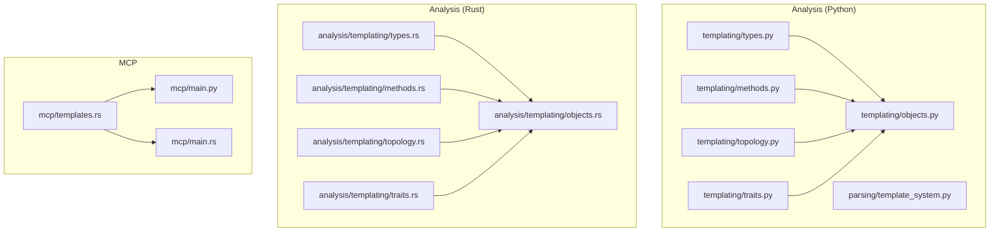
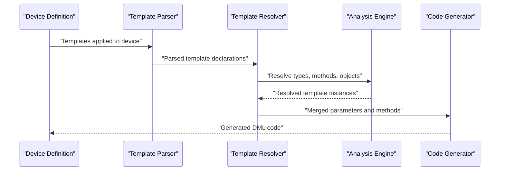
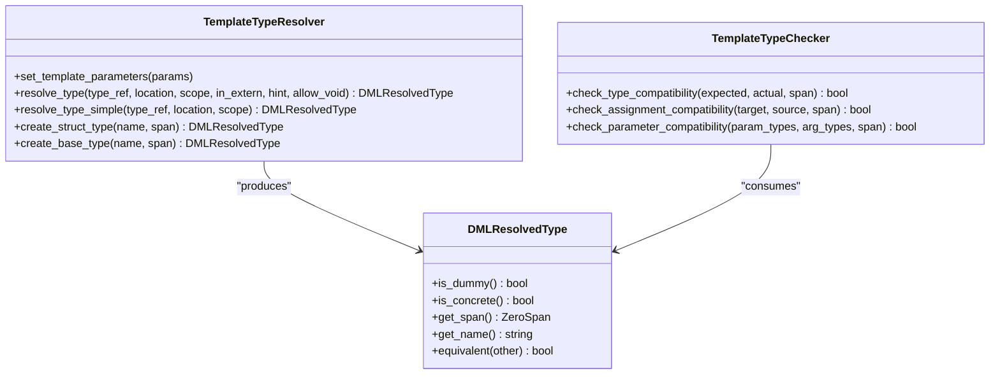
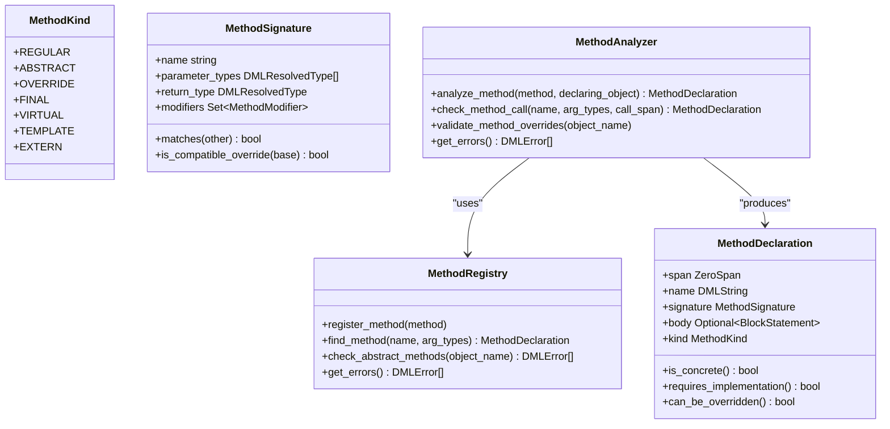
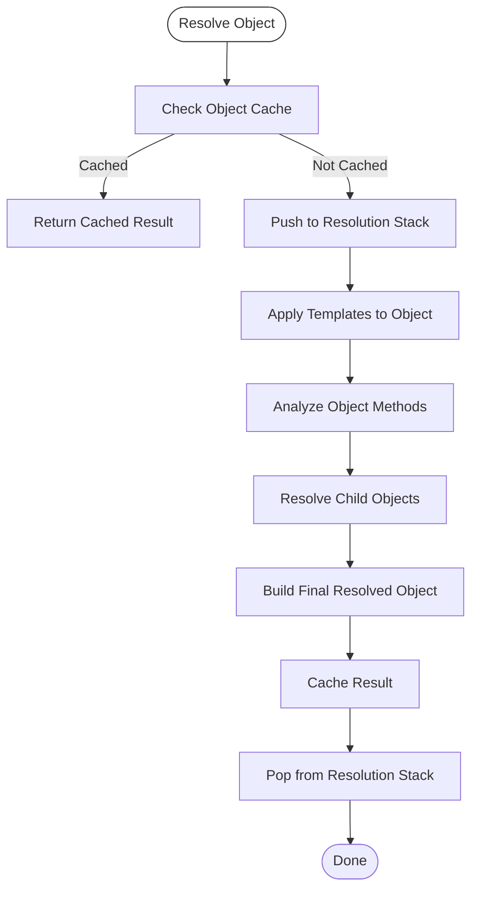
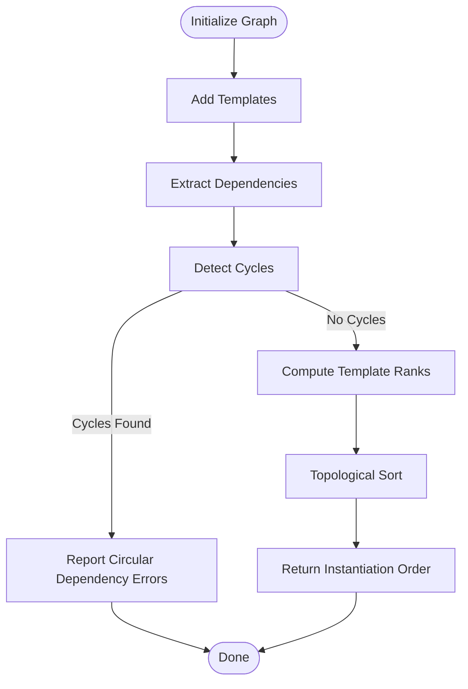
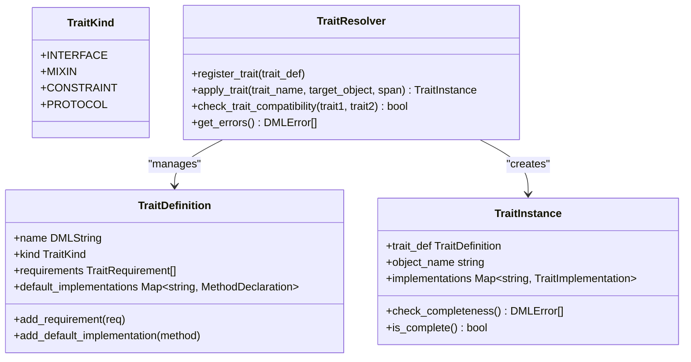
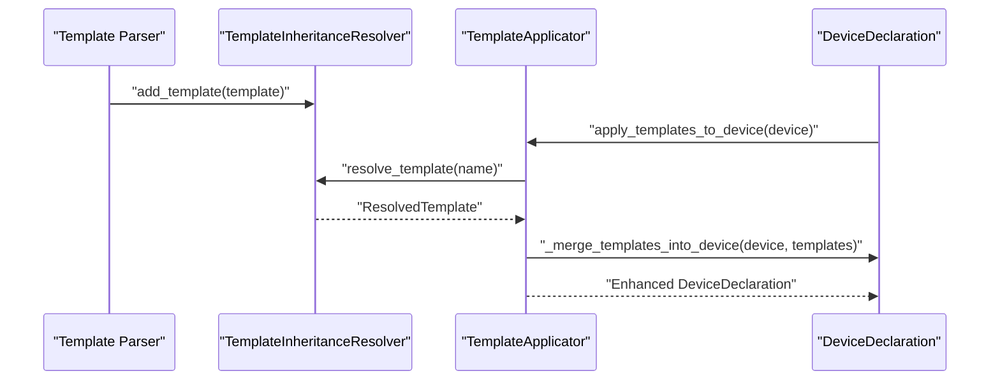
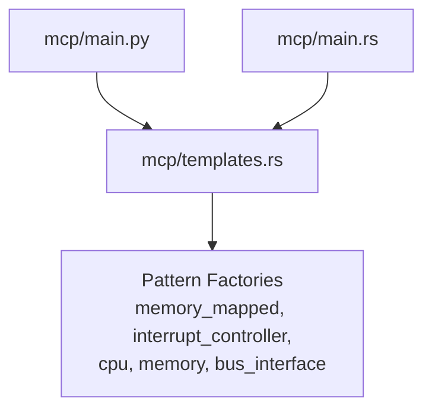
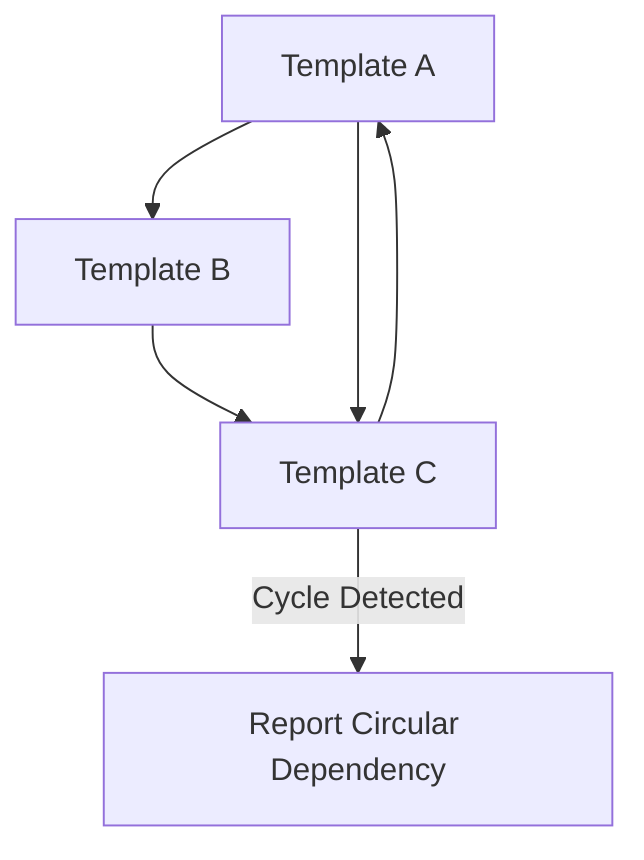

# Template System

<cite>
**Referenced Files in This Document**
- [python-port/dml_language_server/analysis/templating/__init__.py](file://python-port/dml_language_server/analysis/templating/__init__.py)
- [python-port/dml_language_server/analysis/templating/types.py](file://python-port/dml_language_server/analysis/templating/types.py)
- [python-port/dml_language_server/analysis/templating/methods.py](file://python-port/dml_language_server/analysis/templating/methods.py)
- [python-port/dml_language_server/analysis/templating/objects.py](file://python-port/dml_language_server/analysis/templating/objects.py)
- [python-port/dml_language_server/analysis/templating/topology.py](file://python-port/dml_language_server/analysis/templating/topology.py)
- [python-port/dml_language_server/analysis/templating/traits.py](file://python-port/dml_language_server/analysis/templating/traits.py)
- [python-port/dml_language_server/analysis/parsing/template_system.py](file://python-port/dml_language_server/analysis/parsing/template_system.py)
- [src/analysis/templating/mod.rs](file://src/analysis/templating/mod.rs)
- [src/analysis/templating/methods.rs](file://src/analysis/templating/methods.rs)
- [src/analysis/templating/objects.rs](file://src/analysis/templating/objects.rs)
- [src/analysis/templating/topology.rs](file://src/analysis/templating/topology.rs)
- [src/analysis/templating/traits.rs](file://src/analysis/templating/traits.rs)
- [src/analysis/templating/types.rs](file://src/analysis/templating/types.rs)
- [src/mcp/templates.rs](file://src/mcp/templates.rs)
- [python-port/dml_language_server/mcp/main.py](file://python-port/dml_language_server/mcp/main.py)
- [src/mcp/main.rs](file://src/mcp/main.rs)
</cite>

## Table of Contents
1. [Introduction](#introduction)
2. [Project Structure](#project-structure)
3. [Core Components](#core-components)
4. [Architecture Overview](#architecture-overview)
5. [Detailed Component Analysis](#detailed-component-analysis)
6. [Dependency Analysis](#dependency-analysis)
7. [Performance Considerations](#performance-considerations)
8. [Troubleshooting Guide](#troubleshooting-guide)
9. [Conclusion](#conclusion)
10. [Appendices](#appendices)

## Introduction
This document describes the DML template system that powers context-aware code generation and analysis for DML (Device Modeling Language). It explains how templates are defined, instantiated, and composed; how parameters are bound; and how the analysis engine validates and resolves templates. It also covers conditional logic support, inheritance and reuse patterns, and integration with the broader MCP ecosystem for intelligent code generation.

The template system spans both Python and Rust implementations. The Python port mirrors the Rust design closely, enabling cross-language development and experimentation while preserving the semantics of template resolution, type checking, method analysis, and trait-based composition.

## Project Structure
The template system is organized into modular analysis layers and a code generation surface area:

- Analysis layers (Python port):
  - types: type resolution and checking for templates
  - methods: method signatures, overloads, and resolution
  - objects: object resolution, template application, and composition
  - topology: dependency ranking and instantiation ordering
  - traits: trait definitions, implementations, and constraint checking
  - parsing: template parsing and application pipeline

- Analysis layers (Rust):
  - types, methods, objects, topology, traits mirror the Python modules
  - Provide canonical implementation and performance baseline

- MCP integration:
  - Built-in DML templates and patterns for common device designs
  - MCP server entry points for code generation and LSP integration

**Diagram sources**
- [python-port/dml_language_server/analysis/templating/types.py](file://python-port/dml_language_server/analysis/templating/types.py#L1-L357)
- [python-port/dml_language_server/analysis/templating/methods.py](file://python-port/dml_language_server/analysis/templating/methods.py#L1-L423)
- [python-port/dml_language_server/analysis/templating/objects.py](file://python-port/dml_language_server/analysis/templating/objects.py#L1-L407)
- [python-port/dml_language_server/analysis/templating/topology.py](file://python-port/dml_language_server/analysis/templating/topology.py#L1-L450)
- [python-port/dml_language_server/analysis/templating/traits.py](file://python-port/dml_language_server/analysis/templating/traits.py#L1-L372)
- [python-port/dml_language_server/analysis/parsing/template_system.py](file://python-port/dml_language_server/analysis/parsing/template_system.py#L1-L458)
- [src/analysis/templating/types.rs](file://src/analysis/templating/types.rs#L1-L93)
- [src/analysis/templating/methods.rs](file://src/analysis/templating/methods.rs#L1-L491)
- [src/analysis/templating/objects.rs](file://src/analysis/templating/objects.rs#L1-L800)
- [src/analysis/templating/topology.rs](file://src/analysis/templating/topology.rs#L1-L853)
- [src/analysis/templating/traits.rs](file://src/analysis/templating/traits.rs#L1-L677)
- [src/mcp/templates.rs](file://src/mcp/templates.rs#L1-L428)
- [python-port/dml_language_server/mcp/main.py](file://python-port/dml_language_server/mcp/main.py#L1-L166)
- [src/mcp/main.rs](file://src/mcp/main.rs#L1-L23)

**Section sources**
- [python-port/dml_language_server/analysis/templating/__init__.py](file://python-port/dml_language_server/analysis/templating/__init__.py#L1-L61)
- [src/analysis/templating/mod.rs](file://src/analysis/templating/mod.rs#L1-L31)

## Core Components
The template system comprises several cooperating components:

- Type system for templates:
  - Resolves and checks types during template instantiation
  - Supports concrete, dummy, and resolved types
  - Provides helpers to create primitive and void resolved types

- Method analysis:
  - Tracks method kinds (regular, abstract, override, virtual, extern)
  - Overload resolution and signature matching
  - Registry-based method validation and override checking

- Object resolution and composition:
  - Applies templates to objects, merging methods and parameters
  - Handles inheritance chains and method resolution order
  - Detects circular dependencies and reports errors

- Topology and dependency ranking:
  - Ranks templates by dependencies and computes instantiation order
  - Detects cycles and invalid template graphs

- Traits:
  - Defines trait kinds (interface, mixin, constraint, protocol)
  - Validates trait requirements and implementations
  - Manages trait hierarchies and constraint checking

- Parsing and application pipeline (Python):
  - Parses template declarations and applies them to devices
  - Computes method resolution order and merges parameters/methods
  - Exposes symbols and hover information for IDE integration

Practical outcomes:
- Templates can be defined with parameters and methods
- Templates can be applied to devices to generate concrete code
- The system validates compatibility, detects conflicts, and reports diagnostics
- Built-in patterns accelerate common device designs

**Section sources**
- [python-port/dml_language_server/analysis/templating/types.py](file://python-port/dml_language_server/analysis/templating/types.py#L1-L357)
- [python-port/dml_language_server/analysis/templating/methods.py](file://python-port/dml_language_server/analysis/templating/methods.py#L1-L423)
- [python-port/dml_language_server/analysis/templating/objects.py](file://python-port/dml_language_server/analysis/templating/objects.py#L1-L407)
- [python-port/dml_language_server/analysis/templating/topology.py](file://python-port/dml_language_server/analysis/templating/topology.py#L1-L450)
- [python-port/dml_language_server/analysis/templating/traits.py](file://python-port/dml_language_server/analysis/templating/traits.py#L1-L372)
- [python-port/dml_language_server/analysis/parsing/template_system.py](file://python-port/dml_language_server/analysis/parsing/template_system.py#L1-L458)

## Architecture Overview
The template system architecture integrates parsing, analysis, and code generation:

- Parsing layer (Python) extracts template declarations and device applications
- Analysis layer (Python/Rust) resolves types, methods, objects, topology, and traits
- MCP layer provides built-in templates and server entry points for code generation

**Diagram sources**
- [python-port/dml_language_server/analysis/parsing/template_system.py](file://python-port/dml_language_server/analysis/parsing/template_system.py#L241-L346)
- [python-port/dml_language_server/analysis/templating/objects.py](file://python-port/dml_language_server/analysis/templating/objects.py#L217-L375)
- [src/analysis/templating/objects.rs](file://src/analysis/templating/objects.rs#L1-L800)

## Detailed Component Analysis

### Type System for Templates
The type system supports:
- Concrete types derived from the DML type registry
- Dummy types for error recovery
- Resolved types that unify concrete and dummy variants
- Helpers to create primitive and void resolved types

Key behaviors:
- Template parameters can be substituted into type references
- Type compatibility is checked during method resolution and parameter binding
- Errors are accumulated and surfaced to the caller

**Diagram sources**
- [python-port/dml_language_server/analysis/templating/types.py](file://python-port/dml_language_server/analysis/templating/types.py#L99-L242)
- [src/analysis/templating/types.rs](file://src/analysis/templating/types.rs#L46-L93)

**Section sources**
- [python-port/dml_language_server/analysis/templating/types.py](file://python-port/dml_language_server/analysis/templating/types.py#L1-L357)
- [src/analysis/templating/types.rs](file://src/analysis/templating/types.rs#L1-L93)

### Method Analysis and Overload Resolution
Method analysis tracks:
- Method kinds (regular, abstract, override, virtual, extern)
- Signatures and overload sets
- Registry-based validation and override compatibility checks
- Call-site resolution and reference tracking

**Diagram sources**
- [python-port/dml_language_server/analysis/templating/methods.py](file://python-port/dml_language_server/analysis/templating/methods.py#L25-L374)
- [src/analysis/templating/methods.rs](file://src/analysis/templating/methods.rs#L20-L491)

**Section sources**
- [python-port/dml_language_server/analysis/templating/methods.py](file://python-port/dml_language_server/analysis/templating/methods.py#L1-L423)
- [src/analysis/templating/methods.rs](file://src/analysis/templating/methods.rs#L1-L491)

### Object Resolution and Template Application
Object resolution:
- Builds composite objects by applying templates and resolving children
- Merges methods and parameters from applied templates
- Detects circular dependencies and reports errors
- Tracks references for symbol navigation

**Diagram sources**
- [python-port/dml_language_server/analysis/templating/objects.py](file://python-port/dml_language_server/analysis/templating/objects.py#L217-L375)
- [src/analysis/templating/objects.rs](file://src/analysis/templating/objects.rs#L1-L800)

**Section sources**
- [python-port/dml_language_server/analysis/templating/objects.py](file://python-port/dml_language_server/analysis/templating/objects.py#L1-L407)
- [src/analysis/templating/objects.rs](file://src/analysis/templating/objects.rs#L1-L800)

### Topology and Dependency Ranking
Topology analysis:
- Builds a dependency graph of templates
- Detects cycles and invalid dependencies
- Ranks templates by dependency depth and characteristics
- Computes instantiation order via topological sorting

**Diagram sources**
- [python-port/dml_language_server/analysis/templating/topology.py](file://python-port/dml_language_server/analysis/templating/topology.py#L78-L251)
- [src/analysis/templating/topology.rs](file://src/analysis/templating/topology.rs#L472-L730)

**Section sources**
- [python-port/dml_language_server/analysis/templating/topology.py](file://python-port/dml_language_server/analysis/templating/topology.py#L1-L450)
- [src/analysis/templating/topology.rs](file://src/analysis/templating/topology.rs#L1-L853)

### Traits and Constraint Checking
Traits define requirements and default implementations:
- Supports interface, mixin, constraint, and protocol kinds
- Validates completeness of trait implementations
- Manages trait hierarchies and constraint checking

**Diagram sources**
- [python-port/dml_language_server/analysis/templating/traits.py](file://python-port/dml_language_server/analysis/templating/traits.py#L25-L335)
- [src/analysis/templating/traits.rs](file://src/analysis/templating/traits.rs#L29-L677)

**Section sources**
- [python-port/dml_language_server/analysis/templating/traits.py](file://python-port/dml_language_server/analysis/templating/traits.py#L1-L372)
- [src/analysis/templating/traits.rs](file://src/analysis/templating/traits.rs#L1-L677)

### Template Parsing and Application Pipeline (Python)
The Python parsing layer:
- Parses template declarations and device applications
- Computes method resolution order and merges parameters/methods
- Exposes symbols and hover information for IDE integration

**Diagram sources**
- [python-port/dml_language_server/analysis/parsing/template_system.py](file://python-port/dml_language_server/analysis/parsing/template_system.py#L348-L448)

**Section sources**
- [python-port/dml_language_server/analysis/parsing/template_system.py](file://python-port/dml_language_server/analysis/parsing/template_system.py#L1-L458)

### MCP Integration and Built-in Patterns
The MCP layer provides:
- Built-in DML templates for common device patterns (memory-mapped, interrupt controller, CPU, memory, bus interface)
- Pattern factories that accept configuration parameters
- Server entry points for Python and Rust MCP servers

**Diagram sources**
- [src/mcp/templates.rs](file://src/mcp/templates.rs#L1-L428)
- [python-port/dml_language_server/mcp/main.py](file://python-port/dml_language_server/mcp/main.py#L1-L166)
- [src/mcp/main.rs](file://src/mcp/main.rs#L1-L23)

**Section sources**
- [src/mcp/templates.rs](file://src/mcp/templates.rs#L1-L428)
- [python-port/dml_language_server/mcp/main.py](file://python-port/dml_language_server/mcp/main.py#L1-L166)
- [src/mcp/main.rs](file://src/mcp/main.rs#L1-L23)

## Dependency Analysis
Template dependencies are modeled as a directed acyclic graph. The system:
- Detects cycles and reports them as errors
- Ranks templates by dependency depth and characteristics
- Computes an instantiation order suitable for generating code

**Diagram sources**
- [python-port/dml_language_server/analysis/templating/topology.py](file://python-port/dml_language_server/analysis/templating/topology.py#L140-L184)
- [src/analysis/templating/topology.rs](file://src/analysis/templating/topology.rs#L621-L730)

**Section sources**
- [python-port/dml_language_server/analysis/templating/topology.py](file://python-port/dml_language_server/analysis/templating/topology.py#L1-L450)
- [src/analysis/templating/topology.rs](file://src/analysis/templating/topology.rs#L1-L853)

## Performance Considerations
- Caching:
  - Object resolution caches results to avoid recomputation
  - Template applicator caches resolved templates per device
- Early termination:
  - Method overload resolution short-circuits on exact matches
  - Type compatibility checks return early on mismatches
- Topological sorting:
  - Uses efficient algorithms to compute instantiation order
- Error accumulation:
  - Errors are aggregated to minimize repeated passes

[No sources needed since this section provides general guidance]

## Troubleshooting Guide
Common issues and resolutions:
- Template not found:
  - Ensure template names match exactly and are registered
  - Verify template scope initialization
- Circular dependencies:
  - Review template inheritance and application order
  - Use topology analysis to detect cycles
- Method override conflicts:
  - Check method signatures and return types
  - Ensure compatibility with base methods
- Type mismatches:
  - Validate parameter and return types during resolution
  - Use type checker helpers to compare types

**Section sources**
- [python-port/dml_language_server/analysis/templating/objects.py](file://python-port/dml_language_server/analysis/templating/objects.py#L237-L246)
- [python-port/dml_language_server/analysis/templating/methods.py](file://python-port/dml_language_server/analysis/templating/methods.py#L182-L201)
- [python-port/dml_language_server/analysis/templating/types.py](file://python-port/dml_language_server/analysis/templating/types.py#L251-L294)

## Conclusion
The DML template system provides a robust framework for context-aware code generation. By combining type resolution, method analysis, object composition, topology ranking, and traits, it enables powerful template reuse and validation. The Python and Rust implementations mirror each other closely, ensuring portability and maintainability. The MCP integration accelerates common device designs with built-in patterns and server entry points.

[No sources needed since this section summarizes without analyzing specific files]

## Appendices

### Practical Examples
- Creating a memory-mapped device:
  - Use the built-in pattern factory to generate a device with registers and fields
  - Configure base address and size via parameters
- Defining a custom template:
  - Declare parameters and methods
  - Apply the template to a device and merge parameters/methods
- Generating interrupt controller code:
  - Select the interrupt controller pattern
  - Provide the number of IRQs and review generated methods

**Section sources**
- [src/mcp/templates.rs](file://src/mcp/templates.rs#L32-L163)
- [python-port/dml_language_server/analysis/parsing/template_system.py](file://python-port/dml_language_server/analysis/parsing/template_system.py#L327-L358)

### Best Practices
- Design templates with minimal parameters to reduce complexity
- Use traits to express constraints and default implementations
- Keep template hierarchies flat to simplify instantiation order
- Validate template applications early to catch errors quickly
- Leverage caching and incremental updates for large-scale generation

[No sources needed since this section provides general guidance]